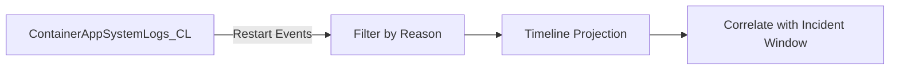

---
hide:
  - toc
content_sources:
  diagrams:
    - id: purpose-lists-restart-related-platform-events-to
      type: flowchart
      source: mslearn-adapted
      based_on:
        - https://learn.microsoft.com/azure/container-apps/log-monitoring
        - https://learn.microsoft.com/azure/container-apps/health-probes
        - https://learn.microsoft.com/kusto/query/
content_validation:
  status: verified
  last_reviewed: "2026-04-12"
  reviewer: ai-agent
  core_claims:
    - claim: "Azure Container Apps can send system logs that record platform events to a Log Analytics workspace."
      source: "https://learn.microsoft.com/azure/container-apps/logging"
      verified: true
    - claim: "Log Analytics uses Kusto Query Language to filter, summarize, and visualize collected log data."
      source: "https://learn.microsoft.com/azure/azure-monitor/logs/log-analytics-tutorial"
      verified: true
---

# Restart Timing Correlation

**Scenario**: Latency or error spikes appear to align with unknown events; need to verify if restarts are the cause.
**Data Source**: `ContainerAppSystemLogs_CL`
**Purpose**: Lists restart-related platform events to correlate with incident timelines.

<!-- diagram-id: purpose-lists-restart-related-platform-events-to -->


## Query

```kusto
let AppName = "my-container-app";
ContainerAppSystemLogs_CL
| where ContainerAppName_s == AppName
| where TimeGenerated > ago(24h)
| where Reason_s has_any (
    "ContainerTerminated", 
    "ContainerRestarted", 
    "ProbeFailed", 
    "OOMKilled",
    "BackOff",
    "CrashLoopBackOff"
)
| project TimeGenerated, RevisionName_s, ReplicaName_s, Reason_s, Log_s
| order by TimeGenerated desc
```

## Restart Events by Hour

```kusto
let AppName = "my-container-app";
ContainerAppSystemLogs_CL
| where ContainerAppName_s == AppName
| where TimeGenerated > ago(24h)
| where Reason_s has_any (
    "ContainerTerminated", 
    "ContainerRestarted", 
    "ProbeFailed",
    "OOMKilled"
)
| summarize RestartCount=count() by bin(TimeGenerated, 1h), Reason_s
| render timechart
```

## Example Output

| TimeGenerated | RevisionName_s | ReplicaName_s | Reason_s | Log_s |
|---|---|---|---|---|
| 2026-04-04T14:32:15Z | ca-myapp--abc123 | ca-myapp--abc123-7d8f9 | ContainerTerminated | Container exited with code 137 (OOMKilled) |
| 2026-04-04T14:30:02Z | ca-myapp--abc123 | ca-myapp--abc123-7d8f9 | ProbeFailed | Liveness probe failed: connection refused |
| 2026-04-04T14:28:45Z | ca-myapp--abc123 | ca-myapp--abc123-5c6d7 | ContainerRestarted | Container restarted after probe failure |
| 2026-04-04T12:15:00Z | ca-myapp--def456 | ca-myapp--def456-2a3b4 | ContainerTerminated | Container terminated normally |

## Interpretation Notes

- **Normal**: Occasional isolated restart events with no repeating cadence, typically during deployments or scale events.
- **Abnormal**: Clustered restart events during user-facing degradation windows.
- **Exit code 137**: OOM killed - container exceeded memory limit.
- **Exit code 1**: Application error or unhandled exception.
- **Reading tip**: Correlate event timestamps against 5xx spikes and P95/P99 increases in the same time window.

## Correlation with HTTP Errors

Combine with HTTP error query to verify correlation:

```kusto
let AppName = "my-container-app";
let Restarts = ContainerAppSystemLogs_CL
| where ContainerAppName_s == AppName
| where TimeGenerated > ago(6h)
| where Reason_s has_any ("ContainerTerminated", "ContainerRestarted", "ProbeFailed")
| summarize RestartCount=count() by bin(TimeGenerated, 5m);
let Errors = ContainerAppSystemLogs_CL
| where ContainerAppName_s == AppName
| where TimeGenerated > ago(6h)
| where Log_s has_any ("502", "503", "504", "error", "failed")
| summarize ErrorCount=count() by bin(TimeGenerated, 5m);
Restarts
| join kind=fullouter Errors on TimeGenerated
| project TimeGenerated, RestartCount=coalesce(RestartCount, 0), ErrorCount=coalesce(ErrorCount, 0)
| order by TimeGenerated asc
```

## Limitations

- Platform log availability and naming can vary by environment configuration.
- Some restart-like behaviors may use different `Reason_s` values not captured by this filter.
- This query cannot identify the root cause of restart (app crash vs platform action) by itself.
- OOM events may not always include explicit "OOMKilled" reason; check exit code 137.

## See Also

- [Restarts Query Pack](index.md)
- [Repeated Startup Attempts](repeated-startup-attempts.md)
- [Replica Crash Signals](../system-and-revisions/replica-crash-signals.md)
- [KQL Query Catalog](../index.md)

## Sources

- [Log monitoring in Azure Container Apps](https://learn.microsoft.com/azure/container-apps/log-monitoring)
- [Health probes in Azure Container Apps](https://learn.microsoft.com/azure/container-apps/health-probes)
- [Kusto Query Language (KQL) overview](https://learn.microsoft.com/kusto/query/)
