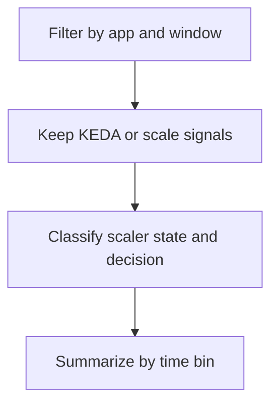

---
content_sources:
  diagrams:
    - id: query-pipeline
      type: flowchart
      source: mslearn-adapted
      based_on:
        - https://learn.microsoft.com/en-us/azure/container-apps/scale-app
        - https://learn.microsoft.com/en-us/azure/container-apps/observability
        - https://learn.microsoft.com/en-us/azure/azure-monitor/logs/log-analytics-tutorial
content_validation:
  status: verified
  last_reviewed: "2026-04-12"
  reviewer: ai-agent
  core_claims:
    - claim: "Azure Container Apps uses KEDA for automatic horizontal scaling, including custom scale rules."
      source: "https://learn.microsoft.com/azure/container-apps/scale-app"
      verified: true
    - claim: "Azure Monitor Log Analytics lets you use Kusto Query Language to analyze collected log data."
      source: "https://learn.microsoft.com/azure/azure-monitor/logs/log-analytics-tutorial"
      verified: true
---

# KEDA Scaler Metrics

Use this query to track KEDA scaler activation, deactivation, and related scale decisions in Container Apps system logs.

## Data Source

| Table | Schema Note |
|---|---|
| `ContainerAppSystemLogs_CL` | Legacy schema. If empty, try `ContainerAppSystemLogs` (non-`_CL`). |

## Query Pipeline

<!-- diagram-id: query-pipeline -->


## Query

```kusto
let AppName = "my-container-app";
let Window = 6h;
ContainerAppSystemLogs_CL
| where ContainerAppName_s == AppName and TimeGenerated >= ago(Window)
| where Log_s has_any ("keda", "scaler", "activate", "deactivate", "assigning replica", "scale-out", "scale-in")
| extend ScalerSignal = case(Log_s has "deactivate", "Deactivate", Log_s has "activate", "Activate", Log_s has "started", "Started", Log_s has "stopped", "Stopped", "Observe")
| extend ScaleDecision = case(Reason_s == "AssigningReplica" or Log_s has "scale-out", "ScaleOut", Log_s has "scale-in" or Log_s has "deactivate" or Log_s has "stopped", "ScaleIn", "NoDecision")
| summarize events=count(), sample_reason=take_any(Reason_s), sample_log=take_any(Log_s) by bin(TimeGenerated, 5m), RevisionName_s, ScalerSignal, ScaleDecision
| order by TimeGenerated asc, RevisionName_s asc
```

## Example Output

| TimeGenerated | RevisionName_s | ScalerSignal | ScaleDecision | events | sample_reason | sample_log |
|---|---|---|---|---:|---|---|
| 2026-04-12T05:57:38.558Z | ca-cakqltest-54kxmtjeuidri--nu8o2ji | Started | NoDecision | 1 | KEDAScalersStarted | KEDA is starting a watch for revision 'ca-cakqltest-54kxmtjeuidri--nu8o2ji' to monitor scale operations |
| 2026-04-12T05:57:38.558Z | ca-cakqltest-54kxmtjeuidri--nu8o2ji | Observe | ScaleOut | 1 | AssigningReplica | Replica 'ca-cakqltest-54kxmtjeuidri--nu8o2ji-5cbf89478b-hfgkq' has been scheduled to run on a node |

## Interpretation Notes

- Use `ScalerSignal` to separate lifecycle changes from actual scale decisions.
- Repeated `Activate` followed by `ScaleOut` indicates the scaler is seeing sustained demand.
- Frequent `Activate` and `Deactivate` cycles suggest threshold tuning or noisy workloads.

## Limitations

- System log text can vary by platform version, so keyword-based classification is best-effort.
- This query shows log-derived scaler behavior, not the raw trigger metric value from the scaler source.

## See Also

- [Scaling Events](scaling-events.md)
- [Scale In Delay Analysis](scale-in-delay-analysis.md)
