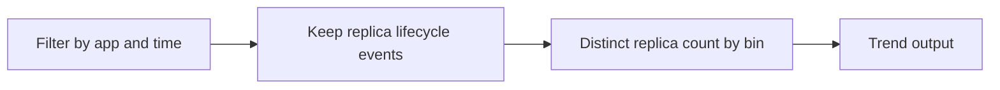

# Replica Count Over Time

Use this query to visualize how many replicas are active per revision over time and detect scaling plateaus.

## Data Source

| Table | Schema Note |
|---|---|
| `ContainerAppSystemLogs_CL` | Legacy schema. If empty, try `ContainerAppSystemLogs` (non-`_CL`). |

## Query Pipeline



## Query

```kusto
let AppName = "my-container-app";
let Window = 12h;
ContainerAppSystemLogs_CL
| where ContainerAppName_s == AppName and TimeGenerated >= ago(Window)
| where isnotempty(ReplicaName_s)
| summarize replicas=dcount(ReplicaName_s) by bin(TimeGenerated, 5m), RevisionName_s
| order by TimeGenerated asc
```

## Example Output

| TimeGenerated | RevisionName_s | replicas |
|---|---|---:|
| 2026-04-04T11:30:00.000Z | ca-myapp--0000001 | 1 |
| 2026-04-04T11:35:00.000Z | ca-myapp--0000001 | 2 |
| 2026-04-04T11:40:00.000Z | ca-myapp--0000001 | 3 |
| 2026-04-04T11:45:00.000Z | ca-myapp--0000001 | 2 |

## Interpretation Notes

- Flat low `replicas` under high load suggests scaling bottleneck.
- Sudden drops may indicate crash loops or rollbacks.
- Normal pattern: smooth increase/decrease aligned with traffic profile.

## Limitations

- Distinct count from logs is approximate and ingestion-dependent.
- Best used with platform metrics for exact replica counts.

## See Also

- [Scaling Events](scaling-events.md)
- [Event Scaler Mismatch Playbook](../../playbooks/scaling-and-runtime/event-scaler-mismatch.md)
