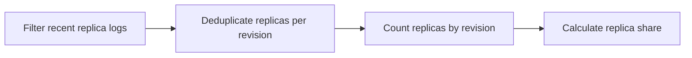

---
content_sources:
  diagrams:
    - id: query-pipeline
      type: flowchart
      source: mslearn-adapted
      based_on:
        - https://learn.microsoft.com/en-us/azure/container-apps/scale-app
        - https://learn.microsoft.com/en-us/azure/container-apps/observability
        - https://learn.microsoft.com/en-us/azure/azure-monitor/logs/log-analytics-tutorial
content_validation:
  status: verified
  last_reviewed: "2026-04-12"
  reviewer: ai-agent
  core_claims:
    - claim: "A revision is an immutable snapshot of a container app."
      source: "https://learn.microsoft.com/azure/container-apps/scale-app"
      verified: true
    - claim: "Azure Container Apps can run multiple revisions concurrently, and Log Analytics can compare log data across revisions."
      source: "https://learn.microsoft.com/azure/container-apps/observability"
      verified: true
---

# Replica Distribution by Revision

Use this query to show how active replicas are distributed across revisions so you can confirm multi-revision allocation during traffic splits or rollout validation.

## Data Source

| Table | Schema Note |
|---|---|
| `ContainerAppSystemLogs_CL` | Legacy schema. If empty, try `ContainerAppSystemLogs` (non-`_CL`). |

## Query Pipeline

<!-- diagram-id: query-pipeline -->


## Query

```kusto
let AppName = "my-container-app";
let Window = 30m;
let RevisionReplicaCounts =
    ContainerAppSystemLogs_CL
    | where ContainerAppName_s == AppName and TimeGenerated >= ago(Window)
    | where isnotempty(RevisionName_s) and isnotempty(ReplicaName_s)
    | summarize LastReplicaLog=max(TimeGenerated) by RevisionName_s, ReplicaName_s
    | summarize ActiveReplicas=dcount(ReplicaName_s), LastReplicaLog=max(LastReplicaLog) by RevisionName_s;
let TotalReplicas = toscalar(RevisionReplicaCounts | summarize sum(ActiveReplicas));
RevisionReplicaCounts
| extend ReplicaSharePercent = iff(TotalReplicas == 0, 0.0, round(100.0 * todouble(ActiveReplicas) / todouble(TotalReplicas), 1))
| order by ActiveReplicas desc, RevisionName_s asc
```

## Example Output

| RevisionName_s | ActiveReplicas | LastReplicaLog | ReplicaSharePercent |
|---|---:|---|---:|
| ca-myapp--0000002 | 4 | 2026-04-12T11:06:42.221Z | 66.7 |
| ca-myapp--0000001 | 2 | 2026-04-12T11:06:39.847Z | 33.3 |

## Interpretation Notes

- A dominant replica share on one revision usually matches the primary traffic target during a rollout.
- Similar replica counts across revisions can be normal during blue-green validation or deliberate traffic splitting.
- A revision with traffic but no recent replicas may indicate startup failures, zero-scale behavior, or stale query window selection.

## Limitations

- Replica counts are inferred from recent system log activity and may lag exact platform state.
- Revisions with no replica logs inside the selected window won't appear in the result set.

## See Also

- [Replica Count Over Time](replica-count-over-time.md)
- [Scaling Events](scaling-events.md)
