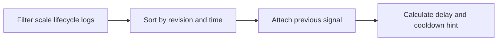

---
hide:
  - toc
content_sources:
  diagrams:
    - id: query-pipeline
      type: flowchart
      source: mslearn-adapted
      based_on:
        - https://learn.microsoft.com/en-us/azure/container-apps/scale-app
        - https://learn.microsoft.com/en-us/azure/container-apps/observability
        - https://learn.microsoft.com/en-us/azure/azure-monitor/logs/log-analytics-tutorial
content_validation:
  status: verified
  last_reviewed: "2026-04-12"
  reviewer: ai-agent
  core_claims:
    - claim: "For custom scale rules, Azure Container Apps uses default KEDA values of 30 seconds polling interval and 300 seconds cooldown."
      source: "https://learn.microsoft.com/azure/container-apps/scale-app"
      verified: true
    - claim: "Azure Container Apps observability includes Log Analytics for querying and analyzing system logs."
      source: "https://learn.microsoft.com/azure/container-apps/observability"
      verified: true
---

# Scale In Delay Analysis

Use this query to estimate how long a revision waits between the previous scale signal and a scale-in event, which helps identify cooldown-driven behavior.

## Data Source

| Table | Schema Note |
|---|---|
| `ContainerAppSystemLogs_CL` | Legacy schema. If empty, try `ContainerAppSystemLogs` (non-`_CL`). |

## Query Pipeline

<!-- diagram-id: query-pipeline -->


## Query

```kusto
let AppName = "my-container-app";
let Window = 24h;
ContainerAppSystemLogs_CL
| where ContainerAppName_s == AppName and TimeGenerated >= ago(Window)
| where isnotempty(RevisionName_s)
| where Log_s has_any ("scale", "keda", "replica", "cooldown", "deactivate", "assigning replica", "terminating")
| project TimeGenerated, RevisionName_s, ReplicaName_s, Reason_s, Log_s
| order by RevisionName_s asc, TimeGenerated asc
| serialize
| extend PreviousTimeGenerated = iff(prev(RevisionName_s) == RevisionName_s, prev(TimeGenerated), datetime(null))
| extend PreviousReason_s = iff(prev(RevisionName_s) == RevisionName_s, prev(Reason_s), "")
| extend ScaleInSignal = case(Log_s has "cooldown", "Cooldown", Log_s has "deactivate", "ScalerDeactivation", Log_s has "scale-in", "ScaleIn", Log_s has "terminating", "ReplicaTermination", "Other")
| where ScaleInSignal != "Other"
| extend DelaySeconds = datetime_diff('second', TimeGenerated, PreviousTimeGenerated)
| extend CooldownAssessment = case(isnull(PreviousTimeGenerated), "No prior scale signal in window", DelaySeconds >= 300, "At or above 300s custom cooldown", DelaySeconds >= 240, "Near 300s cooldown", "Shorter than 300s cooldown")
| project TimeGenerated, RevisionName_s, ReplicaName_s, ScaleInSignal, DelaySeconds, PreviousReason_s, CooldownAssessment
| order by TimeGenerated desc
```

## Example Output

| TimeGenerated | RevisionName_s | ReplicaName_s | ScaleInSignal | DelaySeconds | PreviousReason_s | CooldownAssessment |
|---|---|---|---|---:|---|---|
| 2026-04-12T10:18:47.551Z | ca-myapp--0000001 | ca-myapp--0000001-6f87d9bd77-cs92n | ScalerDeactivation | 308 | AssigningReplica | At or above 300s custom cooldown |
| 2026-04-12T10:18:51.903Z | ca-myapp--0000001 | ca-myapp--0000001-6f87d9bd77-cs92n | ReplicaTermination | 4 | KEDAScalersStopped | Shorter than 300s cooldown |
| 2026-04-12T11:02:15.114Z | ca-myapp--0000002 | ca-myapp--0000002-78d6d4b9d9-8wqqm | ScaleIn | 252 | AssigningReplica | Near 300s cooldown |

## Interpretation Notes

- Delays around 300 seconds are consistent with the default custom scaler cooldown used when the final replica scales to zero.
- Very short delays after a deactivation event usually indicate the platform is already committing the replica removal sequence.
- Compare revisions to isolate whether only one revision experiences long scale-in delays.

## Limitations

- This is an inferred cooldown view based on adjacent log records, not a direct platform timer.
- The 300 second default applies only to custom scale rules when scaling from the last replica to zero.

## See Also

- [KEDA Scaler Metrics](keda-scaler-metrics.md)
- [Replica Count Over Time](replica-count-over-time.md)
