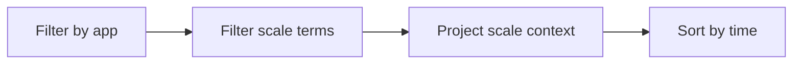

---
hide:
  - toc
---

# Scaling Events

Use this query to inspect scale-out and scale-in related system signals for KEDA and platform scaling decisions.

## Data Source

| Table | Schema Note |
|---|---|
| `ContainerAppSystemLogs_CL` | Legacy schema. If empty, try `ContainerAppSystemLogs` (non-`_CL`). |

## Query Pipeline



## Query

```kusto
let AppName = "my-container-app";
ContainerAppSystemLogs_CL
| where ContainerAppName_s == AppName
| where Log_s has_any ("scale", "keda", "replica", "autoscale", "trigger")
| project TimeGenerated, RevisionName_s, ReplicaName_s, Reason_s, Log_s
| order by TimeGenerated desc
```

## Example Output

| TimeGenerated | RevisionName_s | ReplicaName_s | Reason_s | Log_s |
|---|---|---|---|---|
| 2026-04-04T11:37:08.918Z | ca-myapp--0000001 |  | KEDAScalersStarted | KEDA scaler started for revision |
| 2026-04-04T11:37:15.102Z | ca-myapp--0000001 | ca-myapp--0000001-6cc5f7cc66-vk4pp | AssigningReplica | Assigning replica for scale-out |
| 2026-04-04T11:37:23.741Z | ca-myapp--0000001 | ca-myapp--0000001-6cc5f7cc66-vk4pp | ContainerStarted | Started container after scale event |

## Interpretation Notes

- Pair this with load metrics to evaluate scaling lag.
- Frequent scale oscillation indicates threshold or stabilization tuning needs.
- Normal pattern: predictable scale reactions during known traffic peaks.

## Limitations

- Text terms may vary by runtime platform version.
- Does not directly expose source metric values for all triggers.

## See Also

- [Replica Count Over Time](replica-count-over-time.md)
- [HTTP Scaling Not Triggering Playbook](../../playbooks/scaling-and-runtime/http-scaling-not-triggering.md)
