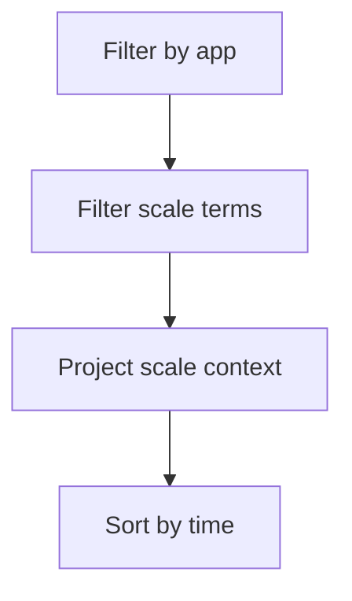

---
content_sources:
  diagrams:
    - id: query-pipeline
      type: flowchart
      source: mslearn-adapted
      based_on:
        - https://learn.microsoft.com/en-us/azure/container-apps/scale-app
        - https://learn.microsoft.com/en-us/azure/container-apps/observability
        - https://learn.microsoft.com/en-us/azure/container-apps/troubleshooting
content_validation:
  status: verified
  last_reviewed: "2026-04-12"
  reviewer: ai-agent
  core_claims:
    - claim: "Azure Container Apps can send system logs that record platform events to a Log Analytics workspace."
      source: "https://learn.microsoft.com/azure/container-apps/logging"
      verified: true
    - claim: "Log Analytics uses Kusto Query Language to filter, summarize, and visualize collected log data."
      source: "https://learn.microsoft.com/azure/azure-monitor/logs/log-analytics-tutorial"
      verified: true
---

# Scaling Events

Use this query to inspect scale-out and scale-in related system signals for KEDA and platform scaling decisions.

## Data Source

| Table | Schema Note |
|---|---|
| `ContainerAppSystemLogs_CL` | Legacy schema. If empty, try `ContainerAppSystemLogs` (non-`_CL`). |

## Query Pipeline

<!-- diagram-id: query-pipeline -->


## Query

```kusto
let AppName = "my-container-app";
ContainerAppSystemLogs_CL
| where ContainerAppName_s == AppName
| where Log_s has_any ("scale", "keda", "replica", "autoscale", "trigger")
| project TimeGenerated, RevisionName_s, ReplicaName_s, Reason_s, Log_s
| order by TimeGenerated desc
```

## Example Output

| TimeGenerated | RevisionName_s | ReplicaName_s | Reason_s | Log_s |
|---|---|---|---|---|
| 2026-04-12T05:57:38.558Z | ca-cakqltest-54kxmtjeuidri--nu8o2ji |  | KEDAScalersStarted | KEDA is starting a watch for revision 'ca-cakqltest-54kxmtjeuidri--nu8o2ji' to monitor scale operations |
| 2026-04-12T05:57:38.558Z | ca-cakqltest-54kxmtjeuidri--nu8o2ji | ca-cakqltest-54kxmtjeuidri--nu8o2ji-5cbf89478b-hfgkq | AssigningReplica | Replica 'ca-cakqltest-54kxmtjeuidri--nu8o2ji-5cbf89478b-hfgkq' has been scheduled to run on a node |

## Interpretation Notes

- Pair this with load metrics to evaluate scaling lag.
- Frequent scale oscillation indicates threshold or stabilization tuning needs.
- Normal pattern: predictable scale reactions during known traffic peaks.

## Limitations

- Text terms may vary by runtime platform version.
- Does not directly expose source metric values for all triggers.

## See Also

- [Replica Count Over Time](replica-count-over-time.md)
- [HTTP Scaling Not Triggering Playbook](../../playbooks/scaling-and-runtime/http-scaling-not-triggering.md)
