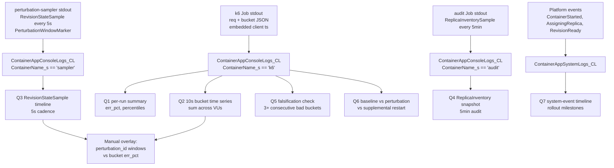

---
content_sources:
  diagrams:
    - id: query-pipeline
      type: flowchart
      source: self-generated
      justification: "Synthesized from MS Learn KQL guidance plus the loadgen/sampler schema introduced in labs/startup-degraded-transient-failure. No single MS Learn article describes this pipeline because the bucket, RevisionStateSample, ReplicaInventorySample, and PerturbationWindowMarker events are lab-emitted, not platform-emitted."
      based_on:
        - https://learn.microsoft.com/en-us/azure/container-apps/log-monitoring
        - https://learn.microsoft.com/en-us/azure/azure-monitor/reference/tables/containerappconsolelogs
        - https://learn.microsoft.com/en-us/azure/azure-monitor/reference/tables/containerappsystemlogs
        - https://learn.microsoft.com/en-us/kusto/query/parse-json-function
        - https://learn.microsoft.com/en-us/kusto/query/extract-function
content_validation:
  status: verified
  last_reviewed: '2026-06-12'
  reviewer: agent
  core_claims:
    - claim: Container Apps ships container stdout to Log Analytics under ContainerAppConsoleLogs_CL, including output from Jobs.
      source: https://learn.microsoft.com/en-us/azure/container-apps/log-monitoring
      verified: true
    - claim: Container Apps emits platform system events (ContainerStarted, ContainerTerminated, AssigningReplica, RevisionReady) to ContainerAppSystemLogs_CL.
      source: https://learn.microsoft.com/en-us/azure/azure-monitor/reference/tables/containerappsystemlogs
      verified: true
    - claim: Kusto's parse_json and extract functions extract structured fields from JSON and from text wrapped in a logger format.
      source: https://learn.microsoft.com/en-us/kusto/query/parse-json-function
      verified: true
---
# Startup-Degraded Bucketed 5xx KQL Pack

**Scenario**: Investigate whether ACA's rolling-revision rollout fully masks transient client-visible 5xx errors when the subject app has a deterministic 25-second startup delay. Test the falsification rule: ANY sustained window of ≥3 consecutive 10-second buckets above 0.5% `err_pct` during a perturbation event is sufficient to falsify the "ACA masks all transients" claim.

**Data sources**:

| Table | Used for |
|---|---|
| `ContainerAppConsoleLogs_CL` (`ContainerName_s == "k6"`) | Per-request and per-bucket JSON lines from the k6 loadgen Job (k6 wraps each line in a `time="..." msg="..."` logfmt envelope; see "Why `extract` + `replace_string` precede `parse_json`" below). |
| `ContainerAppConsoleLogs_CL` (`ContainerName_s == "sampler"`) | `RevisionStateSample` + `PerturbationWindowMarker` JSON lines every 5 seconds around each rollout event (emitted by the perturbation-sampler Job's `sampler` container — plain JSON, no logfmt wrapper). |
| `ContainerAppConsoleLogs_CL` (`ContainerName_s == "audit"`) | `ReplicaInventorySample` JSON lines on a slow baseline cadence (emitted by the audit-sampler Job's `audit` container — plain JSON, no logfmt wrapper). |
| `ContainerAppSystemLogs_CL` | Platform-emitted `ContainerStarted` / `ContainerTerminated` / `RevisionReady` events for subject app. |

!!! note "Container name vs Job name"
    `ContainerName_s` is the container name from the Bicep `containers[].name` field, NOT the Job/Container App name. A query that filters on `ContainerName_s == "perturbation-sampler"` (the Job name) returns **zero rows**; the correct filter is `ContainerName_s == "sampler"`. Same for `audit-sampler` → `audit` and `loadgen-k6` → `k6`. See the companion lab guide's "Known issues observed in this repro" subsection for the full mapping table.

!!! note "Custom `_CL` tables do not exist for this lab"
    The lab does NOT create custom Log Analytics tables (no `LoadgenSample_CL`, `RevisionStateSample_CL`, `ReplicaInventorySample_CL`, or `PerturbationWindowMarker_CL`). All structured data is shipped as JSON inside `ContainerAppConsoleLogs_CL.Log_s` and must be parsed with `parse_json(Log_s)` (or the k6 `extract`+`replace_string`+`parse_json` chain). Any pre-existing operator query that references `*Sample_CL` tables for this lab is stale and will return zero rows.

**Companion lab**: [Startup-degraded transient failure](../../lab-guides/startup-degraded-transient-failure.md).

## Query Pipeline

<!-- diagram-id: query-pipeline -->


## Why bucket sum-across-VUs is mandatory

The k6 script uses `constant-arrival-rate` with 50 VUs and emits buckets via a per-VU module-level `const buckets = {}`. Each of the 50 VUs emits its OWN bucket row per 10-second window, so at the LAW row level there are ~50 duplicate `(run_id, bucket_iso)` rows per actual time window. Every bucket-based query in this pack uses `summarize sum(count_), sum(ok_), sum(err_) by run_id, bucket_iso` to merge them. Skipping that summary divides total counts by ~50 and inflates `err_pct` proportionally — silently wrong, no error message.

## Why `extract` + `replace_string` precede `parse_json`

The ACA log shipper wraps container stdout into the Logrus structured format:

```text
time="2026-06-12T13:30:00Z" level=info msg="{\"kind\":\"req\",\"run_id\":\"...\"}" source=console
```

The literal payload is the value of `msg=`, but every `"` inside it is escaped to `\"`. `parse_json` does not strip the escape — it returns `null`. The two-step unwrap is:

```kusto
| extend body_raw = extract(@'msg="(.+)" source=console', 1, Log_s)
| extend body = replace_string(body_raw, @'\"', '"')
| extend payload = parse_json(body)
```

Skip either step and `payload` is `null` for every row.

## Q1 — Per-Run Summary

`[Measured]` evidence — request totals, error totals, percentiles, and `err_pct` for each `run_id` matching the pattern. Run this immediately after a k6 job completes to confirm the run produced data and to read the headline `err_pct`.

```kusto
ContainerAppConsoleLogs_CL
| where TimeGenerated >= ago(3h)
| where ContainerName_s == "k6"
| where Log_s has "<run_id_pattern>"
| extend body_raw = extract(@'msg="(.+)" source=console', 1, Log_s)
| where isnotempty(body_raw)
| extend body = replace_string(body_raw, @'\"', '"')
| extend payload = parse_json(body)
| extend event_kind = tostring(payload.kind)
| extend run_id = tostring(payload.run_id)
| extend dur_ms = todouble(payload.dur_ms)
| extend ok = tobool(payload.ok)
| where event_kind == "req"
| summarize
    requests = count(),
    ok_count = countif(ok),
    err_count = countif(not(ok)),
    p50_ms = round(percentile(dur_ms, 50), 1),
    p95_ms = round(percentile(dur_ms, 95), 1),
    p99_ms = round(percentile(dur_ms, 99), 1),
    max_ms = round(max(dur_ms), 1)
  by run_id
| extend err_pct = round(100.0 * err_count / requests, 3)
| project run_id, requests, ok_count, err_count, err_pct, p50_ms, p95_ms, p99_ms, max_ms
| order by run_id asc
```

**Healthy baseline result**: `err_pct == 0` (or strictly less than 0.5%) with `requests` close to `target_rps × duration_seconds × 0.85`. A baseline `err_pct > 0` invalidates the entire perturbation comparison — see Q5 for the falsification rule and Q6 for headroom estimation.

**`requests` count interpretation**: k6's constant-arrival-rate scheduler may report fewer achieved RPS than requested when downstream queueing exceeds VU capacity. In the lab's preflight, 200 RPS achieved ~169 RPS (85%) — sub-saturation queueing, not failure. See the lab guide's "Section 6: Execution" for the headroom curve.

## Q2 — 10-Second Bucket Time Series (Sum Across VUs)

`[Measured]` evidence — `err_pct` per 10-second client-side bucket, joined with the per-request percentile distribution for the same bucket. This is the primary signal for the falsification rule and the only query that surfaces sub-minute transient bursts.

```kusto
let req = ContainerAppConsoleLogs_CL
| where TimeGenerated >= ago(3h)
| where ContainerName_s == "k6"
| where Log_s has "<run_id_pattern>"
| extend body_raw = extract(@'msg="(.+)" source=console', 1, Log_s)
| where isnotempty(body_raw)
| extend body = replace_string(body_raw, @'\"', '"')
| extend payload = parse_json(body)
| extend event_kind = tostring(payload.kind)
| extend run_id = tostring(payload.run_id)
| extend client_ts = todatetime(payload.ts)
| extend dur_ms = todouble(payload.dur_ms)
| where event_kind == "req"
| extend bucket_iso = bin(client_ts, 10s)
| summarize p50_ms = round(percentile(dur_ms, 50), 1),
            p95_ms = round(percentile(dur_ms, 95), 1),
            p99_ms = round(percentile(dur_ms, 99), 1)
        by run_id, bucket_iso;
let rawBuckets = ContainerAppConsoleLogs_CL
| where TimeGenerated >= ago(3h)
| where ContainerName_s == "k6"
| where Log_s has "<run_id_pattern>"
| extend body_raw = extract(@'msg="(.+)" source=console', 1, Log_s)
| where isnotempty(body_raw)
| extend body = replace_string(body_raw, @'\"', '"')
| extend payload = parse_json(body)
| extend event_kind = tostring(payload.kind)
| where event_kind == "bucket"
| extend run_id = tostring(payload.run_id)
| extend bucket_iso = todatetime(payload.bucket_start_iso)
| extend count_ = toint(payload.count)
| extend ok_ = toint(payload.ok)
| extend err_ = toint(payload.err)
| summarize total_count = sum(count_), total_ok = sum(ok_), total_err = sum(err_) by run_id, bucket_iso;
let bucketBounds = rawBuckets
| summarize start_bucket = min(bucket_iso), end_bucket = max(bucket_iso) by run_id;
let control = bucketBounds
| mv-expand bucket_iso = range(start_bucket, end_bucket, 10s) to typeof(datetime)
| project run_id, bucket_iso;
control
| join kind=leftouter rawBuckets on run_id, bucket_iso
| extend total_count = coalesce(total_count, 0),
         total_ok = coalesce(total_ok, 0),
         total_err = coalesce(total_err, 0)
| extend err_pct = iff(total_count == 0, 0.0, round(100.0 * total_err / total_count, 3))
| join kind=leftouter (req) on run_id, bucket_iso
| project run_id, bucket_iso, total_count, total_ok, total_err, err_pct, p50_ms, p95_ms, p99_ms
| order by run_id asc, bucket_iso asc
```

**Why client-side timestamps**: The bucket boundary uses `bucket_start_iso` (a string the k6 VU emits at the start of each 10s window) and request rows are binned by `client_ts` (the VU-recorded timestamp at request issue). LAW's `TimeGenerated` reflects ingestion, not request issue, and drifts up to several seconds; using `TimeGenerated` for binning would smear traffic across buckets and break the falsification rule.

## Q3 — Revision State Timeline (5-Second Cadence)

`[Observed]` evidence — the high-frequency `RevisionStateSample` series emitted by the `perturbation-sampler` Job during each perturbation event. Plus `PerturbationWindowMarker` rows at start/end with the `perturbation_id` for KQL join. Use this to overlay rollout milestones onto Q2's bucket series.

```kusto
ContainerAppConsoleLogs_CL
| where TimeGenerated >= ago(3h)
| where ContainerName_s == "sampler"
| extend payload = parse_json(Log_s)
| extend event_kind = tostring(payload.kind)
| extend perturbation_id = tostring(payload.perturbation_id)
| where perturbation_id startswith "<perturbation_id_prefix>"
| extend app = tostring(payload.app)
| extend revision = tostring(payload.revision)
| extend active = tobool(payload.active)
| extend replicas = toint(payload.replicas)
| extend traffic_weight = toint(payload.traffic_weight)
| extend provisioning_state = tostring(payload.provisioning_state)
| extend client_ts = todatetime(payload.ts)
| where event_kind in ("RevisionStateSample", "PerturbationWindowMarker")
| project client_ts, perturbation_id, event_kind, app, revision, active, replicas, traffic_weight, provisioning_state
| order by perturbation_id asc, client_ts asc
```

**Interpretation**: The sequence of `(revision, active, traffic_weight, replicas, provisioning_state)` rows captures the exact moment of revision transition. Healthy rollout: old revision goes `active=false, traffic_weight=0` while new revision goes `active=true, traffic_weight=100` and `replicas` ramps to 3. Look for the duration between `PerturbationWindowMarker(phase=start)` and the new revision's first `provisioning_state=Succeeded` sample — that bracket is where Q2 5xx spikes are causally attributable to the rollout.

The perturbation-sampler is unlike the slow audit Job — it does not emit `event` (which `parse_json` parses cleanly out of raw stdout) but emits `kind` directly. The shell script writes JSON to stdout via `jq --null-input`, so the ACA log shipper records the raw JSON in `Log_s` without the Logrus wrapper. That is why this query uses `parse_json(Log_s)` directly, while Q1/Q2 use the `extract`+`replace_string`+`parse_json` chain.

## Q4 — Replica Inventory Snapshot (Continuous Daemon Sampling)

`[Correlated]` evidence — continuous-cadence baseline running from the audit-sampler Job (the `audit` container samples replica inventory every 30 seconds for the duration of each execution). Use to establish that subject-app replicas are reliably 3-of-3 Running OUTSIDE perturbation windows, and to detect any drift that would invalidate the lab's pre-perturbation steady-state assumption.

!!! warning "Audit-sampler job executions appear `Failed` in the Portal"
    The audit-sampler is a cron-triggered job (`*/5 * * * *`) with `replicaTimeout=240`s, but the `audit` container runs as a long-lived sampler daemon. The platform sends SIGTERM at 240s, the container exits non-zero, and ACA marks the execution as `Failed`. **Data ingestion is unaffected** — every audit container's first ~240 seconds of `ReplicaInventorySample` rows are present in `ContainerAppConsoleLogs_CL`. Operators must NOT alert on audit-sampler execution failure count. See the companion lab guide's "audit-sampler 'Failed' executions are benign" subsection.

```kusto
ContainerAppConsoleLogs_CL
| where TimeGenerated >= ago(<hours_back>h)
| where ContainerName_s == "audit"
| extend payload = parse_json(Log_s)
| extend event_kind = tostring(payload.kind)
| where event_kind == "ReplicaInventorySample"
| extend app = tostring(payload.app)
| extend revision = tostring(payload.revision)
| extend replica = tostring(payload.replica)
| extend running_state = tostring(payload.running_state)
| extend client_ts = todatetime(payload.ts)
| summarize sample_count = count(),
            running_count = countif(running_state == "Running"),
            unique_replicas = dcount(replica),
            unique_revisions = dcount(revision),
            first_sample = min(client_ts),
            last_sample = max(client_ts)
        by app
| extend running_pct = round(100.0 * running_count / sample_count, 2)
| order by app asc
```

**Healthy baseline**: `running_pct == 100.0` and `unique_replicas` close to `3 × number_of_revisions_in_window`. If `running_pct < 99` during a window with no perturbation, the platform is producing background churn unrelated to the lab and downstream Q2/Q5 results should be re-interpreted accordingly.

## Q5 — Falsification: 3+ Consecutive Bad Buckets

`[Measured]` evidence — directly answers the lab's binding falsification rule. Returns one row per `run_id` with `falsified=true` if any window of 3 consecutive 10-second buckets above 0.5% `err_pct` exists, plus the bucket count and time range of the falsification window.

```kusto
let rawBuckets = ContainerAppConsoleLogs_CL
| where TimeGenerated >= ago(3h)
| where ContainerName_s == "k6"
| where Log_s has "<run_id_pattern>"
| extend body_raw = extract(@'msg="(.+)" source=console', 1, Log_s)
| where isnotempty(body_raw)
| extend body = replace_string(body_raw, @'\"', '"')
| extend payload = parse_json(body)
| extend event_kind = tostring(payload.kind)
| where event_kind == "bucket"
| extend run_id = tostring(payload.run_id)
| extend bucket_iso = todatetime(payload.bucket_start_iso)
| extend count_ = toint(payload.count)
| extend err_ = toint(payload.err)
| summarize total_count = sum(count_), total_err = sum(err_) by run_id, bucket_iso;
let bucketBounds = rawBuckets
| summarize start_bucket = min(bucket_iso), end_bucket = max(bucket_iso) by run_id;
let control = bucketBounds
| mv-expand bucket_iso = range(start_bucket, end_bucket, 10s) to typeof(datetime)
| project run_id, bucket_iso;
let buckets = control
| join kind=leftouter rawBuckets on run_id, bucket_iso
| extend total_count = coalesce(total_count, 0),
         total_err = coalesce(total_err, 0)
| extend err_pct = iff(total_count == 0, 0.0, round(100.0 * total_err / total_count, 3))
| extend bad_bucket = iff(err_pct > 0.5, 1, 0)
| order by run_id asc, bucket_iso asc;
buckets
| serialize
| extend prev1_bad = prev(bad_bucket, 1), prev2_bad = prev(bad_bucket, 2),
         prev1_run = prev(run_id, 1), prev2_run = prev(run_id, 2)
| extend is_3_window_end = (bad_bucket == 1 and prev1_bad == 1 and prev2_bad == 1
                            and run_id == prev1_run and run_id == prev2_run)
| where is_3_window_end
| summarize falsification_windows = count(),
            first_window_end = min(bucket_iso),
            last_window_end = max(bucket_iso)
        by run_id
| extend falsified = (falsification_windows > 0)
| project run_id, falsified, falsification_windows, first_window_end, last_window_end
```

**Why control buckets**: The `let control` step generates one synthetic row per 10-second slot between the run's first and last data-emitting bucket. The leftouter join onto `rawBuckets` then coalesces missing slots to `total_count = 0, total_err = 0`. This guarantees that the `prev()` window function in the falsification step is operating on a **contiguous** time series — without it, a missing bucket in the middle of a run (caused by a loadgen stall or a brief LAW ingestion gap) would silently shift the `prev1`/`prev2` rows to non-adjacent timestamps and break the "3 consecutive 10-second buckets" semantic of the lab's falsification rule. This implements the lab's design constraint #7 ("include control buckets for empty-bin handling").

**Interpretation**:

- `falsified == true` with `falsification_windows >= 1` → the "ACA masks all transients" claim is `[Measured]` falsified for this `run_id`.
- Empty result (no row for the `run_id`) → no 3-bucket window exceeds the threshold; the claim is **not falsified** by this run. Note this is weaker than "claim is confirmed" — see the lab guide's Conclusion section for the asymmetry.
- The `prev()` window-function approach requires `serialize` and `order by` to be deterministic. The `run_id == prev_run` guards prevent a falsification window from spanning two different runs.

## Q6 — Baseline vs Perturbation vs Supplemental Restart

`[Measured]` evidence — phase-level aggregation comparing the three phases (baseline / perturbation / supplemental-restart) by total error rate and worst-bucket error rate. This is the headline H0 verdict.

```kusto
let rawBuckets = ContainerAppConsoleLogs_CL
| where TimeGenerated >= ago(6h)
| where ContainerName_s == "k6"
| extend body_raw = extract(@'msg="(.+)" source=console', 1, Log_s)
| where isnotempty(body_raw)
| extend body = replace_string(body_raw, @'\"', '"')
| extend payload = parse_json(body)
| extend event_kind = tostring(payload.kind)
| where event_kind == "bucket"
| extend run_id = tostring(payload.run_id)
| extend bucket_iso = todatetime(payload.bucket_start_iso)
| extend count_ = toint(payload.count)
| extend ok_ = toint(payload.ok)
| extend err_ = toint(payload.err)
| summarize total_count = sum(count_), total_ok = sum(ok_), total_err = sum(err_) by run_id, bucket_iso;
let bucketBounds = rawBuckets
| summarize start_bucket = min(bucket_iso), end_bucket = max(bucket_iso) by run_id;
let control = bucketBounds
| mv-expand bucket_iso = range(start_bucket, end_bucket, 10s) to typeof(datetime)
| project run_id, bucket_iso;
let allBuckets = control
| join kind=leftouter rawBuckets on run_id, bucket_iso
| extend total_count = coalesce(total_count, 0),
         total_ok = coalesce(total_ok, 0),
         total_err = coalesce(total_err, 0)
| extend err_pct = iff(total_count == 0, 0.0, round(100.0 * total_err / total_count, 3));
allBuckets
| extend phase = case(
    run_id startswith "baseline-", "baseline",
    run_id startswith "perturbation-", "perturbation",
    run_id startswith "supplemental-", "supplemental-restart",
    "other")
| summarize buckets = count(),
            total_requests = sum(total_count),
            total_errors = sum(total_err),
            worst_bucket_err_pct = round(max(err_pct), 3),
            buckets_above_0p5pct = countif(err_pct > 0.5)
        by phase
| extend overall_err_pct = round(100.0 * total_errors / total_requests, 4)
| order by phase asc
```

**Interpretation**:

- `overall_err_pct` is the **client-visible** error rate over all buckets in the phase. This is `[Measured]` regardless of cause.
- `worst_bucket_err_pct` is the peak transient — the bucket where the platform's protection was thinnest.
- `buckets_above_0p5pct` is the count of bad buckets across all runs in the phase. If the perturbation phase has materially more than the baseline phase, that is `[Measured]` evidence of perturbation-induced client-visible degradation.

**Causal attribution caveat**: Even when perturbation-phase numbers are decisively worse than baseline, attributing the cause to "platform-initiated rolling rollout behavior" rather than "the new replicas of the subject app are slow to warm up" or "the LB cached connections to terminating replicas" is capped at **[Strongly Suggested]** per the lab's design constraints. Q3 (RevisionStateSample timeline) and Q7 (system events) provide circumstantial corroboration but no smoking gun.

## Q7 — System Events Timeline (Rollout Milestones)

`[Observed]` evidence — platform-emitted rollout milestones for the subject app. Use to corroborate the `perturbation-sampler`-derived view in Q3 and to detect anomalies (failed scale-up, container restart loops) that the sampler cannot see.

```kusto
ContainerAppSystemLogs_CL
| where TimeGenerated >= ago(<hours_back>h)
| where ContainerAppName_s == "subject-app"
| where Reason_s in ("ContainerTerminated", "ContainerStarted", "AssigningReplica",
                     "RevisionReady", "FailedScalingUp", "ContainerCreating")
| project TimeGenerated, RevisionName_s, ReplicaName_s, Reason_s, Log_s
| order by TimeGenerated asc
```

**Interpretation**:

- A clean rollout fires `AssigningReplica` → `ContainerCreating` → `ContainerStarted` → `RevisionReady` for each new replica. The 25-second startup delay shows as ~25 seconds between `ContainerStarted` and `RevisionReady`.
- `FailedScalingUp` rows indicate the platform could not satisfy the new revision's min-replicas constraint — this is a different failure mode than transient 5xx and would explain a `provisioning_state == "Failed"` row in Q3.
- The 5-minute audit (Q4) under-samples this signal; the `perturbation-sampler` (Q3) and system-event timeline (Q7) are the high-resolution sources.

## Bucket time alignment between phases

When comparing baseline buckets against perturbation buckets, do NOT join on `bucket_iso` — the two phases occur at disjoint wall-clock intervals. The correct comparison is the aggregate-by-`phase` shape in Q6, or for visual overlay: project each phase's buckets onto a relative time axis (`bucket_offset_seconds = datetime_diff('second', bucket_iso, phase_start)`) and plot the two `err_pct` curves on the same offset axis.

## Limitations

- **Per-VU bucket duplication**: As noted at the top, the k6 script's per-VU buckets MUST be summed before joining. The harness's Q1/Q2/Q5/Q6 all do this; ad-hoc queries written by analysts have repeatedly missed it. The symptom is `err_pct` values 50× too high (one row per VU per bucket).
- **`Log_s` parsing format dependency**: Q1/Q2/Q5/Q6 depend on the k6 image's stdout being captured by Logrus's `time="..." level=info msg="..." source=console` wrapper. If the k6 image is changed, verify the format with `ContainerAppConsoleLogs_CL | where ContainerName_s == "k6" | take 5`.
- **Causal attribution ceiling**: All conclusions about "platform-initiated cause" are capped at `[Strongly Suggested]` per the lab's design constraints. Client-visible 5xx outcomes can be `[Measured]`. See the lab guide's Section 10 Conclusion for the full discussion.
- **RPS achievement**: k6 reports requests issued, not requests acknowledged at the target rate. Sub-saturation queueing manifests as a lower `requests` count and elevated `p50_ms` per Q1; this is a load-shaping property of constant-arrival-rate, not a failure.
- **Sampler cadence vs bucket cadence**: The `perturbation-sampler` runs at 5-second cadence, but the bucket time series is at 10-second cadence. When overlaying Q3 onto Q2, you will see 2 sampler rows per bucket window; bin Q3 to 10s if you need a one-to-one alignment.

## See Also

- [Lab: Startup-degraded transient failure](../../lab-guides/startup-degraded-transient-failure.md)
- [Zone-Redundancy Mass-Reschedule KQL Pack](zone-redundancy-mass-reschedule.md)
- [Replica Count Over Time](replica-count-over-time.md)
- [Restart Timing Correlation](../restarts/restart-timing-correlation.md)

## Sources

- [Log monitoring in Azure Container Apps](https://learn.microsoft.com/en-us/azure/container-apps/log-monitoring)
- [ContainerAppConsoleLogs table reference](https://learn.microsoft.com/en-us/azure/azure-monitor/reference/tables/containerappconsolelogs)
- [ContainerAppSystemLogs table reference](https://learn.microsoft.com/en-us/azure/azure-monitor/reference/tables/containerappsystemlogs)
- [Kusto parse_json function](https://learn.microsoft.com/en-us/kusto/query/parse-json-function)
- [Kusto extract function](https://learn.microsoft.com/en-us/kusto/query/extract-function)
- [Kusto replace_string function](https://learn.microsoft.com/en-us/kusto/query/replace-string-function)
- [Kusto prev function and serialize operator](https://learn.microsoft.com/en-us/kusto/query/prev-function)
- [Container Apps revisions](https://learn.microsoft.com/en-us/azure/container-apps/revisions)
- [Container Apps rolling updates and rollouts](https://learn.microsoft.com/en-us/azure/container-apps/blue-green-deployment)
