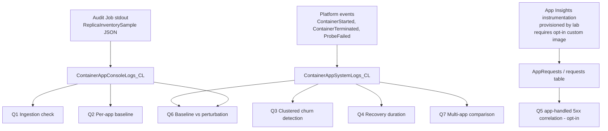

---
content_sources:
  diagrams:
    - id: query-pipeline
      type: flowchart
      source: self-generated
      justification: "Synthesized from MS Learn KQL guidance plus the audit-Job schema introduced in labs/zone-redundancy-best-effort. No single MS Learn article describes this pipeline because the ReplicaInventorySample event is lab-emitted, not platform-emitted."
      based_on:
        - https://learn.microsoft.com/en-us/azure/container-apps/log-monitoring
        - https://learn.microsoft.com/en-us/azure/azure-monitor/reference/tables/containerappconsolelogs
        - https://learn.microsoft.com/en-us/azure/azure-monitor/reference/tables/containerappsystemlogs
        - https://learn.microsoft.com/en-us/kusto/query/parse-json-function
content_validation:
  status: verified
  last_reviewed: '2026-06-08'
  reviewer: agent
  core_claims:
    - claim: Container Apps ships container stdout to Log Analytics under ContainerAppConsoleLogs_CL, including output from Jobs.
      source: https://learn.microsoft.com/en-us/azure/container-apps/log-monitoring
      verified: true
    - claim: Container Apps emits platform system events (restart, ProbeFailed, ContainerStarted) to ContainerAppSystemLogs_CL.
      source: https://learn.microsoft.com/en-us/azure/azure-monitor/reference/tables/containerappsystemlogs
      verified: true
    - claim: Kusto's parse_json function extracts structured fields from JSON-formatted log lines.
      source: https://learn.microsoft.com/en-us/kusto/query/parse-json-function
      verified: true
---
# Zone-Redundancy Mass-Reschedule KQL Pack

**Scenario**: Investigate whether a zone-redundant Container Apps environment ever subjects a single app to a clustered multi-replica churn event, and whether that churn correlates with client-visible 503 spikes.

**Data sources**:

| Table | Used for |
|---|---|
| `ContainerAppConsoleLogs_CL` | Parsing `ReplicaInventorySample` JSON lines emitted every 5 min by the audit Job (`audit-sampler`). |
| `ContainerAppSystemLogs_CL` | Restart / probe / `AssigningReplica` events; ground truth for replica lifecycle. |

**Companion lab**: [Zone redundancy is best-effort](../../lab-guides/zone-redundancy-best-effort.md).

## Query Pipeline

<!-- diagram-id: query-pipeline -->


## Q1 — Ingestion Check

Confirm the audit Job is actually writing usable samples into Log Analytics before relying on any downstream query. `[Observed]` evidence that the pipeline is live and that the audit script is resolving replica state (not silently emitting error rows).

```kusto
let LookbackHours = 2h;
ContainerAppConsoleLogs_CL
| where TimeGenerated > ago(LookbackHours)
| extend JobNameVal = coalesce(column_ifexists("ContainerJobName_s", ""), column_ifexists("JobName_s", ""))
| where JobNameVal == "audit-sampler"
| extend parsed = parse_json(Log_s)
| where tostring(parsed.event) == "ReplicaInventorySample"
| extend resolutionStatus = tostring(parsed.resolutionStatus),
         app = tostring(parsed.app)
| summarize TotalSamples = count(),
            OkSamples = countif(resolutionStatus == "ok"),
            ErrorSamples = countif(resolutionStatus != "ok"),
            UniqueApps = dcount(app),
            FirstSample = min(TimeGenerated),
            LastSample = max(TimeGenerated)
| extend ExpectedOkSamples = (LookbackHours / 5m) * UniqueApps
| extend HealthRatio = round(todouble(OkSamples) / todouble(ExpectedOkSamples), 2)
```

**Healthy result**: `HealthRatio` close to `1.0` (within ±10%), `UniqueApps == 3`, and `ErrorSamples == 0`. `HealthRatio` is computed only from `resolutionStatus == "ok"` samples — error-shaped rows (timeouts, ARM throttling, missing replica list) intentionally do **not** count toward health. A `HealthRatio < 0.5` means the audit Job is failing or the workload profile is throttling its cold-starts — diagnose the Job, **do not** interpret downstream results as authoritative. If `ErrorSamples > 0`, run Q1b to see which apps and which `resolutionStatus` values are appearing before treating any downstream baseline as clean.

### Q1b — Error Sample Breakdown (drill-down)

When Q1 reports `ErrorSamples > 0`, this drill-down shows which apps the audit Job failed to inventory and the underlying `resolutionStatus` / `resolutionDetail`. `[Observed]` evidence that scopes the failure to a subset of apps so the downstream baseline (Q2-Q4) can be re-interpreted accordingly.

```kusto
let LookbackHours = 2h;
ContainerAppConsoleLogs_CL
| where TimeGenerated > ago(LookbackHours)
| extend JobNameVal = coalesce(column_ifexists("ContainerJobName_s", ""), column_ifexists("JobName_s", ""))
| where JobNameVal == "audit-sampler"
| extend parsed = parse_json(Log_s)
| where tostring(parsed.event) == "ReplicaInventorySample"
| extend resolutionStatus = tostring(parsed.resolutionStatus),
         resolutionDetail = tostring(parsed.resolutionDetail),
         app = tostring(parsed.app)
| where resolutionStatus != "ok"
| summarize ErrorCount = count(),
            FirstError = min(TimeGenerated),
            LastError = max(TimeGenerated),
            SampleDetail = any(resolutionDetail)
            by app, resolutionStatus
| order by app asc, resolutionStatus asc
```

**Interpretation**: A non-empty result for a given `app` means Q2's per-app `SteadyStateOK` flag for that app is built from a smaller-than-`UniqueApps × LookbackHours / 5m` sample. Quote `ErrorCount` next to the Q2/Q4 verdict for that app in the lab's Observed Evidence section.

## Q2 — Per-App Baseline Summary

Establish the steady-state observed replica count per app and confirm `observedReplicaCount == configuredMinReplicas` during quiescent (baseline) windows. `[Measured]` evidence that the environment is honoring `min == max` configuration in the absence of perturbation.

```kusto
let Window = 24h;
ContainerAppConsoleLogs_CL
| where TimeGenerated > ago(Window)
| extend JobNameVal = coalesce(column_ifexists("ContainerJobName_s", ""), column_ifexists("JobName_s", ""))
| where JobNameVal == "audit-sampler"
| extend parsed = parse_json(Log_s)
| where tostring(parsed.event) == "ReplicaInventorySample"
| where tostring(parsed.resolutionStatus) == "ok"
| extend app = tostring(parsed.app),
         observed = toint(parsed.observedReplicaCount),
         configured = toint(parsed.configuredMinReplicas)
| summarize Samples = count(),
            ObservedMin = min(observed),
            ObservedMax = max(observed),
            ObservedAvg = round(avg(observed), 2),
            ConfiguredMin = max(configured)
            by app
| extend SteadyStateOK = (ObservedMin == ConfiguredMin and ObservedMax == ConfiguredMin)
| order by app asc
```

**Healthy result**: For each app, `ObservedMin == ObservedMax == ConfiguredMin` and `SteadyStateOK == true`. Any row where `ObservedMin < ConfiguredMin` is direct evidence of an under-provisioned window. Pair with Q3 to characterize whether it was a clustered churn.

## Q3 — Clustered Churn Detection

Identify time windows where two or more replicas of the **same app** are replaced (terminated + started) within a 60-second window. This is the central observable for the lab's H0a hypothesis: "platform does NOT produce clustered multi-replica churn for the same app within a short window."

```kusto
let Window = 24h;
let ClusterSecs = 60;
let ReplicaEvents =
    ContainerAppSystemLogs_CL
    | where TimeGenerated > ago(Window)
    | where ContainerAppName_s in ("app-min2", "app-min3", "app-min6")
    | where Reason_s in ("ContainerTerminated", "ContainerStarted", "AssigningReplica")
    | project TimeGenerated, ContainerAppName_s, RevisionName_s, ReplicaName_s, Reason_s;
ReplicaEvents
| where Reason_s == "ContainerTerminated"
| extend BinEnd = TimeGenerated + (ClusterSecs * 1s)
| summarize TerminatedReplicas = dcount(ReplicaName_s),
            ReplicaList = make_set(ReplicaName_s)
            by ContainerAppName_s, bin(TimeGenerated, ClusterSecs * 1s)
| where TerminatedReplicas >= 2
| project ClusterStart = TimeGenerated,
          App = ContainerAppName_s,
          TerminatedReplicas,
          ReplicaList
| order by ClusterStart desc, App asc
```

**Interpretation**:

- A returned row with `TerminatedReplicas >= 2` is `[Observed]` evidence of a clustered churn event for that app.
- Zero rows across a full 24-hour baseline is `[Observed]` evidence consistent with H0a (no clustered churn).
- Repeated rows aligned to perturbation timestamps from `trigger.sh --perturb restart` are **expected** — that perturbation is the positive control.
- The 60-second window matches the lab's pre-registered definition. Do not adjust without amending the lab guide's analysis plan.

## Q4 — Recovery Duration After Churn

For each clustered churn event from Q3, measure how long it took the app to return to `configuredMinReplicas` running replicas. `[Measured]` evidence of the platform's MTTR for self-induced churn windows.

```kusto
let Window = 24h;
let ClusterSecs = 60;
let RecoveryDeadlineSecs = 600;
let Churns =
    ContainerAppSystemLogs_CL
    | where TimeGenerated > ago(Window)
    | where ContainerAppName_s in ("app-min2", "app-min3", "app-min6")
    | where Reason_s == "ContainerTerminated"
    | summarize TerminatedReplicas = dcount(ReplicaName_s)
              by ContainerAppName_s, bin(TimeGenerated, ClusterSecs * 1s)
    | where TerminatedReplicas >= 2
    | project ChurnStart = TimeGenerated, App = ContainerAppName_s;
let Recoveries =
    ContainerAppConsoleLogs_CL
    | where TimeGenerated > ago(Window)
    | extend JobNameVal = coalesce(column_ifexists("ContainerJobName_s", ""), column_ifexists("JobName_s", ""))
    | where JobNameVal == "audit-sampler"
    | extend parsed = parse_json(Log_s)
    | where tostring(parsed.event) == "ReplicaInventorySample"
    | where tostring(parsed.resolutionStatus) == "ok"
    | extend App = tostring(parsed.app),
             observed = toint(parsed.observedReplicaCount),
             configured = toint(parsed.configuredMinReplicas)
    | where observed >= configured
    | project RecoverySample = TimeGenerated, App, observed, configured;
Churns
| join kind=leftouter Recoveries on App
| where RecoverySample > ChurnStart
| summarize FirstRecoveryAt = min(RecoverySample) by ChurnStart, App
| extend RecoverySecs = datetime_diff('second', FirstRecoveryAt, ChurnStart)
| extend WithinDeadline = (RecoverySecs <= RecoveryDeadlineSecs)
| order by ChurnStart desc
```

**Interpretation**:

- `RecoverySecs` is a lower-bound estimate (granularity = the 5-minute audit cron, so true MTTR could be up to 5 min shorter).
- `WithinDeadline == false` (>10 min recovery) indicates a slow path that warrants escalation review.
- Use this column to set realistic SLOs: do not promise sub-recovery-window availability solely from `zoneRedundant=true`.

## Q5 — App-Handled 5xx Correlation During Churn (requires custom subject-app image)

Overlay app-handled HTTP 5xx incidence against clustered-churn windows from Q3. This surfaces app-emitted 5xx telemetry (the `/error` route plus unhandled exceptions) correlated to platform churn events, using the optional custom image at [`labs/zone-redundancy-best-effort/apps/`](https://github.com/yeongseon/azure-container-apps-practical-guide/tree/main/labs/zone-redundancy-best-effort/apps) (Python Flask + Azure Monitor OpenTelemetry Distro). **This is not a replacement for the lab's H0b verdict** — `AppRequests` only captures requests that reach the Flask process, so ingress-generated `503`s returned by ACA before the request reaches the app produce no telemetry row. The H0b verdict continues to use `trigger.sh` stdout `LoadEnd.fail / LoadEnd.total` totals, which capture client-visible failures including ingress 503s.

!!! info "Requires the optional custom subject-app image"
    The lab ships an opt-in [custom subject-app image](https://github.com/yeongseon/azure-container-apps-practical-guide/tree/main/labs/zone-redundancy-best-effort/apps) and provisions a workspace-based Application Insights resource in `infra/main.bicep` (linked to the existing `law` workspace via `APPLICATIONINSIGHTS_CONNECTION_STRING` injected as a secret-backed env var on each subject app). To populate this query, override the lab's `appImage` parameter with the custom image (see [`apps/README.md`](https://github.com/yeongseon/azure-container-apps-practical-guide/tree/main/labs/zone-redundancy-best-effort/apps) for the `az deployment group create --parameters appImage=...` command). Without that opt-in, the default sample image (`mcr.microsoft.com/azuredocs/containerapps-helloworld`) emits no `AppRequests`, and Q5 will return zero rows. **Scope of this query**: Q5 detects app-emitted 5xx telemetry only (requests that reached the Flask process and either hit `/error` or raised an unhandled exception). It does **not** detect ingress-side 503s returned by ACA before the request reaches the app — those are the dominant failure mode during clustered churn. The lab's H0b verdict — regardless of whether the custom image is deployed — remains the client-visible failure rate printed by `trigger.sh --client no-retry` (`LoadEnd.fail / LoadEnd.total`), which captures both ingress 503s and app-handled 5xx as the client sees them.

```kusto
let Window = 6h;
let ClusterSecs = 60;
let SubjectApps = dynamic(["app-min2", "app-min3", "app-min6"]);
let Churns =
    ContainerAppSystemLogs_CL
    | where TimeGenerated > ago(Window)
    | where ContainerAppName_s in (SubjectApps)
    | where Reason_s == "ContainerTerminated"
    | summarize TerminatedReplicas = dcount(ReplicaName_s)
              by ContainerAppName_s, bin(TimeGenerated, ClusterSecs * 1s)
    | where TerminatedReplicas >= 2
    | project ChurnBin = TimeGenerated, App = ContainerAppName_s, TerminatedReplicas;
let Errors =
    AppRequests
    | where TimeGenerated > ago(Window)
    | where AppRoleName in (SubjectApps)
    | where ResultCode startswith "5"
    | summarize ErrorCount = count()
              by AppRoleName, bin(TimeGenerated, ClusterSecs * 1s)
    | project ErrorBin = TimeGenerated, App = AppRoleName, ErrorCount;
Churns
| join kind=leftouter (Errors) on App, $left.ChurnBin == $right.ErrorBin
| project TimeWindow = ChurnBin, App, TerminatedReplicas, ErrorCount = coalesce(ErrorCount, 0)
| extend CorrelationStrong = (TerminatedReplicas >= 2 and ErrorCount > 0)
| order by TimeWindow desc
```

**Interpretation** (valid when subject apps are running the custom OpenTelemetry image and `AppRequests` is populated):

- `CorrelationStrong == true` across multiple churn windows is `[Correlated]` evidence that clustered churn produces client-visible failures.
- `CorrelationStrong == false` across all churn windows is consistent with H0b (no client impact), but only if traffic was actively driving requests during the churn window. Verify by running `AppRequests | where AppRoleName in ("app-min2", "app-min3", "app-min6") | summarize count() by bin(TimeGenerated, 1m)` over the same window and confirming non-zero request counts.
- Causation requires the `trigger.sh --perturb restart` control: see Q6.
- Zero rows in the `Errors` CTE means either the custom image is not deployed or telemetry routing is broken. **This is not evidence in favor of H0b** — it is evidence that the data source is not connected. Verify the image is wired by running `AppRequests | where AppRoleName startswith "app-min" | take 10` and confirming at least one row. If empty, check that `APPLICATIONINSIGHTS_CONNECTION_STRING` is set on the subject app's container env (via the secret named `appinsights-connection-string`).

## Q6 — Baseline vs Perturbation Comparison

Quantify the difference between the 24-hour baseline and the controlled perturbation windows (±10 min around each `trigger.sh --perturb restart` call). Sharper a measurement of the platform's true contribution to churn vs operator-induced churn.

```kusto
let Window = 24h;
let PerturbPad = 10m;
let ClusterSecs = 60;
// Manually maintain the perturbation timestamps from your trigger.sh runs.
let PerturbWindows = datatable(PerturbStart: datetime, App: string)
[
  datetime(2026-06-08T12:00:00Z), "app-min3",
  datetime(2026-06-08T12:30:00Z), "app-min3",
  datetime(2026-06-08T13:00:00Z), "app-min6",
];
let AllChurns =
    ContainerAppSystemLogs_CL
    | where TimeGenerated > ago(Window)
    | where ContainerAppName_s in ("app-min2", "app-min3", "app-min6")
    | where Reason_s == "ContainerTerminated"
    | summarize TerminatedReplicas = dcount(ReplicaName_s)
              by ContainerAppName_s, bin(TimeGenerated, ClusterSecs * 1s)
    | where TerminatedReplicas >= 2
    | project ChurnTime = TimeGenerated, App = ContainerAppName_s, TerminatedReplicas;
let PerturbedChurns =
    AllChurns
    | join kind=inner PerturbWindows on App
    | where ChurnTime between ((PerturbStart - PerturbPad) .. (PerturbStart + PerturbPad))
    | project ChurnTime, App, TerminatedReplicas;
let BaselineChurns =
    AllChurns
    | join kind=leftanti PerturbedChurns on ChurnTime, App;
union
    (BaselineChurns | summarize ChurnEvents = count(), Bucket = "Baseline (no perturb)" by App),
    (PerturbedChurns | summarize ChurnEvents = count(), Bucket = "Perturbation window" by App)
| extend WindowMinutes = case(Bucket == "Baseline (no perturb)",
                              ((Window / 1m) - (toscalar(PerturbWindows | count) * (PerturbPad / 1m * 2))),
                              toscalar(PerturbWindows | count) * (PerturbPad / 1m * 2))
| extend ChurnPerHour = round(todouble(ChurnEvents) / (WindowMinutes / 60.0), 3)
| order by App asc, Bucket asc
```

**Interpretation**:

- Baseline `ChurnPerHour ≈ 0` and Perturbation `ChurnPerHour >> 0` confirms the perturbation control is working.
- Baseline `ChurnPerHour > 0` is `[Observed]` evidence that the **platform itself** produces clustered churn even without operator action — the central claim the lab is set up to falsify.
- Keep the `PerturbWindows` table in sync with your actual `trigger.sh` invocation log (`/tmp/perturb.log` if you redirect stdout).

## Q7 — Multi-App Comparison

Side-by-side comparison of churn behavior across `min={2,3,6}`. Lets the lab test whether higher `minReplicas` reduces the per-app rate of clustered churn events (a weaker form of zone-redundancy assurance).

```kusto
let Window = 24h;
let ClusterSecs = 60;
let ChurnEvents =
    ContainerAppSystemLogs_CL
    | where TimeGenerated > ago(Window)
    | where ContainerAppName_s in ("app-min2", "app-min3", "app-min6")
    | where Reason_s == "ContainerTerminated"
    | summarize TerminatedReplicas = dcount(ReplicaName_s)
              by ContainerAppName_s, bin(TimeGenerated, ClusterSecs * 1s)
    | where TerminatedReplicas >= 2
    | summarize ClusteredChurnEvents = count(),
                MaxTerminatedInOneEvent = max(TerminatedReplicas),
                AvgTerminatedPerEvent = round(avg(TerminatedReplicas), 2)
                by ContainerAppName_s;
let MinConfig = datatable(App: string, ConfiguredMin: int)
[
  "app-min2", 2,
  "app-min3", 3,
  "app-min6", 6,
];
MinConfig
| join kind=leftouter ChurnEvents on $left.App == $right.ContainerAppName_s
| project App,
          ConfiguredMin,
          ClusteredChurnEvents = coalesce(ClusteredChurnEvents, 0),
          MaxTerminatedInOneEvent = coalesce(MaxTerminatedInOneEvent, 0),
          AvgTerminatedPerEvent = coalesce(AvgTerminatedPerEvent, 0.0)
| extend MaxReplacementFraction = round(todouble(MaxTerminatedInOneEvent) / todouble(ConfiguredMin), 2)
| order by ConfiguredMin asc
```

**Interpretation**:

- `MaxReplacementFraction == 1.0` means the platform replaced **all** replicas of the app inside one 60-second window — the worst-case zone-redundancy-cannot-help scenario.
- A monotonically decreasing `ClusteredChurnEvents` from `app-min2` to `app-min6` is `[Correlated]` (not `[Inferred]`) evidence that scaling minimums dilute platform churn impact.
- Stable or increasing `ClusteredChurnEvents` with higher `minReplicas` is `[Observed]` evidence that zone redundancy is best-effort and that adding replicas alone is not a sufficient mitigation.

## Example Output

### Q3 — Clustered Churn Detection (baseline, no perturbation)

| ClusterStart | App | TerminatedReplicas | ReplicaList |
|---|---|---:|---|

`[Observed]` Empty result over a 24-hour baseline is consistent with H0a — the platform did not produce clustered multi-replica churn for any of the three subject apps without operator perturbation.

### Q3 — Clustered Churn Detection (after `trigger.sh --perturb restart --app app-min3`)

| ClusterStart | App | TerminatedReplicas | ReplicaList |
|---|---|---:|---|
| 2026-06-08T12:00:14Z | app-min3 | 3 | `["app-min3--rev1-7d9f-aaa","app-min3--rev1-7d9f-bbb","app-min3--rev1-7d9f-ccc"]` |

`[Observed]` All three replicas of `app-min3` were replaced inside the same 60-second window — direct positive-control evidence that the lab's clustered-churn detection signature fires correctly.

### Q4 — Recovery Duration

| ChurnStart | App | FirstRecoveryAt | RecoverySecs | WithinDeadline |
|---|---|---|---:|---|
| 2026-06-08T12:00:14Z | app-min3 | 2026-06-08T12:02:18Z | 124 | true |

`[Measured]` Recovery to `configuredMinReplicas=3` took 124 seconds after a deliberate revision restart. This sets a floor for the platform's MTTR under the lab's resource-spec; production workloads with heavier startup paths will be slower.

## Interpretation Notes

- **Evidence levels**: Every query above ties to one of the lab's evidence categories (`[Observed]`, `[Measured]`, `[Correlated]`, `[Inferred]`, `[Not Proven]`). The single weakest claim — per-replica AZ placement — remains `[Not Proven]` because ACA management plane does not expose it.
- **5-minute audit cadence**: This pack reasons about replica state at 5-minute granularity. Sub-5-minute transient churn that resolves between samples will be invisible to Q2/Q4 but **will** appear in Q3 (system events are real-time).
- **Job stdout filter**: Q1/Q1b/Q2/Q4 isolate audit-Job rows in `ContainerAppConsoleLogs_CL` with the defensive pattern `coalesce(column_ifexists("ContainerJobName_s", ""), column_ifexists("JobName_s", "")) == "audit-sampler"`. `ContainerJobName_s` is the documented column name for the Container Apps Jobs table; `JobName_s` is the legacy column on older workspaces. Update both literals if you rename the audit Job. Q5 is unrelated to this filter — it queries app traffic in `AppRequests` (or your own ingested 5xx source), not audit-Job stdout.
- **Perturbation log**: `trigger.sh` prints `PerturbationStart` JSON to its own stdout, not to Log Analytics. Capture it locally (`./trigger.sh ... > /tmp/perturb.log`) and hand-copy timestamps into Q6's `PerturbWindows` table.

## Limitations

- `ContainerAppSystemLogs_CL` `Reason_s` values vary across runtime versions. If the queries return zero rows even after restart, check the actual `Reason_s` values via `ContainerAppSystemLogs_CL | distinct Reason_s | take 100`.
- `parse_json(Log_s)` fails silently when the audit container emits malformed JSON. Q1's `HealthRatio` is the canary for this.
- Replica-level AZ placement is **not measurable** through the management plane or IMDS from inside an ACA replica. Treat all "zone-related" conclusions as `[Inferred]` from churn-pattern observation, not as `[Observed]` per-replica zone data.
- Q5 is an opt-in evidence path that requires deploying the custom subject-app image at [`labs/zone-redundancy-best-effort/apps/`](https://github.com/yeongseon/azure-container-apps-practical-guide/tree/main/labs/zone-redundancy-best-effort/apps). The lab's Bicep provisions Application Insights and injects `APPLICATIONINSIGHTS_CONNECTION_STRING` as a secret env var on each subject app, but the default `helloworld` image does not emit OpenTelemetry signals, so `AppRequests` remains empty until the custom image is deployed. **Scope gap**: Q5 only detects app-emitted 5xx (`/error` route plus unhandled exceptions). Ingress-side 503s returned by ACA before requests reach the Flask process never appear in `AppRequests`, so Q5 cannot serve as a KQL-backed H0b verdict on its own. The companion lab's H0b verdict (with or without the opt-in image) comes from `trigger.sh` local stdout totals (`LoadEnd.fail / LoadEnd.total`) compared against an immediately-preceding baseline run of the same client variant and duration; a true KQL-backed H0b would require ingesting client-side or ingress-side 5xx telemetry, which this lab defers to a follow-up.

## See Also

- [Lab: Zone redundancy is best-effort](../../lab-guides/zone-redundancy-best-effort.md)
- [Playbook: Zone redundancy is best-effort](../../playbooks/platform-features/zone-redundancy-best-effort.md)
- [Scaling Events](scaling-events.md)
- [Replica Distribution by Revision](replica-distribution-by-revision.md)
- [Restart Timing Correlation](../restarts/restart-timing-correlation.md)

## Sources

- [Log monitoring in Azure Container Apps](https://learn.microsoft.com/en-us/azure/container-apps/log-monitoring)
- [ContainerAppConsoleLogs table reference](https://learn.microsoft.com/en-us/azure/azure-monitor/reference/tables/containerappconsolelogs)
- [ContainerAppSystemLogs table reference](https://learn.microsoft.com/en-us/azure/azure-monitor/reference/tables/containerappsystemlogs)
- [Reliability in Azure Container Apps](https://learn.microsoft.com/en-us/azure/reliability/reliability-container-apps)
- [Set up zone redundancy in Azure Container Apps](https://learn.microsoft.com/en-us/azure/container-apps/how-to-zone-redundancy)
- [Kusto parse_json function](https://learn.microsoft.com/en-us/kusto/query/parse-json-function)
