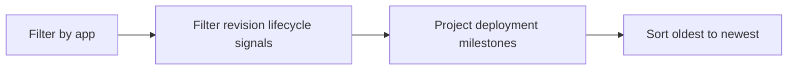

---
content_sources:
  diagrams:
    - id: query-pipeline
      type: flowchart
      source: mslearn-adapted
      based_on:
        - https://learn.microsoft.com/en-us/azure/container-apps/revisions
        - https://learn.microsoft.com/en-us/azure/container-apps/troubleshooting
        - https://learn.microsoft.com/en-us/azure/container-apps/health-probes
content_validation:
  status: verified
  last_reviewed: "2026-04-12"
  reviewer: ai-agent
  core_claims:
    - claim: "Each revision in Azure Container Apps represents an immutable snapshot of an app version and configuration."
      source: "https://learn.microsoft.com/azure/container-apps/revisions"
      verified: true
    - claim: "Troubleshooting Container Apps commonly relies on Log Analytics system logs that capture deployment and platform lifecycle events."
      source: "https://learn.microsoft.com/azure/container-apps/troubleshooting"
      verified: true
---

# Deployment Progression

Use this query to follow a revision from initial configuration change through provisioning, health evaluation, and active state signals.

## Data Source

| Table | Schema Note |
|---|---|
| `ContainerAppSystemLogs_CL` | Legacy schema. If empty, try `ContainerAppSystemLogs` (non-`_CL`). |

## Query Pipeline

<!-- diagram-id: query-pipeline -->


## Query

```kusto
let AppName = "my-container-app";
ContainerAppSystemLogs_CL
| where ContainerAppName_s == AppName
| where Reason_s has_any ("ContainerAppUpdate", "RevisionUpdate", "ReplicaStarted", "ProbeSucceeded")
    or Log_s has_any ("revision", "provision", "active", "traffic", "healthy")
| extend DeploymentStage = case(
    Reason_s == "ContainerAppUpdate", "config-change",
    Log_s has "provision", "provisioning",
    Reason_s == "ReplicaStarted", "replica-started",
    Reason_s == "ProbeSucceeded" or Log_s has "healthy", "health-confirmed",
    Log_s has "active" or Log_s has "traffic", "active",
    "other")
| project TimeGenerated, RevisionName_s, ReplicaName_s, DeploymentStage, Reason_s, Log_s
| order by TimeGenerated asc
```

## Example Output

| TimeGenerated | RevisionName_s | ReplicaName_s | DeploymentStage | Reason_s | Log_s |
|---|---|---|---|---|---|
| 2026-04-09T16:42:05.904Z | ca-myapp--0000012 |  | config-change | ContainerAppUpdate | Configuration update detected for revision rollout |
| 2026-04-09T16:42:19.187Z | ca-myapp--0000012 |  | provisioning | RevisionUpdate | New revision provisioning started |
| 2026-04-09T16:43:02.516Z | ca-myapp--0000012 | ca-myapp--0000012-6f6cb7f96f-r8w2x | replica-started | ReplicaStarted | Replica started for revision ca-myapp--0000012 |
| 2026-04-09T16:43:48.300Z | ca-myapp--0000012 | ca-myapp--0000012-6f6cb7f96f-r8w2x | health-confirmed | ProbeSucceeded | Readiness probe succeeded |
| 2026-04-09T16:44:11.742Z | ca-myapp--0000012 |  | active | RevisionUpdate | Revision is active and receiving traffic |

## Interpretation Notes

- This query is useful for confirming whether rollout stopped before replica start, during health checks, or after activation.
- Missing later stages after `config-change` or `provisioning` suggests deployment stalled before the revision became usable.
- Compare timestamps between stages to estimate where rollout latency is accumulating.

## Limitations

- Event text can differ by platform version, so some lifecycle steps may appear under slightly different messages.
- This does not show traffic percentage changes directly; verify routing details separately if using multiple revisions.

## See Also

- [Revision Failures and Startup](revision-failures-and-startup.md)
- [Image Pull and Auth Errors](image-pull-and-auth-errors.md)
