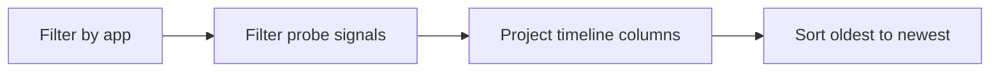

---
content_sources:
  diagrams:
    - id: query-pipeline
      type: flowchart
      source: mslearn-adapted
      based_on:
        - https://learn.microsoft.com/en-us/azure/container-apps/health-probes
        - https://learn.microsoft.com/en-us/azure/container-apps/troubleshooting
        - https://learn.microsoft.com/en-us/azure/container-apps/revisions
content_validation:
  status: verified
  last_reviewed: "2026-04-12"
  reviewer: ai-agent
  core_claims:
    - claim: "Azure Container Apps supports startup, readiness, and liveness probes to monitor container health."
      source: "https://learn.microsoft.com/azure/container-apps/health-probes"
      verified: true
    - claim: "Container Apps revisions are immutable snapshots that can be activated and observed during deployment changes."
      source: "https://learn.microsoft.com/azure/container-apps/revisions"
      verified: true
---

# Health Probe Timeline

Use this query to reconstruct the sequence of probe-related events so you can see whether a replica recovered, kept flapping, or failed repeatedly during rollout.

## Data Source

| Table | Schema Note |
|---|---|
| `ContainerAppSystemLogs_CL` | Legacy schema. If empty, try `ContainerAppSystemLogs` (non-`_CL`). |

## Query Pipeline

<!-- diagram-id: query-pipeline -->


## Query

```kusto
let AppName = "my-container-app";
ContainerAppSystemLogs_CL
| where ContainerAppName_s == AppName
| where Log_s has_any ("probe", "Readiness", "Liveness", "Startup") or Reason_s has_any ("ProbeFailed", "ProbeSucceeded")
| extend ProbePhase = case(
    Log_s has "readiness" or Log_s has "Readiness", "readiness",
    Log_s has "liveness" or Log_s has "Liveness", "liveness",
    Log_s has "startup" or Log_s has "Startup", "startup",
    "unspecified")
| project TimeGenerated, RevisionName_s, ReplicaName_s, ProbePhase, Reason_s, Log_s
| order by TimeGenerated asc
```

## Example Output

| TimeGenerated | RevisionName_s | ReplicaName_s | ProbePhase | Reason_s | Log_s |
|---|---|---|---|---|---|
| 2026-04-12T05:58:04.234Z | ca-cakqltest-54kxmtjeuidri--nu8o2ji | ca-cakqltest-54kxmtjeuidri--nu8o2ji-5cbf89478b-hfgkq | startup | ProbeFailed | Probe of StartUp failed with status code: 1 |

## Interpretation Notes

- Read the rows top-to-bottom to distinguish transient warm-up failures from persistent health instability.
- Repeated `ProbeFailed` events on the same `ReplicaName_s` without a later success usually mean the replica never stabilized.
- A normal rollout often shows early startup/readiness failures followed by `ProbeSucceeded` once the app finishes initialization.

## Limitations

- Probe wording can vary, so text-matching may miss uncommon platform messages.
- This timeline does not prove root cause; correlate with console logs and revision configuration.

## See Also

- [Revision Failures and Startup](revision-failures-and-startup.md)
- [Replica Crash Signals](replica-crash-signals.md)
