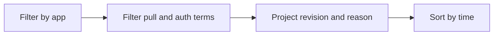

# Image Pull and Auth Errors

Use this query to isolate registry pull failures and authentication errors during revision provisioning.

## Data Source

| Table | Schema Note |
|---|---|
| `ContainerAppSystemLogs_CL` | Legacy schema. If empty, try `ContainerAppSystemLogs` (non-`_CL`). |

## Query Pipeline



## Query

```kusto
let AppName = "my-container-app";
ContainerAppSystemLogs_CL
| where ContainerAppName_s == AppName
| where Log_s has_any ("ImagePull", "pull", "manifest", "unauthorized", "denied")
| project TimeGenerated, RevisionName_s, Reason_s, Log_s
| order by TimeGenerated desc
```

## Interpretation Notes

- `manifest unknown` usually means bad repository or tag.
- `unauthorized` or `denied` points to registry auth/identity scope issues.
- If no console logs exist, this query is often your primary evidence.

## Limitations

- Text-matching query; custom log messages may vary by platform updates.
- Does not validate ACR role assignments directly.

## See Also

- [Revision Failures and Startup](revision-failures-and-startup.md)
- [Image Pull Failure Playbook](../../playbooks/startup-and-provisioning/image-pull-failure.md)
