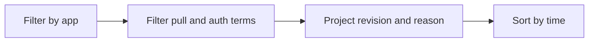

---
content_sources:
  diagrams:
    - id: query-pipeline
      type: flowchart
      source: mslearn-adapted
      based_on:
        - https://learn.microsoft.com/en-us/azure/container-apps/troubleshoot-image-pull-failures
        - https://learn.microsoft.com/en-us/azure/container-apps/managed-identity-image-pull
        - https://learn.microsoft.com/en-us/azure/container-apps/containers
content_validation:
  status: verified
  last_reviewed: "2026-04-12"
  reviewer: ai-agent
  core_claims:
    - claim: "Azure Container Apps can send system logs that record platform events to a Log Analytics workspace."
      source: "https://learn.microsoft.com/azure/container-apps/logging"
      verified: true
    - claim: "Log Analytics uses Kusto Query Language to filter, summarize, and visualize collected log data."
      source: "https://learn.microsoft.com/azure/azure-monitor/logs/log-analytics-tutorial"
      verified: true
---

# Image Pull and Auth Errors

Use this query to isolate registry pull failures and authentication errors during revision provisioning.

## Data Source

| Table | Schema Note |
|---|---|
| `ContainerAppSystemLogs_CL` | Legacy schema. If empty, try `ContainerAppSystemLogs` (non-`_CL`). |

## Query Pipeline

<!-- diagram-id: query-pipeline -->


## Query

```kusto
let AppName = "my-container-app";
ContainerAppSystemLogs_CL
| where ContainerAppName_s == AppName
| where Log_s has_any ("ImagePull", "pull", "manifest", "unauthorized", "denied")
| project TimeGenerated, RevisionName_s, Reason_s, Log_s
| order by TimeGenerated desc
```

## Example Output

| TimeGenerated | RevisionName_s | Reason_s | Log_s |
|---|---|---|---|
| 2026-04-04T12:54:11.477Z | ca-myapp--0000001 | PulledImage | Successfully pulled image in 2.42s (58720256 bytes) |
| 2026-04-04T12:54:11.477Z | ca-myapp--0000001 | PullingImage | Pulling image '<acr-name>.azurecr.io/myapp-job:v1.0.0' |
| 2026-04-04T11:12:03.208Z | ca-myapp--0000002 | RevisionUpdate | Failed to pull image: unauthorized: authentication required |

## Interpretation Notes

- `manifest unknown` usually means bad repository or tag.
- `unauthorized` or `denied` points to registry auth/identity scope issues.
- If no console logs exist, this query is often your primary evidence.

## Limitations

- Text-matching query; custom log messages may vary by platform updates.
- Does not validate ACR role assignments directly.

## See Also

- [Revision Failures and Startup](revision-failures-and-startup.md)
- [Image Pull Failure Playbook](../../playbooks/startup-and-provisioning/image-pull-failure.md)
