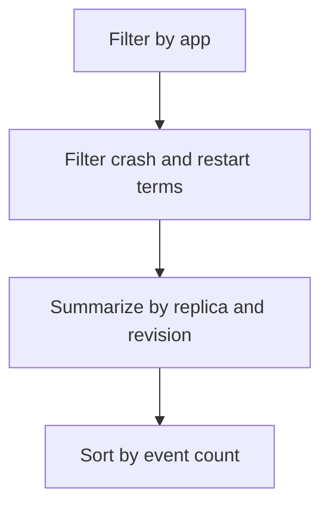

---
content_sources:
  diagrams:
    - id: query-pipeline
      type: flowchart
      source: mslearn-adapted
      based_on:
        - https://learn.microsoft.com/en-us/azure/container-apps/troubleshooting
        - https://learn.microsoft.com/en-us/azure/container-apps/health-probes
        - https://learn.microsoft.com/en-us/azure/container-apps/scale-app
content_validation:
  status: verified
  last_reviewed: "2026-04-12"
  reviewer: ai-agent
  core_claims:
    - claim: "Azure Container Apps can send system logs that record platform events to a Log Analytics workspace."
      source: "https://learn.microsoft.com/azure/container-apps/logging"
      verified: true
    - claim: "Log Analytics uses Kusto Query Language to filter, summarize, and visualize collected log data."
      source: "https://learn.microsoft.com/azure/azure-monitor/logs/log-analytics-tutorial"
      verified: true
---

# Replica Crash Signals

Use this query to identify restart-heavy replicas and crash-loop patterns by revision.

## Data Source

| Table | Schema Note |
|---|---|
| `ContainerAppSystemLogs_CL` | Legacy schema. If empty, try `ContainerAppSystemLogs` (non-`_CL`). |

## Query Pipeline

<!-- diagram-id: query-pipeline -->


## Query

```kusto
let AppName = "my-container-app";
ContainerAppSystemLogs_CL
| where ContainerAppName_s == AppName
| where Log_s has_any ("CrashLoopBackOff", "terminated", "exited", "restart", "OOM")
| summarize events=count(), firstSeen=min(TimeGenerated), lastSeen=max(TimeGenerated) by RevisionName_s, ReplicaName_s
| order by events desc
```

## Example Output

| RevisionName_s | ReplicaName_s | events | firstSeen | lastSeen |
|---|---|---:|---|---|
| ca-myapp--0000002 | ca-myapp--0000002-5f8b7fbbd8-7j4nm | 9 | 2026-04-04T11:31:22.092Z | 2026-04-04T11:48:05.223Z |
| ca-myapp--0000001 | ca-myapp--0000001-6cc5f7cc66-vk4pp | 2 | 2026-04-04T12:54:25.409Z | 2026-04-04T12:54:25.409Z |

## Interpretation Notes

- High `events` on few replicas indicates unstable runtime behavior.
- OOM-related terms suggest memory pressure rather than logic-only defects.
- Normal pattern: low restart count outside deployments.

## Limitations

- Event detail quality varies by platform event source.
- Requires correlation with console logs for stack traces.

## See Also

- [Latest Errors and Exceptions](../console-and-runtime/latest-errors-and-exceptions.md)
- [CrashLoop OOM and Resource Pressure Playbook](../../playbooks/scaling-and-runtime/crashloop-oom-and-resource-pressure.md)
