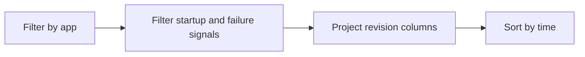

---
hide:
  - toc
content_sources:
  diagrams:
    - id: query-pipeline
      type: flowchart
      source: mslearn-adapted
      based_on:
        - https://learn.microsoft.com/en-us/azure/container-apps/troubleshooting
        - https://learn.microsoft.com/en-us/azure/container-apps/health-probes
        - https://learn.microsoft.com/en-us/azure/container-apps/revisions
content_validation:
  status: verified
  last_reviewed: "2026-04-12"
  reviewer: ai-agent
  core_claims:
    - claim: "Azure Container Apps can send system logs that record platform events to a Log Analytics workspace."
      source: "https://learn.microsoft.com/azure/container-apps/logging"
      verified: true
    - claim: "Log Analytics uses Kusto Query Language to filter, summarize, and visualize collected log data."
      source: "https://learn.microsoft.com/azure/azure-monitor/logs/log-analytics-tutorial"
      verified: true
---

# Revision Failures and Startup

Use this query when a revision fails to become healthy or startup behavior is unstable.

## Data Source

| Table | Schema Note |
|---|---|
| `ContainerAppSystemLogs_CL` | Legacy schema. If empty, try `ContainerAppSystemLogs` (non-`_CL`). |

## Query Pipeline

<!-- diagram-id: query-pipeline -->


## Query

```kusto
let AppName = "my-container-app";
ContainerAppSystemLogs_CL
| where ContainerAppName_s == AppName
| where Log_s has_any ("Failed", "provision", "startup", "probe", "timeout")
| project TimeGenerated, RevisionName_s, ReplicaName_s, Reason_s, Log_s
| order by TimeGenerated desc
```

## Example Output

| TimeGenerated | RevisionName_s | ReplicaName_s | Reason_s | Log_s |
|---|---|---|---|---|
| 2026-04-04T11:36:44.201Z | ca-myapp--0000002 | ca-myapp--0000002-5f8b7fbbd8-7j4nm | ProbeFailed | Readiness probe failed: timeout after 5s |
| 2026-04-04T11:35:10.110Z | ca-myapp--0000002 | ca-myapp--0000002-5f8b7fbbd8-7j4nm | RevisionUpdate | New revision provisioning started |
| 2026-04-04T11:34:55.774Z | ca-myapp--0000002 |  | ContainerAppUpdate | Configuration update detected for revision rollout |

## Interpretation Notes

- Focus on earliest failure event for each revision.
- `Reason_s` helps separate config validation failures from runtime startup issues.
- Normal pattern: short startup logs followed by healthy state, not repeated failures.

## Limitations

- System logs can be delayed by ingestion latency.
- Some workspaces use non-`_CL` table names.

## See Also

- [Image Pull and Auth Errors](image-pull-and-auth-errors.md)
- [Revision Provisioning Failure Playbook](../../playbooks/startup-and-provisioning/revision-provisioning-failure.md)
