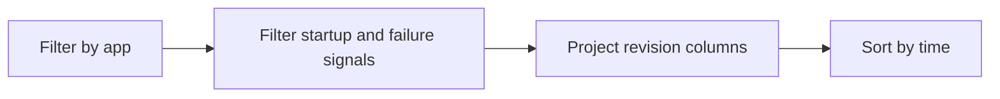

# Revision Failures and Startup

Use this query when a revision fails to become healthy or startup behavior is unstable.

## Data Source

| Table | Schema Note |
|---|---|
| `ContainerAppSystemLogs_CL` | Legacy schema. If empty, try `ContainerAppSystemLogs` (non-`_CL`). |

## Query Pipeline



## Query

```kusto
let AppName = "my-container-app";
ContainerAppSystemLogs_CL
| where ContainerAppName_s == AppName
| where Log_s has_any ("Failed", "provision", "startup", "probe", "timeout")
| project TimeGenerated, RevisionName_s, ReplicaName_s, Reason_s, Log_s
| order by TimeGenerated desc
```

## Interpretation Notes

- Focus on earliest failure event for each revision.
- `Reason_s` helps separate config validation failures from runtime startup issues.
- Normal pattern: short startup logs followed by healthy state, not repeated failures.

## Limitations

- System logs can be delayed by ingestion latency.
- Some workspaces use non-`_CL` table names.

## See Also

- [Image Pull and Auth Errors](image-pull-and-auth-errors.md)
- [Revision Provisioning Failure Playbook](../../playbooks/startup-and-provisioning/revision-provisioning-failure.md)
