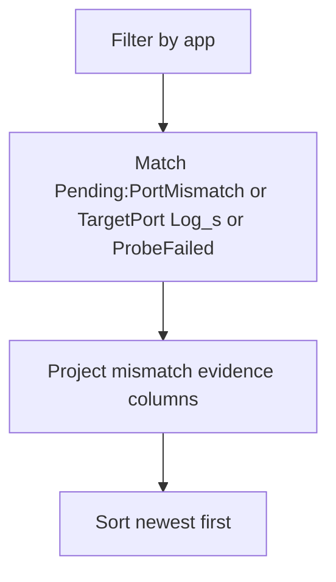

---
content_sources:
  diagrams:
    - id: query-pipeline
      type: flowchart
      source: mslearn-adapted
      based_on:
        - https://learn.microsoft.com/en-us/azure/container-apps/ingress-overview
        - https://learn.microsoft.com/en-us/azure/container-apps/health-probes
        - https://learn.microsoft.com/en-us/azure/container-apps/troubleshooting
---
# Target Port Mismatch Detection

Use this query to confirm — or rule out — a target port vs. container listening port mismatch as the root cause of a sustained 5xx incident or a revision stuck Unhealthy.

The platform message *"The TargetPort N does not match the listening port M"* is the smoking gun. It appears in the `Log_s` field on rows whose `Reason_s == "Pending:PortMismatch"` (observed 2026-06-22 reproduction, CLI 2.79.0, `containerapp` extension 1.3.0b4, `koreacentral`). Older platform versions emitted the same diagnostic text under a `Reason_s` value containing the string `TargetPort`; the query below matches both spellings so a single saved query works across platform versions. Once the post-fix window is past system-log ingestion delay (see Limitations), the **absence** of either spelling in that window is supporting evidence that the mismatch has stopped recurring.

## Data Source

| Table | Schema Note |
|---|---|
| `ContainerAppSystemLogs_CL` | Legacy schema. If empty, try `ContainerAppSystemLogs` (non-`_CL`). |

## Query Pipeline

<!-- diagram-id: query-pipeline -->


## Query

```kusto
let AppName = "my-container-app";
ContainerAppSystemLogs_CL
| where TimeGenerated > ago(1h)
| where ContainerAppName_s == AppName
| where Reason_s == "Pending:PortMismatch"
    or Reason_s contains "TargetPort"
    or Log_s contains "TargetPort"
    or Reason_s == "ProbeFailed"
| project TimeGenerated, RevisionName_s, ReplicaName_s, Reason_s, Type_s, Log_s
| order by TimeGenerated desc
```

To confirm a fix landed, re-run the same query with `ago(5m)` over a window that starts **after** the ingress update. The most rigorous approach is to capture `FIX_UTC` at the moment of the `az containerapp ingress update` call and scope by `TimeGenerated > datetime(${FIX_UTC})`; a relative `ago(5m)` window can include a tail of pre-fix events whose ingestion lagged into the post-fix wall clock. A clean `No results found` for any row whose `Reason_s == "Pending:PortMismatch"` (or whose `Log_s contains "TargetPort"`) is the confirmation that the mismatch has stopped recurring.

## Example Output

The rows and counts below are taken from the captured evidence pack in [`labs/ingress-target-port-mismatch/evidence/`](https://github.com/yeongseon/azure-container-apps-practical-guide/tree/main/labs/ingress-target-port-mismatch/evidence) for the 2026-06-22 reproduction in `koreacentral` (CLI 2.79.0, `containerapp` extension 1.3.0b4). `TRIGGER_UTC=2026-06-22T12:17:44Z`, `FIX_UTC=2026-06-22T12:25:06Z`. Both windows are scoped with the strict-UTC-cutoff pattern (`TimeGenerated > datetime(...)`), not `ago(...)`, so the rows shown were emitted strictly after the respective ingress update.

**Failure window** (strict post-trigger, ingress `targetPort=8081`, container listening on `:80`). The query above runs the `summarize` form; the sample rows below are taken from a `project ... order by TimeGenerated desc | take 5` companion query that drops the `Reason_s == "ProbeFailed"` filter so the rows shown are only the PortMismatch attribution rows. Source files: [`09-kql-after-trigger.json`](https://github.com/yeongseon/azure-container-apps-practical-guide/blob/main/labs/ingress-target-port-mismatch/evidence/09-kql-after-trigger.json), [`09-kql-after-trigger-portmismatch-sample-raw.txt`](https://github.com/yeongseon/azure-container-apps-practical-guide/blob/main/labs/ingress-target-port-mismatch/evidence/09-kql-after-trigger-portmismatch-sample-raw.txt).

`summarize` row (single-row aggregate over the 300 s post-trigger window):

```text
rows=399, portmismatch_rows=25, probefailed_rows=374, distinct_revisions=1
```

Sample `Pending:PortMismatch` rows (newest first, all 5 captured by `take 5`):

| TimeGenerated | RevisionName_s | ReplicaName_s | Reason_s | Type_s | Log_s |
|---|---|---|---|---|---|
| 2026-06-22T12:19:20Z | ca-ingressport-2inkav--n6v50k0 | ca-ingressport-2inkav--n6v50k0-55dfdfd9b-7bwp8 | Pending:PortMismatch | Normal | The TargetPort 8081 does not match the listening port 80. |
| 2026-06-22T12:19:18Z | ca-ingressport-2inkav--n6v50k0 | ca-ingressport-2inkav--n6v50k0-55dfdfd9b-7bwp8 | Pending:PortMismatch | Normal | The TargetPort 8081 does not match the listening port 80. |
| 2026-06-22T12:19:15Z | ca-ingressport-2inkav--n6v50k0 | ca-ingressport-2inkav--n6v50k0-55dfdfd9b-7bwp8 | Pending:PortMismatch | Normal | The TargetPort 8081 does not match the listening port 80. |
| 2026-06-22T12:19:13Z | ca-ingressport-2inkav--n6v50k0 | ca-ingressport-2inkav--n6v50k0-55dfdfd9b-7bwp8 | Pending:PortMismatch | Normal | The TargetPort 8081 does not match the listening port 80. |
| 2026-06-22T12:19:10Z | ca-ingressport-2inkav--n6v50k0 | ca-ingressport-2inkav--n6v50k0-55dfdfd9b-7bwp8 | Pending:PortMismatch | Normal | The TargetPort 8081 does not match the listening port 80. |

In this 300 s post-trigger window the 25 rows of `Reason_s == "Pending:PortMismatch"` co-occurred with 374 rows of `Reason_s == "ProbeFailed"` on the same revision `ca-ingressport-2inkav--n6v50k0`; absolute counts vary with replica count, probe interval, and trigger duration.

**Fixed window** (same app, strict post-fix `TimeGenerated > datetime(2026-06-22T12:25:06Z)`, ingress restored to `targetPort=80`). Source files: [`15-kql-after-fix.json`](https://github.com/yeongseon/azure-container-apps-practical-guide/blob/main/labs/ingress-target-port-mismatch/evidence/15-kql-after-fix.json), [`15-kql-after-fix-portmismatch-sample-raw.txt`](https://github.com/yeongseon/azure-container-apps-practical-guide/blob/main/labs/ingress-target-port-mismatch/evidence/15-kql-after-fix-portmismatch-sample-raw.txt).

`summarize` row (single-row aggregate over the 300 s post-fix window):

```text
rows=12, portmismatch_rows=0, probefailed_rows=12, distinct_revisions=1
```

Sample `Pending:PortMismatch` rows:

```text
[]
```

The `portmismatch_rows=0` count is the falsification gate: zero rows of `Reason_s == "Pending:PortMismatch"` (and zero rows whose `Log_s contains "TargetPort"`) means the platform has stopped attributing the mismatch in the strictly post-fix window. The 12 residual `ProbeFailed` rows are a short ingestion tail of probe-failure events generated during the triggered window whose `TimeGenerated` happens to land just past `FIX_UTC`; they decay to zero within a few additional minutes and are not attributable to a present-tense port mismatch (the `Log_s` text on these rows no longer mentions `TargetPort`).

The transition from `portmismatch_rows=25` to `portmismatch_rows=0` for the same query against the same app, separated only by an `az containerapp ingress update --target-port 80` call, is what falsifies the alternative theories listed in the [Ingress Target Port Mismatch Lab](../../lab-guides/ingress-target-port-mismatch.md#observed-evidence-portal-captures-2026-06-18-production-case-pattern).

## Interpretation Notes

- A `Reason_s == "Pending:PortMismatch"` row (or any row whose `Log_s contains "TargetPort"`) is **direct platform attribution** of the mismatch — you do not need to infer it from probe failures alone.
- Repeated `ProbeFailed` rows without an accompanying mismatch-attribution row usually point at probe configuration (timeouts, path, port) rather than ingress target port.
- The mismatch-attribution row often appears alongside `ProbeFailed` rows for the same replica because, with ingress enabled and no custom probes, ACA's default TCP probes target the ingress `targetPort` — so the same mismatch that breaks edge routing also breaks probes.
- This query intentionally widens `Reason_s == "ProbeFailed"` so you can verify both signals co-occur on the same replica.

## Limitations

- `Reason_s` wording can vary across platform versions. In 2026-06-22 (CLI 2.79.0, `containerapp` extension 1.3.0b4) the value is `Pending:PortMismatch`. Earlier published captures (2026-06-18 production case) showed the smoking-gun string under a `Reason_s` value containing `TargetPort`. The query above matches both; if neither matches in your environment, fall back to `Log_s contains "TargetPort"` and to [Health Probe Timeline](health-probe-timeline.md).
- This query confirms the **mismatch**, not the correct port. Cross-check the container's actual listening port from `ContainerAppConsoleLogs_CL` (e.g. application startup log lines like `Listening on :80`).
- System logs can be delayed by ingestion latency; allow a few minutes after the trigger or fix before treating an empty result as authoritative.

## See Also

- [Ingress Target Port Mismatch Lab](../../lab-guides/ingress-target-port-mismatch.md)
- [Health Probe Timeline](health-probe-timeline.md)
- [Revision Failures and Startup](revision-failures-and-startup.md)
- [Ingress Not Reachable Playbook](../../playbooks/ingress-and-networking/ingress-not-reachable.md)

## Sources

- [Ingress in Azure Container Apps](https://learn.microsoft.com/en-us/azure/container-apps/ingress-overview)
- [Health probes in Azure Container Apps](https://learn.microsoft.com/en-us/azure/container-apps/health-probes)
- [Logging in Azure Container Apps](https://learn.microsoft.com/en-us/azure/container-apps/logging)
- [Troubleshoot Azure Container Apps](https://learn.microsoft.com/en-us/azure/container-apps/troubleshooting)
