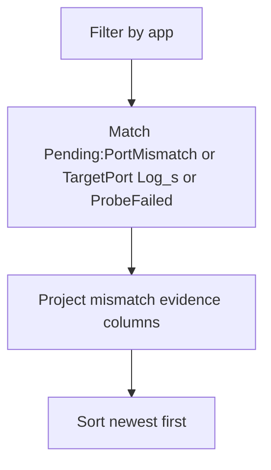

---
content_sources:
  diagrams:
    - id: query-pipeline
      type: flowchart
      source: mslearn-adapted
      based_on:
        - https://learn.microsoft.com/en-us/azure/container-apps/ingress-overview
        - https://learn.microsoft.com/en-us/azure/container-apps/health-probes
        - https://learn.microsoft.com/en-us/azure/container-apps/troubleshooting
---
# Target Port Mismatch Detection

Use this query to confirm — or rule out — a target port vs. container listening port mismatch as the root cause of a sustained 5xx incident or a revision stuck Unhealthy.

The platform message *"The TargetPort N does not match the listening port M"* is the smoking gun. It appears in the `Log_s` field on rows whose `Reason_s == "Pending:PortMismatch"` (observed 2026-06-22 reproduction, CLI 2.79.0, `containerapp` extension 1.3.0b4, `koreacentral`). Older platform versions emitted the same diagnostic text under a `Reason_s` value containing the string `TargetPort`; the query below matches both spellings so a single saved query works across platform versions. Once the post-fix window is past system-log ingestion delay (see Limitations), the **absence** of either spelling in that window is supporting evidence that the mismatch has stopped recurring.

## Data Source

| Table | Schema Note |
|---|---|
| `ContainerAppSystemLogs_CL` | Legacy schema. If empty, try `ContainerAppSystemLogs` (non-`_CL`). |

## Query Pipeline

<!-- diagram-id: query-pipeline -->


## Query

```kusto
let AppName = "my-container-app";
ContainerAppSystemLogs_CL
| where TimeGenerated > ago(1h)
| where ContainerAppName_s == AppName
| where Reason_s == "Pending:PortMismatch"
    or Reason_s contains "TargetPort"
    or Log_s contains "TargetPort"
    or Reason_s == "ProbeFailed"
| project TimeGenerated, RevisionName_s, ReplicaName_s, Reason_s, Type_s, Log_s
| order by TimeGenerated desc
```

To confirm a fix landed, re-run the same query with `ago(5m)` over a window that starts **after** the ingress update. The most rigorous approach is to capture `FIX_UTC` at the moment of the `az containerapp ingress update` call and scope by `TimeGenerated > datetime(${FIX_UTC})`; a relative `ago(5m)` window can include a tail of pre-fix events whose ingestion lagged into the post-fix wall clock. A clean `No results found` for any row whose `Reason_s == "Pending:PortMismatch"` (or whose `Log_s contains "TargetPort"`) is the confirmation that the mismatch has stopped recurring.

## Example Output

Failure window (ingress `targetPort=8081`, container listening on `:80`, observed 2026-06-22 reproduction in `koreacentral`):

| TimeGenerated | RevisionName_s | ReplicaName_s | Reason_s | Type_s | Log_s |
|---|---|---|---|---|---|
| 2026-06-22T11:50:02Z | ca-ingressport-2inkav--n6v50k0 | ca-ingressport-2inkav--n6v50k0-55dfdfd9b-hfzjv | Pending:PortMismatch | Normal | The TargetPort 8081 does not match the listening port 80. |
| 2026-06-22T11:49:58Z | ca-ingressport-2inkav--n6v50k0 | ca-ingressport-2inkav--n6v50k0-55dfdfd9b-hfzjv | ProbeFailed | Warning | Liveness probe failed: dial tcp ...:8081: connect: connection refused |

In a single 300-second post-trigger window (same reproduction), 25 rows of `Reason_s == "Pending:PortMismatch"` co-occurred with 370+ rows of `Reason_s == "ProbeFailed"`; the absolute counts vary with replica count, probe interval, and the trigger duration.

Fixed window (same app after `az containerapp ingress update --target-port 80`):

```text
No results found from the last 5 minutes.
```

The transition from the first table to "No results" with the same query is what falsifies the alternative theories listed in the [Ingress Target Port Mismatch Lab](../../lab-guides/ingress-target-port-mismatch.md#observed-evidence-portal-captures-2026-06-18-production-case-pattern).

## Interpretation Notes

- A `Reason_s == "Pending:PortMismatch"` row (or any row whose `Log_s contains "TargetPort"`) is **direct platform attribution** of the mismatch — you do not need to infer it from probe failures alone.
- Repeated `ProbeFailed` rows without an accompanying mismatch-attribution row usually point at probe configuration (timeouts, path, port) rather than ingress target port.
- The mismatch-attribution row often appears alongside `ProbeFailed` rows for the same replica because, with ingress enabled and no custom probes, ACA's default TCP probes target the ingress `targetPort` — so the same mismatch that breaks edge routing also breaks probes.
- This query intentionally widens `Reason_s == "ProbeFailed"` so you can verify both signals co-occur on the same replica.

## Limitations

- `Reason_s` wording can vary across platform versions. In 2026-06-22 (CLI 2.79.0, `containerapp` extension 1.3.0b4) the value is `Pending:PortMismatch`. Earlier published captures (2026-06-18 production case) showed the smoking-gun string under a `Reason_s` value containing `TargetPort`. The query above matches both; if neither matches in your environment, fall back to `Log_s contains "TargetPort"` and to [Health Probe Timeline](health-probe-timeline.md).
- This query confirms the **mismatch**, not the correct port. Cross-check the container's actual listening port from `ContainerAppConsoleLogs_CL` (e.g. application startup log lines like `Listening on :80`).
- System logs can be delayed by ingestion latency; allow a few minutes after the trigger or fix before treating an empty result as authoritative.

## See Also

- [Ingress Target Port Mismatch Lab](../../lab-guides/ingress-target-port-mismatch.md)
- [Health Probe Timeline](health-probe-timeline.md)
- [Revision Failures and Startup](revision-failures-and-startup.md)
- [Ingress Not Reachable Playbook](../../playbooks/ingress-and-networking/ingress-not-reachable.md)

## Sources

- [Ingress in Azure Container Apps](https://learn.microsoft.com/en-us/azure/container-apps/ingress-overview)
- [Health probes in Azure Container Apps](https://learn.microsoft.com/en-us/azure/container-apps/health-probes)
- [Logging in Azure Container Apps](https://learn.microsoft.com/en-us/azure/container-apps/logging)
- [Troubleshoot Azure Container Apps](https://learn.microsoft.com/en-us/azure/container-apps/troubleshooting)
