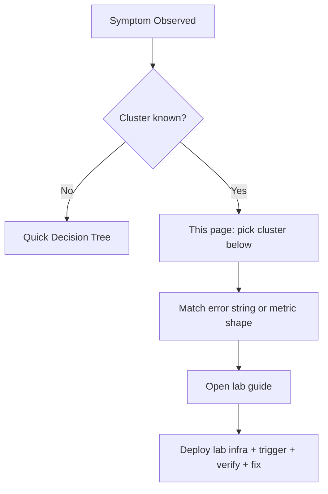

# Lab Finder

Symptom-first index of every reproduction lab in this guide. Use this page when you already know the error string, exit code, or user-visible symptom and want to jump straight to the matching lab.

If you do not yet know which symptom cluster applies, start with the [Quick Decision Tree](index.md#quick-decision-tree) or the [First 10 Minutes runbook](first-10-minutes/index.md) instead — this page assumes the cluster is already narrowed.

---

## How this page is organized

This finder complements the two existing indexes rather than replacing them:

| Page | Question it answers | Coverage |
|---|---|---|
| [Lab Guides catalog](lab-guides/index.md) | "What labs exist? What difficulty and duration?" | All 54 labs, browse-oriented, alphabetical-by-importance |
| [Lab Guides Selection Matrix](lab-guides/index.md#lab-selection-matrix) | "Which curated lab should I run first?" | 11 curated labs, learning-path oriented |
| **This page** | **"I am seeing X — which lab reproduces X?"** | **All 54 labs, symptom-first, grouped by 12 clusters** |

Every row below cites the *first evidence signal* an on-caller would observe (log excerpt, CLI output, or metric shape) so the finder is usable from an alert or paging context, not just from a browse context.

!!! tip "Labs reproduce, playbooks diagnose"
    Every cluster below has matching multi-hypothesis playbooks under [Playbooks](playbooks/index.md). During an active incident, open the playbook first to enumerate hypotheses and gather evidence. Use this finder to *reproduce* the failure in a lab environment when you want to build muscle memory or validate a fix strategy against a known-good repro.

<!-- diagram-id: lab-finder-routing -->

---

## Cluster 1 — Startup and provisioning failures

Revision never reaches `Healthy`. `az containerapp revision list` shows `ProvisioningState=Failed` or `Provisioning`.

| Symptom / signal | First evidence to check | Lab guide | Backing infra |
|---|---|---|---|
| `ImagePullBackOff` / `MANIFEST_UNKNOWN` | `ContainerAppSystemLogs_CL` pull errors; `az deployment operation group list` `statusMessage.error.message` | [ACR Image Pull Failure](lab-guides/acr-pull-failure.md) | [labs/acr-pull-failure/](https://github.com/yeongseon/azure-container-apps-practical-guide/tree/main/labs/acr-pull-failure) |
| Revision stuck / `secretRef` unresolved | Revision lifecycle events; `az containerapp revision show` | [Revision Provisioning Failure](lab-guides/revision-provisioning-failure.md) | [labs/revision-provisioning-failure/](https://github.com/yeongseon/azure-container-apps-practical-guide/tree/main/labs/revision-provisioning-failure) |
| Bicep deploy hangs / times out in Provisioning | `az deployment group show` status + revision provisioning events | [Bicep Deployment Timeout](lab-guides/bicep-deployment-timeout.md) | Inline guide only |
| Cold start latency > 30 s from image size | Startup probe timings; container image size | [Image Size Startup Delay](lab-guides/image-size-startup-delay.md) | Inline guide only |
| `exec format error` on startup | System logs; image manifest platform | [Multi-Arch Image Mismatch](lab-guides/multi-arch-image-mismatch.md) | Inline guide only |
| `toomanyrequests` from Docker Hub | Pull error text mentioning `docker.io` rate | [Docker Hub Rate Limit](lab-guides/docker-hub-rate-limit.md) | Inline guide only |
| `QuotaExceeded` on environment or app create | Deployment error text with quota name | [Subscription Quota Exceeded](lab-guides/subscription-quota-exceeded.md) | Inline guide only |
| Wrong workload profile chosen (perf/cost) | `az containerapp env workload-profile list`; metrics divergence | [Workload Profile Mismatch](lab-guides/workload-profile-mismatch.md) | Inline guide only |
| Startup degraded but recovers | Transient probe failures during warm-up window | [Startup Degraded Transient Failure](lab-guides/startup-degraded-transient-failure.md) | Inline guide only |

---

## Cluster 2 — Networking and ingress

External endpoint unreachable, or app-to-registry / app-to-KeyVault paths fail on network layer.

Start with the [ACR Network Path Selection](../platform/networking/acr-network-path-selection.md) platform doc if the symptom is ACR-pull-adjacent — it names and orders all five distinct ACR paths.

| Symptom / signal | First evidence to check | Lab guide | Backing infra |
|---|---|---|---|
| ACR HTTP 403 on pull, firewall SNAT path | ACR firewall logs; DENIED message names firewall PIP | [ACR Network Path A — Firewall Allowlist](lab-guides/acr-network-path-firewall-allowlist.md) | [labs/acr-network-path-firewall-allowlist/](https://github.com/yeongseon/azure-container-apps-practical-guide/tree/main/labs/acr-network-path-firewall-allowlist) |
| `ImagePullUnauthorized` on fresh pull, PE path | PE zone link state; fresh vs cached pull behavior | [ACR Network Path B — PE Direct](lab-guides/acr-network-path-pe-direct.md) | [labs/acr-network-path-pe-direct/](https://github.com/yeongseon/azure-container-apps-practical-guide/tree/main/labs/acr-network-path-pe-direct) |
| Pull succeeds but firewall log goes silent | Missing `/32` UDR routes per PE NIC IP | [ACR Network Path C — PE Forced Inspection](lab-guides/acr-network-path-pe-forced-inspection.md) | [labs/acr-network-path-pe-forced-inspection/](https://github.com/yeongseon/azure-container-apps-practical-guide/tree/main/labs/acr-network-path-pe-forced-inspection) |
| Workload NXDOMAIN on ACR data FQDN | Linked `privatelink.azurecr.io` zone missing per-region A record | [ACR Network Path D — Record-Level Zone Authority](lab-guides/acr-network-path-record-split-brain.md) | [labs/acr-network-path-record-split-brain/](https://github.com/yeongseon/azure-container-apps-practical-guide/tree/main/labs/acr-network-path-record-split-brain) |
| Workload resolves ACR to public IP | Custom DNS forwarder upstream not `168.63.129.16` | [ACR Network Path E — DNS Forwarder Bypass](lab-guides/acr-network-path-dns-forwarder-bypass.md) | [labs/acr-network-path-dns-forwarder-bypass/](https://github.com/yeongseon/azure-container-apps-practical-guide/tree/main/labs/acr-network-path-dns-forwarder-bypass) |
| Application Gateway → internal ACA returns 502 | NSG effective rules; AppGW backend health | [AppGW to Internal ACA NSG Mismatch](lab-guides/appgw-to-internal-aca-nsg-mismatch.md) | Inline guide only |
| External endpoint unreachable, wrong target port | `az containerapp ingress show`; app listen port | [Ingress Target Port Mismatch](lab-guides/ingress-target-port-mismatch.md) | [labs/ingress-target-port-mismatch/](https://github.com/yeongseon/azure-container-apps-practical-guide/tree/main/labs/ingress-target-port-mismatch) |
| Probe failing, port mismatch | Probe warnings in system logs | [Probe and Port Mismatch](lab-guides/probe-and-port-mismatch.md) | [labs/probe-and-port-mismatch/](https://github.com/yeongseon/azure-container-apps-practical-guide/tree/main/labs/probe-and-port-mismatch) |
| Environment create fails with subnet too small | `az deployment group show` error text mentioning subnet size | [Subnet CIDR Exhaustion](lab-guides/subnet-cidr-exhaustion.md) | Inline guide only |
| Replica startup fails from blocked egress FQDNs | UDR to NVA/firewall; egress deny logs | [UDR and NSG Egress Blocked](lab-guides/udr-nsg-egress-blocked.md) | Inline guide only |
| Private endpoint DNS NXDOMAIN | Private DNS Zone → VNet link state | [Private Endpoint DNS Failure](lab-guides/private-endpoint-dns-failure.md) | Inline guide only |
| Downstream firewall dropping traffic after env recreate | Env outbound IP list before vs after recreate | [Egress IP Change](lab-guides/egress-ip-change.md) | Inline guide only |
| Managed certificate stuck `Pending` | `az containerapp hostname list`; CNAME + `asuid` TXT records | [Custom Domain TLS Renewal](lab-guides/custom-domain-tls-renewal.md) | Inline guide only |
| WebSocket disconnects mid-session | Session affinity setting on ingress | [WebSocket and gRPC Ingress](lab-guides/websocket-grpc-ingress.md) | Inline guide only |
| Session state lost across replicas | Ingress `stickySessions.affinity` setting | [Session Affinity Failure](lab-guides/session-affinity-failure.md) | Inline guide only |

---

## Cluster 3 — Scaling and runtime behavior

Replica count does not track load, or replicas scale but do not converge on healthy steady-state.

| Symptom / signal | First evidence to check | Lab guide | Backing infra |
|---|---|---|---|
| Load rises, replicas do not | Replica count + KEDA `ScaledObject` events | [Scale Rule Mismatch](lab-guides/scale-rule-mismatch.md) | [labs/scale-rule-mismatch/](https://github.com/yeongseon/azure-container-apps-practical-guide/tree/main/labs/scale-rule-mismatch) |
| KEDA scaler returns 0 metrics | KEDA operator logs + `ScaledObject` status | [KEDA No Metrics Returned](lab-guides/keda-no-metrics-returned.md) | [labs/keda-no-metrics-returned/](https://github.com/yeongseon/azure-container-apps-practical-guide/tree/main/labs/keda-no-metrics-returned) |
| First request after idle takes 5-30 s | Replica count timeline; `minReplicas=0` setting | [Cold Start Scale to Zero](lab-guides/cold-start-scale-to-zero.md) | Inline guide only |
| Replicas concentrate on one node | Replica distribution across availability zones | [Replica Node Spread](lab-guides/replica-node-spread.md) | [labs/replica-node-spread/](https://github.com/yeongseon/azure-container-apps-practical-guide/tree/main/labs/replica-node-spread) |
| Uneven load across replicas | Per-replica request rate metric | [Replica Load Imbalance](lab-guides/replica-load-imbalance.md) | Inline guide only |
| High `MemoryPercentage` but no scale-out | HPA denominator + cache inflation math | [Memory Percentage vs KEDA Utilization](lab-guides/memory-percentage-vs-keda-utilization.md) | [labs/memory-percentage-vs-keda-utilization/](https://github.com/yeongseon/azure-container-apps-practical-guide/tree/main/labs/memory-percentage-vs-keda-utilization) |

---

## Cluster 4 — Storage and volumes

Mount fails or fills, or permissions deny access to persistent volumes.

| Symptom / signal | First evidence to check | Lab guide | Backing infra |
|---|---|---|---|
| SMB mount error on Azure Files | Env storage config; storage account key + share name | [Azure Files Mount Failure](lab-guides/azure-files-mount-failure.md) | Inline guide only |
| OOM-like restart from ephemeral disk full | Container writes to `/tmp`; `ephemeralStorage` limit | [EmptyDir Disk Full](lab-guides/emptydir-disk-full.md) | Inline guide only |
| `permission denied` on volume path | Container UID vs mount ownership | [Volume Permission Denied](lab-guides/volume-permission-denied.md) | Inline guide only |

---

## Cluster 5 — Identity and security

Managed identity token flow, RBAC role assignments, federated credentials, or built-in auth fails.

| Symptom / signal | First evidence to check | Lab guide | Backing infra |
|---|---|---|---|
| 500/403 from route calling Key Vault | App logs for `ManagedIdentityCredential`; Key Vault RBAC scope | [Managed Identity Key Vault Failure](lab-guides/managed-identity-key-vault-failure.md) | [labs/managed-identity-key-vault-failure/](https://github.com/yeongseon/azure-container-apps-practical-guide/tree/main/labs/managed-identity-key-vault-failure) |
| AADSTS50011 redirect URI mismatch | EasyAuth logs; app registration reply URLs | [EasyAuth Entra ID Failure](lab-guides/easyauth-entra-id-failure.md) | Inline guide only |
| AADSTS70021 no matching federated credential | GH Actions OIDC token subject claim | [GitHub Actions OIDC Failure](lab-guides/github-actions-oidc-failure.md) | Inline guide only |
| `AppRbacDeployment: role assignment already exists` | Existing role assignments on CD identity | [CD Reconnect RBAC Conflict](lab-guides/cd-reconnect-rbac-conflict.md) | [labs/cd-reconnect-rbac-conflict/](https://github.com/yeongseon/azure-container-apps-practical-guide/tree/main/labs/cd-reconnect-rbac-conflict) |

---

## Cluster 6 — Observability and logging

Logs missing from Log Analytics, or Application Insights returns no telemetry.

| Symptom / signal | First evidence to check | Lab guide | Backing infra |
|---|---|---|---|
| Silent Log Analytics ingestion | Env `appLogsConfiguration.destination` is `null` | [Diagnostic Settings Missing](lab-guides/diagnostic-settings-missing.md) | [labs/diagnostic-settings-missing/](https://github.com/yeongseon/azure-container-apps-practical-guide/tree/main/labs/diagnostic-settings-missing) |
| Logs missing entirely from workspace | Diagnostic setting on env resource | [Log Analytics Ingestion Gap](lab-guides/log-analytics-ingestion-gap.md) | Inline guide only |
| No traces in Application Insights | `APPLICATIONINSIGHTS_CONNECTION_STRING` env var; OTel config | [App Insights Connection String Missing](lab-guides/appinsights-connection-string-missing.md) | Inline guide only |
| Distributed traces missing spans | OTel exporter config; sampling rate | [Observability and Tracing](lab-guides/observability-tracing.md) | [labs/observability-tracing/](https://github.com/yeongseon/azure-container-apps-practical-guide/tree/main/labs/observability-tracing) |

---

## Cluster 7 — Deployment and revisions

Traffic routes to wrong revision, revision cap hit, or transient revision failures during rollout.

| Symptom / signal | First evidence to check | Lab guide | Backing infra |
|---|---|---|---|
| New revision unhealthy after risky change | `az containerapp revision list`; ingress port config | [Revision Failover and Rollback](lab-guides/revision-failover.md) | [labs/revision-failover/](https://github.com/yeongseon/azure-container-apps-practical-guide/tree/main/labs/revision-failover) |
| Intermittent 5xx (~50%) after canary | Traffic weight + revision health per revision | [Traffic Routing Canary Failure](lab-guides/traffic-routing-canary.md) | [labs/traffic-routing-canary/](https://github.com/yeongseon/azure-container-apps-practical-guide/tree/main/labs/traffic-routing-canary) |
| `RevisionCountLimitReached` (100-revision cap) | `az containerapp revision list --all` count | [Revision History Limit](lab-guides/revision-history-limit.md) | [labs/revision-history-limit/](https://github.com/yeongseon/azure-container-apps-practical-guide/tree/main/labs/revision-history-limit) |

---

## Cluster 8 — Jobs and cron

Container Apps Jobs miss schedules or queue-backed jobs storm.

| Symptom / signal | First evidence to check | Lab guide | Backing infra |
|---|---|---|---|
| Cron job did not run at expected time | Job schedule cron expression; UTC vs local timezone | [Scheduled Job Missed](lab-guides/scheduled-job-missed.md) | Inline guide only |
| Queue backs up despite job running | Job `maxExecutions` + KEDA scale rule | [Event Job Storm](lab-guides/event-job-storm.md) | Inline guide only |

---

## Cluster 9 — Dapr integration

Dapr sidecar not injected, or component YAML resolves to wrong resource.

| Symptom / signal | First evidence to check | Lab guide | Backing infra |
|---|---|---|---|
| Dapr sidecar calls fail | System logs with Dapr sidecar errors; `dapr.enabled` | [Dapr Integration](lab-guides/dapr-integration.md) | [labs/dapr-integration/](https://github.com/yeongseon/azure-container-apps-practical-guide/tree/main/labs/dapr-integration) |
| Dapr state store errors | Component YAML `metadata.name` + `spec.scopes` | [Dapr State Store Failure](lab-guides/dapr-state-store-failure.md) | Inline guide only |
| Messages not delivered on pub/sub | Component topic + consumer scope | [Dapr Pub/Sub Failure](lab-guides/dapr-pubsub-failure.md) | Inline guide only |

---

## Cluster 10 — Resource pressure (CPU and memory)

Container hits CPU throttling or is killed on memory limit.

| Symptom / signal | First evidence to check | Lab guide | Backing infra |
|---|---|---|---|
| Response latency spikes under load | `UsageNanoCores` vs CPU limit; throttling metric | [CPU Throttling](lab-guides/cpu-throttling.md) | Inline guide only |
| Exit code 137 (SIGKILL) / OOMKilled restart loop | `WorkingSetBytes` vs memory limit; D&S Container Exit Events detector | [Memory Leak OOMKilled](lab-guides/memory-leak-oomkilled.md) | Inline guide only |

---

## Cluster 11 — Cost and profile

Unexpected billing or wrong-profile selection.

| Symptom / signal | First evidence to check | Lab guide | Backing infra |
|---|---|---|---|
| Unexpected off-hours billing | `minReplicas` setting; per-replica active-second billing | [Min Replicas Cost Surprise](lab-guides/min-replicas-cost-surprise.md) | Inline guide only |

---

## Cluster 12 — Multi-region and failover

Front Door or Traffic Manager does not shift traffic to the healthy region.

| Symptom / signal | First evidence to check | Lab guide | Backing infra |
|---|---|---|---|
| Traffic does not fail over to secondary | Front Door health probe config; backend pool health | [Multi-Region Failover](lab-guides/multi-region-failover.md) | Inline guide only |

---

## When no lab matches your symptom

If none of the 54 labs above match:

1. Confirm the symptom cluster with the [Quick Decision Tree](index.md#quick-decision-tree).
2. Check [Representative Log Patterns](index.md#representative-log-patterns) for KQL fragments that may narrow the cluster.
3. Search the [KQL Query Library](kql/index.md) by service (`ContainerAppSystemLogs_CL`, `ContainerAppConsoleLogs_CL`) — a query pack may already match the signal.
4. If the symptom is genuinely new, open an issue against this repo describing the signal and suggested cluster.

## See Also

- [Troubleshooting overview](index.md) — Full troubleshooting field guide with decision tree
- [First 10 Minutes](first-10-minutes/index.md) — Runbook when you do not yet know the cluster
- [Lab Guides catalog](lab-guides/index.md) — Browse all 54 labs by importance and difficulty
- [Playbooks](playbooks/index.md) — Structured multi-hypothesis playbooks
- [Methodology](methodology/index.md) — Detector map and evidence integrity model
- [KQL Query Library](kql/index.md) — 30+ production queries for Log Analytics and App Insights
- [ACR Network Path Selection](../platform/networking/acr-network-path-selection.md) — Conceptual taxonomy behind the 5-lab ACR series

## Sources

- [Azure Container Apps troubleshooting overview](https://learn.microsoft.com/en-us/azure/container-apps/troubleshooting)
- [Troubleshoot container start failures](https://learn.microsoft.com/en-us/azure/container-apps/troubleshoot-container-start-failures)
- [Troubleshoot image pull failures](https://learn.microsoft.com/en-us/azure/container-apps/troubleshoot-image-pull-failures)
- [Azure Container Apps revisions](https://learn.microsoft.com/en-us/azure/container-apps/revisions)
- [Azure Container Apps scale behavior](https://learn.microsoft.com/en-us/azure/container-apps/scale-app)
- [Azure Container Apps metrics](https://learn.microsoft.com/en-us/azure/container-apps/metrics)
