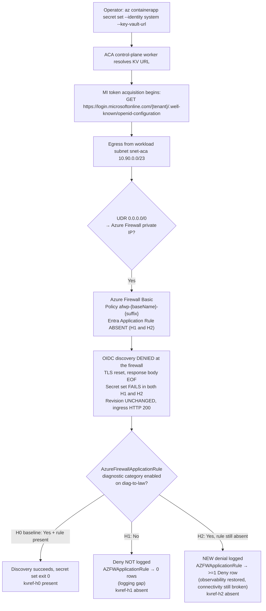

# ACA Secret Key Vault Reference — Logging Gap Variant (H4b) Lab

Reproduce the **logging-gap** failure surface where `az containerapp secret set --identity system --key-vault-url ...` fails with `Unable to get value using Managed identity` → `Get https://login.microsoftonline.com/<tenant>/.well-known/openid-configuration: EOF`, **and** the base H4 KQL query returns **zero `Deny` rows** — not because the firewall let the request through, but because the `AzureFirewallApplicationRule` diagnostic category is disabled. This lab proves that re-enabling the diagnostic category restores **observability** of the denial without restoring **connectivity**: the secret set still fails, because the Entra Application Rule is absent throughout.

This lab is a **reader-generated 17-gate Phase B falsification workflow**. You run `trigger.sh` and `falsify.sh` against your own Azure subscription to capture one live H0 → H1 → H2 cohort (files `01`-`13`) into [`labs/aca-secret-kv-ref-mi-network-path-h4b/evidence/`](https://github.com/yeongseon/azure-container-apps-practical-guide/tree/main/labs/aca-secret-kv-ref-mi-network-path-h4b/evidence). You then run `verify.sh`, which reads only those local files (no Azure API calls) and deterministically emits the four Phase B gate JSONs (`14`-`17`) that validate the narrow claim: with the Entra Application Rule absent in both H1 and H2, the **`AzureFirewallApplicationRule` diagnostic category enable flag** is the sole controlled variable, and toggling it changes only whether the ongoing denial is *visible*, never whether the secret set *succeeds*. The lab does **not** ship a committed cohort; each reader generates their own.

Bounded-scope disclosure: the workflow does **not** prove exact `stderr` wording, log ingestion latency, retry cadence, component identity behind the OIDC EOF, response body shape, token caching behavior, SKU generality (Basic vs Standard/Premium firewall), or region generality. Those confounders are carried explicitly in Gate 17 `explicit_drops`, so readers can see exactly where the evidence ceiling stops.

!!! info "Lab scope: H4b (logging-gap variant)"
    This lab reproduces **H4b only** — the topology and root cause are identical to [H4a](./aca-secret-kv-ref-mi-network-path.md) (hub-spoke + `0.0.0.0/0` UDR + Azure Firewall + missing Entra Application Rule), but the **controlled variable is different**. In H4a the Application Rule is toggled (present → success, absent → failure). In H4b the Application Rule stays **absent** in both experimental states, so the secret set **fails in both**; the variable that flips is the firewall's `AzureFirewallApplicationRule` diagnostic category (disabled → 0 Deny rows logged; enabled → Deny row logged).

    H4b is the trap behind the base-lab warning that **a zero-row result from the base H4 KQL does not falsify H4 by itself**. An operator who sees zero Deny rows and concludes "not a firewall problem" has been fooled by a logging gap, not cleared the firewall. The **connectivity** fix is still H4a's Application Rule — but you cannot even *see* the denial until you close the logging gap first. If your customer reports "no firewall block logs" despite having Azure Firewall in path, consult the [Playbook H4 Variants table](../playbooks/identity-and-configuration/secret-and-key-vault-reference-failure.md#h4-variants-when-base-h4-kql-returns-zero-rows) for the detection matrix and rule-out order. Follow-up reproducer labs for H4b through H4g are tracked in [issue #307](https://github.com/yeongseon/azure-container-apps-practical-guide/issues/307).

## Lab Metadata

| Attribute | Value |
|---|---|
| Difficulty | Advanced |
| Estimated Duration | 60-90 minutes (includes 8-12 min Firewall Basic deploy, a 60s H1 log-ingestion wait, plus an H2 log-ingestion poll of up to 10 × 60s) |
| Tier | Workload Profiles (Consumption profile) |
| Failure Mode | `az containerapp secret set --identity system --key-vault-url ...` fails with `Unable to get value using Managed identity`, and the base H4 KQL returns **0 Deny rows** because the `AzureFirewallApplicationRule` diagnostic category is disabled — the firewall is dropping the OIDC discovery request but not logging it |
| Skills Practiced | Azure Firewall diagnostic-category configuration, logging-gap diagnosis, log non-retroactivity reasoning, misattribution guarding, silence-gate reasoning for control-plane vs data-plane failures |

## 1) Background

Azure Container Apps supports **Key Vault references** in the secret manifest: the app declares a reference of the form `--key-vault-url https://<vault>.vault.azure.net/secrets/<name>` and the platform resolves it using a managed identity. Before the platform can call Key Vault it must acquire a token, and managed identity token acquisition requires an **OIDC discovery** step against the Entra ID authority — a plain HTTPS `GET https://login.microsoftonline.com/<tenant>/.well-known/openid-configuration` (the client may use `login.microsoft.com` instead — it picks one host at runtime). In an environment with workload-profile networking and a `0.0.0.0/0 → Azure Firewall` UDR on the workload subnet, that discovery request egresses through Azure Firewall. If the firewall policy carries no Application Rule permitting the Entra authority FQDN, the TLS handshake is terminated mid-stream and the caller sees an `EOF` — a network reset, not an HTTP status code. This is the H4 root cause, covered end-to-end in the [H4a lab](./aca-secret-kv-ref-mi-network-path.md).

H4b layers a **second, independent failure of observability** on top of that connectivity failure. Azure Firewall does not log Application Rule actions unless the **`AzureFirewallApplicationRule` diagnostic log category** is enabled on a diagnostic setting that routes to the queried Log Analytics workspace. When that category is disabled:

- The firewall **continues to drop** the OIDC discovery packet based on policy — connectivity is broken exactly as in H4a.
- The firewall emits **no log entry** for that drop — observability is broken.
- Both the resource-specific `AZFWApplicationRule` table and the legacy `AzureDiagnostics` table stay **empty** for the failure window, even though the firewall is actively denying traffic.

This creates a **logging gap**. An operator who runs the base H4 diagnostic KQL sees zero Deny rows and — if they treat zero rows as proof of innocence — wrongly concludes the firewall is not the cause and chases the wrong hypothesis (Key Vault RBAC, MI configuration, DNS). The base H4a lab guide explicitly warns that "a zero-row result from the base H4 KQL does not falsify H4 by itself"; H4b is the reproducer for exactly that trap.

Two properties of firewall diagnostic logging make the reproduction precise:

- **Logging is not retroactive.** Re-enabling the `AzureFirewallApplicationRule` category in H2 does **not** surface the earlier H1 denial. Only denials that occur *after* the category is enabled are logged. Therefore H2 must generate a **brand-new** denial (a fresh secret-set attempt) after logging is re-enabled to capture the smoking-gun Deny row.
- **Attribution must be guarded.** Because the ACA control-plane worker may internally retry, a Deny row appearing shortly after re-enable could in principle belong to a late retry of the H1 attempt rather than the new H2 attempt. The lab records `h2_diag_enable_iso` and `h2_secret_set_start_iso` separately and runs a **pre-H2 guard query** proving zero Deny rows exist in the window *between* re-enable and the new attempt, so the `>=1` row counted afterward is provably from the new H2 attempt.

### Architecture

<!-- diagram-id: architecture -->


!!! warning "Zero Deny rows is not proof the firewall is innocent"
    A disabled `AzureFirewallApplicationRule` diagnostic category produces the same empty KQL result as a firewall that never saw the packet. The two are indistinguishable from the query alone. Before treating zero rows as disproof of H4, verify the diagnostic category is actually enabled — `az monitor diagnostic-settings list --resource <firewall-id> --query "[?logs[?category=='AzureFirewallApplicationRule' && enabled]]"` returns an empty array when the category is off. This preflight is the first rule-out step in the [Playbook H4 Variants table](../playbooks/identity-and-configuration/secret-and-key-vault-reference-failure.md#h4-variants-when-base-h4-kql-returns-zero-rows).

!!! tip "Re-enabling logging is not the connectivity fix"
    H2 deliberately re-enables the diagnostic category **without** restoring the Entra Application Rule. The secret set still fails. Re-enabling logging only makes the ongoing denial *visible*; the actual connectivity fix is adding the Application Rule for `login.microsoftonline.com` and `login.microsoft.com`, which is the subject of the [H4a lab](./aca-secret-kv-ref-mi-network-path.md). Treat "logs now show the Deny row" as a diagnostic milestone, not a resolution.

## 2) Hypothesis

**IF** an Azure Container Apps environment routes workload-subnet egress through an Azure Firewall via `0.0.0.0/0` UDR, and the app has a system-assigned managed identity granted `Key Vault Secrets User` at the target Key Vault scope, and the firewall policy's Entra Application Rule is **absent**, and the only variable toggled between the two experimental states is the firewall's `AzureFirewallApplicationRule` diagnostic category, **THEN**:

- **H0 baseline (Entra rule present, diagnostic category enabled)**: `az containerapp secret set --identity system --key-vault-url ...` succeeds with exit code 0. The named secret `kvref-h0` appears in `properties.configuration.secrets` with a populated `keyVaultUrl` field. `latestReadyRevisionName` is unchanged (secret set does not create a new revision).
- **H1 (Entra rule removed AND diagnostic category disabled — the logging gap)**: The command fails with exit code non-zero. `stderr` carries the marker phrases `Failed to update secrets` and `Unable to get value using Managed identity` and includes the substring `openid-configuration`. `configuration.secrets` does NOT contain `kvref-h1`. `latestReadyRevisionName` is still unchanged. Ingress still returns HTTP 200 (the running data plane is not degraded; only the control-plane secret set is blocked). The firewall query over the H1 window returns **0 Deny rows** for the Entra authority FQDN — the denial occurred but was never logged.
- **H2 (diagnostic category re-enabled, Entra rule STILL absent — observability restored, connectivity still broken)**: A **new** secret-set attempt STILL fails with exit code non-zero. `kvref-h2` is absent from `configuration.secrets`. `latestReadyRevisionName` is still unchanged from baseline. Ingress still returns HTTP 200. A pre-H2 guard query over the window between diagnostic re-enable (`h2_diag_enable_iso`) and the new attempt (`h2_secret_set_start_iso`) returns **0 rows**. The firewall query over the H2 window (from `h2_secret_set_start_iso`) now returns **≥ 1 `Deny` row** for the Entra authority FQDN from the workload subnet source IP.

| Variable | Control state (H0) | H1 (logging gap) | H2 (observability restored) |
|---|---|---|---|
| Entra Application Rule Collection `allow-entra-authority` | Present in firewall policy | Absent | Absent (never restored) |
| `AzureFirewallApplicationRule` diagnostic category on `diag-to-law` | Enabled | **Disabled** (controlled variable) | **Re-enabled** (controlled variable) |
| `az containerapp secret set` exit code | `0` | Non-zero | Non-zero (still fails) |
| `stderr` markers | Empty | `Failed to update secrets`, `Unable to get value using Managed identity`, `openid-configuration` substring | Same as H1 |
| Secret in `configuration.secrets` | `kvref-h0` present with `keyVaultUrl` | `kvref-h1` absent | `kvref-h2` absent |
| Firewall Deny rows for Entra authority FQDN (`AZFWApplicationRule`) | n/a (Allow at H0) | **0 rows** (the gap) | **≥ 1 Deny row** (visible) |
| Pre-H2 guard window (enable → new attempt) | n/a | n/a | **0 rows** (non-retroactivity + misattribution guard) |
| `latestReadyRevisionName` | Baseline | Unchanged (silence gate) | Unchanged (silence gate) |
| Ingress HTTP status | 200 | 200 (silence gate) | 200 (silence gate) |

## 3) Runbook

### Prerequisites

- Azure CLI 2.80+ with the `containerapp` extension.
- Azure subscription permissions for: resource group deploy, role assignment (`Microsoft.Authorization/roleAssignments/write`), Container Apps management, Azure Firewall / Firewall Policy management, Key Vault management, and diagnostic-settings management (`Microsoft.Insights/diagnosticSettings/write`) on the firewall.
- Ability to reach the Log Analytics workspace via `az monitor log-analytics query` for the KQL evidence files 09, the pre-H2 guard, and 13.

### Deploy infrastructure

```bash
export RG="rg-aca-secret-kv-ref-mi-network-path-h4b"
export LOCATION="koreacentral"
export BASE_NAME="acasech4b01"

az group create --name "$RG" --location "$LOCATION"

az deployment group create \
    --resource-group "$RG" --name aca-secret-kv-ref-mi-network-path-h4b \
    --template-file labs/aca-secret-kv-ref-mi-network-path-h4b/infra/main.bicep \
    --parameters baseName="$BASE_NAME" \
    --parameters deploymentPrincipalId="$(az ad signed-in-user show --query id --output tsv)"
```

| Command | Why it is used |
|---|---|
| `az group create` | Creates the resource group that scopes all lab resources. |
| `--name` | Name of the resource group (`$RG`). |
| `--location` | Azure region for the resource group (`$LOCATION`). |
| `az deployment group create` | Deploys the Bicep template that provisions the VNet with a workload subnet, Azure Firewall Basic with Firewall Policy, `0.0.0.0/0 → Azure Firewall` UDR, Container Apps environment with workload-profile networking, Container App with system-assigned managed identity, Key Vault with RBAC authorization, and the `diag-to-law` diagnostic setting with the `AzureFirewallApplicationRule` and `AzureFirewallNetworkRule` categories enabled at baseline. |
| `--resource-group` | Target resource group for the deployment. |
| `--name` | Deployment name (`aca-secret-kv-ref-mi-network-path-h4b`). |
| `--template-file` | Path to the lab Bicep template. |
| `--parameters baseName` | Base name used to derive child resource names (for example the firewall policy `afwp-<baseName>-<suffix>`). |
| `--parameters deploymentPrincipalId` | Object ID of the deploying principal, resolved inline with `az ad signed-in-user show`, so the template can grant the correct RBAC assignments. |
| `az ad signed-in-user show` | Resolves the signed-in principal's object ID for the `deploymentPrincipalId` parameter. |
| `--query id` | Projects only the `id` field from the signed-in user object. |
| `--output tsv` | Emits the object ID as a bare string for inline substitution. |

Expected output:

- Resource group creation succeeds.
- Deployment `provisioningState` is `Succeeded`.
- Bicep outputs include `appName`, `environmentName`, `keyVaultName`, `keyVaultUri`, `firewallPolicyName`, `firewallResourceId`, `entraAuthorityRuleCollectionName`, `entraAuthorityRuleName`, `logAnalyticsCustomerId`.
- The `diag-to-law` diagnostic setting shows the `AzureFirewallApplicationRule` category enabled at baseline.

### Run the H0 baseline (`trigger.sh`)

```bash
bash labs/aca-secret-kv-ref-mi-network-path-h4b/trigger.sh
```

| Command | Why it is used |
|---|---|
| `trigger.sh` | Reads Bicep outputs, creates a Key Vault secret out-of-band, runs `az containerapp secret set --identity system --key-vault-url ...` against the healthy configuration (Entra rule present, diagnostic category enabled), captures baseline app state before and after, and writes raw evidence files `01-deployment-outputs.json` through `05-h0-app-state-after.json`. |

Expected output:

- `04-h0-secret-set-outcome.json` contains `exit_code: 0`.
- `05-h0-app-state-after.json` shows the secret `kvref-h0` present in `configuration.secrets` with a populated `keyVaultUrl` field.
- `05-h0-app-state-after.json` `latestReadyRevisionName` matches the value in `02-h0-app-state-before.json` (secret set does not create a new revision).
- `01-deployment-outputs.json` includes `firewall_resource_id` (the `--resource` target used later by `az monitor diagnostic-settings`).

### Run the H1 → H2 falsification (`falsify.sh`)

```bash
bash labs/aca-secret-kv-ref-mi-network-path-h4b/falsify.sh
```

| Command | Why it is used |
|---|---|
| `falsify.sh` | Performs H1 by removing the `allow-entra-authority` Application Rule Collection **and** disabling the `AzureFirewallApplicationRule` diagnostic category, then re-running `az containerapp secret set` with `kvref-h1` and querying the firewall log (expects 0 Deny rows). It then performs H2 by re-enabling the diagnostic category (recording `h2_diag_enable_iso`), capturing `h2_secret_set_start_iso` immediately before running a fresh `az containerapp secret set` with `kvref-h2` that still fails because the Entra rule is never restored, then evaluating the pre-H2 guard query (bounded by that true attempt-start timestamp but run after the attempt) and querying the firewall log for the new window (expects ≥ 1 Deny row). Writes raw evidence files `06-h1-firewall-rule-removed.json` through `13-h2-firewall-deny-log.json`. |

Expected output:

- `06-h1-firewall-rule-removed.json` confirms the rule collection is absent and records `controlled_variable_observability_disabled: true`.
- `07-h1-secret-set-outcome.json` contains `exit_code` non-zero and `stderr` with `Failed to update secrets`, `Unable to get value using Managed identity`, and `openid-configuration`.
- `08-h1-app-state.json` shows revision name unchanged, ingress HTTP 200, and `kvref-h1` absent from `configuration.secrets`.
- `09-h1-firewall-deny-log-absent.json` shows `final_deny_row_count: 0` — the denial occurred but was not logged (the logging gap).
- `10-h2-firewall-diagnostics-enabled.json` confirms the diagnostic category is re-enabled, records `h2_diag_enable_iso`, `h2_secret_set_start_iso`, `pre_h2_guard_deny_row_count: 0`, and `controlled_variable_absent_after_h2_observability_fix: true` (the Entra rule is still absent).
- `11-h2-secret-set-outcome.json` contains `exit_code` non-zero — the secret set STILL fails.
- `12-h2-app-state.json` shows revision name still unchanged from baseline, ingress HTTP 200, and `kvref-h2` absent from `configuration.secrets`.
- `13-h2-firewall-deny-log.json` shows `final_deny_row_count >= 1` — the new denial is now visible.

### Run the offline verifier over your locally generated pack

```bash
bash labs/aca-secret-kv-ref-mi-network-path-h4b/verify.sh
```

| Command | Why it is used |
|---|---|
| `verify.sh` | Reads only the local evidence files 01-13 that `trigger.sh` and `falsify.sh` just wrote into `evidence/`, runs the prerequisite/schema gates, then deterministically writes the four Phase B gate JSONs (14 cohort integrity, 15 H1 logging gap, 16 H2 observability restored, 17 bounded falsification). The verifier does not call Azure — you can re-run it offline after `cleanup.sh` has deleted the resource group, provided the local `evidence/` files remain in place. |

Expected output:

- 17/17 gate passes on a valid cohort.
- `evidence/14-cohort-integrity-gate.json` shows `g_baseline_revision_silence_invariant_holds: true` (proves `latestReadyRevisionName` is identical across snapshots 02, 05, 08, 12) and `e_h1_start_precedes_h2_diag_enable_and_h2_attempt: true` (proves the H1 window precedes the H2 re-enable, which precedes the new H2 attempt).
- `evidence/15-...-gate.json` shows the H1 logging-gap sub-gates pass, including `h1_deny_count == 0`.
- `evidence/16-h2-observability-restored-gate.json` shows the H2 sub-gates pass: diagnostic category enabled, Entra rule absent, secret set still fails, `kvref-h2` absent, ingress 200, revision unchanged, and `h2_deny_count >= 1`.
- `evidence/17-bounded-falsification-gate.json` enumerates the eight documented explicit drops (`stderr wording`, `log ingestion latency`, `retry cadence`, `component identity`, `response body shape`, `token caching`, `SKU generality`, `region generality`) and classifies the H1↔H2 flip as an **observability restoration**, not a connectivity fix.

### Optional: toggle the diagnostic category manually

The `falsify.sh` script already toggles the category. If you want to re-enable the `AzureFirewallApplicationRule` category independently after H1 disabled it:

```bash
FIREWALL_RESOURCE_ID="$(jq -r .firewall_resource_id labs/aca-secret-kv-ref-mi-network-path-h4b/evidence/01-deployment-outputs.json)"

az monitor diagnostic-settings update \
    --name diag-to-law \
    --resource "$FIREWALL_RESOURCE_ID" \
    --logs '[{"category":"AzureFirewallApplicationRule","enabled":true},{"category":"AzureFirewallNetworkRule","enabled":true}]'
```

| Command | Why it is used |
|---|---|
| `az monitor diagnostic-settings update` | Re-enables the `AzureFirewallApplicationRule` diagnostic category on the firewall's `diag-to-law` setting so subsequent denials are logged. This restores observability only; it does not add the Entra Application Rule, so the secret set continues to fail. |
| `--name` | Name of the diagnostic setting on the firewall (`diag-to-law`). |
| `--resource` | Full resource ID of the Azure Firewall, read from the deployment outputs. |
| `--logs` | Category enable/disable list; both firewall Application and Network rule categories are set to `enabled: true`. |

Expected output:

- The command returns the updated diagnostic-settings object with `AzureFirewallApplicationRule` `enabled: true`.
- A **new** `az containerapp secret set` attempt still fails (the Entra rule remains absent), but the resulting denial now appears in `AZFWApplicationRule` within ~60 seconds of ingestion.

## 4) Experiment Log

| Step | Action | Expected | Falsification |
|---|---|---|---|
| 1 | Deploy baseline infrastructure via `az deployment group create` | Deployment succeeds; app is `Healthy/Running`; ingress FQDN returns HTTP 200; `allow-entra-authority` rule collection present; `AzureFirewallApplicationRule` diagnostic category enabled | Deployment fails, or app never reaches `Healthy`, or the diagnostic category is not enabled after deploy |
| 2 | Run `trigger.sh` (H0 baseline) | `04-h0-secret-set-outcome.json` `exit_code: 0`; `kvref-h0` present in `configuration.secrets`; `latestReadyRevisionName` unchanged | H0 secret set fails despite the rule being present and logging enabled (indicates something other than the controlled variable is broken — invalidates the baseline) |
| 3 | Run `falsify.sh` phase H1 (remove rule + disable diagnostic category → attempt secret set) | `07-h1-secret-set-outcome.json` `exit_code` non-zero with the OIDC markers; `08-h1-app-state.json` shows revision name unchanged, ingress HTTP 200, `kvref-h1` absent | H1 secret set still succeeds (rule removal did not break connectivity — invalidates the topology), OR revision name changes (violates the silence-gate invariant), OR ingress goes down (indicates a data-plane failure, not the claimed control-plane failure) |
| 4 | Wait ≥ 60s for firewall log ingestion, then query the H1 window | `09-h1-firewall-deny-log-absent.json` returns `final_deny_row_count: 0` — the denial is not logged because the diagnostic category is disabled | A Deny row DOES appear in the H1 window (indicates the diagnostic category was not actually disabled — the logging gap was not reproduced), which would invalidate the H1 claim |
| 5 | Run `falsify.sh` phase H2 (re-enable diagnostic category, Entra rule STILL absent → attempt fresh secret set) | `11-h2-secret-set-outcome.json` `exit_code` non-zero; `12-h2-app-state.json` shows revision name STILL unchanged, ingress HTTP 200, `kvref-h2` absent | H2 secret set SUCCEEDS after re-enabling logging (would mean re-enabling diagnostics restored connectivity — impossible; indicates the Entra rule was accidentally restored, invalidating the observability-only claim), OR revision name changes (violates silence-gate invariant) |
| 6 | Verify non-retroactivity via the pre-H2 guard window, then query the H2 window | Pre-H2 guard (`h2_diag_enable_iso` → `h2_secret_set_start_iso`) returns 0 rows; `13-h2-firewall-deny-log.json` returns `final_deny_row_count >= 1` for the H2 window (from `h2_secret_set_start_iso`) with `Action == "Deny"` and destination FQDN in the two-host Entra authority set from source IP inside `10.90.0.0/23` | The pre-H2 guard window shows > 0 rows (misattribution: the counted Deny row cannot be cleanly attributed to the new H2 attempt), OR no Deny row appears in the H2 window after re-enabling logging (indicates the request bypassed the firewall entirely, invalidating the network-path claim) |
| 7 | Run `verify.sh` (hermetic offline) | 17/17 gates pass; Gate 14 revision-silence and timestamp-ordering sub-gates true; Gate 15 H1 `h1_deny_count == 0`; Gate 16 H2 `h2_deny_count >= 1` with secret set still failing; Gate 17 enumerates 8 explicit drops and classifies the flip as observability restoration | Any gate fails, especially `h1_deny_count != 0` (the logging gap was not reproduced) or the Gate 16 predicate showing the H2 secret set succeeded (connectivity was accidentally restored) |

### Why 0 rows is not proof of innocence

The central lesson of this lab is that the H1 KQL result — **zero Deny rows** — is produced by a firewall that *is* actively dropping the OIDC discovery request. The zero-row result is a property of the diagnostic *pipeline* (category disabled), not of the firewall's *policy decision* (deny). An operator who stops at "0 rows in `AZFWApplicationRule`, therefore not a firewall problem" has been fooled by the logging gap. H2 proves this directly: the same policy state (Entra rule absent) that produced zero rows in H1 produces a visible Deny row in H2 once the diagnostic category is re-enabled — nothing about connectivity changed, only whether the denial was recorded. This is why the [Playbook H4 Variants preflight](../playbooks/identity-and-configuration/secret-and-key-vault-reference-failure.md#h4-variants-when-base-h4-kql-returns-zero-rows) requires confirming the diagnostic category is enabled **before** treating a zero-row result as disproof of H4.

### Silence-gate invariant — why it is central to this lab

Unlike most Container Apps failure labs where the failure mode creates a new revision, a **secret set operation never creates a new revision**. Both `configuration.secrets` and the running data plane are managed under the same `latestReadyRevisionName` throughout H0, H1, and H2. This means:

1. The `latestReadyRevisionName` observed in `02-h0-app-state-before.json` must equal the value in `05-h0-app-state-after.json`, `08-h1-app-state.json`, AND `12-h2-app-state.json`. Gate 14 sub-gate `g_baseline_revision_silence_invariant_holds` proves this.
2. The ingress FQDN must return HTTP 200 throughout — the data plane is not degraded by a secret-set failure in either H1 or H2.
3. The failure signal is **only** visible in the exit code and `stderr` of `az containerapp secret set`, and — once the diagnostic category is enabled — in the firewall Deny log. In H1 the failure is doubly quiet: no revision change, no ingress downtime, AND no firewall log. That double silence is exactly what makes the logging gap dangerous.

Operators debugging real customer reports of this failure often start by looking at the running app and see nothing wrong, then look at the firewall logs and see nothing either, and prematurely conclude the report is spurious. The silence-gate invariant plus the logging-gap trap together prove that neither a healthy running data plane nor an empty firewall log is evidence against this failure.

## 5) Verification Queries

### KQL: firewall log for Entra authority FQDN (H1, pre-H2 guard, and H2 windows)

Run this query three times with different time bounds: the H1 window (expect 0 rows), the pre-H2 guard window from `h2_diag_enable_iso` to `h2_secret_set_start_iso` (expect 0 rows), and the H2 window from `h2_secret_set_start_iso` onward (expect ≥ 1 Deny row).

```kusto
let AcaSubnet = "10.90.0.0/23";
let EntraFqdns = dynamic(["login.microsoftonline.com", "login.microsoft.com"]);
let StartTime = todatetime("<window start ISO8601>");
let EndTime   = todatetime("<window end ISO8601>");
union isfuzzy=true
    (AZFWApplicationRule
        | where TimeGenerated between (StartTime .. EndTime)
        | where Fqdn has_any (EntraFqdns)
        | where ipv4_is_in_range(SourceIp, AcaSubnet)
        | project TimeGenerated, Action, Fqdn, SourceIp, TargetUrl, Policy, RuleCollection, Rule),
    (AzureDiagnostics
        | where TimeGenerated between (StartTime .. EndTime)
        | where Category == "AzureFirewallApplicationRule"
        | where msg_s has_any (EntraFqdns)
        | extend Action = extract(@"Action: (\w+)", 1, msg_s)
        | extend SourceIp = extract(@"from (\d+\.\d+\.\d+\.\d+):", 1, msg_s)
        | extend Fqdn = extract(@"Url: https?://([^/]+)", 1, msg_s)
        | where ipv4_is_in_range(SourceIp, AcaSubnet)
        | project TimeGenerated, Action, Fqdn, SourceIp, msg_s)
| order by TimeGenerated asc
```

Expected interpretation:

- **H1 window**: [Observed] 0 rows. The firewall dropped the OIDC discovery request, but the `AzureFirewallApplicationRule` category was disabled, so nothing was logged. This zero-row result is the logging gap — not evidence the firewall allowed the request.
- **Pre-H2 guard window** (`h2_diag_enable_iso` → `h2_secret_set_start_iso`): [Observed] 0 rows. This proves firewall logging is not retroactive (the earlier H1 denial did not appear when logging was re-enabled) and guards against misattributing a late-flushed H1 retry to the H2 attempt.
- **H2 window** (from `h2_secret_set_start_iso`): [Measured] ≥ 1 row with `Action == "Deny"` and `Fqdn` in the two-host Entra authority set from a source IP inside `10.90.0.0/23`. [Inferred] Because the Entra rule was never restored, this Deny row confirms the denial was ongoing the whole time and only became visible once the diagnostic category was re-enabled.

Both `login.microsoftonline.com` and `login.microsoft.com` are documented Entra authority endpoints; the OIDC discovery client may use either host, so `has_any` over the `EntraFqdns` list keeps the query robust. The `union isfuzzy=true` over `AZFWApplicationRule` (resource-specific schema) and `AzureDiagnostics` (legacy schema with `msg_s` free text) tolerates either firewall diagnostic delivery mode. [Not Proven] This query does not prove the exact ingestion latency; it only proves that, after a ≥ 60s wait, the Deny row is present in H2 and absent in H1.

### KQL: confirm the diagnostic category state at query time

Before treating an empty result as disproof, confirm whether the `AzureFirewallApplicationRule` category is actually enabled on the firewall's diagnostic setting. This is a control-plane check, not a log query:

```bash
FIREWALL_RESOURCE_ID="$(jq -r .firewall_resource_id labs/aca-secret-kv-ref-mi-network-path-h4b/evidence/01-deployment-outputs.json)"

az monitor diagnostic-settings list \
    --resource "$FIREWALL_RESOURCE_ID" \
    --query "value[].logs[?category=='AzureFirewallApplicationRule'].{category:category, enabled:enabled}"
```

| Command | Why it is used |
|---|---|
| `az monitor diagnostic-settings list` | Lists all diagnostic settings on the firewall so you can confirm whether the `AzureFirewallApplicationRule` category is enabled. In H1 this returns `enabled: false` (the logging gap); in H0 and H2 it returns `enabled: true`. |
| `--resource` | Full resource ID of the Azure Firewall, read from the deployment outputs. |
| `--query` | Projects the `AzureFirewallApplicationRule` category's `enabled` flag from each diagnostic setting so the gap is visible without scrolling the full object. |

Expected:

- [Observed] During H1: the category's `enabled` flag is `false` — the query result explains the zero-row KQL result.
- [Observed] During H0 and H2: the flag is `true`.

## 6) Portal Evidence (reader-generated captures)

Azure Portal screenshots to collect after running the H0 → H1 → H2 sequence. Save to `docs/assets/troubleshooting/aca-secret-kv-ref-mi-network-path-h4b/` with the exact filenames listed in the [Screenshot capture checklist](#screenshot-capture-checklist) below. Follow the PII-replacement rules in the [repository `AGENTS.md`](https://github.com/yeongseon/azure-container-apps-practical-guide/blob/main/AGENTS.md#portal-screenshot-capture-pii-replacement-rules) — use text replacement (not black-box redaction) for subscription IDs, tenant names, and user emails.

!!! note "Portal captures are reader-generated"
    The captures listed below are **not shipped** with this lab guide; real Portal PNG capture is a deferred follow-up tracked in [issue #362](https://github.com/yeongseon/azure-container-apps-practical-guide/issues/362). Each reader captures their own evidence against their own subscription after running `trigger.sh` and `falsify.sh`. The `!!! note` blocks in this section describe **what to observe** in each blade so the reader can verify the capture matches the expected state before saving it.

### Container App — Secrets blade (H0 baseline)

!!! note "Portal evidence — Container App Secrets blade after H0"
    The **Container App → Secrets** blade after `trigger.sh` completes shows one row: `kvref-h0` with `Source: Key Vault reference` and a URL pointing to `https://<vault>.vault.azure.net/secrets/kvref-h0`. This proves the H0 baseline succeeded while both the Entra rule and the diagnostic category were present.

    Target filename: `01-h0-secrets-blade.png`

### Container App — Revisions blade (silence gate)

!!! note "Portal evidence — Revisions blade during H1"
    The **Container App → Revisions and replicas** blade during the H1 window shows the same active revision as before (unchanged name), `Running` state, `Healthy` health state, replica count unchanged. This is the visual proof of the silence-gate invariant: the secret-set failure does not degrade the data plane and does not create a new revision.

    Target filename: `02-h1-revisions-unchanged.png`

### Firewall — Diagnostic settings (H1 category disabled)

!!! note "Portal evidence — Firewall diagnostic settings with the category disabled"
    The **Azure Firewall → Diagnostic settings → `diag-to-law`** blade during H1 shows the `AzureFirewallApplicationRule` log category **unchecked** (disabled). This is the visual proof of the trigger: the firewall is still dropping the request, but the category that would record the drop is off.

    Target filename: `03-h1-diag-category-disabled.png`

### Log Analytics — zero Deny rows during H1 (the logging gap)

!!! note "Portal evidence — Log Analytics KQL returning zero rows during H1"
    A KQL query against the H1 window (using §5) returns **no rows**. Paired with the disabled-category capture above, this is the visual proof that a zero-row firewall result can coexist with an active denial — the logging gap. Do not read this empty result as evidence the firewall allowed the request.

    Target filename: `04-h1-kql-zero-rows.png`

### Firewall — Diagnostic settings (H2 category re-enabled)

!!! note "Portal evidence — Firewall diagnostic settings with the category re-enabled"
    The same **`diag-to-law`** blade after the H2 fix shows the `AzureFirewallApplicationRule` category **checked** (enabled). The Entra Application Rule is still absent — only the diagnostic category changed.

    Target filename: `05-h2-diag-category-enabled.png`

### Log Analytics — Firewall Deny row during H2 (observability restored)

!!! note "Portal evidence — Log Analytics KQL result showing the H2 Deny row"
    The same KQL against the H2 window returns at least one row with `Action == "Deny"` and `Fqdn` in `["login.microsoftonline.com", "login.microsoft.com"]` from a source IP inside `10.90.0.0/23`. Paired with the H1 zero-row capture, this is the visual proof that the diagnostic category is the sole controlling variable for *visibility* — the denial (and the secret-set failure) was present the whole time.

    Target filename: `06-h2-kql-deny-row.png`

### Screenshot capture checklist

| Screenshot | File name | Source |
|---|---|---|
| H0 Secrets blade | `01-h0-secrets-blade.png` | Container App → Settings → Secrets |
| H1 Revisions unchanged | `02-h1-revisions-unchanged.png` | Container App → Revisions and replicas |
| H1 diagnostic category disabled | `03-h1-diag-category-disabled.png` | Azure Firewall → Diagnostic settings → `diag-to-law` |
| H1 KQL zero rows | `04-h1-kql-zero-rows.png` | Log Analytics workspace → Logs → paste KQL from §5 (H1 window) |
| H2 diagnostic category re-enabled | `05-h2-diag-category-enabled.png` | Same diagnostic-settings blade after H2 |
| H2 Deny KQL result | `06-h2-kql-deny-row.png` | Log Analytics workspace → Logs → paste KQL from §5 (H2 window) |

## Clean Up

```bash
bash labs/aca-secret-kv-ref-mi-network-path-h4b/cleanup.sh
```

| Command | Why it is used |
|---|---|
| `cleanup.sh` | Deletes the resource group and all child resources (async). Azure Firewall Basic plus its two public IPs dominate the cost of this lab (~$24/day), so this step must not be skipped. |

## Related Playbook

- [Secret and Key Vault Reference Failure — H4 Variants: When Base H4 KQL Returns Zero Rows](../playbooks/identity-and-configuration/secret-and-key-vault-reference-failure.md#h4-variants-when-base-h4-kql-returns-zero-rows) (H4b row)

## See Also

- [ACA Secret Key Vault Reference — Managed Identity Network Path Lab (H4a base variant)](./aca-secret-kv-ref-mi-network-path.md) (proves the connectivity fix this variant does *not* apply)
- [Managed Identity Auth Failure Playbook](../playbooks/identity-and-configuration/managed-identity-auth-failure.md)
- [Managed Identity Key Vault Failure Lab](./managed-identity-key-vault-failure.md) (sibling lab — proves the RBAC-missing path)
- [Egress Control](../../platform/networking/egress-control.md)

## Sources

- [Azure Firewall logs and metrics](https://learn.microsoft.com/en-us/azure/firewall/logs-and-metrics)
- [Manage secrets in Azure Container Apps](https://learn.microsoft.com/en-us/azure/container-apps/manage-secrets)
- [Managed identities in Azure Container Apps](https://learn.microsoft.com/en-us/azure/container-apps/managed-identity)
- [Configure UDR with Azure Firewall to lock down outbound traffic](https://learn.microsoft.com/en-us/azure/container-apps/user-defined-routes)
- [Securing a custom VNET in Azure Container Apps with NSG and Azure Firewall](https://learn.microsoft.com/en-us/azure/container-apps/firewall-integration)
