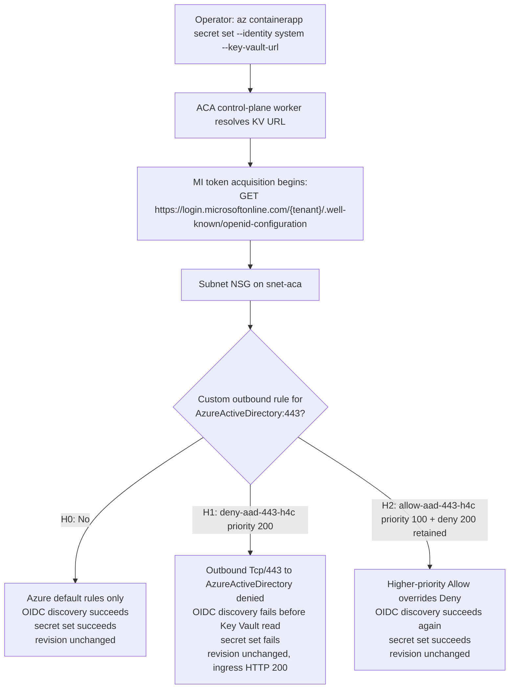

# ACA Secret Key Vault Reference — NSG Deny Variant (H4c) Lab

Reproduce the **NSG deny** failure surface where `az containerapp secret set --identity system --key-vault-url ...` fails with `Unable to get value using Managed identity` → `Get https://login.microsoftonline.com/<tenant>/.well-known/openid-configuration: EOF`, **without any Azure Firewall or UDR in path**. This lab proves that an outbound NSG rule on the ACA workload subnet that denies `AzureActiveDirectory:443` can break Entra authority reachability in a topology that contains no Azure Firewall or UDR at all, and that adding the documented higher-priority Allow restores success with the same Key Vault, identity, and RBAC state.

This lab is a **reader-generated 17-gate Phase B falsification workflow**. You run `trigger.sh` and `falsify.sh` against your own Azure subscription to capture one live H0 → H1 → H2 cohort (files `01`-`13`) into [`labs/aca-secret-kv-ref-mi-network-path-h4c/evidence/`](https://github.com/yeongseon/azure-container-apps-practical-guide/tree/main/labs/aca-secret-kv-ref-mi-network-path-h4c/evidence). You then run `verify.sh`, which reads only those local files (no Azure API calls) and deterministically emits the four Phase B gate JSONs (`14`-`17`) that validate the narrow claim: the ACA workload-subnet NSG rule set is the sole controlled variable, and flipping it changes whether the managed-identity OIDC discovery step can reach the public Entra authority.

Bounded-scope disclosure: the workflow does **not** prove NSG-before-Azure-Firewall ordering, NSG flow-log behavior, exact Entra IP resolution at failure time, or that every ACA control-plane call uses the same subnet-governed egress path. NSG rule enumeration is a direct **configuration-state** observation; the claim that the ACA-managed control-plane secret resolver follows that same subnet-governed egress path is only an inference justified by the H0/H1/H2 secret-set behavior. Those confounders are carried explicitly in Gate 17 `explicit_drops`.

!!! info "Lab scope: H4c (NSG deny variant)"
    This lab reproduces **H4c only** — Azure-provided DNS on the VNet, **no Azure Firewall**, **no UDR**, no custom `dhcpOptions.dnsServers`, and an NSG attached to the ACA workload subnet. It is deliberately the opposite of [H4a](./aca-secret-kv-ref-mi-network-path.md): H4a proves an egress firewall path, while H4c proves a subnet-NSG deny path in a topology that contains no firewall at all.

    The diagnostic signature is therefore different from H4a/H4b/H4e: the key smoking gun is `az network nsg rule list` showing outbound rule `deny-aad-443-h4c` with priority `200`, direction `Outbound`, access `Deny`, protocol `Tcp`, destination `AzureActiveDirectory`, and destination port `443`, followed by `az containerapp secret set` failure. H2 then adds `allow-aad-443-h4c` at priority `100` while leaving the deny in place, proving the documented remediation by direct rule precedence. Reader-generated Portal captures for this guide are deferred to follow-up issue [#368](https://github.com/yeongseon/azure-container-apps-practical-guide/issues/368). Follow-up reproducer labs for the remaining H4 variants remain tracked in [issue #307](https://github.com/yeongseon/azure-container-apps-practical-guide/issues/307).

## Lab Metadata

| Attribute | Value |
|---|---|
| Difficulty | Advanced |
| Estimated Duration | 20-30 minutes (includes 6-10 min ACA/KV deploy, one short H1 NSG settle, and one short H2 retry loop; no Azure Firewall deploy) |
| Tier | Workload Profiles (Consumption profile) |
| Failure Mode | `az containerapp secret set --identity system --key-vault-url ...` fails with `Unable to get value using Managed identity` because the ACA workload-subnet NSG denies outbound `AzureActiveDirectory:443` before the OIDC discovery TCP connection can reach the public Microsoft endpoint |
| Skills Practiced | NSG rule precedence diagnosis, service-tag reasoning, control-plane-vs-subnet-path evidence discipline, silence-gate reasoning for control-plane vs data-plane failures |

## 1) Background

Azure Container Apps supports **Key Vault references** in the secret manifest: the app declares a reference of the form `--key-vault-url https://<vault>.vault.azure.net/secrets/<name>` and the platform resolves it using a managed identity. Before the platform can call Key Vault it must acquire a token, and managed identity token acquisition requires an **OIDC discovery** step against the Entra authority — a plain HTTPS `GET https://login.microsoftonline.com/<tenant>/.well-known/openid-configuration` (the client may use `login.microsoft.com` instead — it picks one host at runtime).

H4c reproduces a subnet-NSG failure in a topology where **no outbound firewall exists at all**. A Network Security Group attached to the ACA workload subnet filters outbound flows directly; because this lab has no hub firewall or downstream appliance in the path, a firewall-deny explanation is structurally impossible here. This lab therefore does **not** assert anything about how an NSG and a firewall are evaluated relative to each other in topologies that do contain a firewall. If the subnet NSG contains a rule that denies outbound `Tcp/443` to the `AzureActiveDirectory` service tag, the managed-identity OIDC discovery call can fail even when Key Vault, RBAC, revisions, ingress, and DNS stay healthy. Adding a higher-priority Allow for the same service tag and port restores the exact same secret-set operation without changing any other lab variable.

This is why the evidence discipline matters:

- [Observed] NSG rule enumeration directly captures the configured outbound rule set on the workload subnet.
- [Observed] `07-h1-secret-set-outcome.json` fails while `11-h2-secret-set-outcome.json` succeeds.
- [Observed] `08-h1-app-state.json` and `12-h2-app-state.json` show the same revision, ingress HTTP 200, and only the secret-reference presence flipping.
- [Inferred] The ACA-managed control-plane secret resolver is strongly suggested to use a subnet-governed egress path affected by the NSG because H0 succeeds, H1 fails after only the Deny is added, and H2 succeeds after only the higher-priority Allow is added.
- [Not Proven] Azure does **not** formally document that every ACA control-plane secret-resolution call must use the exact same subnet-governed path as implied by this flip. That remains an explicit Gate 17 drop.

### Architecture

<!-- diagram-id: architecture -->


!!! warning "The subnet NSG configuration is not the same thing as a proven control-plane path contract"
    The `az network nsg rule list` output is the rule set attached to the delegated ACA workload subnet. [Observed] That is valid evidence for the **configured network policy**. [Inferred] The ACA-managed control-plane secret resolver likely used a subnet-governed egress path affected by that policy because H0 succeeded before the Deny existed, H1 failed after the Deny was added, and H2 succeeded after the higher-priority Allow was added. However, Azure does **not** document that every ACA control-plane secret-resolution call must share an identical subnet-governed path, so the guide never states that equivalence as proven.

!!! tip "Why H4c is explicitly not H4a"
    The baseline topology in this lab has an NSG attached to the workload subnet, but no Azure Firewall resource, no route table on the ACA subnet, and no custom VNet DNS servers. H0 and H2 both succeed with the identical Key Vault, identity, and RBAC state. That isolates the H1→H2 controlling variable to the NSG rule set and rules out the H4a firewall path by construction.

## 2) Hypothesis

**IF** an Azure Container Apps environment uses Azure-provided DNS on its infrastructure VNet, and the app has a system-assigned managed identity granted `Key Vault Secrets User` at the target Key Vault scope, and there is **no Azure Firewall and no UDR** on the workload path, **THEN**:

- **H0 baseline (NSG attached, no custom AAD rule)**: `az containerapp secret set --identity system --key-vault-url ...` succeeds with exit code 0. The named secret `kvref-h0` appears in `properties.configuration.secrets` with a populated `keyVaultUrl` field. `latestReadyRevisionName` is unchanged.
- **H1 (NSG deny present)**: After creating outbound rule `deny-aad-443-h4c` with priority `200`, direction `Outbound`, access `Deny`, protocol `Tcp`, destination `AzureActiveDirectory`, and destination port `443`, the command fails with exit code non-zero. `stderr` carries the marker phrases `Failed to update secrets`, `Unable to get value using Managed identity`, and includes the substring `openid-configuration`. `configuration.secrets` does **not** contain `kvref-h1`. `latestReadyRevisionName` is still unchanged. Ingress still returns HTTP 200. [Observed] NSG rule enumeration shows the Deny exists and no higher-priority matching Allow exists.
- **H2 (higher-priority Allow added while Deny remains)**: After creating outbound rule `allow-aad-443-h4c` with priority `100` for the same service tag and port while keeping the Deny in place, a **new** secret-set attempt succeeds with exit code 0. `kvref-h2` appears in `configuration.secrets`. `latestReadyRevisionName` is still unchanged from baseline. Ingress still returns HTTP 200. [Observed] NSG rule enumeration shows the Allow exists with numerically lower priority than the Deny and therefore governs. [Inferred] The control-plane resolver is no longer blocked by the subnet NSG path because the secret-set operation succeeds again without any other topology change.

| Variable | Control state (H0) | H1 (NSG deny present) | H2 (Allow added above Deny) |
|---|---|---|---|
| Azure Firewall in topology | Absent | Absent | Absent |
| UDR on ACA subnet | Absent | Absent | Absent |
| VNet `dhcpOptions.dnsServers` | Azure-provided DNS (`[]`) | Azure-provided DNS (`[]`) | Azure-provided DNS (`[]`) |
| NSG attached to ACA subnet | Present | Present | Present |
| Custom outbound AAD rule | None | `deny-aad-443-h4c` priority `200` | `allow-aad-443-h4c` priority `100` + Deny `200` retained |
| Destination tuple | n/a | `AzureActiveDirectory` / `Tcp` / `443` | `AzureActiveDirectory` / `Tcp` / `443` |
| `az containerapp secret set` exit code | `0` | Non-zero | `0` |
| Secret in `configuration.secrets` | `kvref-h0` present | `kvref-h1` absent | `kvref-h2` present |
| NSG rule enumeration | No H4c custom rule | Deny present, no higher-priority Allow | Allow present with priority `100 < 200` |
| `latestReadyRevisionName` | Baseline | Unchanged (silence gate) | Unchanged (silence gate) |
| Ingress HTTP status | 200 | 200 | 200 |

## 3) Runbook

### Prerequisites

- Azure CLI 2.80+ with the `containerapp` extension.
- Azure subscription permissions for: resource group deploy, role assignment (`Microsoft.Authorization/roleAssignments/write`), Container Apps management, Key Vault management, and NSG rule management.
- `jq`, `curl`, and a local shell that can run the lab scripts.

### Deploy infrastructure

```bash
export RG="rg-aca-secret-kv-ref-mi-network-path-h4c"
export LOCATION="koreacentral"
export BASE_NAME="acasech4c01"

az group create --name "$RG" --location "$LOCATION"

az deployment group create \
    --resource-group "$RG" \
    --name aca-secret-kv-ref-mi-network-path-h4c \
    --template-file labs/aca-secret-kv-ref-mi-network-path-h4c/infra/main.bicep \
    --parameters baseName="$BASE_NAME" \
    --parameters deploymentPrincipalId="$(az ad signed-in-user show --query id --output tsv)"
```

| Command | Why it is used |
|---|---|
| `az group create` | Creates the resource group that scopes all lab resources. |
| `--name` | Name of the resource group (`$RG`). |
| `--location` | Azure region for the resource group (`$LOCATION`). |
| `az deployment group create` | Deploys the Bicep template that provisions the VNet with a delegated ACA subnet, NSG attached inline to that subnet, Container Apps environment with workload-profile networking, Container App with system-assigned managed identity, Key Vault with RBAC authorization mode, and Log Analytics. No Azure Firewall or route table is deployed. |
| `--resource-group` | Target resource group for the deployment. |
| `--name` | Deployment name (`aca-secret-kv-ref-mi-network-path-h4c`). |
| `--template-file` | Path to the lab Bicep template. |
| `--parameters baseName` | Base name used to derive child resource names. |
| `--parameters deploymentPrincipalId` | Object ID of the deploying principal, resolved inline with `az ad signed-in-user show`, so the template can grant the correct RBAC assignments. |
| `az ad signed-in-user show` | Resolves the signed-in principal's object ID for the `deploymentPrincipalId` parameter. |
| `--query id` | Projects only the `id` field from the signed-in user object. |
| `--output tsv` | Emits the object ID as a bare string for inline substitution. |

Expected output:

- Resource group creation succeeds.
- Deployment `provisioningState` is `Succeeded`.
- Bicep outputs include `appName`, `environmentName`, `keyVaultName`, `keyVaultUri`, `vnetName`, `acaSubnetPrefix`, `nsgName`, and `logAnalyticsCustomerId`.
- `trigger.sh` later records that the VNet uses Azure-provided DNS, the ACA subnet has no route table, the subnet NSG is attached, and no custom H4c deny/allow rule exists yet.

### Run the H0 baseline (`trigger.sh`)

```bash
bash labs/aca-secret-kv-ref-mi-network-path-h4c/trigger.sh
```

| Command | Why it is used |
|---|---|
| `trigger.sh` | Reads Bicep outputs, records baseline topology anchors proving NSG attached / no firewall / no UDR / Azure-provided DNS, enumerates the baseline NSG rules to prove `deny-aad-443-h4c` and `allow-aad-443-h4c` do not exist yet, creates a Key Vault secret out-of-band, runs `az containerapp secret set --identity system --key-vault-url ...` against the healthy configuration, captures baseline app state before and after, and writes raw evidence files `01` through `05`. |

Expected output:

- `04-h0-secret-set-outcome.json` contains `exit_code: 0`.
- `05-h0-app-state-after.json` shows the secret `kvref-h0` present in `configuration.secrets` with a populated `keyVaultUrl` field.
- `05-h0-app-state-after.json` `latestReadyRevisionName` matches the value in `02-h0-app-state-before.json` (secret set does not create a new revision).
- `01-deployment-outputs.json` shows `nsg_attached: true`, `azure_firewall_present: false`, `route_table_attached: false`, `uses_azure_provided_dns: true`, and both `baseline_deny_aad_443_h4c_present: false` and `baseline_allow_aad_443_h4c_present: false`.

### Run the H1 → H2 falsification (`falsify.sh`)

```bash
bash labs/aca-secret-kv-ref-mi-network-path-h4c/falsify.sh
```

| Command | Why it is used |
|---|---|
| `falsify.sh` | Performs H1 by creating outbound NSG rule `deny-aad-443-h4c` (priority `200`, `Outbound`, `Deny`, `Tcp`, destination `AzureActiveDirectory`, port `443`), waiting briefly for rule convergence, and then re-running `az containerapp secret set` with `kvref-h1` while capturing the failure surface and NSG rule enumeration proving no higher-priority matching Allow exists. It then performs H2 by creating outbound NSG rule `allow-aad-443-h4c` (priority `100`) for the same tuple while leaving the Deny in place, retries a fresh `az containerapp secret set` with `kvref-h2` until the short settle window clears, and captures a new NSG rule enumeration proving the Allow now governs. Writes raw evidence files `06` through `13`. |

Expected output:

- `06-h1-nsg-deny-created.json` confirms `deny-aad-443-h4c` exists with priority `200` and `higher_priority_matching_allow_count: 0`.
- `07-h1-secret-set-outcome.json` contains `exit_code` non-zero and `stderr` with `Failed to update secrets`, `Unable to get value using Managed identity`, and `openid-configuration`.
- `08-h1-app-state.json` shows revision name unchanged, ingress HTTP 200, and `kvref-h1` absent from `configuration.secrets`.
- `09-h1-nsg-effective-rules.json` shows `governing_rule_name: "deny-aad-443-h4c"` and `higher_priority_matching_allow_count: 0`.
- `10-h2-nsg-allow-created.json` confirms `allow-aad-443-h4c` exists with priority `100` while the Deny remains at `200`.
- `11-h2-secret-set-outcome.json` contains `exit_code: 0`.
- `12-h2-app-state.json` shows revision name still unchanged from baseline, ingress HTTP 200, and `kvref-h2` present in `configuration.secrets`.
- `13-h2-nsg-effective-rules.json` shows `governing_rule_name: "allow-aad-443-h4c"` and `highest_priority_matching_allow.name: "allow-aad-443-h4c"`.

### Run the offline verifier over your locally generated pack

```bash
bash labs/aca-secret-kv-ref-mi-network-path-h4c/verify.sh
```

| Command | Why it is used |
|---|---|
| `verify.sh` | Reads only the local evidence files `01`-`13` that `trigger.sh` and `falsify.sh` wrote into `evidence/`, runs the prerequisite/schema gates, then deterministically writes the four Phase B gate JSONs (14 cohort integrity, 15 H1 NSG deny, 16 H2 allow remediation, 17 bounded falsification). The verifier does not call Azure — you can re-run it offline after `cleanup.sh` has deleted the resource group, provided the local `evidence/` files remain in place. |

Expected output:

- 17/17 gate passes on a valid cohort.
- `evidence/14-cohort-integrity-gate.json` shows the revision silence invariant, the NSG-attached / no-firewall / no-UDR / Azure-provided-DNS anchors, and the absence of storage-account / flow-log artifacts.
- `evidence/15-h1-nsg-deny-produces-failure-gate.json` shows the H1 sub-gates pass, including the deny-rule tuple and absence of a higher-priority matching Allow.
- `evidence/16-h2-allow-remediation-restores-success-gate.json` shows the H2 sub-gates pass, including the Allow priority `100 < 200` and `kvref-h2` presence.
- `evidence/17-bounded-falsification-gate.json` enumerates the explicit drops for NSG-before-firewall ordering, flow-log behavior, control-plane path uniformity, exact Entra IP resolution, and Key Vault firewall/RBAC failure.

### Optional: inspect the NSG rules manually during H1 and H2

```bash
az network nsg rule list \
    --resource-group "$RG" \
    --nsg-name "$(jq -r .nsg_name labs/aca-secret-kv-ref-mi-network-path-h4c/evidence/01-deployment-outputs.json)"

az containerapp show \
    --name "$(jq -r .app_name labs/aca-secret-kv-ref-mi-network-path-h4c/evidence/01-deployment-outputs.json)" \
    --resource-group "$RG" \
    --query "properties.configuration.secrets"
```

| Command | Why it is used |
|---|---|
| `az network nsg rule list` | Enumerates the custom outbound rules on the workload-subnet NSG so you can confirm the exact H1 Deny tuple and the H2 Allow-over-Deny precedence directly. |
| `--resource-group` | Limits the query to the lab resource group. |
| `--nsg-name` | Names the lab NSG, read from the evidence pack. |
| `az containerapp show` | Reads the current Container App configuration so you can inspect whether `kvref-h1` is absent during H1 and `kvref-h2` is present after H2. |
| `--name` | Names the Container App, read from the evidence pack. |
| `--resource-group` | Targets the lab resource group. |
| `--query` | Projects only `properties.configuration.secrets` for a tight configuration-state view. |

Expected output:

- [Observed] During H1, `az network nsg rule list` includes `deny-aad-443-h4c` at priority `200` and no higher-priority matching Allow for `AzureActiveDirectory:443`.
- [Observed] During H2, `az network nsg rule list` includes `allow-aad-443-h4c` at priority `100` above the retained Deny at `200`.
- [Observed] During H1, `az containerapp show --query "properties.configuration.secrets"` does not include `kvref-h1`; during H2 it includes `kvref-h2`.
- [Inferred] Because H0 succeeds, H1 fails, and H2 succeeds with no firewall, DNS, UDR, Key Vault, identity, or RBAC change, the control-plane secret resolver is strongly suggested to be affected by the workload-subnet NSG path.
- [Not Proven] These CLI queries alone do **not** prove all ACA control-plane calls use the same subnet-governed egress path.

## 4) Experiment Log

| Step | Action | Expected | Falsification |
|---|---|---|---|
| 1 | Deploy baseline infrastructure via `az deployment group create` | Deployment succeeds; app is `Healthy/Running`; ingress FQDN returns HTTP 200; NSG attached to ACA subnet; no Azure Firewall exists; no route table attached to the ACA subnet; VNet uses Azure-provided DNS | Deployment fails, or app never reaches `Healthy`, or the baseline topology includes a firewall / UDR / custom VNet DNS, which would invalidate the H4c isolation |
| 2 | Run `trigger.sh` (H0 baseline) | `04-h0-secret-set-outcome.json` `exit_code: 0`; `kvref-h0` present in `configuration.secrets`; `latestReadyRevisionName` unchanged; baseline NSG rule list proves no custom H4c deny/allow rule exists | H0 secret set fails without the H4c rule mutation (indicates something other than the controlled variable is broken — invalidates the baseline) |
| 3 | Run `falsify.sh` phase H1 (create NSG deny → attempt secret set) | `07-h1-secret-set-outcome.json` `exit_code` non-zero with the OIDC markers; `08-h1-app-state.json` shows revision name unchanged, ingress HTTP 200, `kvref-h1` absent | H1 secret set still succeeds (NSG deny did not control the failure), OR revision name changes (violates the silence-gate invariant), OR ingress goes down (indicates a data-plane failure instead of the claimed control-plane failure) |
| 4 | Capture H1 NSG rule enumeration | `09-h1-nsg-effective-rules.json` shows `deny-aad-443-h4c` governs `AzureActiveDirectory:443` and no higher-priority matching Allow exists | Rule enumeration does not show the Deny, or shows a higher-priority matching Allow already existed, which means H1 did not isolate the intended variable |
| 5 | Run `falsify.sh` phase H2 (add higher-priority Allow, keep Deny, attempt fresh secret set) | `11-h2-secret-set-outcome.json` `exit_code: 0`; `12-h2-app-state.json` shows revision name still unchanged from baseline, ingress HTTP 200, `kvref-h2` present | H2 secret set still fails after the higher-priority Allow is added (indicates the deny/allow precedence alone is not sufficient to explain recovery) |
| 6 | Capture H2 NSG rule enumeration | `13-h2-nsg-effective-rules.json` shows `allow-aad-443-h4c` priority `100` now governs above Deny priority `200` | Rule enumeration still shows the Deny governing, or the Allow is absent, which means the documented remediation was not actually applied |
| 7 | Run `verify.sh` (hermetic offline) | 17/17 gates pass; Gate 14 anchors the non-H4a topology; Gate 15 proves H1 deny + failure; Gate 16 proves H2 allow remediation + recovery; Gate 17 enumerates the bounded explicit drops | Any gate fails, especially if H1 lacks the deny-governs predicate or H2 lacks the allow-governs predicate |

### Evidence discipline for H4c

This lab intentionally separates **what is directly observed** from **what is only inferred**:

- [Observed] `06-h1-nsg-deny-created.json`, `09-h1-nsg-effective-rules.json`, `10-h2-nsg-allow-created.json`, and `13-h2-nsg-effective-rules.json` capture the **configured NSG rule state** and rule-precedence evidence.
- [Observed] `07-h1-secret-set-outcome.json` fails, while `11-h2-secret-set-outcome.json` succeeds.
- [Observed] `08-h1-app-state.json` and `12-h2-app-state.json` keep the same revision and ingress HTTP 200 while only the secret-reference presence flips.
- [Strongly Suggested] The ACA-managed control-plane secret resolver follows a subnet-governed path affected by the NSG because the secret-set result flips exactly with the deny/allow mutation and no firewall/UDR/DNS/RBAC variable changes.
- [Not Proven] Azure does not document that all ACA control-plane secret-resolution calls must share the same subnet-governed egress path. That equivalence is intentionally left as an explicit drop in Gate 17.

Gate 17 carries these explicit drops verbatim:

- Does NOT prove NSG-before-Azure-Firewall ordering (no Azure Firewall is deployed in this lab).
- Does NOT prove NSG flow-log behavior (flow logs and storage accounts are intentionally out of scope).
- Does NOT prove all ACA control-plane calls use the same subnet-governed egress path.
- Does NOT prove exact Entra IP resolution at failure time (it proves the NSG rule targets the Microsoft-managed `AzureActiveDirectory` service tag).
- Does NOT prove Key Vault firewall/RBAC failure (KV, identity, RBAC, revision, ingress held constant).

### Why this is not a firewall lab

The baseline topology is deliberately silent on firewall evidence because there is **no firewall** to inspect. `01-deployment-outputs.json` captures four direct anchors:

1. `nsg_attached: true`
2. `azure_firewall_present: false`
3. `route_table_attached: false`
4. `uses_azure_provided_dns: true`

That means the H1 failure cannot be explained by H4a/H4b-style firewall denial. With no firewall anywhere in the topology, the subnet NSG itself denies outbound `AzureActiveDirectory:443`, so no firewall theory is needed to explain the failure. This does **not** prove how an NSG and a firewall would be ordered relative to each other when both are present. This is the point of the H4c variant: the same customer-facing OIDC discovery error can originate from an NSG rule even when the usual AzFW-deny hypothesis is structurally impossible.

## 5) Verification Queries

### CLI: inspect the workload-subnet NSG rule set

```bash
az network nsg rule list \
    --resource-group "$RG" \
    --nsg-name "$(jq -r .nsg_name labs/aca-secret-kv-ref-mi-network-path-h4c/evidence/01-deployment-outputs.json)"
```

| Command | Why it is used |
|---|---|
| `az network nsg rule list` | Enumerates the custom outbound rules on the workload-subnet NSG so you can directly observe H1 Deny presence and H2 Allow-over-Deny precedence for `AzureActiveDirectory:443`. |
| `--resource-group` | Targets the lab resource group. |
| `--nsg-name` | Names the lab NSG, read from the evidence pack. |

Expected interpretation:

- **H1 window**: [Observed] the output includes `deny-aad-443-h4c` with priority `200`, direction `Outbound`, access `Deny`, protocol `Tcp`, destination `AzureActiveDirectory`, and port `443`.
- **H2 window**: [Observed] the output includes `allow-aad-443-h4c` with priority `100`, which is numerically lower than the retained Deny priority `200`.
- [Observed] This query is stronger than a replica DNS probe for H4c because it directly captures the configured network-policy state on the subnet.
- [Not Proven] This query alone does **not** prove all ACA control-plane secret-resolution calls use the same subnet-governed egress path.

### CLI: inspect the Container App secret configuration

```bash
az containerapp show \
    --name "$(jq -r .app_name labs/aca-secret-kv-ref-mi-network-path-h4c/evidence/01-deployment-outputs.json)" \
    --resource-group "$RG" \
    --query "properties.configuration.secrets"
```

| Command | Why it is used |
|---|---|
| `az containerapp show` | Reads the current Container App configuration so you can inspect whether the secret-reference set succeeded or failed without creating a new revision. |
| `--name` | Names the Container App, read from the evidence pack. |
| `--resource-group` | Targets the lab resource group. |
| `--query` | Projects only `properties.configuration.secrets` for a tight configuration-state view. |

Expected interpretation:

- **H1 window**: [Observed] `kvref-h1` is absent.
- **H2 window**: [Observed] `kvref-h2` is present.
- **All phases**: [Observed] the configuration flip is limited to secret-reference presence; `08-h1-app-state.json` and `12-h2-app-state.json` separately anchor the revision silence invariant and ingress HTTP 200.
- [Inferred] Combined with the NSG rule mutation, the presence/absence flip strongly suggests the control-plane secret resolver is what the subnet policy is gating.

## 6) Portal Evidence (reader-generated captures)

Azure Portal screenshots to collect after running the H0 → H1 → H2 sequence. Save to `docs/assets/troubleshooting/aca-secret-kv-ref-mi-network-path-h4c/` with the exact filenames listed in the [Screenshot capture checklist](#screenshot-capture-checklist) below.

!!! note "Portal captures are reader-generated"
    The captures listed below are **not shipped** with this lab guide; real Portal PNG capture is a deferred follow-up tracked in [issue #368](https://github.com/yeongseon/azure-container-apps-practical-guide/issues/368). Each reader captures their own evidence against their own subscription after running `trigger.sh` and `falsify.sh`.

### Container App — Secrets blade (H0 baseline)

!!! note "Portal evidence — Container App Secrets blade after H0"
    The **Container App → Secrets** blade after `trigger.sh` completes shows one row: `kvref-h0` with `Source: Key Vault reference` and a Key Vault URL. This proves the H0 baseline succeeded before any custom H4c NSG deny existed.

    Target filename: `01-h0-secrets-blade.png`

### Network Security Group — H1 outbound Deny rule

!!! note "Portal evidence — H1 NSG Outbound security rules"
    The **Network Security Group → Outbound security rules** blade during H1 shows `deny-aad-443-h4c` with priority `200`, access `Deny`, protocol `Tcp`, destination `AzureActiveDirectory`, and destination port `443`. This is the visual proof of the H1 trigger itself.

    Target filename: `02-h1-nsg-deny-rule.png`

### Container App — failed H1 secret-set surface

!!! note "Portal evidence — H1 secret-set failure"
    The **Container App → Secrets** blade during H1 still lacks `kvref-h1`, while your terminal or Cloud Shell history shows the failed `az containerapp secret set` command with the managed-identity OIDC discovery error surface. This visually supports the H1 failure without implying a new revision.

    Target filename: `03-h1-secret-set-failure.png`

### Container App — Revisions blade (silence gate)

!!! note "Portal evidence — Revisions blade during H1/H2"
    The **Container App → Revisions and replicas** blade during H1 and H2 shows the same active revision name, `Running` state, `Healthy` health state, and no new revision created by the secret-set attempts. This is the silence-gate invariant.

    Target filename: `04-h1h2-revisions-unchanged.png`

### Network Security Group + Secrets blade — H2 remediation and recovery

!!! note "Portal evidence — H2 Allow rule above Deny and secret restored"
    After H2, the **Network Security Group → Outbound security rules** blade shows `allow-aad-443-h4c` at priority `100` above the retained Deny at `200`, and the **Container App → Secrets** blade shows `kvref-h2` present. This is the visual proof that the documented higher-priority Allow restores success without any firewall change.

    Target filename: `05-h2-nsg-allow-rule-and-secret-restored.png`

### Screenshot capture checklist

| Screenshot | File name | Source |
|---|---|---|
| H0 Secrets blade | `01-h0-secrets-blade.png` | Container App → Settings → Secrets |
| H1 NSG deny rule | `02-h1-nsg-deny-rule.png` | Network Security Group → Outbound security rules |
| H1 secret-set failure | `03-h1-secret-set-failure.png` | Container App Secrets blade + terminal / Cloud Shell evidence |
| H1/H2 revisions unchanged | `04-h1h2-revisions-unchanged.png` | Container App → Revisions and replicas |
| H2 Allow rule + `kvref-h2` restored | `05-h2-nsg-allow-rule-and-secret-restored.png` | NSG Outbound rules + Container App Secrets blades |

Portal-evidence claim ceiling reminders:

- [Observed] Portal screenshots can prove the configured NSG rules, revision continuity, and secret presence/absence.
- [Inferred] The secret-resolver path is strongly suggested to be gated by the subnet NSG because the H0/H1/H2 behavior flips with only the rule mutation.
- [Not Proven] Does NOT prove all ACA control-plane calls use the same subnet-governed egress path.

## Clean Up

```bash
bash labs/aca-secret-kv-ref-mi-network-path-h4c/cleanup.sh
```

| Command | Why it is used |
|---|---|
| `cleanup.sh` | Deletes the resource group and all child resources (async). This variant is much cheaper than the Firewall-based H4a/H4b labs, but the group should still be deleted promptly. |

## Related Playbook

- [Secret and Key Vault Reference Failure — H4 Variants: When Base H4 KQL Returns Zero Rows](../playbooks/identity-and-configuration/secret-and-key-vault-reference-failure.md#h4-variants-when-base-h4-kql-returns-zero-rows) (H4c row)

## See Also

- [ACA Secret Key Vault Reference — Managed Identity Network Path Lab (H4a base variant)](./aca-secret-kv-ref-mi-network-path.md)
- [ACA Secret Key Vault Reference — Logging Gap Variant (H4b)](./aca-secret-kv-ref-mi-network-path-h4b.md)
- [ACA Secret Key Vault Reference — DNS Override Variant (H4e)](./aca-secret-kv-ref-mi-network-path-h4e.md)
- [Managed Identity Auth Failure Playbook](../playbooks/identity-and-configuration/managed-identity-auth-failure.md)
- [Egress Control](../../platform/networking/egress-control.md)

## Sources

- [Manage secrets in Azure Container Apps](https://learn.microsoft.com/en-us/azure/container-apps/manage-secrets)
- [Managed identities in Azure Container Apps](https://learn.microsoft.com/en-us/azure/container-apps/managed-identity)
- [Networking in Azure Container Apps environment](https://learn.microsoft.com/en-us/azure/container-apps/networking)
- [Network security groups overview](https://learn.microsoft.com/en-us/azure/virtual-network/network-security-groups-overview)
- [Azure service tags overview](https://learn.microsoft.com/en-us/azure/virtual-network/service-tags-overview)
