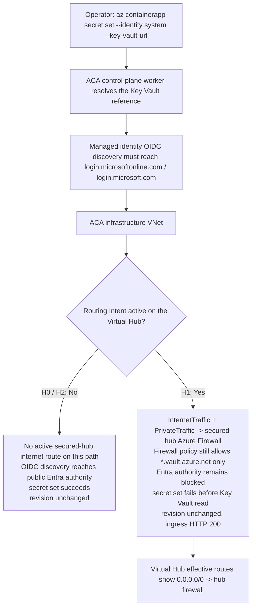

# ACA Secret Key Vault Reference — Virtual WAN + Routing Intent Variant (H4d) Lab

> **Cost warning**
> Virtual WAN secured-hub deployments are expensive. Prefer **existing secured-hub mode** whenever possible. Use **full synthetic mode** only with explicit opt-in (`DEPLOY_VIRTUAL_WAN=true`) and delete the resource group immediately after the run.

Reproduce the **Virtual WAN + Routing Intent** failure surface where `az containerapp secret set --identity system --key-vault-url ...` fails with `Unable to get value using Managed identity` and an `openid-configuration` error **only while Routing Intent forces the ACA infrastructure VNet's egress through a secured-hub Azure Firewall**. The firewall policy stays intentionally restrictive throughout: it allows `*.vault.azure.net`, but it does **not** allow the Entra authority FQDNs `login.microsoftonline.com` and `login.microsoft.com`.

This lab is a **reader-generated 17-gate Phase B falsification workflow**. You run `trigger.sh` and `falsify.sh` against your own Azure subscription to capture one live H0 → H1 → H2 cohort (files `01`-`13`) into [`labs/aca-secret-kv-ref-mi-network-path-h4d/evidence/`](https://github.com/yeongseon/azure-container-apps-practical-guide/tree/main/labs/aca-secret-kv-ref-mi-network-path-h4d/evidence). You then run `verify.sh`, which reads only those local files (no Azure API calls) and deterministically emits the four Phase B gate JSONs (`14`-`17`) that validate the narrow claim: **Routing Intent is the controlled route-state variable** while workload, identity, Key Vault, and firewall policy stay constant.

Bounded-scope disclosure: this workflow does **not** prove packet capture, dataplane bypass, regional-hub propagation bugs, or perfect route-table/dataplane synchronization at the failure instant. It also does **not** use `az containerapp exec` as the primary egress-path proof; the reproducer uses the same `az containerapp secret set` symptom in H0, H1, and H2. Those confounders are carried explicitly in Gate 17 `explicit_drops`.

!!! info "Lab scope: H4d (Virtual WAN + Routing Intent variant)"
    This lab reproduces **H4d only** — the ACTUAL ACA infrastructure VNet is connected to a Virtual WAN Hub, Routing Intent is toggled on/off, and the secured-hub firewall policy remains unchanged. The H1→H2 flip is **not** “add the missing Entra Application Rule.” The flip is **Routing Intent ON → OFF**.

    The diagnostic signature is therefore different from H4a and H4b. The positive pass condition is **route-state evidence**: `az network vhub routing-intent show` proves the policy is enabled, and `az network vhub get-effective-routes --resource-type HubVirtualNetworkConnection --resource-id $ACA_VNET_CONNECTION_ID ...` shows whether `0.0.0.0/0` targets the hub firewall. A zero-row `AZFWApplicationRule` result is a **real-world escalation clue**, not the deterministic pass condition for this lab.

## Lab Metadata

| Attribute | Value |
|---|---|
| Difficulty | Advanced |
| Estimated Duration | 45-90 minutes depending on Virtual WAN convergence and whether an existing secured hub is reused |
| Tier | Workload Profiles (Consumption profile) |
| Failure Mode | `az containerapp secret set --identity system --key-vault-url ...` fails with `Unable to get value using Managed identity` because Routing Intent forces egress through a secured-hub Azure Firewall that still allows `*.vault.azure.net` but does not allow the Entra authority FQDNs |
| Skills Practiced | Virtual WAN route-state inspection, Routing Intent convergence validation, control-plane evidence discipline, bounded falsification with silence gates |

## 1) Background

Azure Container Apps supports **Key Vault references** in the secret manifest: the app declares a reference of the form `--key-vault-url https://<vault>.vault.azure.net/secrets/<name>` and the platform resolves it using a managed identity. Before the platform can read Key Vault, it must acquire a token, and managed identity token acquisition requires an **OIDC discovery** step against the Entra authority — an HTTPS request to `https://login.microsoftonline.com/<tenant>/.well-known/openid-configuration` (or the related `login.microsoft.com` authority host).

H4d reproduces a **route-state** failure. The ACA environment itself stays simple: Azure-provided DNS, no custom DNS servers, no Key Vault private endpoint, and no UDR attached to the ACA subnet. The secured-hub firewall policy is also stable: Key Vault public FQDNs stay allowed, while the Entra authority FQDNs stay blocked. What changes is whether **Routing Intent** on the Virtual Hub redirects internet/private traffic through that firewall.

That evidence discipline matters:

- [Observed] `az network vhub routing-intent show` reports whether the Routing Intent policy exists and where it points.
- [Observed] `az network vhub get-effective-routes --resource-type HubVirtualNetworkConnection --resource-id $ACA_VNET_CONNECTION_ID ...` reports whether `0.0.0.0/0` targets the hub firewall from the Virtual Hub control-plane perspective.
- [Observed] H0 succeeds, H1 fails, and H2 succeeds again using the **same** `az containerapp secret set` symptom.
- [Not Proven] Effective routes are **control-plane evidence**, not packet capture.
- [Inferred] Routing Intent is the causal variable only because the symptom flips while the app, identity, Key Vault, and firewall policy stay constant.

### Architecture

<!-- diagram-id: architecture -->


!!! warning "Effective routes are not packet capture"
    [Observed] The effective-route output is the Virtual Hub control-plane view. [Not Proven] It does not prove that every packet followed the route exactly as shown at every instant. This lab therefore treats route-state plus H0/H1/H2 symptom flips as **bounded evidence**, not as universal proof of dataplane behavior.

!!! note "Why Azure Firewall log silence is not the pass condition"
    In real incidents, **zero `AZFWApplicationRule` Deny rows** can be a useful H4d escalation clue. But it is not deterministic proof of bypass: diagnostics latency, disabled categories, wrong workspaces, or querying the wrong firewall can all produce silence. If diagnostics are enabled and the traffic reaches Azure Firewall, `AZFWApplicationRule` **may** show Deny rows for `login.microsoftonline.com` or `login.microsoft.com`. This lab therefore gates on **Routing Intent + effective-route state**, not on log silence.

## 2) Hypothesis

**IF** an Azure Container Apps environment uses Azure-provided DNS on its infrastructure VNet, the app has a system-assigned managed identity granted `Key Vault Secrets User` at the target Key Vault scope, Key Vault remains public, and the secured-hub firewall policy continues to allow `*.vault.azure.net` but continues to block `login.microsoftonline.com` and `login.microsoft.com`, **THEN**:

- **H0 baseline (no active Routing Intent path)**: `az containerapp secret set --identity system --key-vault-url ...` succeeds with exit code 0. The named secret `kvref-h0` appears in `properties.configuration.secrets`. `latestReadyRevisionName` is unchanged.
- **H1 (Routing Intent ON)**: after connecting the ACTUAL ACA infrastructure VNet to the Virtual Hub and enabling Routing Intent so both `InternetTraffic` and `PrivateTraffic` target the hub Azure Firewall, the command fails with exit code non-zero. `stderr` carries `Unable to get value using Managed identity` and includes `openid-configuration`. `configuration.secrets` does **not** contain `kvref-h1`. `latestReadyRevisionName` is still unchanged. Ingress still returns HTTP 200. [Observed] `az network vhub get-effective-routes --resource-type HubVirtualNetworkConnection --resource-id $ACA_VNET_CONNECTION_ID ...` shows `0.0.0.0/0` targeting the hub firewall.
- **H2 (Routing Intent OFF)**: after removing Routing Intent while leaving the firewall policy unchanged, the effective routes no longer show `0.0.0.0/0` targeting the hub firewall, and a **new** secret-set attempt succeeds with exit code 0. `kvref-h2` appears in `configuration.secrets`. `latestReadyRevisionName` is still unchanged from baseline. Ingress still returns HTTP 200.

| Variable | H0 | H1 | H2 |
|---|---|---|---|
| ACA subnet UDR | None | None | None |
| VNet DNS servers | Azure-provided DNS (`[]`) | Azure-provided DNS (`[]`) | Azure-provided DNS (`[]`) |
| Key Vault endpoint | Public | Public | Public |
| Firewall policy | Restrictive, unchanged | Restrictive, unchanged | Restrictive, unchanged |
| Key Vault public FQDN allow | Present | Present | Present |
| Entra authority allow | Absent | Absent | Absent |
| Hub connection to ACTUAL ACA VNet | No active test path | Present | Present |
| Routing Intent | Off / absent for this test path | On | Off / removed |
| Effective route for `0.0.0.0/0` | Not targeting hub firewall | Targets hub firewall | No longer targets hub firewall |
| `az containerapp secret set` exit code | `0` | Non-zero | `0` |
| Secret in `configuration.secrets` | `kvref-h0` present | `kvref-h1` absent | `kvref-h2` present |
| `latestReadyRevisionName` | Baseline | Unchanged (silence gate) | Unchanged (silence gate) |
| Ingress HTTP status | 200 | 200 | 200 |

## 3) Runbook

### Prerequisites

- Azure CLI 2.80+ with the `containerapp` extension and the Virtual WAN extension commands available.
- Azure subscription permissions for: resource group deploy, role assignment (`Microsoft.Authorization/roleAssignments/write`), Container Apps management, Key Vault management, and Virtual WAN / Virtual Hub / Routing Intent management.
- `jq`, `curl`, and a local shell that can run the lab scripts.
- Either an **existing secured hub** (preferred) or explicit willingness to pay for a **synthetic secured hub**.

### Deploy infrastructure

Use one of the two supported modes below.

```bash
export RG="rg-aca-secret-kv-ref-mi-network-path-h4d"
export LOCATION="koreacentral"
export BASE_NAME="acasech4d01"

export EXISTING_VIRTUAL_HUB_RESOURCE_ID="/subscriptions/<subscription-id>/resourceGroups/<vwan-rg>/providers/Microsoft.Network/virtualHubs/<vhub-name>"
export EXISTING_AZURE_FIREWALL_RESOURCE_ID="/subscriptions/<subscription-id>/resourceGroups/<vwan-rg>/providers/Microsoft.Network/azureFirewalls/<azfw-name>"
export EXISTING_FIREWALL_POLICY_RESOURCE_ID="/subscriptions/<subscription-id>/resourceGroups/<vwan-rg>/providers/Microsoft.Network/firewallPolicies/<policy-name>"
export EXISTING_FIREWALL_LOG_ANALYTICS_CUSTOMER_ID="00000000-0000-0000-0000-000000000000"

bash labs/aca-secret-kv-ref-mi-network-path-h4d/trigger.sh
```

| Command | Why it is used |
|---|---|
| `trigger.sh` | Creates the resource group, deploys the H4d Bicep template, records workload-plane topology anchors, and runs the H0 baseline. In existing secured-hub mode it consumes the supplied hub/firewall/policy resource IDs instead of deploying Virtual WAN resources. |
| `export RG=...` | Sets the resource group name for the run. |
| `export LOCATION=...` | Sets the Azure region. |
| `export BASE_NAME=...` | Sets the naming seed used by the Bicep template. |
| `export EXISTING_VIRTUAL_HUB_RESOURCE_ID=...` | Supplies the existing Virtual Hub resource ID for cost-conscious mode. |
| `export EXISTING_AZURE_FIREWALL_RESOURCE_ID=...` | Supplies the existing secured-hub Azure Firewall resource ID. |
| `export EXISTING_FIREWALL_POLICY_RESOURCE_ID=...` | Supplies the existing Firewall Policy resource ID. |
| `export EXISTING_FIREWALL_LOG_ANALYTICS_CUSTOMER_ID=...` | Optionally supplies the firewall workspace customer ID so best-effort clue files can query the correct workspace. |

If you need the fully synthetic mode instead, add `export DEPLOY_VIRTUAL_WAN="true"` before running `trigger.sh` and omit the three `EXISTING_*_RESOURCE_ID` variables.

### Run the H1 → H2 falsification (`falsify.sh`)

```bash
bash labs/aca-secret-kv-ref-mi-network-path-h4d/falsify.sh
```

Expected output:

- `06-h1-routing-intent-enabled.json` confirms the ACTUAL ACA infrastructure VNet is connected to the Virtual Hub, Routing Intent converged, and effective routes show `0.0.0.0/0` targeting the hub firewall.
- `07-h1-secret-set-outcome.json` contains a non-zero `exit_code` and `stderr` with `Unable to get value using Managed identity` plus `openid-configuration`.
- `08-h1-app-state.json` shows revision name unchanged, ingress HTTP 200, and `kvref-h1` absent.
- `10-h2-routing-intent-removed.json` confirms effective routes no longer show `0.0.0.0/0` targeting the hub firewall.
- `11-h2-secret-set-outcome.json` contains `exit_code: 0`.
- `12-h2-app-state.json` shows revision name still unchanged from baseline, ingress HTTP 200, and `kvref-h2` present.

### Run the offline verifier over your locally generated pack

```bash
bash labs/aca-secret-kv-ref-mi-network-path-h4d/verify.sh
```

Expected output:

- 17/17 gate passes on a valid cohort.
- `evidence/14-cohort-integrity-gate.json` shows the HubVirtualNetworkConnection anchor and revision silence invariant.
- `evidence/15-h1-routing-intent-produces-failure-gate.json` proves H1 route-state plus failure markers.
- `evidence/16-h2-routing-intent-removal-restores-success-gate.json` proves H2 route-state removal plus recovery.
- `evidence/17-bounded-falsification-gate.json` enumerates the explicit drops for Azure Firewall log silence, effective-route limits, DNS-override non-coverage, Key Vault private endpoint non-coverage, and lack of packet-capture proof.

### Optional: inspect the Virtual WAN route state manually

```bash
az network vhub routing-intent show \
    --name "defaultRoutingIntent" \
    --resource-group "<vwan-rg>" \
    --vhub "<vhub-name>"

az network vhub get-effective-routes \
    --resource-type HubVirtualNetworkConnection \
    --resource-id "/subscriptions/<subscription-id>/resourceGroups/<vwan-rg>/providers/Microsoft.Network/virtualHubs/<vhub-name>/hubVirtualNetworkConnections/<connection-name>" \
    --name "<vhub-name>" \
    --resource-group "<vwan-rg>"
```

| Command | Why it is used |
|---|---|
| `az network vhub routing-intent show` | Reads the Routing Intent policy on the Virtual Hub so the `InternetTraffic` and `PrivateTraffic` targets can be verified. |
| `--name` | Names the Routing Intent resource (`defaultRoutingIntent` in this lab). |
| `--resource-group` | Targets the Virtual WAN resource group. |
| `--vhub` | Names the Virtual Hub that holds the Routing Intent policy. |
| `az network vhub get-effective-routes` | Retrieves the effective route table from the Virtual Hub perspective for the HubVirtualNetworkConnection used by the ACA infrastructure VNet. |
| `--resource-type` | Declares that the `--resource-id` belongs to a `HubVirtualNetworkConnection`. |
| `--resource-id` | Supplies the **HubVirtualNetworkConnection** resource ID. Do not pass the VNet ID. |
| `--name` | Names the Virtual Hub whose effective routes are being requested. |
| `--resource-group` | Targets the Virtual WAN resource group that owns the Virtual Hub. |

Expected interpretation:

- **H1 window**: [Observed] the Routing Intent policy exists and the effective route table includes `0.0.0.0/0` targeting the hub firewall.
- **H2 window**: [Observed] the effective route table no longer shows `0.0.0.0/0` targeting the hub firewall.
- [Not Proven] This query alone does **not** prove dataplane packet forwarding, only Virtual Hub control-plane route state.

## 4) Experiment Log

| Step | Action | Expected | Falsification |
|---|---|---|---|
| 1 | Deploy the workload plane via `trigger.sh` | Deployment succeeds; app is `Healthy`; ingress FQDN returns HTTP 200; VNet uses Azure-provided DNS; ACA subnet has no route table; Key Vault is public | Deployment fails, or app never reaches `Healthy`, or baseline topology adds custom DNS / a UDR / a Key Vault private endpoint, which invalidates the H4d isolation |
| 2 | Run `trigger.sh` H0 baseline | `04-h0-secret-set-outcome.json` `exit_code: 0`; `kvref-h0` present in `configuration.secrets`; `latestReadyRevisionName` unchanged | H0 secret set fails before any Routing Intent change, which means the baseline is invalid |
| 3 | Run `falsify.sh` H1 (connect ACTUAL ACA VNet to hub + enable Routing Intent + poll for convergence) | `06-h1-routing-intent-enabled.json` proves Routing Intent `Succeeded` and effective routes show `0.0.0.0/0` targeting the hub firewall | Routing Intent never converges, or the effective route table never targets the firewall, so the H1 trigger was not actually established |
| 4 | Run H1 secret set with the same symptom | `07-h1-secret-set-outcome.json` `exit_code` non-zero with the MI / `openid-configuration` markers; `08-h1-app-state.json` shows revision unchanged, ingress HTTP 200, `kvref-h1` absent | H1 secret set still succeeds, or the revision changes, or ingress goes down, which breaks the silence-gate invariant |
| 5 | Run `falsify.sh` H2 (remove Routing Intent, poll until effective routes no longer target the firewall) | `10-h2-routing-intent-removed.json` proves `0.0.0.0/0` no longer targets the hub firewall | Effective routes still point to the firewall after Routing Intent removal |
| 6 | Run H2 secret set as a **new** attempt | `11-h2-secret-set-outcome.json` `exit_code: 0`; `12-h2-app-state.json` shows revision unchanged, ingress HTTP 200, `kvref-h2` present | H2 still fails even though the route-state flip was removed |
| 7 | Run `verify.sh` (hermetic offline) | 17/17 gates pass; Gate 15 proves H1 route-state + failure; Gate 16 proves H2 route-state removal + recovery; Gate 17 enumerates the bounded explicit drops | Any gate fails, especially if H1 lacks the route-state trigger or H2 lacks the recovery flip |

### Evidence discipline for H4d

- [Observed] `06-h1-routing-intent-enabled.json` and `10-h2-routing-intent-removed.json` capture the **Virtual Hub control-plane route state**.
- [Observed] `07-h1-secret-set-outcome.json` fails, while `11-h2-secret-set-outcome.json` succeeds.
- [Observed] `08-h1-app-state.json` and `12-h2-app-state.json` prove the silence gates: the same revision keeps serving ingress HTTP 200.
- [Inferred] Routing Intent is the causal variable because the symptom flips while the app, identity, Key Vault, and firewall policy stay constant.
- [Not Proven] Effective routes do not prove packet forwarding or that Azure Firewall never received the traffic.

## 5) Verification Queries

### CLI: inspect the Virtual WAN route state

```bash
az network vhub routing-intent show \
    --name "defaultRoutingIntent" \
    --resource-group "<vwan-rg>" \
    --vhub "<vhub-name>"

az network vhub get-effective-routes \
    --resource-type HubVirtualNetworkConnection \
    --resource-id "/subscriptions/<subscription-id>/resourceGroups/<vwan-rg>/providers/Microsoft.Network/virtualHubs/<vhub-name>/hubVirtualNetworkConnections/<connection-name>" \
    --name "<vhub-name>" \
    --resource-group "<vwan-rg>"
```

| Command | Why it is used |
|---|---|
| `az network vhub routing-intent show` | Verifies whether Routing Intent exists and which next-hop resource each policy targets. |
| `--name` | Names the Routing Intent resource. |
| `--resource-group` | Targets the Virtual WAN resource group. |
| `--vhub` | Names the Virtual Hub. |
| `az network vhub get-effective-routes` | Verifies the effective route table for the HubVirtualNetworkConnection that represents the ACA infrastructure VNet. |
| `--resource-type` | Declares `HubVirtualNetworkConnection` as the resource type. |
| `--resource-id` | Supplies the HubVirtualNetworkConnection resource ID captured by `falsify.sh`. |
| `--name` | Names the Virtual Hub. |
| `--resource-group` | Targets the Virtual WAN resource group. |

Expected interpretation:

- **H1 window**: [Observed] `0.0.0.0/0` targets the hub firewall.
- **H2 window**: [Observed] `0.0.0.0/0` no longer targets the hub firewall.
- [Not Proven] This is control-plane route evidence, not packet capture.

### CLI: optional Azure Firewall clue (never the pass condition)

```bash
az monitor log-analytics query \
    --workspace "00000000-0000-0000-0000-000000000000" \
    --analytics-query "AZFWApplicationRule | where Fqdn has 'login.microsoftonline.com' or Fqdn has 'login.microsoft.com' | order by TimeGenerated desc | take 20"
```

| Command | Why it is used |
|---|---|
| `az monitor log-analytics query` | Captures a best-effort Azure Firewall diagnostic clue from the workspace configured for the firewall. |
| `--workspace` | Supplies the Log Analytics workspace customer ID (workspace GUID). |
| `--analytics-query` | Queries recent Azure Firewall application-rule rows for the Entra authority FQDNs. |

Expected interpretation:

- [Observed] If diagnostics are enabled and the flow reaches Azure Firewall, rows **may** appear for the Entra authority FQDNs.
- [Not Proven] A zero-row result does **not** prove bypass; it may reflect diagnostics latency, disabled categories, the wrong workspace, or the wrong firewall.
- [Inferred] Use this only as a clue in real investigations. The reproducer itself gates on **Routing Intent + effective-route state**, not on log silence.

## 6) Portal Evidence

Reader-generated deferral note: Portal captures for this lab are tracked in [issue #366](https://github.com/yeongseon/azure-container-apps-practical-guide/issues/366).

!!! note "Portal captures are reader-generated"
    Capture your own Portal evidence after running H0 → H1 → H2. The recommended capture set is: (1) the Virtual Hub Routing Intent blade showing the H1 policy targeting Azure Firewall, (2) the Virtual Hub effective-routes view for the ACA HubVirtualNetworkConnection showing `0.0.0.0/0` to the firewall in H1, (3) the same effective-routes view showing the route no longer targeting the firewall in H2, and (4) the Container App Secrets / Revisions blades proving the silence gates.

## Clean Up

```bash
bash labs/aca-secret-kv-ref-mi-network-path-h4d/cleanup.sh
```

## Related Playbook

- [Secret and Key Vault Reference Failure — H4 Variants: When Base H4 KQL Returns Zero Rows](../playbooks/identity-and-configuration/secret-and-key-vault-reference-failure.md#h4-variants-when-base-h4-kql-returns-zero-rows) (H4d row)

## See Also

- [ACA Secret Key Vault Reference — Managed Identity Network Path Lab (H4a base variant)](./aca-secret-kv-ref-mi-network-path.md)
- [ACA Secret Key Vault Reference — Logging Gap Variant (H4b)](./aca-secret-kv-ref-mi-network-path-h4b.md)
- [ACA Secret Key Vault Reference — Custom DNS Override Variant (H4e)](./aca-secret-kv-ref-mi-network-path-h4e.md)
- [Managed Identity Auth Failure Playbook](../playbooks/identity-and-configuration/managed-identity-auth-failure.md)
- [Egress Control](../../platform/networking/egress-control.md)

## Sources

- [Manage secrets in Azure Container Apps](https://learn.microsoft.com/en-us/azure/container-apps/manage-secrets)
- [Managed identities in Azure Container Apps](https://learn.microsoft.com/en-us/azure/container-apps/managed-identity)
- [Custom VNet in Azure Container Apps](https://learn.microsoft.com/en-us/azure/container-apps/vnet-custom)
- [How to configure Virtual WAN Hub routing policies](https://learn.microsoft.com/en-us/azure/virtual-wan/how-to-routing-policies)
- [View effective routes in a Virtual WAN hub](https://learn.microsoft.com/en-us/azure/virtual-wan/effective-routes-virtual-hub)
