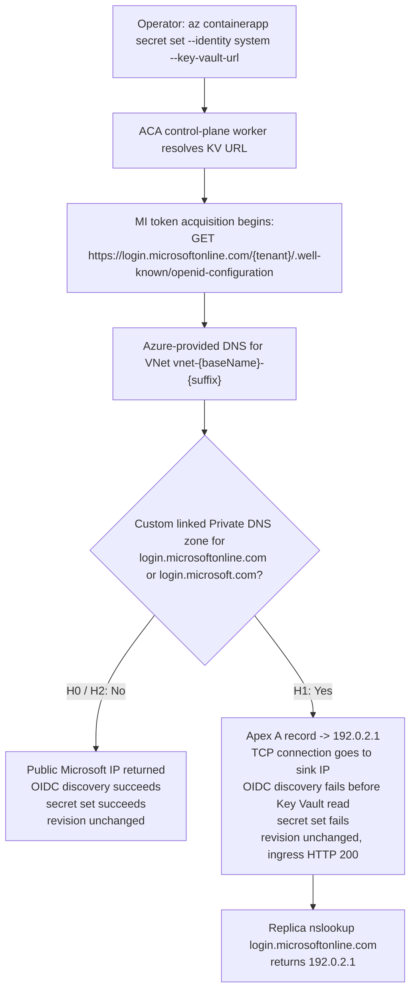

# ACA Secret Key Vault Reference — Custom DNS Override Variant (H4e) Lab

Reproduce the **custom DNS override** failure surface where `az containerapp secret set --identity system --key-vault-url ...` fails with `Unable to get value using Managed identity` → `Get https://login.microsoftonline.com/<tenant>/.well-known/openid-configuration: EOF`, **without any Azure Firewall or UDR in path**. This lab proves that a custom linked Private DNS override for `login.microsoftonline.com` and `login.microsoft.com` can sink the Entra authority lookup to `192.0.2.1`, and that removing the override restores success with the same Key Vault, identity, and RBAC state.

This lab is a **reader-generated 17-gate Phase B falsification workflow**. You run `trigger.sh` and `falsify.sh` against your own Azure subscription to capture one live H0 → H1 → H2 cohort (files `01`-`13`) into [`labs/aca-secret-kv-ref-mi-network-path-h4e/evidence/`](https://github.com/yeongseon/azure-container-apps-practical-guide/tree/main/labs/aca-secret-kv-ref-mi-network-path-h4e/evidence). You then run `verify.sh`, which reads only those local files (no Azure API calls) and deterministically emits the four Phase B gate JSONs (`14`-`17`) that validate the narrow claim: the custom DNS override is the sole controlled variable, and flipping it changes whether the managed-identity OIDC discovery step can reach the public Entra authority.

Bounded-scope disclosure: the workflow does **not** prove exact `stderr` wording, exact DNS propagation latency, or that the ACA control-plane secret resolver shares an identical DNS view with `az containerapp exec`. The replica DNS result is a direct **data-plane** observation; the control-plane implication is an inference justified only by the H0/H1/H2 secret-set behavior. Those confounders are carried explicitly in Gate 17 `explicit_drops`.

!!! info "Lab scope: H4e (custom DNS override variant)"
    This lab reproduces **H4e only** — Azure-provided DNS on the VNet, **no Azure Firewall**, **no UDR**, no custom `dhcpOptions.dnsServers`, and a custom linked Private DNS override for the Entra authority hosts. It is deliberately the opposite of [H4a](./aca-secret-kv-ref-mi-network-path.md): H4a proves an egress firewall path, while H4e proves a DNS sink path that prevents the Entra authority connection from ever reaching a firewall.

    The diagnostic signature is therefore different from H4a/H4b: the key smoking gun is `az containerapp exec --command "nslookup login.microsoftonline.com"` returning `192.0.2.1` from a running replica, plus `az network private-dns zone list` revealing linked custom zones for the Entra authority. Microsoft does **not** publish a `privatelink.microsoftonline.com` zone for this path; the trigger here is always a **custom** override. Follow-up reproducer labs for the rest of the H4 variants remain tracked in [issue #307](https://github.com/yeongseon/azure-container-apps-practical-guide/issues/307).

## Lab Metadata

| Attribute | Value |
|---|---|
| Difficulty | Advanced |
| Estimated Duration | 25-40 minutes (includes 6-10 min ACA/KV deploy, one H1 DNS-propagation wait, and one H2 post-removal wait beyond TTL; no Azure Firewall deploy) |
| Tier | Workload Profiles (Consumption profile) |
| Failure Mode | `az containerapp secret set --identity system --key-vault-url ...` fails with `Unable to get value using Managed identity` because a linked custom Private DNS zone resolves the Entra authority host to `192.0.2.1` before the OIDC discovery TCP connection can reach the public Microsoft endpoint |
| Skills Practiced | Custom DNS override diagnosis, data-plane-vs-control-plane evidence discipline, Private DNS link inspection, silence-gate reasoning for control-plane vs data-plane failures |

## 1) Background

Azure Container Apps supports **Key Vault references** in the secret manifest: the app declares a reference of the form `--key-vault-url https://<vault>.vault.azure.net/secrets/<name>` and the platform resolves it using a managed identity. Before the platform can call Key Vault it must acquire a token, and managed identity token acquisition requires an **OIDC discovery** step against the Entra authority — a plain HTTPS `GET https://login.microsoftonline.com/<tenant>/.well-known/openid-configuration` (the client may use `login.microsoft.com` instead — it picks one host at runtime).

H4e reproduces a DNS-level failure **before** any outbound firewall discussion is relevant. Azure-provided DNS for a VNet consults linked Private DNS zones for matching names. If the workload VNet is linked to a custom zone named `login.microsoftonline.com` or `login.microsoft.com`, and that zone's apex A record points to a sink address such as `192.0.2.1`, callers using that DNS view resolve the Entra authority host to the sink instead of to a public Microsoft IP. The subsequent TCP connection attempt times out or resets on the wrong destination, and the user only sees the same generic managed-identity OIDC discovery error surface.

This is why the evidence discipline matters:

- The replica `nslookup` result is a **direct data-plane DNS observation**. It shows what a running workload replica resolves.
- The failing caller in this playbook is the ACA-managed **control-plane secret resolver**, not the workload container itself.
- Azure does **not** formally document that these two components share an identical DNS view.
- Therefore the control-plane implication must stay bounded: the replica DNS result is `[Observed]`; the claim that the control-plane resolver saw the same override is only `[Inferred]` or `[Strongly Suggested]`, justified by the H0/H1/H2 secret-set flip.

### Architecture

<!-- diagram-id: architecture -->


!!! warning "The replica DNS view is not the same thing as a proven control-plane DNS view"
    The `az containerapp exec --command "nslookup login.microsoftonline.com"` result is the DNS view from a running replica. [Observed] That result is valid evidence for the **data plane**. [Inferred] The control-plane secret resolver likely used a compatible DNS view because H0 succeeded without the override, H1 failed with the override present, and H2 succeeded after the override was removed. However, Azure does **not** document that these two components must share an identical resolver path, so the guide never states that equivalence as proven.

!!! tip "Why H4e is explicitly not H4a"
    The baseline topology in this lab has no Azure Firewall resource, no route table on the ACA subnet, and no custom VNet DNS servers. H0 and H2 both succeed with the identical Key Vault, identity, and RBAC state. That isolates the custom DNS override as the only H1→H2 controlling variable and rules out the H4a firewall path by construction.

## 2) Hypothesis

**IF** an Azure Container Apps environment uses Azure-provided DNS on its infrastructure VNet, and the app has a system-assigned managed identity granted `Key Vault Secrets User` at the target Key Vault scope, and there is **no Azure Firewall and no UDR** on the workload path, **THEN**:

- **H0 baseline (no override)**: `az containerapp secret set --identity system --key-vault-url ...` succeeds with exit code 0. The named secret `kvref-h0` appears in `properties.configuration.secrets` with a populated `keyVaultUrl` field. `latestReadyRevisionName` is unchanged.
- **H1 (custom linked Private DNS override present)**: After creating Private DNS zones `login.microsoftonline.com` and `login.microsoft.com`, linking both to the ACA VNet, and setting each apex A record to `192.0.2.1` with TTL 10 seconds, the command fails with exit code non-zero. `stderr` carries the marker phrases `Failed to update secrets`, `Unable to get value using Managed identity`, and includes the substring `openid-configuration`. `configuration.secrets` does **not** contain `kvref-h1`. `latestReadyRevisionName` is still unchanged. Ingress still returns HTTP 200. [Observed] Replica `nslookup login.microsoftonline.com` returns `192.0.2.1`.
- **H2 (override removed, wait > TTL)**: After unlinking/deleting the custom override and waiting beyond TTL, a **new** secret-set attempt succeeds with exit code 0. `kvref-h2` appears in `configuration.secrets`. `latestReadyRevisionName` is still unchanged from baseline. Ingress still returns HTTP 200. [Observed] Replica `nslookup login.microsoftonline.com` no longer returns `192.0.2.1` and instead shows a public Microsoft IP. [Inferred] The control-plane resolver is no longer trapped by the custom override because the secret-set operation succeeds again without any other topology change.

| Variable | Control state (H0) | H1 (DNS override present) | H2 (override removed) |
|---|---|---|---|
| Azure Firewall in topology | Absent | Absent | Absent |
| UDR on ACA subnet | Absent | Absent | Absent |
| VNet `dhcpOptions.dnsServers` | Azure-provided DNS (`[]`) | Azure-provided DNS (`[]`) | Azure-provided DNS (`[]`) |
| Linked Private DNS zones for Entra authority | None | `login.microsoftonline.com`, `login.microsoft.com` | None |
| Apex A record target | n/a | `192.0.2.1` | n/a |
| `az containerapp secret set` exit code | `0` | Non-zero | `0` |
| Secret in `configuration.secrets` | `kvref-h0` present | `kvref-h1` absent | `kvref-h2` present |
| Replica `nslookup login.microsoftonline.com` | Public Microsoft IP | `192.0.2.1` | Public Microsoft IP |
| `latestReadyRevisionName` | Baseline | Unchanged (silence gate) | Unchanged (silence gate) |
| Ingress HTTP status | 200 | 200 | 200 |

## 3) Runbook

### Prerequisites

- Azure CLI 2.80+ with the `containerapp` extension.
- Azure subscription permissions for: resource group deploy, role assignment (`Microsoft.Authorization/roleAssignments/write`), Container Apps management, Key Vault management, and Private DNS zone/link management.
- `jq`, `curl`, and a local shell that can run the lab scripts.

### Deploy infrastructure

```bash
export RG="rg-aca-secret-kv-ref-mi-network-path-h4e"
export LOCATION="koreacentral"
export BASE_NAME="acasech4e01"

az group create --name "$RG" --location "$LOCATION"

az deployment group create \
    --resource-group "$RG" \
    --name aca-secret-kv-ref-mi-network-path-h4e \
    --template-file labs/aca-secret-kv-ref-mi-network-path-h4e/infra/main.bicep \
    --parameters baseName="$BASE_NAME" \
    --parameters deploymentPrincipalId="$(az ad signed-in-user show --query id --output tsv)"
```

| Command | Why it is used |
|---|---|
| `az group create` | Creates the resource group that scopes all lab resources. |
| `--name` | Name of the resource group (`$RG`). |
| `--location` | Azure region for the resource group (`$LOCATION`). |
| `az deployment group create` | Deploys the Bicep template that provisions the VNet with a delegated ACA subnet, Container Apps environment with workload-profile networking, Container App with system-assigned managed identity, Key Vault with RBAC authorization mode, and Log Analytics. No Azure Firewall or route table is deployed. |
| `--resource-group` | Target resource group for the deployment. |
| `--name` | Deployment name (`aca-secret-kv-ref-mi-network-path-h4e`). |
| `--template-file` | Path to the lab Bicep template. |
| `--parameters baseName` | Base name used to derive child resource names. |
| `--parameters deploymentPrincipalId` | Object ID of the deploying principal, resolved inline with `az ad signed-in-user show`, so the template can grant the correct RBAC assignments. |
| `az ad signed-in-user show` | Resolves the signed-in principal's object ID for the `deploymentPrincipalId` parameter. |
| `--query id` | Projects only the `id` field from the signed-in user object. |
| `--output tsv` | Emits the object ID as a bare string for inline substitution. |

Expected output:

- Resource group creation succeeds.
- Deployment `provisioningState` is `Succeeded`.
- Bicep outputs include `appName`, `environmentName`, `keyVaultName`, `keyVaultUri`, `vnetName`, `acaSubnetPrefix`, and `logAnalyticsCustomerId`.
- `trigger.sh` later records that the VNet uses Azure-provided DNS and the ACA subnet has no route table.

### Run the H0 baseline (`trigger.sh`)

```bash
bash labs/aca-secret-kv-ref-mi-network-path-h4e/trigger.sh
```

| Command | Why it is used |
|---|---|
| `trigger.sh` | Reads Bicep outputs, records baseline topology anchors proving no firewall/UDR/custom VNet DNS, creates a Key Vault secret out-of-band, runs `az containerapp secret set --identity system --key-vault-url ...` against the healthy configuration, captures baseline app state before and after, and writes raw evidence files `01` through `05`. |

Expected output:

- `04-h0-secret-set-outcome.json` contains `exit_code: 0`.
- `05-h0-app-state-after.json` shows the secret `kvref-h0` present in `configuration.secrets` with a populated `keyVaultUrl` field.
- `05-h0-app-state-after.json` `latestReadyRevisionName` matches the value in `02-h0-app-state-before.json` (secret set does not create a new revision).
- `01-deployment-outputs.json` shows `azure_firewall_present: false`, `route_table_attached: false`, and `vnet_dns_servers: []`.

### Run the H1 → H2 falsification (`falsify.sh`)

```bash
bash labs/aca-secret-kv-ref-mi-network-path-h4e/falsify.sh
```

| Command | Why it is used |
|---|---|
| `falsify.sh` | Performs H1 by creating two custom Private DNS zones (`login.microsoftonline.com`, `login.microsoft.com`), setting each apex A record to `192.0.2.1` with TTL 10 seconds, linking both zones to the ACA VNet, waiting for propagation, and then re-running `az containerapp secret set` with `kvref-h1` while capturing the failure surface and a replica `nslookup`. It then performs H2 by removing the links/zones, waiting beyond TTL, running a fresh `az containerapp secret set` with `kvref-h2` that now succeeds, and capturing a new replica `nslookup` that no longer returns the sink IP. Writes raw evidence files `06` through `13`. |

Expected output:

- `06-h1-dns-override-created.json` confirms both custom Private DNS zones exist, both apex A records point to `192.0.2.1`, TTL is 10 seconds, and the zones are linked to the ACA VNet.
- `07-h1-secret-set-outcome.json` contains `exit_code` non-zero and `stderr` with `Failed to update secrets`, `Unable to get value using Managed identity`, and `openid-configuration`.
- `08-h1-app-state.json` shows revision name unchanged, ingress HTTP 200, and `kvref-h1` absent from `configuration.secrets`.
- `09-h1-replica-dns-view.json` shows `observed_sink_presence: true` for `login.microsoftonline.com`.
- `10-h2-dns-override-removed.json` confirms the override is removed and `post_removal_wait_seconds > ttl_seconds`.
- `11-h2-secret-set-outcome.json` contains `exit_code: 0`.
- `12-h2-app-state.json` shows revision name still unchanged from baseline, ingress HTTP 200, and `kvref-h2` present in `configuration.secrets`.
- `13-h2-replica-dns-view.json` shows `observed_sink_presence: false`.

### Run the offline verifier over your locally generated pack

```bash
bash labs/aca-secret-kv-ref-mi-network-path-h4e/verify.sh
```

| Command | Why it is used |
|---|---|
| `verify.sh` | Reads only the local evidence files `01`-`13` that `trigger.sh` and `falsify.sh` wrote into `evidence/`, runs the prerequisite/schema gates, then deterministically writes the four Phase B gate JSONs (14 cohort integrity, 15 H1 DNS override, 16 H2 override removal, 17 bounded falsification). The verifier does not call Azure — you can re-run it offline after `cleanup.sh` has deleted the resource group, provided the local `evidence/` files remain in place. |

Expected output:

- 17/17 gate passes on a valid cohort.
- `evidence/14-cohort-integrity-gate.json` shows the revision silence invariant and the non-H4a topology anchors.
- `evidence/15-h1-dns-override-produces-failure-gate.json` shows the H1 sub-gates pass, including the replica sink-IP observation.
- `evidence/16-h2-override-removal-restores-success-gate.json` shows the H2 sub-gates pass, including the post-removal wait > TTL predicate and `kvref-h2` presence.
- `evidence/17-bounded-falsification-gate.json` enumerates the explicit drops for control-plane-vs-data-plane DNS view equivalence, exact stderr wording, DNS cache timing, and the lack of a supported `privatelink.microsoftonline.com` zone.

### Optional: inspect the custom override manually during H1

```bash
az network private-dns zone list --resource-group "$RG"

az containerapp exec \
    --name "$(jq -r .app_name labs/aca-secret-kv-ref-mi-network-path-h4e/evidence/01-deployment-outputs.json)" \
    --resource-group "$RG" \
    --command "sh -c 'nslookup login.microsoftonline.com || true'"
```

| Command | Why it is used |
|---|---|
| `az network private-dns zone list` | Enumerates Private DNS zones in the resource group so you can confirm that the Entra authority host names are being overridden by custom linked zones. |
| `--resource-group` | Limits the list to the lab resource group. |
| `az containerapp exec` | Runs a diagnostic command inside a running replica to observe the data-plane DNS result for the Entra authority host. |
| `--name` | Names the Container App to enter. |
| `--resource-group` | Targets the lab resource group. |
| `--command` | Executes `nslookup login.microsoftonline.com` inside the replica and tolerates a resolver non-zero exit by appending `|| true`. |

Expected output:

- [Observed] During H1, `az network private-dns zone list` includes `login.microsoftonline.com` and `login.microsoft.com`.
- [Observed] During H1, the replica `nslookup` output includes `192.0.2.1`.
- [Inferred] Because H0 succeeds, H1 fails, and H2 succeeds with no firewall or UDR change, the control-plane secret resolver is strongly suggested to be affected by the same custom override. This is **not** claimed as proven identity of DNS view.

## 4) Experiment Log

| Step | Action | Expected | Falsification |
|---|---|---|---|
| 1 | Deploy baseline infrastructure via `az deployment group create` | Deployment succeeds; app is `Healthy/Running`; ingress FQDN returns HTTP 200; no Azure Firewall exists; no route table attached to the ACA subnet; VNet uses Azure-provided DNS | Deployment fails, or app never reaches `Healthy`, or the baseline topology includes a firewall / UDR / custom VNet DNS, which would invalidate the H4e isolation |
| 2 | Run `trigger.sh` (H0 baseline) | `04-h0-secret-set-outcome.json` `exit_code: 0`; `kvref-h0` present in `configuration.secrets`; `latestReadyRevisionName` unchanged | H0 secret set fails without the override (indicates something other than the controlled variable is broken — invalidates the baseline) |
| 3 | Run `falsify.sh` phase H1 (create custom DNS override → attempt secret set) | `07-h1-secret-set-outcome.json` `exit_code` non-zero with the OIDC markers; `08-h1-app-state.json` shows revision name unchanged, ingress HTTP 200, `kvref-h1` absent | H1 secret set still succeeds (override did not control the failure), OR revision name changes (violates the silence-gate invariant), OR ingress goes down (indicates a data-plane failure instead of the claimed control-plane failure) |
| 4 | Capture a replica DNS lookup during H1 | `09-h1-replica-dns-view.json` shows `login.microsoftonline.com -> 192.0.2.1` | Replica `nslookup` does not show `192.0.2.1` (the override was not applied to the observed data-plane DNS view) |
| 5 | Run `falsify.sh` phase H2 (remove override, wait > TTL, attempt fresh secret set) | `11-h2-secret-set-outcome.json` `exit_code: 0`; `12-h2-app-state.json` shows revision name still unchanged from baseline, ingress HTTP 200, `kvref-h2` present | H2 secret set still fails after the override is removed and the wait exceeds TTL (indicates the override alone is not sufficient to explain recovery) |
| 6 | Capture a replica DNS lookup during H2 | `13-h2-replica-dns-view.json` no longer shows `192.0.2.1` | Replica `nslookup` still shows the sink IP after removal + wait, which means the DNS-cache confounder was not cleared or the override was not actually removed |
| 7 | Run `verify.sh` (hermetic offline) | 17/17 gates pass; Gate 14 anchors the non-H4a topology; Gate 15 proves H1 trigger + sink-IP DNS view; Gate 16 proves H2 recovery + sink-IP disappearance; Gate 17 enumerates the bounded explicit drops | Any gate fails, especially if H1 lacks the sink IP or H2 still lacks recovery |

### Evidence discipline for H4e

This lab intentionally separates **what is directly observed** from **what is only inferred**:

- [Observed] `09-h1-replica-dns-view.json` and `13-h2-replica-dns-view.json` capture the **data-plane DNS view** from a running replica.
- [Observed] `07-h1-secret-set-outcome.json` fails, while `11-h2-secret-set-outcome.json` succeeds.
- [Inferred] The ACA control-plane secret resolver was affected by the same DNS override because the secret-set result flips exactly with the override and no firewall/UDR/RBAC variable changes.
- [Not Proven] Azure does not document that the control-plane secret resolver and `az containerapp exec` share an identical DNS path or cache. That equivalence is intentionally left as an explicit drop in Gate 17.

### Why this is not a firewall lab

The baseline topology is deliberately silent on firewall evidence because there is **no firewall** to inspect. `01-deployment-outputs.json` captures three direct anchors:

1. `azure_firewall_present: false`
2. `route_table_attached: false`
3. `vnet_dns_servers: []`

That means the H1 failure cannot be explained by H4a/H4b-style firewall denial. The packet never needs a firewall theory if the Entra authority host is already resolving to `192.0.2.1` inside the workload DNS view. This is the point of the H4e variant: the same customer-facing OIDC discovery error can originate from a DNS override even when the usual AzFW-deny hypotheses are structurally impossible.

## 5) Verification Queries

### CLI: inspect the replica DNS view

```bash
az containerapp exec \
    --name "$(jq -r .app_name labs/aca-secret-kv-ref-mi-network-path-h4e/evidence/01-deployment-outputs.json)" \
    --resource-group "$RG" \
    --command "sh -c 'nslookup login.microsoftonline.com || true'"
```

| Command | Why it is used |
|---|---|
| `az containerapp exec` | Executes `nslookup` from inside a running replica so you can observe the **data-plane DNS view** for the Entra authority host. |
| `--name` | Names the Container App to enter, read from the evidence pack. |
| `--resource-group` | Targets the lab resource group. |
| `--command` | Executes `nslookup login.microsoftonline.com` inside the replica and tolerates a resolver non-zero exit. |

Expected interpretation:

- **H1 window**: [Observed] the output includes `192.0.2.1`. This is the data-plane DNS view.
- **H2 window**: [Observed] the output no longer includes `192.0.2.1` and instead shows a public Microsoft IP.
- [Inferred] The control-plane secret resolver likely followed a compatible DNS outcome because the secret-set result flips in lockstep with the override.
- [Not Proven] This query alone does **not** prove control-plane/data-plane DNS-view equivalence.

### CLI: inspect the custom Private DNS zones and VNet DNS settings

```bash
az network private-dns zone list --resource-group "$RG"

az network vnet show \
    --resource-group "$RG" \
    --name "$(jq -r .vnet_name labs/aca-secret-kv-ref-mi-network-path-h4e/evidence/01-deployment-outputs.json)" \
    --query "dhcpOptions.dnsServers"
```

| Command | Why it is used |
|---|---|
| `az network private-dns zone list` | Enumerates Private DNS zones in the lab resource group so the custom Entra authority overrides can be identified during H1 and confirmed absent during H2. |
| `--resource-group` | Limits the list to the lab resource group. |
| `az network vnet show` | Confirms the VNet uses Azure-provided DNS rather than custom `dhcpOptions.dnsServers`, so the linked Private DNS zone is the distinguishing DNS variable. |
| `--name` | Names the lab VNet, read from the evidence pack. |
| `--query` | Projects only `dhcpOptions.dnsServers`. An empty array means Azure-provided DNS. |

Expected interpretation:

- **H1 window**: [Observed] `az network private-dns zone list` includes `login.microsoftonline.com` and `login.microsoft.com`.
- **H0/H2 windows**: [Observed] those zones are absent.
- **All phases**: [Observed] `dhcpOptions.dnsServers` is `[]` (Azure-provided DNS), so the override is coming from linked Private DNS zones rather than from custom VNet DNS servers.
- [Not Proven] The absence of `dhcpOptions.dnsServers` does not rule out every external enterprise DNS influence in other topologies; it only bounds this lab's topology.

## 6) Portal Evidence (reader-generated captures)

Azure Portal screenshots to collect after running the H0 → H1 → H2 sequence. Save to `docs/assets/troubleshooting/aca-secret-kv-ref-mi-network-path-h4e/` with the exact filenames listed in the [Screenshot capture checklist](#screenshot-capture-checklist) below.

!!! note "Portal captures are reader-generated"
    The captures listed below are **not shipped** with this lab guide; real Portal PNG capture is a deferred follow-up tracked in [issue #364](https://github.com/yeongseon/azure-container-apps-practical-guide/issues/364). Each reader captures their own evidence against their own subscription after running `trigger.sh` and `falsify.sh`.

### Container App — Secrets blade (H0 baseline)

!!! note "Portal evidence — Container App Secrets blade after H0"
    The **Container App → Secrets** blade after `trigger.sh` completes shows one row: `kvref-h0` with `Source: Key Vault reference` and a Key Vault URL. This proves the H0 baseline succeeded before any custom DNS override existed.

    Target filename: `01-h0-secrets-blade.png`

### Private DNS zone — H1 apex A record

!!! note "Portal evidence — H1 custom Private DNS zone for login.microsoftonline.com"
    The **Private DNS zone → Record sets** blade during H1 shows the apex (`@`) A record pointing to `192.0.2.1` with TTL 10. This is the visual proof of the custom override itself.

    Target filename: `02-h1-primary-zone-apex-record.png`

### Private DNS zone — VNet link present in H1

!!! note "Portal evidence — H1 VNet link on the custom zone"
    The **Private DNS zone → Virtual network links** blade during H1 shows the ACA VNet linked to the custom zone. This proves the override is attached to the workload VNet's DNS path.

    Target filename: `03-h1-zone-vnet-link.png`

### Container App — Revisions blade (silence gate)

!!! note "Portal evidence — Revisions blade during H1/H2"
    The **Container App → Revisions and replicas** blade during H1 and H2 shows the same active revision name, `Running` state, `Healthy` health state, and no new revision created by the secret-set attempts. This is the silence-gate invariant.

    Target filename: `04-h1h2-revisions-unchanged.png`

### H2 zone removed / H2 success state

!!! note "Portal evidence — H2 override removed and secret restored"
    After H2, the custom zones or links are gone, and the **Container App → Secrets** blade shows `kvref-h2` present. This is the visual proof that removing the override restored success without any firewall change.

    Target filename: `05-h2-override-removed-and-secret-restored.png`

### Screenshot capture checklist

| Screenshot | File name | Source |
|---|---|---|
| H0 Secrets blade | `01-h0-secrets-blade.png` | Container App → Settings → Secrets |
| H1 primary zone apex record | `02-h1-primary-zone-apex-record.png` | Private DNS zone `login.microsoftonline.com` → Record sets |
| H1 zone VNet link | `03-h1-zone-vnet-link.png` | Same zone → Virtual network links |
| H1/H2 revisions unchanged | `04-h1h2-revisions-unchanged.png` | Container App → Revisions and replicas |
| H2 override removed + `kvref-h2` restored | `05-h2-override-removed-and-secret-restored.png` | Private DNS / Container App Secrets blades |

## Clean Up

```bash
bash labs/aca-secret-kv-ref-mi-network-path-h4e/cleanup.sh
```

| Command | Why it is used |
|---|---|
| `cleanup.sh` | Deletes the resource group and all child resources (async). This variant is much cheaper than the Firewall-based H4a/H4b labs, but the group should still be deleted promptly. |

## Related Playbook

- [Secret and Key Vault Reference Failure — H4 Variants: When Base H4 KQL Returns Zero Rows](../playbooks/identity-and-configuration/secret-and-key-vault-reference-failure.md#h4-variants-when-base-h4-kql-returns-zero-rows) (H4e row)

## See Also

- [ACA Secret Key Vault Reference — Managed Identity Network Path Lab (H4a base variant)](./aca-secret-kv-ref-mi-network-path.md)
- [ACA Secret Key Vault Reference — Logging Gap Variant (H4b)](./aca-secret-kv-ref-mi-network-path-h4b.md)
- [Managed Identity Auth Failure Playbook](../playbooks/identity-and-configuration/managed-identity-auth-failure.md)
- [Egress Control](../../platform/networking/egress-control.md)

## Sources

- [Manage secrets in Azure Container Apps](https://learn.microsoft.com/en-us/azure/container-apps/manage-secrets)
- [Managed identities in Azure Container Apps](https://learn.microsoft.com/en-us/azure/container-apps/managed-identity)
- [Custom VNet in Azure Container Apps](https://learn.microsoft.com/en-us/azure/container-apps/vnet-custom)
- [Azure Private DNS virtual network links](https://learn.microsoft.com/en-us/azure/dns/private-dns-virtual-network-links)
- [What is Azure Private DNS?](https://learn.microsoft.com/en-us/azure/dns/private-dns-privatednszone)
