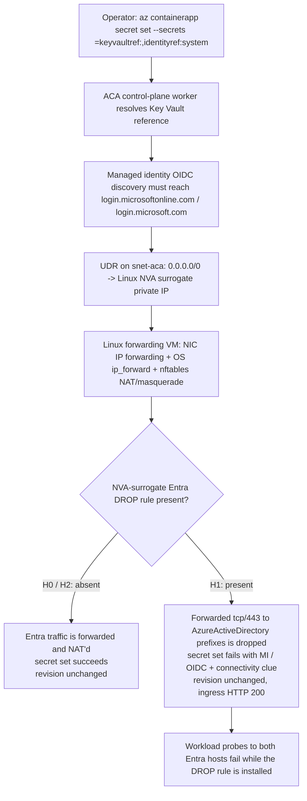

# ACA Secret Key Vault Reference — Third-Party NVA Surrogate Variant (H4f) Lab

> **Cost note**
> This lab uses a **small Linux forwarding VM** as the NVA surrogate — it does **not** use Azure Firewall. It is much cheaper than the H4g Firewall Premium variant and is expected to cost a **low-dollar or sub-dollar amount for a short 1-2 hour run**. Delete the resource group immediately after capturing evidence.

Reproduce the **third-party network virtual appliance (NVA)** failure surface where `az containerapp secret set --secrets <name>=keyvaultref:<url>,identityref:system` fails only while a Linux forwarding VM — standing in for a vendor NVA such as Palo Alto, Check Point, or Fortinet — drops outbound tcp/443 to the Entra authority. This is the scripted equivalent of using a system-assigned managed identity plus a Key Vault reference. The topology contains **no Azure Firewall** and **no TLS inspection**. Instead, the ACA workload subnet has a **route table** that sends `0.0.0.0/0` to the private IP of a **small Ubuntu Linux VM** whose NIC has Azure IP forwarding enabled and whose guest OS enables IP forwarding plus nftables NAT/masquerade. The only controlled variable is whether that VM carries a single nftables forwarding-plane DROP rule for the Entra authority.

This lab is a **reader-generated 17-gate Phase B falsification workflow**. You run `trigger.sh` and `falsify.sh` against your own Azure subscription to capture one live H0 → H1 → H2 cohort (files `01`-`13`) into [`labs/aca-secret-kv-ref-mi-network-path-h4f/evidence/`](https://github.com/yeongseon/azure-container-apps-practical-guide/tree/main/labs/aca-secret-kv-ref-mi-network-path-h4f/evidence). You then run `verify.sh`, which reads only those local files (no Azure API calls) and deterministically emits the four Phase B gate JSONs (`14`-`17`) that validate the narrow claim: **the NVA-surrogate forwarding-plane DROP rule for the Entra authority is the sole controlled variable** while app, Key Vault, identity, RBAC, route table, forwarding, NAT, revision, ingress, NSG, and DNS stay constant.

Bounded-scope disclosure: this workflow does **not** prove a control-plane packet capture, does **not** directly observe the control-plane resolver's egress, does **not** prove workload and control-plane egress are identical, does **not** generalize beyond the two exercised Entra authority hosts, and makes **no vendor-specific claim** about Palo Alto, Check Point, Fortinet, or any commercial NVA policy or logging behavior. It also makes **no Azure Firewall bypass claim**, because the cheap H4f topology intentionally has no Azure Firewall to bypass. Those confounders are carried explicitly in Gate 17 `explicit_drops`.

!!! info "Lab scope: H4f (third-party NVA surrogate variant)"
    This lab reproduces **H4f only** — a Linux forwarding VM is the NVA surrogate, the ACA subnet has a route table sending `0.0.0.0/0` to that VM's private IP, NIC and OS IP forwarding plus NAT are enabled, and there is **no Azure Firewall**, **no Firewall Policy**, **no TLS inspection**, **no NSG deny trigger**, **no custom DNS override**, and **no Virtual WAN routing intent**. The H1→H2 flip is **not** "change the route" and **not** "change TLS." The flip is **one nftables forwarding-plane DROP rule for outbound tcp/443 to `AzureActiveDirectory` service-tag prefixes: absent -> present -> absent**.

## Lab Metadata

| Attribute | Value |
|---|---|
| Difficulty | Advanced |
| Estimated Duration | 30-50 minutes depending on VM provisioning time and reader-generated workload-probe completion |
| Tier | Workload Profiles (Consumption profile) |
| Failure Mode | `az containerapp secret set --secrets <name>=keyvaultref:<url>,identityref:system` fails only while the Linux NVA surrogate drops outbound tcp/443 to `login.microsoftonline.com` / `login.microsoft.com`, causing a managed-identity / OIDC failure with a connectivity / timeout clue before the Key Vault read |
| Skills Practiced | Third-party NVA egress reasoning, service-tag-driven blocklists, bounded claim-ceiling writing, route-table anchoring, control-plane vs workload evidence discipline |

## 1) Background

Azure Container Apps supports **Key Vault references** in the secret manifest: the app declares a reference of the form `--key-vault-url https://<vault>.vault.azure.net/secrets/<name>` and the platform resolves it using a managed identity. Before the platform can call Key Vault it must acquire a token, and managed identity token acquisition requires an **OIDC discovery** step against the Entra authority — a plain HTTPS request to `https://login.microsoftonline.com/<tenant>/.well-known/openid-configuration` (the client may use `login.microsoft.com` instead — it picks one host at runtime).

H4f reproduces a **third-party NVA egress** failure. Many enterprise environments route all outbound traffic through a vendor NVA (Palo Alto, Check Point, Fortinet, or similar) rather than through Azure Firewall. When that NVA drops outbound HTTPS to the Entra authority, the base H4 Azure Firewall KQL returns zero rows — because the traffic never reaches an Azure Firewall. This lab substitutes a **small Linux forwarding VM** for the vendor NVA so the failure is reproducible without a commercial license. The route table, forwarding, and NAT all remain present throughout the lab. Key Vault stays public, RBAC stays constant, the app stays on the same revision, ingress keeps serving HTTP 200, and no NSG or DNS variable changes. What changes is whether the Linux NVA surrogate carries the Entra DROP rule:

- [Observed] H0 succeeds when the NVA surrogate forwards Entra traffic with no DROP rule.
- [Observed] H1 fails when the NVA surrogate installs one nftables forwarding-plane DROP rule for `AzureActiveDirectory` service-tag prefixes on tcp/443.
- [Observed] H2 succeeds again when that same DROP rule is removed from the same NVA surrogate.
- [Observed] A **workload** replica can probe both Entra hosts and observe failure during H1 and success during H2 while the DROP rule is installed.
- [Strongly Suggested] The **control-plane** secret resolver is affected by the same NVA-surrogate Entra block because the secret-set result flips exactly with the same H0/H1/H2 variable.
- [Not Proven] The lab never directly captures the control-plane resolver's egress.

### Architecture

<!-- diagram-id: architecture -->


!!! warning "Workload probe evidence is not the same thing as direct control-plane capture"
    [Observed] A workload replica can directly observe whether outbound tcp/443 to `login.microsoftonline.com` and `login.microsoft.com` succeeds on the **workload data plane**. [Strongly Suggested] If those workload probes flip together with the control-plane secret-set result in one H0/H1/H2 cohort, the control plane is strongly suggested to be affected by the same NVA-surrogate Entra block. [Not Proven] The guide does **not** state that this is direct control-plane egress proof.

## 2) Hypothesis

**IF** an Azure Container Apps environment uses Azure-provided DNS on its infrastructure VNet, the app has a system-assigned managed identity granted `Key Vault Secrets User` at the target Key Vault scope, a Linux NVA surrogate is present with NIC IP forwarding, OS IP forwarding, and NAT enabled, the ACA subnet has a route table sending `0.0.0.0/0` to the NVA surrogate private IP, and the only changed field is whether the NVA surrogate carries the Entra DROP rule, **THEN**:

- **H0 baseline (no DROP rule)**: `az containerapp secret set --secrets kvref-h0=keyvaultref:<url>,identityref:system` succeeds with exit code 0. The named secret `kvref-h0` appears in `properties.configuration.secrets`. `latestReadyRevisionName` is unchanged.
- **H1 trigger (DROP rule present)**: after installing the single nftables forwarding-plane DROP rule for `AzureActiveDirectory` service-tag prefixes on tcp/443, the command fails with exit code non-zero. `stderr` carries a **classifier-friendly** signature: **(managed-identity clue OR OIDC clue) AND (connectivity / timeout clue)**. `configuration.secrets` does **not** contain `kvref-h1`. `latestReadyRevisionName` is still unchanged. Ingress still returns HTTP 200. [Observed] workload probes to both Entra hosts fail while the DROP rule is installed.
- **H2 fix (DROP rule removed)**: after removing that same DROP rule from the same NVA surrogate, a **new** secret-set attempt succeeds with exit code 0. `kvref-h2` appears in `configuration.secrets`. `latestReadyRevisionName` is still unchanged from baseline. Ingress still returns HTTP 200. [Observed] workload probes to both Entra hosts succeed again and the DROP rule is absent.

| Variable | H0 | H1 | H2 |
|---|---|---|---|
| Linux NVA surrogate present | Yes | Yes | Yes |
| NIC IP forwarding enabled | Yes | Yes | Yes |
| OS IP forwarding + NAT enabled | Yes | Yes | Yes |
| Route table attached to ACA subnet | Yes | Yes | Yes |
| Default route next hop | NVA surrogate private IP | NVA surrogate private IP | NVA surrogate private IP |
| Azure Firewall present | No | No | No |
| TLS inspection configured | No | No | No |
| NSG deny trigger | No | No | No |
| Custom DNS override | No | No | No |
| Virtual WAN routing intent | No | No | No |
| NVA-surrogate Entra DROP rule | Absent | Present | Absent |
| `az containerapp secret set` exit code | `0` | Non-zero | `0` |
| Secret in `configuration.secrets` | `kvref-h0` present | `kvref-h1` absent | `kvref-h2` present |
| `latestReadyRevisionName` | Baseline | Unchanged (silence gate) | Unchanged (silence gate) |
| Ingress HTTP status | 200 | 200 | 200 |
| Workload probes to both Entra hosts | Succeed | Fail | Succeed |

## 3) Runbook

### Prerequisites

- Azure CLI 2.80+ with the `containerapp` extension.
- Azure subscription permissions for: resource group deploy, role assignment (`Microsoft.Authorization/roleAssignments/write`), Container Apps management, Key Vault management, virtual machine deploy, route-table management, and `az vm run-command invoke` on the NVA surrogate.
- `jq`, `curl`, and a local shell that can run the lab scripts.
- The lab drives the NVA surrogate entirely through `az vm run-command invoke`; no SSH key or inbound SSH is required. Azure still requires a VM admin password at provision time, which the lab passes as a Bicep parameter.

### Deploy infrastructure

```bash
export RG="rg-aca-secret-kv-ref-mi-network-path-h4f"
export LOCATION="koreacentral"
export BASE_NAME="acasech4f01"
export NVA_VM_ADMIN_PASSWORD="$(openssl rand -base64 24)Aa1!"

az group create --name "$RG" --location "$LOCATION"

az deployment group create \
    --resource-group "$RG" \
    --name aca-secret-kv-ref-mi-network-path-h4f \
    --template-file labs/aca-secret-kv-ref-mi-network-path-h4f/infra/main.bicep \
    --parameters baseName="$BASE_NAME" \
    --parameters deploymentPrincipalId="$(az ad signed-in-user show --query id --output tsv)" \
    --parameters nvaVmAdminPassword="$NVA_VM_ADMIN_PASSWORD"
```

| Command | Why it is used |
|---|---|
| `az group create` | Creates the resource group that scopes all lab resources. |
| `--name` | Name of the resource group (`$RG`). |
| `--location` | Azure region for the resource group (`$LOCATION`). |
| `az deployment group create` | Deploys the Bicep template that provisions the VNet, empty NSG, route table, Linux NVA surrogate VM, Container Apps environment, Container App, Key Vault, and Log Analytics. |
| `--resource-group` | Target resource group for the deployment. |
| `--name` | Deployment name (`aca-secret-kv-ref-mi-network-path-h4f`). |
| `--template-file` | Path to the lab Bicep template. |
| `--parameters` | Supplies required Bicep parameters. |
| `az ad signed-in-user show` | Resolves the signed-in principal's object ID for the `deploymentPrincipalId` parameter. |
| `--query` | Projects only the `id` field from the signed-in user object. |
| `--output` | Emits the object ID as a bare string for inline substitution. |

Expected output:

- Resource group creation succeeds.
- Deployment `provisioningState` is `Succeeded`.
- Bicep outputs include `nvaSurrogatePresent=true`, `nicIpForwardingEnabled=true`, `osIpForwardingEnabled=true`, `natEnabled=true`, `routeTableAttached=true`, `azureFirewallPresent=false`, and the NVA VM name plus private IP.

### Run the H0 baseline (`trigger.sh`)

```bash
bash labs/aca-secret-kv-ref-mi-network-path-h4f/trigger.sh
```

| Command | Why it is used |
|---|---|
| `trigger.sh` | Reads Bicep outputs, records baseline topology anchors proving the Linux NVA surrogate, route table, forwarding, and NAT baseline, creates a Key Vault secret out-of-band, runs `az containerapp secret set --secrets <name>=keyvaultref:<url>,identityref:system` against the healthy configuration, captures baseline app state before and after, and writes raw evidence files `01` through `05`. |

Expected output:

- `04-h0-secret-set-outcome.json` contains `exit_code: 0`.
- `05-h0-app-state-after.json` shows the secret `kvref-h0` present in `configuration.secrets`.
- `01-deployment-outputs.json` shows `nva_surrogate_present: true`, `nic_ip_forwarding_enabled: true`, `os_ip_forwarding_enabled: true`, `nat_enabled: true`, `route_table_attached: true`, `azure_firewall_present: false`, `firewall_policy_present: false`, `tls_inspection_configured: false`, `nsg_deny_present: false`, `dns_override_present: false`, and `vwan_routing_intent_present: false`.

### Run the H1 → H2 falsification (`falsify.sh`)

```bash
bash labs/aca-secret-kv-ref-mi-network-path-h4f/falsify.sh
```

| Command | Why it is used |
|---|---|
| `falsify.sh` | Performs H1 by installing the single nftables forwarding-plane DROP rule for `AzureActiveDirectory` service-tag prefixes on the NVA surrogate, then re-runs `az containerapp secret set` with `kvref-h1` while capturing the classifier-friendly failure surface, the DROP rule's recorded nft `counter` value, and workload probes to both Entra hosts. It then performs H2 by removing that same DROP rule from the same NVA surrogate, retries a fresh `az containerapp secret set` with `kvref-h2`, and captures the matching H2 workload probes proving both Entra hosts are reachable again. Writes raw evidence files `06` through `13`. |

Expected output:

- `06-h1-nva-drop-rule-installed.json` confirms `nva_rule_installation.rule_present: true` with `rule_comment: "h4f-drop-entra-443"` and `azure_active_directory_service_tag.prefix_count` at least 1.
- `07-h1-secret-set-outcome.json` contains `exit_code` non-zero and classifier-friendly stderr evidence.
- `08-h1-app-state.json` shows revision unchanged, ingress HTTP 200, and `kvref-h1` absent.
- `09-h1-nva-rule-state-and-workload-probe.json` shows `nva_rule_state.rule_present: true`, the DROP rule's recorded `rule_counter`, and `workload_probe` reporting `outcome: "failure"` for both `login.microsoftonline.com` and `login.microsoft.com`.
- `10-h2-nva-drop-rule-removed.json` confirms `nva_rule_removal.rule_removed: true` and `rule_present_after_remove: false`.
- `11-h2-secret-set-outcome.json` contains `exit_code: 0`.
- `12-h2-app-state.json` shows revision unchanged, ingress HTTP 200, and `kvref-h2` present.
- `13-h2-nva-rule-state-and-workload-probe.json` shows `nva_rule_state.rule_present: false` and `workload_probe` reporting `outcome: "success"` for both Entra hosts.

### Run the offline verifier over your locally generated pack

```bash
bash labs/aca-secret-kv-ref-mi-network-path-h4f/verify.sh
```

| Command | Why it is used |
|---|---|
| `verify.sh` | Reads only the local evidence files `01`-`13` that `trigger.sh` and `falsify.sh` wrote into `evidence/`, runs the prerequisite/schema gates, applies the H1 stderr classifier, validates the workload-probe claim-ceiling evidence, and deterministically writes the four Phase B gate JSONs (`14`-`17`). The verifier does not call Azure. |

Expected output:

- 17/17 gate passes on a valid cohort.
- `evidence/14-cohort-integrity-gate.json` shows the NVA-surrogate / route-table / forwarding / NAT anchors, the confounder-absence anchors (no Azure Firewall, no TLS inspection, no NSG deny, no DNS override, no Virtual WAN routing intent), and the revision silence invariant.
- `evidence/15-h1-nva-surrogate-drop-produces-failure-gate.json` proves H1 rule present, the classifier match, and both Entra probes failing.
- `evidence/16-h2-nva-surrogate-allow-restores-success-gate.json` proves H2 rule absent, recovery, and both Entra probes succeeding.
- `evidence/17-bounded-falsification-gate.json` concludes only that **the NVA-surrogate forwarding-plane DROP rule for the Entra authority is necessary and sufficient to reproduce this lab's secret-resolution failure**.

### Optional: inspect the NVA-surrogate rule state manually

```bash
az vm run-command invoke \
    --resource-group "$RG" \
    --name "$(jq -r .nva_vm_name labs/aca-secret-kv-ref-mi-network-path-h4f/evidence/01-deployment-outputs.json)" \
    --command-id RunShellScript \
    --scripts "sudo nft list chain inet h4f forward"
```

| Command | Why it is used |
|---|---|
| `az vm run-command invoke` | Runs a read-only shell command on the NVA surrogate so you can inspect the exact nftables forwarding chain and confirm whether the `h4f-drop-entra-443` rule is present during H1 or absent during H0/H2. |
| `--resource-group` | Targets the lab resource group. |
| `--name` | Names the NVA surrogate VM, read from the evidence pack. |
| `--command-id` | Uses the built-in `RunShellScript` command runner. |
| `--scripts` | Lists the `inet h4f forward` chain so the reader can see the DROP rule and its counters. |

Expected interpretation:

- **H1 window**: [Observed] the `h4f-drop-entra-443` DROP rule exists in the forward chain with an attached nft `counter`.
- **H2 window**: [Observed] the same rule is absent from the forward chain.
- [Not Proven] This query alone does **not** prove the control-plane resolver's egress, and a non-zero counter is **not** asserted because that would require the control-plane resolver's traffic to traverse this forward chain. It proves the configured NVA-surrogate forwarding state.

## 4) Experiment Log

| Step | Action | Expected | Falsification |
|---|---|---|---|
| 1 | Deploy baseline infrastructure via `az deployment group create` | Deployment succeeds; app is `Healthy/Running`; ingress FQDN returns HTTP 200; the Linux NVA surrogate, route table, NIC/OS forwarding, and NAT are all present; no Azure Firewall; no TLS inspection; no NSG deny; no custom DNS override | Deployment fails, or app never reaches `Healthy`, or baseline topology is missing the NVA surrogate / route table / forwarding, which invalidates H4f isolation |
| 2 | Run `trigger.sh` (H0 baseline) | `04-h0-secret-set-outcome.json` `exit_code: 0`; `kvref-h0` present; `latestReadyRevisionName` unchanged; NVA surrogate present with no Entra DROP rule | H0 secret set fails before any H4f rule mutation, which means the baseline is invalid |
| 3 | Run `falsify.sh` H1 (install the Entra DROP rule) | `06-h1-nva-drop-rule-installed.json` proves the DROP rule is present with comment `h4f-drop-entra-443` and at least one service-tag prefix | H1 rule snapshot does not show the rule present, so the trigger was not actually established |
| 4 | Run the H1 secret set with the same symptom | `07-h1-secret-set-outcome.json` `exit_code` non-zero with the classifier signature; `08-h1-app-state.json` shows revision unchanged, ingress HTTP 200, `kvref-h1` absent | H1 secret set still succeeds, or the revision changes, or ingress goes down, which breaks the silence-gate invariant |
| 5 | Capture the H1 NVA-local rule state and workload probes | `09-h1-nva-rule-state-and-workload-probe.json` shows `rule_present: true`, the recorded `rule_counter`, and both Entra-host probes report `outcome: "failure"` | A probe still succeeds, which contradicts the H1 block |
| 6 | Run `falsify.sh` H2 (remove the same DROP rule) | `10-h2-nva-drop-rule-removed.json` proves `rule_removed: true` and `rule_present_after_remove: false` | H2 rule snapshot still shows the rule present, so the block was not actually removed |
| 7 | Run the H2 secret set as a **new** attempt | `11-h2-secret-set-outcome.json` `exit_code: 0`; `12-h2-app-state.json` shows revision unchanged, ingress HTTP 200, `kvref-h2` present | H2 still fails even though the DROP rule was removed |
| 8 | Capture the H2 workload probes | `13-h2-nva-rule-state-and-workload-probe.json` shows `rule_present: false` and both Entra-host probes report `outcome: "success"` | A probe still fails even though the rule is absent |
| 9 | Run `verify.sh` (hermetic offline) | 17/17 gates pass; Gate 15 proves H1 trigger + classifier + both-host probe failure; Gate 16 proves H2 removal + recovery + both-host probe success; Gate 17 bounds the claim ceiling | Any gate fails, especially if the DROP-rule anchors or workload-probe outcomes do not match |

## 5) Verification Queries

### CLI: inspect the NVA-surrogate forwarding chain

```bash
az vm run-command invoke \
    --resource-group "$RG" \
    --name "$(jq -r .nva_vm_name labs/aca-secret-kv-ref-mi-network-path-h4f/evidence/01-deployment-outputs.json)" \
    --command-id RunShellScript \
    --scripts "sudo nft list chain inet h4f forward"
```

| Command | Why it is used |
|---|---|
| `az vm run-command invoke` | Verifies the exact `h4f-drop-entra-443` DROP rule and its counters on the NVA surrogate forwarding chain. |
| `--resource-group` | Targets the lab resource group. |
| `--name` | Names the NVA surrogate VM, read from the evidence pack. |
| `--command-id` | Uses the built-in `RunShellScript` command runner. |
| `--scripts` | Lists the `inet h4f forward` chain so the reader can confirm the rule and its drop counters. |

Expected interpretation:

- **H1 window**: [Observed] the DROP rule is present with an attached nft `counter`.
- **H2 window**: [Observed] the DROP rule is absent.
- [Not Proven] This query is stronger than a prose summary but still proves only the **configured NVA-surrogate forwarding state**, not the control-plane resolver's egress.

### CLI: reader-run workload connectivity probe

```bash
az containerapp exec \
    --name "$(jq -r .app_name labs/aca-secret-kv-ref-mi-network-path-h4f/evidence/01-deployment-outputs.json)" \
    --resource-group "$RG" \
    --command "sh -lc 'curl -4 -sS -o /dev/null -w \"%{http_code}\\n\" --max-time 10 https://login.microsoftonline.com/common/.well-known/openid-configuration'"
```

| Command | Why it is used |
|---|---|
| `az containerapp exec` | Runs a reader-driven command inside a workload replica so the workload data plane can observe whether outbound tcp/443 to the Entra authority succeeds. |
| `--name` | Names the Container App, read from the evidence pack. |
| `--resource-group` | Targets the lab resource group. |
| `--command` | Runs `curl` against the Entra authority OIDC document with a bounded timeout so a dropped connection reports as a failure rather than hanging. |

Expected interpretation:

- **H1 window**: [Observed] the workload probe fails (timeout / connection error) for both `login.microsoftonline.com` and `login.microsoft.com`.
- **H2 window**: [Observed] the workload probe succeeds for both hosts.
- [Strongly Suggested] If the workload probes flip together with the secret-set result, the control-plane secret resolver is strongly suggested to be affected by the same NVA-surrogate Entra block.
- [Not Proven] This remains **workload evidence**, not direct control-plane egress proof.

## 6) Portal Evidence (reader-generated captures)

Azure Portal screenshots to collect after running the H0 → H1 → H2 sequence. Save to `docs/assets/troubleshooting/aca-secret-kv-ref-mi-network-path-h4f/` with the exact filenames listed in the checklist below.

!!! note "Portal captures are reader-generated"
    The captures listed below are **not shipped** with this lab guide; real Portal PNG capture is a deferred follow-up tracked in the [H4f Portal-capture follow-up issue #372](https://github.com/yeongseon/azure-container-apps-practical-guide/issues/372). Each reader captures their own evidence against their own subscription after running `trigger.sh` and `falsify.sh`.

### Recommended capture set

| Screenshot | File name | Source |
|---|---|---|
| H0 Secrets blade showing `kvref-h0` | `01-h0-secrets-blade.png` | Container App → Settings → Secrets |
| Route table showing `0.0.0.0/0` next hop = NVA surrogate private IP | `02-route-table-next-hop-nva.png` | Route table → Routes |
| H1 secret-set failure plus unchanged revision | `03-h1-secret-set-failure-and-revision.png` | Container App → Secrets and Revisions |
| NIC blade showing IP forwarding enabled on the NVA surrogate | `04-nva-nic-ip-forwarding-enabled.png` | NVA VM → Networking → NIC IP configurations |
| H2 Secrets blade showing `kvref-h2` restored | `05-h2-secrets-restored.png` | Container App → Settings → Secrets |

Portal-evidence claim ceiling reminders:

- [Observed] Portal screenshots can prove the configured route-table next hop, NIC IP forwarding state, revision continuity, and secret presence/absence.
- [Strongly Suggested] The secret-resolver path is strongly suggested to be affected by the same NVA-surrogate Entra block because H0/H1/H2 behavior flips with only the DROP rule.
- [Not Proven] Portal screenshots do **not** directly prove the control-plane resolver's egress, and the Portal shows no Azure Firewall because the H4f topology intentionally has none.

## Clean Up

```bash
bash labs/aca-secret-kv-ref-mi-network-path-h4f/cleanup.sh
```

| Command | Why it is used |
|---|---|
| `cleanup.sh` | Deletes the resource group and all child resources (async). This variant deploys a small Linux VM as the NVA surrogate, so delete the group immediately after capturing evidence. |

## Related Playbook

- [Secret and Key Vault Reference Failure — H4 Variants: When Base H4 KQL Returns Zero Rows](../playbooks/identity-and-configuration/secret-and-key-vault-reference-failure.md#h4-variants-when-base-h4-kql-returns-zero-rows) (H4f row)

## See Also

- [ACA Secret Key Vault Reference — Managed Identity Network Path Lab (H4a base variant)](./aca-secret-kv-ref-mi-network-path.md)
- [ACA Secret Key Vault Reference — NSG Deny Variant (H4c)](./aca-secret-kv-ref-mi-network-path-h4c.md)
- [ACA Secret Key Vault Reference — Virtual WAN + Routing Intent Variant (H4d)](./aca-secret-kv-ref-mi-network-path-h4d.md)
- [ACA Secret Key Vault Reference — Firewall Premium TLS Inspection Variant (H4g)](./aca-secret-kv-ref-mi-network-path-h4g.md)
- [Managed Identity Auth Failure Playbook](../playbooks/identity-and-configuration/managed-identity-auth-failure.md)
- [Egress Control](../../platform/networking/egress-control.md)

## Sources

- [Manage secrets in Azure Container Apps](https://learn.microsoft.com/en-us/azure/container-apps/manage-secrets)
- [Managed identities in Azure Container Apps](https://learn.microsoft.com/en-us/azure/container-apps/managed-identity)
- [Networking in Azure Container Apps environment](https://learn.microsoft.com/en-us/azure/container-apps/networking)
- [Virtual network traffic routing (user-defined routes)](https://learn.microsoft.com/en-us/azure/virtual-network/virtual-networks-udr-overview)
- [Virtual network service tags](https://learn.microsoft.com/en-us/azure/virtual-network/service-tags-overview)
