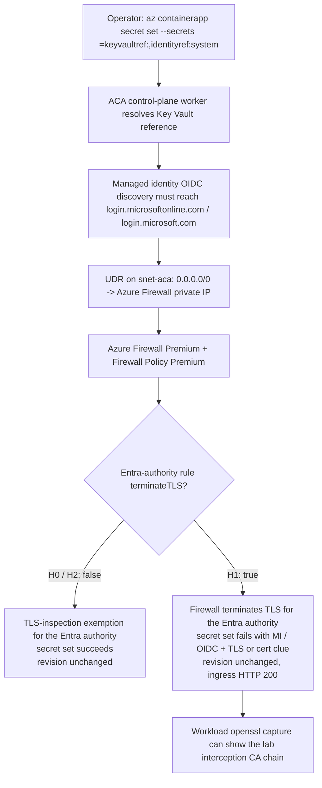

# ACA Secret Key Vault Reference — Azure Firewall Premium TLS-Inspection Variant (H4g) Lab

> **Cost warning**
> This lab uses **Azure Firewall Premium**, which is billed at a significantly higher rate than the other H4 variants and is expected to cost **several US dollars even for a short 1-2 hour run**. Delete the resource group immediately after capturing evidence.

Reproduce the **Azure Firewall Premium TLS-inspection** failure surface where `az containerapp secret set --secrets <name>=keyvaultref:<url>,identityref:system` fails only while the Entra-authority application rule for `login.microsoftonline.com` and `login.microsoft.com` has `terminateTLS=true`. This is the scripted equivalent of using a system-assigned managed identity plus a Key Vault reference. The topology contains **Azure Firewall Premium**, a **Firewall Policy Premium** with TLS inspection configured through an intermediate CA certificate, and a **route table** that sends `0.0.0.0/0` from the ACA workload subnet to the firewall private IP. The only controlled variable is the Entra-authority rule's TLS-inspection flag.

This lab is a **reader-generated 17-gate Phase B falsification workflow**. You run `trigger.sh` and `falsify.sh` against your own Azure subscription to capture one live H0 → H1 → H2 cohort (files `01`-`13`) into [`labs/aca-secret-kv-ref-mi-network-path-h4g/evidence/`](https://github.com/yeongseon/azure-container-apps-practical-guide/tree/main/labs/aca-secret-kv-ref-mi-network-path-h4g/evidence). You then run `verify.sh`, which reads only those local files (no Azure API calls) and deterministically emits the four Phase B gate JSONs (`14`-`17`) that validate the narrow claim: **TLS inspection of the Entra authority FQDNs is the sole controlled variable** while app, Key Vault, identity, RBAC, firewall presence, route table, revision, ingress, NSG, and DNS stay constant.

Bounded-scope disclosure: this workflow does **not** prove a control-plane packet capture, does **not** directly observe the control-plane TLS chain, does **not** prove workload and control-plane egress are identical, and does **not** generalize beyond the two exercised Entra authority FQDNs. It also makes no third-party-NVA claim and no Key Vault data-plane-failure claim. Those confounders are carried explicitly in Gate 17 `explicit_drops`.

!!! info "Lab scope: H4g (Azure Firewall Premium TLS-inspection variant)"
    This lab reproduces **H4g only** — Azure Firewall Premium is present, Firewall Policy Premium is present, TLS inspection is configured, the ACA subnet has a route table sending `0.0.0.0/0` to the firewall private IP, there is **no NSG deny trigger**, **no custom DNS override**, and **no Virtual WAN routing intent**. The H1→H2 flip is **not** “remove the rule” and **not** “change the route.” The flip is **the Entra-authority application rule's `terminateTLS` flag: `false -> true -> false`**.

## Lab Metadata

| Attribute | Value |
|---|---|
| Difficulty | Advanced |
| Estimated Duration | 45-75 minutes depending on Azure Firewall Premium deployment time and reader-generated `openssl` capture completion |
| Tier | Workload Profiles (Consumption profile) |
| Failure Mode | `az containerapp secret set --secrets <name>=keyvaultref:<url>,identityref:system` fails only while Azure Firewall Premium terminates TLS for `login.microsoftonline.com` / `login.microsoft.com`, causing a managed-identity / OIDC failure with a TLS or certificate clue before the Key Vault read |
| Skills Practiced | Azure Firewall Premium TLS-inspection reasoning, bounded claim-ceiling writing, route-table anchoring, control-plane vs workload evidence discipline |

## 1) Background

Azure Container Apps supports **Key Vault references** in the secret manifest: the app declares a reference of the form `--key-vault-url https://<vault>.vault.azure.net/secrets/<name>` and the platform resolves it using a managed identity. Before the platform can call Key Vault it must acquire a token, and managed identity token acquisition requires an **OIDC discovery** step against the Entra authority — a plain HTTPS request to `https://login.microsoftonline.com/<tenant>/.well-known/openid-configuration` (the client may use `login.microsoft.com` instead — it picks one host at runtime).

H4g reproduces a **TLS-inspection exemption** failure. Azure Firewall Premium and the route table both remain present throughout the lab. Key Vault stays public, RBAC stays constant, the app stays on the same revision, ingress keeps serving HTTP 200, and no NSG or DNS variable changes. What changes is whether the Entra-authority application rule terminates TLS:

- [Observed] H0 succeeds when the Entra-authority rule exists with `terminateTLS=false`.
- [Observed] H1 fails when that same rule exists with `terminateTLS=true`.
- [Observed] H2 succeeds again when that same rule is restored to `terminateTLS=false`.
- [Observed] A **workload** replica can capture the interception CA chain during H1 and its absence during H2 with `openssl s_client`.
- [Strongly Suggested] The **control-plane** secret resolver is affected by the same Entra-authority TLS-inspection exemption because the secret-set result flips exactly with the same H0/H1/H2 variable.
- [Not Proven] The lab never directly captures the control-plane TLS chain.

### Architecture

<!-- diagram-id: architecture -->


!!! warning "Workload `openssl` evidence is not the same thing as direct control-plane capture"
    [Observed] A workload replica can directly observe whether the lab interception CA appears on the **workload data plane** for `login.microsoftonline.com:443`. [Strongly Suggested] If that workload chain flips together with the control-plane secret-set result in one H0/H1/H2 cohort, the control plane is strongly suggested to be affected by the same Entra-authority TLS-inspection exemption. [Not Proven] The guide does **not** state that this is direct control-plane TLS-chain proof.

## 2) Hypothesis

**IF** an Azure Container Apps environment uses Azure-provided DNS on its infrastructure VNet, the app has a system-assigned managed identity granted `Key Vault Secrets User` at the target Key Vault scope, Azure Firewall Premium is present with Firewall Policy Premium TLS inspection configured, the ACA subnet has a route table sending `0.0.0.0/0` to the firewall private IP, and the only changed field is the Entra-authority rule's `terminateTLS` flag, **THEN**:

- **H0 baseline (`terminateTLS=false`)**: `az containerapp secret set --secrets kvref-h0=keyvaultref:<url>,identityref:system` succeeds with exit code 0. The named secret `kvref-h0` appears in `properties.configuration.secrets`. `latestReadyRevisionName` is unchanged.
- **H1 trigger (`terminateTLS=true`)**: after redeploying the same Firewall Policy so the same Entra-authority rule terminates TLS, the command fails with exit code non-zero. `stderr` carries a **classifier-friendly** signature: **(managed-identity clue OR OIDC clue) AND (TLS/certificate clue)**. `configuration.secrets` does **not** contain `kvref-h1`. `latestReadyRevisionName` is still unchanged. Ingress still returns HTTP 200. [Observed] the workload `openssl` capture shows the unexpected lab interception CA chain.
- **H2 fix (`terminateTLS=false`)**: after redeploying the same Firewall Policy so the same Entra-authority rule again exempts TLS inspection, a **new** secret-set attempt succeeds with exit code 0. `kvref-h2` appears in `configuration.secrets`. `latestReadyRevisionName` is still unchanged from baseline. Ingress still returns HTTP 200. [Observed] the workload `openssl` capture no longer shows the lab interception CA chain.

| Variable | H0 | H1 | H2 |
|---|---|---|---|
| Azure Firewall present | Premium | Premium | Premium |
| Firewall Policy present | Premium | Premium | Premium |
| TLS inspection configured | Yes | Yes | Yes |
| Route table attached to ACA subnet | Yes | Yes | Yes |
| Default route next hop | Azure Firewall private IP | Azure Firewall private IP | Azure Firewall private IP |
| NSG deny trigger | No | No | No |
| Custom DNS override | No | No | No |
| Virtual WAN routing intent | No | No | No |
| Entra-authority rule exists | Yes | Yes | Yes |
| Entra-authority `terminateTLS` | `false` | `true` | `false` |
| `az containerapp secret set` exit code | `0` | Non-zero | `0` |
| Secret in `configuration.secrets` | `kvref-h0` present | `kvref-h1` absent | `kvref-h2` present |
| `latestReadyRevisionName` | Baseline | Unchanged (silence gate) | Unchanged (silence gate) |
| Ingress HTTP status | 200 | 200 | 200 |

## 3) Runbook

### Prerequisites

- Azure CLI 2.80+ with the `containerapp` extension.
- Azure subscription permissions for: resource group deploy, role assignment (`Microsoft.Authorization/roleAssignments/write`), Container Apps management, Key Vault management, Azure Firewall / Firewall Policy management, route-table management, and user-assigned managed identity creation.
- `jq`, `curl`, and a local shell that can run the lab scripts.
- A **password-less PFX intermediate CA certificate** stored as a Key Vault secret for Azure Firewall Premium TLS inspection.
- A **pre-created user-assigned managed identity** that already has **Get** and **List** access to the Key Vault that stores that CA secret.

### Pre-create the TLS-inspection identity access path

Before you deploy `main.bicep`, complete these reader-owned steps:

1. Create a **user-assigned managed identity** in Azure.
2. Grant that identity **Get** and **List** access on the Key Vault that stores the TLS-inspection intermediate CA secret.
3. Export that identity resource ID as `TLS_INSPECTION_IDENTITY_RESOURCE_ID` and pass it into the lab deployment.

### Deploy infrastructure

```bash
export RG="rg-aca-secret-kv-ref-mi-network-path-h4g"
export LOCATION="koreacentral"
export BASE_NAME="acasech4g01"
export TLS_INSPECTION_CA_KEY_VAULT_SECRET_ID="https://<ca-vault>.vault.azure.net/secrets/<ca-secret>/<version>"
export TLS_INSPECTION_CA_CERTIFICATE_NAME="lab-h4g-intermediate-ca"
export TLS_INSPECTION_IDENTITY_RESOURCE_ID="/subscriptions/<subscription-id>/resourceGroups/<identity-rg>/providers/Microsoft.ManagedIdentity/userAssignedIdentities/<identity-name>"

az group create --name "$RG" --location "$LOCATION"

az deployment group create \
    --resource-group "$RG" \
    --name aca-secret-kv-ref-mi-network-path-h4g \
    --template-file labs/aca-secret-kv-ref-mi-network-path-h4g/infra/main.bicep \
    --parameters baseName="$BASE_NAME" \
    --parameters deploymentPrincipalId="$(az ad signed-in-user show --query id --output tsv)" \
    --parameters tlsInspectionCaKeyVaultSecretId="$TLS_INSPECTION_CA_KEY_VAULT_SECRET_ID" \
    --parameters tlsInspectionCaCertificateName="$TLS_INSPECTION_CA_CERTIFICATE_NAME" \
    --parameters tlsInspectionIdentityResourceId="$TLS_INSPECTION_IDENTITY_RESOURCE_ID"
```

| Command | Why it is used |
|---|---|
| `az group create` | Creates the resource group that scopes all lab resources. |
| `--name` | Name of the resource group (`$RG`). |
| `--location` | Azure region for the resource group (`$LOCATION`). |
| `az deployment group create` | Deploys the Bicep template that provisions the VNet, empty NSG, route table, Azure Firewall Premium, Firewall Policy Premium with TLS inspection configured, Container Apps environment, Container App, Key Vault, and Log Analytics. |
| `--resource-group` | Target resource group for the deployment. |
| `--name` | Deployment name (`aca-secret-kv-ref-mi-network-path-h4g`). |
| `--template-file` | Path to the lab Bicep template. |
| `--parameters` | Supplies required Bicep parameters. |
| `az ad signed-in-user show` | Resolves the signed-in principal's object ID for the `deploymentPrincipalId` parameter. |
| `--query id` | Projects only the `id` field from the signed-in user object. |
| `--output tsv` | Emits the object ID as a bare string for inline substitution. |
| `tlsInspectionIdentityResourceId="$TLS_INSPECTION_IDENTITY_RESOURCE_ID"` | Supplies the resource ID of the pre-created user-assigned identity that already has Get/List access to the CA vault. |

Expected output:

- Resource group creation succeeds.
- Deployment `provisioningState` is `Succeeded`.
- Bicep outputs include `azureFirewallPresent=true`, `azureFirewallSku="Premium"`, `firewallPolicyPresent=true`, `tlsInspectionConfigured=true`, `routeTableAttached=true`, and the Entra-authority rule identifiers.

### Run the H0 baseline (`trigger.sh`)

```bash
bash labs/aca-secret-kv-ref-mi-network-path-h4g/trigger.sh
```

| Command | Why it is used |
|---|---|
| `trigger.sh` | Reads Bicep outputs, records baseline topology anchors proving Firewall Premium + TLS inspection + route table presence, creates a Key Vault secret out-of-band, runs `az containerapp secret set --secrets <name>=keyvaultref:<url>,identityref:system` against the healthy configuration, captures baseline app state before and after, and writes raw evidence files `01` through `05`. |

Expected output:

- `04-h0-secret-set-outcome.json` contains `exit_code: 0`.
- `05-h0-app-state-after.json` shows the secret `kvref-h0` present in `configuration.secrets`.
- `01-deployment-outputs.json` shows `azure_firewall_present: true`, `azure_firewall_sku: "Premium"`, `firewall_policy_present: true`, `tls_inspection_configured: true`, `route_table_attached: true`, `entra_authority_terminate_tls: false`, `nsg_deny_present: false`, `dns_override_present: false`, and `vwan_routing_intent_present: false`.

### Run the H1 → H2 falsification (`falsify.sh`)

```bash
bash labs/aca-secret-kv-ref-mi-network-path-h4g/falsify.sh
```

| Command | Why it is used |
|---|---|
| `falsify.sh` | Performs H1 by redeploying the same Bicep template with `entraAuthorityTerminateTls=true`, then re-runs `az containerapp secret set` with `kvref-h1` while capturing the classifier-friendly failure surface and a reader-filled workload `openssl` evidence placeholder. It then performs H2 by redeploying the same template with `entraAuthorityTerminateTls=false`, retries a fresh `az containerapp secret set` with `kvref-h2`, and captures the matching H2 workload `openssl` placeholder proving the lab interception CA disappeared again. Writes raw evidence files `06` through `13`. |

Expected output:

- `06-h1-entra-rule-updated.json` confirms the Entra-authority rule exists with `terminateTLS: true`.
- `07-h1-secret-set-outcome.json` contains `exit_code` non-zero and classifier-friendly stderr evidence.
- `08-h1-app-state.json` shows revision unchanged, ingress HTTP 200, and `kvref-h1` absent.
- `09-h1-rule-state-and-openssl.json` includes the H1 firewall-rule snapshot plus a reader-generated workload `openssl` placeholder that must be completed with `status: "completed"` and `reader_asserted_contains_lab_intermediate_ca: true`.
- `10-h2-entra-rule-updated.json` confirms the Entra-authority rule exists with `terminateTLS: false`.
- `11-h2-secret-set-outcome.json` contains `exit_code: 0`.
- `12-h2-app-state.json` shows revision unchanged, ingress HTTP 200, and `kvref-h2` present.
- `13-h2-rule-state-and-openssl.json` includes the H2 firewall-rule snapshot plus a reader-generated workload `openssl` placeholder that must be completed with `status: "completed"` and `reader_asserted_contains_lab_intermediate_ca: false`.

### Run the offline verifier over your locally generated pack

```bash
bash labs/aca-secret-kv-ref-mi-network-path-h4g/verify.sh
```

| Command | Why it is used |
|---|---|
| `verify.sh` | Reads only the local evidence files `01`-`13` that `trigger.sh` and `falsify.sh` wrote into `evidence/`, runs the prerequisite/schema gates, applies the H1 stderr classifier, validates the workload `openssl` claim-ceiling evidence, and deterministically writes the four Phase B gate JSONs (`14`-`17`). The verifier does not call Azure. |

Expected output:

- 17/17 gate passes on a valid cohort.
- `evidence/14-cohort-integrity-gate.json` shows the Firewall Premium / TLS-inspection / route-table anchors and the revision silence invariant.
- `evidence/15-h1-tls-inspection-produces-failure-gate.json` proves H1 `terminateTLS=true`, the classifier match, and the workload-CA observation.
- `evidence/16-h2-exemption-restores-success-gate.json` proves H2 `terminateTLS=false`, recovery, and the workload-CA disappearance.
- `evidence/17-bounded-falsification-gate.json` concludes only that **TLS inspection of the Entra authority FQDNs is necessary and sufficient to reproduce this lab's secret-resolution failure**.

### Optional: inspect the Firewall Policy rule state manually

```bash
az network firewall policy rule-collection-group show \
    --resource-group "$RG" \
    --policy-name "$(jq -r .firewall_policy_name labs/aca-secret-kv-ref-mi-network-path-h4g/evidence/01-deployment-outputs.json)" \
    --name "$(jq -r .firewall_rule_collection_group_name labs/aca-secret-kv-ref-mi-network-path-h4g/evidence/01-deployment-outputs.json)"
```

| Command | Why it is used |
|---|---|
| `az network firewall policy rule-collection-group show` | Reads the Firewall Policy rule collection group so you can inspect the exact Entra-authority rule and confirm whether `terminateTLS` is `true` during H1 or `false` during H0/H2. |
| `--resource-group` | Targets the lab resource group. |
| `--policy-name` | Names the lab Firewall Policy, read from the evidence pack. |
| `--name` | Names the rule collection group, read from the evidence pack. |

Expected interpretation:

- **H1 window**: [Observed] the Entra-authority application rule exists and has `terminateTLS: true`.
- **H2 window**: [Observed] the same rule exists and has `terminateTLS: false`.
- [Not Proven] This query alone does **not** prove the control-plane TLS chain. It proves the configured Firewall Policy state.

## 4) Experiment Log

| Step | Action | Expected | Falsification |
|---|---|---|---|
| 1 | Deploy baseline infrastructure via `az deployment group create` | Deployment succeeds; app is `Healthy/Running`; ingress FQDN returns HTTP 200; Azure Firewall Premium, Firewall Policy Premium, TLS inspection, and route table are all present; no NSG deny trigger; no custom DNS override | Deployment fails, or app never reaches `Healthy`, or baseline topology is missing Firewall Premium / TLS inspection / route table, which invalidates H4g isolation |
| 2 | Run `trigger.sh` (H0 baseline) | `04-h0-secret-set-outcome.json` `exit_code: 0`; `kvref-h0` present; `latestReadyRevisionName` unchanged; Entra-authority rule already exists with `terminateTLS=false` | H0 secret set fails before any H4g rule mutation, which means the baseline is invalid |
| 3 | Run `falsify.sh` H1 (redeploy with `terminateTLS=true`) | `06-h1-entra-rule-updated.json` proves the Entra-authority rule now terminates TLS | H1 rule snapshot does not show `terminateTLS=true`, so the trigger was not actually established |
| 4 | Run the H1 secret set with the same symptom | `07-h1-secret-set-outcome.json` `exit_code` non-zero with the classifier signature; `08-h1-app-state.json` shows revision unchanged, ingress HTTP 200, `kvref-h1` absent | H1 secret set still succeeds, or the revision changes, or ingress goes down, which breaks the silence-gate invariant |
| 5 | Complete the H1 workload `openssl` evidence | `09-h1-rule-state-and-openssl.json` is updated by the reader to `status: "completed"` and `reader_asserted_contains_lab_intermediate_ca: true` | Reader leaves the placeholder unfilled, or the capture does not show the lab interception CA |
| 6 | Run `falsify.sh` H2 (redeploy with `terminateTLS=false`) | `10-h2-entra-rule-updated.json` proves the same Entra-authority rule no longer terminates TLS | H2 rule snapshot still shows `terminateTLS=true`, so the documented exemption was not actually restored |
| 7 | Run the H2 secret set as a **new** attempt | `11-h2-secret-set-outcome.json` `exit_code: 0`; `12-h2-app-state.json` shows revision unchanged, ingress HTTP 200, `kvref-h2` present | H2 still fails even though the exemption was restored |
| 8 | Complete the H2 workload `openssl` evidence | `13-h2-rule-state-and-openssl.json` is updated by the reader to `status: "completed"` and `reader_asserted_contains_lab_intermediate_ca: false` | Reader leaves the placeholder unfilled, or the capture still shows the interception CA |
| 9 | Run `verify.sh` (hermetic offline) | 17/17 gates pass; Gate 15 proves H1 trigger + classifier + workload CA presence; Gate 16 proves H2 exemption + recovery + workload CA absence; Gate 17 bounds the claim ceiling | Any gate fails, especially if H1/H2 `openssl` placeholders remain unfilled or the terminateTLS anchors do not match |

## 5) Verification Queries

### CLI: inspect the Entra-authority Firewall Policy rule

```bash
az network firewall policy rule-collection-group show \
    --resource-group "$RG" \
    --policy-name "$(jq -r .firewall_policy_name labs/aca-secret-kv-ref-mi-network-path-h4g/evidence/01-deployment-outputs.json)" \
    --name "$(jq -r .firewall_rule_collection_group_name labs/aca-secret-kv-ref-mi-network-path-h4g/evidence/01-deployment-outputs.json)"
```

| Command | Why it is used |
|---|---|
| `az network firewall policy rule-collection-group show` | Verifies the exact Entra-authority application rule and whether `terminateTLS` is enabled or exempted. |
| `--resource-group` | Targets the lab resource group. |
| `--policy-name` | Names the lab Firewall Policy. |
| `--name` | Names the rule collection group that contains the Entra-authority rule. |

Expected interpretation:

- **H1 window**: [Observed] `terminateTLS` is `true` for the Entra-authority rule.
- **H2 window**: [Observed] `terminateTLS` is `false` for the same rule.
- [Not Proven] This query is stronger than a prose summary but still proves only the **configured Firewall Policy state**, not the control-plane TLS chain.

### CLI: reader-run workload `openssl` capture

```bash
az containerapp exec \
    --name "$(jq -r .app_name labs/aca-secret-kv-ref-mi-network-path-h4g/evidence/01-deployment-outputs.json)" \
    --resource-group "$RG" \
    --command "sh -lc 'openssl s_client -connect login.microsoftonline.com:443 -servername login.microsoftonline.com -showcerts < /dev/null 2>&1'"
```

| Command | Why it is used |
|---|---|
| `az containerapp exec` | Runs a reader-driven command inside a workload replica so the workload data plane can observe whether the lab interception CA chain appears for `login.microsoftonline.com:443`. |
| `--name` | Names the Container App, read from the evidence pack. |
| `--resource-group` | Targets the lab resource group. |
| `--command` | Runs `openssl s_client` with SNI and `-showcerts` to expose the observed certificate chain. |

Expected interpretation:

- **H1 window**: [Observed] the workload capture shows the lab interception CA chain.
- **H2 window**: [Observed] the workload capture no longer shows that interception CA.
- [Strongly Suggested] If the workload chain flips together with the secret-set result, the control-plane secret resolver is strongly suggested to be affected by the same Entra-authority exemption.
- [Not Proven] This remains **workload evidence**, not direct control-plane TLS-chain proof.

## 6) Portal Evidence (reader-generated captures)

Azure Portal screenshots to collect after running the H0 → H1 → H2 sequence. Save to `docs/assets/troubleshooting/aca-secret-kv-ref-mi-network-path-h4g/` with the exact filenames listed in the checklist below.

!!! note "Portal captures are reader-generated"
    The captures listed below are **not shipped** with this lab guide; real Portal PNG capture is a deferred follow-up tracked in the [H4g Portal-capture follow-up issue #370](https://github.com/yeongseon/azure-container-apps-practical-guide/issues/370). Each reader captures their own evidence against their own subscription after running `trigger.sh` and `falsify.sh`.

### Recommended capture set

| Screenshot | File name | Source |
|---|---|---|
| H0 Secrets blade showing `kvref-h0` | `01-h0-secrets-blade.png` | Container App → Settings → Secrets |
| H1 Firewall Policy rule showing `terminateTLS=true` | `02-h1-firewall-rule-terminate-tls-true.png` | Firewall Policy → Rule collection group |
| H1 secret-set failure plus unchanged revision | `03-h1-secret-set-failure-and-revision.png` | Container App → Secrets and Revisions |
| H2 Firewall Policy rule showing `terminateTLS=false` | `04-h2-firewall-rule-terminate-tls-false.png` | Firewall Policy → Rule collection group |
| H2 Secrets blade showing `kvref-h2` restored | `05-h2-secrets-restored.png` | Container App → Settings → Secrets |

Portal-evidence claim ceiling reminders:

- [Observed] Portal screenshots can prove the configured Firewall Policy rule state, revision continuity, and secret presence/absence.
- [Strongly Suggested] The secret-resolver path is strongly suggested to be affected by the same Entra-authority TLS-inspection exemption because H0/H1/H2 behavior flips with only the `terminateTLS` field.
- [Not Proven] Portal screenshots do **not** directly prove the control-plane TLS chain.

## Clean Up

```bash
bash labs/aca-secret-kv-ref-mi-network-path-h4g/cleanup.sh
```

| Command | Why it is used |
|---|---|
| `cleanup.sh` | Deletes the resource group and all child resources (async). This variant deploys Azure Firewall Premium, so delete the group immediately after capturing evidence. |

## Related Playbook

- [Secret and Key Vault Reference Failure — H4 Variants: When Base H4 KQL Returns Zero Rows](../playbooks/identity-and-configuration/secret-and-key-vault-reference-failure.md#h4-variants-when-base-h4-kql-returns-zero-rows) (future H4g row)

## See Also

- [ACA Secret Key Vault Reference — Managed Identity Network Path Lab (H4a base variant)](./aca-secret-kv-ref-mi-network-path.md)
- [ACA Secret Key Vault Reference — NSG Deny Variant (H4c)](./aca-secret-kv-ref-mi-network-path-h4c.md)
- [ACA Secret Key Vault Reference — Virtual WAN + Routing Intent Variant (H4d)](./aca-secret-kv-ref-mi-network-path-h4d.md)
- [Managed Identity Auth Failure Playbook](../playbooks/identity-and-configuration/managed-identity-auth-failure.md)
- [Egress Control](../../platform/networking/egress-control.md)

## Sources

- [Manage secrets in Azure Container Apps](https://learn.microsoft.com/en-us/azure/container-apps/manage-secrets)
- [Managed identities in Azure Container Apps](https://learn.microsoft.com/en-us/azure/container-apps/managed-identity)
- [Networking in Azure Container Apps environment](https://learn.microsoft.com/en-us/azure/container-apps/networking)
- [Azure Firewall Premium certificates](https://learn.microsoft.com/en-us/azure/firewall/premium-certificates)
- [Microsoft.Network/firewallPolicies template reference](https://learn.microsoft.com/en-us/azure/templates/microsoft.network/firewallpolicies)
