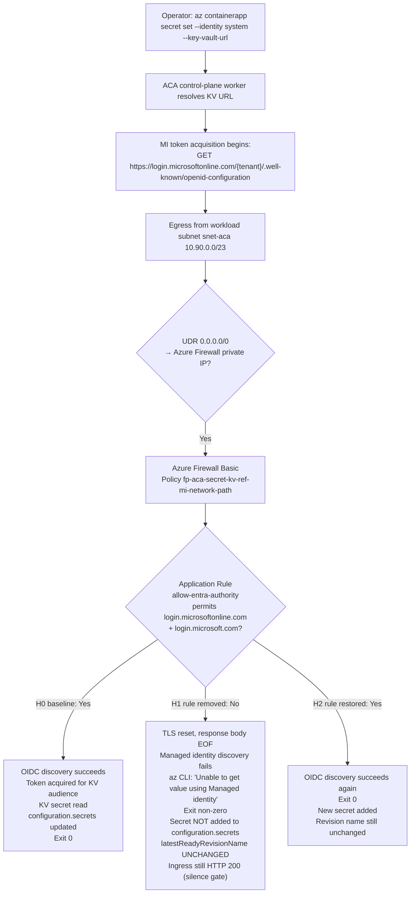

# ACA Secret Key Vault Reference — Managed Identity Network Path Lab

Reproduce the customer-reported failure surface where `az containerapp secret set --identity system --key-vault-url ...` fails with `Unable to get value using Managed identity` → `Get https://login.microsoftonline.com/<tenant>/.well-known/openid-configuration: EOF`, and prove that the sole controlled variable is an Azure Firewall Application Rule that permits the Entra ID authority FQDNs (`login.microsoftonline.com` and `login.microsoft.com`) from the Container Apps workload subnet.

This lab is a **reader-generated 17-gate Phase B falsification workflow**. You run `trigger.sh` and `falsify.sh` against your own Azure subscription to capture one live H0 → H1 → H2 cohort (files `01`-`13`) into [`labs/aca-secret-kv-ref-mi-network-path/evidence/`](https://github.com/yeongseon/azure-container-apps-practical-guide/tree/main/labs/aca-secret-kv-ref-mi-network-path/evidence). You then run `verify.sh`, which reads only those local files (no Azure API calls) and deterministically emits the four Phase B gate JSONs (`14`-`17`) that validate the narrow claim: removing the `allow-entra-authority` Application Rule Collection from the firewall policy is the mechanically observable trigger, and restoring it with both `login.microsoftonline.com` and `login.microsoft.com` in one atomic rule is the mechanically observable fix. The lab does **not** ship a committed cohort; each reader generates their own.

Bounded-scope disclosure: the workflow does **not** prove exact `stderr` wording, log ingestion latency, retry cadence, component identity behind the OIDC EOF, response body shape, token caching behavior, SKU generality (Basic vs Standard/Premium firewall), or region generality. Those confounders are carried explicitly in Gate 17 `explicit_drops`, so readers can see exactly where the evidence ceiling stops.

!!! info "Lab scope: H4a (base variant only)"
    This lab reproduces **H4a only** — hub-spoke topology + UDR + Azure Firewall Basic/Standard + missing Application Rule + diagnostic logging enabled + `Deny` row visible in `AZFWApplicationRule`. The reproducer covers the smoking-gun evidence path for one specific network topology and one specific evidence signature.

    Six additional topology variants (H4b diagnostic logging disabled, H4c NSG deny, H4d Virtual WAN + Routing Intent, H4e custom DNS override for the Entra authority, H4f 3rd-party NVA, H4g TLS inspection with untrusted intermediary cert) share the same customer-facing symptom (`Unable to get value using Managed identity` + `.well-known/openid-configuration: EOF`) but require different reproducers and produce different evidence signatures. **A zero-row result from the base H4 KQL in this lab does not falsify H4 by itself** — it may indicate H4b, H4c, H4d, H4e, H4f, or H4g rather than the absence of a network-path cause. If your customer environment differs from H4a's topology — for example, the customer uses Virtual WAN Hub + Routing Intent, or reports "no firewall block logs" despite having AzFW in path — consult the [Playbook H4 Variants table](../playbooks/identity-and-configuration/secret-and-key-vault-reference-failure.md#h4-variants-when-base-h4-kql-returns-zero-rows) for the detection matrix and rule-out order. The first variant reproducer — [H4b (logging-gap variant)](./aca-secret-kv-ref-mi-network-path-h4b.md), where the base H4 KQL returns zero `Deny` rows because the `AzureFirewallApplicationRule` diagnostic category is disabled — is now available. Follow-up reproducer labs for the remaining variants (H4c through H4g) are tracked in [issue #307](https://github.com/yeongseon/azure-container-apps-practical-guide/issues/307).

## Lab Metadata

| Attribute | Value |
|---|---|
| Difficulty | Advanced |
| Estimated Duration | 60-90 minutes (includes 8-12 min Firewall Basic deploy plus 2 × 60s firewall log ingestion waits) |
| Tier | Workload Profiles (Consumption profile) |
| Failure Mode | `az containerapp secret set --identity system --key-vault-url ...` fails with `Unable to get value using Managed identity` — OIDC discovery to the Entra authority (`login.microsoftonline.com` or `login.microsoft.com`) blocked by Azure Firewall before token acquisition |
| Skills Practiced | Managed identity OIDC discovery, Azure Firewall Application Rule diagnosis, UDR-forced egress analysis, silence-gate reasoning for control-plane vs data-plane failures |

## 1) Background

Azure Container Apps supports **Key Vault references** in the secret manifest: instead of storing the secret value on the app, the app declares a reference of the form `--key-vault-url https://<vault>.vault.azure.net/secrets/<name>` and the platform resolves it at runtime using either a system-assigned or user-assigned managed identity. The `az containerapp secret set --identity system --key-vault-url ...` command wires this reference in one call.

Under the hood, before the platform can call Key Vault it must acquire a token for the vault's audience. Managed identity token acquisition requires an **OIDC discovery** step against the Entra ID authority — a plain HTTPS `GET https://login.microsoftonline.com/<tenant>/.well-known/openid-configuration` — which returns the token endpoint metadata. Only after discovery succeeds can the caller proceed to the token endpoint, exchange the identity-service credential for a Key Vault-audience token, and read the secret.

In a Container Apps environment with **workload-profile networking** and a user-defined route (`0.0.0.0/0 → Azure Firewall private IP`) on the workload subnet, that OIDC discovery request egresses through Azure Firewall. If the firewall policy does not carry an Application Rule permitting the Entra authority FQDN, the TLS handshake is terminated mid-stream and the caller sees an `EOF` in the response body — the failure surface is a network reset, not an HTTP status code from Microsoft Entra ID.

This failure is easy to misread because:

- The MI *exists* and has the correct principal ID.
- The KV RBAC assignment (`Key Vault Secrets User` at the vault scope) is present and correct.
- The Key Vault firewall (or PE) allows the caller's outbound path.
- Direct data-plane probes to the vault FQDN work.

The failure is not at the KV data plane. It is one hop earlier, at the Entra authority discovery step. Once the Application Rule is in place, discovery succeeds, the token flows, and the secret set completes.

### Architecture

<!-- diagram-id: architecture -->


!!! warning "MI exists does not mean OIDC discovery works"
    A system-assigned managed identity, a granted `Key Vault Secrets User` role, and a healthy Key Vault are all necessary but not sufficient. The control-plane worker performing the secret-set operation must be able to reach the Entra authority (either `login.microsoftonline.com` or `login.microsoft.com` — the OIDC discovery client picks one host at runtime) to fetch OIDC discovery metadata before any token flow can begin. If your workload subnet routes egress through a firewall, that firewall must permit **both** Entra authority FQDNs so the client's host choice does not silently determine whether the request is dropped.

!!! tip "Both FQDNs in one atomic rule"
    Both `login.microsoftonline.com` and `login.microsoft.com` are documented Entra authority endpoints. Add both destination FQDNs to a **single Application Rule** in one collection so the trigger (remove the collection) and the fix (restore the collection) are each a single atomic operation. Splitting them across two rules doubles the diagnostic surface and complicates the silence-gate proof.

## 2) Hypothesis

**IF** an Azure Container Apps environment routes workload-subnet egress through an Azure Firewall via `0.0.0.0/0` UDR, and the app has a system-assigned managed identity granted `Key Vault Secrets User` at the target Key Vault scope, and the firewall policy carries an Application Rule permitting both `login.microsoftonline.com` and `login.microsoft.com`, **THEN**:

- **H0 baseline (rule present)**: `az containerapp secret set --identity system --key-vault-url ...` succeeds with exit code 0. The named secret appears in `properties.configuration.secrets` with a populated `keyVaultUrl` field. `latestReadyRevisionName` is unchanged (secret set does not create a new revision).
- **H1 (rule removed)**: The same command fails with exit code non-zero. `stderr` carries the marker phrases `Failed to update secrets` and `Unable to get value using Managed identity` and includes the substring `openid-configuration`. `configuration.secrets` does NOT contain the new secret. `latestReadyRevisionName` is still unchanged. Ingress on the app still returns HTTP 200 (the running data plane is not degraded; only the control-plane secret-set is blocked). The firewall log carries a `Deny` action row for **either** `login.microsoftonline.com` **or** `login.microsoft.com` (whichever host the OIDC discovery client happened to try — the caller picks one at runtime, so matching only one silently misses drops on the other) from the workload subnet source IP within the H1 window.
- **H2 (rule restored with both FQDNs in one atomic rule)**: The same command succeeds again with exit code 0. The next-generation named secret appears in `configuration.secrets`. `latestReadyRevisionName` is still unchanged from baseline. Ingress still returns HTTP 200. The firewall log carries an `Allow` action row for **either** `login.microsoftonline.com` **or** `login.microsoft.com` (whichever host the OIDC discovery client chose on the H2 attempt) from the workload subnet source IP within the H2 window. The H1 Deny and H2 Allow rows do not need to hit the same Entra authority host because the caller picks one at runtime — the restored rule permits both.

| Variable | Control state (H0, H2) | Experimental state (H1) |
|---|---|---|
| Application Rule Collection `allow-entra-authority` | Present in firewall policy | Absent (removed by `az network firewall policy rule-collection-group collection remove`) |
| Destination FQDNs in the rule | `login.microsoftonline.com`, `login.microsoft.com` | (rule absent, no destinations) |
| `az containerapp secret set` exit code | `0` | Non-zero (typically 1) |
| `stderr` markers | Empty | `Failed to update secrets`, `Unable to get value using Managed identity`, `openid-configuration` substring |
| Secret in `configuration.secrets` | Present with `keyVaultUrl` | Absent |
| `latestReadyRevisionName` | Unchanged from baseline | Unchanged from baseline (silence gate) |
| Ingress HTTP status | 200 | 200 (silence gate) |
| Firewall log for Entra authority FQDN | `Allow` action row from the workload subnet source IP | `Deny` action row from the same source IP |

## 3) Runbook

### Prerequisites

- Azure CLI 2.80+ with the `containerapp` extension.
- Azure subscription permissions for: resource group deploy, role assignment (`Microsoft.Authorization/roleAssignments/write`), Container Apps management, Azure Firewall / Firewall Policy management, Key Vault management.
- Ability to reach the Log Analytics workspace via `az monitor log-analytics query` for the KQL evidence files 09 and 13.

### Deploy infrastructure

```bash
export RG="rg-aca-secret-kv-ref-mi-network-path"
export LOCATION="koreacentral"
export BASE_NAME="acasecretmi"

az group create --name "$RG" --location "$LOCATION"

az deployment group create \
    --resource-group "$RG" --name aca-secret-kv-ref-mi-network-path \
    --template-file labs/aca-secret-kv-ref-mi-network-path/infra/main.bicep \
    --parameters baseName="$BASE_NAME"
```

| Command | Why it is used |
|---|---|
| `az group create` | Creates the resource group that scopes all lab resources. |
| `az deployment group create` | Deploys the Bicep template that provisions the VNet with a workload subnet, Azure Firewall Basic with Firewall Policy, `0.0.0.0/0 → Azure Firewall` UDR on the workload subnet, Container Apps environment with workload-profile networking, Container App with system-assigned managed identity, Key Vault with RBAC authorization mode, and the `allow-entra-authority` Application Rule Collection with both Entra authority FQDNs in one rule. |

Expected output:

- Resource group creation succeeds.
- Deployment `provisioningState` is `Succeeded`.
- Bicep outputs include `appName`, `environmentName`, `keyVaultName`, `keyVaultUri`, `firewallPolicyName`, `entraAuthorityRuleCollectionName`, `entraAuthorityRuleName`, `logAnalyticsCustomerId`.

### Run the H0 baseline (`trigger.sh`)

```bash
bash labs/aca-secret-kv-ref-mi-network-path/trigger.sh
```

| Command | Why it is used |
|---|---|
| `trigger.sh` | Reads Bicep outputs, creates a Key Vault secret out-of-band, runs `az containerapp secret set --identity system --key-vault-url ...` against the healthy configuration, captures baseline app state before and after, writes raw evidence files `01-deployment-outputs.json` through `05-h0-app-state-after.json`. |

Expected output:

- `04-h0-secret-set-outcome.json` contains `exit_code: 0`.
- `05-h0-app-state-after.json` shows the secret `kvref-h0` present in `configuration.secrets` with a populated `keyVaultUrl` field.
- `05-h0-app-state-after.json` `latestReadyRevisionName` matches the value in `02-h0-app-state-before.json` (secret set does not create a new revision).

### Run the H1 → H2 falsification (`falsify.sh`)

```bash
bash labs/aca-secret-kv-ref-mi-network-path/falsify.sh
```

| Command | Why it is used |
|---|---|
| `falsify.sh` | Removes the `allow-entra-authority` Application Rule Collection, re-runs `az containerapp secret set` with a fresh secret name (`kvref-h1`), captures the failure surface, waits for firewall log ingestion, queries the Firewall log for the H1 window, then restores the rule collection with both FQDNs in one atomic rule, re-runs `az containerapp secret set` with `kvref-h2`, captures the success surface, waits for log ingestion, queries the Firewall log for the H2 window. Writes raw evidence files `06-h1-firewall-rule-removed.json` through `13-h2-firewall-allow-log.json`. |

Expected output:

- `06-h1-firewall-rule-removed.json` confirms the rule collection is absent.
- `07-h1-secret-set-outcome.json` contains `exit_code` non-zero and `stderr` with `Failed to update secrets`, `Unable to get value using Managed identity`, and `openid-configuration`.
- `08-h1-app-state.json` shows revision name unchanged, ingress HTTP 200, and `kvref-h1` absent from `configuration.secrets`.
- `09-h1-firewall-deny-log.json` shows a `Deny` action row for **either** `login.microsoftonline.com` **or** `login.microsoft.com` from the workload subnet source IP within the H1 window. The lab treats a match on either host as sufficient because the OIDC discovery client picks one host at runtime; the firewall rule removal denies both.
- `10-h2-firewall-rule-restored.json` confirms the rule collection is restored with both FQDNs.
- `11-h2-secret-set-outcome.json` contains `exit_code: 0`.
- `12-h2-app-state.json` shows revision name still unchanged from baseline, ingress HTTP 200, `kvref-h2` present in `configuration.secrets`.
- `13-h2-firewall-allow-log.json` shows an `Allow` action row for **either** `login.microsoftonline.com` **or** `login.microsoft.com` from the workload subnet source IP within the H2 window. The H2 Allow row does not need to match the H1 Deny host because the OIDC discovery client picks one host at runtime; the restored rule permits both, and either match proves the network path is open.

### Run the offline verifier over your locally generated pack

```bash
bash labs/aca-secret-kv-ref-mi-network-path/verify.sh
```

| Command | Why it is used |
|---|---|
| `verify.sh` | Reads only the local evidence files 01-13 that `trigger.sh` and `falsify.sh` just wrote into `evidence/`, runs 13 prerequisite/schema gates, then deterministically writes the four Phase B gate JSONs (14 cohort integrity, 15 H1 failure, 16 H2 recovery, 17 bounded falsification). The verifier does not call Azure — you can re-run it offline after `cleanup.sh` has deleted the resource group, provided the local `evidence/` files remain in place. |

Expected output:

- 17/17 gate passes on a valid cohort.
- `evidence/14-cohort-integrity-gate.json` shows `revision_silence_invariant: true` (proves `latestReadyRevisionName` is identical across snapshots 02, 05, 08, 12).
- `evidence/15-h1-trigger-produces-failure-gate.json` shows `aca_secret_kv_ref_mi_network_path_h1_all_subgates_pass: true`.
- `evidence/16-h2-fix-restores-success-gate.json` shows `aca_secret_kv_ref_mi_network_path_h2_all_subgates_pass: true`.
- `evidence/17-bounded-falsification-gate.json` enumerates the eight documented explicit drops (`stderr wording`, `log ingestion latency`, `retry cadence`, `component identity`, `response body shape`, `token caching`, `SKU generality`, `region generality`).

### Optional: apply the fix manually

The `falsify.sh` script already applies the H2 fix. If you want to run the fix independently after removing the rule:

```bash
FIREWALL_POLICY_NAME="$(jq -r .firewall_policy_name labs/aca-secret-kv-ref-mi-network-path/evidence/01-deployment-outputs.json)"
# The rule collection group name is fixed at 'aca-kv-entra-application' in infra/main.bicep and is used verbatim by falsify.sh (line 97). It is a constant of the lab, not a Bicep output.
RULE_COLLECTION_GROUP_NAME="aca-kv-entra-application"
ENTRA_RULE_COLLECTION_NAME="$(jq -r .entra_rule_collection_name labs/aca-secret-kv-ref-mi-network-path/evidence/01-deployment-outputs.json)"
ENTRA_RULE_NAME="$(jq -r .entra_rule_name labs/aca-secret-kv-ref-mi-network-path/evidence/01-deployment-outputs.json)"

az network firewall policy rule-collection-group collection add-filter-collection \
    --resource-group "$RG" \
    --policy-name "$FIREWALL_POLICY_NAME" \
    --rule-collection-group-name "$RULE_COLLECTION_GROUP_NAME" \
    --name "$ENTRA_RULE_COLLECTION_NAME" \
    --collection-priority 200 \
    --action Allow \
    --rule-type ApplicationRule \
    --rule-name "$ENTRA_RULE_NAME" \
    --target-fqdns "login.microsoftonline.com" "login.microsoft.com" \
    --source-addresses "10.90.0.0/23" \
    --protocols "Https=443"
```

| Command | Why it is used |
|---|---|
| `az network firewall policy rule-collection-group collection add-filter-collection` | Adds the `allow-entra-authority` Application Rule Collection back to the firewall policy with both `login.microsoftonline.com` and `login.microsoft.com` as destination FQDNs in one atomic rule, so the fix reverses the trigger in a single operation. |

Expected output:

- The command returns a rule collection object.
- `az containerapp secret set --identity system --key-vault-url ...` succeeds on the next attempt (typically within 30-60 seconds of the rule being applied to the running policy).

## 4) Experiment Log

| Step | Action | Expected | Falsification |
|---|---|---|---|
| 1 | Deploy baseline infrastructure via `az deployment group create` | Deployment succeeds; app is `Healthy/Running`; ingress FQDN returns HTTP 200; `allow-entra-authority` rule collection present in firewall policy | Deployment fails, or app never reaches `Healthy`, or the Application Rule Collection is missing after deploy |
| 2 | Run `trigger.sh` (H0 baseline) | `04-h0-secret-set-outcome.json` `exit_code: 0`; `kvref-h0` present in `configuration.secrets`; `latestReadyRevisionName` unchanged | H0 secret set fails despite the rule being present (indicates something other than the rule is broken — invalidates the trigger) |
| 3 | Run `falsify.sh` phase H1 (remove rule → attempt secret set) | `07-h1-secret-set-outcome.json` `exit_code` non-zero; `stderr` contains `Failed to update secrets`, `Unable to get value using Managed identity`, `openid-configuration`; `08-h1-app-state.json` shows revision name unchanged, ingress HTTP 200, secret `kvref-h1` absent | H1 secret set still succeeds after rule removal (indicates the rule is not the controlling variable — hypothesis falsified), OR revision name changes (would violate the silence-gate invariant), OR ingress goes down (would indicate a data-plane failure, not the claimed control-plane failure) |
| 4 | Wait ≥ 60s for firewall log ingestion, then query the H1 window | `09-h1-firewall-deny-log.json` returns ≥ 1 row with `Action == "Deny"` and destination FQDN in `["login.microsoftonline.com", "login.microsoft.com"]` from source IP inside `10.90.0.0/23` | No Deny row appears in the H1 window for **either** Entra authority FQDN (indicates the request never reached the firewall, invalidating the network-path claim), OR the row shows a destination FQDN outside the two-host Entra authority set, OR the source IP is outside the workload subnet |
| 5 | Run `falsify.sh` phase H2 (restore rule → attempt secret set) | `11-h2-secret-set-outcome.json` `exit_code: 0`; `12-h2-app-state.json` shows revision name STILL unchanged from baseline, ingress HTTP 200, `kvref-h2` present in `configuration.secrets` | H2 secret set fails after rule restoration (indicates the rule alone is not the fix — additional factors involved), OR revision name changes at H2 (would violate silence-gate invariant — secret set must never trigger a revision) |
| 6 | Wait ≥ 60s for firewall log ingestion, then query the H2 window | `13-h2-firewall-allow-log.json` returns ≥ 1 row with `Action == "Allow"` and destination FQDN in `["login.microsoftonline.com", "login.microsoft.com"]` from source IP inside `10.90.0.0/23` | No Allow row appears in the H2 window for **either** Entra authority FQDN (indicates the request bypassed the firewall entirely, invalidating the network-path claim) |
| 7 | Run `verify.sh` (hermetic offline) | 17/17 gates pass; Gate 14 `revision_silence_invariant: true`; Gate 15 `all_subgates_pass: true`; Gate 16 `all_subgates_pass: true`; Gate 17 enumerates 8 explicit drops | Any gate fails, especially `revision_silence_invariant: false` (secret set unexpectedly created a new revision — invalidates the entire silence-gate reasoning) |

### Silence-gate invariant — why it is central to this lab

Unlike most Container Apps failure labs where the failure mode creates a new revision (image pull failure → new revision fails to provision; scale rule mismatch → new revision refuses to scale; probe failure → new revision goes `Unhealthy`), a **secret set operation never creates a new revision**. Both `configuration.secrets` and the running data plane are managed under the same `latestReadyRevisionName` throughout H0, H1, and H2. This means:

1. The `latestReadyRevisionName` observed in `02-h0-app-state-before.json` must equal the value in `05-h0-app-state-after.json`, `08-h1-app-state.json`, AND `12-h2-app-state.json`. Gate 14 sub-gate `revision_silence_invariant` proves this.
2. The ingress FQDN must return HTTP 200 throughout — the data plane is not degraded by an H1 secret-set failure. Gate 15 sub-gate `ingress_still_serving_h1` and Gate 16 sub-gate `ingress_still_serving_h2` prove this.
3. The failure signal is **only** visible in the exit code and `stderr` of `az containerapp secret set`, and in the firewall Deny log. There is no revision list change, no probe failure, no autoscaling event, no ingress downtime — the failure surface is deliberately quiet.

Operators debugging real customer reports of this failure often start by looking at the running app and see nothing wrong ("app is `Healthy`, revisions are stable, ingress is serving 200s") and prematurely conclude the report is spurious. The silence-gate invariant proves that a healthy running data plane is not evidence against this failure — the failure is entirely in the control-plane secret-set path.

## 5) Verification Queries

### KQL: firewall log for Entra authority FQDN

```kusto
let AcaSubnet = "10.90.0.0/23";
let EntraFqdns = dynamic(["login.microsoftonline.com", "login.microsoft.com"]);
let StartTime = todatetime("<H1 or H2 window start ISO8601>");
let EndTime   = todatetime("<H1 or H2 window end ISO8601>");
union isfuzzy=true
    (AZFWApplicationRule
        | where TimeGenerated between (StartTime .. EndTime)
        | where Fqdn has_any (EntraFqdns)
        | where ipv4_is_in_range(SourceIp, AcaSubnet)
        | project TimeGenerated, Action, Fqdn, SourceIp, TargetUrl, Policy, RuleCollection, Rule),
    (AzureDiagnostics
        | where TimeGenerated between (StartTime .. EndTime)
        | where Category == "AzureFirewallApplicationRule"
        | where msg_s has_any (EntraFqdns)
        | extend Action = extract(@"Action: (\w+)", 1, msg_s)
        | extend SourceIp = extract(@"from (\d+\.\d+\.\d+\.\d+):", 1, msg_s)
        | extend Fqdn = extract(@"Url: https?://([^/]+)", 1, msg_s)
        | where ipv4_is_in_range(SourceIp, AcaSubnet)
        | project TimeGenerated, Action, Fqdn, SourceIp, msg_s)
| order by TimeGenerated asc
```

Expected:

- **H1 window**: at least one row with `Action == "Deny"` and `Fqdn` in `["login.microsoftonline.com", "login.microsoft.com"]` from a source IP inside `10.90.0.0/23`, timestamped inside the H1 window.
- **H2 window**: at least one row with `Action == "Allow"` and `Fqdn` in the same two-host set from the same subnet, timestamped inside the H2 window.

Both `login.microsoftonline.com` and `login.microsoft.com` are documented Entra authority endpoints; the OIDC discovery client may use either host, and matching only one silently misses drops on the other. The `has_any` operator over the `EntraFqdns` list keeps the query robust across client and SDK versions.

The `union isfuzzy=true` over `AZFWApplicationRule` (structured schema) and `AzureDiagnostics` (legacy schema with `msg_s` free text) tolerates either firewall diagnostic mode. New deployments emit the structured schema; older deployments emit the legacy one. Both are documented modes.

### KQL: correlate secret-set failure with firewall Deny row

If you have `ContainerAppSystemLogs_CL` (or `ContainerAppConsoleLogs_CL`) ingestion enabled and want to look for control-plane worker log correlation:

```kusto
let AppName = "<ContainerAppName>";
let StartTime = todatetime("<H1 window start ISO8601>");
let EndTime   = todatetime("<H1 window end ISO8601>");
ContainerAppSystemLogs_CL
| where TimeGenerated between (StartTime .. EndTime)
| where ContainerAppName_s == AppName
| where Log_s has_any ("secret", "KeyVault", "openid-configuration", "Managed identity")
| project TimeGenerated, RevisionName_s, Reason_s, Log_s
| order by TimeGenerated asc
```

Expected:

- The system log may be silent for this specific failure — `az containerapp secret set` is a control-plane operation that does not necessarily emit into `ContainerAppSystemLogs_CL`. If the log is silent, that is not a falsification; the firewall log in `09-h1-firewall-deny-log.json` remains the primary evidence.
- If the log does contain entries, they will typically reference the secret name (`kvref-h1`) and may contain the substrings `Unable to get value` or `openid-configuration`.

## 6) Portal Evidence (reader-generated captures)

Azure Portal screenshots to collect after running the H0 → H1 → H2 sequence. Save to `docs/assets/troubleshooting/aca-secret-kv-ref-mi-network-path/` with the exact filenames listed in the [Screenshot capture checklist](#screenshot-capture-checklist) below. Follow the PII-replacement rules in the [repository `AGENTS.md`](https://github.com/yeongseon/azure-container-apps-practical-guide/blob/main/AGENTS.md#portal-screenshot-capture-pii-replacement-rules) — use text replacement (not black-box redaction) for subscription IDs, tenant names, and user emails.

!!! note "Portal captures are reader-generated"
    The captures listed below are **not shipped** with this lab guide. Each reader captures their own evidence against their own subscription after running `trigger.sh` and `falsify.sh`. The `!!! note` blocks in this section describe **what to observe** in each blade so the reader can verify the capture matches the expected state before saving it.

### Container App — Secrets blade (H0 baseline)

!!! note "Portal evidence — Container App Secrets blade after H0"
    The **Container App → Secrets** blade after `trigger.sh` completes shows one row: `kvref-h0` with `Source: Key Vault reference` and a URL pointing to `https://<vault>.vault.azure.net/secrets/kvref-h0`. This proves the H0 baseline succeeded and the Key Vault reference was resolved by the platform.

    Target filename: `01-h0-secrets-blade.png`

### Container App — Revisions blade (silence gate)

!!! note "Portal evidence — Revisions blade during H1"
    The **Container App → Revisions and replicas** blade during the H1 window shows the same active revision as before (unchanged name), `Running` state, `Healthy` health state, replica count unchanged. This is the visual proof of the silence-gate invariant: the H1 secret-set failure does not degrade the data plane and does not create a new revision.

    Target filename: `02-h1-revisions-unchanged.png`

### Firewall Policy — Application Rules (H1 rule absent)

!!! note "Portal evidence — Firewall Policy Application Rules after rule removal"
    The **Firewall Policy → Rule Collections → Application** blade during H1 shows the `allow-entra-authority` collection **is not listed**. This is the visual proof of the trigger.

    Target filename: `03-h1-firewall-rule-absent.png`

### Firewall Policy — Application Rules (H2 rule restored)

!!! note "Portal evidence — Firewall Policy Application Rules after rule restoration"
    The same blade after H2 shows the `allow-entra-authority` collection is present with one rule (`allow-entra-login`) that has two destination FQDNs (`login.microsoftonline.com`, `login.microsoft.com`) in one atomic rule.

    Target filename: `04-h2-firewall-rule-restored.png`

### Log Analytics — Firewall Deny row (H1)

!!! note "Portal evidence — Log Analytics KQL result showing H1 Deny row"
    A KQL query against the H1 window returns at least one row with `Action == "Deny"` and `Fqdn` in `["login.microsoftonline.com", "login.microsoft.com"]` from a source IP inside `10.90.0.0/23`. This is the primary evidence that the trigger caused a firewall drop of the OIDC discovery request, not a general network outage or a Key Vault problem. The lab treats a match on either host as sufficient because the OIDC discovery client picks one Entra authority host at runtime.

    Target filename: `05-h1-firewall-deny-kql.png`

### Log Analytics — Firewall Allow row (H2)

!!! note "Portal evidence — Log Analytics KQL result showing H2 Allow row"
    The same KQL against the H2 window returns at least one row with `Action == "Allow"` and `Fqdn` in `["login.microsoftonline.com", "login.microsoft.com"]` from a source IP inside `10.90.0.0/23`. The H2 Allow row does not need to match the H1 Deny row's host: the OIDC discovery client picks one Entra authority host at runtime, and the restored rule permits both. Paired with the H1 Deny capture above, this is the visual proof that the rule is the sole controlling variable.

    Target filename: `06-h2-firewall-allow-kql.png`

### Screenshot capture checklist

| Screenshot | File name | Source |
|---|---|---|
| H0 Secrets blade | `01-h0-secrets-blade.png` | Container App → Settings → Secrets |
| H1 Revisions unchanged | `02-h1-revisions-unchanged.png` | Container App → Revisions and replicas |
| H1 firewall rule absent | `03-h1-firewall-rule-absent.png` | Firewall Policy → Rule collections → Application |
| H2 firewall rule restored | `04-h2-firewall-rule-restored.png` | Same blade after H2 |
| H1 Deny KQL result | `05-h1-firewall-deny-kql.png` | Log Analytics workspace → Logs → paste KQL from §5 |
| H2 Allow KQL result | `06-h2-firewall-allow-kql.png` | Same, with H2 window |

## Clean Up

```bash
bash labs/aca-secret-kv-ref-mi-network-path/cleanup.sh
```

| Command | Why it is used |
|---|---|
| `cleanup.sh` | Deletes the resource group and all child resources (async). Azure Firewall Basic plus its two public IPs dominate the cost of this lab (~$24/day), so this step must not be skipped. |

## Related Playbook

- [Secret and Key Vault Reference Failure — Hypothesis H4](../playbooks/identity-and-configuration/secret-and-key-vault-reference-failure.md#h4-managed-identity-oidc-discovery-blocked-by-egress-control-udr-azure-firewall)

## See Also

- [Managed Identity Auth Failure Playbook](../playbooks/identity-and-configuration/managed-identity-auth-failure.md)
- [Managed Identity Key Vault Failure Lab](./managed-identity-key-vault-failure.md) (sibling lab — proves H2 RBAC-missing path)
- [Egress Control](../../platform/networking/egress-control.md)
- [Image Pull Failure Playbook](../playbooks/startup-and-provisioning/image-pull-failure.md)
- [ACR Network Path Firewall Allowlist Lab](./acr-network-path-firewall-allowlist.md) (sibling lab — proves the ACR public-endpoint-through-firewall pattern for data-plane pull)

## Sources

- [Manage secrets in Azure Container Apps](https://learn.microsoft.com/en-us/azure/container-apps/manage-secrets)
- [Use managed identity to authenticate to Azure Key Vault from Azure Container Apps](https://learn.microsoft.com/en-us/azure/container-apps/manage-secrets#reference-secret-from-key-vault)
- [Managed identities in Azure Container Apps](https://learn.microsoft.com/en-us/azure/container-apps/managed-identity)
- [Configure UDR with Azure Firewall to lock down outbound traffic](https://learn.microsoft.com/en-us/azure/container-apps/user-defined-routes)
- [Securing a custom VNET in Azure Container Apps with NSG and Azure Firewall](https://learn.microsoft.com/en-us/azure/container-apps/firewall-integration)
