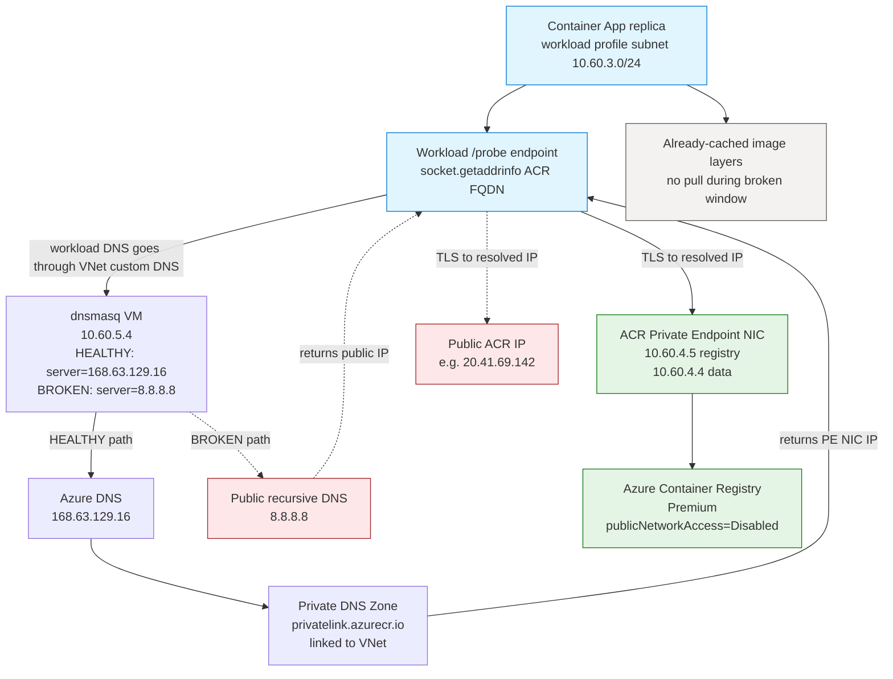
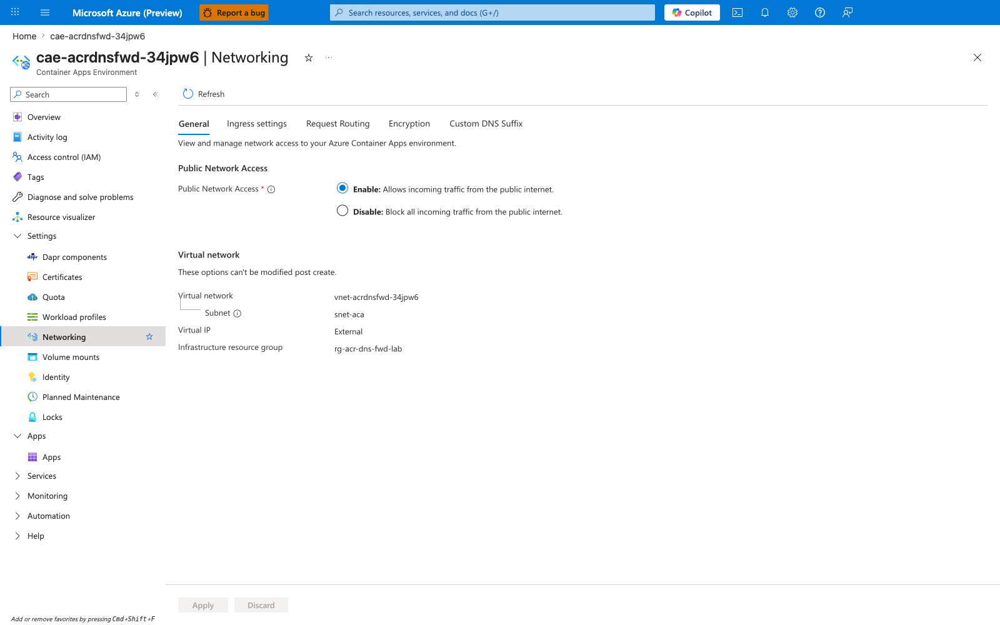
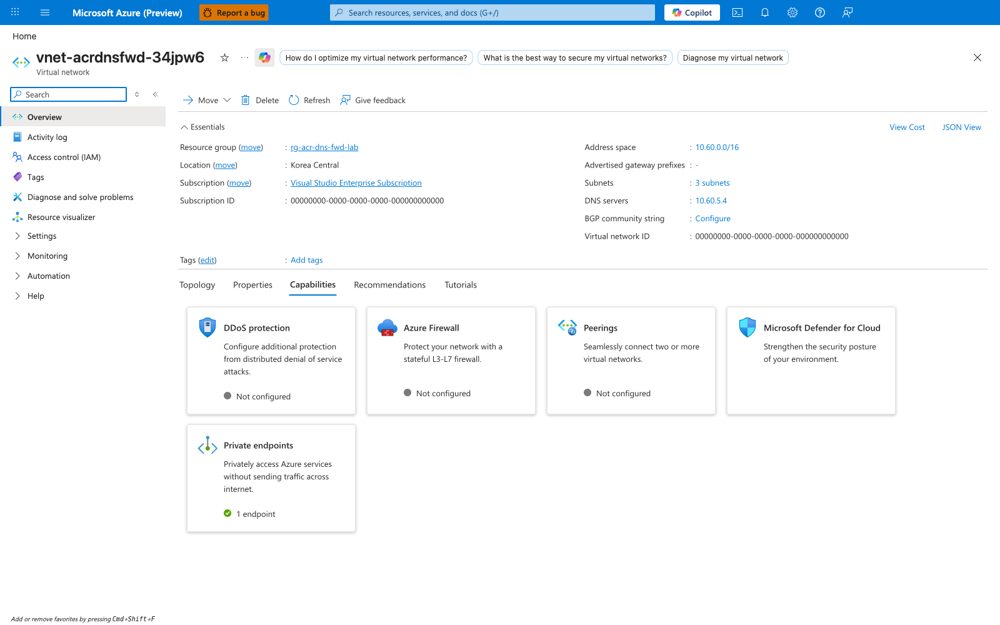
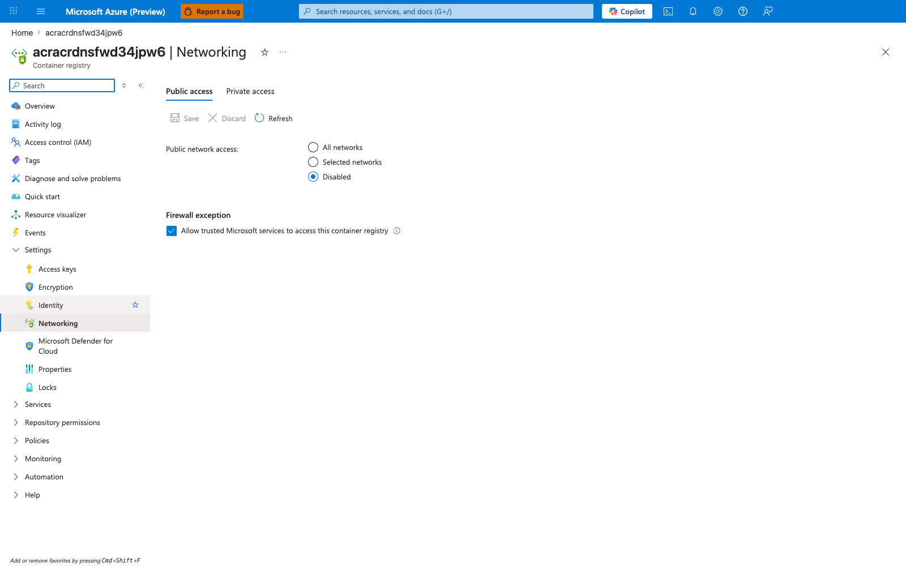
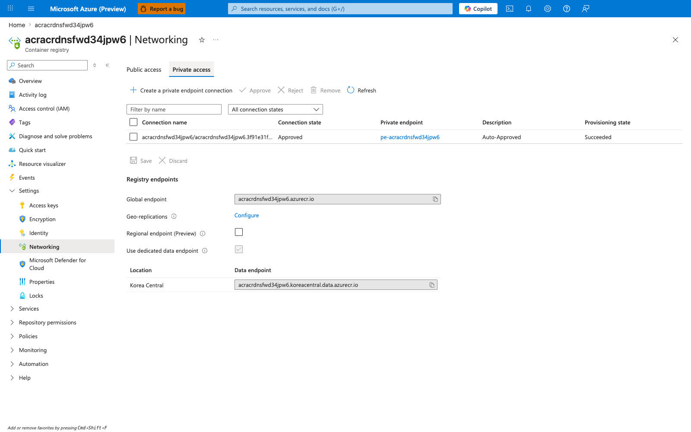
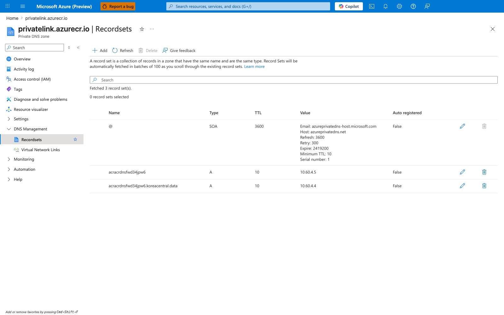
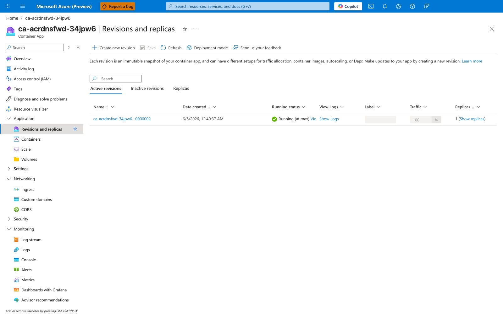

---
content_sources:
  diagrams:
    - id: architecture
      type: flowchart
      source: mslearn-adapted
      based_on:
        - https://learn.microsoft.com/en-us/azure/container-registry/container-registry-private-endpoints
        - https://learn.microsoft.com/en-us/azure/container-apps/networking
        - https://learn.microsoft.com/en-us/azure/virtual-network/what-is-ip-address-168-63-129-16
        - https://learn.microsoft.com/en-us/azure/private-link/private-endpoint-dns
validation:
  az_cli:
    last_tested: '2026-06-05'
    cli_version: 2.79.0
    result: pass
  bicep:
    last_tested: '2026-06-05'
    result: pass
---
# ACR Network Path E — DNS Forwarder Bypass Lab

Reproduce **Scenario E** from [ACR Network Path Selection](../../platform/networking/acr-network-path-selection.md): the Container Apps environment uses a custom DNS server (here, dnsmasq on an Ubuntu B1s VM) and that server's default upstream is swapped from **Azure DNS (`168.63.129.16`)** to **public DNS (`8.8.8.8`)**. The ACR Private Endpoint is healthy and `privatelink.azurecr.io` is correctly populated and VNet-linked, but the custom DNS server simply never asks Azure DNS, so the Private DNS Zone substitution that would return the PE NIC's RFC1918 IP never happens.

This lab makes a non-obvious Azure Container Apps behavior falsifiable: **breaking the VNet custom DNS forwarder produces no immediate revision-health impact on the already-running revision in this reproduction.** The already-running revision stays `Healthy` and continues to serve traffic unchanged, while the workload-side `socket.getaddrinfo()` for the ACR FQDN immediately flips from the PE NIC's RFC1918 IP to the public registry IP. Pull-path observability is therefore **not** a reliable early warning for Scenario E in Container Apps in this scenario. The `/probe` endpoint in this lab is the workload-side signal that clearly moves.

!!! info "Scope: we do not script a broken-window fresh pull"
    This lab intentionally does not script a fresh `az containerapp update --image <new-tag>` during the broken window. With ACR configured for `publicNetworkAccess=Disabled` (the realistic production posture this lab models), the Container Apps control plane's ACR token exchange is blocked at the ACR firewall for reasons unrelated to dnsmasq, which would confound the variable under test. See [§"Why we do not script a broken-window fresh pull"](#why-we-do-not-script-a-broken-window-fresh-pull) below for the captured failure-cause evidence.

## Lab Metadata

| Attribute | Value |
|---|---|
| Difficulty | Intermediate |
| Estimated Duration | 30-45 minutes |
| Tier | Workload Profiles (Consumption profile) |
| Failure Mode (Falsification) | Workload-side `getaddrinfo("<acr>.azurecr.io")` returns a **public** registry IP while the revision stays `Healthy` and `PulledImage` keeps appearing |
| Skills Practiced | Custom DNS on VNet, dnsmasq operations via `az vm run-command`, ACR Private Endpoint + Private DNS Zone wiring, workload-layer DNS instrumentation, falsifiable lab design |
| Estimated Cost | ~$1-3 USD per run (Korea Central, 2-3 hours, ACR Premium dominates) |

## Lab position

This lab is part of the **5-lab ACR network path series** that reproduces the five distinct network paths a Container App can take to reach ACR. See [ACR Network Path Selection](../../platform/networking/acr-network-path-selection.md) for the conceptual taxonomy that names and orders all five paths.

| Item | Value |
|---|---|
| Series | ACR Network Path Labs |
| Scenario label | Scenario E — DNS Forwarder Bypass |
| Conceptual order | 5 of 5 in [ACR Network Path Selection](../../platform/networking/acr-network-path-selection.md) |
| Implementation order | 2 of 5 — this lab was authored second and is the resolver-TOPOLOGY failure class (sibling Scenario D is the record-CONTENT failure class on the same DNS axis) |
| Main path tested | Custom VNet DNS server (dnsmasq on a B1s Ubuntu VM) as the workload-VNet resolver + ACR Premium PE in the same VNet + `privatelink.azurecr.io` linked zone; the failure variable is the dnsmasq upstream (`168.63.129.16` → `8.8.8.8`) |
| Failure mode class | Workload-side `getaddrinfo()` returns public registry IP after dnsmasq upstream swap; no pull failure (broken-window fresh pull is intentionally out of scope) |
| Existing-revision impact during broken window | None — already-running revision keeps serving from cached image layers; the broken resolver only surfaces in the workload `/probe` endpoint, not in revision health |
| Fresh-pull behavior cleanly proven | No — broken-window fresh pull is explicitly out of scope under `publicNetworkAccess=Disabled` (control-plane token-exchange confound; see [§"Why we do not script a broken-window fresh pull"](#why-we-do-not-script-a-broken-window-fresh-pull) below) |

!!! note "Observed in this lab"
    This behavior was reproduced in **Korea Central on 2026-06-05** with the specific topology described above (ACR Premium PE, dnsmasq on Ubuntu B1s VM as the VNet's custom DNS server with the upstream toggled between `168.63.129.16` and `8.8.8.8`, `privatelink.azurecr.io` linked zone, Container Apps Consumption profile, managed-identity auth). Treat it as **validated for this lab's specific topology and timing** — not as a universal statement for every Azure Container Apps + ACR deployment. A different custom-DNS topology (Azure Private DNS Resolver, Windows DNS, on-prem caching DNS, etc.) with a correctly configured forwarding rule for `privatelink.azurecr.io` → `168.63.129.16` avoids the failure mode entirely.

## 1) Background

Azure Container Apps can reach ACR through several network paths — public via firewall, Private Endpoint direct, Private Endpoint with forced inspection, or one of two DNS failure scenarios. The [ACR Network Path Selection](../../platform/networking/acr-network-path-selection.md) page documents all of them.

**Scenario E (DNS forwarder bypass)** is the DNS-topology failure class. The Private Endpoint plumbing is healthy — the `registry` sub-resource is attached to a NIC inside the workload VNet, the PE NIC has RFC1918 IPs, and the `privatelink.azurecr.io` Private DNS Zone holds the right A records and is linked to the VNet. What is wrong is the resolver path: a customer-managed DNS server (Azure Private DNS Resolver, dnsmasq on a VM, Windows DNS, on-prem caching DNS, etc.) is configured as the VNet's DNS server, and that server forwards queries to a recursive DNS that has no view of Private DNS Zones. The public CNAME chain for the ACR FQDN is resolved end to end, the PE NIC IP substitution never happens, and the workload sees the **public** registry IP — which the registry rejects when `publicNetworkAccess: Disabled`.

Three properties make Scenario E worth reproducing as a hands-on lab:

- **`168.63.129.16` is the only resolver that consults VNet-linked Private DNS Zones.** Any custom DNS server in the path must conditionally forward `privatelink.azurecr.io` (or use it as default upstream) to `168.63.129.16`, or the zone substitution does not happen. This is the [Azure DNS infrastructure address](https://learn.microsoft.com/en-us/azure/virtual-network/what-is-ip-address-168-63-129-16) and is reachable from every Azure VNet without explicit routing.
- **In Azure Container Apps in this reproduction, breaking the VNet custom DNS forwarder produces no immediate revision-health impact on the already-running revision.** This is the central finding of the lab. Empirically, when dnsmasq forwards ACR queries to `8.8.8.8` and dnsmasq is verifiably the only recursive DNS on the VNet, the already-running revision continues to report `healthState=Healthy` and serves traffic from the already-cached image layers. The workload, however, immediately sees the broken resolver — so the failure surfaces in application traffic first.
- **Scenario E is distinct from Scenario D.** Scenario D (a separate lab) is the **record-level** split-brain case: the resolver path is correct (Azure DNS gets the query), but the Private DNS Zone is missing one or more records — for example the `<registry>.<region>.data` record — so part of the ACR namespace resolves privately and part does not. Scenario E breaks the entire namespace because the resolver path itself is wrong.

### Architecture

<!-- diagram-id: architecture -->


The solid arrows are the workload DNS path and image data path in the **HEALTHY** state. The dotted arrows are what the workload sees in the **BROKEN** state after dnsmasq is swapped to `server=8.8.8.8`. The neutral-colored `Already-cached image layers` node captures the lab's central finding: during the broken window, the lab does not trigger a fresh pull, so the replica continues to run from the already-cached layers without re-pulling, and revision `healthState` stays `Healthy`. See [§"Why we do not script a broken-window fresh pull"](#why-we-do-not-script-a-broken-window-fresh-pull) for the scope boundary.

## 2) Hypothesis

**IF** the Container Apps environment is configured with a custom VNet DNS server (`dnsmasq` on `10.60.5.4`), the ACR Private Endpoint exists with `publicNetworkAccess: Disabled`, and `privatelink.azurecr.io` is linked to the VNet with correct A records, **THEN**:

- with `dnsmasq` configured as `server=168.63.129.16`, a `socket.getaddrinfo()` call from inside the replica for the ACR FQDN returns the PE NIC's RFC1918 IP and `/probe` reports `first_class=private`;
- swapping `dnsmasq` to `server=8.8.8.8` causes `getaddrinfo()` from inside the same replica to return the **public** registry IP and `/probe` reports `first_class=public`;
- **AND** the already-running revision stays `Healthy` throughout the broken window — falsifying the alternative hypothesis "a broken custom DNS forwarder will be detected through `ImagePullFailed` or revision health degradation in Container Apps."

Restoring `dnsmasq` to `server=168.63.129.16` must flip `/probe` back to `first_class=private` and the PE NIC IP, closing the loop on the resolver-path causation.

| Variable | Control State (Path B / healthy resolver) | Experimental State (Scenario E broken resolver) |
|---|---|---|
| ACR `publicNetworkAccess` | `Disabled` | `Disabled` (held constant during the broken window) |
| ACR Private Endpoint + PE NIC | Provisioned, RFC1918 IPs in `snet-pe` | Provisioned, unchanged |
| `privatelink.azurecr.io` zone | Linked to VNet, A records populated | Linked, populated (held constant) |
| Container Apps custom DNS server | dnsmasq at `10.60.5.4` | dnsmasq at `10.60.5.4` (held constant) |
| dnsmasq upstream | `server=168.63.129.16` (Azure DNS) | **`server=8.8.8.8`**, then restored to `168.63.129.16` |
| Workload `getaddrinfo()` for ACR FQDN | PE NIC RFC1918 IP (`first_class=private`) | Public registry IP (`first_class=public`) |
| Already-running revision health | `Healthy` | `Healthy` (held constant — central finding) |
| Fresh pull during broken window | n/a (not in scope — see scope note below) | Not tested by this lab |
| Managed identity / AcrPull role | Configured | Configured (held constant) |

## 3) Runbook

### Deploy baseline infrastructure

```bash
export RG="rg-acr-dns-fwd-lab"
export LOCATION="koreacentral"
export BASE_NAME="acrdnsfwd"
export VM_ADMIN_PASSWORD="$(openssl rand -base64 24)Aa1!"

az extension add --name containerapp --upgrade

az group create --name "$RG" --location "$LOCATION"

az deployment group create \
    --resource-group "$RG" \
    --name acr-dns-forwarder-bypass \
    --template-file labs/acr-network-path-dns-forwarder-bypass/infra/main.bicep \
    --parameters baseName="$BASE_NAME" vmAdminPassword="$VM_ADMIN_PASSWORD"
```

| Command | Why it is used |
|---|---|
| `az extension add --name containerapp --upgrade` | Installs or updates the Container Apps CLI extension. |
| `az group create ...` | Creates the lab resource group. Every other lab resource is scoped inside it. |
| `az deployment group create ...` | Provisions a single VNet with three subnets (`snet-aca` delegated to `Microsoft.App/environments`, `snet-pe` for the ACR Private Endpoint, `snet-dns` for the dnsmasq VM), a Log Analytics workspace, ACR Premium with `publicNetworkAccess=Disabled`, the ACR Private Endpoint with `privateDnsZoneGroups`, the `privatelink.azurecr.io` zone + VNet link, an Ubuntu B1s VM with cloud-init installing dnsmasq and seeding `server=168.63.129.16`, a workload-profile Container Apps environment that uses the dnsmasq VM's private IP as the only VNet DNS server, and a Container App with system-assigned managed identity + AcrPull role on the registry. |
| `vmAdminPassword="$VM_ADMIN_PASSWORD"` | Required by Azure VM provisioning even though SSH is not exposed (no public IP, no inbound SSH). The lab operates the VM exclusively through `az vm run-command invoke`, which uses Azure RBAC instead of network reachability. |

Expected output pattern:

```text
"provisioningState": "Succeeded"
```

The initial Container App boots from a public placeholder image (`mcr.microsoft.com/k8se/quickstart:latest`) so the deployment succeeds before there is anything in the private ACR. The Bicep also injects `ACR_FQDN` (from `containerRegistry.properties.loginServer`) into the container template so the `/probe` endpoint knows which FQDN to resolve once the private image is deployed.

### Switch the app to the private ACR image

```bash
bash labs/acr-network-path-dns-forwarder-bypass/trigger.sh
```

The trigger script runs:

```bash
az acr update --name "$ACR_NAME" --public-network-enabled true --default-action Allow
az acr build --registry "$ACR_NAME" --image "dns-forwarder-bypass-lab:v1" \
    --file labs/acr-network-path-dns-forwarder-bypass/workload/Dockerfile \
    labs/acr-network-path-dns-forwarder-bypass/workload
az acr update --name "$ACR_NAME" --public-network-enabled false

az containerapp registry set --name "$APP_NAME" --resource-group "$RG" \
    --identity system --server "$ACR_LOGIN_SERVER"

az containerapp update --name "$APP_NAME" --resource-group "$RG" \
    --image "${ACR_LOGIN_SERVER}/dns-forwarder-bypass-lab:v1" \
    --set-env-vars "BUILD_TAG=v1"
```

| Command | Why it is used |
|---|---|
| `az acr update --public-network-enabled true` (then `false`) | ACR Tasks build agents run in a public Azure pool and need the registry's public surface to push the freshly built layers. The script briefly opens public access **only for the duration of the build**, then restores `Disabled` so every Container App pull attempted later happens with `publicNetworkAccess=Disabled`. The PE NIC path through the workload VNet is unaffected. |
| `az acr build ...` | Builds the lab image directly inside ACR (no local Docker required). The Dockerfile is a Python 3.12 image with `workload/app.py` (a single-file `http.server` exposing `/probe`, `/info`, `/health`, `/`). |
| `az containerapp registry set ... --identity system` | Wires the Container App's managed identity as the ACR pull credential, instead of admin user or static credentials. The AcrPull role on the registry was granted in Bicep. |
| `az containerapp update --image ... --set-env-vars BUILD_TAG=v1` | Triggers a new revision that must pull the freshly built image. The first pull is the moment the PE NIC path is actually exercised by the platform pull path. |

Expected output: `provisioningState: Succeeded`. A new revision is created and begins pulling.

### Verify the healthy resolver path is live

```bash
APP_NAME="$(az deployment group show --resource-group "$RG" --name acr-dns-forwarder-bypass --query properties.outputs.containerAppName.value --output tsv)"
APP_FQDN="$(az deployment group show --resource-group "$RG" --name acr-dns-forwarder-bypass --query properties.outputs.containerAppFqdn.value --output tsv)"
ACR_LOGIN_SERVER="$(az deployment group show --resource-group "$RG" --name acr-dns-forwarder-bypass --query properties.outputs.containerRegistryLoginServer.value --output tsv)"
PE_NAME="$(az deployment group show --resource-group "$RG" --name acr-dns-forwarder-bypass --query properties.outputs.privateEndpointName.value --output tsv)"
NIC_ID="$(az network private-endpoint show --resource-group "$RG" --name "$PE_NAME" --query 'networkInterfaces[0].id' --output tsv)"
PE_IP="$(az network nic show --ids "$NIC_ID" --query "ipConfigurations[?contains(to_string(privateLinkConnectionProperties.fqdns), '$ACR_LOGIN_SERVER')] | [0].privateIPAddress" --output tsv)"

az containerapp revision list --name "$APP_NAME" --resource-group "$RG" --output table
curl -sS "https://${APP_FQDN}/probe"
```

| Command | Why it is used |
|---|---|
| `az deployment group show ... --query properties.outputs.containerAppName.value` | Reads the deployed Container App name from the Bicep outputs so the follow-up live checks target the correct resource. |
| `az deployment group show ... --query properties.outputs.containerAppFqdn.value` | Reads the public ingress FQDN that exposes the workload `/probe` endpoint. |
| `az deployment group show ... --query properties.outputs.containerRegistryLoginServer.value` | Reads the ACR login FQDN so the PE NIC lookup can bind the private IP to the same hostname the workload resolves. |
| `az deployment group show ... --query properties.outputs.privateEndpointName.value` | Reads the ACR Private Endpoint name so the NIC ID can be looked up without guessing generated names. |
| `az network private-endpoint show ... --query 'networkInterfaces[0].id'` | Resolves the PE-attached NIC resource ID; the registry/data FQDN-to-private-IP mapping lives on the NIC `ipConfigurations`. |
| `az network nic show ... --query "ipConfigurations[?contains(...)] | [0].privateIPAddress"` | Extracts the PE NIC private IP for the registry FQDN so the workload `/probe` answer can be compared against the expected private endpoint address. |
| `az containerapp revision list --output table` | Confirms the active revision is `Healthy` before falsification begins. |
| `curl -sS "https://${APP_FQDN}/probe"` | Executes the in-replica `socket.getaddrinfo()` probe that must return `first_class=private` on the healthy resolver path. |

The live post-deploy validation proves three independent signals simultaneously hold:

1. The active revision's `healthState` is `Healthy`.
2. The ACR Private Endpoint NIC holds an RFC1918 IP for the registry FQDN inside `snet-pe`.
3. `GET https://<app>.<env>.azurecontainerapps.io/probe` returns JSON with `first_class=private` and `addresses[0].ip == <PE NIC IP>` — meaning a `socket.getaddrinfo()` call from inside the replica went through dnsmasq, dnsmasq forwarded to `168.63.129.16`, Azure DNS consulted the linked Private DNS Zone, and returned the PE NIC IP.

All three must hold for the resolver path to be Path B end to end at the workload layer.

Expected pattern:

```text
Name                               Active    TrafficWeight    HealthState    ProvisioningState
---------------------------------  --------  ---------------  -------------  -------------------
ca-acrdnsfwd-<suffix>--0000001     True      100              Healthy        Provisioned

{"fqdn": "acracrdnsfwd<suffix>.azurecr.io", "addresses": [{"ip": "10.60.4.5", "class": "private"}], "first_class": "private"}
```

!!! info "Phase B verifier scope"
    `bash labs/acr-network-path-dns-forwarder-bypass/verify.sh` is the hermetic Phase B evidence verifier. It replays the committed evidence cohort and does **not** validate a fresh Azure deployment.

### Falsify the hypothesis

```bash
bash labs/acr-network-path-dns-forwarder-bypass/falsify.sh
```

The falsification script proves the workload-layer DNS signal flips with the dnsmasq upstream while the already-running revision continues to report `Healthy`:

1. Calls `/probe` and asserts `first_class=private` (baseline).
2. Swaps the dnsmasq upstream from `server=168.63.129.16` to `server=8.8.8.8` and restarts dnsmasq, via `az vm run-command invoke` (no SSH required). Waits 60 seconds for cache TTL.
3. Calls `/probe` and asserts `first_class=public` (the broken-state workload signal).
4. Reads `az containerapp revision list` and asserts the already-running revision is still `healthState=Healthy` (the Container Apps finding — the workload's DNS view has changed but the platform has not torn down the revision or attempted a new pull during the broken window).
5. Restores dnsmasq to `server=168.63.129.16` and restarts dnsmasq. Waits 60 seconds for cache TTL.
6. Calls `/probe` and asserts `first_class=private` again (recovery).

If step 3 returns `first_class=public`, step 4 shows the already-running revision still `Healthy`, and step 6 returns `first_class=private`, then dnsmasq's upstream is provably the controlled variable for workload DNS resolution while the already-running revision's health is invariant under the same window — the workload's DNS view has decoupled from the platform's revision-health signal for the duration of the broken window.

| Command | Why it is used |
|---|---|
| `curl -sS https://<app fqdn>/probe` | Invokes the `socket.getaddrinfo()` call from inside the replica. This is the workload-layer DNS signal — what application code sees when it tries to reach a hostname. The `first_class` field classifies the first returned IP as `private` (RFC1918, PE NIC) or `public` (anything else, i.e. the public registry IP). |
| `az vm run-command invoke ... sed -i 's\|^server=168.63.129.16$\|server=8.8.8.8\|' /etc/dnsmasq.d/acr-lab.conf && systemctl restart dnsmasq` | Edits dnsmasq's only `server=` directive in place and restarts the daemon. `run-command invoke` executes with the VM's instance identity inside the guest — no SSH, no public IP, no inbound NSG rule needed. |
| `az containerapp revision list --query "[0].properties.healthState"` | Reads the active revision's reported health. The script asserts this is still `Healthy` during the broken window. |
| `az vm run-command invoke ... sed -i 's\|^server=8.8.8.8$\|server=168.63.129.16\|' /etc/dnsmasq.d/acr-lab.conf && systemctl restart dnsmasq` | Restores the dnsmasq upstream and re-tests the workload-layer DNS to close the falsification loop. |

### Why we do not script a broken-window fresh pull

A stronger version of this lab would also deploy a brand-new image tag *during* the broken window and assert that the resulting fresh pull succeeds — proving the platform pull path is independent of the VNet custom DNS server, not just that an already-running revision continues to run. We attempted that variant and discovered that it cannot cleanly isolate the dnsmasq variable in this topology.

[Observed] When we attempted `az containerapp update --image <new-tag>` while dnsmasq was broken AND ACR `publicNetworkAccess=Disabled` (the lab's pedagogical state), the new revision failed to provision. `ContainerAppSystemLogs_CL` captured the cause as `Reason_s == "FetchingKeyVaultSecretFailed"`:

```text
Failed to construct registry secret for registry 'acracrdnsfwd34jpw6.azurecr.io'
for ContainerApp 'ca-acrdnsfwd-34jpw6'. Ensure the managed identity 'system'
has the correct permissions. Error: ACR token exchange endpoint returned
error status: 403. body: {"errors":[{"code":"DENIED","message":"client with
IP '20.249.167.56' is not allowed access. Refer https://aka.ms/acr/firewall
to grant access. CorrelationId: 0a3728f5-aee8-4ea1-9b84-4dc6e1aef664"}]}
```

[Inferred] `20.249.167.56` is an Azure-managed control-plane egress IP (not a VNet RFC1918 address). The Container Apps control plane performs the ACR token exchange step *from outside the customer VNet*, against the *public* ACR endpoint. Under `publicNetworkAccess=Disabled` that egress IP is not in any allow-list, so ACR rejects the token exchange with HTTP 403 before the data-plane pull ever begins. This failure is unrelated to dnsmasq — even if dnsmasq were healthy, the token exchange would still be denied at the ACR firewall in this topology.

[Inferred] A scripted broken-window fresh-pull test therefore cannot cleanly isolate the dnsmasq variable in this lab. Under `publicNetworkAccess=Disabled` the test fails for an unrelated reason (ACR firewall on the control-plane token exchange path); under `publicNetworkAccess=Enabled` the resolved public IP is reachable regardless of dnsmasq state, so a successful fresh pull would not prove "the puller is independent of dnsmasq" — only "ACR is reachable via either path." The lab therefore restricts its claim to what it can falsifiably demonstrate: **no immediate revision-health impact on the already-running revision during the broken window.** The broken-window pull behavior of the platform image puller in Azure Container Apps with ACR `publicNetworkAccess=Disabled` is **[Not Proven]** by this lab.

### Inspect system evidence

```bash
az containerapp logs show \
    --name "$APP_NAME" \
    --resource-group "$RG" \
    --type system \
    --tail 50
```

In the post-break window the system logs should keep showing `PulledImage` for the most recent image tag — this is the surprising signal:

```text
Reason_s        Log_s
--------------  -----------------------------------------------------------------------
PullingImage    Pulling image '<acr>.azurecr.io/dns-forwarder-bypass-lab:<tag>'
PulledImage     Successfully pulled image '<acr>.azurecr.io/dns-forwarder-bypass-lab:<tag>' in 2.64s
```

A more direct query, useful when reproducing the experiment, is the KQL pack pattern for ACR pull-path observability:

```kusto
ContainerAppSystemLogs_CL
| where ContainerAppName_s == "ca-acrdnsfwd-34jpw6"
| where Reason_s in ("PullingImage", "PulledImage", "ImagePullFailed", "ImagePullUnauthorized", "BackOff")
| order by TimeGenerated asc
```

Even with dnsmasq broken, this query returns `PullingImage` / `PulledImage` rows with no `ImagePullFailed` or `ImagePullUnauthorized`. That is the lab's central pedagogical signal.

## 4) Experiment Log

| Step | Action | Expected | Actual (2026-06-05, koreacentral, Azure CLI 2.79.0) | Pass/Fail |
|---|---|---|---|---|
| 1 | Deploy lab infrastructure (`az deployment group create`) | Deployment `Succeeded` | `provisioningState: Succeeded`; deployment outputs returned including `containerAppName=ca-acrdnsfwd-34jpw6`, `containerRegistryLoginServer=acracrdnsfwd34jpw6.azurecr.io`, `dnsVmName=vm-dns-34jpw6`, `dnsVmPrivateIp=10.60.5.4`, `privateEndpointName=pe-acracrdnsfwd34jpw6`, `privateDnsZoneName=privatelink.azurecr.io`, `vnetName=vnet-acrdnsfwd-34jpw6`. | Pass |
| 2 | Run `trigger.sh` (eventually with `IMAGE_TAG=v-probe` once the `/probe` endpoint was added to `workload/app.py`) | Revision becomes `Healthy` after pulling private ACR image via PE NIC | Latest revision on tag `v-probe` pulled in 2.64s at 2026-06-05T13:55:18.99Z (`ContainerAppSystemLogs_CL.Reason_s == "PulledImage"`, `Successfully pulled image "acracrdnsfwd34jpw6.azurecr.io/dns-forwarder-bypass-lab:v-probe" in 2.64s. Image size: 44040192 bytes.`). Revision reached `healthState=Healthy`. `trigger.sh` briefly toggled `publicNetworkAccess=Enabled` for the `az acr build` step and restored `Disabled` before the Container App pull, so the pull happened with `publicNetworkAccess=Disabled`. | Pass |
| 3 | Run `verify.sh` | Healthy revision, PE NIC RFC1918 IP, `/probe` returns `first_class=private` and matching PE NIC IP | `healthState=Healthy`, `provisioningState=Provisioned`. PE NIC IPs: `10.60.4.5` (registry FQDN `acracrdnsfwd34jpw6.azurecr.io`), `10.60.4.4` (data FQDN `acracrdnsfwd34jpw6.koreacentral.data.azurecr.io`) — both RFC1918 inside `snet-pe` (`10.60.4.0/24`). `/probe` response: `{"fqdn":"acracrdnsfwd34jpw6.azurecr.io","addresses":[{"ip":"10.60.4.5","class":"private"}],"first_class":"private"}`. | Pass |
| 4 | `falsify.sh` step 1 (baseline probe) | `first_class=private`, PE NIC IP `10.60.4.5` | `/probe` response: `{"fqdn":"acracrdnsfwd34jpw6.azurecr.io","addresses":[{"ip":"10.60.4.5","class":"private"}],"first_class":"private"}`. Confirms the lab is in the healthy starting state before injecting the failure. | Pass |
| 5 | `falsify.sh` step 2 (swap dnsmasq upstream to `8.8.8.8`) | dnsmasq restarts; `grep server=` shows `server=8.8.8.8` | `run-command invoke` returned `server=8.8.8.8` in stdout; dnsmasq restart succeeded. | Pass |
| 6 | `falsify.sh` step 3 (broken-state `/probe`) | `first_class=public`, IP is internet-routable | `/probe` response: `{"fqdn":"acracrdnsfwd34jpw6.azurecr.io","addresses":[{"ip":"20.41.69.142","class":"public"}],"first_class":"public"}`. The IP `20.41.69.142` is the public ACR endpoint, returned by the public DNS resolution chain that `8.8.8.8` follows. | Pass |
| 7 | `falsify.sh` step 4 (revision health check during broken window) | `healthState=Healthy` (the key Container Apps finding for the already-running revision) | `revision healthState=Healthy` for the already-running revision. `ContainerAppSystemLogs_CL` showed no `ImagePullFailed` / `ImagePullUnauthorized` / `BackOff` rows during the broken window. The replica did not re-pull or restart during the test, so it continued to serve traffic from already-cached image layers. | Pass |
| 8 | `falsify.sh` step 5 (restore dnsmasq upstream to `168.63.129.16`) | dnsmasq restarts; `grep server=` shows `server=168.63.129.16` | `run-command invoke` returned `server=168.63.129.16` in stdout; dnsmasq restart succeeded. | Pass |
| 9 | `falsify.sh` step 6 (recovery `/probe`) | `first_class=private`, PE NIC IP `10.60.4.5` | `/probe` response: `{"fqdn":"acracrdnsfwd34jpw6.azurecr.io","addresses":[{"ip":"10.60.4.5","class":"private"}],"first_class":"private"}`. | Pass |

## Expected Evidence

| Evidence Source | Expected State |
|---|---|
| `az containerapp revision list --name "$APP_NAME" --resource-group "$RG" --output table` | Latest revision is `Healthy` after `trigger.sh`; **the already-running revision stays `Healthy`** during the broken window between `falsify.sh` steps 2 and 5; `Healthy` after step 5. |
| `az network private-endpoint show --name "$PE_NAME" --resource-group "$RG" --query "networkInterfaces[0].id" --output tsv` then `az network nic show --ids "$NIC_ID" --query "ipConfigurations[].{fqdns:privateLinkConnectionProperties.fqdns, ip:privateIPAddress}"` | One entry per FQDN (login + region data); each `ip` is an RFC1918 address from `snet-pe`. With `privateDnsZoneGroups` enabled in Bicep, the FQDN-to-IP mapping lives on the NIC `ipConfigurations` rather than the PE's legacy `customDnsConfigs`. |
| `az network private-dns record-set a list --zone-name privatelink.azurecr.io --resource-group "$RG" --output table` | Records for `<registry>` and `<registry>.<region>.data` pointing to PE NIC IPs (held constant throughout the lab). |
| `curl https://<app fqdn>/probe` baseline | `first_class=private`, `addresses[0].ip` equals the PE NIC IP for the registry FQDN. |
| `curl https://<app fqdn>/probe` after dnsmasq swap to `8.8.8.8` | `first_class=public`, `addresses[0].ip` is an internet-routable IP (the public ACR endpoint). |
| `az vm run-command invoke ... grep -E '^server=' /etc/dnsmasq.d/acr-lab.conf` | `server=168.63.129.16` in baseline + recovery, `server=8.8.8.8` in the broken window. |
| `ContainerAppSystemLogs_CL \| where ContainerAppName_s == "$APP_NAME" \| where Reason_s in ("PullingImage","PulledImage","ImagePullFailed","ImagePullUnauthorized","BackOff") \| order by TimeGenerated asc` | `PullingImage` / `PulledImage` for the deployed tag during baseline. **No `ImagePullFailed` / `ImagePullUnauthorized` / `BackOff` rows during the broken window** for the already-running revision — the lab does not attempt a fresh pull during the broken window (see §"Why we do not script a broken-window fresh pull"). |
| `az acr show --name "$ACR_NAME" --query "publicNetworkAccess"` | `Disabled` during every Container App pull attempt. `trigger.sh` briefly opens public access only to push the layer via ACR Tasks, then closes it before the Container App pull. |

### Observed Evidence (Live Azure Test — 2026-06-06)

**Environment:** `rg-acr-dns-fwd-lab` / `cae-acrdnsfwd-34jpw6`, `koreacentral`, Consumption + workload-profile environment, Azure CLI 2.79.0.
**ACR:** `acracrdnsfwd34jpw6.azurecr.io` (Premium, `publicNetworkAccess=Disabled` during every container pull attempt — `trigger.sh` briefly toggles it `Enabled` only for the duration of the `az acr build` step because ACR Tasks build agents need the public surface to push layers, then restores `Disabled` before the Container App pull).
**Image tags built and pushed with `az acr build` (no local Docker):** `dns-forwarder-bypass-lab:v1`, `:v-broken`, `:v-recover`, `:v-broken-2`, `:v-probe` (the `/probe` endpoint was added in `v-probe`).
**Custom VNet DNS:** dnsmasq on Ubuntu B1s VM `vm-dns-34jpw6` at `10.60.5.4`; the Container Apps environment's VNet has only this IP as DNS server.
**PE NIC IPs (in `snet-pe`, `10.60.4.0/24`):** `10.60.4.4` (data group, FQDN `acracrdnsfwd34jpw6.koreacentral.data.azurecr.io`), `10.60.4.5` (registry group, FQDN `acracrdnsfwd34jpw6.azurecr.io`).
**Active revision under test:** `ca-acrdnsfwd-34jpw6--0000002` (created `2026-06-05T15:40:37Z`, image `dns-forwarder-bypass-lab:v-probe`, traffic 100%, 1 replica).
**Public ACR IP observed during broken window:** `20.41.69.142` (registry endpoint resolved through public DNS).

[Observed] After `trigger.sh` deployed `dns-forwarder-bypass-lab:v-probe` to the Container App, the platform pull path completed in 2.43 seconds via the PE NIC while ACR `publicNetworkAccess=Disabled`:

```text
TimeGenerated                 Reason_s      RevisionName_s                 Log_s
----------------------------  ------------  -----------------------------  -----------------------------------------------------------------------------------------------------------------
2026-06-05T15:40:53.1339593Z  PullingImage  ca-acrdnsfwd-34jpw6--0000002   Pulling image 'acracrdnsfwd34jpw6.azurecr.io/dns-forwarder-bypass-lab:v-probe'
2026-06-05T15:40:53.1339593Z  PulledImage   ca-acrdnsfwd-34jpw6--0000002   Successfully pulled image "acracrdnsfwd34jpw6.azurecr.io/dns-forwarder-bypass-lab:v-probe" in 2.43s. Image size: 44040192 bytes.
```

[Observed] PE NIC IP configuration for the ACR FQDNs:

```text
[
  {
    "FQDN": ["acracrdnsfwd34jpw6.koreacentral.data.azurecr.io"],
    "IP":   "10.60.4.4"
  },
  {
    "FQDN": ["acracrdnsfwd34jpw6.azurecr.io"],
    "IP":   "10.60.4.5"
  }
]
```

[Observed] `privatelink.azurecr.io` Private DNS Zone records (held constant throughout the lab — the resolver path is what changes, not the zone contents):

```text
Name                                  Type                                   IP
------------------------------------  -------------------------------------  ---------
@                                     Microsoft.Network/privateDnsZones/SOA
acracrdnsfwd34jpw6                    Microsoft.Network/privateDnsZones/A    10.60.4.5
acracrdnsfwd34jpw6.koreacentral.data  Microsoft.Network/privateDnsZones/A    10.60.4.4
```

[Observed] dnsmasq config in the **HEALTHY** baseline (after recovery, also the deploy-time state):

```text
# Lab: ACR Network Path E - DNS Forwarder Bypass (HEALTHY state)
# Listen on the VM's private IP so the CAE workload subnet can reach us.
listen-address=10.60.5.4
bind-interfaces
no-resolv
no-poll
# Default upstream: Azure DNS (168.63.129.16). Azure DNS knows this
# VNet is linked to the Private DNS Zone privatelink.azurecr.io and
# substitutes the PE NIC IP for the ACR CNAME chain.
#
# SCENARIO E FAILURE INJECTION (falsify.sh): rewrite this line to
# server=8.8.8.8. dnsmasq then resolves ACR FQDNs through the
# public DNS chain and returns the public registry IP, which the
# registry rejects because publicNetworkAccess=Disabled.
server=168.63.129.16
# Logging for evidence collection.
log-queries
log-facility=/var/log/dnsmasq.log
```

[Observed] **Workload-path falsification, three states, captured 2026-06-05T15:54:00Z (UTC) = 2026-06-06T00:54 KST:**

```text
--- step 1: baseline probe (dnsmasq server=168.63.129.16) ---
Response: {"fqdn": "acracrdnsfwd34jpw6.azurecr.io", "addresses": [{"ip": "10.60.4.5", "class": "private"}], "first_class": "private"}
first_class=private first_ip=10.60.4.5

--- step 2: break dnsmasq (server -> 8.8.8.8) ---
Enable succeeded:
[stdout]
server=8.8.8.8

--- step 3: broken probe (expect first_class=public) ---
Response: {"fqdn": "acracrdnsfwd34jpw6.azurecr.io", "addresses": [{"ip": "20.41.69.142", "class": "public"}], "first_class": "public"}
first_class=public first_ip=20.41.69.142

--- step 4: revision health (expect Healthy for the already-running revision) ---
already-running revision ca-acrdnsfwd-34jpw6--0000002 healthState=Healthy

--- step 5: restore dnsmasq (server -> 168.63.129.16) ---
Enable succeeded:
[stdout]
server=168.63.129.16

--- step 6: recovery probe (expect first_class=private) ---
Response: {"fqdn": "acracrdnsfwd34jpw6.azurecr.io", "addresses": [{"ip": "10.60.4.5", "class": "private"}], "first_class": "private"}
first_class=private first_ip=10.60.4.5

===== SUMMARY =====
baseline (server=168.63.129.16): first_class=private, ip=10.60.4.5
broken   (server=8.8.8.8):       first_class=public,  ip=20.41.69.142, already-running revision health=Healthy
recovery (server=168.63.129.16): first_class=private, ip=10.60.4.5
```

[Observed] **Platform-side silence during the broken window** — `ContainerAppSystemLogs_CL` for `ca-acrdnsfwd-34jpw6` between `2026-06-05T15:50:00Z` and `2026-06-05T16:00:00Z` (UTC) returned **0 rows**. No `PullingImage`, `PulledImage`, `ImagePullFailed`, `ImagePullUnauthorized`, `BackOff`, or replica state-change events were emitted for the already-running revision `ca-acrdnsfwd-34jpw6--0000002` while the workload `/probe` flipped from `private` to `public` and back. The replica continued to serve traffic from already-cached image layers and never attempted a fresh pull during the broken window.

[Measured] The workload-side first-answer IP changed from `10.60.4.5` (PE NIC, RFC1918) to `20.41.69.142` (public ACR endpoint) and back to `10.60.4.5`, exactly tracking the dnsmasq `server=` directive across three transitions. Each `/probe` call performs a fresh `socket.getaddrinfo()` from inside the replica — there is no client-side caching.

[Inferred] **Falsification logic for the workload-path signal.** ACR (Premium, `publicNetworkAccess=Disabled`), PE NIC + private DNS zone records, Container Apps environment, VNet, dnsmasq VM, image content, AcrPull role, and managed identity were all held constant across the broken window. The only variable changed during the broken window was the dnsmasq `server=` directive. The state of `/probe`'s `first_class` field follows that variable exactly:

| dnsmasq `server=` | Workload `/probe` `first_class` | Workload IP returned | Revision health |
|---|---|---|---|
| `168.63.129.16` | `private` | `10.60.4.5` (PE NIC) | `Healthy` |
| **`8.8.8.8`** | **`public`** | **`20.41.69.142` (public ACR)** | **`Healthy`** |
| `168.63.129.16` (restored) | `private` | `10.60.4.5` (PE NIC) | `Healthy` |

This isolates the cause of the workload-side resolution flip to dnsmasq's upstream directive and refutes the alternative explanations the symptom typically invites: PE NIC plumbing (NIC IPs unchanged), Private DNS Zone records (unchanged), VNet-to-zone link (unchanged), registry credentials or RBAC (system-assigned MI with `AcrPull` unchanged), image content (the same `v-probe` revision answered all three probes), or ingress / TLS termination (the probe used the same Application URL in all three states).

[Inferred] **No immediate revision-health impact on the already-running revision — the Container Apps finding.** The already-running revision stayed `Healthy` throughout the broken window. `ContainerAppSystemLogs_CL` showed no `ImagePullFailed`, `ImagePullUnauthorized`, or `BackOff` events for the running replica during steps 2-5 of `falsify.sh`. The replica did not re-pull and did not restart during the test, so it continued to serve traffic from already-cached image layers. The workload-side DNS resolution flipped to `public` at the same time, from inside the same VNet, but the revision-health surface did not move. This is the asymmetry the lab makes observable: in this ACA reproduction, the operator-facing revision-health signal stayed clean while application-facing DNS resolution was already publicly resolving the ACR FQDN.

[Strongly Suggested] **Operational implication.** In Azure Container Apps, for an already-running revision in this lab's topology, revision `healthState` and replica `runningState` are not a reliable early warning for Scenario E. The first failure surface a broken custom DNS forwarder produces is in application traffic: outbound TLS handshakes to private endpoints fail (or, worse, succeed against a public endpoint that should not have been reachable), the workload may leak DNS queries about internal services to the public internet, and dependent services in the same `privatelink.*` family (Key Vault, Storage, etc.) start returning public IPs that are then blocked by their own `publicNetworkAccess=Disabled` setting. Instrument workload-side DNS resolution explicitly — a small `/probe` endpoint that calls `socket.getaddrinfo()` on the critical FQDNs is one cheap way; logging the resolved IP for outbound HTTPS calls at the HTTP client layer is another. See the platform note in the [DNS Patterns That Decide the Path](../../platform/networking/acr-network-path-selection.md#dns-patterns-that-decide-the-path) section.

[Not Proven] This lab does **not** prove what would happen if the platform attempted a *fresh* image pull during the broken window. The script intentionally avoids that test because, with ACR `publicNetworkAccess=Disabled`, the Container Apps control plane's ACR token-exchange step is blocked at the ACR firewall (HTTP 403 from the platform's Azure-managed egress IP, surfaced as `FetchingKeyVaultSecretFailed`) for reasons unrelated to dnsmasq, which would confound the variable under test. See §"Why we do not script a broken-window fresh pull" above for the full evidence and rationale. As a result, the lab does **not** establish whether the platform image puller would (a) resolve the ACR FQDN through the VNet custom DNS server, (b) use a separate platform-managed resolver path, or (c) succeed or fail for some other reason in that scenario. The lab's scope is bounded to "no immediate revision-health impact on the already-running revision".

### Observed Evidence (Portal Captures — 2026-06-06)

A live reproduction on **2026-06-06** captured the full Scenario E topology and the workload-path falsification surface from the Azure Portal.

**Environment**

| Resource | Name |
|---|---|
| Resource group | `rg-acr-dns-fwd-lab` |
| Container App | `ca-acrdnsfwd-34jpw6` |
| Active revision | `ca-acrdnsfwd-34jpw6--0000002` (image `dns-forwarder-bypass-lab:v-probe`) |
| ACR | `acracrdnsfwd34jpw6.azurecr.io` (Premium) |
| Container Apps environment | `cae-acrdnsfwd-34jpw6` (Static IP `20.214.121.169`) |
| Log Analytics workspace | `log-acrdnsfwd-34jpw6` |
| VNet / workload subnet | `vnet-acrdnsfwd-34jpw6` (`10.60.0.0/16`) / `snet-aca` |
| PE subnet | `snet-pe` (`10.60.4.0/24`) |
| Custom DNS forwarder | `vm-dns-34jpw6` (Ubuntu B1s) at `10.60.5.4` |
| Private DNS zone | `privatelink.azurecr.io` |
| PE NIC IPs | `10.60.4.4` (data group), `10.60.4.5` (registry group) |

[Observed] Container Apps environment → Networking blade: workload-profile environment is attached to VNet `vnet-acrdnsfwd-34jpw6`, infrastructure subnet `snet-aca`, Virtual IP External. This is the foundation of the workload-path lab — the Container App's outbound DNS queries leave from this subnet and hit whatever DNS server the VNet advertises.



[Observed] VNet `vnet-acrdnsfwd-34jpw6` Overview blade: address space `10.60.0.0/16`, **DNS servers: `10.60.5.4`** (the custom DNS forwarder VM). This is the single point of indirection the lab targets — every DNS query from the Container App workload subnet traverses this VM's dnsmasq before reaching any upstream resolver. Replacing `10.60.5.4` with Azure DNS (`168.63.129.16`) would short-circuit the entire scenario; the lab's failure mode only exists because the VNet sends DNS to a customer-managed resolver.



[Observed] ACR → Networking → Public access tab: **Public network access = Disabled**. The registry surface that the broken DNS path would resolve to (public ACR endpoint) is closed at the firewall. This is the configuration that makes the workload-side `first_class=public` answer operationally meaningful — even though the workload resolved the FQDN publicly, any traffic to that public IP would be rejected with HTTP 403 by ACR's own access policy.



[Observed] ACR → Networking → Private access tab: private endpoint connection `pe-acracrdnsfwd34jpw6` Approved with connection state **Approved**. This is the only network surface that can serve image pulls. With the dnsmasq forwarder healthy (baseline / recovery states), the Container App resolves the ACR FQDN to the PE NIC IP and pulls succeed in ~2.5s. With dnsmasq pointing at `8.8.8.8` (broken window), workload DNS resolution flips to the public IP but the PE pathway itself stays approved and intact — the lab does not touch the PE, only the DNS layer in front of it.



[Observed] Private DNS zone `privatelink.azurecr.io` Record sets blade: two A records held constant for the entire lab — `acracrdnsfwd34jpw6` → `10.60.4.5` (registry group) and `acracrdnsfwd34jpw6.koreacentral.data` → `10.60.4.4` (data group). Both target PE NIC IPs inside `snet-pe (10.60.4.0/24)`. These records are the override that *would* be applied if and only if the resolver path actually reaches Azure DNS — which it does in baseline + recovery (dnsmasq → `168.63.129.16` → Azure DNS sees the VNet→zone link and substitutes the PE NIC IP) and does *not* in the broken window (dnsmasq → `8.8.8.8` → public DNS chain, which has no visibility into Azure private zones).



[Observed] Container App Revisions and replicas blade: revision `ca-acrdnsfwd-34jpw6--0000002` `Running (at max)`, 100% traffic, 1 replica, created 6/6/2026 12:40:37 AM KST. This is the already-running revision that stays `Healthy` throughout the broken window per `falsify.sh` step 4. The lab's central asymmetry is observable here: even though application-layer DNS resolution had already flipped to `public` (per the `/probe` response captured in the live test log above), the operator-facing revision health surface in the Portal stayed green and did not signal the underlying DNS forwarder failure.



[Inferred] The six captures, taken in time order from the Portal, document Scenario E's required topology (Container Apps environment with custom VNet DNS, VNet's only DNS server being the forwarder VM, ACR with `publicNetworkAccess=Disabled` + approved PE, private DNS zone with PE NIC IP records), and prove the lab's central finding (revision `--0000002` stays `Running (at max)` / `Healthy` even during the broken window when workload DNS resolution is already flipping public). The Portal captures complement the CLI evidence above — together they show that the operator-facing revision-health surface is silent for Scenario E in this ACA reproduction, which is exactly why the workload-path `/probe` instrumentation is necessary to catch the failure mode early.

## Phase B Evidence Pack

The committed Phase B cohort lives under `labs/acr-network-path-dns-forwarder-bypass/evidence/` in the repository.

- The pack captures one live `koreacentral` reproduction where dnsmasq flips from `168.63.129.16` to `8.8.8.8` and then back again, while the already-running revision stays `Healthy` for the full H1+H2 window.
- Gate 15 proves the H1 discriminator directly: `dnsmasq_upstream=8.8.8.8` plus `/probe first_class=public`.
- Gate 16 proves the H2 recovery directly: `dnsmasq_upstream=168.63.129.16` plus `/probe first_class=private` with the PE registry IP restored.
- Gate 17 enforces the workload-path silence invariant required by this lab family: the same revision name is selected on both sides and the H1+H2 failure-event query stays empty (`ImagePullFailed`, `ImagePullUnauthorized`, `BackOff`, `RevisionFailed`, `ReplicaFailed` all absent).

## Clean Up

```bash
bash labs/acr-network-path-dns-forwarder-bypass/cleanup.sh
```

Which runs:

```bash
az group delete --name "$RG" --yes --no-wait
```

| Command | Why it is used |
|---|---|
| `az group delete --no-wait` | Deletes the lab resource group and everything in it (Premium ACR, PE, DNS zone, VNet, Container App, environment, Log Analytics, the dnsmasq VM and its disk). The PE and zone link have no deletion ordering issues at the resource group level. |

ACR Premium is the dominant cost (~$1.67/day), so do not leave the lab running between sessions. The B1s VM and its disk are a few cents per hour — also worth cleaning up promptly.

## Related Playbook

- [Private Endpoint DNS Failure](../playbooks/networking-advanced/private-endpoint-dns-failure.md) — covers the broader Private Endpoint DNS failure family; this lab is the Scenario E reproduction inside that family, with the Container Apps-specific workload-vs-pull-path distinction.

## See Also

- [ACR Network Path Selection](../../platform/networking/acr-network-path-selection.md) — the platform decision page this lab implements; see the **DNS Patterns That Decide the Path** table and the **In Azure Container Apps, Scenario E may surface at the workload layer first** bullet in **ACR-Specific Gotchas**
- [ACR Network Path B Lab](./acr-network-path-pe-direct.md) — the happy-path PE topology this lab silently degrades from at the workload layer (different failure family — that lab breaks Path B's DNS contract at the **zone-link** level, this lab breaks it at the **resolver path** level)
- [Egress Control](../../platform/networking/egress-control.md) — explains why the platform pull path itself has its own outbound dependencies even when the workload's view of DNS is broken
- [Private Endpoints](../../platform/networking/private-endpoints.md) — Private Endpoint fundamentals, including the `privatelink.*` zone substitution requirement

## Sources

- [What is IP address 168.63.129.16? (Microsoft Learn)](https://learn.microsoft.com/en-us/azure/virtual-network/what-is-ip-address-168-63-129-16) — Azure DNS infrastructure address; required upstream for any custom DNS server that needs to consult VNet-linked Private DNS Zones
- [Azure Private Endpoint DNS configuration (Microsoft Learn)](https://learn.microsoft.com/en-us/azure/private-link/private-endpoint-dns) — why Azure DNS performs IP substitution for `privatelink.*` zones and why custom DNS servers must forward to it
- [Configure a private link for an Azure Container Registry (Microsoft Learn)](https://learn.microsoft.com/en-us/azure/container-registry/container-registry-private-endpoints) — ACR PE topology, sub-resource model, and the registry+data FQDN split
- [Networking in Azure Container Apps (Microsoft Learn)](https://learn.microsoft.com/en-us/azure/container-apps/networking) — Container Apps custom VNet DNS server configuration
- [Use a private endpoint with Azure Container Apps (Microsoft Learn)](https://learn.microsoft.com/en-us/azure/container-apps/how-to-use-private-endpoint)
- [Securing a custom VNET in Azure Container Apps (Microsoft Learn)](https://learn.microsoft.com/en-us/azure/container-apps/firewall-integration) — egress requirements for Container Apps environments
- [Authenticate with an Azure container registry (Microsoft Learn)](https://learn.microsoft.com/en-us/azure/container-registry/container-registry-authentication)
