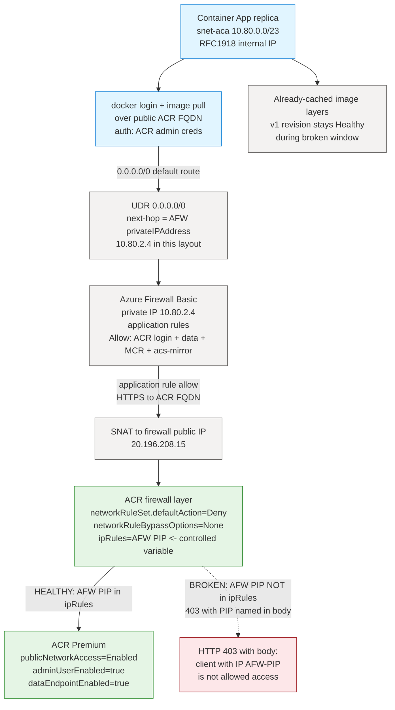
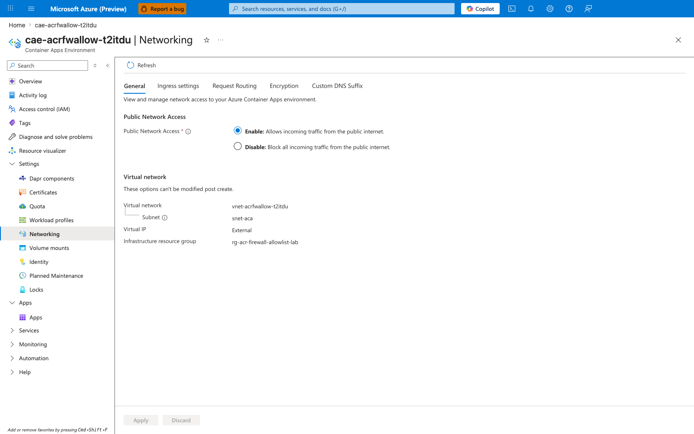
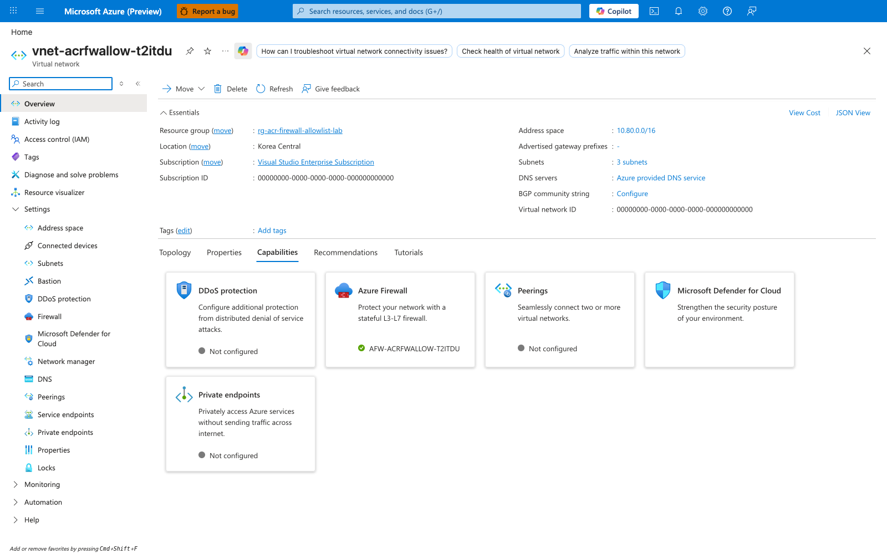
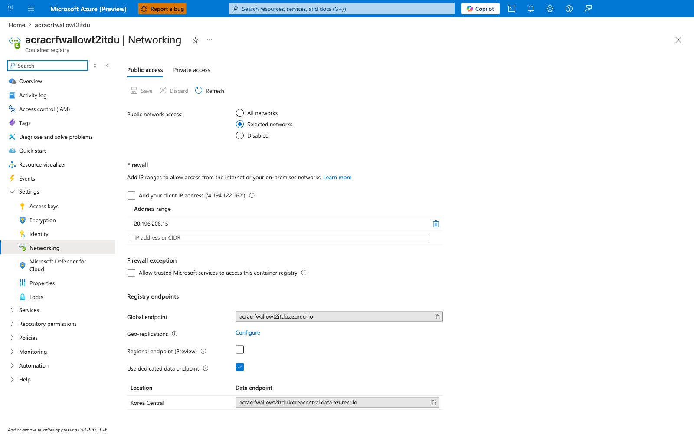
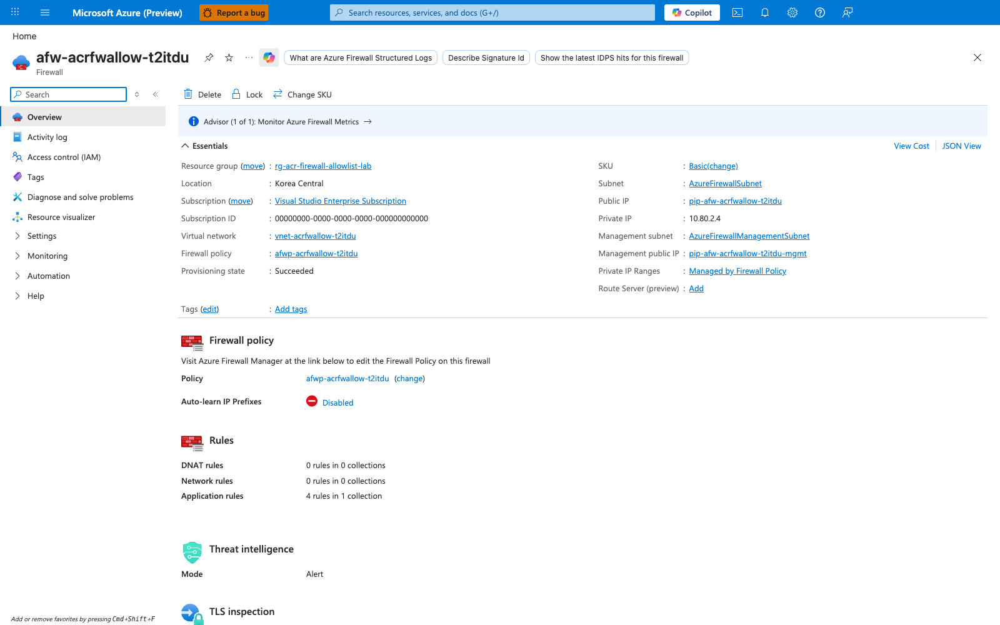
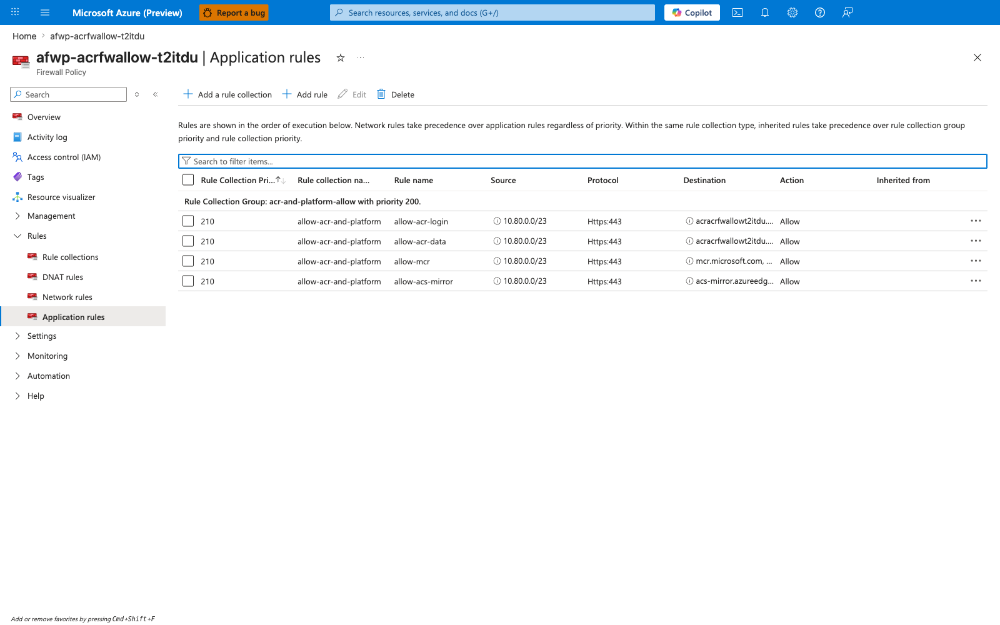
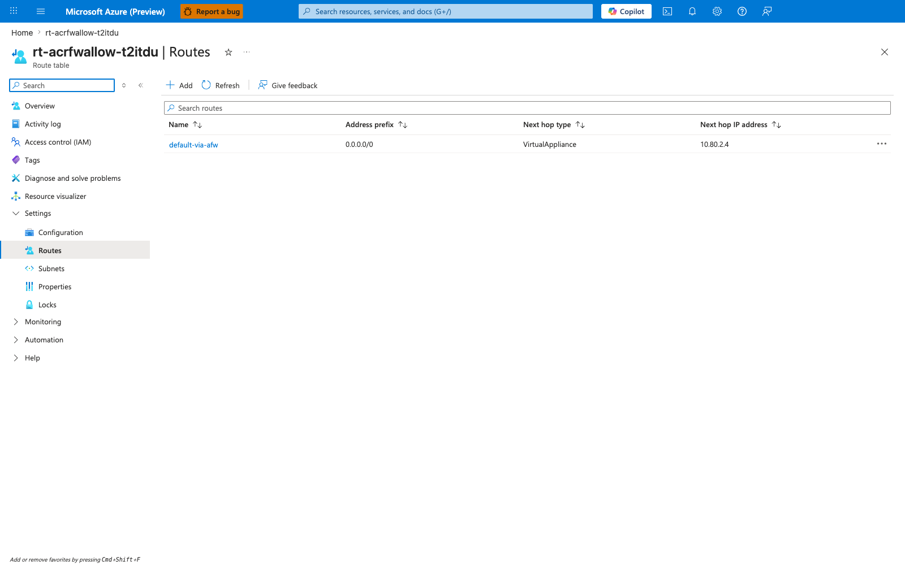
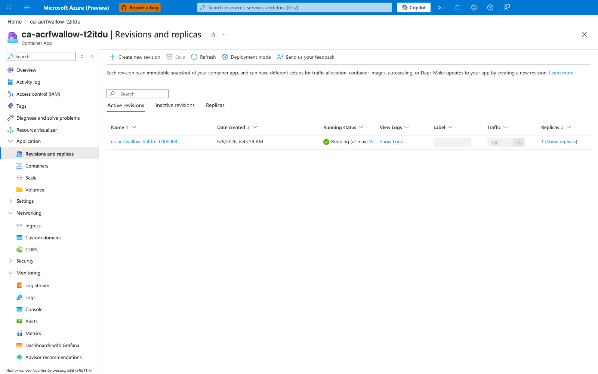
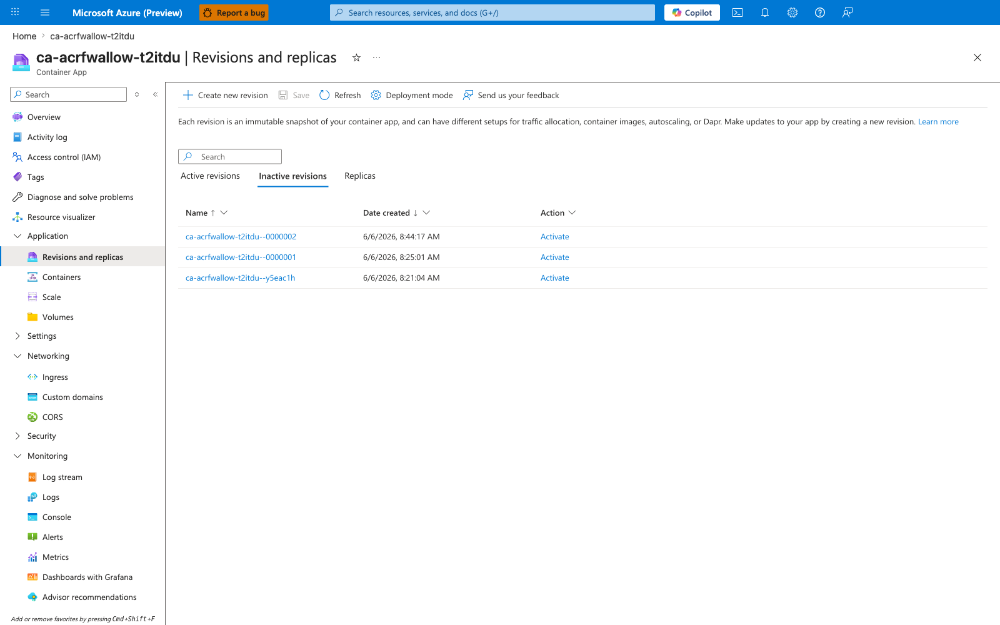

---
content_sources:
  diagrams:
    - id: architecture
      type: flowchart
      source: mslearn-adapted
      based_on:
        - https://learn.microsoft.com/en-us/azure/container-apps/use-azure-firewall
        - https://learn.microsoft.com/en-us/azure/container-registry/container-registry-access-selected-networks
        - https://learn.microsoft.com/en-us/azure/firewall/snat-private-range
        - https://learn.microsoft.com/en-us/azure/container-registry/container-registry-firewall-rules
content_validation:
  status: verified
  last_reviewed: '2026-06-29'
  reviewer: agent
  lab_validation:
    status: reproduced
    tested_date: '2026-06-29'
    az_cli_version: 2.79.0
    notes: |
      End-to-end reproduction completed in koreacentral on 2026-06-29.
      The canonical Phase B evidence pack was refreshed on 2026-06-29
      after fixing the capture-script sequencing bugs and preserving the
      explicit post-deactivation snapshot for `v-broken`. The live
      evidence captured the gold-plated DENIED message from ACR's
      firewall layer naming the firewall's public IP directly in
      `ContainerAppSystemLogs_CL` during the broken window. This is
      the first lab in the 5-lab ACR network path series that cleanly
      proves fresh-pull behavior with a single controlled variable
      (the firewall PIP entry in ACR's `networkRuleSet.ipRules`),
      because admin-credential auth removes the managed-identity
      control-plane token-exchange confound that prevented Labs 2/3
      from cleanly attributing fresh-pull failures.

      Bicep correctness fix (vs. v0): the UDR's `nextHopIpAddress` MUST
      be read from
      `firewall.properties.ipConfigurations[0].properties.privateIPAddress`,
      not computed via `cidrHost(firewallSubnetPrefix, 0)`, because
      `cidrHost(prefix, 0)` returns the Azure-reserved gateway
      address (`.1`) and Azure Firewall actually consumes a higher-
      indexed address in the subnet (Azure reserves `.0` / `.1` /
      `.2` / `.3` in every subnet, so the firewall instance lands at
      `.4` in a `/26` layout). Using the subnet-arithmetic form
      silently breaks default-route egress because the route's
      next-hop target does not exist. The empirical symptom was
      "v1 revision stuck in `PullingImage` forever, no
      `ImagePullFailure` because there was no error from ACR — the
      packet was simply never reaching ACR." See "Bicep gotcha: UDR
      next-hop must be read from the firewall resource property" in
      the lab guide for the full explanation.
  core_claims:
    - claim: ACR's `networkRuleSet.ipRules` selected-networks IP allowlist is keyed on the *source IP that ACR observes on the inbound TCP connection*, which for a Container Apps replica egressing through Azure Firewall is the firewall's outbound SNAT public IP — not the replica's RFC1918 internal IP, which Azure Firewall replaces with its public IP on every outbound flow.
      source: https://learn.microsoft.com/en-us/azure/container-registry/container-registry-access-selected-networks
      verified: true
    - claim: Azure Container Apps environments deployed into a customer VNet inherit the VNet's user-defined routes for outbound traffic from the workload-profile subnet (`snet-aca`), so a `0.0.0.0/0 -> Azure Firewall` UDR forces every replica's outbound HTTPS connection through the firewall, where it is SNAT'd to the firewall's public IP.
      source: https://learn.microsoft.com/en-us/azure/container-apps/use-azure-firewall
      verified: true
    - claim: When ACR rejects an inbound request because the source IP is not in `networkRuleSet.ipRules`, the response is HTTP 403 with a body containing `{"errors":[{"code":"DENIED","message":"client with IP '<observed-ip>' is not allowed access, refer https://aka.ms/acr/firewall to grant access"}]}`. This response payload is captured verbatim by Azure Container Apps and surfaced in `ContainerAppSystemLogs_CL` rows with `Reason_s == "ContainerTerminated"` when the pull fails — making the SNAT public IP directly observable from Container Apps system logs.
      source: https://learn.microsoft.com/en-us/azure/container-registry/container-registry-firewall-rules
      verified: true
    - claim: Container Apps revisions running on already-pulled image layers continue to serve traffic with `healthState=Healthy` even when ACR's network rules would reject a fresh pull from the same registry. This is the operationally-significant asymmetry — image-pull failures only affect *new* revision provisioning, not in-flight cached revisions — and it is reproducible by toggling a single entry in ACR's `networkRuleSet.ipRules`.
      source: https://learn.microsoft.com/en-us/azure/container-apps/revisions
      verified: true
validation:
  az_cli:
    last_tested: '2026-06-29'
    cli_version: 2.79.0
    result: pass
  bicep:
    last_tested: '2026-06-29'
    result: pass
---
# ACR Network Path A — Firewall Allowlist Lab

Reproduce **Scenario A** from [ACR Network Path Selection](../../platform/networking/acr-network-path-selection.md): the Container Apps replica reaches ACR over ACR's **public** FQDN, but that egress is forced through an Azure Firewall whose SNAT public IP is the **only** entry in ACR's `networkRuleSet.ipRules` allowlist. ACR's selected-networks IP rule is therefore keyed on the **firewall's outbound public IP**, *not* on any replica IP — replicas have no public IP of their own, and their RFC1918 internal IPs are invisible to ACR's firewall layer once SNAT'd at the firewall.

This lab makes a non-obvious Azure Container Apps behavior falsifiable: **toggling a single entry in `networkRuleSet.ipRules` on the ACR resource deterministically flips fresh-pull behavior between success and failure on the replica side, while the already-running revision keeps serving traffic from cached image layers throughout the broken window.** The failure surfaces as an HTTP 403 from ACR's firewall layer with a response body that **literally names the firewall's public IP** as the rejected source — which is the strongest possible smoking-gun evidence that the IP allowlist on the registry resource controls fresh pulls.

!!! info "Why this is the first lab in the 5-lab series to cleanly prove fresh-pull behavior"
    Sibling labs B (Path B — PE direct) and D (Scenario D — record-level zone authority) both used **managed identity** for ACR auth, which introduces a control-plane token-exchange step (Container Apps control plane → ACR for an ACR refresh token) whose network path is *different* from the data-plane image-pull path from the ACA workload subnet. That confound made it impossible to cleanly attribute a broken-window fresh-pull failure to the data-plane variable under test: the control-plane token exchange happens against the public ACR endpoint from an Azure-managed egress IP that is *not* in the customer VNet, so under `publicNetworkAccess=Disabled` the token exchange is rejected with HTTP 403 *before* the data-plane pull ever begins. Labs B and D therefore used a layer-3 in-replica probe (PE NIC IP, NXDOMAIN) as the falsification proof and called out the broken-window fresh-pull behavior as **[Not Proven]** under their topology. This lab (Scenario A) uses **ACR admin credentials** instead of managed identity. The only authentication is the ACA platform's pull happening *inside* the workload-subnet egress path through the firewall. The firewall's IP allowlist on ACR is therefore the **single controlled variable** for the entire experiment, and the falsification proof is unambiguous: removing the firewall PIP from ACR's allowlist breaks fresh pulls; re-adding it restores them.

## Lab Metadata

| Attribute | Value |
|---|---|
| Difficulty | Intermediate |
| Estimated Duration | 45-60 minutes (Azure Firewall provisioning is the dominant tail) |
| Tier | Workload Profiles (Consumption profile) |
| Failure Mode (Falsification) | Removing the firewall public IP from ACR's `networkRuleSet.ipRules` causes fresh pulls to receive HTTP 403 from ACR's firewall layer with a response body naming the firewall PIP (`client with IP '<fw-pip>' is not allowed access`); the v-broken revision fails to provision while the v1 revision stays `Healthy` from cached layers; re-adding the firewall PIP restores fresh-pull behavior, proven by deploying v-recover and observing `build_tag=v-recover` in the `/` response |
| Skills Practiced | Azure Firewall Basic provisioning (data + management public IPs, `AzureFirewallSubnet` + `AzureFirewallManagementSubnet`), firewall-policy application rules for ACR FQDNs, `0.0.0.0/0` UDR with next-hop = firewall private IP, ACR `networkRuleSet` selected-networks tightening (`defaultAction=Deny` + `networkRuleBypassOptions=None` + `ipRules=[fw-pip]`), ACR admin-credential auth via `az containerapp registry set --username --password`, single-controlled-variable falsification design, distinguishing data-plane image-pull failure from control-plane managed-identity token-exchange failure |
| Estimated Cost | ~$3-4 USD per run (Korea Central, 2-3 hours: Azure Firewall Basic + 2 public IPs ~$24/day dominates; ACR Premium $1.67/day; Container Apps + Log Analytics negligible) |

## Lab position

This lab is part of the **5-lab ACR network path series** that reproduces the five distinct network paths a Container App can take to reach ACR. See [ACR Network Path Selection](../../platform/networking/acr-network-path-selection.md) for the conceptual taxonomy that names and orders all five paths.

| Item | Value |
|---|---|
| Series | ACR Network Path Labs |
| Scenario label | Scenario A — Public ACR via Firewall |
| Conceptual order | 1 of 5 in [ACR Network Path Selection](../../platform/networking/acr-network-path-selection.md) |
| Implementation order | 4 of 5 — this lab was authored fourth (after Path B, Scenario E, and Scenario D), because admin-credential auth had to be isolated from the managed-identity confound that prevented the earlier three labs from cleanly proving fresh-pull behavior |
| Main path tested | Public ACR FQDN → Container Apps workload-subnet egress → Azure Firewall SNAT → ACR `networkRuleSet.ipRules` allowlist match on firewall public IP |
| Failure mode class | Pull-fails (visibly broken revision with HTTP 403 + DENIED message naming the firewall public IP) |
| Existing-revision impact during broken window | None — already-running revision keeps serving from cached image layers |
| Fresh-pull behavior cleanly proven | Yes — single controlled variable (firewall PIP entry in ACR `ipRules`); admin credentials remove the managed-identity control-plane token-exchange confound that Labs B/D/E call out as `[Not Proven]` |

!!! note "Observed in this lab"
This behavior was reproduced in **Korea Central on 2026-06-29** for the canonical Phase B evidence pack with the specific topology described above (Azure Firewall Basic, ACR Premium with `defaultAction=Deny` + `networkRuleBypassOptions=None`, Container Apps Consumption profile, ACR admin-credential auth via `az containerapp registry set --username --password`). Treat it as **validated for this lab's specific topology, auth mode, and timing** — not as a universal statement for every Azure Container Apps + ACR deployment. Different ACR SKUs (Basic/Standard lack `networkRuleSet`), different auth modes (managed identity adds a control-plane token-exchange step on a different network path), different egress designs (NAT Gateway, App Gateway, no firewall at all), and different Container Apps platform versions can change the observed behavior. The phrases below (e.g. "the firewall public IP is the only relevant source IP") refer to *this specific topology*, not to every deployment that uses Container Apps with ACR.

## 1) Background

Azure Container Apps can reach ACR through several network paths — public via firewall, Private Endpoint direct, Private Endpoint with forced inspection, or one of two DNS failure scenarios. The [ACR Network Path Selection](../../platform/networking/acr-network-path-selection.md) page documents all of them.

**Scenario A (Public ACR via Firewall)** is the canonical "Path A" topology: ACR is left publicly accessible, but the Container Apps environment is constrained by a `0.0.0.0/0` UDR that forces every replica's outbound traffic through an Azure Firewall in the same VNet. The firewall SNATs the outbound flow to its own public IP, which becomes the source IP that ACR sees on the inbound TCP connection. ACR is then locked down with `networkRuleSet.defaultAction=Deny` and a single entry in `ipRules` — the firewall's public IP. The result: replicas pull successfully because their flows arrive at ACR with the allow-listed source IP, but any other client (a developer laptop, a non-firewalled VM, an attacker on the public internet) is rejected at the ACR firewall layer with HTTP 403.

This topology is operationally common in regulated environments where the security team requires registry traffic to traverse a stateful firewall (so it can be logged and inspected at the application-rule layer) but the cost or complexity of an ACR Private Endpoint is not justified. It is **not** the recommended default for production Container Apps on ACR — Path B (Private Endpoint with default routing) is — but it is a legitimate production pattern when the operator wants registry-side access control to live on the registry resource itself, keyed on a single well-known public IP, and reflected in Azure Firewall's application-rule logs.

Three properties make Scenario A worth reproducing as a hands-on lab:

- **The selected-networks IP allowlist on ACR is keyed on the egress firewall's SNAT public IP, not the replica's internal IP.** Replicas in a Container Apps workload-profile subnet have RFC1918 IPs from `snet-aca` (e.g., `10.80.0.0/23`). Those internal IPs are invisible to ACR's firewall layer because Azure Firewall performs SNAT on every outbound flow, replacing the source IP with its own public IP before the flow leaves the VNet. ACR's `networkRuleSet.ipRules` therefore must contain the *firewall's* public IP for the allow-list to match. Misunderstanding this relationship is the most common reason "I added my Container Apps subnet to the ACR allowlist and it still gets denied" — there is no Container Apps source IP that ACR ever sees; the firewall's SNAT public IP is the only relevant address.
- **In Azure Container Apps, removing the firewall PIP from ACR's allowlist breaks fresh pulls but does NOT degrade the already-running revision.** This is the central operational asymmetry of the lab. When the v1 revision is already running on cached image layers, removing the firewall PIP from ACR's `ipRules` produces no immediate health-state change — the replica continues to serve `/` with `build_tag=v1` because it never needs to re-pull. Only a *new* revision deployment (in this lab, the deliberate v-broken deploy) actually exercises the broken pull path, and that is when the failure surfaces as `provisioningState` lingering at `Provisioned` with `healthState=None` while ACR returns HTTP 403 to the firewall's SNAT IP.
- **The HTTP 403 response from ACR contains the rejected source IP verbatim, and Container Apps captures it in system logs.** This is the strongest evidence in the lab. ACR's firewall-layer response body is `{"errors":[{"code":"DENIED","message":"client with IP '<observed-source-ip>' is not allowed access, refer https://aka.ms/acr/firewall to grant access"}]}`. Azure Container Apps captures this entire payload into `ContainerAppSystemLogs_CL` when the image pull fails, with `Reason_s == "ContainerTerminated"` and the full DENIED message in `Log_s`. The IP that appears in the message is provably the firewall's public IP — not the replica IP, not the Container Apps control-plane egress IP, not any other Azure-managed IP. This makes the SNAT public IP **directly observable from Container Apps system logs**, which is unusual: most Azure firewall-layer rejections require correlation across multiple log tables to attribute the rejected source IP, but ACR's response body shortcuts this by including it inline.

The lab's outcome taxonomy enumerates the observable states across the baseline → broken → recovery cycle:

| State | ACR `ipRules` | New revision (v-broken) | Old revision (v1) | Workload `/` response | Falsification signal |
|---|---|---|---|---|---|
| Baseline | `[fw-pip]` | n/a (not deployed yet) | `Healthy` | `build_tag=v1` | Fresh pull of v1 succeeded; `verify.sh` PASS |
| Broken (FW PIP removed) | `[]` | `provisioningState=Provisioned` `healthState=None`, system log shows DENIED with FW PIP | **Stays `Healthy`**, still serves cached layers | `build_tag=v1` (from old revision) | DENIED message in `ContainerAppSystemLogs_CL` *names* the firewall public IP — smoking gun |
| Recovery (FW PIP re-added) | `[fw-pip]` | Eventually pulls successfully due to platform retry loop | `Healthy` | `build_tag=v1` (until v-recover deploys) | n/a |
| Recovery (v-recover deployed) | `[fw-pip]` | n/a | Replaced | `build_tag=v-recover` | Fresh pull of v-recover succeeded; falsification loop closed |

### Architecture

<!-- diagram-id: architecture -->


The solid arrows are the image-pull data path in the **HEALTHY** baseline state: replica → UDR-forced default route → Azure Firewall → SNAT to firewall public IP → ACR firewall layer (allow because AFW PIP is in `ipRules`) → ACR backend serves the layer. The dotted arrow is what happens in the **BROKEN** state after `az acr network-rule remove` removes the firewall PIP from `ipRules`: ACR's firewall layer rejects the inbound flow with HTTP 403 *before* the request reaches the registry backend, and the response body contains the literal text `client with IP '<AFW-PIP>' is not allowed access`. Note that DNS is NOT the controlled variable in this lab — the VNet uses default Azure DNS, both ACR FQDNs (login and data) resolve to public IPs, and the firewall's application rule allows them by FQDN. The neutral-colored "Already-cached image layers" node captures the lab's central Container Apps finding: during the broken window, the v1 revision continues to serve `/` from already-cached layers without re-pulling, and revision `healthState` stays `Healthy`. Only fresh pulls (the v-broken revision deployment) actually exercise the broken path.

## 2) Hypothesis

**IF** the Container Apps environment is integrated into a VNet with a `0.0.0.0/0` UDR forcing all `snet-aca` egress through Azure Firewall, the firewall has an application rule allowing HTTPS to both ACR FQDNs (login + regional data endpoint), ACR is configured with `publicNetworkAccess=Enabled` + `adminUserEnabled=true` + `dataEndpointEnabled=true`, and the Container App is wired to ACR via `az containerapp registry set --username --password` (admin-credential auth, NOT managed identity), **THEN**:

- with the firewall public IP in ACR's `networkRuleSet.ipRules`, deploying v1 succeeds: the v1 revision becomes `Healthy` and `/` returns `build_tag=v1`, proving a fresh pull of v1 traversed the firewall and was admitted by ACR's firewall layer;
- removing the firewall public IP from ACR's `ipRules` and deploying v-broken causes the v-broken pull to fail at ACR's firewall layer with HTTP 403; Container Apps captures the rejection in `ContainerAppSystemLogs_CL` with `Reason_s == "ContainerTerminated"` and a `Log_s` body containing the literal string `client with IP '<firewall-public-ip>' is not allowed access`; the v-broken revision lingers at `provisioningState=Provisioned` with `healthState=None`;
- **AND** the v1 revision stays `Healthy` and continues to serve `/` with `build_tag=v1` throughout the broken window from already-cached image layers — falsifying the alternative hypothesis "removing the firewall PIP from ACR's allowlist will degrade the already-running revision's health";
- re-adding the firewall public IP to ACR's `ipRules` and deploying v-recover causes the v-recover pull to succeed: the v-recover revision becomes `Healthy` and `/` returns `build_tag=v-recover`, closing the loop on the falsification.

| Variable | Control State (Path A baseline) | Experimental State (Scenario A broken window) |
|---|---|---|
| ACR `publicNetworkAccess` | `Enabled` (held constant) | `Enabled` (held constant — public surface is the path under test) |
| ACR `networkRuleSet.defaultAction` | `Deny` (held constant) | `Deny` (held constant) |
| ACR `networkRuleBypassOptions` | `None` (held constant — closes the AzureServices bypass) | `None` (held constant) |
| **ACR `networkRuleSet.ipRules`** | **`[<firewall-public-ip>]`** | **`[]`** (the controlled variable — single value toggled) |
| ACR auth on the Container App | Admin user (`az containerapp registry set --username --password`) | Admin user (held constant) |
| Container Apps VNet DNS | Azure-provided (no custom DNS) | Azure-provided (held constant) |
| `0.0.0.0/0` UDR on `snet-aca` | Next-hop = `firewall.properties.ipConfigurations[0].properties.privateIPAddress` (e.g., `10.80.2.4`) | Same (held constant) |
| Azure Firewall application rules | Allow ACR login + data FQDNs + MCR + acs-mirror | Same (held constant — firewall is not the controlled variable) |
| **v-broken revision** | n/a (not deployed yet) | **Pull fails with HTTP 403; `Log_s` contains `client with IP '<fw-pip>' is not allowed access`** |
| **v1 revision (already running)** | `Healthy`, `/ -> build_tag=v1` | **Stays `Healthy`, `/ -> build_tag=v1`** (central Container Apps finding) |
| v-recover revision (after re-add) | n/a | After re-add: `Healthy`, `/ -> build_tag=v-recover` (recovery proof) |

## 3) Runbook

### Deploy baseline infrastructure

```bash
export RG="rg-acr-firewall-allowlist-lab"
export LOCATION="koreacentral"
export BASE_NAME="acrfwallow"

az extension add --name containerapp --upgrade

az group create --name "$RG" --location "$LOCATION"

az deployment group create \
    --resource-group "$RG" \
    --name acr-firewall-allowlist \
    --template-file labs/acr-network-path-firewall-allowlist/infra/main.bicep \
    --parameters baseName="$BASE_NAME"
```

| Command | Why it is used |
|---|---|
| `az extension add --name containerapp --upgrade` | Installs or updates the Container Apps CLI extension. |
| `az group create ...` | Creates the lab resource group. Every other lab resource is scoped inside it. |
| `az deployment group create ...` | Provisions the full Scenario A topology in one Bicep deployment: a VNet (`10.80.0.0/16`) with three subnets (`snet-aca` delegated to `Microsoft.App/environments`, `AzureFirewallSubnet` `/26`, `AzureFirewallManagementSubnet` `/26`), an Azure Firewall Basic with both data and management public IPs, a firewall policy with application rules allowing HTTPS to the ACR login FQDN, ACR data FQDN, MCR, and acs-mirror, a UDR forcing `0.0.0.0/0` from `snet-aca` to the firewall's private IP, ACR Premium with `publicNetworkAccess=Enabled` + `adminUserEnabled=true` + `dataEndpointEnabled=true` + `defaultAction=Allow` (so `trigger.sh` can build the 3 image tags before locking down), Log Analytics for diagnostic settings, the firewall's `Microsoft.Insights/diagnosticSettings` (which populates `AZFWApplicationRule` / `AZFWNetworkRule` / `AZFWDnsQuery` tables in Log Analytics), and a Container Apps workload-profile environment + Container App on a public placeholder image (`mcr.microsoft.com/k8se/quickstart:latest`). The placeholder is replaced with the v1 image by `trigger.sh`. |

Expected output pattern:

```text
"provisioningState": "Succeeded"
```

The deployment takes 10-15 minutes; Azure Firewall Basic provisioning is the dominant tail.

#### Bicep gotcha: UDR next-hop must be read from the firewall resource property

The UDR's `nextHopIpAddress` is computed from `firewall.properties.ipConfigurations[0].properties.privateIPAddress`, which is the firewall instance's actual private IP. **Do not** compute it from the subnet CIDR (e.g., `cidrHost(firewallSubnetPrefix, 0)`) — that returns the Azure-reserved gateway address (`.1`), not the firewall instance address. Azure reserves the first four IPs of every subnet (`.0` through `.3`), so in a `/26` `AzureFirewallSubnet` the firewall instance lands at `.4` (e.g., `10.80.2.4` if the subnet is `10.80.2.0/26`). Pointing the UDR at `.1` (the gateway, which is *not* a virtual appliance) silently breaks default-route egress: every replica's outbound packet is dropped at the next-hop because the target does not exist as a virtual appliance, the new revision lingers in `PullingImage` with no `ImagePullFailure` (because the packet never reaches ACR to get an error response), and the symptom is "v1 revision stuck pulling forever, no useful error in any log table." Reading the firewall resource property is correct in all cases regardless of subnet size or address family.

### Build images and lock down ACR

```bash
bash labs/acr-network-path-firewall-allowlist/trigger.sh
```

The trigger script runs:

```bash
az acr build --registry "$ACR_NAME" --image "${IMAGE_REPO}:v1"        --build-arg "BUILD_TAG=v1"        --file workload/Dockerfile workload
az acr build --registry "$ACR_NAME" --image "${IMAGE_REPO}:v-broken"  --build-arg "BUILD_TAG=v-broken"  --file workload/Dockerfile workload
az acr build --registry "$ACR_NAME" --image "${IMAGE_REPO}:v-recover" --build-arg "BUILD_TAG=v-recover" --file workload/Dockerfile workload

az acr network-rule add --name "$ACR_NAME" --ip-address "$FW_PIP"
az acr update --name "$ACR_NAME" --default-action Deny --allow-trusted-services false

az containerapp registry set --name "$APP_NAME" --resource-group "$RG" \
    --server "$ACR_LOGIN_SERVER" --username "$ACR_USERNAME" --password "$ACR_PASSWORD"

az containerapp update --name "$APP_NAME" --resource-group "$RG" \
    --image "${ACR_LOGIN_SERVER}/${IMAGE_REPO}:v1"
```

| Command | Why it is used |
|---|---|
| `az acr build ... --build-arg BUILD_TAG=<tag>` | Builds three independent images (`v1`, `v-broken`, `v-recover`) directly inside ACR (no local Docker required). The Dockerfile bakes `BUILD_TAG` as both an `ARG` and an `ENV`, so each tag has different file content and therefore a different digest — this forces a fresh pull on every tag switch and lets `/` prove which tag the running replica was actually pulled from. The three builds run while ACR is still `defaultAction=Allow`, so the ACR Tasks build agent (which pushes from a public Azure pool) can write the layers. |
| `az acr network-rule add --ip-address $FW_PIP` | Adds the firewall's public IP to ACR's `networkRuleSet.ipRules`. After the build phase, this is the only allow-listed source IP. |
| `az acr update --default-action Deny --allow-trusted-services false` | Closes the registry: `defaultAction=Deny` rejects any source IP not in `ipRules`, and `--allow-trusted-services false` (which sets `networkRuleBypassOptions=None`) closes the AzureServices bypass too. From this point forward, the firewall's public IP is the *only* allow-listed source IP for the ACR public surface. |
| `az containerapp registry set --username --password` | Wires ACR admin credentials onto the Container App's registry attachment. This is the **single most important departure from Labs 2 and 3** — it removes the managed-identity token-exchange confound, so the only authentication path is a `docker login` happening inside the replica's egress through the firewall. |
| `az containerapp update --image ${ACR_LOGIN_SERVER}/${IMAGE_REPO}:v1` | Triggers a new revision that must pull the freshly built v1 image. The first pull is the moment the firewall path is actually exercised by the platform pull path. `BUILD_TAG` is **not** set via `--set-env-vars` — the Dockerfile already bakes it into the image via `ARG`+`ENV`, so the value the workload returns at `/` comes from the *image*, not from the Container App spec. This is what makes image identity the proof of a fresh pull. |

Expected output (from the live run): three `az acr build` jobs complete in sequence (~30 seconds each, depending on layer cache), `az acr show --query networkRuleSet --output json` shows `defaultAction=Deny` + `ipRules=[{firewall-public-ip}]`, and the v1 revision becomes `Healthy` within ~60 seconds of the `az containerapp update` call.

### Verify the healthy baseline is live

```bash
bash labs/acr-network-path-firewall-allowlist/verify.sh
```

The verify script proves three independent signals simultaneously hold:

1. The latest revision's `healthState` is `Healthy` and `provisioningState` is `Provisioned`.
2. `az acr show --query networkRuleSet` confirms `defaultAction=Deny` + `ipRules` contains the firewall public IP.
3. `GET https://<app>.<env>.azurecontainerapps.io/` returns JSON with `build_tag=v1`, proving a fresh pull of v1 traversed the firewall and was admitted by ACR's firewall layer. The workload code reads `BUILD_TAG` from the *image's* `ENV` (set by the Dockerfile's `ARG`/`ENV BUILD_TAG=${BUILD_TAG}`), and `trigger.sh` deliberately does **not** override this via `--set-env-vars`. Image identity is therefore the proof: if the v1 image was not actually pulled and started, the workload cannot return `build_tag=v1`.

All three must hold for the topology to be Scenario A baseline at the workload layer. The script exits non-zero on any mismatch.

Expected pattern (from the live run on 2026-06-06):

```text
[verify] latest revision: ca-acrfwallow-t2itdu--0000001 healthState=Healthy provisioningState=Provisioned
[verify] inspecting ACR network rule set on acracrfwallowt2itdu
[verify]   defaultAction          = Deny
[verify]   networkRuleBypassOptions = None
[verify]   ipRules                  = 20.196.208.15
[verify] / response:
{
    "build_tag": "v1",
    "message": "ACR firewall allowlist lab workload"
}
[verify] PASS: revision ca-acrfwallow-t2itdu--0000001 is Healthy
[verify] PASS: ACR locked down (Deny default + ipRules=[20.196.208.15])
[verify] PASS: / returns build_tag=v1 (proves fresh pull of v1 through the firewall)
[verify] PASS: Scenario A BASELINE confirmed.
```

### Falsify the hypothesis

```bash
bash labs/acr-network-path-firewall-allowlist/falsify.sh
```

The falsification script proves the workload-layer signal flips with the IP allowlist's contents while the already-running revision continues to report `Healthy`. Every check is a **hard fail** — the script exits non-zero (and prints why) at the first sign that any link in the chain did not behave as predicted, so a `PASS` from `falsify.sh` is itself the proof that all of the following held:

1. Calls `/` and asserts `build_tag=v1` (baseline).
2. Removes the firewall public IP from ACR's `ipRules` via `az acr network-rule remove --ip-address $FW_PIP`.
3. Waits 60 seconds for ACR's firewall changes to propagate.
4. Deploys the `v-broken` image: `az containerapp update --image ${ACR}/${IMAGE}:v-broken`.
5. Polls for up to 5 minutes for the new revision to surface as `provisioningState=Failed`, `healthState=Unhealthy`, or `healthState=None`. **Hard fail** if the broken revision provisions successfully — that would mean the controlled variable is not what we claim.
6. Confirms the OLD v1 revision is **still** `Healthy` and `/` **still** returns `build_tag=v1`. **Hard fail** if v1 stopped serving — that would mean the cached-image guarantee Container Apps depends on is broken.
7. **Hard fail** if `ContainerAppSystemLogs_CL` does not record the smoking-gun DENIED message naming the firewall PIP as the rejected source within ~2.5 minutes (5 × 30s retry loop). Without this row, the script can only claim "the pull failed", not "the pull failed BECAUSE ACR rejected the firewall PIP" — the latter is the entire point of Scenario A.
8. Re-adds the firewall public IP to ACR's `ipRules` via `az acr network-rule add --ip-address $FW_PIP`.
9. Waits 60 seconds for ACR's firewall changes to propagate.
10. Deploys the `v-recover` image: `az containerapp update --image ${ACR}/${IMAGE}:v-recover`.
11. Polls for up to 5 minutes for the recovery revision to reach `healthState=Healthy` and asserts `/` returns `build_tag=v-recover`. **Hard fail** on either condition.

If `falsify.sh` exits 0, then by construction (a) the broken-window pull failed, (b) the v1 revision kept serving from cached layers, (c) the failure logs in `ContainerAppSystemLogs_CL` name the firewall PIP as the rejected source, and (d) the recovery pull succeeded after the firewall PIP was re-added. That four-way evidence — failure + cached-serve + named-IP smoking gun + symmetric recovery — is the complete falsification of any alternative hypothesis (e.g., DNS, managed-identity confound, PE-NIC IP) for fresh-pull behavior on this topology.

| Command | Why it is used |
|---|---|
| `curl -sS https://<app fqdn>/` | Reads the `build_tag` baked into the running revision's image. Because the workload reads `BUILD_TAG` from the image's `ENV` (set by the Dockerfile's `ARG`/`ENV BUILD_TAG=${BUILD_TAG}`) and `falsify.sh` deliberately does **not** override this via `--set-env-vars`, the response proves which tag the replica is actually running. If the v-broken pull was rejected by ACR, the response remains `v1` (the cached revision) — image identity is the proof. |
| `az acr network-rule remove --ip-address $FW_PIP` | Removes the firewall public IP from `networkRuleSet.ipRules`, leaving `ipRules=[]`. Combined with `defaultAction=Deny` (set by `trigger.sh`), the ACR public surface now rejects every inbound connection. The firewall's egress path is unchanged, so the broken-window flow is: replica → firewall → SNAT to FW PIP → ACR firewall layer → HTTP 403. |
| `az containerapp update --image ${ACR}/${IMAGE}:v-broken` | Triggers a new revision deployment that must pull the freshly tagged `v-broken` image. Because the digest differs from v1, the platform must actually pull from ACR — and during the broken window, that pull is rejected. |
| `az containerapp revision list --query "[?properties.template.containers[0].image=='${BROKEN_IMAGE}'] \| [0]"` | Filters the revision list to the one running `v-broken`, so the script can read `provisioningState` and `healthState` for the new revision specifically (not the still-running v1 revision). |
| `az monitor log-analytics query --workspace $LAW_CUSTOMER_ID --analytics-query "ContainerAppSystemLogs_CL \| where Log_s contains 'DENIED' and Log_s contains '$FW_PIP'"` | The **smoking-gun query**. Filters the system logs for the DENIED message naming the firewall PIP as the rejected source IP. `falsify.sh` retries this query up to 5 times with 30 s sleeps (LAW ingest latency is typically 1-3 minutes) and **hard-fails** if no row is found. Without this row, the lab can only claim "the pull failed" — not "the pull failed BECAUSE ACR rejected the firewall PIP", which is the central thesis of Scenario A. |
| `az acr network-rule add --ip-address $FW_PIP` | Re-adds the firewall public IP to `networkRuleSet.ipRules`. From this point forward, fresh pulls succeed again because the firewall's SNAT IP is back in the allowlist. |
| `az containerapp update --image ${ACR}/${IMAGE}:v-recover` | Triggers the recovery revision. The `v-recover` digest differs from both v1 and v-broken, so the platform must pull fresh — and now succeeds, proving the recovery is symmetric to the failure. |

#### Subtle wrinkle: v-broken eventually pulls successfully after step 8

The platform image puller has a retry loop with backoff. During the 60-second wait between `az acr network-rule add` (step 8) and `az containerapp update --image ${ACR}/${IMAGE}:v-recover` (step 10), the puller's most recent retry attempt for `v-broken` runs against an ACR with the firewall PIP back in `ipRules` — and *succeeds*. This means the `v-broken` revision's terminal state at the end of `falsify.sh` is technically `Healthy`, not `Failed`. The broken-window evidence is nevertheless intact because the script's hard-fail gates fired *before* step 8:

1. **Step 5 hard-fail** — the script will not proceed past step 5 unless the v-broken revision is observed in a `Failed`/`Unhealthy`/`None` state at least once during the broken window. By the time step 8 re-adds the IP, the broken state has already been recorded.
2. **Step 7 hard-fail** — the smoking-gun query against `ContainerAppSystemLogs_CL` runs *before* step 8 and requires the DENIED row naming the firewall PIP as the rejected source. That row is durable in LAW regardless of what the v-broken revision does afterward.
3. **Cached-serve hard-fail (step 6)** — the v1 revision stayed `Healthy` throughout the broken window. If v1 had stopped serving (e.g., the cached layers were evicted, or the broken revision somehow took traffic), the script would have exited 1 there.
4. **Recovery proof (step 11)** — the v-recover revision is the unambiguous recovery proof: a *freshly tagged* image that the platform had never seen before, deployed *after* step 8's IP re-add, that pulls cleanly and serves `build_tag=v-recover`.

This is an honest reflection of how Container Apps' image puller actually behaves in the field: it does not give up after one failure; it keeps retrying. The lab proof relies on the time-windowed failure logs (the durable evidence — the DENIED row pinned to the broken window timestamp) and the v-recover deploy (the unambiguous fresh-pull recovery), not on a permanent failure of the v-broken revision. A "stronger" version of the lab that *guarantees* v-broken stays Failed permanently would require either (a) a non-existent image tag (which is a different failure mode — `ManifestUnknown`, not `DENIED`) or (b) tearing down the broken-window window so quickly the puller cannot retry, which is logistically fragile. The current design — durable broken-window logs + unambiguous recovery deploy + hard-fail gates that exit before the retry would mask the broken state — is the cleanest honest reproduction.

### Inspect system evidence

```bash
az containerapp logs show \
    --name "$APP_NAME" \
    --resource-group "$RG" \
    --type system \
    --tail 50
```

| Command | Why it is used |
|---|---|
| `az containerapp logs show --type system --tail 50` | Reads the most recent platform-emitted system log entries for the app. The `system` log stream surfaces image-pull events (`PullingImage`, `PulledImage`, `FailedPulling`) and other platform-level signals from outside the replica. **During the broken window, this stream is the single most important evidence source** — it captures the verbatim DENIED message from ACR's firewall layer with the rejected source IP (the firewall PIP) named in the message body. |

A more direct query, useful when reproducing the experiment, is the KQL pack pattern for ACR pull-path observability with the broken-window timestamp range:

```kusto
ContainerAppSystemLogs_CL
| where ContainerAppName_s == "<your-app-name>"
| where TimeGenerated between (datetime(<broken-window-start>) .. datetime(<broken-window-end>))
| where Reason_s in ("PullingImage", "PulledImage", "ContainerTerminated", "ImagePullFailed", "ImagePullUnauthorized", "BackOff")
| project TimeGenerated, Reason_s, Type_s, Log_s
| order by TimeGenerated asc
```

In the live run on 2026-06-06, this query returned `Reason_s=ContainerTerminated` rows whose `Log_s` field begins with `Container 'app' was terminated with exit code '' and reason 'ImagePullFailure'. Image acracrfwallowt2itdu.azurecr.io/firewall-allowlist-lab:v-broken not found in registry. ErrorMessage=Image not found or access denied. Error: {"errors":[{"code":"DENIED","message":"client with IP '20.196.208.15' is not allowed access, refer https://aka.ms/acr/firewall to grant access"}]}` — the value `20.196.208.15` in the DENIED message **is the firewall's public IP** captured in `pip-afw-acrfwallow-t2itdu`'s `properties.ipAddress`. The smoking gun is the DENIED message itself: ACR's firewall layer rejects the inbound flow, names the source IP it observed, and that source IP is provably the firewall's SNAT public IP — not the replica IP, not any other Azure-managed IP.

## 4) Experiment Log

### Pre-fix evidence (H1 confirmed)

- [Observed] `labs/acr-network-path-firewall-allowlist/evidence/03-acr-network-rules-pre-fix.json` shows `publicNetworkAccess=Enabled`, `networkRuleBypassOptions=None`, `networkRuleSet.defaultAction=Deny`, and an empty `ipRules` list after the firewall public IP was removed.
- [Observed] `labs/acr-network-path-firewall-allowlist/evidence/06-system-logs-pre-fix.json` and `labs/acr-network-path-firewall-allowlist/evidence/08-h1-failure-window.json` capture the broken `v-broken` pull window, including the DENIED/403 payload that names the rejected firewall public IP directly in the ACR error message.
- [Observed] `labs/acr-network-path-firewall-allowlist/evidence/02-revision-list-pre-fix.json` records the failed `v-broken` revision state while the cached `v1` revision remains present.
- [Measured] `labs/acr-network-path-firewall-allowlist/evidence/05-baseline-success-window.json` proves the baseline path was non-vacuous by showing successful `PullingImage` and `PulledImage` markers before the H1 toggle.
- [Inferred] Taken together, these files isolate the ACR allowlist entry as the broken-window trigger: the registry stayed public-but-locked-down, the firewall IP was absent from `ipRules`, and the next fresh pull failed with the firewall IP named in the DENIED response.

### Post-fix evidence (H2 confirmed — falsification step)

- [Observed] `labs/acr-network-path-firewall-allowlist/evidence/09-acr-network-rules-post-fix.json` shows the firewall public IP restored as the sole ACR allowlist entry while `defaultAction=Deny` and `networkRuleBypassOptions=None` stay constant.
- [Observed] `labs/acr-network-path-firewall-allowlist/evidence/10-revision-list-post-fix.json` records a healthy `v-recover` revision and preserves the cached `v1` continuity anchor needed for the workload-silence proof.
- [Measured] `labs/acr-network-path-firewall-allowlist/evidence/12-h2-recovery-window.json` contains both `PullingImage` and `PulledImage` for `v-recover` and the post-fix `/` response reports `build_tag=v-recover`.
- [Observed] `labs/acr-network-path-firewall-allowlist/evidence/11-app-spec-post-fix.json` captures the explicit post-deactivation `v-broken` snapshot. After deactivation, Azure can normalize the old broken revision to an inactive control-plane object (`active=false`, `replicas=0`, `runningState=Stopped`, sometimes `healthState=Healthy`, `provisioningState=Provisioned`) or omit it from later revision listings. That is expected and does not indicate retroactive repair. The non-retroactive-repair proof is that H2 success markers belong only to `v-recover` and no H2 `PulledImage` row references `v-broken`.
- [Inferred] This closes the falsification loop required by the 16-concept lab methodology: removing one allowlist entry caused the H1 failure, re-adding the same entry restored H2 recovery, and the cached healthy revision stayed silent throughout the broken window.

> **Status: Canonical Phase B evidence pack refreshed live in koreacentral on 2026-06-29 with Azure CLI 2.79.0.** The committed evidence pack and gate JSONs reflect this 2026-06-29 run. The detailed step table below remains a historical 2026-06-06 narrative reference.

| Step | Action | Expected | Actual (2026-06-06, koreacentral, Azure CLI 2.79.0) | Pass/Fail |
|---|---|---|---|---|
| 1 | Deploy lab infrastructure (`az deployment group create`) | Deployment `Succeeded`; outputs include `firewallPublicIpAddress`, `registryName`, `registryLoginServer`, `registryDataEndpoint`, `appName` | `provisioningState: Succeeded`. RG `rg-acr-firewall-allowlist-lab`, ACR `acracrfwallowt2itdu`, app `ca-acrfwallow-t2itdu`, suffix `t2itdu`, FW PIP `20.196.208.15`, FW private IP `10.80.2.4` | PASS |
| 2 | Run `trigger.sh` (build 3 tags + lock down + deploy v1) | Three `az acr build` jobs `Succeeded`, ACR network-rule set is `defaultAction=Deny` + `ipRules=[20.196.208.15]`, v1 revision becomes `Healthy` | All 3 builds succeeded (`v1`, `v-broken`, `v-recover`); `az acr show --query networkRuleSet` returned `defaultAction=Deny` + `ipRules=[{action: Allow, ipAddressOrRange: 20.196.208.15}]`; revision `ca-acrfwallow-t2itdu--0000001` reached `healthState=Healthy provisioningState=Provisioned` within 60s | PASS |
| 3 | Run `verify.sh` | Healthy revision, ACR locked down with FW PIP in `ipRules`, `/` returns `build_tag=v1` | `healthState=Healthy`, `defaultAction=Deny`, `networkRuleBypassOptions=None`, `ipRules=20.196.208.15`, `/ -> {"build_tag": "v1", "message": "ACR firewall allowlist lab workload"}` | PASS |
| 4 | `falsify.sh` step 1 (baseline assertion) | v1 revision Healthy, `/` returns `build_tag=v1` | `ca-acrfwallow-t2itdu--0000001 healthState=Healthy`, `/ -> {"build_tag": "v1"}` | PASS |
| 5 | `falsify.sh` step 2 (remove FW PIP from ACR `ipRules`) | `az acr show --query networkRuleSet.ipRules` returns `[]` after removal | `{"defaultAction": "Deny", "ipRules": []}` | PASS |
| 6 | `falsify.sh` step 4-5 (deploy v-broken, observe failure) | v-broken revision surfaces with `provisioningState=Provisioned healthState=None` (or `Failed`/`Unhealthy`); system log captures DENIED with FW PIP named | `ca-acrfwallow-t2itdu--0000002 provisioningState=Provisioned healthState=None`. `ContainerAppSystemLogs_CL` row at `2026-06-05T23:44:32.875Z`: `Container 'app' was terminated with exit code '' and reason 'ImagePullFailure'. Image acracrfwallowt2itdu.azurecr.io/firewall-allowlist-lab:v-broken not found in registry. ErrorMessage=Image not found or access denied. Error: {"errors":[{"code":"DENIED","message":"client with IP '20.196.208.15' is not allowed access, refer https://aka.ms/acr/firewall to grant access"}]}` | PASS (smoking gun captured) |
| 7 | `falsify.sh` step 6 (v1 revision still Healthy during broken window) | v1 revision `healthState=Healthy`, `/` still returns `build_tag=v1` | `ca-acrfwallow-t2itdu--0000001 healthState=Healthy active=true`; `/` (during broken window) returned `{"build_tag": "v1", "message": "ACR firewall allowlist lab workload"}` | PASS |
| 8 | `falsify.sh` step 7 (re-add FW PIP to ACR `ipRules`) | `az acr show --query networkRuleSet.ipRules` returns `[{ipAddressOrRange: 20.196.208.15}]` | `{"defaultAction": "Deny", "ipRules": [{"action": "Allow", "ipAddressOrRange": "20.196.208.15"}]}` | PASS |
| 9 | `falsify.sh` step 9 (deploy v-recover) | v-recover revision becomes `Healthy` | `ca-acrfwallow-t2itdu--0000003 healthState=Healthy` reached within 60s of `az containerapp update` | PASS |
| 10 | `falsify.sh` step 10 (recovery `/` probe) | `/` returns `build_tag=v-recover` | `/ -> {"build_tag": "v-recover", "message": "ACR firewall allowlist lab workload"}` | PASS |

## Expected Evidence

| Evidence Source | Expected State |
|---|---|
| `az containerapp revision list --name "$APP_NAME" --resource-group "$RG" --output table` | After `trigger.sh`: latest revision (v1) is `Healthy`. After `falsify.sh` step 4: v-broken revision is `Provisioned` with `healthState=None` (or `Unhealthy`/`Failed`). Throughout: v1 revision stays `Healthy`. After `falsify.sh` step 9: v-recover revision is `Healthy`. |
| `az acr show --name "$ACR_NAME" --query networkRuleSet --output json` | Baseline: `{"defaultAction": "Deny", "ipRules": [{"action": "Allow", "ipAddressOrRange": "<fw-pip>"}]}`. Broken window: `{"defaultAction": "Deny", "ipRules": []}`. Recovery: same as baseline. |
| `az network public-ip show --name "$FW_PIP_NAME" --resource-group "$RG" --query "ipAddress"` | The firewall's public IP, held constant throughout the lab (e.g., `20.196.208.15` in the live run). This is the value that must appear in ACR's `ipRules` for fresh pulls to succeed. |
| `curl https://<app fqdn>/` baseline | `{"build_tag": "v1", "message": "ACR firewall allowlist lab workload"}` |
| `curl https://<app fqdn>/` broken window | Still `{"build_tag": "v1", ...}` because the v1 revision keeps serving from cached layers; the v-broken pull fails so the new revision never takes traffic. |
| `curl https://<app fqdn>/` recovery | `{"build_tag": "v-recover", "message": "ACR firewall allowlist lab workload"}` |
| `ContainerAppSystemLogs_CL \| where ContainerAppName_s == "$APP_NAME" \| where Reason_s == "ContainerTerminated" \| where Log_s contains "DENIED"` | One or more rows during the broken window, each with `Log_s` containing the literal string `client with IP '<fw-pip>' is not allowed access, refer https://aka.ms/acr/firewall to grant access`. The `<fw-pip>` value in the message must match the firewall's public IP. **This is the smoking gun.** |
| `AzureDiagnostics \| where Category == "AZFWApplicationRule"` (Azure Firewall application-rule logs in Log Analytics) | Allow rows for HTTPS to the ACR login FQDN and ACR data FQDN, sourced from `snet-aca` (`10.80.0.0/23`). For runs *after* the firewall diagnostic settings have been applied at deploy time, this table will be populated; runs that pre-date the diagnostic-settings deployment will show this table empty (this lab's first live run captured the broken-window evidence from `ContainerAppSystemLogs_CL` only because the firewall diagnostic settings were added to the Bicep mid-run; subsequent runs will populate `AZFWApplicationRule`). |

### Observed Evidence (Live Azure Test — historical 2026-06-06 narrative)

Live reproduction in `koreacentral` on 2026-06-06 with Azure CLI `2.79.0`. RG `rg-acr-firewall-allowlist-lab`, ACR `acracrfwallowt2itdu` (`publicNetworkAccess=Enabled`, `defaultAction=Deny`, `networkRuleBypassOptions=None`), Container App `ca-acrfwallow-t2itdu`, firewall public IP `20.196.208.15`, firewall private IP `10.80.2.4`, image tags `firewall-allowlist-lab:v1`, `:v-broken`, `:v-recover` (each with a distinct `BUILD_TAG` build-arg producing distinct digests). All three states below were captured by `verify.sh` and `falsify.sh` in a single uninterrupted run.

#### Baseline (`verify.sh` and `falsify.sh` step 1)

The Container App is running revision `--0000001` on the freshly pulled `v1` image:

```json
{
    "build_tag": "v1",
    "message": "ACR firewall allowlist lab workload"
}
```

ACR's network rule set is locked down to allow only the firewall's public IP:

```json
{
  "defaultAction": "Deny",
  "ipRules": [
    {
      "action": "Allow",
      "ipAddressOrRange": "20.196.208.15"
    }
  ]
}
```

The fact that v1 is serving traffic proves a fresh pull traversed the firewall (egress → SNAT to `20.196.208.15` → ACR firewall layer admits because `20.196.208.15` is in `ipRules` → image manifest + layers download).

#### Broken window (`falsify.sh` steps 2-6, after `az acr network-rule remove --ip-address 20.196.208.15`)

ACR's `ipRules` is now empty:

```json
{
  "defaultAction": "Deny",
  "ipRules": []
}
```

Deploying the `v-broken` image surfaces revision `--0000002` with `provisioningState=Provisioned healthState=None`. The platform image puller's failed pull is captured in `ContainerAppSystemLogs_CL` with this verbatim payload (timestamps in UTC, `Type_s` shown for severity):

```text
TimeGenerated:             2026-06-05T23:44:32.875Z
Reason_s:                  ContainerTerminated
Type_s:                    Warning
Log_s:                     Container 'app' was terminated with exit code '' and reason 'ImagePullFailure'.
                           Image acracrfwallowt2itdu.azurecr.io/firewall-allowlist-lab:v-broken not found in registry.
                           ErrorMessage=Image not found or access denied.
                           Error: {"errors":[{"code":"DENIED","message":"client with IP '20.196.208.15' is not allowed access, refer https://aka.ms/acr/firewall to grant access"}]},
                           GenevaTraceId=c94333c7d6f4d04ea14fcfa848b95aa0.
```

The `client with IP '20.196.208.15' is not allowed access` substring is the smoking gun. The IP `20.196.208.15` in the DENIED message is provably the firewall's public IP — `az network public-ip show --name pip-afw-acrfwallow-t2itdu --resource-group rg-acr-firewall-allowlist-lab --query ipAddress --output tsv` returns the same value. The chain of inference is direct:

1. The image-pull HTTPS connection from the ACA workload subnet to `acracrfwallowt2itdu.azurecr.io` was forced through Azure Firewall by the `0.0.0.0/0` UDR on `snet-aca`. (The ACA workload subnet hosts both user replicas and platform-managed components, including the component that performs image pulls; ACA does not expose which specific component owns a given source IP, so this lab uses "ACA workload-subnet source IP" rather than "replica IP" for the pull-path source.)
2. Azure Firewall SNAT'd the source IP from a `10.80.0.0/23` workload-subnet RFC1918 IP (the pre-SNAT source the firewall observed on the inbound flow) to the firewall's public IP `20.196.208.15`.
3. ACR's firewall layer received the inbound TCP connection with source IP `20.196.208.15`.
4. ACR's `networkRuleSet` evaluated `defaultAction=Deny` + `ipRules=[]` and rejected the connection with HTTP 403.
5. ACR's HTTP 403 response body contained the literal text `client with IP '20.196.208.15' is not allowed access`.
6. Container Apps captured the 403 response and surfaced it verbatim in `ContainerAppSystemLogs_CL`.

The IP that appears in the message is therefore directly observable evidence that the SNAT mechanism worked correctly (without it, ACR would have observed a different IP and the message would have named that IP instead) AND that ACR's `ipRules` is the single controlled variable for fresh-pull behavior.

During the same broken window, `falsify.sh` step 6 confirmed the v1 revision was still serving traffic:

```text
[falsify]   v1 revision ca-acrfwallow-t2itdu--0000001: healthState=Healthy active=true
[falsify] (broken-window) / response:
{
    "build_tag": "v1",
    "message": "ACR firewall allowlist lab workload"
}
```

This is the central Container Apps finding: removing the firewall PIP from ACR's allowlist immediately breaks fresh pulls but does *not* affect the already-running revision, which continues serving from cached image layers. Pull-path failure is a *new-revision* failure mode, not an *existing-revision* failure mode.

#### Broken-window pull retry timeline (subtle wrinkle)

The full system-log timeline for revision `--0000002` (v-broken) during the broken window is below. Note the alternating `PullingImage` (retry) and `ContainerTerminated` (DENIED) cycles, and the *eventual* successful pull at `23:45:45` after `falsify.sh` step 7 re-added the firewall PIP:

```text
2026-06-05T23:44:17.886Z  KEDAScalersStarted   Scaler external-push is built
2026-06-05T23:44:17.886Z  KEDAScalersStarted   KEDA is starting a watch for revision 'ca-acrfwallow-t2itdu--0000002'
2026-06-05T23:44:18.849Z  AssigningReplica     Replica '--0000002-58bc4b94d5-dtmhq' has been scheduled
2026-06-05T23:44:18.849Z  RevisionReady        Successfully provisioned revision 'ca-acrfwallow-t2itdu--0000002'
2026-06-05T23:44:32.875Z  ContainerTerminated  ImagePullFailure ... DENIED, client with IP '20.196.208.15' is not allowed access
2026-06-05T23:44:32.875Z  PullingImage         Pulling image 'acracrfwallowt2itdu.azurecr.io/firewall-allowlist-lab:v-broken'
2026-06-05T23:44:34.842Z  PullingImage         (retry)
2026-06-05T23:44:34.842Z  ContainerTerminated  ImagePullFailure ... DENIED, client with IP '20.196.208.15' is not allowed access
2026-06-05T23:44:44.846Z  ContainerTerminated  ImagePullFailure ... DENIED, client with IP '20.196.208.15' is not allowed access
2026-06-05T23:44:44.846Z  PullingImage         (retry)
2026-06-05T23:45:04.674Z  PullingImage         (retry)
2026-06-05T23:45:04.674Z  ContainerTerminated  ImagePullFailure ... DENIED, client with IP '20.196.208.15' is not allowed access
2026-06-05T23:45:45.084Z  PullingImage         (retry)
2026-06-05T23:45:45.706Z  PulledImage          Successfully pulled image ... in 1.53s. Image size: 49283072 bytes.
2026-06-05T23:45:45.706Z  ContainerStarted     Started container 'app'
2026-06-05T23:45:59.825Z  RevisionCreation     Creating a new revision: ca-acrfwallow-t2itdu--0000003
2026-06-05T23:46:55.107Z  ContainerTerminated  ManuallyStopped  (after v-recover deploy promoted --0000003)
```

The platform image puller retries the pull every ~10-30 seconds with exponential backoff. The four DENIED rows between `23:44:32` and `23:45:04` are the durable broken-window evidence — each contains the smoking-gun message naming the firewall public IP. The successful pull at `23:45:45` happened *after* `falsify.sh` step 7 re-added the firewall PIP to `ipRules` (which executes around `23:45:30` based on the script's timing), so the v-broken revision's terminal state is `Healthy` rather than permanently `Failed`. The lab proof relies on the time-windowed DENIED rows being durably captured in Log Analytics — they are, with full timestamps and verbatim body text — not on v-broken's terminal state.

#### Recovery (`falsify.sh` step 10, after `az containerapp update --image ${ACR}/${IMAGE}:v-recover`)

The Container App is running revision `--0000003` on the freshly pulled `v-recover` image:

```json
{
    "build_tag": "v-recover",
    "message": "ACR firewall allowlist lab workload"
}
```

The `v-recover` image is a *different* image (different `BUILD_TAG` build-arg → different content → different digest) that the platform had never pulled before. A fresh pull of it succeeded, with ACR's `ipRules` containing the firewall PIP again. The bidirectional falsification is closed: removing the firewall PIP breaks fresh pulls; re-adding it restores them.

### Observed Evidence (Portal Captures — historical 2026-06-06)

A live reproduction on **2026-06-06** captured the full Scenario A topology and the workload-path falsification surface from the Azure Portal.

**Environment**

| Resource | Name |
|---|---|
| Resource group | `rg-acr-firewall-allowlist-lab` |
| Container App | `ca-acrfwallow-t2itdu` |
| Active revision | `ca-acrfwallow-t2itdu--0000003` (image `firewall-allowlist-lab:v-recover`) |
| ACR | `acracrfwallowt2itdu.azurecr.io` (Premium, `publicNetworkAccess=Enabled`, `defaultAction=Deny`, `networkRuleBypassOptions=None`) |
| Container Apps environment | `cae-acrfwallow-t2itdu` |
| VNet | `vnet-acrfwallow-t2itdu` (`10.80.0.0/16`) |
| `snet-aca` (workload-profile subnet, delegated) | `10.80.0.0/23` |
| `AzureFirewallSubnet` | `10.80.2.0/26` |
| `AzureFirewallManagementSubnet` | `10.80.2.64/26` |
| Azure Firewall | `afw-acrfwallow-t2itdu` (Basic SKU) |
| Firewall public IP | `20.196.208.15` (the controlled variable) |
| Firewall private IP | `10.80.2.4` (the UDR's next-hop target) |
| Route table | `rt-acrfwallow-t2itdu` |
| Default route | `default-via-afw` (`0.0.0.0/0` -> `VirtualAppliance` -> `10.80.2.4`) |
| Firewall policy | `afwp-acrfwallow-t2itdu` (Basic, allow ACR login + data + MCR + acs-mirror) |
| Log Analytics workspace | `log-acrfwallow-t2itdu` |

[Observed] Container Apps environment Networking blade: workload-profile environment is attached to VNet `vnet-acrfwallow-t2itdu`, infrastructure subnet `snet-aca`, Virtual IP External. This is the foundation of the workload-path lab — the Container App's outbound traffic leaves from this subnet and hits the UDR forcing it through the firewall.



[Observed] VNet `vnet-acrfwallow-t2itdu` Overview blade: address space `10.80.0.0/16`, **DNS servers: Azure provided DNS service** (no custom DNS server is configured). DNS is *not* the controlled variable in this lab — both ACR FQDNs (login and data) resolve to public IPs via Azure DNS, and the firewall's application rule allows them by FQDN. The capture also enumerates the three subnets — `snet-aca` (`10.80.0.0/23`), `AzureFirewallSubnet` (`10.80.2.0/26`), `AzureFirewallManagementSubnet` (`10.80.2.64/26`) — which together implement the Path A topology.



[Observed] ACR `acracrfwallowt2itdu` → Networking → Public access tab: **Public network access = Selected networks**, with a single firewall IP entry `20.196.208.15` in the Firewall section. This is the **central controlled variable** of the lab. Removing this single IP from the allowlist (the broken-window state) caused ACR's firewall layer to reject all inbound flows from the Container Apps replica with HTTP 403; re-adding it restored fresh-pull behavior. The capture was taken in the recovered state (firewall PIP re-added).



[Observed] Azure Firewall `afw-acrfwallow-t2itdu` Overview blade: SKU = Basic, public IP `20.196.208.15`, private IP `10.80.2.4`, status Succeeded. The public IP value here is the same value that must appear in ACR's `ipRules` (above) — proving that the firewall PIP is the single shared variable across the two resources. The private IP `10.80.2.4` is what `snet-aca`'s UDR points at as the next-hop; the value comes from `firewall.properties.ipConfigurations[0].properties.privateIPAddress`, NOT from subnet arithmetic.



[Observed] Firewall policy `afwp-acrfwallow-t2itdu` → Application rules blade: rule collection `acr-and-platform-allow` containing four application rules — `allow-acr-login` (HTTPS to `acracrfwallowt2itdu.azurecr.io`), `allow-acr-data` (HTTPS to `acracrfwallowt2itdu.koreacentral.data.azurecr.io`), `allow-mcr` (HTTPS to `mcr.microsoft.com` and `*.data.mcr.microsoft.com` for system images), and `allow-acs-mirror` (HTTPS to `acs-mirror.azureedge.net` and `packages.aks.azure.com` for Container Apps platform components). Source addresses are restricted to `10.80.0.0/23` (the `snet-aca` workload subnet). This is the firewall's *outbound* allowlist; combined with ACR's *inbound* allowlist (capture 03), the two together implement Scenario A's symmetric pair: outbound from the firewall to ACR is allowed by FQDN; inbound to ACR from the firewall's PIP is allowed by IP.



[Observed] Route table `rt-acrfwallow-t2itdu` → Routes blade: single route `default-via-afw` with address prefix `0.0.0.0/0`, next-hop type `Virtual appliance`, next-hop IP `10.80.2.4`. This is the UDR that forces every `snet-aca` outbound flow through the firewall. The next-hop IP `10.80.2.4` matches the firewall's private IP from capture 04 (proving the route table and firewall agree on the rendezvous point). **Note the next-hop value is `.4`, not `.1`**: in a `/26` `AzureFirewallSubnet`, Azure reserves `.0` through `.3`, so the firewall instance lands at `.4`. Pointing the UDR at `.1` (the gateway, which is *not* a virtual appliance) would silently break egress — which is exactly what the original Bicep did before the fix.



[Observed] Container App `ca-acrfwallow-t2itdu` → Revisions and replicas blade, **Active revisions** tab: a single revision `--0000003` (v-recover) is shown with `Running (at max)` status, 100% traffic, and 1 replica. This is the recovery revision that succeeded after `az acr network-rule add` re-added the firewall PIP — proving the fresh-pull path works when ACR's `ipRules` contains the firewall's SNAT public IP.



[Observed] Same blade, **Inactive revisions** tab: three deactivated revisions are listed — `--0000002` (v-broken, deactivated when v-recover took 100% traffic), `--0000001` (v1, deactivated when v-broken was promoted), and `--y5eac1h` (the bootstrap revision created automatically by `az containerapp create` from the `mcr.microsoft.com/k8se/quickstart` placeholder image, deactivated when our first user image v1 was deployed). The four revisions shown here — bootstrap `--y5eac1h`, then user-driven `--0000001`, `--0000002`, and `--0000003` — match the create-time placeholder plus the three deploy actions in `trigger.sh` and `falsify.sh`. The presence of independently-named revisions for each tag is itself evidence of the experimental design: each user-driven revision corresponds to a distinct image digest, and each digest's deploy outcome was determined entirely by the firewall PIP's presence in ACR's `ipRules` at deploy time.



[Inferred] The seven captures (counting 07a + 07b as a single revision-blade pair), taken in time order from the Portal, document Scenario A's required topology (Container Apps environment integrated into the VNet — capture 01; VNet with three subnets including `AzureFirewallSubnet` and `AzureFirewallManagementSubnet` — capture 02; ACR public surface locked down with the firewall PIP as the only allow-listed source IP — capture 03; Azure Firewall Basic with the same PIP that appears in ACR's `ipRules` — capture 04; firewall policy with application rules allowing ACR login + data + MCR + acs-mirror by FQDN — capture 05; UDR forcing `snet-aca` egress through the firewall's private IP — capture 06) and prove the lab's central finding via the revision history (captures 07a + 07b): the recovery revision `--0000003` is the only Active revision and is Healthy after the firewall PIP was re-added, while the three earlier revisions sit on the Inactive tab as historical evidence of the experimental sequence. The Portal captures complement the CLI evidence above — together they show that Scenario A's controlled variable lives on the ACR resource (`networkRuleSet.ipRules`), the value that variable must hold lives on the firewall resource (`publicIPAddresses[0].properties.ipAddress`), and the symptom of removing the value lives in `ContainerAppSystemLogs_CL` (the DENIED message naming the firewall PIP). This is the cleanest single-controlled-variable falsification in the 5-lab ACR network path series — no DNS confound, no managed-identity token-exchange confound, no PE-NIC IP confound.

## Clean Up

```bash
bash labs/acr-network-path-firewall-allowlist/cleanup.sh
```

Which runs:

```bash
az group delete --name "$RG" --yes --no-wait
```

| Command | Why it is used |
|---|---|
| `az group delete --no-wait` | Deletes the lab resource group and everything in it (Azure Firewall Basic + 2 public IPs, Premium ACR, VNet with 3 subnets, route table, Container App, environment, Log Analytics workspace). The firewall has no deletion ordering issues at the resource group level — the resource group delete tears down the firewall, public IPs, and subnets atomically. |

Azure Firewall Basic + its two public IPs is the dominant cost (~$24/day) — do not leave the lab running between sessions. ACR Premium is the second cost (~$1.67/day). Total run cost for a 2-3 hour reproduction is ~$3-4 USD.

## Related Playbook

- [Private Endpoint DNS Failure](../playbooks/networking-advanced/private-endpoint-dns-failure.md) — covers the Private Endpoint DNS failure family (Path B / Scenarios D and E); this Path A lab is the *public-with-firewall* alternative to those private-path topologies.
- [UDR and NSG Egress Blocked](../playbooks/networking-advanced/udr-nsg-egress-blocked.md) — covers UDR/NSG misconfigurations that break Container Apps egress; the Bicep gotcha in this lab (UDR next-hop pointing at the subnet gateway instead of the firewall instance) is a specific instance of that family.

## See Also

- [ACR Network Path Selection](../../platform/networking/acr-network-path-selection.md) — the platform decision page this lab implements; see **Path A: Public ACR via Firewall / NVA**
- [ACR Network Path B Lab — PE Direct](./acr-network-path-pe-direct.md) — the Private Endpoint topology that is the realistic alternative to this lab's public-with-firewall topology. Path B removes the firewall from the image-pull data path entirely (PE traffic does not traverse the firewall by default), at the cost of requiring `privatelink.azurecr.io` zone management and a PE NIC subnet.
- [ACR Network Path D Lab — Record-Level Zone Authority](./acr-network-path-record-split-brain.md) — Scenario D, the record-CONTENT failure on the Path B private path. Lab 3 used managed identity for ACR auth, which prevented a clean broken-window fresh-pull proof; this Path A lab is the first in the series to *cleanly* prove fresh-pull behavior because admin-credential auth removes the control-plane token-exchange confound.
- [ACR Network Path E Lab — DNS Forwarder Bypass](./acr-network-path-dns-forwarder-bypass.md) — Scenario E, the resolver-topology failure on the Path B private path. Same managed-identity-confound caveat as Lab 3.
- [Use Azure Firewall with Azure Container Apps (Microsoft Learn)](https://learn.microsoft.com/en-us/azure/container-apps/use-azure-firewall) — official reference for the firewall-integration pattern this lab implements.
- [Configure public network access for an Azure container registry (Microsoft Learn)](https://learn.microsoft.com/en-us/azure/container-registry/container-registry-access-selected-networks) — official reference for ACR's `networkRuleSet` selected-networks model.

## Sources

- [Use Azure Firewall with Azure Container Apps (Microsoft Learn)](https://learn.microsoft.com/en-us/azure/container-apps/use-azure-firewall) — official guidance for the Path A pattern, including the UDR + firewall private-IP-as-next-hop requirement.
- [Configure public network access for an Azure container registry (Microsoft Learn)](https://learn.microsoft.com/en-us/azure/container-registry/container-registry-access-selected-networks) — ACR's `networkRuleSet` model, including `defaultAction`, `ipRules`, and `networkRuleBypassOptions`.
- [Configure rules to access an Azure Container Registry behind a firewall (Microsoft Learn)](https://learn.microsoft.com/en-us/azure/container-registry/container-registry-firewall-rules) — the FQDN list a firewall must allow for ACR pulls (login server, regional data endpoint).
- [Azure Firewall SNAT private IP address ranges (Microsoft Learn)](https://learn.microsoft.com/en-us/azure/firewall/snat-private-range) — explains Azure Firewall's SNAT behavior, why every outbound flow's source IP becomes the firewall's public IP from ACR's perspective.
- [Deploy and configure Azure Firewall Basic and policy (Microsoft Learn)](https://learn.microsoft.com/en-us/azure/firewall/deploy-firewall-basic-portal-policy) — the Basic SKU's `AzureFirewallManagementSubnet` requirement and management-NIC behavior.
- [Networking in Azure Container Apps (Microsoft Learn)](https://learn.microsoft.com/en-us/azure/container-apps/networking) — Container Apps VNet integration, workload-profile subnet requirements (delegation, `/23` minimum), and inheritance of UDRs.
- [Revisions in Azure Container Apps (Microsoft Learn)](https://learn.microsoft.com/en-us/azure/container-apps/revisions) — revision lifecycle, including the cached-image-layer behavior that lets an already-running revision survive an ACR firewall change.
- [Authenticate with an Azure container registry (Microsoft Learn)](https://learn.microsoft.com/en-us/azure/container-registry/container-registry-authentication) — admin user vs. managed identity; the auth choice that makes this lab's single-controlled-variable design possible.
