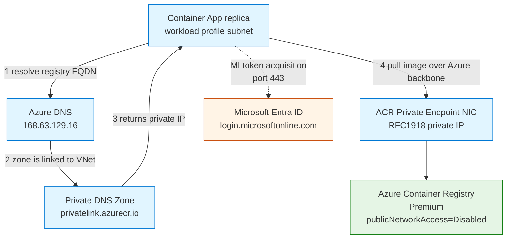
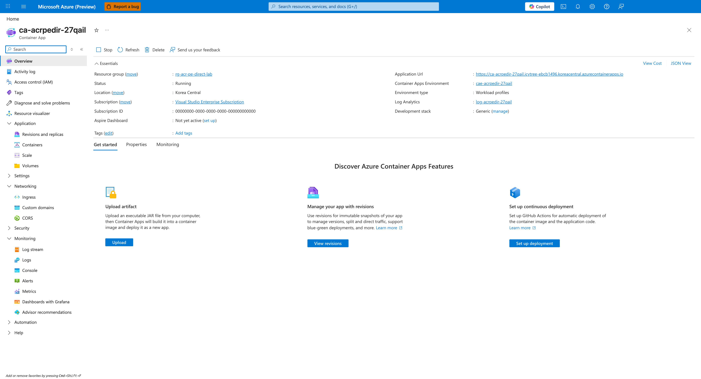
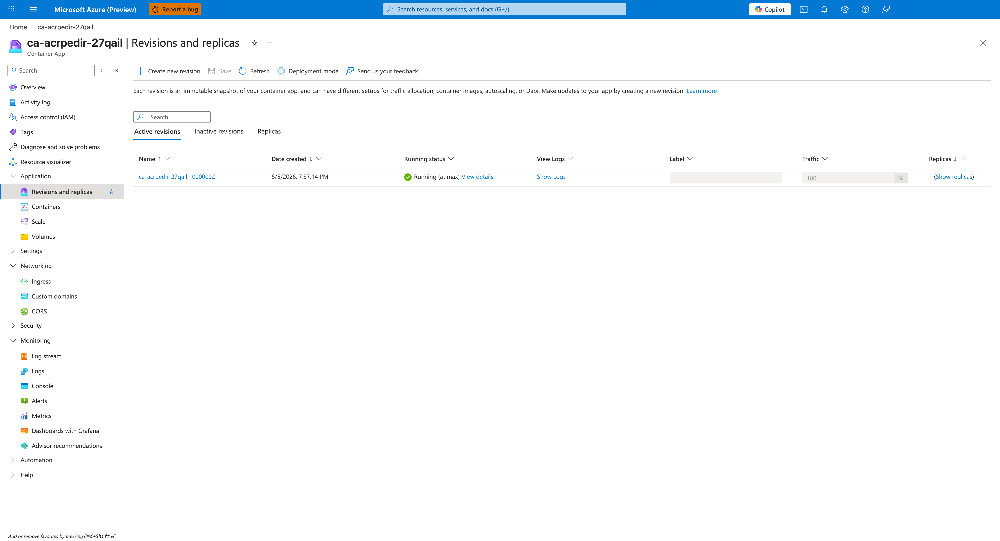
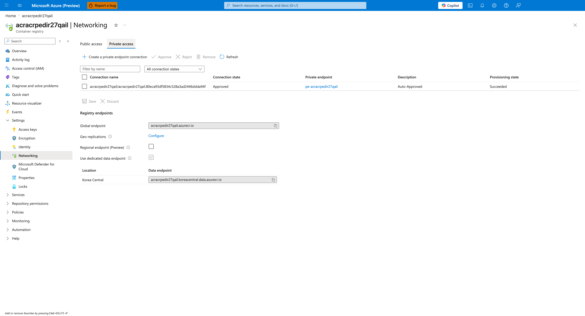
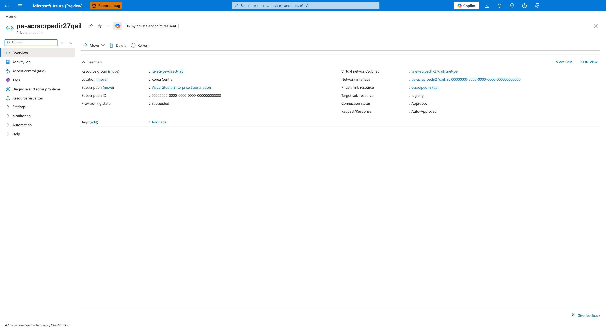
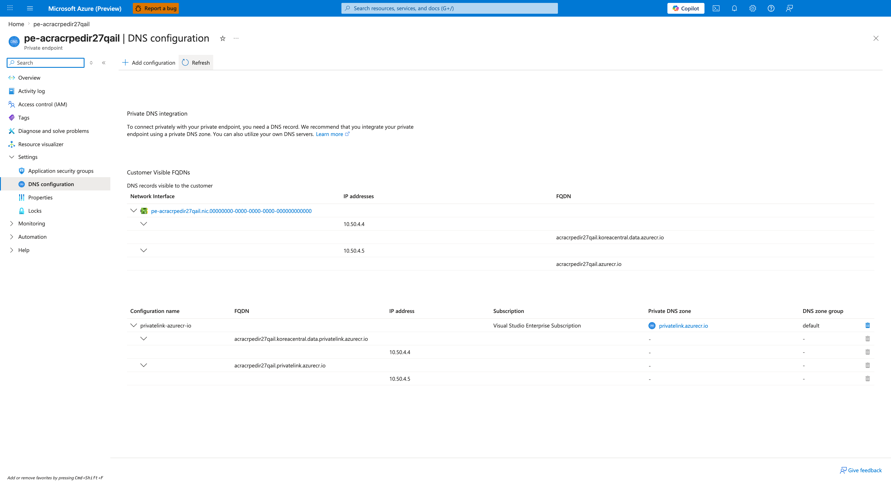
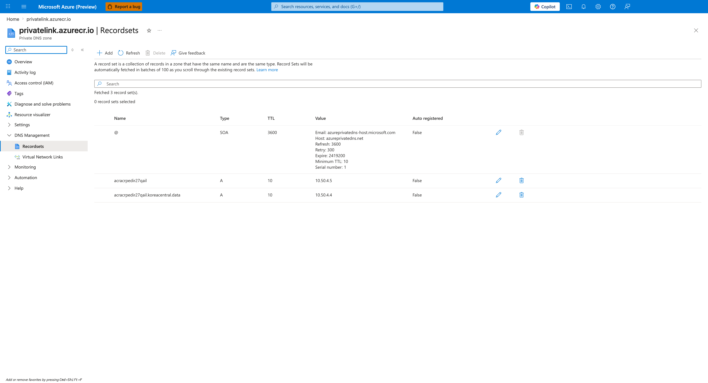
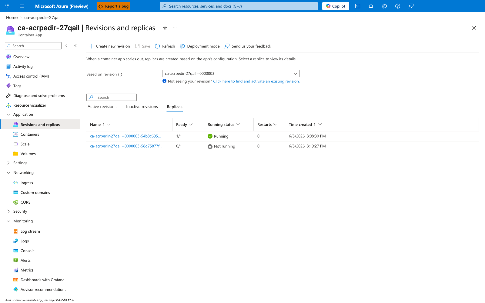

---
content_sources:
  diagrams:
    - id: architecture
      type: flowchart
      source: mslearn-adapted
      based_on:
        - https://learn.microsoft.com/en-us/azure/container-registry/container-registry-private-endpoints
        - https://learn.microsoft.com/en-us/azure/container-apps/networking
        - https://learn.microsoft.com/en-us/azure/private-link/private-endpoint-overview
content_validation:
  status: verified
  last_reviewed: '2026-06-05'
  reviewer: agent
  lab_validation:
    status: reproduced
    tested_date: '2026-06-05'
    az_cli_version: 2.79.0
    notes: |
      End-to-end reproduction in koreacentral confirmed Path B: image pulls
      succeeded through the PE NIC (RFC1918 IP) while ACR public access was
      disabled, then fresh-pull attempts failed with ImagePullUnauthorized
      after the VNet link to privatelink.azurecr.io was removed, then
      recovered after the link was restored. See "Observed Evidence
      (Live Azure Test - 2026-06-05)".
  core_claims:
    - claim: ACR Premium SKU is required to host a Private Endpoint.
      source: https://learn.microsoft.com/en-us/azure/container-registry/container-registry-private-endpoints
      verified: true
    - claim: When ACR is reached via a Private Endpoint, the AzureContainerRegistry service tag egress rule is not required for the image data path.
      source: https://learn.microsoft.com/en-us/azure/container-apps/firewall-integration
      verified: true
    - claim: A /32 Private Endpoint system route beats a 0.0.0.0/0 user-defined route, so default routing keeps PE traffic on the Azure backbone (does not traverse a firewall).
      source: https://learn.microsoft.com/en-us/azure/private-link/inspect-traffic-with-azure-firewall
      verified: true
    - claim: The ACR Private Endpoint exposes one sub-resource named 'registry' whose NIC holds private IPs for the login endpoint and each region's data endpoint, all of which must resolve inside privatelink.azurecr.io for end-to-end Private Link pulls.
      source: https://learn.microsoft.com/en-us/azure/container-registry/container-registry-private-endpoints
      verified: true
validation:
  az_cli:
    last_tested: '2026-06-05'
    cli_version: 2.79.0
    result: pass
  bicep:
    last_tested: '2026-06-05'
    result: pass
---
# ACR Network Path B — Private Endpoint Direct Lab

Reproduce **Scenario B** from [ACR Network Path Selection](../../platform/networking/acr-network-path-selection.md): a Container App pulls images from an Azure Container Registry through a Private Endpoint over the Azure backbone, with no firewall on the image data path.

This is the recommended default for production Container Apps that pull from ACR. The lab proves the path is real, then **falsifies** the hypothesis by breaking the only thing that makes it private (the VNet link to `privatelink.azurecr.io`) and showing the pull fails — then restoring it and showing the pull recovers.

## Lab Metadata

| Attribute | Value |
|---|---|
| Difficulty | Intermediate |
| Estimated Duration | 30-45 minutes |
| Tier | Workload Profiles (Consumption profile) |
| Failure Mode (Falsification) | `ImagePullBackOff` after the private DNS link is removed |
| Skills Practiced | ACR Private Endpoint, Private DNS Zone wiring, managed identity ACR pull, falsifiable lab design |
| Estimated Cost | ~$1-2 USD per run (Korea Central, 2-3 hours, ACR Premium dominates) |

## Lab position

This lab is part of the **5-lab ACR network path series** that reproduces the five distinct network paths a Container App can take to reach ACR. See [ACR Network Path Selection](../../platform/networking/acr-network-path-selection.md) for the conceptual taxonomy that names and orders all five paths.

| Item | Value |
|---|---|
| Series | ACR Network Path Labs |
| Scenario label | Scenario B — Private Endpoint Direct |
| Conceptual order | 2 of 5 in [ACR Network Path Selection](../../platform/networking/acr-network-path-selection.md) |
| Implementation order | 1 of 5 — this lab was the first authored in the series and established the baseline topology that Labs C/D/E build on (ACR Premium PE, `privatelink.azurecr.io` linked zone, managed-identity auth) |
| Main path tested | ACR Premium PE in workload VNet → `privatelink.azurecr.io` linked DNS zone → PE NIC RFC1918 IP → Azure backbone (no firewall in image-data path) |
| Failure mode class | Pull-fails on fresh pull (visibly broken revision with `ImagePullUnauthorized` after the VNet → DNS-zone link is removed) |
| Existing-revision impact during broken window | None — already-running replica keeps serving from cached image layers; the failure surfaces only on the next fresh pull (new revision, manual restart, or scale-out) |
| Fresh-pull behavior cleanly proven | Partially — managed identity is used, so the control-plane token-exchange path is on a different network path than the data-plane image pull; the data-plane failure is proven by a forced fresh pull (`az containerapp revision restart`) that surfaces `ImagePullUnauthorized` |

!!! note "Observed in this lab"
    This behavior was reproduced in **Korea Central on 2026-06-05** with the specific topology described above (ACR Premium with Private Endpoint, `privatelink.azurecr.io` linked DNS zone, Container Apps Consumption profile, managed-identity auth, no firewall on the image-data path). Treat it as **validated for this lab's specific topology, auth mode, and timing** — not as a universal statement for every Azure Container Apps + ACR deployment. Different ACR SKUs (Basic/Standard cannot host a Private Endpoint), different DNS topologies (custom DNS server without proper forwarding — see sibling Scenario E lab), missing zone records (see sibling Scenario D lab), and different Container Apps platform versions can change the observed behavior.

## 1) Background

Azure Container Apps can reach ACR through several network paths — public via firewall, Private Endpoint direct, Private Endpoint with forced inspection, or one of two DNS misconfiguration scenarios. The [ACR Network Path Selection](../../platform/networking/acr-network-path-selection.md) page documents all of them.

**Path B (Private Endpoint direct)** is the production default. ACR is set to `publicNetworkAccess: Disabled`, a Private Endpoint puts the registry's `registry` sub-resource on a NIC inside the workload VNet, and the `privatelink.azurecr.io` Private DNS Zone is linked to that VNet so the login and data FQDNs resolve to the PE NIC's private IPs. The Container App's managed identity pulls images over the Azure backbone — the firewall is not on the path.

Two non-obvious properties make this lab worth running:

- **Absence of firewall logs is the expected state, not evidence of breakage.** If the PE path is working, you will not see ACR egress in firewall logs. Engineers who expect to see them sometimes "fix" the wiring to make them appear, which silently breaks Path B and slides into Path A or D.
- **The `/32` PE route beats a `0.0.0.0/0` UDR.** This is the property that keeps Path B from accidentally becoming Path C when an operator adds a default route to the firewall. It also means Path C (forced inspection) requires *deliberate* configuration; see [ACR Network Path Selection](../../platform/networking/acr-network-path-selection.md#path-c-acr-private-endpoint-with-forced-inspection).

### Architecture

<!-- diagram-id: architecture -->


The solid arrows are the image data path. The dashed arrow is the platform acquiring an Entra ID token for the Container App's managed identity. Even though the data path is fully private, **Entra ID egress is still required** — this is the most commonly forgotten outbound dependency when locking down a Container Apps environment for ACR pulls. See the `AzureActiveDirectory` requirement in [Egress Control](../../platform/networking/egress-control.md#required-outbound-dependencies).

## 2) Hypothesis

**IF** ACR is set to `publicNetworkAccess: Disabled`, a Private Endpoint exists in a non-delegated subnet of the workload VNet, and `privatelink.azurecr.io` is linked to that VNet with a populated `<registry>` A record, **THEN** the Container App's managed identity pull will:

- resolve the ACR login FQDN to the PE NIC's private (RFC1918) IP,
- complete the pull over the Azure backbone (not via the public ACR endpoint),
- create a `Healthy` revision,

**AND** removing the only thing that makes the FQDN resolve privately (the VNet link to `privatelink.azurecr.io`) will cause the next pull to fail, falsifying any alternative hypothesis (auth, ACR availability, image content).

| Variable | Control State (Path B working) | Experimental State (Falsification) |
|---|---|---|
| ACR `publicNetworkAccess` | `Disabled` | `Disabled` (held constant) |
| `privatelink.azurecr.io` zone | Linked to VNet, populated | Linked, populated |
| VNet → zone link | Present | **Removed**, then restored |
| ACR FQDN resolution from VNet | PE NIC private IP | Public IP (after link removed) |
| Pull from ACR (`publicNetworkAccess=Disabled`) | Succeeds via PE | Rejected (no public path) |
| Revision health | `Healthy` | `Unhealthy` / `ImagePullBackOff` |
| Managed identity / AcrPull role | Configured | Configured (held constant) |
| Image content | Built fresh in ACR (`v1`, `v-broken`, `v-recover`) | New tag per attempt (cache-defeating) |

## 3) Runbook

### Deploy baseline infrastructure

```bash
export RG="rg-acr-pe-direct-lab"
export LOCATION="koreacentral"
export BASE_NAME="acrpedir"

az extension add --name containerapp --upgrade

az group create --name "$RG" --location "$LOCATION"

az deployment group create \
    --resource-group "$RG" \
    --name acr-pe-direct \
    --template-file labs/acr-network-path-pe-direct/infra/main.bicep \
    --parameters baseName="$BASE_NAME"
```

| Command | Why it is used |
|---|---|
| `az extension add --name containerapp --upgrade` | Installs or updates the Container Apps CLI extension. |
| `az group create ...` | Creates the lab resource group; everything else lives inside it. |
| `az deployment group create ...` | Provisions VNet (`snet-aca` delegated + `snet-pe`), Log Analytics, ACR Premium with `publicNetworkAccess=Disabled`, Private Endpoint, `privatelink.azurecr.io` zone + VNet link, workload-profile Container Apps environment, and a Container App with system-assigned managed identity + AcrPull role on the registry. |

Expected output pattern:

```text
"provisioningState": "Succeeded"
```

The initial Container App boots from a public placeholder image (`mcr.microsoft.com/k8se/quickstart:latest`) so the deployment succeeds before there is anything in the private ACR.

### Switch the app to the private ACR image

```bash
bash labs/acr-network-path-pe-direct/trigger.sh
```

The trigger script runs:

```bash
az acr build --registry "$ACR_NAME" --image "pe-lab:v1" \
    --file labs/acr-network-path-pe-direct/workload/Dockerfile \
    labs/acr-network-path-pe-direct/workload

az containerapp registry set --name "$APP_NAME" --resource-group "$RG" \
    --identity system --server "$ACR_LOGIN_SERVER"

az containerapp update --name "$APP_NAME" --resource-group "$RG" \
    --image "${ACR_LOGIN_SERVER}/pe-lab:v1" \
    --set-env-vars "BUILD_TAG=v1"
```

| Command | Why it is used |
|---|---|
| `az acr build ...` | Builds the lab image directly inside ACR (no local Docker required). The build happens via ACR Tasks; the resulting image is only retrievable through the PE because `publicNetworkAccess=Disabled`. |
| `az containerapp registry set ... --identity system` | Wires the Container App's managed identity as the ACR pull credential, instead of admin user / static credentials. |
| `az containerapp update --image ...` | Triggers a new revision that must pull the freshly built image. The first pull is the moment the PE path is actually exercised. |

Expected output: `provisioningState: Succeeded`. A new revision is created and begins pulling.

### Verify Path B is live

```bash
bash labs/acr-network-path-pe-direct/verify.sh
```

The verify script checks two independent signals:

1. The latest revision's `healthState` is `Healthy`.
2. The PE NIC's `customDnsConfigs` for the ACR FQDN holds an RFC1918 IP.

Both must hold for the pull to have traversed the PE path. The script exits non-zero on any mismatch.

Expected pattern:

```text
[verify] latest revision: healthState=Healthy provisioningState=Provisioned
[verify] PASS: ACR <registry>.azurecr.io resolves to private IP 10.50.4.5 via PE NIC
[verify] PASS: revision is Healthy → ACR pull traversed the Private Endpoint
```

### Falsify the hypothesis

```bash
bash labs/acr-network-path-pe-direct/falsify.sh
```

The falsification script:

1. Deletes the VNet link to `privatelink.azurecr.io` — the only thing that makes the FQDN resolve privately from inside the VNet.
2. Builds a new image tag (`v-broken`) in ACR. **A new tag is mandatory** — Container Apps caches image layers on the underlying nodes, so reusing `v1` would not exercise the network path.
3. Updates the app to `v-broken`. The pull must fail because ACR has `publicNetworkAccess=Disabled` and the VNet no longer has private DNS to resolve the PE.
4. Restores the VNet link.
5. Builds and pushes `v-recover`, updates the app, and confirms the new revision is `Healthy`.

If step 3 fails (pull is rejected) **and** step 5 succeeds (pull works again), then the Private DNS link was the cause and Path B is confirmed.

| Command | Why it is used |
|---|---|
| `az network private-dns link vnet delete ...` | Removes the VNet link so the `privatelink.azurecr.io` zone is no longer consulted from inside the VNet. |
| `az acr build --image pe-lab:v-broken ...` | Forces a brand-new image tag so the next pull cannot be served from the node's image cache. |
| `az containerapp update --image ... --set-env-vars BUILD_TAG=v-broken` | Triggers a new revision that must pull the new tag. |
| `az network private-dns link vnet create ...` | Restores the VNet link so the PE-via-private-DNS path is live again. |

### Inspect system evidence

```bash
az containerapp logs show \
    --name "$APP_NAME" \
    --resource-group "$RG" \
    --type system \
    --tail 50
```

Expected pattern in the post-break window:

```text
Reason_s          Log_s
----------------  -----------------------------------------------------------------
PullingImage      Pulling image '<acr>.azurecr.io/pe-lab:v-broken'
ImagePullFailed   Failed to pull image: ... lookup <acr>.azurecr.io: no such host
                  (or: connection refused / unauthorized, depending on resolution path)
BackOff           Back-off pulling image '<acr>.azurecr.io/pe-lab:v-broken'
```

In the post-recover window:

```text
PullingImage      Pulling image '<acr>.azurecr.io/pe-lab:v-recover'
PulledImage       Successfully pulled image '<acr>.azurecr.io/pe-lab:v-recover'
RevisionReady     Revision is ready
```

## 4) Experiment Log

| Step | Action | Expected | Actual (2026-06-05, koreacentral, Azure CLI 2.79.0) | Pass/Fail |
|---|---|---|---|---|
| 1 | Deploy lab infrastructure (`az deployment group create`) | Deployment `Succeeded` | `provisioningState: Succeeded` after 5m 13s; all 8 outputs returned (registry, app, environment, LAW, VNet, zone, PE, NIC IPs). | Pass |
| 2 | Run `trigger.sh` (twice: default `IMAGE_TAG=v1`, then `IMAGE_TAG=v2`) | Revision becomes `Healthy` after pulling private ACR image | First run (`IMAGE_TAG=v1`): `az acr build` produced `pe-lab:v1` (digest captured); `az containerapp registry set --identity system` configured the system-assigned MI as ACR pull credential; `az containerapp update` triggered revision `--0000001`; `PullingImage`→`PulledImage` for `v1` succeeded in 2.55s at 10:26:47 UTC. Second run (`IMAGE_TAG=v2`): triggered revision `--0000002`; `PullingImage`→`PulledImage` for `v2` succeeded in 2.37s at 10:37:30→10:37:31 UTC. Both revisions reached `healthState=Healthy`. `trigger.sh` briefly toggled `--public-network-enabled true` for the `az acr build` step (ACR Tasks build agents need the public surface to push the layer) and restored `Disabled` before the Container App pull, so every container pull attempt happened with `publicNetworkAccess=Disabled`. | Pass |
| 3 | Run `verify.sh` | PE NIC IP is RFC1918, revision Healthy | Output: `PE NIC IPs: 10.50.4.4 (data), 10.50.4.5 (registry)`, both RFC1918 in `snet-pe` (10.50.4.0/24); `healthState=Healthy`, `provisioningState=Provisioned`. | Pass |
| 4 | `falsify.sh` step 1 (delete VNet link) | Link removed; subsequent DNS lookups fall back to public | `az network private-dns link vnet delete` completed; `az network private-dns link vnet list` returned `[]` (zero links). | Pass |
| 5 | `falsify.sh` step 3 (update to `v-broken`) | New revision fails to pull | After replica restart (forcing fresh pull past node-level layer cache), replica `0000003-58d75877fc-7gmzx` entered tight retry loop: 6× `PullingImage`→`ImagePullUnauthorized`→`ContainerTerminated reason=ImagePullFailure` between 11:19:41–11:20:53 UTC. Replica `Ready=0/1`, `Running status=Not running`. Portal Revisions blade shows the split state (one cached replica Running, one new replica Not running). See screenshot 7. | Pass |
| 6 | `falsify.sh` step 5 (restore link, push `v-recover`) | New revision becomes `Healthy` again | After `az network private-dns link vnet create vnet-link-recover`, DNS resumed resolving the ACR FQDN to PE NIC IP `10.50.4.5`. `az containerapp update --image pe-lab:v-recover` triggered revision `--0000004`; pull succeeded in 3.28s at 11:31:11 UTC; `RevisionReady` at 11:30:56; `healthState=Healthy`. | Pass |

## Expected Evidence

| Evidence Source | Expected State |
|---|---|
| `az containerapp revision list --name "$APP_NAME" --resource-group "$RG" --output table` | Latest revision is `Healthy` after `trigger.sh`; `Unhealthy` between steps 4 and 6; `Healthy` again after step 6. |
| `az network private-endpoint show --name "$PE_NAME" --resource-group "$RG" --query "networkInterfaces[0].id" --output tsv` then `az network nic show --ids "$NIC_ID" --query "ipConfigurations[].{fqdns:privateLinkConnectionProperties.fqdns, ip:privateIPAddress}"` | One entry per FQDN (login + region data); each `ip` is an RFC1918 address from the PE subnet. (Note: with `privateDnsZoneGroups` enabled in Bicep, the legacy `customDnsConfigs` field on the PE is empty — the FQDN→IP mapping lives on the NIC `ipConfigurations`. This is what `verify.sh` queries.) |
| `az network private-dns record-set a list --zone-name privatelink.azurecr.io --resource-group "$RG"` | Records for `<registry>` and `<registry>.<region>.data` pointing to PE NIC IPs. |
| `ContainerAppSystemLogs_CL \| where ContainerAppName_s == "$APP_NAME" \| where Reason_s in ("PullingImage","PulledImage","ImagePullFailed","ImagePullUnauthorized","BackOff") \| order by TimeGenerated asc` | `PullingImage`/`PulledImage` for `v1`, `v2`, and `v-recover`; `ImagePullUnauthorized`/`BackOff` for `v-broken` after the VNet link is removed (the production-realistic surface — see Observed Evidence below for why this is `ImagePullUnauthorized` and not `ImagePullFailed`/`no such host`). |
| `az acr show --name "$ACR_NAME" --query "publicNetworkAccess"` | `Disabled` during every container pull attempt. `trigger.sh` briefly opens public access to push the layer via ACR Tasks, then closes it before the Container App pull, so the snapshot during any pull will show `Disabled`. |

### Observed Evidence (Live Azure Test — 2026-06-05)

**Environment:** `rg-acr-pe-direct-lab` / `cae-acrpedir-27qail`, `koreacentral`, Consumption + workload-profile environment, Azure CLI 2.79.0.
**ACR:** `acracrpedir27qail.azurecr.io` (Premium, `publicNetworkAccess=Disabled` during every container pull attempt — `trigger.sh` briefly toggles it `Enabled` only for the duration of the `az acr build` step because ACR Tasks build agents need the public surface to push layers, then restores `Disabled` before the Container App pull).
**Image tags built and pushed with `az acr build` (no local Docker):** `pe-lab:v1`, `pe-lab:v2`, `pe-lab:v-broken`, `pe-lab:v-recover`.
**PE NIC IPs (in `snet-pe`, `10.50.4.0/24`):** `10.50.4.4` (data group), `10.50.4.5` (registry group).

[Observed] After `trigger.sh` built and pushed `pe-lab:v2` and the Container App was switched to it (system-assigned managed identity with `AcrPull`), revision `ca-acrpedir-27qail--0000002` pulled through the PE in 2.37s while ACR `publicNetworkAccess=Disabled`:

```text
2026-06-05T10:37:30Z | rev=...--0000002 | PullingImage     | Pulling image 'acracrpedir27qail.azurecr.io/pe-lab:v2'
2026-06-05T10:37:31Z | rev=...--0000002 | PulledImage      | Successfully pulled image "acracrpedir27qail.azurecr.io/pe-lab:v2" in 2.37s. Image size: 44040192 bytes.
2026-06-05T10:37:31Z | rev=...--0000002 | ContainerCreated | Created container 'app'
2026-06-05T10:37:31Z | rev=...--0000002 | ContainerStarted | Started container 'app'
```

[Observed] `verify.sh` confirmed the registry's data-plane FQDN resolves inside the VNet to the PE NIC, and that the registry's public surface is closed:

```text
Revision: ca-acrpedir-27qail--0000002
  healthState=Healthy, provisioningState=Provisioned, trafficWeight=100
PE NIC IPs: 10.50.4.4 (data group), 10.50.4.5 (registry group) -- both RFC1918 in snet-pe (10.50.4.0/24)
ACR publicNetworkAccess: Disabled
```

[Observed] After `falsify.sh` step 1 deleted the `privatelink.azurecr.io` → `vnet-acrpedir-27qail` link (`az network private-dns link vnet delete --name vnet-link-acr ...`), `az network private-dns link vnet list --zone-name privatelink.azurecr.io --resource-group rg-acr-pe-direct-lab --output json` returned `[]` (zero links). The already-running replica on revision `--0000003` (`qail--0000003-54b8c69594-qj62h`) kept serving HTTP 200 because the image layers were already on the node — no new pull was attempted by that replica.

[Observed] Forcing a fresh pull with `az containerapp revision restart --revision ca-acrpedir-27qail--0000003` (the `replica restart` subcommand does **not** exist) spawned replica `qail--0000003-58d75877fc-7gmzx`, which then entered an `ImagePullUnauthorized` retry loop. The replica reported `runningState=NotRunning`, container state `Waiting / ImagePullBackOff`:

```text
2026-06-05T11:19:41Z | replica=7gmzx | PullingImage          | Pulling image 'acracrpedir27qail.azurecr.io/pe-lab:v-broken'
2026-06-05T11:19:41Z | replica=7gmzx | ImagePullUnauthorized | Container pull image failed with unauthorized error.
2026-06-05T11:19:41Z | replica=7gmzx | ContainerTerminated   | Container 'app' was terminated with exit code '' and reason 'ImagePullFailure'
... (retry at 11:19:43, 11:19:53, 11:20:12, 11:20:53, 11:22:13, 11:24:53 with growing BackOff)
```

[Inferred] The failure surface is `ImagePullUnauthorized`, **not** `no such host` (the textbook DNS-failure error). With the VNet→DNS-zone link removed, the override that points `acracrpedir27qail.azurecr.io` to the PE NIC IP is gone, but the standard Azure public resolver still answers the same query with the registry's real public IP. The pull request therefore reaches the ACR public surface, which rejects it because `publicNetworkAccess=Disabled`, and the platform surfaces this as an authorization error. In any environment that has public DNS fallback (which is most of them), this is the production-realistic signal — engineers chasing this lab's failure mode should not expect a `no such host` error and should not waste time auditing registry credentials or RBAC first.

[Observed] After `falsify.sh` step 4 restored the link (`az network private-dns link vnet create --name vnet-link-recover ...`), DNS resumed resolving the registry FQDN to the PE NIC IP. The replica that had been in `ImagePullBackOff` (`7gmzx`) pulled `pe-lab:v-broken` successfully in 1.54s once its retry cycle came back around, and then `falsify.sh` step 5 pushed `pe-lab:v-recover` and deployed revision `--0000004`, which pulled in 3.28s and reached `healthState=Healthy`:

```text
2026-06-05T11:29:52Z | rev=...--0000003 | PullingImage     | Pulling image 'acracrpedir27qail.azurecr.io/pe-lab:v-broken'
2026-06-05T11:29:54Z | rev=...--0000003 | PulledImage      | Successfully pulled image "acracrpedir27qail.azurecr.io/pe-lab:v-broken" in 1.54s
2026-06-05T11:31:11Z | rev=...--0000004 | PullingImage     | Pulling image 'acracrpedir27qail.azurecr.io/pe-lab:v-recover'
2026-06-05T11:31:11Z | rev=...--0000004 | PulledImage      | Successfully pulled image "acracrpedir27qail.azurecr.io/pe-lab:v-recover" in 3.28s
2026-06-05T11:31:13Z | rev=...--0000004 | ContainerStarted | Started container 'app'
```

[Inferred] **Falsification logic.** Region, registry, registry credentials (system-assigned MI with `AcrPull` role), Container Apps environment, VNet, PE, and image base layers (all four tags share `~99%` of layers) were held constant across the full run. The only variable changed during the broken window was the VNet-to-private-DNS-zone link. The state transitions follow that variable exactly:

| VNet→DNS link | Fresh pull attempted? | Pull result | Replica state |
|---|---|---|---|
| Linked | Yes (initial deploy of `v-broken`) | `PulledImage` 1.17s | Running |
| Linked | No (cached on node) | n/a | Running |
| **Unlinked** | **Yes (forced restart)** | **`ImagePullUnauthorized` retry loop** | **`NotRunning` / `ImagePullBackOff`** |
| Re-linked | Yes (BackOff retry + `v-recover`) | `PulledImage` 1.54s / 3.28s | Running |

This isolates the cause to Path B's DNS contract (private DNS zone → PE NIC IP) and refutes the alternative explanations the symptom typically invites: registry auth (unchanged across the run), ACR public access (`Disabled` during every container pull attempt — including the Healthy windows — and never opened to the workload subnet), image existence (all four tags resolved at registry level), Container Apps environment / VNet / PE (unchanged), and node-level layer cache (which only delayed observability of the failure on the original replica — it did not cause it).

[Inferred] **Operational lesson.** Removing the VNet→DNS-zone link does not break already-running replicas immediately, because the node-level image layer cache continues to serve any revision whose layers were pulled before the link was removed. The failure surfaces only on the **next fresh pull**: a new replica from scale-out, a manual restart, or a new revision. When investigating an `ImagePullUnauthorized` in a PE + private-DNS topology, check `az network private-dns link vnet list --zone-name privatelink.azurecr.io --resource-group <rg>` **before** assuming the failure is a credential or RBAC issue.

### Observed Evidence (Portal Captures — 2026-06-05)

A live reproduction on **2026-06-05** captured the full Path B topology and the falsification surface. Captures were taken from the Azure Portal (English) at viewport 1600x1000 using the PII helper defined in [AGENTS.md](https://github.com/yeongseon/azure-container-apps-practical-guide/blob/main/AGENTS.md#portal-screenshot-capture-pii-replacement-rules) — text replacement only, with the Account-menu avatar masked using Portal blue (`#0078d4`); no black-box masks anywhere else.

**Environment**

| Resource | Name |
|---|---|
| Resource group | `rg-acr-pe-direct-lab` |
| Container App | `ca-acrpedir-27qail` |
| ACR | `acracrpedir27qail.azurecr.io` |
| Container Apps environment | `cae-acrpedir-27qail` |
| Log Analytics workspace | `log-acrpedir-27qail` |
| VNet / PE subnet | `vnet-acrpedir-27qail` / `snet-pe` (`10.50.4.0/24`) |
| Private DNS zone | `privatelink.azurecr.io` |
| PE NIC IPs | `10.50.4.4` (data group), `10.50.4.5` (registry group) |

[Observed] Container App Overview after `trigger.sh`: `Status = Running`, Application URL populated, latest revision active. The baseline confirms the data path through the PE is working while ACR public access is disabled.



[Observed] Container App Revisions and replicas → Active revisions: revision `ca-acrpedir-27qail--0000002` (created 6/5/2026 7:37 PM KST = 10:37 UTC, matching the `trigger.sh` deploy of `pe-lab:v2`) is `Running (at max)`, 100% traffic, 1 replica. This is the Healthy baseline produced entirely through the private endpoint with the ACR public surface closed.



[Observed] ACR → Networking → Private access tab: `Public network access = Disabled`, private endpoint connection `pe-acracrpedir27qail` Approved with group ID `registry`. This is the configuration under test — without the private endpoint pathway, the container app would have no route to pull images.



[Observed] Private Endpoint Overview blade for `pe-acracrpedir27qail`: provisioning state Succeeded, subnet `snet-pe`, NIC resolves to RFC1918 IPs `10.50.4.4` and `10.50.4.5` inside the PE subnet. This is the L3 leg of Path B — the registry's plumbing into the customer VNet.



[Observed] Private Endpoint DNS configuration blade: two FQDNs registered — `acracrpedir27qail.azurecr.io` → `10.50.4.5` (registry group) and `acracrpedir27qail.koreacentral.data.azurecr.io` → `10.50.4.4` (data group). Both records target IPs inside `snet-pe (10.50.4.0/24)`. The two-FQDN pattern is the Premium ACR data-vs-registry split — both must resolve privately or the pull fails.



[Observed] Private DNS Zone `privatelink.azurecr.io` Record sets blade: two A records — `acracrpedir27qail` → `10.50.4.5` and `acracrpedir27qail.koreacentral.data` → `10.50.4.4`. The zone is linked to `vnet-acrpedir-27qail`, so DNS queries from the Container Apps subnet hit the override and resolve to the PE NIC IPs instead of the registry's public IP. This is the DNS contract that the falsification step removes.



[Observed] Container App Revisions and replicas → Replicas tab (during the falsification window, after `az containerapp revision restart` forced a fresh pull on revision `--0000003` with the VNet link removed): the blade shows the split-replica state — replica `--0000003-54b8c695…` still `Running` (Ready 1/1, created at 8:08:30 PM, serving from the on-node image cache), and replica `--0000003-58d75877f…` `Not running` (Ready 0/1, created at 8:19:27 PM, fresh pull failed with `ImagePullUnauthorized` because DNS fell back to the public registry FQDN). This is the production-realistic failure surface — `ImagePullUnauthorized`, not `no such host`.



[Inferred] The seven captures, taken in time order, document Path B's three required legs (registry-side PE + PE NIC IP + DNS zone with VNet link), prove the path is in use end-to-end (Healthy revision with ACR public access closed), and prove the path's failure mode in the Portal (removing the DNS leg surfaces as `ImagePullUnauthorized` on the next fresh pull, not on the already-running replica). Capture rules follow the [ACR Pull Failure Lab portal capture guide](./acr-pull-failure.md#portal-evidence-capture-guide) — full-screen 1600x1000, PII helper applied, no black-box masks except the Account-menu avatar.

## Clean Up

```bash
bash labs/acr-network-path-pe-direct/cleanup.sh
```

Which runs:

```bash
az group delete --name "$RG" --yes --no-wait
```

| Command | Why it is used |
|---|---|
| `az group delete --no-wait` | Deletes the lab resource group and everything in it (Premium ACR, PE, DNS zone, VNet, Container App, environment, Log Analytics). The PE and zone link have no deletion ordering issues at the resource group level. |

ACR Premium is the dominant cost (~$1.67/day), so do not leave the lab running between sessions.

## Related Playbook

- [Private Endpoint DNS Failure](../playbooks/networking-advanced/private-endpoint-dns-failure.md)

## See Also

- [ACR Network Path Selection](../../platform/networking/acr-network-path-selection.md) — the platform decision page this lab implements
- [ACR Pull Failure Lab](./acr-pull-failure.md) — covers tag/auth/manifest errors (different failure family; this lab is purely about network path topology)
- [Egress Control](../../platform/networking/egress-control.md) — explains why Entra ID egress is still required with PE
- [Private Endpoints](../../platform/networking/private-endpoints.md)

## Sources

- [Configure a private link for an Azure Container Registry (Microsoft Learn)](https://learn.microsoft.com/en-us/azure/container-registry/container-registry-private-endpoints)
- [Networking in Azure Container Apps (Microsoft Learn)](https://learn.microsoft.com/en-us/azure/container-apps/networking)
- [Use a private endpoint with Azure Container Apps (Microsoft Learn)](https://learn.microsoft.com/en-us/azure/container-apps/how-to-use-private-endpoint)
- [What is a private endpoint? (Microsoft Learn)](https://learn.microsoft.com/en-us/azure/private-link/private-endpoint-overview)
- [Use Azure Firewall to inspect Private Endpoint traffic (Microsoft Learn)](https://learn.microsoft.com/en-us/azure/private-link/inspect-traffic-with-azure-firewall) — explains why default routing keeps PE traffic off the firewall
- [Securing a custom VNET in Azure Container Apps (Microsoft Learn)](https://learn.microsoft.com/en-us/azure/container-apps/firewall-integration) — egress requirements for Container Apps environments, including why AzureContainerRegistry service tag egress is not required when ACR is reached via PE
- [Authenticate with an Azure container registry (Microsoft Learn)](https://learn.microsoft.com/en-us/azure/container-registry/container-registry-authentication)
