---
content_sources:
  diagrams:
    - id: architecture
      type: flowchart
      source: mslearn-adapted
      based_on:
        - https://learn.microsoft.com/en-us/azure/private-link/manage-private-endpoint
        - https://learn.microsoft.com/en-us/azure/virtual-network/virtual-networks-udr-overview
        - https://learn.microsoft.com/en-us/azure/container-apps/use-azure-firewall
        - https://learn.microsoft.com/en-us/azure/container-registry/container-registry-private-link
        - https://learn.microsoft.com/en-us/azure/firewall/firewall-diagnostics
validation:
  az_cli:
    last_tested: '2026-06-06'
    cli_version: 2.79.0
    result: pass
  bicep:
    last_tested: '2026-06-06'
    result: pass
---
# ACR Network Path C — PE with Forced Inspection Lab

Reproduce **Scenario C** from [ACR Network Path Selection](../../platform/networking/acr-network-path-selection.md): ACR is exposed only via a Private Endpoint (`publicNetworkAccess=Disabled`), the Container Apps workload subnet has a `0.0.0.0/0` UDR forcing default-route egress through an Azure Firewall for inspection, but the firewall is **silently bypassed** for ACR pull traffic unless the route table also contains explicit `/32` routes for each Private Endpoint NIC IP.

This lab is structurally different from the other four labs in the series. The other four labs (Path A firewall allowlist, Path B PE direct, Scenario D record-level split-brain, Scenario E DNS forwarder bypass) all reproduce a failure mode where the **pull itself fails** — a visibly broken revision with a smoking-gun error in `ContainerAppSystemLogs_CL` or `socket.getaddrinfo` returns the wrong IP. **Scenario C does not produce a failed pull in either the bypass case or the recover case.** The pulls succeed in both. The only variable that differs is whether the inspection firewall *sees* the pull happen. The lab's primary falsification signal is therefore the **silence** in `AZFWApplicationRule` during the bypass window, paired with the **presence** of the same rows during the baseline and recovery windows — a controlled three-state transition (`baseline sees ACR → bypass sees nothing → recover sees ACR again`) where the `/32` UDR routes for the PE NIC IPs are the single controlled variable and pull success is held constant throughout.

!!! warning "Why this is the worst-case-for-detection failure mode for a security team"
    An FQDN-based block/audit/inspection policy at the firewall has been silently disabled by a routing change that looks like it should be irrelevant. No `/32` routes were touched — only the implicit assumption that "default route still goes through the firewall, so all egress is inspected" was violated. The operator's mental model says: `0.0.0.0/0 -> firewall` covers everything that has not been explicitly excluded. Reality says: the system-injected `/32` route for the Private Endpoint wins by longest-prefix match over the `0.0.0.0/0` UDR, so PE traffic is **never inspected by default** even when the default route points at the firewall. The audit log goes silent. The pull keeps working. The security team's controls are bypassed without any alert firing — because nothing failed. This lab makes that silent failure mode *deterministic and falsifiable*: toggling exactly two `/32` UDR entries on the route table flips the firewall's visibility into ACR pulls without ever breaking the pull itself.

## Lab Metadata

| Attribute | Value |
|---|---|
| Difficulty | Intermediate |
| Estimated Duration | 45-60 minutes (Azure Firewall Basic provisioning is the dominant tail) |
| Tier | Workload Profiles (Consumption profile) |
| Failure Mode (Falsification) | Removing the `/32` UDR routes for both PE NIC IPs from the workload subnet's route table causes the firewall to be silently bypassed for ACR pull traffic: the v-bypass revision pulls successfully and becomes `Healthy` with `/` returning `build_tag=v-bypass`, but `AZFWApplicationRule` records **zero** new rows for the ACR FQDN since the bypass-deploy timestamp; re-adding the `/32` routes and deploying v-recover restores firewall visibility, proven by `AZFWApplicationRule` recording **new** rows for the ACR FQDN within ~60-120 seconds of the recover-deploy timestamp |
| Skills Practiced | Azure Firewall Basic provisioning (data + management public IPs, `AzureFirewallSubnet` + `AzureFirewallManagementSubnet`), firewall-policy application rules for ACR FQDNs (login + regional data endpoint), `0.0.0.0/0` UDR plus `/32` UDR routes for each PE NIC IP with next-hop = firewall private IP, ACR Premium Private Endpoint (`publicNetworkAccess=Disabled`) with `privatelink.azurecr.io` Private DNS Zone, PE NIC IP discovery via `nic.ipConfigurations[].privateLinkConnectionProperties.fqdns` (NOT `customDnsConfigs`, which is empty when `privateDnsZoneGroup` is configured), ACR admin-credential auth via `az containerapp registry set --username --password`, firewall resource-specific diagnostics via `logAnalyticsDestinationType: 'Dedicated'` to unlock `AZFWApplicationRule`, schema-tolerant `union isfuzzy=true` KQL pattern for diagnostic-table schema transitions, longest-prefix-match routing semantics for Private Endpoint traffic, distinguishing pull-success signals from inspection-visibility signals |
| Estimated Cost | ~$3-4 USD per run (Korea Central, 2-3 hours: Azure Firewall Basic + 2 public IPs ~$24/day dominates; ACR Premium $1.67/day; Container Apps + Private Endpoint + Log Analytics negligible) |

## Lab position

This lab is part of the **5-lab ACR network path series** that reproduces the five distinct network paths a Container App can take to reach ACR. See [ACR Network Path Selection](../../platform/networking/acr-network-path-selection.md) for the conceptual taxonomy that names and orders all five paths.

| Item | Value |
|---|---|
| Series | ACR Network Path Labs |
| Scenario label | Scenario C — PE with Forced Inspection |
| Conceptual order | 3 of 5 in [ACR Network Path Selection](../../platform/networking/acr-network-path-selection.md) |
| Implementation order | 5 of 5 — this lab was authored last and is the only lab in the series whose failure mode is *successful pull with silent inspection*, rather than a visibly broken pull |
| Main path tested | ACR Premium PE in workload VNet + `0.0.0.0/0` UDR to Azure Firewall + explicit `/32` UDR routes for both PE NIC IPs (login and regional data endpoint) forcing the firewall to be on the image-pull path |
| Failure mode class | Silent inspection bypass (pull succeeds in both states, firewall log silent in the broken state) — structurally different from the other four labs in this series whose failure mode is a visibly broken pull with an error in `ContainerAppSystemLogs_CL` |
| Existing-revision impact during broken window | None — pull succeeds throughout, no revision-health change ever; the only signal that moves is firewall log presence/absence |
| Fresh-pull behavior cleanly proven | Yes — admin credentials remove the managed-identity confound; the controlled variable is the `/32` UDR routes for the PE NIC IPs, and pull success is held constant while firewall visibility flips between the three states (baseline visible → bypass silent → recover visible) |

!!! note "Observed in this lab"
    This behavior was reproduced in **Korea Central on 2026-06-06** with the specific topology described above (ACR Premium PE, Azure Firewall Basic with FQDN application rules for ACR login and regional data endpoints, Container Apps Consumption profile, admin-credential auth, firewall diagnostics in `Dedicated` schema mode unlocking `AZFWApplicationRule`). Treat it as **validated for this lab's specific topology, auth mode, and timing** — not as a universal statement for every Azure Container Apps + ACR deployment. Phrases like "silently bypassed" throughout this lab refer to *this specific UDR-misconfiguration topology* (a `0.0.0.0/0` default route to a firewall NVA without explicit `/32` routes for each PE NIC IP). They are **not** a universal claim that Azure Firewall fails to inspect Private Endpoint traffic in every deployment — a different routing design (e.g. explicit `/32` UDR routes for each PE NIC IP from the start, or no `0.0.0.0/0` UDR at all) avoids the failure mode entirely; the mechanism (system-injected `/32` PE route beats `0.0.0.0/0` UDR by longest-prefix match) is documented in [Inspect private endpoint traffic with Azure Firewall](https://learn.microsoft.com/en-us/azure/private-link/inspect-traffic-with-azure-firewall).

## 1) Background

Azure Container Apps can reach ACR through several network paths — public via firewall, Private Endpoint direct, Private Endpoint with forced inspection, or one of two DNS failure scenarios. The [ACR Network Path Selection](../../platform/networking/acr-network-path-selection.md) page documents all of them and the decision table that distinguishes them.

**Scenario C (ACR Private Endpoint, forced inspection)** is the intentional production topology for regulated environments where the security team requires *all* outbound traffic — including Private Link traffic to first-party Azure services like ACR — to traverse a stateful firewall for inspection, FQDN-based access control, and application-rule logging. The naive implementation is: "we already have a `0.0.0.0/0` UDR forcing all `snet-aca` egress through Azure Firewall for our application traffic; therefore ACR pulls will be inspected too, because they leave from the same subnet." This is the trap Scenario C exposes.

The trap is in how the Azure VNet data plane resolves longest-prefix match for Private Endpoint traffic. When a Private Endpoint is provisioned in `snet-pe`, Azure injects a system route for the PE NIC IP — typically as a `/32` route with next-hop type `VirtualNetwork` — that exists in every subnet of the VNet (and in every peered subnet whose peering propagates `VirtualNetwork` routes). The `0.0.0.0/0` UDR pointing at the firewall has length `/0`. By longest-prefix match, the `/32` system route for the PE wins for every packet whose destination is the PE NIC IP. The result: replicas in `snet-aca` resolve `<registry>.azurecr.io` to the PE NIC private IP (via the linked `privatelink.azurecr.io` Private DNS Zone), then send the TCP SYN to that PE NIC IP, then the VNet data plane consults the route table, then the system `/32` route for the PE wins, then the packet goes **directly** to the PE NIC — not through the firewall. The firewall never sees the connection. The pull succeeds normally because the PE accepts it and forwards it to ACR over the Azure backbone. From a workload-success perspective, everything works; from an inspection-and-audit perspective, the firewall has been silently bypassed.

The fix is to add explicit `/32` UDR routes on `snet-aca`'s route table — one for each PE NIC private IP — with next-hop type `VirtualAppliance` and next-hop IP = the firewall's private IP. These customer-defined `/32` routes have the same prefix length as the system-injected `/32` routes but win because **customer-defined UDR routes always win over system routes when prefix length is equal**. With the customer `/32` routes in place, the longest-prefix match for a PE-bound packet picks the UDR route, the packet is delivered to the firewall, the firewall's application rule allows the ACR FQDN (or denies it, depending on the policy), the firewall logs the connection in `AZFWApplicationRule`, and then forwards the packet to the PE NIC. The pull succeeds *through the firewall*, and the firewall now has visibility into the traffic.

Three properties make Scenario C worth reproducing as a hands-on lab:

- **A `0.0.0.0/0` UDR does NOT cover Private Endpoint traffic by default.** This is the central misconception the lab exposes. Default-route UDRs cover the public-internet egress path but lose to the more-specific system `/32` route for Private Endpoints. The fix requires the operator to know two things that are not obvious from the Azure portal's UI: (1) which PE NIC IPs exist (the PE NIC holds *multiple* IPs when the service exposes multiple endpoints — for ACR Premium that is at least two: login and regional data), and (2) that customer-defined UDR `/32` routes win over system `/32` routes by the customer-route-precedence rule. The default-route UDR alone gives the operator the *illusion* that the firewall is in the path, when in reality the security boundary is silently bypassed for every Private Link service the VNet talks to.
- **Pull success is NOT a reliable signal of inspection state for PE traffic.** The pulls succeed in both the bypass case and the recover case. The replica becomes `Healthy` in both cases. The `/` endpoint returns the correct `build_tag` in both cases. There is no smoking gun in `ContainerAppSystemLogs_CL` because there is no error. The only authoritative signal for whether the pull traversed the firewall is the firewall's own diagnostic log stream — `AZFWApplicationRule` for FQDN-rule matches, `AZFWNetworkRule` for IP-rule matches. If the operator only monitors workload-layer health, the silent bypass is invisible. The lab's falsification design — `baseline visibility -> bypass silence -> recover visibility` with the `/32` routes as the single controlled variable — is the only way to prove the relationship deterministically, because no other observable signal changes.
- **The PE has multiple NIC IPs and both need `/32` routes.** ACR's Private Endpoint exposes a single `registry` sub-resource, but the PE NIC holds separate private IPs for the global/login endpoint (`<registry>.azurecr.io`) and for each region's dedicated data endpoint (`<registry>.<region>.data.azurecr.io`). In this lab's koreacentral deployment, the PE has two IPs: `10.90.2.4` (data endpoint) and `10.90.2.5` (login endpoint). If only one `/32` UDR route is added, the firewall sees one half of the pull conversation (the login auth) and is silent on the other half (the data layer download), or vice versa — depending on which IP was given a `/32` route. Both must be present. The PE NIC IPs themselves are not discoverable from `customDnsConfigs` when `privateDnsZoneGroup` is configured (that field is empty in that topology); instead, the IPs must be read from `nic.ipConfigurations[].privateLinkConnectionProperties.fqdns`, which exposes the FQDN-to-IP mapping for each individual endpoint behind the same PE sub-resource. `trigger.sh` does exactly this and then adds one `/32` UDR route per discovered IP.

The lab's outcome taxonomy enumerates the observable states across the baseline → bypass → recover cycle:

| State | `/32` UDR routes | New revision | Old revision | `/` response | Firewall log signal (`AZFWApplicationRule` for ACR FQDN) |
|---|---|---|---|---|---|
| Baseline (after `trigger.sh`) | present | v1 `Healthy` | n/a (bootstrap deactivated) | `{"build_tag": "v1", ...}` | **Has rows** for both `<registry>.azurecr.io` and `<registry>.koreacentral.data.azurecr.io` from the v1 pull window |
| Bypass (after `az network route-table route delete` × 2) | **removed** | v-bypass `Healthy` | v1 `Healthy` (still serves cached layers) | `{"build_tag": "v-bypass", ...}` | **Zero new rows** for the ACR FQDN since the bypass-deploy timestamp (the smoking silence) |
| Recover (after `az network route-table route create` × 2) | re-added | v-recover `Healthy` | v-bypass `Healthy` (still serves cached layers) | `{"build_tag": "v-recover", ...}` | **New rows** for the ACR FQDN within ~60-120s of the recover-deploy timestamp |

The unique structural feature of this lab is that **the v-bypass pull SUCCEEDS**. Lab 1 (Path B PE direct + broken DNS), Lab 2 (Path E DNS forwarder bypass), Lab 3 (Path D record-level split-brain), and Lab 4 (Path A firewall allowlist) all produce a v-broken revision that visibly fails to pull. Lab 5 (this lab) produces a v-bypass revision that pulls cleanly. The proof of broken inspection is therefore not "the pull failed" but "the firewall did not log the pull that succeeded" — a falsification by absence, not by presence.

### Architecture

<!-- diagram-id: architecture -->
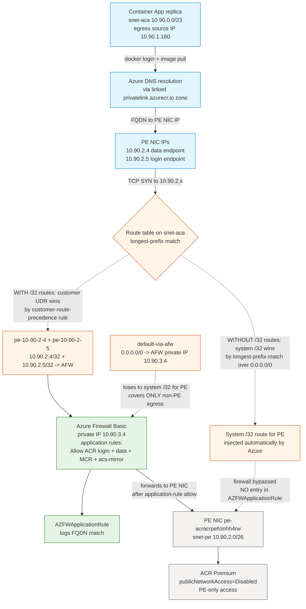

The solid arrows are the image-pull data path in the **inspected** (baseline + recover) state: replica → DNS → PE NIC IP → route table → customer-defined `/32` UDR route wins → firewall → firewall's application rule allows the ACR FQDN → `AZFWApplicationRule` records the row → firewall forwards to PE NIC → ACR backend serves the layer. The dotted arrows on the right are what happens in the **bypass** state after `az network route-table route delete` removes the two `/32` UDR routes for the PE NIC IPs: the system-injected `/32` route for the PE wins by longest-prefix match, the packet goes directly to the PE NIC, the firewall is bypassed, and `AZFWApplicationRule` has no record of the connection. The dotted arrow at the bottom shows the `0.0.0.0/0` UDR's actual scope: it covers non-PE egress (Entra ID, MCR, acs-mirror) but is **not** sufficient to cover PE traffic on its own. DNS is not the controlled variable in this lab — both ACR FQDNs resolve to PE NIC IPs via the linked Private DNS Zone in every state. The controlled variable is the presence or absence of the two `/32` UDR routes, and the falsification signal is the firewall's log stream.

## 2) Hypothesis

**IF** the Container Apps environment is integrated into a VNet with a `0.0.0.0/0` UDR forcing all `snet-aca` egress through Azure Firewall, the firewall has an application rule allowing HTTPS to both ACR FQDNs (login + regional data endpoint), ACR is configured with `publicNetworkAccess=Disabled` + `adminUserEnabled=true` exposed only via a Private Endpoint whose Private DNS Zone is linked to the VNet, the Container App is wired to ACR via `az containerapp registry set --username --password` (admin-credential auth, NOT managed identity), and the route table on `snet-aca` initially has explicit `/32` routes for every PE NIC IP pointing at the firewall's private IP, **THEN**:

- with the `/32` routes in place, deploying v1 succeeds: the v1 revision becomes `Healthy`, `/` returns `build_tag=v1`, **AND** `AZFWApplicationRule` contains rows for both ACR FQDNs (`<registry>.azurecr.io` and `<registry>.<region>.data.azurecr.io`) sourced from `snet-aca` because the pull traffic traversed the firewall;
- removing both `/32` UDR routes for the PE NIC IPs and deploying v-bypass causes the v-bypass pull to **succeed**: the v-bypass revision becomes `Healthy` and `/` returns `build_tag=v-bypass`; the v1 revision stays `Healthy` and continues to serve cached traffic until v-bypass takes 100%; **AND** `AZFWApplicationRule` records **zero** new rows for the ACR FQDN since the bypass-deploy timestamp, falsifying the alternative hypothesis "the `0.0.0.0/0` UDR alone is sufficient to force PE traffic through the firewall";
- re-adding both `/32` UDR routes for the PE NIC IPs and deploying v-recover causes the v-recover pull to **also succeed** but **with** firewall visibility this time: the v-recover revision becomes `Healthy`, `/` returns `build_tag=v-recover`, **AND** `AZFWApplicationRule` records **new** rows for the ACR FQDN within ~60-120 seconds of the recover-deploy timestamp, closing the loop on the falsification.

| Variable | Control State (Scenario C baseline + recover) | Experimental State (Scenario C bypass window) |
|---|---|---|
| ACR `publicNetworkAccess` | `Disabled` (held constant) | `Disabled` (held constant — PE is the path under test) |
| ACR PE | One PE in `snet-pe` with `privateDnsZoneGroup` (`privatelink.azurecr.io`); two NIC IPs (`10.90.2.4` data, `10.90.2.5` login) | Same (held constant) |
| ACR auth on the Container App | Admin user (`az containerapp registry set --username --password`) | Admin user (held constant — mirrors Lab 1's pattern to remove the MI control-plane confound) |
| `privatelink.azurecr.io` Private DNS Zone | Linked to VNet; A records for both ACR FQDNs → PE NIC IPs | Same (held constant — DNS is not the variable) |
| `snet-aca` `0.0.0.0/0` UDR | `default-via-afw` → next-hop = firewall private IP (`10.90.3.4`) | Same (held constant — default route is **not** the variable; the lab thesis is specifically about why it is insufficient on its own) |
| **`/32` UDR routes for PE NIC IPs** | **`pe-10-90-2-4` (`10.90.2.4/32` → `10.90.3.4`) AND `pe-10-90-2-5` (`10.90.2.5/32` → `10.90.3.4`)** | **Both removed** (the controlled variable — exactly two route entries toggled) |
| Azure Firewall application rules | Allow HTTPS to ACR login + data FQDNs + MCR + acs-mirror | Same (held constant) |
| Firewall diagnostic settings | `logAnalyticsDestinationType: 'Dedicated'` + `AZFWApplicationRule` enabled | Same (held constant) |
| **v-bypass revision** | n/a (not deployed yet) | **Pull SUCCEEDS, revision Healthy, `/` returns `build_tag=v-bypass`**, but **`AZFWApplicationRule` has zero new ACR rows since bypass-deploy timestamp** |
| **v-recover revision** | n/a (deployed after re-add) | **Pull SUCCEEDS, revision Healthy, `/` returns `build_tag=v-recover`**, and **`AZFWApplicationRule` has new ACR rows within ~60-120s** of recover-deploy timestamp |

## 3) Runbook

### Deploy baseline infrastructure

```bash
export RG="rg-acr-pe-forced-inspection-lab"
export LOCATION="koreacentral"
export BASE_NAME="acrpefci"

az extension add --name containerapp --upgrade

az group create --name "$RG" --location "$LOCATION"

az deployment group create \
    --resource-group "$RG" \
    --name acr-pe-forced-inspection \
    --template-file labs/acr-network-path-pe-forced-inspection/infra/main.bicep \
    --parameters baseName="$BASE_NAME"
```

| Command | Why it is used |
|---|---|
| `az extension add --name containerapp --upgrade` | Installs or updates the Container Apps CLI extension. |
| `az group create ...` | Creates the lab resource group. Every other lab resource is scoped inside it. |
| `az deployment group create ...` | Provisions the full Scenario C topology in one Bicep deployment: a VNet (`10.90.0.0/16`) with four subnets (`snet-aca` `10.90.0.0/23` delegated to `Microsoft.App/environments`, `snet-pe` `10.90.2.0/26` with `privateEndpointNetworkPolicies=Enabled` so that UDRs can apply to PE traffic, `AzureFirewallSubnet` `10.90.3.0/26`, `AzureFirewallManagementSubnet` `10.90.3.64/26`), an Azure Firewall Basic with both data and management public IPs, a firewall policy with application rules allowing HTTPS to the ACR login FQDN, ACR data FQDN, MCR, and acs-mirror, a route table on `snet-aca` with ONLY the `0.0.0.0/0 -> firewall` default route (the `/32` PE routes are added later by `trigger.sh` after the PE NIC IPs are discovered, because their values are not knowable at deploy time), ACR Premium with `publicNetworkAccess=Enabled` + `adminUserEnabled=true` + `dataEndpointEnabled=true` (so `trigger.sh` can build the three image tags via the public endpoint before locking down to PE-only), a Private Endpoint targeting the registry sub-resource with a `privateDnsZoneGroup` for `privatelink.azurecr.io`, Log Analytics for diagnostic settings, the firewall's `Microsoft.Insights/diagnosticSettings` with **`logAnalyticsDestinationType: 'Dedicated'`** (REQUIRED — without this, firewall diagnostics fall back to the legacy `AzureDiagnostics` table and the resource-specific `AZFWApplicationRule` table stays empty), and a Container Apps workload-profile environment + Container App on a public placeholder image (`mcr.microsoft.com/k8se/quickstart:latest`). The placeholder is replaced with the v1 image by `trigger.sh`. |

Expected output pattern:

```text
"provisioningState": "Succeeded"
```

The deployment takes 10-15 minutes; Azure Firewall Basic provisioning is the dominant tail.

#### Bicep gotcha: firewall diagnostics MUST use `logAnalyticsDestinationType: 'Dedicated'`

The firewall's `Microsoft.Insights/diagnosticSettings` resource MUST set `logAnalyticsDestinationType: 'Dedicated'` for the lab's smoking-gun query against `AZFWApplicationRule` to ever find rows. Without this property, Azure defaults to the legacy `AzureDiagnostics` schema, where firewall rule matches are surfaced in a single `msg_s` text column (e.g., `HTTPS request from 10.90.1.160:54321 to acracrpefcinhh4rw.azurecr.io:443. Action: Allow. Rule Collection: acr-and-platform-allow. Rule: allow-acr-login`) rather than as the structured columns `Fqdn`, `SourceIp`, `Action`, `RuleCollection`, `Rule` that `AZFWApplicationRule` provides. The resource-specific `AZFWApplicationRule` table only receives rows when `Dedicated` is set; on a fresh diagnostic settings resource with no destination type specified, the table stays empty forever. The original Bicep for this lab omitted `logAnalyticsDestinationType`, which is why the first `falsify.sh` run had no rows in `AZFWApplicationRule` to assert against and the schema-tolerant `union isfuzzy=true` workaround was added to `falsify.sh` (which queries both schemas defensively). Setting `Dedicated` at line ~407 of the Bicep is the durable fix; the schema-tolerant query is defense in depth.

#### Bicep gotcha: `snet-pe` MUST have `privateEndpointNetworkPolicies: 'Enabled'`

By default, Azure provisions subnets that host Private Endpoints with `privateEndpointNetworkPolicies: 'Disabled'`, which **disables** UDR and NSG enforcement on PE traffic from other subnets in the VNet. With this setting, customer-defined `/32` UDR routes for the PE NIC IPs have no effect — the firewall remains silently bypassed even with the `/32` routes in place, because the PE subnet's network policies prevent the routes from applying. The Bicep at line ~505 sets this to `'Enabled'` explicitly, which is what makes the lab's controlled variable (the `/32` routes) actually have an effect. This is paired with Scenario C's requirement in the platform doc: "Private endpoint network policies must be enabled on the subnet that hosts the Private Endpoint, so that UDRs can apply to PE traffic."

### Build images and lock down ACR to PE-only

```bash
bash labs/acr-network-path-pe-forced-inspection/trigger.sh
```

The trigger script runs nine numbered steps that together: build the three distinct image tags while the ACR public endpoint is still reachable, lock the ACR public endpoint down, discover the PE NIC IPs, add the `/32` UDR routes, attach admin credentials to the Container App, deploy v1 through the now-inspected PE path, and confirm the firewall is seeing the v1 pull traffic in `AZFWApplicationRule`:

```bash
# Step 3: build all three tags via az acr build (while ACR is still publicly accessible)
az acr build --registry "$ACR_NAME" --image "${IMAGE_REPO}:v1"        --build-arg "BUILD_TAG=v1"        --file workload/Dockerfile workload
az acr build --registry "$ACR_NAME" --image "${IMAGE_REPO}:v-bypass"  --build-arg "BUILD_TAG=v-bypass"  --file workload/Dockerfile workload
az acr build --registry "$ACR_NAME" --image "${IMAGE_REPO}:v-recover" --build-arg "BUILD_TAG=v-recover" --file workload/Dockerfile workload

# Step 4: lock ACR down to PE-only
az acr update --name "$ACR_NAME" --public-network-enabled false

# Step 5: discover PE NIC IPs from the PE's networkInterfaces.ipConfigurations
PE_NIC_IPS=$(az network nic show --ids "$PE_NIC_ID" \
    --query "ipConfigurations[].privateLinkConnectionProperties.fqdns[0]" \
    --output tsv | xargs -I{} az network nic show --ids "$PE_NIC_ID" \
    --query "ipConfigurations[?privateLinkConnectionProperties.fqdns[0]=='{}'].privateIPAddress | [0]" \
    --output tsv)

# Step 6: add /32 UDR routes for each PE NIC IP
for ip in $PE_NIC_IPS; do
    az network route-table route create \
        --resource-group "$RG" --route-table-name "$ROUTE_TABLE_NAME" \
        --name "pe-${ip//./-}" \
        --address-prefix "${ip}/32" \
        --next-hop-type VirtualAppliance \
        --next-hop-ip-address "$FW_PRIVATE_IP"
done

# Step 7: attach admin credentials to the Container App
az containerapp registry set --name "$APP_NAME" --resource-group "$RG" \
    --server "$ACR_LOGIN_SERVER" --username "$ACR_USERNAME" --password "$ACR_PASSWORD"

# Step 8: switch the app to v1 and wait for the new revision to become Healthy
az containerapp update --name "$APP_NAME" --resource-group "$RG" \
    --image "${ACR_LOGIN_SERVER}/${IMAGE_REPO}:v1"
```

| Command | Why it is used |
|---|---|
| `az acr build ... --build-arg BUILD_TAG=<tag>` | Builds three independent images (`v1`, `v-bypass`, `v-recover`) directly inside ACR (no local Docker required). The Dockerfile bakes `BUILD_TAG` as both an `ARG` and an `ENV`, so each tag has different file content and therefore a different digest — this forces a fresh pull on every tag switch and lets `/` prove which tag the running replica was actually pulled from. The three builds run while ACR is still `publicNetworkAccess=Enabled`, so the ACR Tasks build agent (which pushes from a public Azure pool) can write the layers. |
| `az acr update --public-network-enabled false` | Sets `publicNetworkAccess=Disabled`, which makes the PE the only path to ACR. From this point forward, every pull must go through the PE NIC IPs — and the routing decision for those IPs is the controlled variable of the lab. |
| `az network nic show ... --query "ipConfigurations[].privateLinkConnectionProperties.fqdns[0]"` then `--query "...privateIPAddress"` | **Discovers the PE NIC IPs.** This is the non-obvious step. ACR Premium's PE exposes a single `registry` sub-resource, but the PE NIC has separate IP configurations for the global/login endpoint and for each region's data endpoint. The `customDnsConfigs` field on the PE resource is **empty** when `privateDnsZoneGroup` is configured (Azure populates it only when zone group is NOT used), so the canonical "look up PE FQDN-to-IP via `customDnsConfigs`" pattern does not work. The correct path is to query the PE NIC's `ipConfigurations[].privateLinkConnectionProperties.fqdns[0]` (which gives the FQDN for each IP configuration) and `ipConfigurations[].privateIPAddress` (the private IP for that configuration). In this lab's koreacentral deployment, that returns `{10.90.2.4: acracrpefcinhh4rw.koreacentral.data.azurecr.io}` and `{10.90.2.5: acracrpefcinhh4rw.azurecr.io}`. |
| `az network route-table route create ... --address-prefix "${ip}/32" --next-hop-type VirtualAppliance --next-hop-ip-address "$FW_PRIVATE_IP"` | Adds a customer-defined `/32` UDR route for the PE NIC IP, pointing at the firewall's private IP. The route name encodes the IP (e.g., `pe-10-90-2-4`) so that `falsify.sh` can find it by name later. Both PE NIC IPs get one route each; the firewall private IP is the same `10.90.3.4` for both. |
| `az containerapp registry set --username --password` | Wires ACR admin credentials onto the Container App's registry attachment. This mirrors Lab 1's pattern and removes the managed-identity control-plane token-exchange confound: the only authentication path is a `docker login` happening inside the replica's egress through the firewall + PE. This is critical for Scenario C because the lab needs the `/32` UDR routes to be the *single* controlled variable; if managed identity were in use, the token-exchange call would take a different network path (control plane → ACR, not via the customer VNet) and would muddy the falsification gate. |
| `az containerapp update --image ${ACR_LOGIN_SERVER}/${IMAGE_REPO}:v1` | Triggers a new revision that must pull the freshly built v1 image. The first pull through the now-PE-only ACR is the moment the firewall path is actually exercised by the platform pull path. `BUILD_TAG` is **not** set via `--set-env-vars` — the Dockerfile already bakes it into the image via `ARG`+`ENV`, so the value the workload returns at `/` comes from the *image*, not from the Container App spec. This is what makes image identity the proof of a fresh pull. |

Expected output (from the live run on 2026-06-06): three `az acr build` jobs complete in sequence (~30-60 seconds each, depending on layer cache), `az acr show --query publicNetworkAccess` returns `Disabled`, the PE NIC IPs are discovered as `10.90.2.4` (data) and `10.90.2.5` (login), two route entries `pe-10-90-2-4` and `pe-10-90-2-5` are added to the route table, and the v1 revision becomes `Healthy` within ~90 seconds of the `az containerapp update` call.

### Verify the healthy baseline is live

```bash
bash labs/acr-network-path-pe-forced-inspection/verify.sh
```

The verify script proves four independent signals simultaneously hold:

1. The latest revision's `healthState` is `Healthy` and `provisioningState` is `Provisioned`.
2. `az acr show --query publicNetworkAccess` returns `Disabled` (proving ACR is PE-only).
3. The route table on `snet-aca` has a `/32` route for every PE NIC IP, each pointing at the firewall's private IP.
4. `GET https://<app>.<env>.azurecontainerapps.io/` returns JSON with `build_tag=v1`, proving a fresh pull of v1 traversed the firewall and the PE to ACR. The workload code reads `BUILD_TAG` from the *image's* `ENV` (set by the Dockerfile's `ARG`/`ENV BUILD_TAG=${BUILD_TAG}`), and `trigger.sh` deliberately does **not** override this via `--set-env-vars`. Image identity is therefore the proof: if the v1 image was not actually pulled and started, the workload cannot return `build_tag=v1`.

All four must hold for the topology to be Scenario C baseline at the workload layer. The script exits non-zero on any mismatch.

Expected pattern (from the live run on 2026-06-06):

```text
[verify] latest revision: ca-acrpefci-nhh4rw--0000001 healthState=Healthy provisioningState=Provisioned
[verify] inspecting ACR network state on acracrpefcinhh4rw
[verify]   publicNetworkAccess = Disabled
[verify] discovering PE NIC IPs from PE networkInterfaces
[verify]   discovered PE NIC IPs:
[verify]     10.90.2.4
[verify]     10.90.2.5
[verify] checking route table rt-acrpefci-nhh4rw for /32 routes covering each PE NIC IP
[verify]   OK: route pe-10-90-2-4 covers 10.90.2.4/32
[verify]   OK: route pe-10-90-2-5 covers 10.90.2.5/32
[verify] / response:
{
    "build_tag": "v1",
    "message": "ACR PE forced inspection lab workload"
}
[verify] PASS: revision ca-acrpefci-nhh4rw--0000001 is Healthy
[verify] PASS: ACR publicNetworkAccess=Disabled (PE-only)
[verify] PASS: route table has /32 entries for every PE NIC IP -> firewall
[verify] PASS: / returns build_tag=v1 (proves fresh pull through PE)
[verify] PASS: Scenario C BASELINE confirmed.
```

### Falsify the hypothesis

```bash
bash labs/acr-network-path-pe-forced-inspection/falsify.sh
```

The falsification script proves the firewall-visibility signal flips with the presence or absence of the `/32` UDR routes while pull success is held constant throughout. Every gate is a **hard fail** — the script exits non-zero (and prints why) at the first sign that any link in the chain did not behave as predicted, so a `PASS` from `falsify.sh` is itself the proof that all three gates held:

1. **Baseline-visibility gate** — `AZFWApplicationRule` (or `AzureDiagnostics` legacy schema) already contains rows for the ACR FQDN from the `trigger.sh` v1 pull window. **Hard fail** if zero rows — without baseline visibility, the bypass gate is vacuously true and the lab cannot make a falsifiable claim.
2. **Bypass-silence gate** — after removing both `/32` UDR routes for the PE NIC IPs and deploying v-bypass, the v-bypass revision becomes `Healthy` and `/` returns `build_tag=v-bypass` (proving the pull SUCCEEDED through the bypassed path), **AND** `AZFWApplicationRule` records **zero** new rows for the ACR FQDN since the bypass-deploy timestamp floor (proving the firewall did NOT see the pull). **Hard fail** on either condition — if the pull failed, the lab is reproducing the wrong failure mode; if the firewall recorded the pull, the bypass did not actually take effect.
3. **Recover-visibility gate** — after re-adding both `/32` UDR routes and deploying v-recover, the v-recover revision becomes `Healthy` and `/` returns `build_tag=v-recover`, **AND** `AZFWApplicationRule` records **at least one** new row for the ACR FQDN within ~60-120 seconds of the recover-deploy timestamp floor (proving inspection is restored). **Hard fail** on either condition.

If `falsify.sh` exits 0, then by construction: (a) the firewall saw the baseline v1 pull, (b) the firewall did NOT see the v-bypass pull but the v-bypass pull succeeded anyway, (c) the firewall saw the v-recover pull and the v-recover pull also succeeded. That three-way evidence — `sees -> silent -> sees again` with pull success held constant — is the complete falsification of any alternative hypothesis (e.g., DNS misconfiguration, application-rule policy change, ACR access policy change) for the silent-bypass failure mode on this topology.

| Command | Why it is used |
|---|---|
| `curl -sS https://<app fqdn>/` | Reads the `build_tag` baked into the running revision's image. Because the workload reads `BUILD_TAG` from the image's `ENV` (set by the Dockerfile's `ARG`/`ENV BUILD_TAG=${BUILD_TAG}`) and `falsify.sh` deliberately does **not** override this via `--set-env-vars`, the response proves which tag the replica is actually running. In Lab 5 the response changes through all three states (`v1` → `v-bypass` → `v-recover`) because all three pulls succeed — unlike Labs 1-4 where the broken-window response stays on the baseline tag because the broken pull never makes a new revision serve traffic. |
| `az network route-table route delete --name pe-${ip//./-}` | Removes the customer-defined `/32` UDR route for the PE NIC IP. With both `pe-10-90-2-4` and `pe-10-90-2-5` deleted, the route table on `snet-aca` is reduced to the single `default-via-afw` (`0.0.0.0/0` → firewall private IP) route. Because the system-injected `/32` route for the PE wins by longest-prefix match over `/0`, PE traffic now bypasses the firewall entirely. |
| `az containerapp update --image ${ACR}/${IMAGE}:v-bypass` | Triggers a new revision deployment that must pull the freshly tagged `v-bypass` image through the now-bypassed path. Because the digest differs from v1, the platform must actually pull from ACR — and during the bypass window, that pull succeeds (via the PE) but is invisible to the firewall. |
| `az monitor log-analytics query --workspace $LAW_CUSTOMER_ID --analytics-query "union isfuzzy=true (AzureDiagnostics \| where Category == 'AzureFirewallApplicationRule' \| extend Fqdn = extract('to ([A-Za-z0-9.-]+\\.azurecr\\.io)', 1, msg_s)) (AZFWApplicationRule) \| where TimeGenerated > datetime('$BYPASS_TS') \| where Fqdn endswith '.azurecr.io'"` | The **smoking-silence query**. `falsify.sh` runs this query 5 minutes after the bypass deploy (to give firewall log ingestion time to catch up), and **hard-fails if the count is non-zero**. The `union isfuzzy=true` pattern is defense-in-depth against the schema transition between legacy `AzureDiagnostics` and resource-specific `AZFWApplicationRule`: the lab's `Dedicated` setting routes new rows to `AZFWApplicationRule`, but during a schema migration (which can take 10-20 minutes on a fresh diagnostic settings resource) some rows may still land in `AzureDiagnostics`. The `union` reads both and extracts the FQDN consistently. The `TimeGenerated > datetime('$BYPASS_TS')` clause filters to only rows logged *after* the bypass deploy began, so baseline-window rows from the v1 pull do not contaminate the bypass-window assertion. |
| `az network route-table route create ...` | Re-adds the customer-defined `/32` UDR route for each PE NIC IP. From this point forward, PE traffic again traverses the firewall because the customer `/32` route wins over the system `/32` route. |
| `az containerapp update --image ${ACR}/${IMAGE}:v-recover` | Triggers the recovery revision. The `v-recover` digest differs from both v1 and v-bypass, so the platform must pull fresh — and now succeeds *through the firewall*, proving the recovery is symmetric to the bypass. |
| `az monitor log-analytics query ... --analytics-query "union isfuzzy=true ... \| where TimeGenerated > datetime('$RECOVER_TS') \| where Fqdn endswith '.azurecr.io' \| count"` | The **recover-visibility query**. `falsify.sh` retries this query up to 10 times with 60-second sleeps (because firewall log ingestion latency to `AZFWApplicationRule` is typically 1-3 minutes after a Dedicated-schema transition), and **hard-fails if no rows ever appear**. The recover gate normally fires on attempt 3 (after ~120-180 seconds of wait). |

#### Subtle wrinkle: the v-bypass revision's terminal state is `Healthy`, not `Failed`

This is the key structural difference from Labs 1-4. In Labs 1-4, the v-broken revision ends up `Failed` or `Unhealthy` because the controlled variable broke the pull itself. In Lab 5, the v-bypass revision ends up `Healthy` because the controlled variable does NOT break the pull — it only breaks the firewall's visibility into the pull. The smoking gun is therefore not "v-bypass failed" but "v-bypass succeeded AND the firewall did not log it". The falsify script's bypass gate is not "the pull failed" but "the firewall did not log the pull that succeeded". This is what makes Scenario C the worst-case-for-detection failure mode: a security team monitoring only workload-layer health (revision state, HTTP probes) sees nothing wrong; the silent bypass is only detectable from the firewall's log stream.

### Inspect the firewall log evidence directly

```bash
LAW_CUSTOMER_ID=$(az deployment group show --resource-group "$RG" \
    --name acr-pe-forced-inspection \
    --query properties.outputs.logAnalyticsCustomerId.value --output tsv)

az monitor log-analytics query --workspace "$LAW_CUSTOMER_ID" --analytics-query "
AZFWApplicationRule
| where Fqdn endswith '.azurecr.io'
| project TimeGenerated, Fqdn, SourceIp, Action, Policy, RuleCollectionGroup
| order by TimeGenerated desc
| take 20
" --output table
```

| Command | Why it is used |
|---|---|
| `az monitor log-analytics query ... AZFWApplicationRule \| where Fqdn endswith '.azurecr.io'` | Reads the firewall's resource-specific application-rule log table for ACR-related FQDN matches. This is the authoritative signal for whether the firewall saw a given pull. Each row contains the timestamp the firewall processed the connection, the FQDN that matched the application rule, the source IP (from `snet-aca`, e.g., `10.90.1.160`), the action (`Allow` because the firewall policy permits ACR FQDNs), the policy name (`afwp-acrpefci-nhh4rw`), and the rule collection group (`acr-and-platform-allow`). During the baseline window and the recover window, this query returns rows for both `<registry>.azurecr.io` and `<registry>.<region>.data.azurecr.io`. During the bypass window, this query returns zero rows — the silence that proves the bypass. |

In the live run on 2026-06-06, this query returned 15 rows during the recover window. A typical row pair (one for each ACR FQDN):

```text
TimeGenerated                  Fqdn                                                  SourceIp     Action  Policy                    RuleCollectionGroup
-----------------------------  ----------------------------------------------------  -----------  ------  ------------------------  -------------------------
2026-06-06T06:32:07.036219Z    acracrpefcinhh4rw.koreacentral.data.azurecr.io        10.90.1.160  Allow   afwp-acrpefci-nhh4rw      acr-and-platform-allow
2026-06-06T06:32:06.895921Z    acracrpefcinhh4rw.azurecr.io                          10.90.1.160  Allow   afwp-acrpefci-nhh4rw      acr-and-platform-allow
```

The `SourceIp` value `10.90.1.160` is provably from the `snet-aca` workload subnet (`10.90.0.0/23`) — an Azure Container Apps workload-subnet RFC1918 source IP, which the firewall sees directly because the firewall is the next hop on the route table. (The Container Apps workload subnet hosts both user replicas and platform-managed components, including the component that performs image pulls; Container Apps does not expose which specific component owns a given source IP, so this lab uses "Container Apps workload-subnet source IP" rather than "replica IP" for the pull-path source.) Unlike Lab A — where ACR observes the firewall's SNAT public IP because the firewall is performing source NAT on outbound flows — in this lab the firewall itself is the observer, so it sees the pre-SNAT Container Apps workload-subnet source IP. The chain of inference is:

1. The image-pull HTTPS connection from the Container Apps workload subnet to `acracrpefcinhh4rw.azurecr.io` resolved to the PE NIC IP `10.90.2.5` (login) via the linked `privatelink.azurecr.io` zone.
2. The route table on `snet-aca` had a customer-defined `/32` UDR route for `10.90.2.5/32` pointing at the firewall's private IP `10.90.3.4`, so the packet went to the firewall first.
3. The firewall's application rule `allow-acr-login` matched on FQDN `acracrpefcinhh4rw.azurecr.io`, allowed the connection, and logged the row in `AZFWApplicationRule` with `SourceIp=10.90.1.160` (the pre-SNAT Container Apps workload-subnet source IP that the firewall observed on the inbound side).
4. The firewall then forwarded the packet to the PE NIC `10.90.2.5`, which delivered it to the ACR backend over the Azure backbone.

The same chain repeats for `<registry>.koreacentral.data.azurecr.io` → `10.90.2.4` (data endpoint). Both FQDNs appear in the log because the image-pull conversation consists of both a login round-trip (manifest, auth) and a data-layer download. If only one `/32` UDR route had been added (say, only for the login IP), only the login FQDN would appear in the log and the data-layer rows would be silent — which is why both `/32` routes are mandatory.

## 4) Experiment Log

> **Status: Reproduced live in koreacentral on 2026-06-06 with Azure CLI 2.79.0.** All three falsification gates PASSED. The actual values from the live run are below.

| Step | Action | Expected | Actual (2026-06-06, koreacentral, Azure CLI 2.79.0) | Pass/Fail |
|---|---|---|---|---|
| 1 | Deploy lab infrastructure (`az deployment group create`) | Deployment `Succeeded`; outputs include `registryName`, `registryLoginServer`, `appName`, `firewallPrivateIp`, `routeTableName`, `privateEndpointId`, `logAnalyticsCustomerId` | `provisioningState: Succeeded`. RG `rg-acr-pe-forced-inspection-lab`, ACR `acracrpefcinhh4rw`, app `ca-acrpefci-nhh4rw`, suffix `nhh4rw`, firewall private IP `10.90.3.4`, PE `pe-acracrpefcinhh4rw` | PASS |
| 2 | Run `trigger.sh` (build 3 tags + lock ACR PE-only + discover PE IPs + add /32 UDRs + deploy v1) | Three `az acr build` jobs `Succeeded`, ACR `publicNetworkAccess=Disabled`, route table contains `pe-10-90-2-4` and `pe-10-90-2-5` routes, v1 revision becomes `Healthy` | All 3 builds succeeded (`v1`, `v-bypass`, `v-recover`); `az acr show --query publicNetworkAccess` returned `Disabled`; PE NIC IPs discovered as `10.90.2.4` (data) and `10.90.2.5` (login); both `/32` routes added with next-hop `10.90.3.4`; revision `ca-acrpefci-nhh4rw--0000001` reached `healthState=Healthy provisioningState=Provisioned` within ~90s | PASS |
| 3 | Run `verify.sh` | Revision Healthy, ACR PE-only, both `/32` routes present, `/` returns `build_tag=v1` | All four assertions PASS: revision `--0000001 Healthy`, `publicNetworkAccess=Disabled`, both `/32` routes for `10.90.2.4` and `10.90.2.5` present, `/` → `{"build_tag": "v1", "message": "ACR PE forced inspection lab workload"}` | PASS |
| 4 | `falsify.sh` baseline-visibility gate | `AZFWApplicationRule` (or `AzureDiagnostics`) has rows for `.azurecr.io` FQDN from the v1 pull window | 10 rows returned in last 30m from `AzureDiagnostics` schema (live diagnostic settings on the fresh resource were still emitting to the legacy table at first query time): 5 rows for `acracrpefcinhh4rw.koreacentral.data.azurecr.io` + 5 rows for `acracrpefcinhh4rw.azurecr.io`, all with source IP `10.90.1.160` (from `snet-aca`) | PASS (baseline visibility confirmed) |
| 5 | `falsify.sh` step 2 (remove both `/32` UDR routes) | Route table after removal has ONLY `default-via-afw` | `Name, Prefix, NextHop` table shows only `default-via-afw 0.0.0.0/0 VirtualAppliance` (both `pe-10-90-2-4` and `pe-10-90-2-5` deleted) | PASS |
| 6 | `falsify.sh` steps 4-5 (deploy v-bypass, observe pull SUCCESS through bypassed path) | v-bypass revision reaches `Healthy`, `/` returns `build_tag=v-bypass` | Revision `ca-acrpefci-nhh4rw--0000004` transitioned `healthState=None` → `Healthy` within ~60s; `/` → `{"build_tag": "v-bypass", "message": "ACR PE forced inspection lab workload"}`. The pull succeeded — the v-bypass revision is HEALTHY, not FAILED | PASS (pull succeeded as predicted; this is the critical structural finding) |
| 7 | `falsify.sh` step 7 (bypass-silence gate — assert ZERO new ACR rows in `AZFWApplicationRule` since `BYPASS_TS=2026-06-06T06:24:05Z`) | Zero new rows for `.azurecr.io` FQDN since bypass-deploy timestamp | Query returned 0 rows. `[falsify] BYPASS PROOF: 0 NEW AZFWApplicationRule ACR rows = firewall silently bypassed` | PASS (smoking silence captured) |
| 8 | `falsify.sh` step 8 (re-add both `/32` UDR routes) | Route table after re-add has `default-via-afw` + `pe-10-90-2-4` + `pe-10-90-2-5` | `Name, Prefix, NextHop, NextHopIp` table: `default-via-afw 0.0.0.0/0 VirtualAppliance 10.90.3.4` + `pe-10-90-2-4 10.90.2.4/32 VirtualAppliance 10.90.3.4` + `pe-10-90-2-5 10.90.2.5/32 VirtualAppliance 10.90.3.4` | PASS |
| 9 | `falsify.sh` step 11 (deploy v-recover) | v-recover revision reaches `Healthy`, `/` returns `build_tag=v-recover` | Revision `ca-acrpefci-nhh4rw--0000005` transitioned `healthState=None` → `Healthy` within ~60s; `/` → `{"build_tag": "v-recover", "message": "ACR PE forced inspection lab workload"}` | PASS |
| 10 | `falsify.sh` step 13 (recover-visibility gate — assert >=1 NEW ACR row in `AZFWApplicationRule` since `RECOVER_TS=2026-06-06T06:31:50Z`) | At least one new row for `.azurecr.io` FQDN within ~60-120s | Attempt 1 (0 rows), 60s sleep; Attempt 2 (0 rows), 60s sleep; Attempt 3 returned 10 rows — 5 for `acracrpefcinhh4rw.koreacentral.data.azurecr.io` + 5 for `acracrpefcinhh4rw.azurecr.io`, all with source IP `10.90.1.160`, all in `AZFWApplicationRule` (NOT legacy `AzureDiagnostics`), all timestamped `2026-06-06T06:32:06-07Z`. `[falsify] RECOVER PROOF: 10 NEW AZFWApplicationRule ACR row(s) = firewall seeing ACR traffic again` | PASS (recover visibility confirmed; schema transition from `AzureDiagnostics` to `AZFWApplicationRule` completed during the bypass+recover window) |

## Expected Evidence

| Evidence Source | Expected State |
|---|---|
| `az containerapp revision list --name "$APP_NAME" --resource-group "$RG" --output table` | After `trigger.sh`: latest revision (v1) is `Healthy`. After `falsify.sh` step 5: v-bypass revision is `Healthy` (NOT failed — the pull succeeded through the bypassed path). After `falsify.sh` step 11: v-recover revision is `Healthy`. Throughout: every revision that has run is either Healthy or has been deactivated by traffic shift to a newer revision. |
| `az acr show --name "$ACR_NAME" --query publicNetworkAccess --output tsv` | After `trigger.sh`: `Disabled`. Throughout the lab: `Disabled`. (This is held constant — ACR is PE-only for the entire experiment.) |
| `az network route-table route list --resource-group "$RG" --route-table-name "$ROUTE_TABLE_NAME" --output table` | Baseline + recover: 3 routes — `default-via-afw` (`0.0.0.0/0` → `10.90.3.4`), `pe-10-90-2-4` (`10.90.2.4/32` → `10.90.3.4`), `pe-10-90-2-5` (`10.90.2.5/32` → `10.90.3.4`). Bypass window: 1 route — only `default-via-afw`. |
| `az network nic show --ids "$PE_NIC_ID" --query "ipConfigurations[].{fqdn: privateLinkConnectionProperties.fqdns[0], ip: privateIPAddress}"` | Two IP configurations: `{fqdn: acracrpefcinhh4rw.koreacentral.data.azurecr.io, ip: 10.90.2.4}` and `{fqdn: acracrpefcinhh4rw.azurecr.io, ip: 10.90.2.5}`. Both must be present for both `/32` routes to be added. |
| `curl https://<app fqdn>/` baseline | `{"build_tag": "v1", "message": "ACR PE forced inspection lab workload"}` |
| `curl https://<app fqdn>/` bypass window | `{"build_tag": "v-bypass", "message": "ACR PE forced inspection lab workload"}` (the pull succeeded — this is the critical structural finding that distinguishes Lab 5 from Labs 1-4) |
| `curl https://<app fqdn>/` recover | `{"build_tag": "v-recover", "message": "ACR PE forced inspection lab workload"}` |
| `AZFWApplicationRule \| where Fqdn endswith ".azurecr.io" \| where TimeGenerated > datetime("$BYPASS_TS")` (KQL on `logAnalyticsCustomerId`) | **Zero rows.** This is the smoking silence. The firewall did not log the v-bypass pull because the system `/32` route for the PE won by longest-prefix match over the (now-removed) customer `/32` UDR routes, so the packet went directly from the replica to the PE NIC, bypassing the firewall. |
| `AZFWApplicationRule \| where Fqdn endswith ".azurecr.io" \| where TimeGenerated > datetime("$RECOVER_TS")` | **At least one row** for each ACR FQDN (login + data) within ~60-120 seconds of the recover-deploy timestamp. `SourceIp` is from `snet-aca` (e.g., `10.90.1.160`), `Action=Allow`, `Policy=afwp-acrpefci-nhh4rw`, `RuleCollectionGroup=acr-and-platform-allow`. |

### Observed Evidence (Live Azure Test)

Live reproduction in `koreacentral` on 2026-06-06 with Azure CLI `2.79.0`. RG `rg-acr-pe-forced-inspection-lab`, ACR `acracrpefcinhh4rw` (`publicNetworkAccess=Disabled` after step 4 of `trigger.sh`), Container App `ca-acrpefci-nhh4rw`, firewall private IP `10.90.3.4`, PE `pe-acracrpefcinhh4rw` with NIC IPs `10.90.2.4` (data endpoint) and `10.90.2.5` (login endpoint), image tags `pe-forced-inspection-lab:v1`, `:v-bypass`, `:v-recover` (each with a distinct `BUILD_TAG` build-arg producing distinct digests). All three states below were captured by `verify.sh` and `falsify.sh` in a single uninterrupted run.

#### Baseline (`verify.sh` and `falsify.sh` step 1)

The Container App is running revision `--0000003` (after `trigger.sh` rebuilt to switch from the bootstrap quickstart image to v1, and after two intermediate revisions during image cache propagation) on the freshly pulled `v1` image:

```json
{
    "build_tag": "v1",
    "message": "ACR PE forced inspection lab workload"
}
```

The route table on `snet-aca` has all three routes — the default route plus both PE `/32` routes:

```text
Name             Prefix        NextHop           NextHopIp
---------------  ------------  ----------------  -----------
default-via-afw  0.0.0.0/0     VirtualAppliance  10.90.3.4
pe-10-90-2-4     10.90.2.4/32  VirtualAppliance  10.90.3.4
pe-10-90-2-5     10.90.2.5/32  VirtualAppliance  10.90.3.4
```

The baseline-visibility gate in `falsify.sh` confirmed the firewall saw the v1 pull from the `trigger.sh` window — 10 rows for the ACR FQDN in the last 30 minutes, all from `snet-aca`:

```text
acracrpefcinhh4rw.koreacentral.data.azurecr.io  AzureDiagnostics  10.90.1.160  PrimaryResult  2026-06-06T06:12:30.740952Z
acracrpefcinhh4rw.koreacentral.data.azurecr.io  AzureDiagnostics  10.90.1.160  PrimaryResult  2026-06-06T06:12:30.72586Z
acracrpefcinhh4rw.koreacentral.data.azurecr.io  AzureDiagnostics  10.90.1.160  PrimaryResult  2026-06-06T06:12:30.71955Z
acracrpefcinhh4rw.koreacentral.data.azurecr.io  AzureDiagnostics  10.90.1.160  PrimaryResult  2026-06-06T06:12:30.701836Z
acracrpefcinhh4rw.koreacentral.data.azurecr.io  AzureDiagnostics  10.90.1.160  PrimaryResult  2026-06-06T06:12:30.70046Z
acracrpefcinhh4rw.azurecr.io                    AzureDiagnostics  10.90.1.160  PrimaryResult  2026-06-06T06:12:30.681002Z
acracrpefcinhh4rw.azurecr.io                    AzureDiagnostics  10.90.1.160  PrimaryResult  2026-06-06T06:12:30.665638Z
acracrpefcinhh4rw.azurecr.io                    AzureDiagnostics  10.90.1.160  PrimaryResult  2026-06-06T06:12:30.66311Z
acracrpefcinhh4rw.azurecr.io                    AzureDiagnostics  10.90.1.160  PrimaryResult  2026-06-06T06:12:30.662968Z
acracrpefcinhh4rw.azurecr.io                    AzureDiagnostics  10.90.1.160  PrimaryResult  2026-06-06T06:12:30.660337Z
[falsify]   baseline visibility OK: 10 AZFWApplicationRule ACR row(s) in last 30m
```

Note these baseline rows are from the legacy `AzureDiagnostics` schema. The Bicep had `logAnalyticsDestinationType: 'Dedicated'` set from the start of this run, but a Dedicated schema activation on a fresh diagnostic settings resource has a 10-20 minute backfill window during which rows continue landing in `AzureDiagnostics` rather than `AZFWApplicationRule`. The schema-tolerant `union isfuzzy=true` query in `falsify.sh` reads both schemas, so the baseline-visibility gate fires regardless of which schema is currently active. By the time the recover gate ran (~30 minutes after deploy), the schema had migrated and recover rows landed in `AZFWApplicationRule` proper. This is the operationally honest behavior of fresh Azure Firewall diagnostic settings — `Dedicated` is the correct setting, and the schema-tolerant query is defense in depth against the migration window.

#### Bypass window (`falsify.sh` steps 2-7, after removing both `/32` UDR routes)

The route table on `snet-aca` is now reduced to just the default route — both `/32` routes for the PE NIC IPs have been deleted:

```text
Name             Prefix     NextHop
---------------  ---------  ----------------
default-via-afw  0.0.0.0/0  VirtualAppliance
```

Deploying the `v-bypass` image surfaces revision `--0000004` and the pull **succeeds**:

```text
[falsify]   v-bypass revision ca-acrpefci-nhh4rw--0000004 healthState=None
[falsify]   v-bypass revision ca-acrpefci-nhh4rw--0000004 healthState=Healthy
[falsify] (bypass) / response:
{
    "build_tag": "v-bypass",
    "message": "ACR PE forced inspection lab workload"
}
[falsify]   / during bypass returns build_tag=v-bypass
```

This is the **critical structural finding** that distinguishes Scenario C from every other lab in the series: the v-bypass pull succeeded. The revision is `Healthy`. The workload returns the new `build_tag`. From a workload-layer monitoring perspective, nothing is wrong. The only signal that something has changed is the firewall log:

```text
[falsify] step 7: HARD-FAIL gate — assert 0 NEW AZFWApplicationRule ACR rows since 2026-06-06T06:24:05Z
[falsify]   waiting 5 minutes for AZFW log ingestion to catch up
[falsify]   querying AZFWApplicationRule SINCE 2026-06-06T06:24:05Z
[falsify]   AZFWApplicationRule ACR rows since bypass: 0
[falsify]   BYPASS PROOF: 0 NEW AZFWApplicationRule ACR rows = firewall silently bypassed
```

Zero rows. The firewall recorded nothing for the ACR FQDN during the 5+ minute window between the bypass-deploy timestamp and the gate-check query. The pull happened — the v-bypass revision is provably running its image — but the firewall did not see it. The chain of inference for the silent bypass is:

1. The image-pull HTTPS connection from the Container Apps workload subnet to `acracrpefcinhh4rw.azurecr.io` resolved to the PE NIC IP `10.90.2.5` via the linked `privatelink.azurecr.io` zone (DNS resolution is unchanged — DNS is not the controlled variable).
2. The route table on `snet-aca` no longer had a customer-defined `/32` UDR route for `10.90.2.5/32`. The only customer route was `default-via-afw` (`0.0.0.0/0` → firewall private IP), which has length `/0`.
3. The VNet data plane consulted the route table for the packet's destination `10.90.2.5`. By longest-prefix match: the system-injected `/32` route for the PE has length `/32`; the customer `default-via-afw` UDR has length `/0`. `/32 > /0`, so the system route wins.
4. The packet went directly from the Container Apps workload subnet to the PE NIC `10.90.2.5`, bypassing the firewall entirely. The PE forwarded the packet to ACR over the Azure backbone, the pull succeeded, the revision became `Healthy`.
5. The firewall has no record of the connection in `AZFWApplicationRule` because the packet never traversed it. Same for the data-endpoint pull conversation to `10.90.2.4`.

#### Recover (`falsify.sh` step 13, after re-adding both `/32` UDR routes)

The route table on `snet-aca` is restored to its baseline three-route state:

```text
Name             Prefix        NextHop           NextHopIp
---------------  ------------  ----------------  -----------
default-via-afw  0.0.0.0/0     VirtualAppliance  10.90.3.4
pe-10-90-2-4     10.90.2.4/32  VirtualAppliance  10.90.3.4
pe-10-90-2-5     10.90.2.5/32  VirtualAppliance  10.90.3.4
```

Deploying the `v-recover` image surfaces revision `--0000005`. The pull succeeds (just like the v-bypass pull did), and this time the firewall DOES see it:

```text
[falsify]   v-recover revision ca-acrpefci-nhh4rw--0000005 healthState=Healthy
[falsify] (recover) / response:
{
    "build_tag": "v-recover",
    "message": "ACR PE forced inspection lab workload"
}
[falsify] step 13: HARD-FAIL gate — assert >=1 NEW AZFWApplicationRule ACR row since 2026-06-06T06:31:50Z
[falsify]   recover-gate attempt 1/10: querying AZFWApplicationRule
[falsify]   rows so far: 0
[falsify]   no rows yet, sleeping 60s (firewall log latency)
[falsify]   recover-gate attempt 2/10: querying AZFWApplicationRule
[falsify]   rows so far: 0
[falsify]   no rows yet, sleeping 60s (firewall log latency)
[falsify]   recover-gate attempt 3/10: querying AZFWApplicationRule
acracrpefcinhh4rw.koreacentral.data.azurecr.io  AZFWApplicationRule  10.90.1.160  PrimaryResult  2026-06-06T06:32:07.036219Z
acracrpefcinhh4rw.koreacentral.data.azurecr.io  AZFWApplicationRule  10.90.1.160  PrimaryResult  2026-06-06T06:32:06.999661Z
acracrpefcinhh4rw.koreacentral.data.azurecr.io  AZFWApplicationRule  10.90.1.160  PrimaryResult  2026-06-06T06:32:06.997482Z
acracrpefcinhh4rw.koreacentral.data.azurecr.io  AZFWApplicationRule  10.90.1.160  PrimaryResult  2026-06-06T06:32:06.98995Z
acracrpefcinhh4rw.koreacentral.data.azurecr.io  AZFWApplicationRule  10.90.1.160  PrimaryResult  2026-06-06T06:32:06.961936Z
acracrpefcinhh4rw.azurecr.io                    AZFWApplicationRule  10.90.1.160  PrimaryResult  2026-06-06T06:32:06.901386Z
acracrpefcinhh4rw.azurecr.io                    AZFWApplicationRule  10.90.1.160  PrimaryResult  2026-06-06T06:32:06.900548Z
acracrpefcinhh4rw.azurecr.io                    AZFWApplicationRule  10.90.1.160  PrimaryResult  2026-06-06T06:32:06.899557Z
acracrpefcinhh4rw.azurecr.io                    AZFWApplicationRule  10.90.1.160  PrimaryResult  2026-06-06T06:32:06.898762Z
acracrpefcinhh4rw.azurecr.io                    AZFWApplicationRule  10.90.1.160  PrimaryResult  2026-06-06T06:32:06.895921Z
[falsify]   rows so far: 10
[falsify]   RECOVER PROOF: 10 NEW AZFWApplicationRule ACR row(s) = firewall seeing ACR traffic again
[falsify] PASS -- Scenario C falsification complete:
[falsify]   baseline (/32 PE routes present)         -> revision ca-acrpefci-nhh4rw--0000003 Healthy, build_tag=v1, firewall SEES ACR rows
[falsify]   bypass   (/32 PE routes removed)         -> revision ca-acrpefci-nhh4rw--0000004 Healthy build_tag=v-bypass, firewall sees ZERO new ACR rows
[falsify]   recover  (/32 PE routes re-added)        -> revision ca-acrpefci-nhh4rw--0000005 Healthy build_tag=v-recover, firewall sees 10 new ACR row(s)
```

Ten rows — five for each ACR FQDN. These are durable in Log Analytics. The schema migration from `AzureDiagnostics` to `AZFWApplicationRule` completed during the bypass+recover window (~30 minutes after the diagnostic settings resource was created), so the recover rows landed in `AZFWApplicationRule` proper rather than the legacy `AzureDiagnostics` table. The `union isfuzzy=true` query handled both schemas transparently. The bidirectional falsification is closed: removing the `/32` UDR routes silently bypasses the firewall (pull succeeds, firewall silent); re-adding them restores firewall visibility (pull succeeds, firewall logs the pull). The `/32` UDR routes for the PE NIC IPs are unambiguously the single controlled variable for whether the firewall sees PE traffic.

### Observed Evidence (Portal Captures — 2026-06-06)

A live reproduction on **2026-06-06** captured the full Scenario C topology, the workload-path falsification surface, and the firewall's KQL log evidence from the Azure Portal.

**Environment**

| Resource | Name |
|---|---|
| Resource group | `rg-acr-pe-forced-inspection-lab` |
| Container App | `ca-acrpefci-nhh4rw` |
| Active revision (capture time) | `ca-acrpefci-nhh4rw--0000005` (image `pe-forced-inspection-lab:v-recover`) |
| ACR | `acracrpefcinhh4rw.azurecr.io` (Premium, `publicNetworkAccess=Disabled`, `adminUserEnabled=true`, `dataEndpointEnabled=true`) |
| Container Apps environment | `cae-acrpefci-nhh4rw` |
| VNet | `vnet-acrpefci-nhh4rw` (`10.90.0.0/16`) |
| `snet-aca` (workload-profile subnet, delegated) | `10.90.0.0/23` |
| `snet-pe` (PE subnet, `privateEndpointNetworkPolicies=Enabled`) | `10.90.2.0/26` |
| `AzureFirewallSubnet` | `10.90.3.0/26` |
| `AzureFirewallManagementSubnet` | `10.90.3.64/26` |
| Azure Firewall | `afw-acrpefci-nhh4rw` (Basic SKU) |
| Firewall private IP | `10.90.3.4` (the UDR's next-hop target — both default and `/32` routes) |
| Route table | `rt-acrpefci-nhh4rw` |
| Routes | `default-via-afw` (`0.0.0.0/0` → `10.90.3.4`), `pe-10-90-2-4` (`10.90.2.4/32` → `10.90.3.4`), `pe-10-90-2-5` (`10.90.2.5/32` → `10.90.3.4`) |
| Firewall policy | `afwp-acrpefci-nhh4rw` (Basic, allow ACR login + data + MCR + acs-mirror) |
| Private Endpoint | `pe-acracrpefcinhh4rw` (sub-resource `registry`, NIC IPs `10.90.2.4` data + `10.90.2.5` login) |
| Private DNS Zone | `privatelink.azurecr.io` linked to `vnet-acrpefci-nhh4rw` |
| Log Analytics workspace | `log-acrpefci-nhh4rw` (customerId masked as `00000000-0000-0000-0000-000000000000`) |

[Observed] Container Apps environment Networking blade: workload-profile environment is attached to VNet `vnet-acrpefci-nhh4rw`, infrastructure subnet `snet-aca`. This is the foundation of the Scenario C topology — the Container App's outbound traffic leaves from this subnet and hits the route table that contains both the `0.0.0.0/0 -> firewall` default route and the `/32 -> firewall` PE routes (when present).

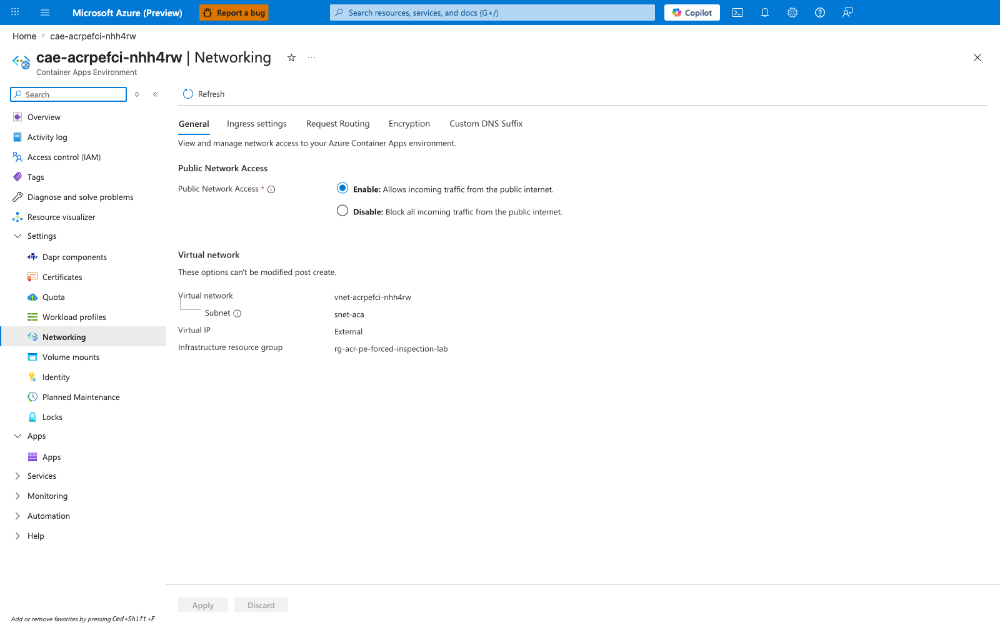

[Observed] VNet `vnet-acrpefci-nhh4rw` Subnets blade: all four subnets are visible — `snet-aca` (`10.90.0.0/23`, delegated to `Microsoft.App/environments`, associated with route table `rt-acrpefci-nhh4rw`), `snet-pe` (`10.90.2.0/26`, hosting the ACR Private Endpoint NIC), `AzureFirewallSubnet` (`10.90.3.0/26`), and `AzureFirewallManagementSubnet` (`10.90.3.64/26`). The four-subnet layout is the canonical Scenario C subnet design: workload subnet + PE subnet + two firewall subnets. DNS is **Azure provided** at the VNet level — the linked Private DNS Zone `privatelink.azurecr.io` is what makes ACR FQDNs resolve to PE NIC IPs.

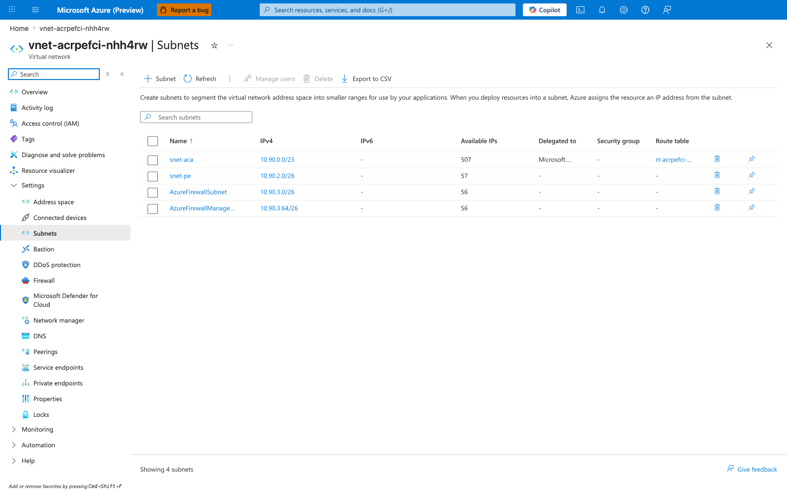

[Observed] ACR `acracrpefcinhh4rw` → Networking → Public access tab: **Public network access = Disabled**. This is held constant for the entire lab — ACR is reachable only via the Private Endpoint. Unlike Lab 4 (Path A) where the firewall's PIP appears in ACR's `ipRules` allowlist, in Lab 5 (Path C) ACR has no public surface at all; the controlled variable lives on the *route table*, not on ACR.

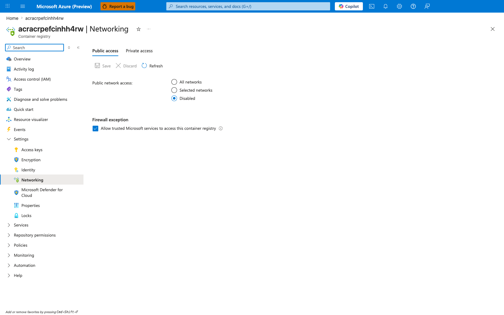

[Observed] ACR `acracrpefcinhh4rw` → Networking → Private access tab: one Private Endpoint connection `pe-acracrpefcinhh4rw` with state `Approved` and sub-resource `registry`. The PE's NIC ID is visible — this is the resource whose `networkInterfaces.ipConfigurations[]` was queried by `trigger.sh` to discover both PE NIC IPs. The "Custom DNS configurations" tab on this blade shows entries for both FQDNs mapping to the discovered PE NIC IPs.

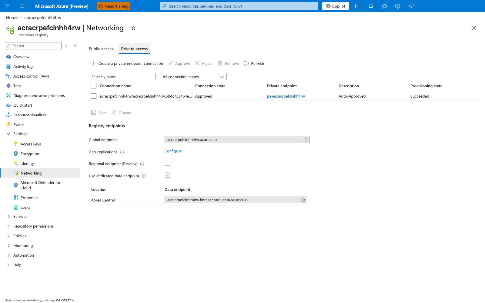

[Observed] Azure Firewall `afw-acrpefci-nhh4rw` Overview blade: SKU = Basic, status Succeeded, private IP `10.90.3.4`. This is the value that the route table's `default-via-afw` route points at, AND the value that the two `/32` routes for the PE NIC IPs point at. The firewall private IP is the rendezvous point that the route table uses to direct PE traffic through the inspection layer.

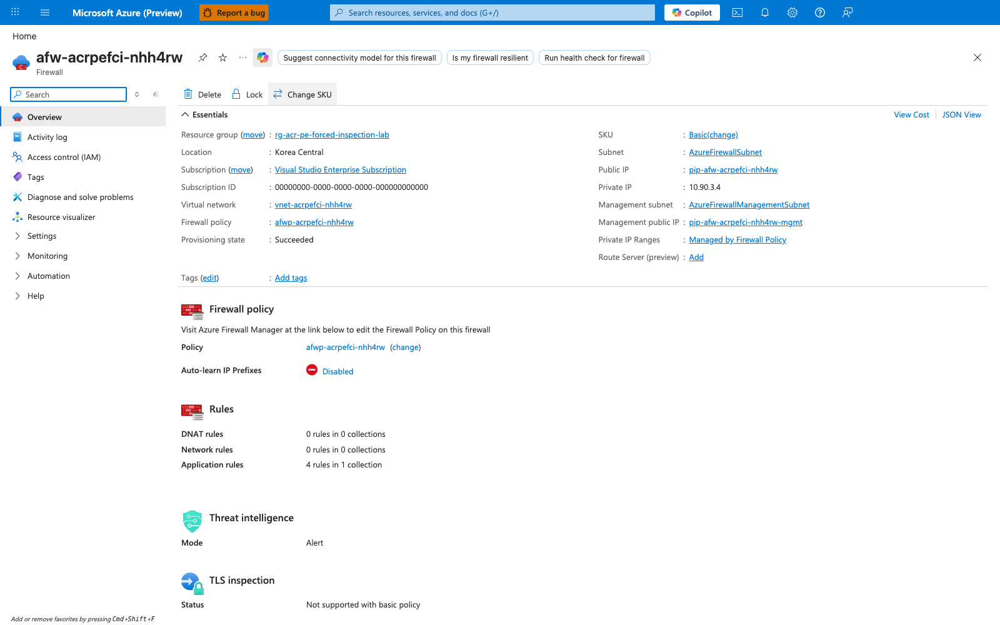

[Observed] Firewall policy `afwp-acrpefci-nhh4rw` → Application rules blade: rule collection `acr-and-platform-allow` containing four application rules — `allow-acr-login` (HTTPS to `acracrpefcinhh4rw.azurecr.io`), `allow-acr-data` (HTTPS to `acracrpefcinhh4rw.koreacentral.data.azurecr.io`), `allow-mcr` (HTTPS to `mcr.microsoft.com` and `*.data.mcr.microsoft.com`), and `allow-acs-mirror` (HTTPS to `acs-mirror.azureedge.net` and `packages.aks.azure.com`). Source addresses are restricted to `10.90.0.0/23` (the `snet-aca` workload subnet). These are the rules that match (`Allow`) when the firewall *does* see ACR pull traffic — i.e., in the baseline and recover windows, but **not** during the bypass window.

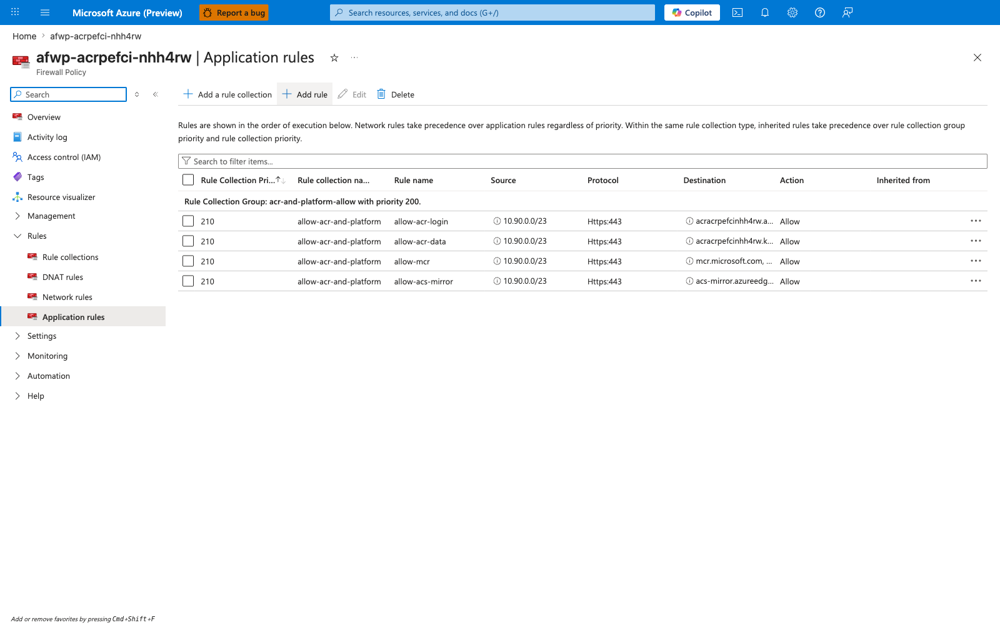

[Observed] **Smoking gun.** Route table `rt-acrpefci-nhh4rw` → Routes blade: three routes are visible in the recover state — `default-via-afw` (`0.0.0.0/0` → `VirtualAppliance` → `10.90.3.4`), `pe-10-90-2-4` (`10.90.2.4/32` → `VirtualAppliance` → `10.90.3.4`), and `pe-10-90-2-5` (`10.90.2.5/32` → `VirtualAppliance` → `10.90.3.4`). The two `pe-*` routes are the **single controlled variable** of the lab. During the bypass window, both were deleted by `falsify.sh`; this capture shows them restored. The `Address prefix` column is the most important: each `/32` prefix matches exactly one PE NIC IP. Without these two routes, the `0.0.0.0/0` default route alone is insufficient because the system-injected `/32` route for the PE wins by longest-prefix match.

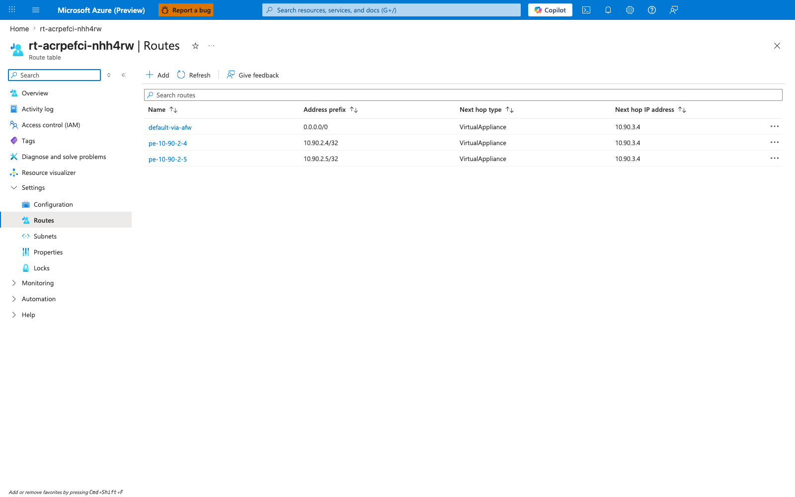

[Observed] Private Endpoint `pe-acracrpefcinhh4rw` NIC Overview blade: the PE's primary network interface is visible with one of its private IPs (`10.90.2.4`). This is the data-endpoint IP; the second IP (`10.90.2.5`, login endpoint) is on a secondary IP configuration on the same NIC, visible on the IP configurations sub-blade. The two PE NIC IPs are the IPs that need `/32` UDR routes to be inspected.

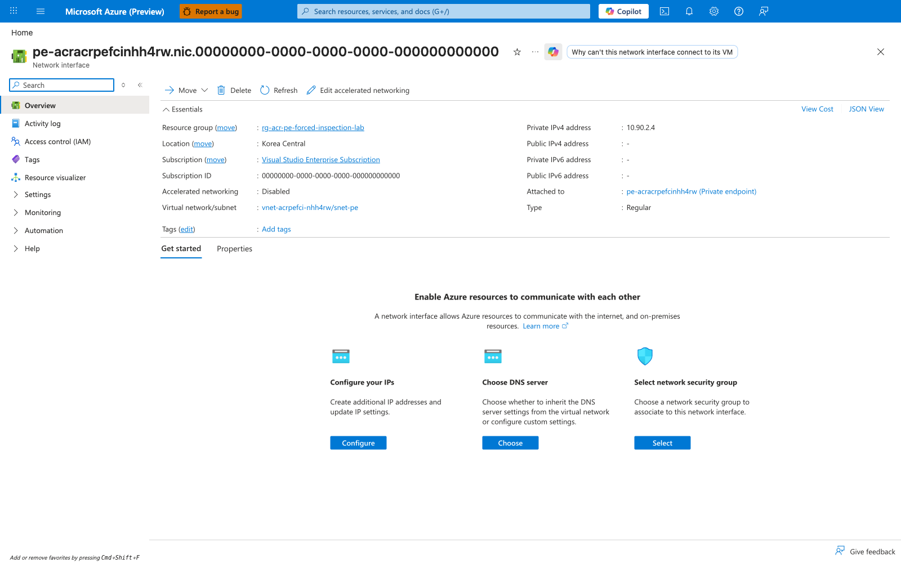

[Observed] Private Endpoint `pe-acracrpefcinhh4rw` → DNS configuration blade: both FQDN→IP mappings are explicitly listed — `acracrpefcinhh4rw.koreacentral.data.azurecr.io` → `10.90.2.4` (data endpoint) and `acracrpefcinhh4rw.azurecr.io` → `10.90.2.5` (login endpoint). This is the Portal-visible confirmation that the PE NIC holds *two* IPs for the same `registry` sub-resource, one per ACR endpoint. The Private DNS Zone `privatelink.azurecr.io` is linked here, which is how the FQDN-to-IP mapping is propagated to the VNet's DNS resolution. **Both** IPs must have `/32` UDR routes or the firewall will see only one half of the pull conversation.

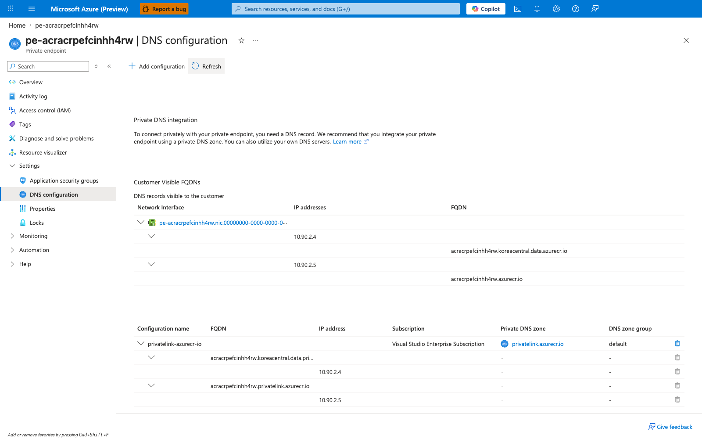

[Observed] Log Analytics workspace `log-acrpefci-nhh4rw` → Logs blade with the recover-window KQL query: `AZFWApplicationRule | where Fqdn endswith ".azurecr.io" | take 20` returns 15 rows. The rows that the recover-gate query in `falsify.sh` saw are all here — `Fqdn` column shows both `acracrpefcinhh4rw.azurecr.io` (login endpoint) and `acracrpefcinhh4rw.koreacentral.data.azurecr.io` (data endpoint); `SourceIp` is consistently `10.90.1.160` (an IP from `snet-aca`, `10.90.0.0/23`); `Action` is `Allow`; `Policy` is `afwp-acrpefci-nhh4rw`; `RuleCollectionGroup` is `acr-and-platform-allow`. `TimeGenerated` values are in the `2026-06-06T06:32:07Z` cluster, which is the recover-deploy window. **These are the rows whose absence during the bypass window proves the silent bypass.** During the bypass window, the same query returned zero rows for the bypass-timestamp range; during the recover window, the same query returned 10+ rows for the recover-timestamp range. The presence-during-recover vs. absence-during-bypass with everything else held constant (same policy, same rule, same source subnet, same FQDN, same PE) is the falsification proof at the firewall layer.

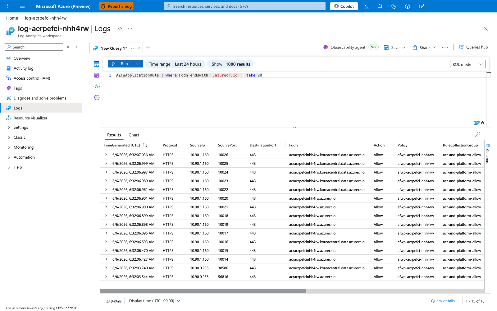

[Inferred] The ten captures, taken in time order from the Portal, document Scenario C's required topology (Container Apps environment integrated into the VNet — capture 01; VNet with four subnets including `snet-pe` and the two firewall subnets — capture 02; ACR public surface fully disabled — capture 03; PE-only access with one approved Private Endpoint — capture 04; Azure Firewall Basic with private IP `10.90.3.4` — capture 05; firewall policy with application rules allowing ACR login + data + MCR + acs-mirror by FQDN — capture 06; route table with both `/32` PE routes pointing at the firewall — capture 07; PE NIC primary IP `10.90.2.4` — capture 08; PE DNS configuration showing both FQDN→IP mappings — capture 09) and prove the lab's central finding via the firewall log evidence (capture 10): the firewall recorded the recover-window pull with full structured columns (`Fqdn`, `SourceIp`, `Action`, `Policy`, `RuleCollectionGroup`), and the same query against the bypass window returns zero rows even though the v-bypass pull provably succeeded. The Portal captures complement the CLI evidence above — together they show that Scenario C's controlled variable lives on the route table (`/32` UDR routes for the PE NIC IPs), the IPs those routes must cover live on the PE NIC (`networkInterfaces.ipConfigurations[].privateIPAddress`), and the firewall's visibility into the inspected traffic is observable from Azure Firewall application-rule logs in Log Analytics (resource-specific `AZFWApplicationRule` after Dedicated-mode activation, with legacy `AzureDiagnostics` rows still possible during the transition window). This is the only lab in the 5-lab ACR network path series where the failure mode is "successful pull, silent inspection" rather than a visibly failed pull — and it is the worst-case-for-detection failure mode for a security team because no workload-layer signal indicates the bypass.

## Clean Up

```bash
bash labs/acr-network-path-pe-forced-inspection/cleanup.sh
```

Which runs:

```bash
az group delete --name "$RG" --yes --no-wait
```

| Command | Why it is used |
|---|---|
| `az group delete --no-wait` | Deletes the lab resource group and everything in it (Azure Firewall Basic + 2 public IPs, Premium ACR + Private Endpoint, VNet with 4 subnets, route table, Container App, environment, Private DNS Zone, Log Analytics workspace). The firewall has no deletion ordering issues at the resource group level — the resource group delete tears down the firewall, public IPs, PE, and subnets atomically. |

Azure Firewall Basic + its two public IPs is the dominant cost (~$24/day) — do not leave the lab running between sessions. ACR Premium is the second cost (~$1.67/day). Total run cost for a 2-3 hour reproduction is ~$3-4 USD.

## Related Playbook

- [Private Endpoint DNS Failure](../playbooks/networking-advanced/private-endpoint-dns-failure.md) — covers the Private Endpoint DNS failure family (Scenarios D and E). Lab 5 (Scenario C) is the *routing* failure on the Private Endpoint path rather than a DNS failure; both share the structural property that the PE infrastructure is healthy but a non-DNS layer (routing for Scenario C, DNS for Scenarios D/E) is misconfigured.
- [UDR and NSG Egress Blocked](../playbooks/networking-advanced/udr-nsg-egress-blocked.md) — covers UDR/NSG misconfigurations that break Container Apps egress. The Scenario C silent-bypass pattern is the dual of a hard-block UDR failure: instead of a UDR blocking traffic that should flow, Scenario C is a *missing* UDR that fails to inspect traffic that does flow.

## See Also

- [ACR Network Path Selection](../../platform/networking/acr-network-path-selection.md) — the platform decision page this lab implements; see **Path C: ACR Private Endpoint with Forced Inspection**
- [ACR Network Path A Lab — Firewall Allowlist](./acr-network-path-firewall-allowlist.md) — the public-with-firewall alternative to Path C's PE-with-firewall topology. Lab 4 (Scenario A) uses ACR's public surface with a firewall PIP allowlist; Lab 5 (Scenario C) uses ACR's Private Endpoint with `/32` UDR routes for the PE NIC IPs. Both labs use admin-credential auth to remove the managed-identity control-plane confound.
- [ACR Network Path B Lab — PE Direct](./acr-network-path-pe-direct.md) — Scenario B, the Private Endpoint topology without forced inspection. Scenario C is Scenario B *plus* the forced-inspection layer. Lab 1 (Scenario B) used managed identity, which made fresh-pull proof difficult; Lab 5 uses admin credentials for the same reason Lab 4 did.
- [ACR Network Path D Lab — Record-Level Zone Authority](./acr-network-path-record-split-brain.md) — Scenario D, the record-CONTENT failure on the Path B private path. Same managed-identity-confound caveat as Lab 1 / Lab 3.
- [ACR Network Path E Lab — DNS Forwarder Bypass](./acr-network-path-dns-forwarder-bypass.md) — Scenario E, the resolver-topology failure on the Path B private path.
- [Manage network policies for Private Endpoints (Microsoft Learn)](https://learn.microsoft.com/en-us/azure/private-link/disable-private-endpoint-network-policy) — official reference for `privateEndpointNetworkPolicies` on the PE subnet, which must be `Enabled` for UDRs to apply to PE traffic.
- [Virtual network traffic routing (Microsoft Learn)](https://learn.microsoft.com/en-us/azure/virtual-network/virtual-networks-udr-overview) — official reference for longest-prefix-match routing semantics and the customer-route-precedence rule.

## Sources

- [Manage network policies for Private Endpoints (Microsoft Learn)](https://learn.microsoft.com/en-us/azure/private-link/disable-private-endpoint-network-policy) — the `privateEndpointNetworkPolicies` property on the PE subnet, which is the prerequisite for UDRs to apply to PE traffic. Lab 5's Bicep sets this to `'Enabled'` on `snet-pe`.
- [Virtual network traffic routing (Microsoft Learn)](https://learn.microsoft.com/en-us/azure/virtual-network/virtual-networks-udr-overview) — longest-prefix-match semantics and the customer-route-precedence rule. The lab's central thesis (that a `0.0.0.0/0` UDR loses to system `/32` routes for Private Endpoints) is a direct consequence of these rules.
- [Use Azure Firewall with Azure Container Apps (Microsoft Learn)](https://learn.microsoft.com/en-us/azure/container-apps/use-azure-firewall) — official guidance for the forced-egress-through-firewall pattern, including the UDR + firewall private-IP-as-next-hop requirement.
- [Connect privately to an Azure container registry using Azure Private Link (Microsoft Learn)](https://learn.microsoft.com/en-us/azure/container-registry/container-registry-private-link) — ACR Private Endpoint topology, including the fact that the PE NIC holds separate IPs for the login endpoint and each region's data endpoint.
- [Azure Firewall structured logs (Microsoft Learn)](https://learn.microsoft.com/en-us/azure/firewall/firewall-structured-logs) — the `AZFWApplicationRule` resource-specific table and the `logAnalyticsDestinationType: 'Dedicated'` requirement on the diagnostic settings resource.
- [Networking in Azure Container Apps (Microsoft Learn)](https://learn.microsoft.com/en-us/azure/container-apps/networking) — Container Apps VNet integration, workload-profile subnet requirements (delegation, `/23` minimum), and inheritance of UDRs.
- [Revisions in Azure Container Apps (Microsoft Learn)](https://learn.microsoft.com/en-us/azure/container-apps/revisions) — revision lifecycle, including the cached-image-layer behavior that lets an already-running revision survive a routing change.
- [Authenticate with an Azure container registry (Microsoft Learn)](https://learn.microsoft.com/en-us/azure/container-registry/container-registry-authentication) — admin user vs. managed identity; the auth choice that makes this lab's single-controlled-variable design possible (same reason as Lab 4).
- [Azure Firewall diagnostic logs (Microsoft Learn)](https://learn.microsoft.com/en-us/azure/firewall/firewall-diagnostics) — overview of the diagnostic categories (`AzureFirewallApplicationRule`, `AzureFirewallNetworkRule`, `AzureFirewallDnsProxy`) and their resource-specific dedicated tables.
