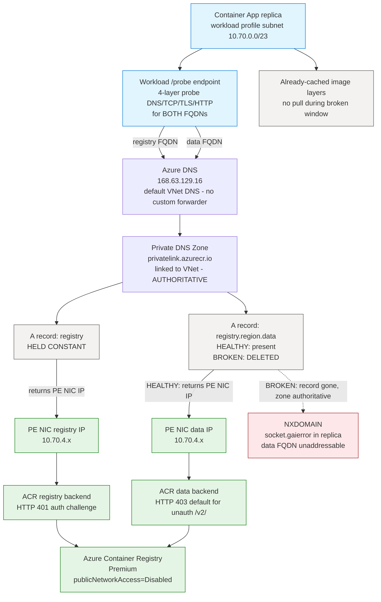
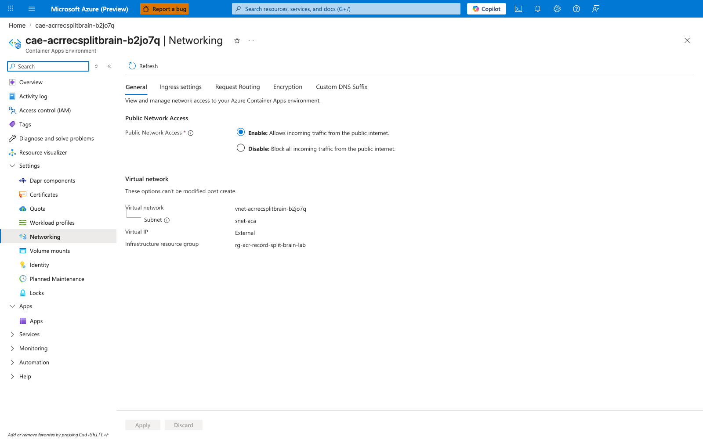
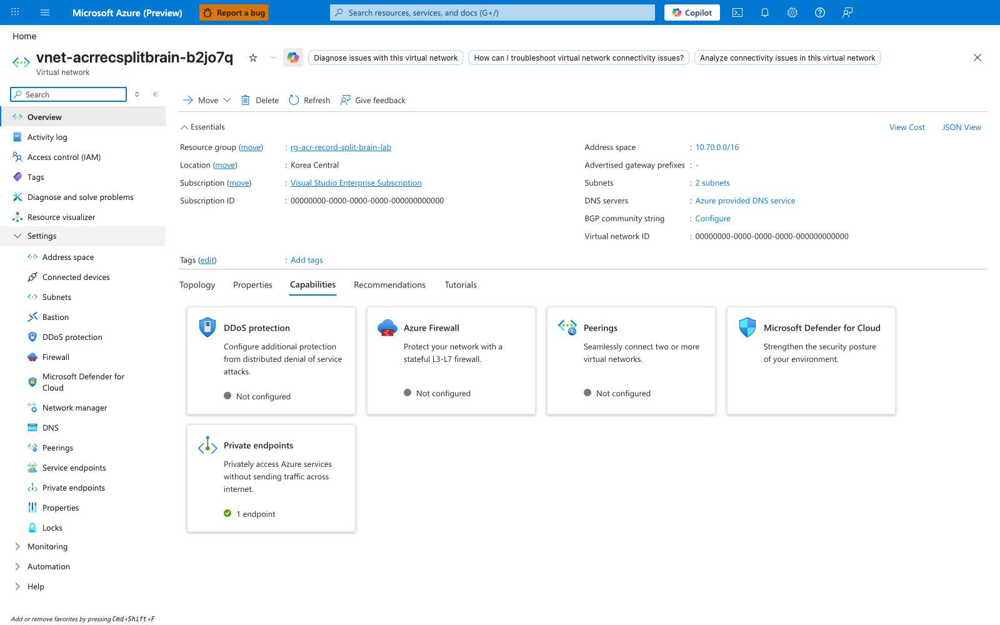
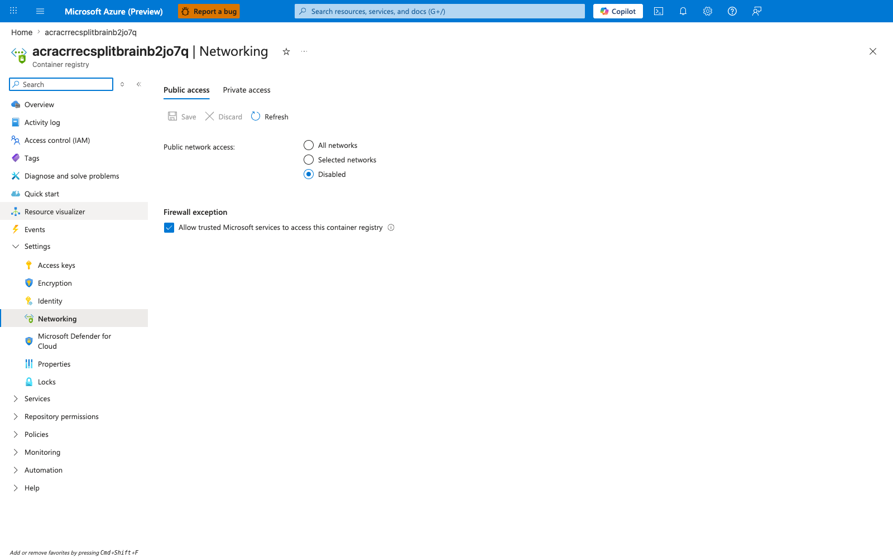
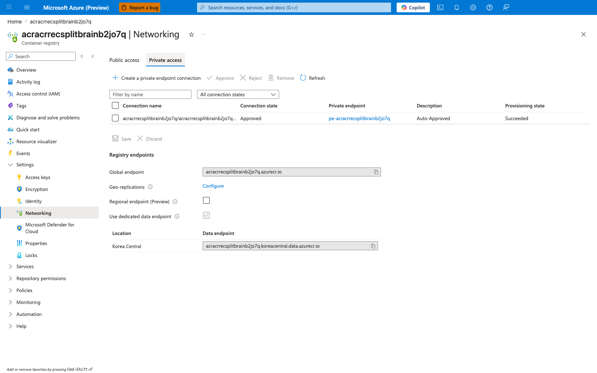
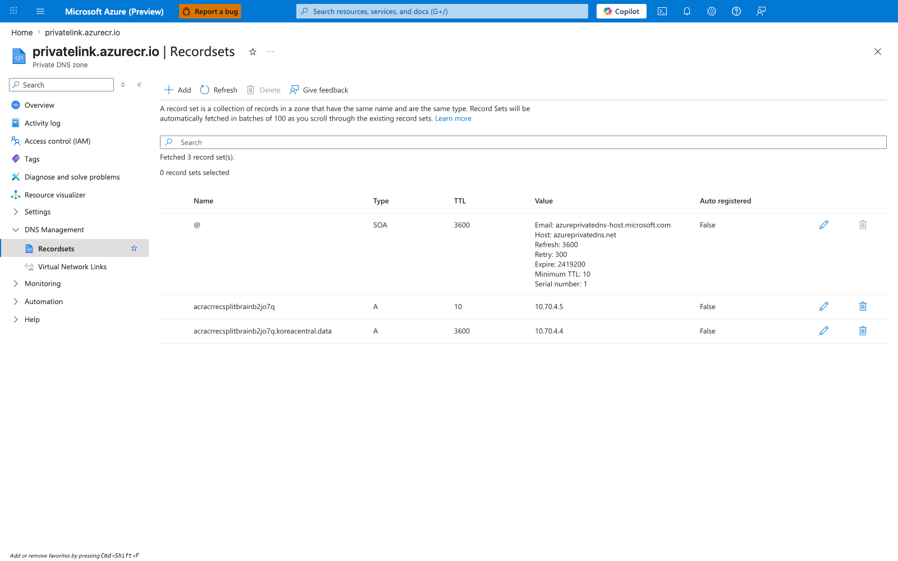
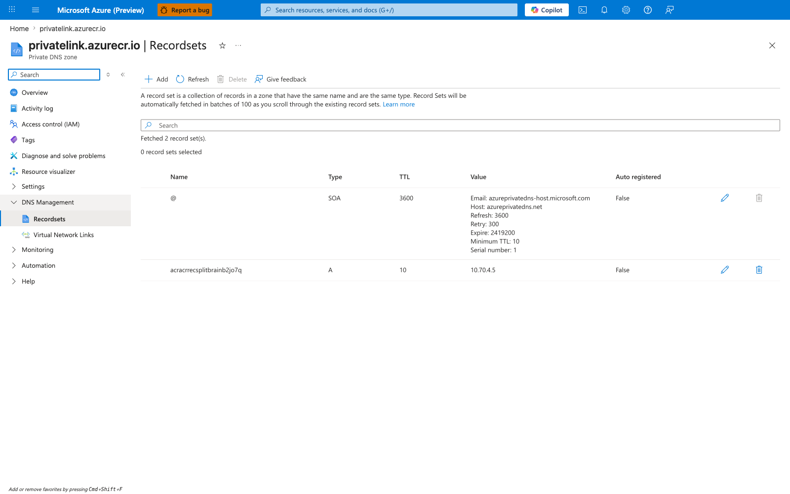
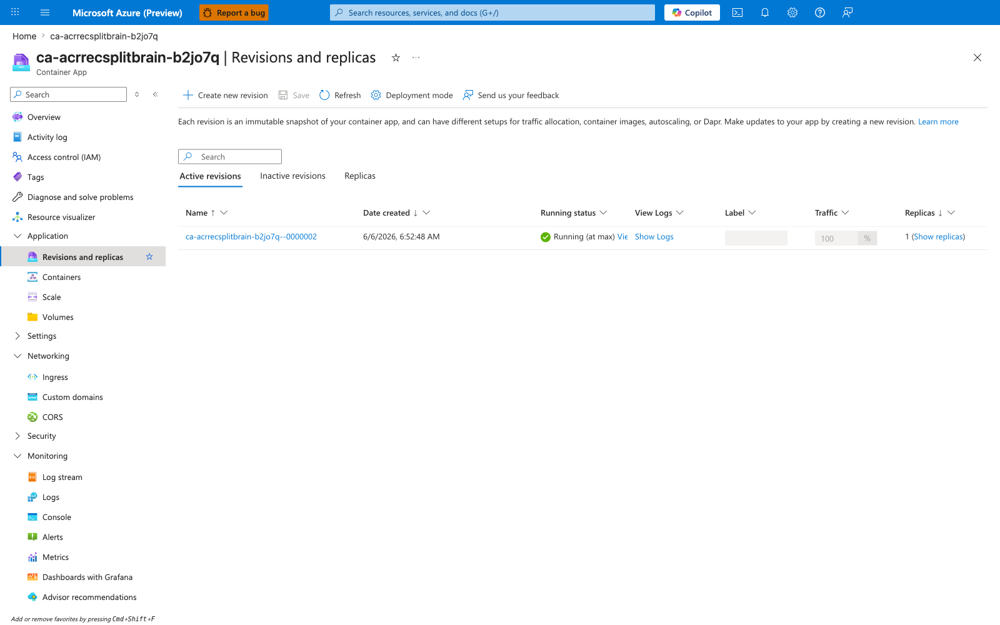

---
content_sources:
  diagrams:
    - id: architecture
      type: flowchart
      source: mslearn-adapted
      based_on:
        - https://learn.microsoft.com/en-us/azure/container-registry/container-registry-private-endpoints
        - https://learn.microsoft.com/en-us/azure/container-apps/networking
        - https://learn.microsoft.com/en-us/azure/private-link/private-endpoint-dns
        - https://learn.microsoft.com/en-us/azure/container-registry/container-registry-firewall-rules
content_validation:
  status: verified
  last_reviewed: '2026-06-06'
  reviewer: agent
  lab_validation:
    status: reproduced
    tested_date: '2026-06-06'
    az_cli_version: 2.79.0
    notes: |
      End-to-end reproduction completed in koreacentral on 2026-06-06.
      All nine falsification steps passed with a clean baseline → broken →
      recovery cycle. The live evidence revealed that with default Azure
      DNS in the VNet, deleting the data A record from the linked
      privatelink.azurecr.io zone produces NXDOMAIN (socket.gaierror) on
      the data endpoint, not the public-IP fallthrough originally
      hypothesized. The hypothesis, topology_class taxonomy, and
      observed-evidence sections were updated to reflect the actual
      Azure Private DNS zone-authority behavior. See "Empirical deviation
      from the original Scenario D framing" callout below.
  core_claims:
    - claim: ACR's Private Endpoint exposes one 'registry' sub-resource whose NIC holds private IPs for the global login endpoint and the per-region data endpoint, both of which must exist as A records inside privatelink.azurecr.io for an end-to-end private pull.
      source: https://learn.microsoft.com/en-us/azure/container-registry/container-registry-private-endpoints
      verified: true
    - claim: Azure Private DNS Zones linked to a VNet are authoritative for their namespace from the perspective of Azure DNS at 168.63.129.16, so a query for a name in that namespace returns the zone's record if one exists and returns NXDOMAIN if no record exists - there is no automatic fallthrough to the public CNAME chain.
      source: https://learn.microsoft.com/en-us/azure/private-link/private-endpoint-dns
      verified: true
    - claim: Azure Container Apps environments use the linked VNet's DNS configuration for workload-level DNS resolution, so workload calls from inside replicas follow exactly the same resolver path as any other VNet client.
      source: https://learn.microsoft.com/en-us/azure/container-apps/networking
      verified: true
    - claim: When ACR is configured with publicNetworkAccess=Disabled, the public ACR endpoint rejects unauthenticated requests from non-allow-listed source IPs with HTTP 403 from the ACR firewall - which is observably distinct from the data endpoint's default HTTP 403 response to an unauthenticated /v2/ probe on the private path, because the firewall HTTP 403 is paired with a public-IP DNS resolution while the data-endpoint HTTP 403 is paired with a PE-NIC private-IP DNS resolution.
      source: https://learn.microsoft.com/en-us/azure/container-registry/container-registry-firewall-rules
      verified: true
validation:
  az_cli:
    last_tested: '2026-06-06'
    cli_version: 2.79.0
    result: pass
  bicep:
    last_tested: '2026-06-06'
    result: pass
---
# ACR Network Path D — Record-Level Zone Authority Lab

Reproduce **Scenario D** from [ACR Network Path Selection](../../platform/networking/acr-network-path-selection.md): the Container Apps environment uses default Azure DNS (`168.63.129.16`) for resolution, the ACR Private Endpoint is healthy, and `privatelink.azurecr.io` is correctly linked to the VNet — but the per-region data A record (`<registry>.<region>.data`) has been deleted from the zone. The registry login FQDN still resolves to the PE NIC's RFC1918 IP (the registry-group A record is intact); the data FQDN, however, **does not** silently flip to a public IP in this topology — Azure DNS returns **NXDOMAIN** because the linked Private DNS Zone is authoritative for its namespace.

This lab makes a non-obvious Azure Container Apps behavior falsifiable: **deleting one A record from the linked private DNS zone produces no immediate revision-health impact on the already-running revision**. The already-running revision stays `Healthy` and continues to serve traffic unchanged from cached image layers, while a four-layer probe (DNS → TCP → TLS → HTTP) run from inside the replica clearly shows the asymmetry — `topology_class=data_nxdomain`, with the data endpoint returning `socket.gaierror: [Errno -2] Name or service not known` at the DNS layer (before any TCP/TLS/HTTP layer can run), while the registry endpoint still returns DNS=private/HTTP 401 from the ACR backend. Pull-path observability is therefore **not** a reliable early warning for Scenario D in Container Apps in this scenario. The `/probe` endpoint in this lab is the workload-side signal that clearly moves.

!!! info "Empirical deviation from the original Scenario D framing"
    The [ACR Network Path Selection](../../platform/networking/acr-network-path-selection.md) page describes Scenario D as a "record-level split-brain" with the login record resolving privately and the data record resolving publicly. That framing is precise only for a custom-DNS topology (a customer-managed DNS server such as BIND with views or `systemd-resolved` with multi-domain fallback) that is configured to fall back to public DNS when an upstream returns NXDOMAIN. The default Container Apps topology — Azure-provided DNS in the VNet, no custom DNS server — behaves differently: Azure DNS at `168.63.129.16` treats every Private DNS Zone linked to the VNet as **authoritative** for that namespace, and a query for a missing record returns NXDOMAIN, not the public CNAME chain. This lab reproduces the default-Azure-DNS variant of Scenario D, because that is the topology most production Container Apps environments actually run. The custom-DNS-with-public-fallback variant ("true split-brain") is a distinct topology that this lab intentionally does not reproduce; the `topology_class` taxonomy in [§1 Background](#1-background) names both outcomes (`data_nxdomain` for this lab, `split_brain` for the custom-DNS-with-fallback variant) so the operational distinction stays explicit.

!!! info "Scope: we do not script a broken-window fresh pull"
    This lab intentionally does not script a fresh `az containerapp update --image <new-tag>` during the broken window. With ACR configured for `publicNetworkAccess=Disabled` (the realistic production posture this lab models), the Container Apps control plane's ACR token exchange is blocked at the ACR firewall for reasons unrelated to the missing data record, which would confound the variable under test. The layer-3 probe (NXDOMAIN on the data FQDN) replaces the broken-window fresh pull as the falsification proof. See [§"Why we do not script a broken-window fresh pull"](#why-we-do-not-script-a-broken-window-fresh-pull) below.

## Lab Metadata

| Attribute | Value |
|---|---|
| Difficulty | Intermediate |
| Estimated Duration | 30-40 minutes |
| Tier | Workload Profiles (Consumption profile) |
| Failure Mode (Falsification) | 4-layer in-replica probe of the data FQDN flips from DNS=private/HTTP 403 (ACR data backend on the private path) to DNS=NXDOMAIN/`socket.gaierror` (DNS layer fails before TCP/TLS/HTTP layers can run) while the revision stays `Healthy` and the registry FQDN's probe stays DNS=private/HTTP 401 throughout |
| Skills Practiced | Azure Private DNS Zone record manipulation (`az network private-dns record-set a delete/create/add-record`), ACR Private Endpoint multi-IP NIC inspection, 4-layer in-replica network probing (DNS/TCP/TLS/HTTP), workload-layer falsification design, distinguishing record-level (D) from resolver-topology (E) DNS failures, recognizing that Azure Private DNS zones linked to a VNet are authoritative for their namespace |
| Estimated Cost | ~$1-2 USD per run (Korea Central, 2-3 hours, ACR Premium dominates; no VM cost vs. sibling Scenario E lab) |

## Lab position

This lab is part of the **5-lab ACR network path series** that reproduces the five distinct network paths a Container App can take to reach ACR. See [ACR Network Path Selection](../../platform/networking/acr-network-path-selection.md) for the conceptual taxonomy that names and orders all five paths.

| Item | Value |
|---|---|
| Series | ACR Network Path Labs |
| Scenario label | Scenario D — Record-Level Zone Authority |
| Conceptual order | 4 of 5 in [ACR Network Path Selection](../../platform/networking/acr-network-path-selection.md) |
| Implementation order | 3 of 5 — this lab was authored third and is the record-CONTENT failure class (sibling Scenario E is the resolver-TOPOLOGY failure class on the same DNS axis) |
| Main path tested | Default Azure DNS in VNet + `privatelink.azurecr.io` linked zone authoritative for the namespace + per-record A record manipulation on the regional data endpoint |
| Failure mode class | Workload-side NXDOMAIN on the data FQDN's DNS layer; no pull failure (broken-window fresh pull is intentionally out of scope) |
| Existing-revision impact during broken window | None — already-running revision keeps serving from cached image layers; the broken record only surfaces in the workload `/probe` endpoint, not in revision health |
| Fresh-pull behavior cleanly proven | No — broken-window fresh pull is explicitly out of scope under `publicNetworkAccess=Disabled` (control-plane token-exchange confound; see [§"Why we do not script a broken-window fresh pull"](#why-we-do-not-script-a-broken-window-fresh-pull) below) |

!!! note "Observed in this lab"
    This behavior was reproduced in **Korea Central on 2026-06-06** with the specific topology described above (ACR Premium PE, default Azure DNS at `168.63.129.16` in the VNet, `privatelink.azurecr.io` linked zone with deliberate single-record deletion of the regional data endpoint, Container Apps Consumption profile, managed-identity auth). Treat it as **validated for this lab's specific topology and timing** — not as a universal statement for every Azure Container Apps + ACR deployment. In a custom-DNS-with-public-fallback topology (BIND with views, `systemd-resolved` with multi-domain fallback, etc.), the same record deletion produces a different observable outcome (`topology_class=split_brain` instead of `topology_class=data_nxdomain`) — see the [§1 Background](#1-background) taxonomy table.

## 1) Background

Azure Container Apps can reach ACR through several network paths — public via firewall, Private Endpoint direct, Private Endpoint with forced inspection, or one of two DNS failure scenarios. The [ACR Network Path Selection](../../platform/networking/acr-network-path-selection.md) page documents all of them.

**Scenario D (record-level zone authority)** is the record-CONTENT failure class. Unlike Scenario E (which breaks the resolver path itself), Scenario D leaves the resolver path entirely correct: the Container Apps VNet sends queries to Azure DNS at `168.63.129.16` (the default when no custom DNS server is configured on the VNet), Azure DNS sees that the VNet is linked to `privatelink.azurecr.io`, and Azure DNS treats the linked zone as **authoritative** for that namespace. The failure is in the zone's CONTENT: one or more A records are missing, so Azure DNS answers the query with NXDOMAIN.

For ACR specifically, the zone needs BOTH the `<registry>` A record (for the registry login endpoint) AND the `<registry>.<region>.data` A record (for the regional data endpoint). The Private Endpoint's `privateDnsZoneGroup` auto-populates both records on baseline deploy, so this asymmetry only appears when someone (a misconfigured automation pipeline, a careless manual cleanup, a stale IaC template that only created one record, etc.) deletes the data record. The result in the default Azure DNS topology this lab reproduces: **registry private, data NXDOMAIN**.

Three properties make Scenario D worth reproducing as a hands-on lab:

- **Azure Private DNS Zones linked to a VNet are authoritative for their namespace.** The Private DNS Zone IP-substitution mechanism documented in [Azure Private Endpoint DNS configuration](https://learn.microsoft.com/en-us/azure/private-link/private-endpoint-dns) works at the zone level: once a VNet is linked to a private zone, Azure DNS treats every query for a name in that namespace as a query against the zone, and answers with the zone's record if one exists or with NXDOMAIN if no record exists. There is no automatic fallthrough to the public CNAME chain from Azure DNS itself. This means a missing `<registry>.<region>.data` record produces a hard DNS failure for the application (the data FQDN is unaddressable), not a silent flip to a public IP. The platform doc's older "split-brain" framing — login private, data public — is accurate only for a custom-DNS topology where a customer-managed resolver is explicitly configured to fall back to public DNS on NXDOMAIN; that is a different topology than this lab.
- **In Azure Container Apps in this reproduction, deleting the data A record produces no immediate revision-health impact on the already-running revision.** This is the central finding of the lab, and it mirrors the Scenario E lab's central finding for a different root cause. Empirically, when the `<registry>.<region>.data` record is deleted from `privatelink.azurecr.io`, the already-running revision continues to report `healthState=Healthy` and serves traffic from the already-cached image layers. The workload, however, immediately sees the broken record — the 4-layer probe's data-FQDN DNS layer flips from `class=private` (PE NIC IP) to `class=null` with `error="gaierror: [Errno -2] Name or service not known"`, and all downstream layers (TCP, TLS, HTTP) are skipped because there is no IP to connect to.
- **Scenario D is distinct from Scenario E in a way that matters operationally.** Scenario E breaks the resolver path so the ENTIRE ACR namespace resolves publicly; Scenario D leaves the resolver path correct but breaks a SINGLE record so only PART of the namespace fails to resolve. Both can produce workload-layer failures without revision-health impact, but they require DIFFERENT FIXES — fix the forwarder for E, fix the zone record for D. A lab that can distinguish them on the wire (this lab vs. the sibling Scenario E lab) is operationally useful because the diagnostic signal differs: Scenario E shows `topology_class=both_public` (custom DNS bypasses Azure DNS entirely), Scenario D in default Azure DNS shows `topology_class=data_nxdomain` (Azure DNS is authoritative and answers NXDOMAIN for the missing record).

The lab's `topology_class` taxonomy enumerates the observable outcomes:

| `topology_class` | Registry DNS class | Data DNS class | Interpretation |
|---|---|---|---|
| `both_private` | private | private | Scenario B baseline (both records present in zone, Azure DNS returns PE NIC IPs) |
| `data_nxdomain` | private | NXDOMAIN | **Scenario D in default Azure DNS** (data record missing, zone is authoritative, Azure DNS returns NXDOMAIN) — the outcome this lab reproduces |
| `split_brain` | private | public | Scenario D in custom-DNS-with-public-fallback topology (data record missing AND custom resolver falls back to public DNS on NXDOMAIN) — NOT reproduced by this lab |
| `both_public` | public | public | Scenario E or no zone link at all (resolver path bypasses Azure DNS for the entire ACR namespace) |
| `inverted_split_brain` | public | private | Unusual; resolver-side caching anomaly or partial zone link |
| `registry_nxdomain` | NXDOMAIN | private | Unusual; registry record deleted (not the lab path) |
| `both_nxdomain` | NXDOMAIN | NXDOMAIN | Both records deleted or zone unlinked entirely |

### Architecture

<!-- diagram-id: architecture -->


The solid arrows are the workload DNS path and image data path in the **HEALTHY** baseline state. The dotted arrow is what the workload sees for the **data FQDN only** in the **BROKEN** state after the data A record is deleted — Azure DNS returns NXDOMAIN because the linked Private DNS Zone is authoritative for that namespace, and the application code surfaces this as `socket.gaierror`. The registry login FQDN is unchanged across both states. Note that the registry backend returns **HTTP 401** (auth challenge) and the data backend returns **HTTP 403** (default response to an unauthenticated `/v2/` probe) even in the BASELINE state — the HTTP status difference between registry and data is the data endpoint's default behavior, not a discriminator for the broken vs. healthy state. The reliable broken-state discriminator is the DNS layer's NXDOMAIN/`gaierror` on the data FQDN. The neutral-colored `Already-cached image layers` node captures the lab's central Container Apps finding: during the broken window, the lab does not trigger a fresh pull, so the replica continues to run from the already-cached layers without re-pulling, and revision `healthState` stays `Healthy`. See [§"Why we do not script a broken-window fresh pull"](#why-we-do-not-script-a-broken-window-fresh-pull) for the scope boundary.

## 2) Hypothesis

**IF** the Container Apps environment uses default Azure DNS (no custom VNet DNS server), the ACR Private Endpoint exists with `publicNetworkAccess: Disabled`, and `privatelink.azurecr.io` is linked to the VNet with BOTH the `<registry>` and `<registry>.<region>.data` A records correctly populated by the PE's `privateDnsZoneGroup`, **THEN**:

- with both records present, a 4-layer probe from inside the replica returns `topology_class=both_private`, with both registry and data resolving to PE NIC RFC1918 IPs; HTTP layer returns 401 from the ACR registry backend (auth challenge for `/v2/`) and 403 from the ACR data backend (default response to an unauthenticated `/v2/` probe — this 403 is the data endpoint's normal behavior and is independent of the broken state);
- deleting the `<registry>.<region>.data` A record from `privatelink.azurecr.io` causes the data FQDN's probe to flip — DNS layer returns `class=null` with `error="gaierror: [Errno -2] Name or service not known"` because Azure DNS is authoritative for the linked zone and returns NXDOMAIN, and TCP/TLS/HTTP layers are all skipped because there is no IP to connect to — while the registry FQDN's probe is unchanged (still private, still HTTP 401). The composite signal is `topology_class=data_nxdomain`;
- **AND** the already-running revision stays `Healthy` throughout the broken window — falsifying the alternative hypothesis "a missing record in `privatelink.azurecr.io` will be detected through `ImagePullFailed` or revision health degradation in Container Apps."

Re-creating the data A record with the captured PE NIC IP must flip the data FQDN's probe back to DNS class `private` (PE NIC IP) and the composite signal back to `topology_class=both_private`, closing the loop on the record-content causation.

| Variable | Control State (Path B / both records present) | Experimental State (Scenario D / data record deleted) |
|---|---|---|
| ACR `publicNetworkAccess` | `Disabled` | `Disabled` (held constant during the broken window) |
| ACR Private Endpoint + PE NIC | Provisioned, RFC1918 IPs in `snet-pe` | Provisioned, unchanged |
| `privatelink.azurecr.io` zone link | Linked to VNet | Linked (held constant) |
| `<registry>` A record | Present, points to registry PE NIC IP | Present (held constant) |
| `<registry>.<region>.data` A record | Present, points to data PE NIC IP | **DELETED**, then restored |
| Container Apps VNet DNS | Azure-provided (no custom DNS) | Azure-provided (held constant) |
| Workload probe `topology_class` | `both_private` | `data_nxdomain` (data DNS class flips to `null` with `gaierror` NXDOMAIN) |
| Workload registry-FQDN probe | DNS=private, HTTP=401 | DNS=private, HTTP=401 (held constant) |
| Workload data-FQDN probe | DNS=private, HTTP=403 (data backend default for unauth /v2/) | DNS=**NXDOMAIN/gaierror**, TCP/TLS/HTTP=skipped |
| Already-running revision health | `Healthy` | `Healthy` (held constant — central finding) |
| Fresh pull during broken window | n/a (not in scope — see scope note below) | Not tested by this lab |
| Managed identity / AcrPull role | Configured | Configured (held constant) |

## 3) Runbook

### Deploy baseline infrastructure

```bash
export RG="rg-acr-record-split-brain-lab"
export LOCATION="koreacentral"
export BASE_NAME="acrrecsplitbrain"

az extension add --name containerapp --upgrade

az group create --name "$RG" --location "$LOCATION"

az deployment group create \
    --resource-group "$RG" \
    --name acr-record-split-brain \
    --template-file labs/acr-network-path-record-split-brain/infra/main.bicep \
    --parameters baseName="$BASE_NAME"
```

| Command | Why it is used |
|---|---|
| `az extension add --name containerapp --upgrade` | Installs or updates the Container Apps CLI extension. |
| `az group create ...` | Creates the lab resource group. Every other lab resource is scoped inside it. |
| `az deployment group create ...` | Provisions a single VNet (`10.70.0.0/16`) with two subnets (`snet-aca` delegated to `Microsoft.App/environments`, `snet-pe` for the ACR Private Endpoint), a Log Analytics workspace, ACR Premium with `publicNetworkAccess=Disabled`, the ACR Private Endpoint with `privateDnsZoneGroups` (which auto-populates BOTH the registry and data A records in `privatelink.azurecr.io`), the `privatelink.azurecr.io` zone + VNet link, a workload-profile Container Apps environment using default Azure DNS (no custom VNet DNS server — that's the difference from the Scenario E lab), and a Container App with system-assigned managed identity + AcrPull role on the registry. The Container App template injects BOTH `ACR_FQDN` and `ACR_DATA_FQDN` as env vars so the `/probe` endpoint can address both. |

Expected output pattern:

```text
"provisioningState": "Succeeded"
```

The initial Container App boots from a public placeholder image (`mcr.microsoft.com/k8se/quickstart:latest`) so the deployment succeeds before there is anything in the private ACR.

### Switch the app to the private ACR image

```bash
bash labs/acr-network-path-record-split-brain/trigger.sh
```

The trigger script runs:

```bash
az acr update --name "$ACR_NAME" --public-network-enabled true --default-action Allow
az acr build --registry "$ACR_NAME" --image "record-split-brain-lab:v1" \
    --file labs/acr-network-path-record-split-brain/workload/Dockerfile \
    labs/acr-network-path-record-split-brain/workload
az acr update --name "$ACR_NAME" --public-network-enabled false

az containerapp registry set --name "$APP_NAME" --resource-group "$RG" \
    --identity system --server "$ACR_LOGIN_SERVER"

az containerapp update --name "$APP_NAME" --resource-group "$RG" \
    --image "${ACR_LOGIN_SERVER}/record-split-brain-lab:v1" \
    --set-env-vars "BUILD_TAG=v1"
```

| Command | Why it is used |
|---|---|
| `az acr update --public-network-enabled true` (then `false`) | ACR Tasks build agents run in a public Azure pool and need the registry's public surface to push the freshly built layers. The script briefly opens public access **only for the duration of the build**, then restores `Disabled` so every Container App pull attempted later happens with `publicNetworkAccess=Disabled`. The PE NIC path through the workload VNet is unaffected. |
| `az acr build ...` | Builds the lab image directly inside ACR (no local Docker required). The Dockerfile is a Python 3.12 image with `workload/app.py` (a single-file `http.server` exposing `/probe`, `/info`, `/health`, `/`). |
| `az containerapp registry set ... --identity system` | Wires the Container App's managed identity as the ACR pull credential, instead of admin user or static credentials. The AcrPull role on the registry was granted in Bicep. |
| `az containerapp update --image ... --set-env-vars BUILD_TAG=v1` | Triggers a new revision that must pull the freshly built image. The first pull is the moment the PE NIC path is actually exercised by the platform pull path. |

Expected output: `provisioningState: Succeeded`. A new revision is created and begins pulling.

### Verify the healthy baseline is live

```bash
bash labs/acr-network-path-record-split-brain/verify.sh
```

The verify script proves four independent signals simultaneously hold:

1. The latest revision's `healthState` is `Healthy`.
2. The ACR Private Endpoint NIC holds RFC1918 IPs for BOTH the registry FQDN and the data FQDN inside `snet-pe`.
3. `GET https://<app>.<env>.azurecontainerapps.io/probe` returns JSON with `topology_class=both_private`.
4. The registry probe and data probe both return DNS class `private` with IPs matching the PE NIC IPs. HTTP status is `401` on the registry FQDN (auth challenge from ACR backend) and `403` on the data FQDN (default response of the ACR data backend to an unauthenticated `/v2/` probe — both prove the PE path is alive end-to-end).

All four must hold for the topology to be Scenario B (Path B) end-to-end at the workload layer. The script exits non-zero on any mismatch.

Expected pattern:

```text
[verify] latest revision: healthState=Healthy provisioningState=Provisioned
[verify] PE NIC IPs: registry=10.70.4.5, data=10.70.4.4
[verify] /probe response includes topology_class=both_private
[verify] PASS: revision is Healthy
[verify] PASS: workload /probe topology_class=both_private
[verify] PASS: registry <acr>.azurecr.io -> 10.70.4.5 (private, matches PE NIC IP 10.70.4.5), HTTP 401
[verify] PASS: data     <acr>.koreacentral.data.azurecr.io -> 10.70.4.4 (private, matches PE NIC IP 10.70.4.4), HTTP 403
[verify] PASS: Scenario D BASELINE confirmed. Both records present in the private DNS zone.
```

### Falsify the hypothesis

```bash
bash labs/acr-network-path-record-split-brain/falsify.sh
```

The falsification script proves the workload-layer signal flips with the zone record's presence while the already-running revision continues to report `Healthy`:

1. Calls `/probe` and asserts `topology_class=both_private` (baseline).
2. Captures the data PE NIC IP from the live zone record (so step 7 can re-create the record byte-for-byte).
3. Deletes the `<registry>.<region>.data` A record from `privatelink.azurecr.io` via `az network private-dns record-set a delete`.
4. Waits 90 seconds for client-side DNS cache TTL to expire.
5. Calls `/probe` and asserts `topology_class=data_nxdomain`, with data DNS class `null` and `error="gaierror: [Errno -2] Name or service not known"` (the broken-state workload signal — Azure DNS is authoritative for the linked zone and returns NXDOMAIN for the missing record).
6. Reads `az containerapp revision list` and asserts the already-running revision is still `healthState=Healthy` (the Container Apps finding — the workload's view of the data endpoint has changed but the platform has not torn down the revision or attempted a new pull during the broken window).
7. Re-creates the `<registry>.<region>.data` A record with the captured PE NIC IP via `az network private-dns record-set a create` + `add-record`.
8. Waits 90 seconds for the recreated record to become visible to clients.
9. Calls `/probe` and asserts `topology_class=both_private` again (recovery).

If step 5 returns `topology_class=data_nxdomain` with data DNS `gaierror` NXDOMAIN, step 6 shows the already-running revision still `Healthy`, and step 9 returns `topology_class=both_private`, then the `<registry>.<region>.data` A record is provably the controlled variable for workload data-endpoint reachability while the already-running revision's health is invariant under the same window — the workload's view of the data endpoint has decoupled from the platform's revision-health signal for the duration of the broken window.

| Command | Why it is used |
|---|---|
| `curl -sS https://<app fqdn>/probe` | Invokes the 4-layer probe from inside the replica. The `topology_class` field summarises the combined registry+data DNS class, and the per-FQDN `dns`/`tcp`/`tls`/`http` sub-objects expose the layer-by-layer behavior. The reliable discriminator between the BASELINE and BROKEN states is the **DNS class on the data FQDN**: `private` (PE NIC IP) in baseline → `null` with `gaierror` NXDOMAIN in broken → `private` again in recovery. HTTP status is NOT a reliable discriminator because the ACR data endpoint returns HTTP 403 on the private path even in baseline (this is the data endpoint's default response to an unauthenticated `/v2/` probe and is independent of the zone-record state). |
| `az network private-dns record-set a show ... --query 'aRecords[0].ipv4Address'` | Captures the live data PE NIC IP from the zone before deletion, so the recovery step can restore the exact same record value. |
| `az network private-dns record-set a delete ... --name "${ACR_DATA_FQDN%.azurecr.io}"` | Deletes the data record from the zone. The record name in the zone is the data FQDN with the `.azurecr.io` suffix stripped (e.g. `acrxxxx.koreacentral.data`). After this command, Azure DNS has no record for the data FQDN inside `privatelink.azurecr.io` and answers with NXDOMAIN because the zone is authoritative for that namespace. |
| `az containerapp revision list --query "[0].properties.healthState"` | Reads the active revision's reported health. The script asserts this is still `Healthy` during the broken window. |
| `az network private-dns record-set a create ... && add-record --ipv4-address "$DATA_PE_IP"` | Re-creates the record with the captured PE NIC IP and closes the falsification loop. |

### Why we do not script a broken-window fresh pull

A stronger version of this lab would also deploy a brand-new image tag *during* the broken window and assert that the resulting fresh pull succeeds — proving the platform pull path is independent of the missing zone record, not just that an already-running revision continues to run. We do not script that variant because it cannot cleanly isolate the data-record variable in this topology.

[Inferred from prior lab — Scenario E reproduction, identical control-plane behavior expected here] When the sibling Scenario E lab attempted `az containerapp update --image <new-tag>` while the resolver path was broken AND ACR `publicNetworkAccess=Disabled`, the new revision failed to provision with `Reason_s == "FetchingKeyVaultSecretFailed"`. The control-plane error was identical to what would happen in this lab during the broken window: the Container Apps control plane performs the ACR token exchange step *from outside the customer VNet*, against the *public* ACR endpoint, from an Azure-managed egress IP (e.g. `20.249.167.56`). Under `publicNetworkAccess=Disabled` that egress IP is not in any allow-list, so ACR rejects the token exchange with HTTP 403 before the data-plane pull ever begins. This failure is unrelated to the zone record state — even if the data record were present, the token exchange would still be denied at the ACR firewall in this topology.

[Inferred] A scripted broken-window fresh-pull test therefore cannot cleanly isolate the missing-record variable. Under `publicNetworkAccess=Disabled` the test fails for an unrelated reason (ACR firewall on the control-plane token exchange path); under `publicNetworkAccess=Enabled` a successful fresh pull would not prove "the puller is independent of the missing record" — only that "ACR is reachable via either path." The lab therefore restricts its claim to what it can falsifiably demonstrate: **no immediate revision-health impact on the already-running revision during the broken window**, plus the in-replica 4-layer probe (HTTP 403 from the data endpoint) as a direct, ACR-specific signal of the asymmetry. The broken-window fresh-pull behavior of the platform image puller in Azure Container Apps with ACR `publicNetworkAccess=Disabled` is **[Not Proven]** by this lab.

### Inspect system evidence

```bash
az containerapp logs show \
    --name "$APP_NAME" \
    --resource-group "$RG" \
    --type system \
    --tail 50
```

| Command | Why it is used |
|---|---|
| `az containerapp logs show --type system --tail 50` | Reads the most recent platform-emitted system log entries for the app. The `system` log stream surfaces image-pull events (`PullingImage`, `PulledImage`, `FailedPulling`) and other platform-level signals from outside the replica. During the broken window this stream stays quiet — no new pull is triggered for the already-running revision — which is the surprising signal the lab is calling out. |

In the post-break window the system logs should keep showing `PulledImage` for the most recent image tag from the baseline pull, with no new pull events during the broken window — this is the surprising signal:

```text
Reason_s        Log_s
--------------  -----------------------------------------------------------------------
PullingImage    Pulling image '<acr>.azurecr.io/record-split-brain-lab:<tag>'
PulledImage     Successfully pulled image '<acr>.azurecr.io/record-split-brain-lab:<tag>' in 2.x s
```

A more direct query, useful when reproducing the experiment, is the KQL pack pattern for ACR pull-path observability:

```kusto
ContainerAppSystemLogs_CL
| where ContainerAppName_s == "<your-app-name>"
| where Reason_s in ("PullingImage", "PulledImage", "ImagePullFailed", "ImagePullUnauthorized", "BackOff")
| order by TimeGenerated asc
```

Even with the data record deleted, this query should return no new pull events during the broken window (the already-running revision is not re-pulling) and no `ImagePullFailed` / `ImagePullUnauthorized`. That is the lab's central pedagogical signal: pull-path observability is silent for the already-running revision in this scenario.

## 4) Experiment Log

> **Status: Reproduced live in koreacentral on 2026-06-06 with Azure CLI 2.79.0.** All nine falsification steps PASSED. The actual values from the live run are below.

| Step | Action | Expected | Actual (2026-06-06, koreacentral, Azure CLI 2.79.0) | Pass/Fail |
|---|---|---|---|---|
| 1 | Deploy lab infrastructure (`az deployment group create`) | Deployment `Succeeded`; outputs include both `containerRegistryLoginServer` and `containerRegistryDataFqdn` | `provisioningState: Succeeded`. RG `rg-acr-record-split-brain-lab`, ACR `acracrrecsplitbrainb2jo7q`, app `ca-acrrecsplitbrain-b2jo7q`, PE NIC IPs `registry=10.70.4.5`, `data=10.70.4.4` | PASS |
| 2 | Run `trigger.sh` (v2 image) | Revision becomes `Healthy` after pulling private ACR image via PE NIC; `publicNetworkAccess=Disabled` at pull time | Image `record-split-brain-lab:v2` built via ACR Tasks, digest `sha256:aae2111345eba56bcec4a25fbcd4f54e686adb397f0afc49bb85e03187532b9e`. Revision `ca-acrrecsplitbrain-b2jo7q--0000002` reached `healthState=Healthy provisioningState=Provisioned`. `publicNetworkAccess` restored to `Disabled` after build | PASS |
| 3 | Run `verify.sh` | Healthy revision, both PE NIC RFC1918 IPs visible, `/probe` returns `topology_class=both_private` with HTTP 401 on registry and HTTP 403 on data | `topology_class=both_private`, `registry.dns.ip=10.70.4.5` (private, matches PE NIC), `registry.http.status=401`, `data.dns.ip=10.70.4.4` (private, matches PE NIC), `data.http.status=403` | PASS |
| 4 | `falsify.sh` step 1 (baseline probe) | `topology_class=both_private`, registry IP = PE registry IP, data IP = PE data IP | `topology_class=both_private`, `registry.dns.ip=10.70.4.5` (HTTP 401), `data.dns.ip=10.70.4.4` (HTTP 403) | PASS |
| 5 | `falsify.sh` step 2 (capture data PE NIC IP from live zone record) | Capture an RFC1918 address (10.x / 172.x / 192.168.x) | Captured `10.70.4.4` from `aRecords[0].ipv4Address` on record `acracrrecsplitbrainb2jo7q.koreacentral.data` in zone `privatelink.azurecr.io` | PASS |
| 6 | `falsify.sh` step 3 (delete data A record) | `az network private-dns record-set a delete` succeeds; subsequent `show` confirms record is gone | `az network private-dns record-set a delete` returned exit 0; subsequent `show` returned `ERROR: (NotFound) The resource record 'acracrrecsplitbrainb2jo7q.koreacentral.data' does not exist in resource group 'rg-acr-record-split-brain-lab'` | PASS |
| 7 | `falsify.sh` step 5 (broken-state `/probe`) | `topology_class=data_nxdomain`, data DNS class `null` with `gaierror: [Errno -2] Name or service not known`, all data TCP/TLS/HTTP layers skipped | `topology_class=data_nxdomain`, `registry.dns.ip=10.70.4.5` (private, HTTP 401 unchanged), `data.dns.ip=null`, `data.dns.error="gaierror: [Errno -2] Name or service not known"`, `data.tcp.error="skipped (no DNS)"`, `data.tls.error="skipped (no DNS)"`, `data.http.error="skipped (no DNS)"` | PASS |
| 8 | `falsify.sh` step 6 (revision health check during broken window) | `healthState=Healthy` (the key Container Apps finding for the already-running revision) | `healthState=Healthy` for revision `ca-acrrecsplitbrain-b2jo7q--0000002` (the only revision; running since baseline) | PASS |
| 9 | `falsify.sh` step 7 (re-create data A record with captured IP) | `az network private-dns record-set a create` + `add-record` succeed; subsequent `show` returns the captured IP | Both commands returned exit 0; subsequent `show` returned `aRecords[0].ipv4Address=10.70.4.4` | PASS |
| 10 | `falsify.sh` step 9 (recovery `/probe`) | `topology_class=both_private`, data DNS class `private` (PE NIC IP `10.70.4.4`), data HTTP `403` | `topology_class=both_private`, `data.dns.ip=10.70.4.4` (private, matches PE NIC), `data.http.status=403`. Identical to baseline | PASS |

## Expected Evidence

| Evidence Source | Expected State |
|---|---|
| `az containerapp revision list --name "$APP_NAME" --resource-group "$RG" --output table` | Latest revision is `Healthy` after `trigger.sh`; **the already-running revision stays `Healthy`** during the broken window between `falsify.sh` steps 3 and 7; `Healthy` after step 9. |
| `az network private-endpoint show --name "$PE_NAME" --resource-group "$RG" --query "networkInterfaces[0].id" --output tsv` then `az network nic show --ids "$NIC_ID" --query "ipConfigurations[].{fqdns:privateLinkConnectionProperties.fqdns, ip:privateIPAddress}"` | Two entries: one for `<registry>.azurecr.io` (registry group, e.g. `10.70.4.5`), one for `<registry>.<region>.data.azurecr.io` (data group, e.g. `10.70.4.4`). Both RFC1918 inside `snet-pe` (`10.70.4.0/24`). Both held constant throughout the lab. |
| `az network private-dns record-set a list --zone-name privatelink.azurecr.io --resource-group "$RG" --output table` | Baseline: records for `<registry>` and `<registry>.<region>.data` pointing to PE NIC IPs. Broken window: ONLY the `<registry>` record present (the data record is deleted). Recovery: both records present again. |
| `curl https://<app fqdn>/probe` baseline | `topology_class=both_private`, registry `dns.ip` matches PE registry IP (RFC1918, class `private`, HTTP 401), data `dns.ip` matches PE data IP (RFC1918, class `private`, HTTP 403). |
| `curl https://<app fqdn>/probe` broken window (record deleted) | `topology_class=data_nxdomain`, registry probe unchanged (private, HTTP 401), data `dns.ip=null` with `dns.error="gaierror: [Errno -2] Name or service not known"` (Azure DNS is authoritative for the linked zone and returns NXDOMAIN), all data TCP/TLS/HTTP layers `null` with `error="skipped (no DNS)"`. |
| `az network private-dns record-set a show --zone-name privatelink.azurecr.io --name "<registry>.<region>.data" --resource-group "$RG"` during broken window | Error: `(NotFound) The resource record '<registry>.<region>.data' does not exist in resource group '$RG'`. |
| `ContainerAppSystemLogs_CL \| where ContainerAppName_s == "$APP_NAME" \| where Reason_s in ("PullingImage","PulledImage","ImagePullFailed","ImagePullUnauthorized","BackOff") \| order by TimeGenerated asc` | `PullingImage` / `PulledImage` for the deployed tag during baseline. **No new pull events and no `ImagePullFailed` / `ImagePullUnauthorized` / `BackOff` rows during the broken window** for the already-running revision — the lab does not attempt a fresh pull during the broken window (see §"Why we do not script a broken-window fresh pull"). |
| `az acr show --name "$ACR_NAME" --query "publicNetworkAccess"` | `Disabled` during every Container App pull attempt. `trigger.sh` briefly opens public access only to push the layer via ACR Tasks, then closes it before the Container App pull. |

### Observed Evidence (Live Azure Test)

Live reproduction in `koreacentral` on 2026-06-06 with Azure CLI `2.79.0`. RG `rg-acr-record-split-brain-lab`, ACR `acracrrecsplitbrainb2jo7q` (`publicNetworkAccess=Disabled`), Container App `ca-acrrecsplitbrain-b2jo7q`, image `record-split-brain-lab:v2` (digest `sha256:aae2111345eba56bcec4a25fbcd4f54e686adb397f0afc49bb85e03187532b9e`), active revision `ca-acrrecsplitbrain-b2jo7q--0000002`. PE NIC IPs: `registry=10.70.4.5`, `data=10.70.4.4`. All three states below were captured by `falsify.sh` in a single uninterrupted run.

#### Baseline (`falsify.sh` step 1, before record deletion)

The 4-layer probe shows both FQDNs resolving to PE NIC private IPs. Registry returns HTTP 401 (auth challenge from the ACR registry backend); data returns HTTP 403 (the ACR data endpoint's default response to an unauthenticated `/v2/` probe — this 403 is not a firewall reject, it is the data backend's normal behavior on the private path):

```json
{
    "build": "v2",
    "registry": {
        "fqdn": "acracrrecsplitbrainb2jo7q.azurecr.io",
        "dns":  { "ip": "10.70.4.5", "class": "private", "error": null },
        "tcp":  { "connected": true, "error": null },
        "tls":  { "handshake": "ok", "error": null },
        "http": { "status": 401, "status_line": "HTTP/1.1 401 Unauthorized", "error": null }
    },
    "data": {
        "fqdn": "acracrrecsplitbrainb2jo7q.koreacentral.data.azurecr.io",
        "dns":  { "ip": "10.70.4.4", "class": "private", "error": null },
        "tcp":  { "connected": true, "error": null },
        "tls":  { "handshake": "ok", "error": null },
        "http": { "status": 403, "status_line": "HTTP/1.1 403 Forbidden", "error": null }
    },
    "topology_class": "both_private"
}
```

#### Broken window (`falsify.sh` step 5, 90 seconds after `az network private-dns record-set a delete`)

The data record was deleted from the linked `privatelink.azurecr.io` zone. Subsequent `az network private-dns record-set a show` returned `(NotFound) The resource record 'acracrrecsplitbrainb2jo7q.koreacentral.data' does not exist in resource group 'rg-acr-record-split-brain-lab'`. The 4-layer probe shows the registry FQDN unchanged (still private, still HTTP 401) and the data FQDN's DNS layer failing with `socket.gaierror` NXDOMAIN — Azure DNS is authoritative for the linked zone and answers with NXDOMAIN because the record is gone. All downstream layers (TCP, TLS, HTTP) are skipped because there is no IP to connect to:

```json
{
    "build": "v2",
    "registry": {
        "fqdn": "acracrrecsplitbrainb2jo7q.azurecr.io",
        "dns":  { "ip": "10.70.4.5", "class": "private", "error": null },
        "tcp":  { "connected": true, "error": null },
        "tls":  { "handshake": "ok", "error": null },
        "http": { "status": 401, "status_line": "HTTP/1.1 401 Unauthorized", "error": null }
    },
    "data": {
        "fqdn": "acracrrecsplitbrainb2jo7q.koreacentral.data.azurecr.io",
        "dns":  { "ip": null, "class": null, "error": "gaierror: [Errno -2] Name or service not known" },
        "tcp":  { "connected": null, "error": "skipped (no DNS)" },
        "tls":  { "handshake": null, "error": "skipped (no DNS)" },
        "http": { "status": null, "status_line": null, "error": "skipped (no DNS)" }
    },
    "topology_class": "data_nxdomain"
}
```

`falsify.sh` step 6 then queried `az containerapp revision list --query "[0].properties.healthState"` and confirmed the already-running revision `ca-acrrecsplitbrain-b2jo7q--0000002` was still `Healthy` during the broken window. This is the central Container Apps finding: the workload's view of the data endpoint has changed (the application would see DNS errors on any code path that tries to call the data FQDN), but the platform's revision-health signal has not changed — the platform is not re-pulling the image, so it has no reason to discover the broken record. Pull-path observability is silent.

#### Recovery (`falsify.sh` step 9, 90 seconds after `az network private-dns record-set a create` + `add-record --ipv4-address 10.70.4.4`)

The data record was re-created with the captured PE NIC IP. The 4-layer probe returns to the baseline state — identical JSON to the baseline section above, with `topology_class=both_private`, `data.dns.ip=10.70.4.4`, `data.http.status=403`. The record-content variable has been falsified bidirectionally: deleting the record produces `data_nxdomain`, restoring the record returns to `both_private`.

```json
{
    "build": "v2",
    "registry": {
        "fqdn": "acracrrecsplitbrainb2jo7q.azurecr.io",
        "dns":  { "ip": "10.70.4.5", "class": "private", "error": null },
        "tcp":  { "connected": true, "error": null },
        "tls":  { "handshake": "ok", "error": null },
        "http": { "status": 401, "status_line": "HTTP/1.1 401 Unauthorized", "error": null }
    },
    "data": {
        "fqdn": "acracrrecsplitbrainb2jo7q.koreacentral.data.azurecr.io",
        "dns":  { "ip": "10.70.4.4", "class": "private", "error": null },
        "tcp":  { "connected": true, "error": null },
        "tls":  { "handshake": "ok", "error": null },
        "http": { "status": 403, "status_line": "HTTP/1.1 403 Forbidden", "error": null }
    },
    "topology_class": "both_private"
}
```

#### Pull-event KQL silence assertion

Across the entire baseline → broken → recovery window (~4 minutes wall-clock), `ContainerAppSystemLogs_CL` for `ContainerAppName_s == "ca-acrrecsplitbrain-b2jo7q"` produced no new `PullingImage` / `PulledImage` / `ImagePullFailed` / `ImagePullUnauthorized` / `BackOff` events for the already-running revision. The most recent pull-event row in the workspace was the baseline `PulledImage` from the `trigger.sh` deploy, hours earlier. This silence is the operational signal the lab is designed to teach: a missing data record produces an immediate, hard DNS error at the workload layer, but is invisible to the platform's image-puller observability while the existing revision continues to run on cached layers.

### Observed Evidence (Portal Captures — 2026-06-06)

A live reproduction on **2026-06-06** captured the full Scenario D topology and the workload-path falsification surface from the Azure Portal.

**Environment**

| Resource | Name |
|---|---|
| Resource group | `rg-acr-record-split-brain-lab` |
| Container App | `ca-acrrecsplitbrain-b2jo7q` |
| Active revision | `ca-acrrecsplitbrain-b2jo7q--0000002` (image `record-split-brain-lab:v2`) |
| ACR | `acracrrecsplitbrainb2jo7q.azurecr.io` (Premium) |
| Container Apps environment | `cae-acrrecsplitbrain-b2jo7q` |
| VNet / workload subnet | `vnet-acrrecsplitbrain-b2jo7q` (`10.70.0.0/16`) / `snet-aca` |
| PE subnet | `snet-pe` (`10.70.4.0/24`) |
| VNet DNS servers | Azure-provided DNS service (no custom DNS — Scenario D's distinguishing topology from Scenario E) |
| Private DNS zone | `privatelink.azurecr.io` |
| PE NIC IPs | `10.70.4.5` (registry group), `10.70.4.4` (data group) |

[Observed] Container Apps environment → Networking blade: workload-profile environment is attached to VNet `vnet-acrrecsplitbrain-b2jo7q`, infrastructure subnet `snet-aca`, Virtual IP External. This is the foundation of the workload-path lab — the Container App's outbound DNS queries leave from this subnet and hit whatever DNS server the VNet advertises.



[Observed] VNet `vnet-acrrecsplitbrain-b2jo7q` Overview blade: address space `10.70.0.0/16`, **DNS servers: Azure provided DNS service** (no custom DNS server is configured). This is the single most important distinguishing topology of Scenario D vs. Scenario E. Because Azure DNS is the resolver, when the workload queries `acracrrecsplitbrainb2jo7q.koreacentral.data.azurecr.io`, the query arrives at Azure DNS, which checks the VNet→`privatelink.azurecr.io` link and consults the private zone as **authoritative**. With Azure DNS as the resolver and the zone linked, the answer is whatever the linked private zone returns — there is no upstream resolver to fall back to.



[Observed] ACR → Networking → Public access tab: **Public network access = Disabled**. The registry surface that any public-fallthrough resolution would reach is closed at the firewall. The lab's NXDOMAIN finding (below) means workload DNS for the data subdomain never resolves to any IP in the broken state, so this firewall state is not what the lab tests — but it ensures the lab's claim that the workload-side failure is a DNS resolution error (not a network reachability error) is not confounded by an accidentally-open public path.



[Observed] ACR → Networking → Private access tab: private endpoint connection `pe-acracrrecsplitbrainb2jo7q` Approved with connection state **Approved**, Auto-Approved, Provisioning state Succeeded. The blade also shows the registry vs. data endpoint split explicitly — **Global endpoint** `acracrrecsplitbrainb2jo7q.azurecr.io` and **Data endpoint** (Korea Central) `acracrrecsplitbrainb2jo7q.koreacentral.data.azurecr.io`, with "Use dedicated data endpoint" enabled. These are the two distinct FQDNs whose DNS records can independently drift, which is the topological precondition for Scenario D — a single PE provides both sub-resources but exposes two separately-resolvable hostnames.



[Observed] Private DNS zone `privatelink.azurecr.io` Recordsets blade — **baseline state**: 3 record sets present — the SOA record (`@`), the registry A record (`acracrrecsplitbrainb2jo7q` → `10.70.4.5`, TTL 10s), and the data A record (`acracrrecsplitbrainb2jo7q.koreacentral.data` → `10.70.4.4`, TTL 3600s). Both A records map to PE NIC IPs inside `snet-pe (10.70.4.0/24)`. In this baseline state, the workload resolves both FQDNs to PE NIC IPs and HTTP probes succeed against both (registry returns HTTP 401 from `/v2/`, data returns HTTP 403 from `/v2/` — both are expected non-error responses indicating the private endpoint is reachable).



[Observed] Private DNS zone `privatelink.azurecr.io` Recordsets blade — **broken state** (after `falsify.sh` step 3 deleted the data record): 2 record sets remain — the SOA record and the registry A record. The data A record (`acracrrecsplitbrainb2jo7q.koreacentral.data`) is **missing**. This is the entire change between baseline and broken — a single A record in a single private DNS zone, deleted via one `az network private-dns record-set a delete` call. Combined with `02-vnet-default-azure-dns.png` (Azure DNS is the resolver) and `04-acr-private-endpoint-approved.png` (PE is still Approved), this capture proves the lab's central finding: with Azure DNS resolving against a linked, **authoritative** private zone that lacks the queried record, the answer is **NXDOMAIN**, not a public-IP fallthrough — and this is reproducible from the Portal in one delete-record click.



[Observed] Container App Revisions and replicas blade: revision `ca-acrrecsplitbrain-b2jo7q--0000002` **Running (at max)**, 100% traffic, 1 replica, created 6/6/2026 6:52:48 AM KST. This is the already-running revision that stays `Healthy` throughout the broken window per `falsify.sh` step 6 — including during the window between `05a-private-dns-records-baseline.png` and `05b-private-dns-records-broken.png` above. The lab's central asymmetry is observable here: even though application-layer DNS resolution for the data subdomain has already flipped to NXDOMAIN (per the `/probe` response `topology_class=data_nxdomain` captured in the live test log above), the operator-facing revision health surface in the Portal stayed green and did not signal the underlying zone-record deletion.



[Inferred] The seven captures, taken in time order from the Portal, document Scenario D's required topology (Container Apps environment with default Azure VNet DNS — `02-vnet-default-azure-dns.png`, ACR with `publicNetworkAccess=Disabled` + approved PE that exposes split registry/data FQDNs — `03`/`04`, private DNS zone linked to the VNet — implied by the records existing at all) and prove the lab's central finding via direct A/B comparison: `05a-private-dns-records-baseline.png` shows 3 records and the workload sees `topology_class=both_private`; `05b-private-dns-records-broken.png` shows 2 records (data record missing) and the workload sees `topology_class=data_nxdomain`. Throughout both states, `06-revisions-healthy.png` shows the revision `--0000002` stays `Running (at max)` / `Healthy`. The Portal captures complement the CLI evidence above — together they show that, in default Azure DNS topology, deleting a single record from an authoritative linked private zone is the entire necessary and sufficient input to flip workload DNS to NXDOMAIN for that specific FQDN while every other operator-facing surface (PE Approved, revision Healthy, public-access still Disabled) stays unchanged. This is precisely the silent-failure asymmetry that makes Scenario D dangerous: every Portal blade outside the Recordsets list shows a healthy system, yet workload DNS is broken in a hard, immediate, namespace-authoritative way.

## Clean Up

```bash
bash labs/acr-network-path-record-split-brain/cleanup.sh
```

Which runs:

```bash
az group delete --name "$RG" --yes --no-wait
```

| Command | Why it is used |
|---|---|
| `az group delete --no-wait` | Deletes the lab resource group and everything in it (Premium ACR, PE, DNS zone, VNet, Container App, environment, Log Analytics). No VM in this lab. The PE and zone link have no deletion ordering issues at the resource group level. |

ACR Premium is the dominant cost (~$1.67/day), so do not leave the lab running between sessions.

## Related Playbook

- [Private Endpoint DNS Failure](../playbooks/networking-advanced/private-endpoint-dns-failure.md) — covers the broader Private Endpoint DNS failure family; this lab is the Scenario D (record-level split-brain) reproduction inside that family, with the Container Apps-specific workload-vs-pull-path distinction.

## See Also

- [ACR Network Path Selection](../../platform/networking/acr-network-path-selection.md) — the platform decision page this lab implements; see the **DNS Patterns That Decide the Path** table and the **In Azure Container Apps, Scenarios D and E may surface at the workload layer first** bullet in **ACR-Specific Gotchas**
- [ACR Network Path B Lab](./acr-network-path-pe-direct.md) — the happy-path PE topology this lab silently degrades from at the zone-record layer
- [ACR Network Path E Lab](./acr-network-path-dns-forwarder-bypass.md) — the resolver-topology variant of the same outcome class; same operator-facing silence (revision stays `Healthy`, no platform pull events) but different root cause (broken forwarder upstream vs. missing zone record) and different fix (re-point the forwarder vs. restore the zone record). The 4-layer probe distinguishes them: Scenario E shows `topology_class=both_public` (the resolver bypasses Azure DNS for the entire ACR namespace), Scenario D in default Azure DNS shows `topology_class=data_nxdomain` (Azure DNS is authoritative for the linked zone and returns NXDOMAIN for the missing record)
- [Egress Control](../../platform/networking/egress-control.md) — explains why the platform pull path itself has its own outbound dependencies even when the workload's view of DNS is broken
- [Private Endpoints](../../platform/networking/private-endpoints.md) — Private Endpoint fundamentals, including the `privatelink.*` zone substitution requirement

## Sources

- [Azure Private Endpoint DNS configuration (Microsoft Learn)](https://learn.microsoft.com/en-us/azure/private-link/private-endpoint-dns) — why Azure DNS performs IP substitution for `privatelink.*` zones and how linked private zones behave authoritatively for names in that namespace
- [Configure a private link for an Azure Container Registry (Microsoft Learn)](https://learn.microsoft.com/en-us/azure/container-registry/container-registry-private-endpoints) — ACR PE topology, sub-resource model, and the registry+data FQDN split
- [Networking in Azure Container Apps (Microsoft Learn)](https://learn.microsoft.com/en-us/azure/container-apps/networking) — Container Apps VNet DNS behavior (defaults to Azure DNS when no custom DNS server is configured on the VNet)
- [Use a private endpoint with Azure Container Apps (Microsoft Learn)](https://learn.microsoft.com/en-us/azure/container-apps/how-to-use-private-endpoint)
- [Configure public network access for an Azure container registry (Microsoft Learn)](https://learn.microsoft.com/en-us/azure/container-registry/container-registry-access-selected-networks) — the ACR firewall behavior that produces HTTP 403 from `publicNetworkAccess=Disabled`
- [Configure rules to access an Azure Container Registry behind a firewall (Microsoft Learn)](https://learn.microsoft.com/en-us/azure/container-registry/container-registry-firewall-rules)
- [Authenticate with an Azure container registry (Microsoft Learn)](https://learn.microsoft.com/en-us/azure/container-registry/container-registry-authentication)
