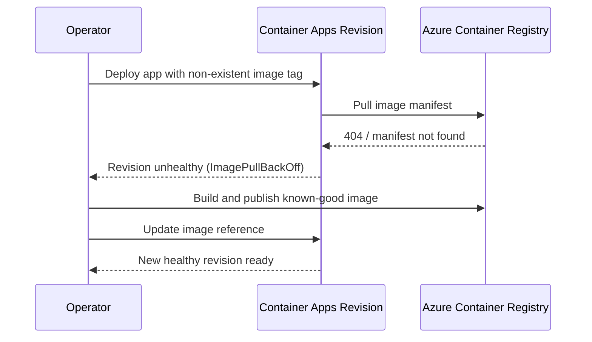

# ACR Image Pull Failure Lab

Reproduce and resolve container startup failure caused by referencing a non-existent image tag in Azure Container Registry (ACR).

## Lab Metadata

| Attribute | Value |
|---|---|
| Difficulty | Beginner |
| Estimated Duration | 20-30 minutes |
| Tier | Consumption |
| Failure Mode | `ImagePullBackOff` / manifest not found during revision startup |
| Skills Practiced | Revision inspection, system log analysis, image validation, ACR recovery |

## 1) Background

This lab deploys a Container App and ACR, then intentionally points the app to an image tag that does not exist. The revision fails during startup because the runtime cannot fetch the manifest, so the container never starts.

For pull failures, the fastest evidence usually comes from revision state and system logs rather than application logs.

### Architecture



## 2) Hypothesis

**IF** the Container App references `${containerRegistryLoginServer}/${baseName}:does-not-exist`, **THEN** the latest revision will fail before container startup and system logs will show image pull or manifest errors until a valid image is published and the app image reference is updated.

| Variable | Control State | Experimental State |
|---|---|---|
| Image reference | Valid image tag exists in ACR | Image tag does not exist in ACR |
| Revision health | `Healthy` | Non-`Healthy` / failed startup |
| System log evidence | Normal pull or ready events | `ImagePullBackOff`, `manifest unknown`, or related pull errors |
| Recovery action | Not required | Build/push valid image and update app |

## 3) Runbook

### Deploy baseline infrastructure

```bash
export RG="rg-aca-lab-acr"
export LOCATION="koreacentral"

az extension add --name containerapp --upgrade
az login

az group create --name "$RG" --location "$LOCATION"

az deployment group create \
    --name "lab-acr" \
    --resource-group "$RG" \
    --template-file "./labs/acr-pull-failure/infra/main.bicep" \
    --parameters baseName="labacr"
```

Expected output pattern:

```text
"provisioningState": "Succeeded"
```

### Capture deployment outputs

```bash
export APP_NAME="$(az deployment group show \
    --resource-group "$RG" \
    --name "lab-acr" \
    --query "properties.outputs.containerAppName.value" \
    --output tsv)"

export ACR_NAME="$(az deployment group show \
    --resource-group "$RG" \
    --name "lab-acr" \
    --query "properties.outputs.containerRegistryName.value" \
    --output tsv)"

export ENVIRONMENT_NAME="$(az deployment group show \
    --resource-group "$RG" \
    --name "lab-acr" \
    --query "properties.outputs.environmentName.value" \
    --output tsv)"
```

Expected output: no output; variables are populated.

### Observe the failing baseline revision

The lab infrastructure already deploys the app with a bad image reference:

```text
${containerRegistry.properties.loginServer}/${baseName}:does-not-exist
```

Wait for the revision to attempt the pull, then inspect revision state and system logs:

```bash
./labs/acr-pull-failure/trigger.sh
```

The trigger script runs:

```bash
sleep 30
az containerapp revision list --name "$APP_NAME" --resource-group "$RG" --output table
az containerapp logs show --name "$APP_NAME" --resource-group "$RG" --type system --tail 20
```

Expected revision output pattern:

```text
Name                Active    HealthState
------------------  --------  ----------
ca-myapp--0000002   True      Failed
```

Expected log evidence pattern:

```text
Reason_s      Log_s
------------  -----------------------------------------------------------------
PullingImage  Pulling image '<acr-name>.azurecr.io/myapp:v1.0.0'
PulledImage   Successfully pulled image in 2.42s. Image size: 58720256 bytes.
```

For this failure scenario, expect image pull errors, `manifest unknown`, or similar pull-failure messages instead of a successful pull.

### Inspect system evidence directly

```bash
az containerapp logs show \
    --name "$APP_NAME" \
    --resource-group "$RG" \
    --type system
```

Expected output: image pull errors, manifest not found, or unauthorized pull messages.

### Apply the recovery path

Build and push a valid image, then update the Container App to use it:

```bash
az acr login --name "$ACR_NAME"
docker build --tag "$ACR_NAME.azurecr.io/myapp:v1.0.1" "./labs/acr-pull-failure/workload"
docker push "$ACR_NAME.azurecr.io/myapp:v1.0.1"

az containerapp update \
    --name "$APP_NAME" \
    --resource-group "$RG" \
    --image "$ACR_NAME.azurecr.io/myapp:v1.0.1"
```

Expected output pattern:

```text
"properties": {
  "provisioningState": "Succeeded"
}
```

### Verify recovery

```bash
./labs/acr-pull-failure/verify.sh
```

The verify script checks that the failure was reproduced, then applies this script-based recovery flow:

```bash
az acr build --registry "$ACR_NAME" --image "${APP_NAME}:v1" ./workload
az containerapp update --name "$APP_NAME" --resource-group "$RG" --image "${ACR_NAME}.azurecr.io/${APP_NAME}:v1"
sleep 30
az containerapp revision list --name "$APP_NAME" --resource-group "$RG" --query "[0].properties.healthState" --output tsv
```

Expected result: the latest revision becomes `Healthy` and system logs no longer report image pull failures.

## 4) Experiment Log

| Step | Action | Expected | Actual | Pass/Fail |
|---|---|---|---|---|
| 1 | Deploy lab infrastructure | Deployment succeeds | | |
| 2 | Capture deployment outputs | Variables populated | | |
| 3 | Run `trigger.sh` | Revision becomes non-healthy | | |
| 4 | Review system logs | Pull or manifest failure evidence appears | | |
| 5 | Push valid image and update app | New revision created | | |
| 6 | Run `verify.sh` | Latest revision becomes healthy | | |

## Expected Evidence

| Evidence Source | Expected State |
|---|---|
| `az containerapp revision list --name "$APP_NAME" --resource-group "$RG" --output table` | Latest revision is not `Healthy` before the fix |
| `az containerapp logs show --name "$APP_NAME" --resource-group "$RG" --type system` | Image pull failure, manifest not found, or related registry error |
| `az acr repository show-tags --name "$ACR_NAME" --repository "myapp"` | Missing tag before fix; valid tag present after publish |
| `az containerapp update --name "$APP_NAME" --resource-group "$RG" --image "$ACR_NAME.azurecr.io/myapp:v1.0.1"` | Update succeeds and creates a recoverable revision |
| `./labs/acr-pull-failure/verify.sh` | Failure reproduced first, then post-fix health improves |

## Clean Up

```bash
az group delete --name "$RG" --yes --no-wait
```

## Related Playbook

- [Image Pull Failure](../playbooks/startup-and-provisioning/image-pull-failure.md)

## See Also

- [Container Start Failure Playbook](../playbooks/startup-and-provisioning/container-start-failure.md)
- [Revision Provisioning Failure Lab](./revision-provisioning-failure.md)

## Sources

- [Troubleshoot image pull errors in Azure Container Apps](https://learn.microsoft.com/azure/container-apps/troubleshoot-image-pull-failures)
- [Revisions in Azure Container Apps](https://learn.microsoft.com/azure/container-apps/revisions)
