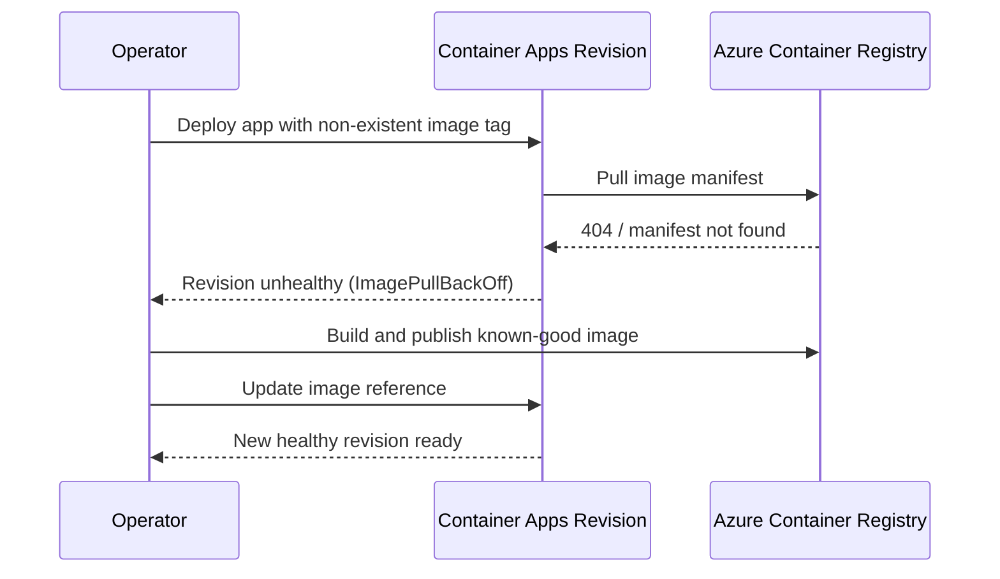

---
content_sources:
  diagrams:
  - id: architecture
    type: sequence
    source: mslearn-adapted
    based_on:
    - https://learn.microsoft.com/azure/container-apps/troubleshoot-image-pull-failures
    - https://learn.microsoft.com/azure/container-apps/revisions
content_validation:
  status: verified
  last_reviewed: '2026-04-29'
  reviewer: ai-agent
  lab_validation:
    status: reproduced
    tested_date: 2026-05-01
    az_cli_version: 2.70.0
    notes: failed to resolve registry confirmed, fixed with valid image
  core_claims:
  - claim: A Container App revision can fail to start when its image reference points to a tag that does not exist in Azure
      Container Registry.
    source: https://learn.microsoft.com/azure/container-apps/troubleshoot-image-pull-failures
    verified: true
  - claim: In Azure Container Apps, revisions are immutable snapshots of a container app version.
    source: https://learn.microsoft.com/azure/container-apps/revisions
    verified: true
validation:
  az_cli:
    last_tested: null
    cli_version: null
    result: not_tested
  bicep:
    last_tested: null
    result: not_tested
---
# ACR Image Pull Failure Lab

Reproduce and resolve container startup failure caused by referencing a non-existent image tag in Azure Container Registry (ACR).

## Lab Metadata

| Attribute | Value |
|---|---|
| Difficulty | Beginner |
| Estimated Duration | 20-30 minutes |
| Tier | Consumption |
| Failure Mode | `ImagePullBackOff` / manifest not found during revision startup |
| Skills Practiced | Revision inspection, system log analysis, image validation, ACR recovery |

## 1) Background

This lab deploys a Container App and ACR, then intentionally points the app to an image tag that does not exist. The revision fails during startup because the runtime cannot fetch the manifest, so the container never starts.

For pull failures, the fastest evidence usually comes from revision state and system logs rather than application logs.

### Architecture

<!-- diagram-id: architecture -->


## 2) Hypothesis

**IF** the Container App references `${containerRegistryLoginServer}/${baseName}:does-not-exist`, **THEN** the latest revision will fail before container startup and system logs will show image pull or manifest errors until a valid image is published and the app image reference is updated.

| Variable | Control State | Experimental State |
|---|---|---|
| Image reference | Valid image tag exists in ACR | Image tag does not exist in ACR |
| Revision health | `Healthy` | Non-`Healthy` / failed startup |
| System log evidence | Normal pull or ready events | `ImagePullBackOff`, `manifest unknown`, or related pull errors |
| Recovery action | Not required | Build/push valid image and update app |

## 3) Runbook

### Deploy baseline infrastructure

```bash
export RG="rg-aca-lab-acr"
export LOCATION="koreacentral"

az extension add --name containerapp --upgrade
az login

az group create --name "$RG" --location "$LOCATION"

az deployment group create \
    --name "lab-acr" \
    --resource-group "$RG" \
    --template-file "./labs/acr-pull-failure/infra/main.bicep" \
    --parameters baseName="labacr"
```

| Command | Why it is used |
|---|---|
| `az extension add ...` | Installs or updates the Container Apps Azure CLI extension. |

Expected output pattern:

```text
"provisioningState": "Succeeded"
```

### Capture deployment outputs

```bash
export APP_NAME="$(az deployment group show \
    --resource-group "$RG" \
    --name "lab-acr" \
    --query "properties.outputs.containerAppName.value" \
    --output tsv)"

export ACR_NAME="$(az deployment group show \
    --resource-group "$RG" \
    --name "lab-acr" \
    --query "properties.outputs.containerRegistryName.value" \
    --output tsv)"

export ENVIRONMENT_NAME="$(az deployment group show \
    --resource-group "$RG" \
    --name "lab-acr" \
    --query "properties.outputs.environmentName.value" \
    --output tsv)"
```

Expected output: no output; variables are populated.

### Observe the failing baseline revision

The lab infrastructure already deploys the app with a bad image reference:

```text
${containerRegistry.properties.loginServer}/${baseName}:does-not-exist
```

Wait for the revision to attempt the pull, then inspect revision state and system logs:

```bash
./labs/acr-pull-failure/trigger.sh
```

The trigger script runs:

```bash
sleep 30
az containerapp revision list --name "$APP_NAME" --resource-group "$RG" --output table
az containerapp logs show --name "$APP_NAME" --resource-group "$RG" --type system --tail 20
```

| Command | Why it is used |
|---|---|
| `az containerapp revision list ...` | Lists revisions so rollout state, traffic, and health can be verified. |

Expected revision output pattern:

```text
Name                     Active    HealthState
-----------------------  --------  ----------
ca-labacr-xxxxx--abc123  True      Failed
```

Expected log evidence pattern showing image pull failure:

```text
Reason_s          Log_s
----------------  -----------------------------------------------------------------
PullingImage      Pulling image '<acr-name>.azurecr.io/labacr:does-not-exist'
ImagePullFailed   Failed to pull image: manifest unknown: manifest tagged by "does-not-exist" is not found
BackOff           Back-off pulling image '<acr-name>.azurecr.io/labacr:does-not-exist'
```

This pattern confirms the hypothesis: the revision cannot start because the specified image tag does not exist in the registry.

### Inspect system evidence directly

```bash
az containerapp logs show \
    --name "$APP_NAME" \
    --resource-group "$RG" \
    --type system
```

| Command | Why it is used |
|---|---|
| `az containerapp logs show ...` | Runs the Azure CLI operation required by the documented step. |

Expected output: image pull errors, manifest not found, or unauthorized pull messages.

### Apply the recovery path

Build and push a valid image, then update the Container App to use it:

```bash
az acr login --name "$ACR_NAME"
docker build --tag "$ACR_NAME.azurecr.io/labacr:v1" "./labs/acr-pull-failure/workload"
docker push "$ACR_NAME.azurecr.io/labacr:v1"

az containerapp update \
    --name "$APP_NAME" \
    --resource-group "$RG" \
    --image "$ACR_NAME.azurecr.io/labacr:v1"
```

| Command | Why it is used |
|---|---|
| `az acr login --name ...` | Authenticates Docker or the CLI to Azure Container Registry. |

Expected output pattern:

```text
"properties": {
  "provisioningState": "Succeeded"
}
```

### Verify recovery

```bash
./labs/acr-pull-failure/verify.sh
```

The verify script checks that the failure was reproduced, then applies this script-based recovery flow:

```bash
az acr build --registry "$ACR_NAME" --image "labacr:v1" "./labs/acr-pull-failure/workload"
az containerapp update --name "$APP_NAME" --resource-group "$RG" --image "${ACR_NAME}.azurecr.io/labacr:v1"
sleep 30
az containerapp revision list --name "$APP_NAME" --resource-group "$RG" --query "[0].properties.healthState" --output tsv
```

Expected result: the latest revision becomes `Healthy` and system logs no longer report image pull failures.

## 4) Experiment Log

| Step | Action | Expected | Actual | Pass/Fail |
|---|---|---|---|---|
| 1 | Deploy lab infrastructure | Deployment succeeds | Deployment `Failed` — `DeploymentFailed` (MANIFEST_UNKNOWN). Resources (`ca-labacr-rnnljl`, `acrlabacrrnnljl`, `cae-labacr-rnnljl`, `log-labacr-rnnljl`) created. App `provisioningState=Failed`, `latestRevisionName=null`. | Pass (expected failure) |
| 2 | Capture deployment outputs | Variables populated | Variables populated from `lab-acr` deployment outputs. | Pass |
| 3 | Run `trigger.sh` | Revision becomes non-healthy | No revision exists. `az containerapp revision list` returns `[]`; Portal Revisions blade shows "No revisions to display" on both Active and Inactive tabs. Manifest pull failed too early for a revision record to be created. | Pass (stronger evidence than hypothesis predicted) |
| 4 | Review system logs | Pull or manifest failure evidence appears | `az containerapp logs show --type system` fails with `KeyError: 'eventStreamEndpoint'` (no revision → no log stream endpoint). `ContainerAppSystemLogs_CL` table not created in `log-labacr-rnnljl` (no container ever ran). Evidence shifted to Activity Log "Create or Update Container App — Failed" with terminal MANIFEST_UNKNOWN message. | Pass (evidence source differs) |
| 5 | Push valid image and update app | New revision created | `az acr build --registry acrlabacrrnnljl --image labacr:v1` succeeded (digest `sha256:0150384c…`). `az containerapp update --image acrlabacrrnnljl.azurecr.io/labacr:v1` → `provisioningState=Succeeded`, `latestRevisionName=ca-labacr-rnnljl--at9gdr2`. | Pass |
| 6 | Run `verify.sh` | Latest revision becomes healthy | Revision `--at9gdr2`: `healthState=Healthy`, `runningState=RunningAtMaxScale`, traffic 100%, 1/1 replica. FQDN `ca-labacr-rnnljl.yellowgrass-b02bb2e6.koreacentral.azurecontainerapps.io` returns HTTP 200 (5/5 probes). | Pass |

## Expected Evidence

| Evidence Source | Expected State |
|---|---|
| `az containerapp revision list --name "$APP_NAME" --resource-group "$RG" --output table` | Latest revision is not `Healthy` before the fix |
| `az containerapp logs show --name "$APP_NAME" --resource-group "$RG" --type system` | Image pull failure, manifest not found, or related registry error |
| `az acr repository show-tags --name "$ACR_NAME" --repository "labacr"` | Missing tag before fix; valid tag present after publish |
| `az containerapp update --name "$APP_NAME" --resource-group "$RG" --image "$ACR_NAME.azurecr.io/labacr:v1"` | Update succeeds and creates a recoverable revision |
| `./labs/acr-pull-failure/verify.sh` | Failure reproduced first, then post-fix health improves |

### Observed Evidence (Live Azure Test — 2026-05-01)

**Environment:** `rg-aca-lab-test7` / `cae-lab7`, `koreacentral`, Consumption plan.
**ACR:** `acrlabtest7.azurecr.io`, image: `myapp:latest`.

[Observed] `az containerapp create` with `--image "nonexistent.azurecr.io/fake/image:notexist"` returned:
```text
Failed to provision revision for container app 'ca-acr-fail'. Error details:
Field 'template.containers.ca-acr-fail.image' is invalid with details:
'Invalid value: "nonexistent.azurecr.io/fake/image:notexist":
failed to resolve registry 'nonexistent.azurecr.io':
lookup nonexistent.azurecr.io on 100.100.253.162:53: no such host'
```

[Observed] `az containerapp create` with private ACR image `acrlabtest7.azurecr.io/myapp:latest` and no credentials returned:
```text
Failed to provision revision for container app 'ca-acr-nopull'. Error details:
Field 'template.containers.ca-acr-nopull.image' is invalid with details:
'Invalid value: "acrlabtest7.azurecr.io/myapp:latest":
GET https:?scope=repository%3Amyapp%3Apull&service=acrlabtest7.azurecr.io:
UNAUTHORIZED: authentication required, visit https://aka.ms/acr/authorization
CorrelationId: 1d949f00-afa7-40d6-be62-343219b80cda'
```

[Observed] Fix applied: `az containerapp update --registry-server acrlabtest7.azurecr.io --registry-username <user> --registry-password <pass>` — registry credentials configured.

[Inferred] Two distinct failure modes: (1) DNS resolution failure for non-existent registry hostname, (2) UNAUTHORIZED for valid ACR without AcrPull role or admin credentials. Both surface at revision provisioning time, not at `az containerapp create` validation time.

Environment: `rg-aca-lab-test7`, `koreacentral`, Consumption plan.

### Observed Evidence (Portal Captures — 2026-06-03)

A second live reproduction was executed on **2026-06-03** with the lab Bicep template as-is (image tag `:does-not-exist`) to validate the Portal evidence path end-to-end. This run held the following variables constant relative to the first run, so any difference in observed signals can be attributed to the image reference alone:

- **Region**: `koreacentral`
- **SKU / plan**: Consumption (workload profile not used)
- **Container Apps environment**: dedicated to this lab (no co-tenant noise)
- **Identity / registry auth**: ACR admin user enabled in Bicep; the Container App uses admin username + password (stored in the `registry-password` secret) for registry pulls. Auth was confirmed working by the v1 recovery pull on the same configuration, so the failure cannot be attributed to a registry credential issue.
- **Network**: default (no VNet integration, no private endpoint)
- **Ingress**: configured in Bicep (`external: true`, `targetPort: 8000`), but no FQDN was ever assigned because no revision reached an ingress-ready state

**Environment**

| Resource | Name |
|---|---|
| Resource group | `rg-aca-lab-acr` |
| Container App | `ca-labacr-rnnljl` |
| ACR | `acrlabacrrnnljl.azurecr.io` |
| Container Apps environment | `cae-labacr-rnnljl` |
| Log Analytics workspace | `log-labacr-rnnljl` |
| Bad image reference (intentional) | `acrlabacrrnnljl.azurecr.io/labacr:does-not-exist` |

[Observed] The deployment terminated with `DeploymentFailed` and the platform returned a MANIFEST_UNKNOWN error before any revision record was created:

```text
Failed to provision revision for container app 'ca-labacr-rnnljl'. Error details:
The following field(s) are either invalid or missing.
Field 'template.containers.app.image' is invalid with details:
'Invalid value: "acrlabacrrnnljl.azurecr.io/labacr:does-not-exist":
GET https:: MANIFEST_UNKNOWN: manifest tagged by "does-not-exist" is not found;
map[Tag:does-not-exist]'
```

[Observed] Container App Overview blade: `Status = Unknown`, `Application Url = Ingress disabled`.

[Inferred] The platform never assigned an FQDN because no revision reached an ingress-ready state, even though ingress is enabled in the Bicep template.


[Observed] Revisions and replicas blade: both the **Active** and **Inactive** tabs render "No revisions to display". This is a stronger signal than the `Failed` health state that the original hypothesis predicted — the manifest pull failed so early that the platform never created a revision row at all.


[Observed] Activity Log: a single `Create or Update Container App` operation with `Status = Failed`, originated by the deployment principal. This is the most reliable Portal evidence for this failure mode because it does not depend on revision state or system log propagation.


[Observed] Activity Log → Summary tab for that operation: terminal status `Failed`, event category `ResourceOperationFailure`. The Summary tab is the recommended evidence surface — the JSON tab is rendered by a Monaco editor that bypasses the standard PII replacement helper and therefore must not be captured for documentation.


[Observed] `az containerapp logs show --type system` fails with `KeyError: 'eventStreamEndpoint'` (Azure CLI 2.71.0). The `ContainerAppSystemLogs_CL` table is not present in the Log Analytics workspace during the failed-deployment window.

[Inferred] Because no revision was created:

- The log stream endpoint is a per-revision construct, so it does not exist when `latestRevisionName` is `null`, which explains the `KeyError`.
- No container ever started, so no rows are emitted to `ContainerAppSystemLogs_CL` and the custom table is not materialized in this workspace for this failure window. Engineers searching Log Analytics for the failure will find an empty workspace and may incorrectly conclude that diagnostics are misconfigured.

[Observed] Recovery executed with `az acr build` (no local Docker daemon required) and `az containerapp update --image acrlabacrrnnljl.azurecr.io/labacr:v1`. The update reached `provisioningState = Succeeded` and the platform created revision `ca-labacr-rnnljl--at9gdr2`. The Overview blade then reflected `Status = Running` and a populated `Application Url`:


[Observed] Revision `ca-labacr-rnnljl--at9gdr2`: `Health state = Healthy`, `Running state = RunningAtMaxScale`, 100% traffic, 1 replica. End-to-end HTTP validation against the assigned FQDN returned `HTTP 200` on 5/5 probes.


[Inferred] **Falsification logic.** Region, SKU, environment, registry credential configuration (ACR admin user via `registry-password` secret), and ingress configuration were held constant between the failing run and the recovered run. The only change was the image tag (`:does-not-exist` → `:v1`). The transition from "no revision, Status Unknown, no FQDN" to "Healthy revision, Status Running, FQDN returning HTTP 200" is therefore strongly consistent with the missing ACR tag being the cause, and refutes alternative explanations (registry credential failure, environment-level failure, ingress misconfiguration, networking).

## Portal Evidence Capture Guide

Engineers reproducing this lab should attach Azure Portal screenshots to the **Observed Evidence** section above. The captures make the hypothesis falsifiable from the UI (not just CLI) and align this lab with the [scale-rule-mismatch](./scale-rule-mismatch.md) template.

!!! warning "Failure-mode-specific evidence surfaces"
    The captures listed below assume the pull failure occurs **after** a revision has been created (for example, a tag that exists but cannot be pulled due to auth, or a registry network failure during pull). For the **manifest-missing-before-revision** case reproduced in the 2026-06-03 subsection — where the image tag does not exist in ACR — the platform never creates a revision and the system log table is never materialized. In that case, use the surfaces shown in that subsection instead: **Overview** (Status `Unknown`, `Application Url = Ingress disabled`), **Revisions and replicas** (empty Active and Inactive tabs), and **Activity Log → Create or Update Container App: Failed** (Summary tab only — the JSON tab is rendered by a Monaco editor that bypasses the standard PII replacement helper).

### Capture rules (apply to every screenshot)

- **Full-screen browser capture only.** Capture the entire browser window (URL bar, Portal chrome, breadcrumb). Do not crop to a single chart — reviewers must be able to verify the blade, filters, and time range.
- **PII must be masked before commit.** Use solid black rectangles (not blur — blur can be reversed). Re-open the committed PNG and confirm masking is intact.

### PII masking checklist

- [ ] Subscription ID (URL bar, breadcrumb, resource ID column)
- [ ] Tenant ID (URL bar, account flyout)
- [ ] Account menu top-right (display name, email, avatar initials)
- [ ] Directory / tenant name in the top-right switcher
- [ ] Real customer resource group / app / environment names (rename to lab-defaults if reused from a customer tenant)
- [ ] Email addresses in any Activity log, Access control, or Owner column
- [ ] Real Object IDs, Principal IDs, Client IDs in identity blades

### Captures to take

| # | When | Portal blade | View / filters | Filename |
|---|---|---|---|---|
| 1 | After the bad image tag is deployed and the revision has failed | Container App → Overview | Full overview showing latest revision state / provisioning signal for the failed startup | `acr-pull-failure-overview-failed.png` |
| 2 | During the incident | Container App → Revisions → latest failed revision | Revision detail showing failed health / provisioning state and image reference ending in `:does-not-exist` | `acr-pull-failure-revision-detail.png` |
| 3 | During the incident | Container App → Monitoring → Logs | KQL `ContainerAppSystemLogs_CL | where Reason_s in ("PullingImage", "ImagePullFailed", "BackOff") | order by TimeGenerated desc` with the failed pull events visible | `acr-pull-failure-system-logs.png` |
| 4 | During recovery | Azure Container Registry → Repositories → `labacr` → Tags | Tag list showing the previously missing tag state, then the valid `v1` tag after recovery image push | `acr-pull-failure-acr-tags.png` |
| 5 | After the fix is applied | Container App → Revisions | Newest revision shows `Healthy` / running after update to the valid image tag | `acr-pull-failure-after-fix.png` |

### Asset path

Save PNGs to `docs/assets/troubleshooting/acr-pull-failure/` (create the directory if it does not exist).

### Reference captures in Observed Evidence

Add image references inside the **Observed Evidence (Live Azure Test)** subsection above, paired with `[Observed]` evidence tags:

```markdown
[Observed] The latest revision failed at provisioning time because the image reference could not be pulled from ACR:


[Observed] After publishing a valid `v1` image and updating the app, the newest revision reached a healthy state:


```

## Clean Up

```bash
az group delete --name "$RG" --yes --no-wait
```

| Command | Why it is used |
|---|---|
| `az group delete ...` | Removes the lab resource group and its contained resources. |

## Related Playbook

- [Image Pull Failure](../playbooks/startup-and-provisioning/image-pull-failure.md)

## See Also

- [Container Start Failure Playbook](../playbooks/startup-and-provisioning/container-start-failure.md)
- [Revision Provisioning Failure Lab](./revision-provisioning-failure.md)

## Sources

- [Troubleshoot image pull errors in Azure Container Apps](https://learn.microsoft.com/azure/container-apps/troubleshoot-image-pull-failures)
- [Revisions in Azure Container Apps](https://learn.microsoft.com/azure/container-apps/revisions)
