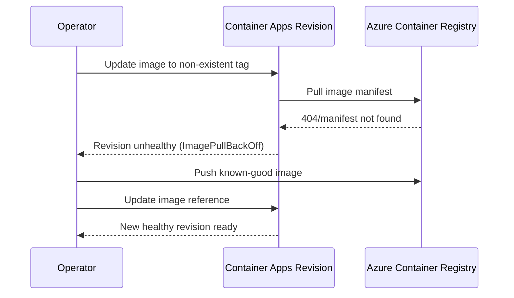

# ACR Image Pull Failure Lab

Reproduce and resolve container startup failure caused by referencing a non-existent image tag in ACR.

## Scenario

- **Difficulty**: Beginner
- **Estimated duration**: 20-30 minutes
- **Failure mode**: `ImagePullBackOff` / manifest not found during revision startup

## Prerequisites

- Azure CLI with Container Apps extension
- Permissions to create resource groups and deploy Azure resources

```bash
az extension add --name containerapp --upgrade
az login
```

## Quick Start

```bash
export RG="rg-aca-lab-acr"
export LOCATION="koreacentral"

az group create --name "$RG" --location "$LOCATION"
az deployment group create --name "lab-acr" --resource-group "$RG" --template-file ./labs/acr-pull-failure/infra/main.bicep --parameters baseName="labacr"

export APP_NAME="$(az deployment group show --resource-group "$RG" --name "lab-acr" --query \"properties.outputs.containerAppName.value\" --output tsv)"
export ACR_NAME="$(az deployment group show --resource-group "$RG" --name "lab-acr" --query \"properties.outputs.containerRegistryName.value\" --output tsv)"

cd labs/acr-pull-failure
./trigger.sh
./verify.sh
./cleanup.sh
```

## Expected Diagnostic Output Pattern

```text
Reason_s      Log_s
------------  -----------------------------------------------------------------
PullingImage  Pulling image '<acr-name>.azurecr.io/myapp:v1.0.0'
PulledImage   Successfully pulled image in 2.42s. Image size: 58720256 bytes.
```

## Key Takeaways

- Image tag validation is the fastest first check for pull failures.
- System logs and revision health quickly confirm startup cause.
- A known-good image push + container app update is the shortest recovery path.

## See Also

- [Image Pull Failure Playbook](../playbooks/startup-and-provisioning/image-pull-failure.md)
- [Container Start Failure Playbook](../playbooks/startup-and-provisioning/container-start-failure.md)

## Scenario Setup

This lab deploys a Container App and ACR, then intentionally points the app to an image tag that does not exist. The revision fails during startup because the runtime cannot fetch the manifest.



!!! warning "Do not chase app-code logs first"
    For pull failures, the container never starts, so console logs may be empty. Start with revision status and system logs.

!!! tip "Validate exact image name and tag"
    A single typo in repository name or tag produces symptoms that look similar to auth problems. Confirm the exact `<registry>/<repository>:<tag>` string first.

## Step-by-Step Walkthrough

1. **Set variables and create resource group**

   ```bash
   export RG="rg-aca-lab-acr"
   export LOCATION="koreacentral"
   az group create --name "$RG" --location "$LOCATION"
   ```

   Expected output pattern:

   ```text
   "properties": {
     "provisioningState": "Succeeded"
   }
   ```

2. **Deploy lab infrastructure**

   ```bash
   az deployment group create \
     --name "lab-acr" \
     --resource-group "$RG" \
     --template-file "./labs/acr-pull-failure/infra/main.bicep" \
     --parameters baseName="labacr"
   ```

   Expected output pattern:

   ```text
   "provisioningState": "Succeeded"
   ```

3. **Capture deployment outputs**

   ```bash
   export APP_NAME="$(az deployment group show --resource-group "$RG" --name "lab-acr" --query "properties.outputs.containerAppName.value" --output tsv)"
   export ACR_NAME="$(az deployment group show --resource-group "$RG" --name "lab-acr" --query "properties.outputs.containerRegistryName.value" --output tsv)"
   export ENVIRONMENT_NAME="$(az deployment group show --resource-group "$RG" --name "lab-acr" --query "properties.outputs.containerAppsEnvironmentName.value" --output tsv)"
   ```

   Expected output: no output (variables populated).

4. **Trigger the failure condition**

   ```bash
   ./labs/acr-pull-failure/trigger.sh
   az containerapp revision list --name "$APP_NAME" --resource-group "$RG" --output table
   ```

   Expected output pattern:

   ```text
   Name                Active    HealthState
   ------------------  --------  ----------
   ca-myapp--0000002   True      Failed
   ```

5. **Inspect system evidence**

   ```bash
   az containerapp logs show \
     --name "$APP_NAME" \
     --resource-group "$RG" \
     --type system
   ```

   Expected evidence pattern: image pull errors, manifest not found, or unauthorized pull message.

6. **Apply resolution (publish valid image and update app)**

   ```bash
   az acr login --name "$ACR_NAME"
   docker build --tag "$ACR_NAME.azurecr.io/myapp:v1.0.1" "./labs/acr-pull-failure/workload"
   docker push "$ACR_NAME.azurecr.io/myapp:v1.0.1"

   az containerapp update \
     --name "$APP_NAME" \
     --resource-group "$RG" \
     --image "$ACR_NAME.azurecr.io/myapp:v1.0.1"
   ```

   Expected output pattern:

   ```text
   "properties": {
     "provisioningState": "Succeeded"
   }
   ```

7. **Verify recovery**

   ```bash
   az containerapp revision list --name "$APP_NAME" --resource-group "$RG" --output table
   ./labs/acr-pull-failure/verify.sh
   ```

   Expected output pattern: latest revision shows `Healthy` and receives intended traffic.

## Symptom / Cause / Fix Matrix

| What you see | What is happening | How to fix |
|---|---|---|
| `ImagePullBackOff` in revision events | Registry cannot provide requested image/tag | Push valid tag and update app image reference |
| `manifest unknown` message | Repository exists but tag missing | Confirm tag list with `az acr repository show-tags` |
| `unauthorized` during pull | Registry access configuration broken | Validate registry identity/credentials and role assignment |
| New revision never becomes healthy | Startup blocked before container boot | Resolve image pull first, then re-check probes |

## Resolution Verification Checklist

1. Image exists in ACR with the exact tag.
2. Container App references the same image string.
3. Latest revision health state is `Healthy`.
4. System logs no longer report pull failures.

## Sources

- [Microsoft Learn: Troubleshoot image pull errors in Azure Container Apps](https://learn.microsoft.com/azure/container-apps/troubleshoot-image-pull-failures)
- [Microsoft Learn: Revisions in Azure Container Apps](https://learn.microsoft.com/azure/container-apps/revisions)
