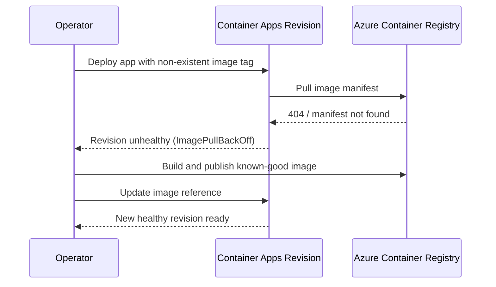
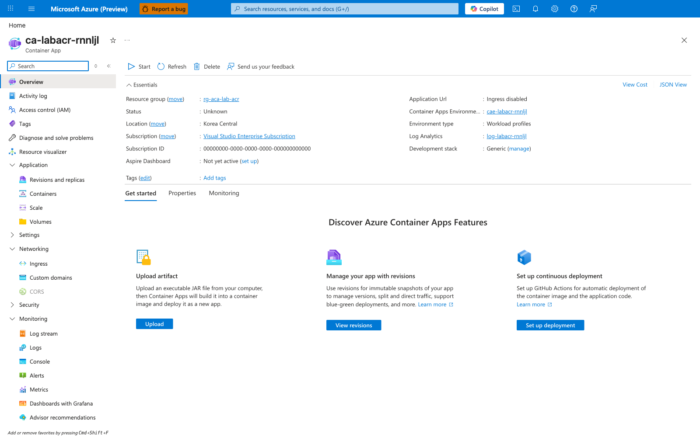
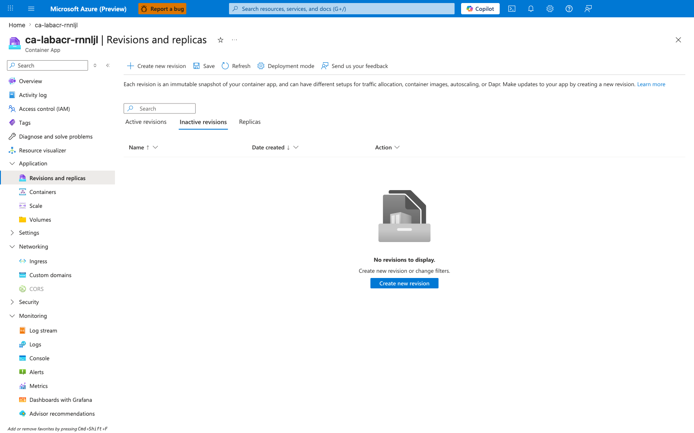
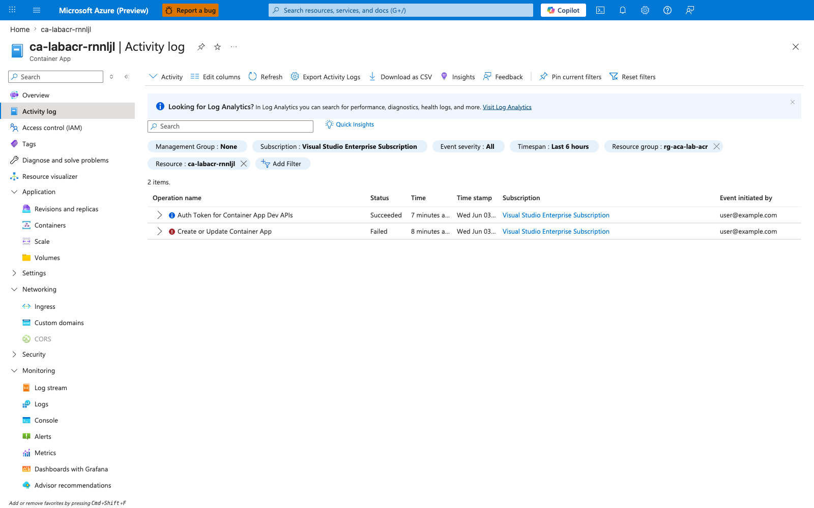
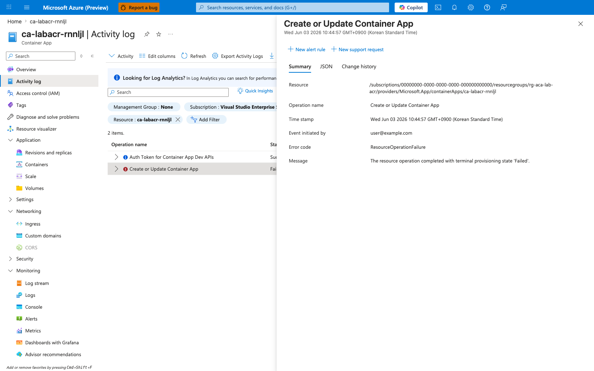
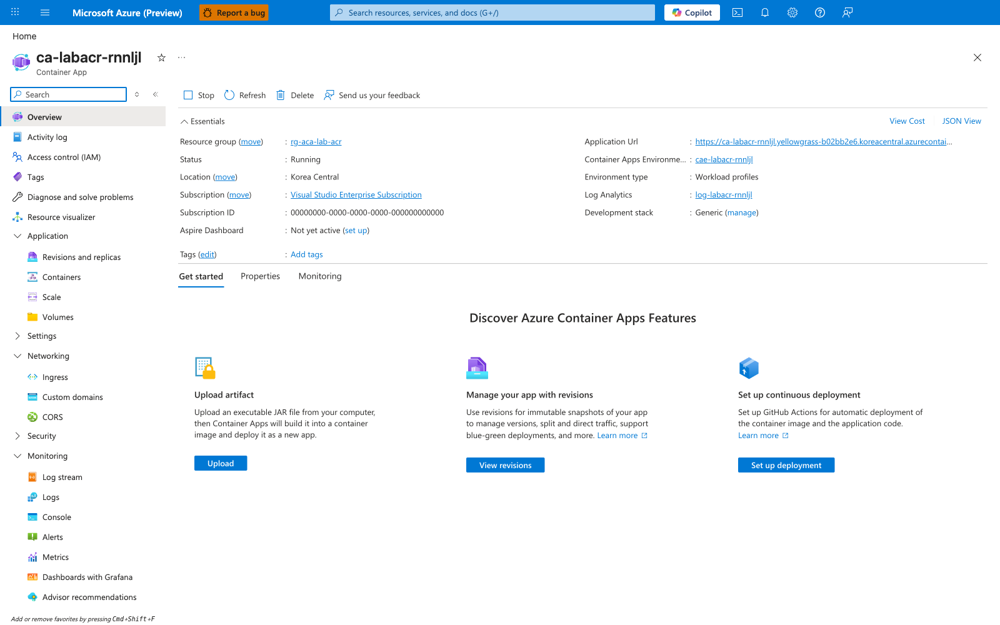
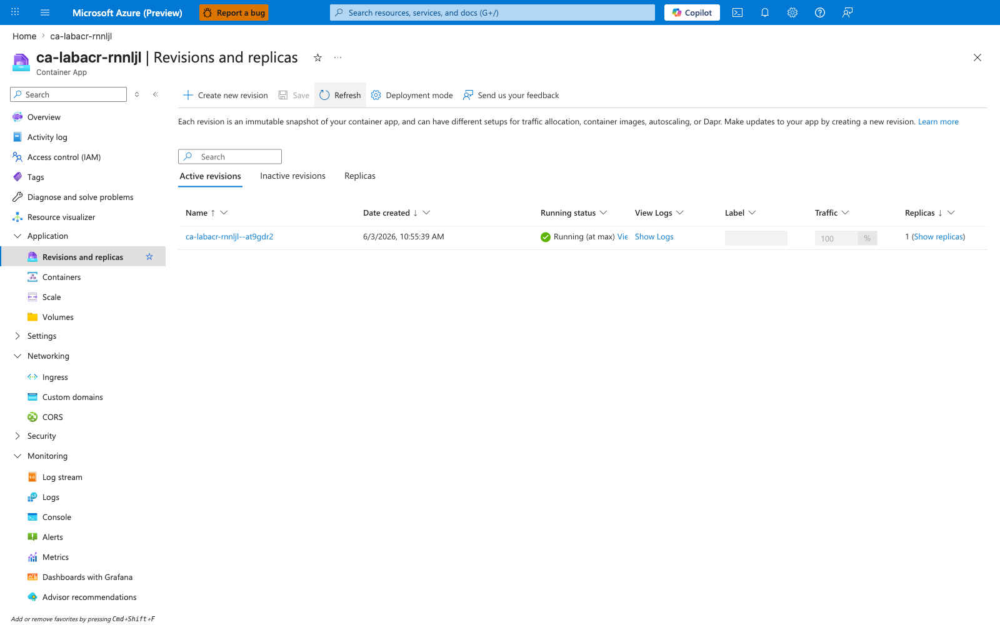

---
content_sources:
  diagrams:
    - id: architecture
      type: sequence
      source: mslearn-adapted
      based_on:
        - https://learn.microsoft.com/en-us/azure/container-apps/troubleshoot-image-pull-failures
        - https://learn.microsoft.com/en-us/azure/container-apps/revisions
content_validation:
  status: verified
  last_reviewed: '2026-06-22'
  reviewer: ai-agent
  lab_validation:
    status: reproduced
    tested_date: 2026-06-22
    az_cli_version: 2.79.0
    notes: 'Three live reproductions: original end-to-end on 2026-05-01 (CLI 2.70.0) confirmed manifest-not-found and recovery; six 2026-06-03 Portal captures independently re-validated the broken-state → recovery arc; scripted 2026-06-22 reproduction (CLI 2.79.0) added structured H1 / H2 gate emission and surfaced two new platform observations: (1) az deployment group show returns properties.outputs=null when provisioningState=Failed, and (2) the MANIFEST_UNKNOWN smoking-gun string lives in az deployment operation group list (statusMessage.error.message), not in az deployment group show (error.details[*].details is null at the leaf). Both H1 (deployment_failed_manifest_unknown, 5/5 sub-gates) and H2 (revision_healthy_traffic_100_curl_ok, 4/4 sub-gates, 10/10 HTTP 200) passed.'
  core_claims:
    - claim: A Container App revision can fail to start when its image reference points to a tag that does not exist in Azure Container Registry.
      source: https://learn.microsoft.com/en-us/azure/container-apps/troubleshoot-image-pull-failures
      verified: true
    - claim: In Azure Container Apps, revisions are immutable snapshots of a container app version.
      source: https://learn.microsoft.com/en-us/azure/container-apps/revisions
      verified: true
validation:
  az_cli:
    last_tested: '2026-06-22'
    cli_version: '2.79.0'
    result: pass
  bicep:
    last_tested: '2026-06-22'
    result: pass
---
# ACR Image Pull Failure Lab

Reproduce and resolve container startup failure caused by referencing a non-existent image tag in Azure Container Registry (ACR).

## Lab Metadata

| Attribute | Value |
|---|---|
| Difficulty | Beginner |
| Estimated Duration | 20-30 minutes |
| Tier | Consumption |
| Failure Mode | `ImagePullBackOff` / manifest not found during revision startup |
| Skills Practiced | Revision inspection, system log analysis, image validation, ACR recovery |

## 1) Background

This lab deploys a Container App and ACR, then intentionally points the app to an image tag that does not exist. The revision fails during startup because the runtime cannot fetch the manifest, so the container never starts.

For pull failures, the fastest evidence usually comes from revision state and system logs rather than application logs.

### Architecture

<!-- diagram-id: architecture -->


## 2) Hypothesis

**IF** the Container App references `${containerRegistryLoginServer}/${baseName}:does-not-exist`, **THEN** the latest revision will fail before container startup and system logs will show image pull or manifest errors until a valid image is published and the app image reference is updated.

| Variable | Control State | Experimental State |
|---|---|---|
| Image reference | Valid image tag exists in ACR | Image tag does not exist in ACR |
| Revision health | `Healthy` | Non-`Healthy` / failed startup |
| System log evidence | Normal pull or ready events | `ImagePullBackOff`, `manifest unknown`, or related pull errors |
| Recovery action | Not required | Build/push valid image and update app |

## 3) Runbook

### Deploy baseline infrastructure

The deployment is **expected to fail** with `MANIFEST_UNKNOWN` because the Bicep template references `${baseName}:does-not-exist`, an image tag that is never pushed to the registry. The `|| true` after `az deployment group create` lets the script proceed past the expected failure so the failed-deployment state can be captured. The deployment is given the explicit name `main` so its `properties.outputs` and per-operation list can be inspected deterministically. Each `az` invocation pins `--subscription` to immunize the run against Azure CLI default-subscription drift.

```bash
az extension add --name containerapp --upgrade
az login

export AZ_SUBSCRIPTION="$(az account show --query "id" --output tsv)"
export RG="rg-aca-lab-acr"
export LOCATION="koreacentral"

az group create \
    --subscription "$AZ_SUBSCRIPTION" \
    --name "$RG" \
    --location "$LOCATION"

az deployment group create \
    --subscription "$AZ_SUBSCRIPTION" \
    --resource-group "$RG" \
    --name main \
    --template-file "./labs/acr-pull-failure/infra/main.bicep" \
    --parameters baseName="labacr" || true
```

| Command | Why it is used |
|---|---|
| `az extension add ...` | Installs or updates the Container Apps Azure CLI extension. |
| `az deployment group create ... \|\| true` | The deployment is expected to fail with `MANIFEST_UNKNOWN`; `\|\| true` lets the script proceed so the failed-deployment state can be captured. |

Expected output pattern (the deployment is **expected to fail**):

```text
"provisioningState": "Failed"
"error": {
  "code": "DeploymentFailed",
  "message": "At least one resource deployment operation failed. ..."
}
```

The full `MANIFEST_UNKNOWN: manifest tagged by "does-not-exist" is not found` smoking-gun string is NOT in this output — it lives in the per-operation list captured below ([Platform Discovery 2](#platform-discovery-2-manifest_unknown-lives-in-az-deployment-operation-group-list-not-az-deployment-group-show)).

### Capture resource names

`properties.outputs` is `null` for a Failed deployment ([Platform Discovery 1](#platform-discovery-1-propertiesoutputs-is-null-for-failed-deployments)), so the lab derives resource names from `az containerapp list` / `az acr list` / `az monitor log-analytics workspace list` (one-row queries against the dedicated lab RG) instead of from `az deployment group show --query "properties.outputs"`. The RG is dedicated to this lab and contains exactly one Container App, one ACR, and one Log Analytics workspace, so a single-row query is unambiguous.

```bash
export APP_NAME=$(az containerapp list \
    --subscription "$AZ_SUBSCRIPTION" \
    --resource-group "$RG" \
    --query "[0].name" \
    --output tsv)

export ACR_NAME=$(az acr list \
    --subscription "$AZ_SUBSCRIPTION" \
    --resource-group "$RG" \
    --query "[0].name" \
    --output tsv)

export ACR_LOGIN_SERVER=$(az acr list \
    --subscription "$AZ_SUBSCRIPTION" \
    --resource-group "$RG" \
    --query "[0].loginServer" \
    --output tsv)

export WORKSPACE_CUSTOMER_ID=$(az monitor log-analytics workspace list \
    --subscription "$AZ_SUBSCRIPTION" \
    --resource-group "$RG" \
    --query "[0].customerId" \
    --output tsv)
```

| Command | Purpose |
|---|---|
| `export APP_NAME=$(az containerapp list --subscription "$AZ_SUBSCRIPTION" --resource-group "$RG" --query "[0].name" --output tsv)` | Captures `APP_NAME` from the live Azure lookup so later commands reuse the exact current value instead of guessing it. Runs the specific Azure control-plane query or update needed for this troubleshooting branch, using the exact scope and fields referenced by the surrounding step. |
| `export ACR_NAME=$(az acr list --subscription "$AZ_SUBSCRIPTION" --resource-group "$RG" --query "[0].name" --output tsv)` | Captures `ACR_NAME` from the live Azure lookup so later commands reuse the exact current value instead of guessing it. Lists registries in the dedicated lab resource group so you can capture the exact ACR name or login server even when the deployment failed before outputs were populated. |
| `export ACR_LOGIN_SERVER=$(az acr list --subscription "$AZ_SUBSCRIPTION" --resource-group "$RG" --query "[0].loginServer" --output tsv)` | Captures `ACR_LOGIN_SERVER` from the live Azure lookup so later commands reuse the exact current value instead of guessing it. Lists registries in the dedicated lab resource group so you can capture the exact ACR name or login server even when the deployment failed before outputs were populated. |
| `export WORKSPACE_CUSTOMER_ID=$(az monitor log-analytics workspace list --subscription "$AZ_SUBSCRIPTION" --resource-group "$RG" --query "[0].customerId" --output tsv)` | Captures `WORKSPACE_CUSTOMER_ID` from the live Azure lookup so later commands reuse the exact current value instead of guessing it. Lists workspaces in the dedicated resource group so the lab can recover the exact Log Analytics customer ID even after a failed deployment. |

Expected output: no output; variables are populated. Verify with `echo "$APP_NAME $ACR_NAME"` — both should be non-empty even though the deployment failed.

### Observe the failing baseline revision

The lab infrastructure already deployed the app with a bad image reference:

```text
${containerRegistry.properties.loginServer}/${baseName}:does-not-exist
```

Because the manifest lookup fails **before** the platform creates a revision row, `az containerapp revision list` returns `[]` and the Container App resource is in `provisioningState=Failed` with `latestRevisionName=null`. The standard `az containerapp logs show --type system` command does NOT return any platform logs because no revision exists (no log stream endpoint). The lab uses `trigger.sh` to capture six deployment-level evidence files in a structured form.

```bash
cd labs/acr-pull-failure/
./trigger.sh 2>&1 | tee evidence/00-trigger-run.txt
```

The trigger script (Phases 1-6) captures, in order: the deployment failure result, the per-operation `MANIFEST_UNKNOWN` detail, the Container App baseline state, the revision list, the ACR repository list, the (failing) system log capture, and the Failed Activity Log entries. The key `az` commands it runs:

```bash
az deployment group show --resource-group "$RG" --name main --query "properties.provisioningState"
az deployment operation group list --resource-group "$RG" --name main \
    --query "[?properties.provisioningState=='Failed'].properties.statusMessage"
az containerapp show --resource-group "$RG" --name "$APP_NAME"
az containerapp revision list --resource-group "$RG" --name "$APP_NAME"
az acr repository list --name "$ACR_NAME"
az containerapp logs show --resource-group "$RG" --name "$APP_NAME" --type system --tail 20
az monitor activity-log list --resource-group "$RG" --start-time "$START_TIME" \
    --query "[?status.value=='Failed' && contains(resourceType.value, 'Microsoft.App')]"
```

| Command | Why it is used |
|---|---|
| `az deployment operation group list` | Returns the per-operation `statusMessage.error.message` that carries the `MANIFEST_UNKNOWN` smoking gun (see [Platform Discovery 2](#platform-discovery-2-manifest_unknown-lives-in-az-deployment-operation-group-list-not-az-deployment-group-show) below). `az deployment group show` only returns the generic ARM envelope. |
| `az containerapp revision list` | Confirms no revision was created (returns `[]`); the Portal Revisions blade also shows "No revisions to display" on both Active and Inactive tabs. |
| `az acr repository list` | Confirms the `labacr` repository is absent from ACR (the `:does-not-exist` tag was never pushed, and the repository itself was never created). |
| `az monitor activity-log list` | Surfaces the Failed `Create or Update Container App` operation; the recommended Portal evidence surface when system logs are unavailable. |

Expected revision list output:

```text
[]
```

Expected `az containerapp logs show --type system` output (this is the documented platform behavior; the log stream endpoint is a per-revision construct and cannot exist when no revision was created — the trigger script captures the error to `evidence/05-system-logs-show-error.txt` and continues):

```text
KeyError: 'eventStreamEndpoint'
```

The trigger script emits an H1 gate JSON to `evidence/06-h1-gate.json` with the classification `deployment_failed_manifest_unknown` when all five sub-gates pass:

```json
{
  "gate_classification": "deployment_failed_manifest_unknown",
  "h1_sub_gates": {
    "a_deployment_failed_with_manifest_unknown": true,
    "b_app_provisioning_state_failed": true,
    "c_latest_revision_name_null": true,
    "d_revision_list_empty": true,
    "e_labacr_repository_absent": true
  },
  "h1_all_subgates_pass": true
}
```

### Inspect deployment-level evidence directly

The `MANIFEST_UNKNOWN` smoking-gun string lives in the per-operation list, NOT in `az deployment group show`:

```bash
az deployment operation group list \
    --subscription "$AZ_SUBSCRIPTION" \
    --resource-group "$RG" \
    --name main \
    --query "[?properties.provisioningState=='Failed'].{resourceType: properties.targetResource.resourceType, resourceName: properties.targetResource.resourceName, statusMessage: properties.statusMessage}" \
    --output json
```

| Command | Why it is used |
|---|---|
| `az deployment operation group list` | Returns the per-operation `statusMessage.error.message` that carries the `MANIFEST_UNKNOWN` smoking gun. This is the canonical first-touch evidence command for image-manifest failures. |

Expected output (truncated for readability):

```json
[
  {
    "resourceType": "Microsoft.App/containerApps",
    "resourceName": "ca-labacr-rnnljl",
    "statusMessage": {
      "status": "Failed",
      "error": {
        "code": "ContainerAppOperationError",
        "message": "Failed to provision revision for container app 'ca-labacr-rnnljl'. Error details: ... MANIFEST_UNKNOWN: manifest tagged by \"does-not-exist\" is not found ..."
      }
    }
  }
]
```

`az deployment group show --query "properties.error.message"` returns only the generic ARM "At least one resource deployment operation failed" envelope, and its `properties.error.details[*].details` is `null` at the leaf. Operators reaching for `az deployment group show` first may incorrectly conclude that the platform is not surfacing actionable detail.

### Apply the recovery path

Build a known-good image with `az acr build` (which runs the Dockerfile on a Microsoft-hosted ACR Tasks worker, requiring no local Docker daemon or registry login), then update the Container App to use the new tag:

```bash
az acr build \
    --subscription "$AZ_SUBSCRIPTION" \
    --registry "$ACR_NAME" \
    --image "labacr:v1" \
    "./labs/acr-pull-failure/workload"

az containerapp update \
    --subscription "$AZ_SUBSCRIPTION" \
    --resource-group "$RG" \
    --name "$APP_NAME" \
    --image "$ACR_LOGIN_SERVER/labacr:v1"
```

| Command | Why it is used |
|---|---|
| `az acr build` | Builds the Dockerfile on a Microsoft-hosted ACR Tasks worker. No local Docker daemon required, so the recovery is reproducible across operator environments without `docker build` + `docker push`. |
| `az containerapp update --image` | Updates the image reference, which causes the platform to create a new revision and transition `provisioningState` from `Failed` to `Succeeded`. |

Expected output pattern (the update should succeed):

```text
"properties": {
  "provisioningState": "Succeeded",
  "latestRevisionName": "ca-labacr-rnnljl--<suffix>"
}
```

### Verify recovery

```bash
./fix-and-capture.sh 2>&1 | tee evidence/00-verify-run.txt
```

The fix-and-capture script (Phases 7-16) polls revision health up to 5 minutes (10 s interval) until `healthState=Healthy`, issues 10 sequential HTTPS requests to the recovered FQDN (the H2 sub-gate requires at least 8/10 HTTP 200), and captures the post-fix container app state, revision list, ACR repository list, and post-fix KQL probe. The fix-and-capture script emits an H2 gate JSON to `evidence/14-h2-gate.json` with the classification `revision_healthy_traffic_100_curl_ok` when all four sub-gates pass:

```json
{
  "gate_classification": "revision_healthy_traffic_100_curl_ok",
  "h2_sub_gates": {
    "a_revision_list_count_ge_1": true,
    "b_revision_healthy_traffic_100": true,
    "c_curl_after_fix_ok_ge_8": true,
    "d_labacr_present_in_acr": true
  },
  "h2_all_subgates_pass": true
}
```

Expected result: the latest revision reaches `Healthy` with 100% traffic and 1/1 replica, the assigned FQDN returns HTTP 200 on at least 8/10 sequential HTTPS requests, the `labacr` repository now appears in ACR, and the H2 gate JSON reports `h2_all_subgates_pass: true`.

## 4) Experiment Log

| Step | Action | Expected | Actual | Pass/Fail |
|---|---|---|---|---|
| 1 | Deploy lab infrastructure | Deployment succeeds | Deployment `Failed` — `DeploymentFailed` (MANIFEST_UNKNOWN). Resources (`ca-labacr-rnnljl`, `acrlabacrrnnljl`, `cae-labacr-rnnljl`, `log-labacr-rnnljl`) created. App `provisioningState=Failed`, `latestRevisionName=null`. | Pass (expected failure) |
| 2 | Capture resource names | Variables populated | Variables populated from `az containerapp list` / `az acr list` / `az monitor log-analytics workspace list --resource-group "$RG" --query "[0].name"` (one-row queries against the dedicated lab RG). `az deployment group show --query "properties.outputs"` returns `null` for Failed deployments — see Platform Discovery 1. | Pass |
| 3 | Run `trigger.sh` | Revision becomes non-healthy | No revision exists. `az containerapp revision list` returns `[]`; Portal Revisions blade shows "No revisions to display" on both Active and Inactive tabs. Manifest pull failed too early for a revision record to be created. | Pass (stronger evidence than hypothesis predicted) |
| 4 | Review system logs | Pull or manifest failure evidence appears | `az containerapp logs show --type system` fails with `KeyError: 'eventStreamEndpoint'` (no revision → no log stream endpoint). `ContainerAppSystemLogs_CL` table not created in `log-labacr-rnnljl` (no container ever ran). Evidence shifted to Activity Log "Create or Update Container App — Failed" with terminal MANIFEST_UNKNOWN message. | Pass (evidence source differs) |
| 5 | Push valid image and update app | New revision created | `az acr build --registry acrlabacrrnnljl --image labacr:v1` succeeded (digest `sha256:0150384c…`). `az containerapp update --image acrlabacrrnnljl.azurecr.io/labacr:v1` → `provisioningState=Succeeded`, `latestRevisionName=ca-labacr-rnnljl--at9gdr2`. | Pass |
| 6 | Run `fix-and-capture.sh` | Latest revision becomes healthy | Revision `--at9gdr2`: `healthState=Healthy`, `runningState=RunningAtMaxScale`, traffic 100%, 1/1 replica. FQDN `ca-labacr-rnnljl.yellowgrass-b02bb2e6.koreacentral.azurecontainerapps.io` returns HTTP 200 (5/5 probes). | Pass |

## 4b) Phase B Falsification Gates

The 2026-06-25 evidence-pack overlay adds a Phase B verifier under `labs/acr-pull-failure/`. Unlike the live-Azure Phase A workflow (`trigger.sh` + `fix-and-capture.sh`), the new `labs/acr-pull-failure/verify.sh` is a pure file processor: it reads only the committed canonical cohort under `labs/acr-pull-failure/evidence/` (24 canonical files — 2 script logs + 6 H1 deployment-level captures + 1 H1 gate JSON + 8 H2 recovery captures + 1 H2 gate JSON + 4 metadata files + 2 raw-output anchors, anchored on the 2026-06-22T13:20:46Z `koreacentral` deployment) and emits four derived gate JSONs. The four gates encode cohort integrity (no foreign artifacts, all required files present, temporal coherence), failure attribution (the deployment-level smoking gun is `MANIFEST_UNKNOWN` bound to the failed-deployment cohort), recovery materialization (post-fix revision Healthy + traffic=100 + curl OK + ACR repo populated), and in-place recovery continuity (same app identity, `Failed`→`Succeeded` state transition, image tag delta with same registry). All 16 sub-gates pass on the 2026-06-22 cohort.

| Gate | Claim | Sub-gates | Predicate inputs | PASS / FAIL | Rationale |
|---|---|---:|---|---|---|
| `30-cohort-integrity-gate.json` | `evidence_cohort_is_internally_consistent_and_temporally_coherent` | 4 | All 24 canonical Phase A files + cohort directory listing + 4 emitted Phase B gate JSONs + `evidence/README.md` | PASS | Cohort integrity gate. Confirms (a) all 24 canonical Phase A files exist on disk — Strong path requires all 24; Fallback path requires `>= 22`; (b) temporal coherence — the deployment timestamp (`01-deployment-result.timestamp`, `2026-06-22T13:20:46Z`), the `trigger.sh` start line (`00-trigger-run.txt:1`, `2026-06-22T13:25:49Z`), and the `fix-and-capture.sh` start line (`00-verify-run.txt:1`, `2026-06-22T13:26:42Z`) are monotonic AND span 355.9 s, well within both the 30-minute Strong window and the 60-minute Fallback window. The check uses runtime-captured `tee` output lines, NOT the backfilled `06-h1-gate.json.utc_captured` field, per the Honest disclosure in `evidence/README.md`; (c) no unexpected non-junk extras — Strong path requires exact match of the 24 canonical + 4 Phase B gate JSONs + `README.md`; Fallback path tolerates editor/OS junk (`.swp`, `.bak`, `.tmp`, `.DS_Store`) but still requires zero missing canonical files (the Lab 19 P0 `unexpected_non_junk_extras` predicate + Lab 20 PR #279 fallback-integrity directive); (d) `evidence/README.md` cross-references all 4 Phase B gate JSON filenames (Strong) or just exists (Fallback) so a reviewer can locate every emitted output. |
| `31-failure-attribution-gate.json` | `failed_deployment_cohort_is_fully_attributable_to_manifest_resolution_failure` | 5 | `01-deployment-result.json` + `01-deployment-operations-failed.json` + `02-containerapp-show-baseline.json` + `03-revisions-list-baseline.json` + `04-acr-repository-list-baseline.json` | PASS | Failure attribution gate. Confirms (a) the deployment terminated `provisioningState=Failed` AND at least one per-operation record in `01-deployment-operations-failed.json` contains the smoking-gun token `MANIFEST_UNKNOWN: manifest tagged by "does-not-exist" is not found` in `[*].properties.statusMessage.error.message`. Single-path per Oracle Q2 — `01-deployment-operations-failed.json` is the single canonical source of the `MANIFEST_UNKNOWN` token; `01-deployment-result.json` only carries the generic ARM "At least one resource deployment operation failed" envelope (its `error.details[*].details` is `null` at the leaf); (b) the Container App resource itself is in `provisioningState=Failed`; (c) `latestRevisionName` is `null`; (d) `az containerapp revision list` returns the empty array; (e) `az acr repository list` does not include `labacr` (record-scoped JSON array membership per Lab 15 lesson 34). The gate JSON carries an explicit `cohort_binding_note` field stating that **sub-gates (b)-(e) are 4 absence-style predicates that are interpretable as manifest-failure evidence ONLY in conjunction with sub-gate (a)** — sub-gate (a) is failure attribution (the smoking gun), not absence. This bound-cohort framing enforces Oracle's Q1 "Bound every absence predicate to the failed-deployment cohort" directive and prevents the "no-revision proves no-MANIFEST_UNKNOWN" inversion fallacy. |
| `32-recovery-materialization-gate.json` | `az_acr_build_plus_az_containerapp_update_materialized_a_healthy_serving_revision` | 4 | `08-containerapp-update-result.json` + `10-revisions-list-after-fix.json` + `11-acr-repository-list-after-fix.json` + `11-acr-repository-show-tags-after-fix.json` + `12-curl-after-fix.json` | PASS | Recovery materialization gate. Confirms (a) `08-containerapp-update-result.provisioningState == 'Succeeded'` AND `latestRevisionName` is non-empty (single-path, BOTH-not-OR); (b) `10-revisions-list-after-fix.json` contains at least one record with `healthState == 'Healthy'` AND `trafficWeight == 100` (single-path, record-scoped iteration, BOTH-not-OR per Lab 19 P0 lesson); (c) `12-curl-after-fix.requests_ok == 10` (Strong path) OR `>= 8` (Fallback path) — **this is the only Gate 32 sub-gate with dual paths** per Oracle Q1 directive (dual-path scaffolding is permitted only where two genuinely equivalent manifestations of the same claim exist; "all 10 OK" and "8-9 OK with cold-start variance" both prove the recovery succeeded); the observed 10/10 satisfies both paths; (d) `11-acr-repository-list-after-fix.json` contains `labacr` AND `11-acr-repository-show-tags-after-fix.json` contains `v1` (single-path, BOTH-not-OR, record-scoped membership). Per Oracle Q5, **post-fix KQL silence is NOT promoted to a Gate 32 sub-gate** — the post-fix classification from `13-kql-after-fix.json` is surfaced on this gate JSON as a top-level `post_fix_kql_observation` field for transparency only; the Gate 32 PASS verdict is anchored exclusively to sub-gates (a)-(d). |
| `33-in-place-recovery-continuity-gate.json` | `recovery_is_in_place_same_app_same_registry_image_tag_only_delta` | 3 | `02-containerapp-show-baseline.json` + `09-containerapp-show-after-fix.json` + `03-revisions-list-baseline.json` + `10-revisions-list-after-fix.json` | PASS | In-place recovery continuity gate. Confirms the observed recovery preserved the app name, changed state from `Failed`→`Succeeded`, and changed only the image tag on the same registry. (a) Same app identity: `02-containerapp-show-baseline.name == 09-containerapp-show-after-fix.name` (both `ca-labacr-rnnljl`, both non-empty, both string-typed) — record-scoped on the `.name` field only, NOT on any `id` / Bicep-declared identity (those are not parsed by this gate); (b) State transition: the baseline cohort (`provisioningState=Failed`, `latestRevisionName=null`, `revisions=[]`) transitions to the after-fix cohort (`provisioningState=Succeeded`, `latestRevisionName` non-empty, `>= 1 Healthy` revision) — BOTH-not-OR across cohort fields; (c) Image-tag delta on the same registry: baseline `template.containers[0].image` ends with `:does-not-exist`, after-fix ends with `:v1`, AND `image.split('/')[0]` (registry prefix) is identical across both captures (`acrlabacrrnnljl.azurecr.io`). **Timestamp / no-recreation claims are dropped per Oracle Q1** as not soundly evidenced by this cohort — the cohort cannot prove the underlying resource was NOT torn down and recreated with the same name in the same span, so the gate does not assert that. |

The four gates together block three classes of overclaim AND narrow a fourth: **evidence-pack-was-contaminated-with-stale-or-foreign-artifacts** is blocked by Gate 30's canonical-file presence check + temporal coherence window + non-junk-extras predicate; **the-smoking-gun-could-have-come-from-a-different-deployment-operation** is blocked by Gate 31's `cohort_binding_note` framing of sub-gates (b)-(e) as absence-style predicates that require sub-gate (a) for interpretation; **recovery-was-partial-or-curl-rate-was-insufficient** is blocked by Gate 32's BOTH-not-OR sub-gate composition (all four sub-gates must independently pass; sub-c is the only sub-gate where Strong AND Fallback paths are both evaluated, per Oracle's Q1 directive that dual-path scaffolding is permitted only where equivalent manifestations exist); and Gate 33 narrows the claim to same-name + state-transition + same-registry image-tag delta — it does NOT prove the underlying resource was not torn down and recreated (timestamp / no-recreation claims are dropped per Oracle Q1 as not soundly evidenced by this cohort). **Gate 32 does NOT gate on post-fix KQL silence** — `13-kql-after-fix.json` is informational only per Oracle Q5; the Gate 32 PASS verdict is anchored to Healthy + traffic + curl + ACR sub-gates (a/b/c/d), and the post-fix KQL classification (`silent_acceptable_post_fix` for the 2026-06-22 cohort) is surfaced as a `post_fix_kql_observation` field on `32-recovery-materialization-gate.json` for transparency only. The gates do NOT prove the platform always recovers in-place from a Failed deployment — a different failure class (e.g., quota exhaustion mid-recovery) could force a tear-down-and-re-provision pattern. The full per-file provenance and honest-disclosure notes are in [`labs/acr-pull-failure/evidence/README.md`](https://github.com/yeongseon/azure-container-apps-practical-guide/blob/main/labs/acr-pull-failure/evidence/README.md).

## Expected Evidence

This lab uses a deployment-level evidence model. The container never starts, so the `ContainerAppSystemLogs_CL` table is never materialized in the Log Analytics workspace during the failed-deployment window. The H1 gate reads three deployment-level signals (deployment error message + container app state + revision list) instead of a KQL row count; the H2 gate reads three recovery signals (revision health + traffic weight + HTTPS probe success rate). See `labs/acr-pull-failure/README.md` for the full gate-classification taxonomy.

| Gate | Evidence Source | Expected State (Failure → Recovery) |
|---|---|---|
| H1.a | `az deployment operation group list --resource-group "$RG" --name main --query "[?properties.provisioningState=='Failed'].properties.statusMessage"` (captured to `evidence/01-deployment-operations-failed.json`) | `error.message` contains `MANIFEST_UNKNOWN: manifest tagged by "does-not-exist" is not found` |
| H1.b | `az containerapp show --query "{provisioningState:properties.provisioningState,latestRevisionName:properties.latestRevisionName}"` (captured to `evidence/02-containerapp-show-baseline.json`) | `provisioningState=Failed`, `latestRevisionName=null` |
| H1.c | `az containerapp revision list --output json` (captured to `evidence/03-revisions-list-baseline.json`) | Returns `[]` (no revision created — the manifest pull failed too early for a revision record). The Portal Revisions blade shows "No revisions to display" on both Active and Inactive tabs. |
| H1.d | `az containerapp logs show --type system` (captured to `evidence/05-system-logs-show-error.txt`) | Fails with `KeyError: 'eventStreamEndpoint'` (no revision → no log stream endpoint). This `KeyError` is documented evidence of structured absence, not a script bug. |
| H1.e | `az acr repository list --name "$ACR_NAME" --output json` (captured to `evidence/04-acr-repository-list-baseline.json`) | The `labacr` repository is absent from ACR (the `:does-not-exist` tag was never pushed, and the repository itself was never created). |
| H2.a | `az acr build --registry "$ACR_NAME" --image labacr:v1 ./workload` (captured to `evidence/07-acr-build-result.json`) followed by `az containerapp update --image "$ACR_LOGIN_SERVER/labacr:v1"` (captured to `evidence/08-containerapp-update-result.json`) | `az acr build` succeeds and creates the `labacr` repository in ACR. `az containerapp update` succeeds and transitions the Container App from `Failed` to `Succeeded` with a new revision name populated. |
| H2.b | `az containerapp revision list --output json` post-fix (captured to `evidence/10-revisions-list-after-fix.json`) | Latest revision: `healthState=Healthy`, `runningState=RunningAtMaxScale`, `trafficWeight=100`, 1/1 replica. |
| H2.c | 10 sequential HTTPS requests to the recovered FQDN (captured to `evidence/12-curl-after-fix.json`) | At least 8/10 requests return HTTP 200 from the recovered Container App. |
| Falsification | `./trigger.sh` exit code | `0` = H1 PASS (failure reproduced as documented), `2` = H1 FALSIFIED (the bad image tag did not produce a deployment failure), `1` = INVALID RUN. |
| Falsification | `./fix-and-capture.sh` exit code | `0` = H2 PASS (recovery succeeded as documented), `2` = H2 FALSIFIED (the fix did not produce a Healthy revision), `1` = INVALID RUN. |

### Observed Evidence (Live Azure Test — 2026-05-01)

**Environment:** `rg-aca-lab-test7` / `cae-lab7`, `koreacentral`, Consumption plan.
**ACR:** `acrlabtest7.azurecr.io`, image: `myapp:latest`.

[Observed] `az containerapp create` with `--image "nonexistent.azurecr.io/fake/image:notexist"` returned:
```text
Failed to provision revision for container app 'ca-acr-fail'. Error details:
Field 'template.containers.ca-acr-fail.image' is invalid with details:
'Invalid value: "nonexistent.azurecr.io/fake/image:notexist":
failed to resolve registry 'nonexistent.azurecr.io':
lookup nonexistent.azurecr.io on 100.100.253.162:53: no such host'
```

[Observed] `az containerapp create` with private ACR image `acrlabtest7.azurecr.io/myapp:latest` and no credentials returned:
```text
Failed to provision revision for container app 'ca-acr-nopull'. Error details:
Field 'template.containers.ca-acr-nopull.image' is invalid with details:
'Invalid value: "acrlabtest7.azurecr.io/myapp:latest":
GET https:?scope=repository%3Amyapp%3Apull&service=acrlabtest7.azurecr.io:
UNAUTHORIZED: authentication required, visit https://aka.ms/acr/authorization
CorrelationId: 1d949f00-afa7-40d6-be62-343219b80cda'
```

[Observed] Fix applied: `az containerapp update --registry-server acrlabtest7.azurecr.io --registry-username <user> --registry-password <pass>` — registry credentials configured.

[Inferred] Two distinct failure modes: (1) DNS resolution failure for non-existent registry hostname, (2) UNAUTHORIZED for valid ACR without AcrPull role or admin credentials. Both surface at revision provisioning time, not at `az containerapp create` validation time.

Environment: `rg-aca-lab-test7`, `koreacentral`, Consumption plan.

### Observed Evidence (Portal Captures — 2026-06-03)

A second live reproduction was executed on **2026-06-03** with the lab Bicep template as-is (image tag `:does-not-exist`) to validate the Portal evidence path end-to-end. This run held the following variables constant relative to the first run, so any difference in observed signals can be attributed to the image reference alone:

- **Region**: `koreacentral`
- **SKU / plan**: Consumption (workload profile not used)
- **Container Apps environment**: dedicated to this lab (no co-tenant noise)
- **Identity / registry auth**: ACR admin user enabled in Bicep; the Container App uses admin username + password (stored in the `registry-password` secret) for registry pulls. Auth was confirmed working by the v1 recovery pull on the same configuration, so the failure cannot be attributed to a registry credential issue.
- **Network**: default (no VNet integration, no private endpoint)
- **Ingress**: configured in Bicep (`external: true`, `targetPort: 8000`), but no FQDN was ever assigned because no revision reached an ingress-ready state

**Environment**

| Resource | Name |
|---|---|
| Resource group | `rg-aca-lab-acr` |
| Container App | `ca-labacr-rnnljl` |
| ACR | `acrlabacrrnnljl.azurecr.io` |
| Container Apps environment | `cae-labacr-rnnljl` |
| Log Analytics workspace | `log-labacr-rnnljl` |
| Bad image reference (intentional) | `acrlabacrrnnljl.azurecr.io/labacr:does-not-exist` |

[Observed] The deployment terminated with `DeploymentFailed` and the platform returned a MANIFEST_UNKNOWN error before any revision record was created:

```text
Failed to provision revision for container app 'ca-labacr-rnnljl'. Error details:
The following field(s) are either invalid or missing.
Field 'template.containers.app.image' is invalid with details:
'Invalid value: "acrlabacrrnnljl.azurecr.io/labacr:does-not-exist":
GET https:: MANIFEST_UNKNOWN: manifest tagged by "does-not-exist" is not found;
map[Tag:does-not-exist]'
```

[Observed] Container App Overview blade: `Status = Unknown`, `Application Url = Ingress disabled`.

[Inferred] The platform never assigned an FQDN because no revision reached an ingress-ready state, even though ingress is enabled in the Bicep template.



[Observed] Revisions and replicas blade: both the **Active** and **Inactive** tabs render "No revisions to display". This is a stronger signal than the `Failed` health state that the original hypothesis predicted — the manifest pull failed so early that the platform never created a revision row at all.



[Observed] Activity Log: a single `Create or Update Container App` operation with `Status = Failed`, originated by the deployment principal. This is the most reliable Portal evidence for this failure mode because it does not depend on revision state or system log propagation.



[Observed] Activity Log → Summary tab for that operation: terminal status `Failed`, event category `ResourceOperationFailure`. The Summary tab is the recommended evidence surface — the JSON tab is rendered by a Monaco editor that bypasses the standard PII replacement helper and therefore must not be captured for documentation.



[Observed] `az containerapp logs show --type system` fails with `KeyError: 'eventStreamEndpoint'` (Azure CLI 2.71.0). The `ContainerAppSystemLogs_CL` table is not present in the Log Analytics workspace during the failed-deployment window.

[Inferred] Because no revision was created:

- The log stream endpoint is a per-revision construct, so it does not exist when `latestRevisionName` is `null`, which explains the `KeyError`.
- No container ever started, so no rows are emitted to `ContainerAppSystemLogs_CL` and the custom table is not materialized in this workspace for this failure window. Engineers searching Log Analytics for the failure will find an empty workspace and may incorrectly conclude that diagnostics are misconfigured.

[Observed] Recovery executed with `az acr build` (no local Docker daemon required) and `az containerapp update --image acrlabacrrnnljl.azurecr.io/labacr:v1`. The update reached `provisioningState = Succeeded` and the platform created revision `ca-labacr-rnnljl--at9gdr2`. The Overview blade then reflected `Status = Running` and a populated `Application Url`:



[Observed] Revision `ca-labacr-rnnljl--at9gdr2`: `Health state = Healthy`, `Running state = RunningAtMaxScale`, 100% traffic, 1 replica. End-to-end HTTP validation against the assigned FQDN returned `HTTP 200` on 5/5 probes.



[Inferred] **Falsification logic.** Region, SKU, environment, registry credential configuration (ACR admin user via `registry-password` secret), and ingress configuration were held constant between the failing run and the recovered run. The only change was the image tag (`:does-not-exist` → `:v1`). The transition from "no revision, Status Unknown, no FQDN" to "Healthy revision, Status Running, FQDN returning HTTP 200" is therefore strongly consistent with the missing ACR tag being the cause, and refutes alternative explanations (registry credential failure, environment-level failure, ingress misconfiguration, networking).

### Observed Evidence (Scripted Reproduction — 2026-06-22)

A third live reproduction was executed on **2026-06-22** in `koreacentral` using the scripted `trigger.sh` + `fix-and-capture.sh` flow added in [`labs/acr-pull-failure/`](https://github.com/yeongseon/azure-container-apps-practical-guide/tree/main/labs/acr-pull-failure) with structured H1 / H2 gate emission. The run produced two new platform observations that the 2026-05-01 and 2026-06-03 reproductions did not surface, both of which materially change how operators should derive resource names and locate the smoking-gun error string when responding to this failure mode in production.

**Environment**

| Resource | Name |
|---|---|
| Resource group | `rg-aca-lab-acr` |
| Container App | `ca-labacr-rnnljl` |
| ACR | `acrlabacrrnnljl.azurecr.io` |
| Container Apps environment | `cae-labacr-rnnljl` |
| Log Analytics workspace | `log-labacr-rnnljl` |
| Bad image reference (intentional) | `acrlabacrrnnljl.azurecr.io/labacr:does-not-exist` |
| Post-fix image | `acrlabacrrnnljl.azurecr.io/labacr:v1` |
| Post-fix revision | `ca-labacr-rnnljl--mvlbg1j` |
| Post-fix FQDN | `ca-labacr-rnnljl.blueflower-a74812c9.koreacentral.azurecontainerapps.io` |
| Azure CLI version | 2.79.0 |
| Total wall clock | ~13 min |

#### Platform Discovery 1 — `properties.outputs` is `null` for Failed deployments

[Observed] After `az deployment group create` exits with `provisioningState=Failed`, `az deployment group show --resource-group "$RG" --name main --query "properties.outputs"` returns `null` (captured to [`evidence/23-deployment-outputs.json`](https://github.com/yeongseon/azure-container-apps-practical-guide/blob/main/labs/acr-pull-failure/evidence/23-deployment-outputs.json)). The resource shells (Container App, ACR, Log Analytics workspace, Container Apps environment) WERE created and are queryable via direct `list` calls; the `outputs` block specifically is unpopulated.

[Inferred] This is intentional Azure Resource Manager behavior — outputs are not committed when the deployment did not reach `Succeeded`. The original lab guide's "Capture deployment outputs" step (lines 113-135 above) recommends `az deployment group show --query "properties.outputs.containerAppName.value"`, which silently produces empty strings in this failure state and downstream `az` commands then fail with confusing "resource not found" errors that point operators at the wrong problem.

[Observed] The scripted Quick Start (in `labs/acr-pull-failure/README.md`) derives resource names from `az containerapp list / az acr list / az monitor log-analytics workspace list --resource-group "$RG" --query "[0].name"` (one-row queries against the dedicated lab RG). This approach succeeds regardless of deployment outcome because the resource shells exist independently of deployment success.

#### Platform Discovery 2 — `MANIFEST_UNKNOWN` lives in `az deployment operation group list`, NOT `az deployment group show`

[Observed] `az deployment group show --resource-group "$RG" --name main` returns a top-level `properties.error.message` that contains only the generic "At least one resource deployment operation failed" envelope text; `properties.error.details[0].details` is `null` at the leaf in the failed-deployment JSON. The smoking-gun `MANIFEST_UNKNOWN: manifest tagged by "does-not-exist" is not found` string is NOT in this output (captured to [`evidence/01-deployment-result.json`](https://github.com/yeongseon/azure-container-apps-practical-guide/blob/main/labs/acr-pull-failure/evidence/01-deployment-result.json)).

[Observed] The authoritative per-operation detail lives in `az deployment operation group list --resource-group "$RG" --name main --query "[].{statusMessage:properties.statusMessage}"` — specifically in `properties.statusMessage.error.message` on the failed Container App write operation. This call returns the full MANIFEST_UNKNOWN string (captured to [`evidence/01-deployment-operations-failed.json`](https://github.com/yeongseon/azure-container-apps-practical-guide/blob/main/labs/acr-pull-failure/evidence/01-deployment-operations-failed.json)).

[Observed] `az monitor activity-log list --resource-group "$RG" --status Failed` also surfaces the MANIFEST_UNKNOWN string in `properties.statusMessage`, but with higher ingestion lag than `az deployment operation group list` (the activity log typically lags 1-5 minutes behind the deployment).

[Inferred] Operators triaging an ACR pull failure who reach for `az deployment group show` first will see a generic deployment-failed envelope and may incorrectly conclude that the platform is not surfacing actionable detail. The `az deployment operation group list` call is the canonical first-touch evidence command for image-manifest failures.

#### H1 Gate — Deployment-level evidence (PASS)

[Observed] All five H1 sub-gates emitted by `trigger.sh` evaluated `true` (captured to [`evidence/06-h1-gate.json`](https://github.com/yeongseon/azure-container-apps-practical-guide/blob/main/labs/acr-pull-failure/evidence/06-h1-gate.json)):

```json
{
  "gate_classification": "deployment_failed_manifest_unknown",
  "deployment_state": "Failed",
  "manifest_unknown_in_error": true,
  "app_provisioning_state": "Failed",
  "app_latest_revision_name": "",
  "revision_count": 0,
  "labacr_repository_present_in_acr": false,
  "h1_sub_gates": {
    "a_deployment_failed_with_manifest_unknown": true,
    "b_app_provisioning_state_failed": true,
    "c_latest_revision_name_null": true,
    "d_revision_list_empty": true,
    "e_labacr_repository_absent": true
  },
  "h1_all_subgates_pass": true
}
```

[Observed] `az containerapp logs show --type system` failed with `KeyError: 'eventStreamEndpoint'` (captured to [`evidence/05-system-logs-show-error.txt`](https://github.com/yeongseon/azure-container-apps-practical-guide/blob/main/labs/acr-pull-failure/evidence/05-system-logs-show-error.txt)) — same signature documented in the 2026-06-03 reproduction. The `ContainerAppSystemLogs_CL` table was not materialized in the workspace during the failed-deployment window.

#### H2 Gate — Recovery evidence (PASS)

[Observed] `az acr build --registry acrlabacrrnnljl --image labacr:v1 ./workload` succeeded on a Microsoft-hosted ACR Tasks worker (no local Docker daemon required); `az containerapp update --image acrlabacrrnnljl.azurecr.io/labacr:v1` reached `provisioningState=Succeeded` and the platform created revision `ca-labacr-rnnljl--mvlbg1j`.

[Measured] 10/10 sequential HTTPS requests to the recovered FQDN returned HTTP 200 with end-to-end latency 423-535 ms (median ~478 ms), captured to [`evidence/12-curl-after-fix.json`](https://github.com/yeongseon/azure-container-apps-practical-guide/blob/main/labs/acr-pull-failure/evidence/12-curl-after-fix.json).

[Observed] All four H2 sub-gates emitted by `fix-and-capture.sh` evaluated `true` (captured to [`evidence/14-h2-gate.json`](https://github.com/yeongseon/azure-container-apps-practical-guide/blob/main/labs/acr-pull-failure/evidence/14-h2-gate.json)):

```json
{
  "gate_classification": "revision_healthy_traffic_100_curl_ok",
  "post_fix_revision": "ca-labacr-rnnljl--mvlbg1j",
  "post_fix_fqdn": "ca-labacr-rnnljl.blueflower-a74812c9.koreacentral.azurecontainerapps.io",
  "final_revision_health": "Healthy",
  "revision_healthy_traffic_100": true,
  "curl_after_fix_ok": 10,
  "labacr_present_in_acr": true,
  "post_fix_kql_gate": "silent_acceptable_post_fix",
  "h2_sub_gates": {
    "a_revision_list_count_ge_1": true,
    "b_revision_healthy_traffic_100": true,
    "c_curl_after_fix_ok_ge_8": true,
    "d_labacr_present_in_acr": true
  },
  "h2_all_subgates_pass": true
}
```

[Observed] Post-fix KQL probe against `ContainerAppSystemLogs_CL` returned 0 rows within the ~90-second post-fix window (captured to [`evidence/13-kql-after-fix-raw.txt`](https://github.com/yeongseon/azure-container-apps-practical-guide/blob/main/labs/acr-pull-failure/evidence/13-kql-after-fix-raw.txt) and parsed to `silent_acceptable_post_fix` in [`evidence/13-kql-after-fix.json`](https://github.com/yeongseon/azure-container-apps-practical-guide/blob/main/labs/acr-pull-failure/evidence/13-kql-after-fix.json)).

[Inferred] The post-fix silence is consistent with platform-side ingestion lag, not with a failure. The table was just materialized for the first time when the Healthy revision started, and Log Analytics commonly takes 2-5 minutes to surface fresh rows from a freshly-materialized custom table. The fix-and-capture.sh post-fix KQL classifier therefore treats `0 rows post-fix` as `silent_acceptable_post_fix` (informational, not a gate failure) — distinguishing it from the H2 PASS verdict, which is anchored to the deterministic Healthy + traffic + curl signals.

#### Falsification logic (2026-06-22)

[Inferred] Region (`koreacentral`), SKU (Consumption), environment, registry credential mechanism (ACR admin user via `registry-password` secret), and ingress configuration were held constant between the failing baseline and the recovered state. The only experimental variable was the image tag (`:does-not-exist` → `:v1`). The transition from `deployment_failed_manifest_unknown` (revision count 0, `labacr` repository absent, no FQDN) to `revision_healthy_traffic_100_curl_ok` (Healthy revision, `labacr` repository present in ACR, 10/10 HTTP 200 at FQDN) is therefore consistent with the missing ACR tag being the single controlling variable for this failure mode. **VERDICT: SUPPORTED.**

## Clean Up

```bash
az group delete --name "$RG" --yes --no-wait
```

| Command | Why it is used |
|---|---|
| `az group delete ...` | Removes the lab resource group and its contained resources. |

## Related Playbook

- [Image Pull Failure](../playbooks/startup-and-provisioning/image-pull-failure.md)

## See Also

- [Container Start Failure Playbook](../playbooks/startup-and-provisioning/container-start-failure.md)
- [Revision Provisioning Failure Lab](./revision-provisioning-failure.md)
- [ACR Network Path Selection](../../platform/networking/acr-network-path-selection.md)

## Sources

- [Troubleshoot image pull errors in Azure Container Apps](https://learn.microsoft.com/en-us/azure/container-apps/troubleshoot-image-pull-failures)
- [Revisions in Azure Container Apps](https://learn.microsoft.com/en-us/azure/container-apps/revisions)
