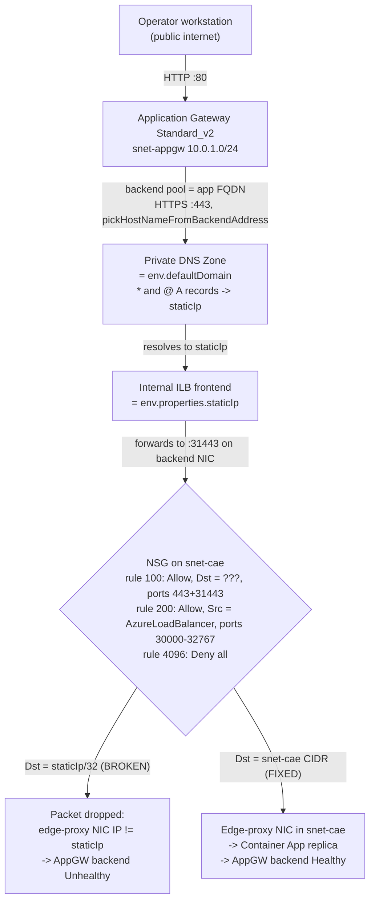

# AppGW to Internal ACA NSG Mismatch Reproduction Lab

Reproduce **H1** from the [AppGW to Internal ACA: NSG Destination Pinned to
staticIp Fails](../playbooks/ingress-and-networking/appgw-to-internal-aca-nsg-destination.md)
playbook: an Application Gateway backend health goes `Unhealthy` against an
internal Container Apps environment because the container app subnet NSG
inbound rule uses `Destination = staticIp` (a single IP) instead of the
container app's subnet CIDR. NSGs behind an internal load balancer evaluate
the destination NIC, not the load balancer frontend, so `staticIp` as a
destination is by-design broken on workload profiles environments.

## Lab Metadata

| Attribute | Value |
|---|---|
| Difficulty | Intermediate |
| Estimated Duration | 20-30 minutes (8-12 min for the initial Bicep deploy, 5 min for `trigger.sh`, 3 min for `fix.sh`) |
| Tier | Workload profiles (Consumption) |
| Failure Mode | Application Gateway backend Unhealthy; client requests return HTTP 502 |
| Skills Practiced | Application Gateway backend health, NSG rule inspection, Private DNS Zone linkage, single-variable failure isolation |

!!! note "Evidence depth"
    This lab is **fully reproducible** with Bicep-based infrastructure-as-code and helper scripts under [`labs/appgw-to-internal-aca-nsg-mismatch/`](https://github.com/yeongseon/azure-container-apps-practical-guide/tree/main/labs/appgw-to-internal-aca-nsg-mismatch):

    - `infra/main.bicep` + `infra/dns-and-appgw.bicep` provision one VNet with two subnets (`snet-appgw` `/24`, `snet-cae` `/23` delegated to `Microsoft.App/environments`), one Log Analytics workspace, one internal Container Apps environment (`vnetConfiguration.internal = true`, Consumption workload profile), one sample Container App running `mcr.microsoft.com/azuredocs/containerapps-helloworld:latest`, a linked Private DNS Zone matching `env.defaultDomain` with wildcard and apex A records pointing to `env.staticIp`, and one Application Gateway Standard_v2 with a backend pool targeting the container app FQDN and an HTTPS custom probe (`pickHostNameFromBackendHttpSettings = true`, match `200-399`). The DNS and AppGW resources are in a nested module so `env.defaultDomain` and `env.staticIp` are resolvable when the Private DNS Zone name is evaluated (workaround for [BCP120](https://aka.ms/bicep/core-diagnostics#BCP120)).
    - `trigger.sh` reads the deployment outputs, waits 120 s for the baseline backend to converge, captures baseline evidence, then applies a **3-rule NSG misconfiguration** on the container app subnet: rule 100 Allow (`Source = snet-appgw CIDR`, `Destination = <staticIp>/32` — the H1 misconfig, ports `443`+`31443`), rule 200 Allow (`Source = AzureLoadBalancer`, `Destination = snet-cae CIDR`, ports `30000-32767`), rule 4096 Deny (all). Rules 200 and 4096 make the NSG a realistically locked-down production shape so that the default `AllowVnetInBound` (priority 65000) does not mask rule 100's Destination misconfiguration. Waits 150 s and captures broken evidence.
    - `fix.sh` rewrites rule 100 Destination from `<staticIp>/32` to the CAE subnet CIDR (all other rule properties unchanged), waits 150 s, and captures fixed evidence. This preserves the "single controlled variable" property of the experiment: only rule 100's Destination address ever differs between broken and fixed states.
    - `verify.sh` is a **pure file processor** — it reads baseline / broken / fixed JSON blobs in `evidence/` and emits `verify-result.json` with five gates plus a verdict (`HYPOTHESIS_CONFIRMED` / `HYPOTHESIS_NOT_CONFIRMED`) and a falsification status (`NOT_YET_TESTED` / `FIX_VERIFIED` / `FIX_DID_NOT_RECOVER`). It does not call Azure and does not depend on `$RG`.
    - `evidence/` intentionally does not carry a committed evidence pack. Every artifact listed in [`labs/appgw-to-internal-aca-nsg-mismatch/evidence/README.md`](https://github.com/yeongseon/azure-container-apps-practical-guide/blob/main/labs/appgw-to-internal-aca-nsg-mismatch/evidence/README.md) is generated on demand by `trigger.sh` and `fix.sh`.

!!! warning "Not yet live-executed"
    As of `2026-07-03` the Bicep templates compile clean (`az bicep build` exit 0 on both `main.bicep` and `dns-and-appgw.bicep`) but the full end-to-end lab has not been executed against a live Azure subscription. The gate predictions in `## 4) Expected Evidence` are derived from the playbook hypothesis and the documented NSG evaluation semantics, not from a captured evidence pack. When the lab is next executed, add `lab_validation` under `content_validation` and set `validation.az_cli.result = pass` alongside a captured `evidence/verify-result.json`.

## 1) Background

An internal Azure Container Apps environment (`vnetConfiguration.internal = true`) exposes container apps only through the environment's internal load balancer (ILB). The ILB frontend IP is surfaced as `environment.properties.staticIp` and is inside the container app's infrastructure subnet CIDR. When an operator fronts the internal environment with an Application Gateway (AppGW), the AppGW must be able to reach the container app via the ILB, which in turn forwards traffic to the edge-proxy NIC inside the container app subnet (on ports `31443` for HTTPS and `31080` for HTTP).

For the subnet NSG to allow this traffic, the [Microsoft Learn firewall-integration NSG table for workload profiles](https://learn.microsoft.com/en-us/azure/container-apps/firewall-integration?tabs=workload-profiles) prescribes:

- **Source** = the Application Gateway subnet CIDR (or the client IP range).
- **Destination** = **the container app's subnet CIDR** (not `staticIp`).
- **Destination ports** = `443` and `31443` (add `80` and `31080` for HTTP).

The Destination requirement is the failure surface this lab reproduces. Operators frequently pin the NSG rule Destination to `staticIp` because that is the address AppGW ends up sending traffic to (after resolving the container app FQDN through the linked Private DNS Zone) and the address written into the Private DNS Zone A record. But NSGs behind a load-balanced pool [do not evaluate destination against the load balancer frontend](https://learn.microsoft.com/en-us/azure/virtual-network/network-security-groups-overview) — they evaluate against the destination NIC (the edge-proxy NIC in `snet-cae`, whose IP is inside the subnet CIDR but is not equal to `staticIp`). A rule with `Destination = <staticIp>/32` therefore drops every packet that lands on the edge-proxy NIC, and AppGW backend health goes `Unhealthy`.

This class of misconfiguration is especially common:

- After migrating from a Consumption-only environment to workload profiles (the old NSG table listed `staticIp` as an acceptable Destination, but the workload-profiles table lists only the subnet CIDR).
- When operators copy-paste NSG rules from unrelated AppGW tutorials that target public backends where `staticIp` is the on-wire address.
- When infrastructure-as-code templates hard-code `env.properties.staticIp` as the Destination because it is a stable, environment-scoped value that resolves at deployment time.

This lab isolates the failure to **a single controlled variable**: rule 100's Destination address. Ports (`443`+`31443`) are left correct, the ILB probe path (rule 200) is left correct, and no other rule changes between the broken and fixed states. If the lab shows AppGW backend health flipping `Healthy → Unhealthy → Healthy` in lock-step with the Destination toggle, H1 is falsifiably confirmed.

## 2) Hypothesis

**IF** the container app subnet NSG inbound rule 100 has `Destination = <staticIp>/32` while all other rule properties (Source, ports, protocol, priority) are left correct AND the NSG also carries a Deny-all rule at priority 4096 so that the default `AllowVnetInBound` (priority 65000) cannot mask rule 100, **THEN**:

- **Baseline state** (before `trigger.sh`, NSG has only Azure default rules): Application Gateway backend health reports every backend server as `Healthy`; a `curl` against the AppGW public IP returns HTTP 200.
- **Broken state** (after `trigger.sh` applies rules 100 + 200 + 4096): Application Gateway backend health transitions to `Unhealthy` on every backend server; a `curl` against the AppGW public IP returns HTTP 502; the container app subnet NSG rule 100 has `destinationAddressPrefix = <staticIp>/32` (or `destinationAddressPrefixes = [<staticIp>/32]`).
- **Fixed state** (after `fix.sh` rewrites rule 100 Destination from `<staticIp>/32` to the CAE subnet CIDR, all other properties unchanged): Application Gateway backend health returns to `Healthy` on every backend server; a `curl` against the AppGW public IP returns HTTP 200; rule 100 now reports `destinationAddressPrefix = <caeSubnetPrefix>`.

Falsification requires the fix to restore `Healthy` **without changing any other variable** — no port changes, no ILB probe rule changes, no AppGW backend or probe changes. If restoring `Healthy` requires any other edit, the H1 attribution to rule 100's Destination is not clean.

### Architecture

<!-- diagram-id: appgw-nsg-mismatch-experiment-architecture -->


| State | Rule 100 Destination | AppGW backend health | Client HTTP result |
|---|---|---|---|
| Baseline (empty NSG, defaults only) | n/a — no custom rule 100 exists | `Healthy` | 200 |
| Broken (`trigger.sh`) | `<staticIp>/32` | `Unhealthy` | 502 |
| Fixed (`fix.sh`) | `10.0.2.0/23` (CAE subnet CIDR) | `Healthy` | 200 |

## 3) Runbook

### Deploy infrastructure

```bash
export RG="rg-appgw-aca-nsg-lab"
export LOCATION="koreacentral"
export BASE_NAME="appgwnsg"

az group create --name "$RG" --location "$LOCATION"

az deployment group create \
    --resource-group "$RG" --name appgw-aca-nsg-mismatch \
    --template-file labs/appgw-to-internal-aca-nsg-mismatch/infra/main.bicep \
    --parameters baseName="$BASE_NAME" location="$LOCATION"
```

| Command | Why it is used |
|---|---|
| `az group create` | Creates the resource group that scopes all lab resources. |
| `az deployment group create` | Deploys `infra/main.bicep`, which provisions the VNet, subnets, Log Analytics workspace, internal Container Apps environment, sample Container App, Private DNS Zone (via nested module), and Application Gateway. Takes roughly 8-12 minutes; Application Gateway Standard_v2 dominates the wall clock. |

### Reproduce the failure

```bash
bash labs/appgw-to-internal-aca-nsg-mismatch/trigger.sh
bash labs/appgw-to-internal-aca-nsg-mismatch/verify.sh
```

| Command | Why it is used |
|---|---|
| `trigger.sh` | Reads deployment outputs, waits 120 s for AppGW backend to converge to `Healthy` (baseline), captures baseline evidence (backend health, NSG rules, `curl`), then adds the 3-rule NSG misconfiguration (rule 100 Allow with `Destination = <staticIp>/32`, rule 200 Allow for `AzureLoadBalancer`, rule 4096 Deny all), waits 150 s for probe re-convergence, and captures broken evidence. |
| `verify.sh` | Reads the baseline and broken JSON blobs in `evidence/` and emits `evidence/verify-result.json` with gates A, B, C evaluated. Exits non-zero if the verdict is not `HYPOTHESIS_CONFIRMED`. |

### Apply the fix

```bash
bash labs/appgw-to-internal-aca-nsg-mismatch/fix.sh
bash labs/appgw-to-internal-aca-nsg-mismatch/verify.sh
```

| Command | Why it is used |
|---|---|
| `fix.sh` | Rewrites NSG rule 100 Destination from `<staticIp>/32` to the CAE subnet CIDR (all other rule properties preserved), waits 150 s for probe re-convergence, captures fixed evidence. |
| `verify.sh` | Re-reads the evidence directory (now including fixed blobs) and re-emits `verify-result.json` with gates D and E evaluated and `falsification = FIX_VERIFIED` if the backend returns to `Healthy` and rule 100 Destination is now the CAE CIDR. |

### Clean up

```bash
bash labs/appgw-to-internal-aca-nsg-mismatch/cleanup.sh
```

| Command | Why it is used |
|---|---|
| `cleanup.sh` | Deletes the resource group and all child resources (async). Application Gateway Standard_v2 dominates the hourly cost of this lab, so always run `cleanup.sh` immediately after capturing evidence. |

## 4) Expected Evidence

`verify.sh` emits `evidence/verify-result.json` with the following five gates. The hypothesis is confirmed when gates A, B, and C are all true. Falsification of the hypothesis is closed when gates D and E are also true after `fix.sh`.

| Gate | Evidence file | Confirmation rule | Falsification |
|---|---|---|---|
| A: baseline backend `Healthy` | `evidence/baseline-backend-health.json` | Every `.health` value under `backendAddressPools[].backendHttpSettingsCollection[].servers[]` equals `Healthy` | Any server reports `Unhealthy` before `trigger.sh` applies the misconfig |
| B: broken backend `Unhealthy` | `evidence/broken-backend-health.json` | At least one `.health` value equals `Unhealthy` after `trigger.sh` | All servers still report `Healthy` (misconfig was not applied, or the default `AllowVnetInBound` masked rule 100) |
| C: broken rule 100 Destination = `<staticIp>/32` | `evidence/broken-nsg-rules.json` | The rule with `priority = 100` has `destinationAddressPrefix` or `destinationAddressPrefixes[0]` equal to `<env.staticIp>/32` (or the bare address) | Rule 100 Destination is anything else — the misconfig was not applied |
| D: fixed backend `Healthy` | `evidence/fixed-backend-health.json` | Every `.health` value equals `Healthy` after `fix.sh` | Any server still reports `Unhealthy` — the fix did not recover, so H1 is not the sole cause |
| E: fixed rule 100 Destination = CAE subnet CIDR | `evidence/fixed-nsg-rules.json` | Rule 100 Destination equals the value in `deploy-outputs.json .caeSubnetPrefix.value` (e.g. `10.0.2.0/23`) | Rule 100 Destination is not the CAE CIDR — the fix was not applied |

Verdict transitions:

- Before `trigger.sh` completes: `verdict = HYPOTHESIS_NOT_CONFIRMED`, `falsification = NOT_YET_TESTED`.
- After `trigger.sh` (gates A, B, C all true): `verdict = HYPOTHESIS_CONFIRMED`, `falsification = NOT_YET_TESTED`.
- After `fix.sh` (gates D, E also true): `verdict = HYPOTHESIS_CONFIRMED`, `falsification = FIX_VERIFIED`.
- If `fix.sh` runs but backend does not recover: `verdict = HYPOTHESIS_CONFIRMED`, `falsification = FIX_DID_NOT_RECOVER` — this outcome would invalidate the single-variable claim and require investigating H2 (missing edge-proxy ports) or H3 (Deny rule shadowing `AllowAzureLoadBalancerInBound`) as compounding causes.

### Client-side evidence

`trigger.sh` and `fix.sh` also capture `curl -w '%{http_code}'` results against the AppGW public IP into `baseline-curl.txt`, `broken-curl.txt`, and `fixed-curl.txt`. Expected:

- `baseline-curl.txt`: `HTTP 200`
- `broken-curl.txt`: `HTTP 502` (AppGW cannot reach any backend)
- `fixed-curl.txt`: `HTTP 200`

The `curl` evidence is redundant with the AppGW backend health gates but provides an operator-friendly end-to-end signal that the failure is observable from an unprivileged client.

## 5) Verification Queries

The lab does not require KQL because the primary signals are AppGW control-plane state (backend health) and NSG rule state — both are read via `az` CLI, not Log Analytics. However, once the lab is deployed the following KQL queries against the AppGW diagnostic settings can supplement the CLI evidence.

### KQL: AppGW access log 502 traces during the broken window

```kusto
AzureDiagnostics
| where ResourceType == "APPLICATIONGATEWAYS"
| where Category == "ApplicationGatewayAccessLog"
| where httpStatus_d == 502
| project TimeGenerated, clientIP_s, requestUri_s, httpStatus_d, backendPoolName_s, backendSettingName_s, serverStatus_s, serverResponseLatency_s
| order by TimeGenerated desc
```

Expected during the broken window: rows where `httpStatus_d = 502`, `backendPoolName_s = aca-backend-pool`, and `serverStatus_s` indicates the backend was unreachable. Zero such rows before `trigger.sh` and after `fix.sh`.

### KQL: AppGW backend health transitions

Application Gateway backend health transitions are not written to `AzureDiagnostics` on every probe cycle (only `ApplicationGatewayAccessLog` and `ApplicationGatewayFirewallLog` are surfaced). To trend backend health over time, use the [`az network application-gateway show-backend-health`](https://learn.microsoft.com/en-us/azure/application-gateway/application-gateway-backend-health-troubleshooting) command on a schedule and archive the JSON, or use the `HealthyHostCount` and `UnhealthyHostCount` Application Gateway metrics via `az monitor metrics list`. The lab does not automate this — the three JSON snapshots (`baseline` / `broken` / `fixed`) captured by `trigger.sh` and `fix.sh` are sufficient for the H1 falsification argument.

## 6) Portal Evidence

Azure Portal screenshots to collect on the next live run of this lab. Save to `docs/assets/troubleshooting/appgw-to-internal-aca-nsg-mismatch/`. As of `2026-07-03` no captures exist because the lab has not yet been live-executed.

### Baseline — Application Gateway Backend health

!!! note "Portal evidence to capture — Application Gateway → Backend health"
    Every backend server in `aca-backend-pool` reports `Healthy`. The status column value is `Healthy` and there is no probe error message. This is the positive-control screenshot that proves the deployment is in a working state before `trigger.sh` applies the misconfig.

    Capture path: `Application Gateway → Backend health → aca-backend-pool`.

    Filename: `01-appgw-backend-health-baseline.png`.

### Broken — Application Gateway Backend health

!!! note "Portal evidence to capture — Application Gateway → Backend health (after trigger.sh)"
    Every backend server transitions to `Unhealthy`. The probe error column typically reads `Backend server timed out` or `Connect Error`. This is the H1 failure screenshot.

    Capture path: `Application Gateway → Backend health → aca-backend-pool`.

    Filename: `02-appgw-backend-health-broken.png`.

### Broken — NSG rule 100 Destination

!!! note "Portal evidence to capture — NSG → Inbound security rules (after trigger.sh)"
    Rule `allow-appgw-inbound-broken` at priority 100 shows `Destination = <staticIp>/32` (or the bare `staticIp` address, depending on the Portal's rendering of a single-address prefix). Rule 200 (`AzureLoadBalancer` → CAE subnet, ports `30000-32767`) and rule 4096 (Deny all) are also visible, proving the NSG shape is realistically locked down and the failure cannot be attributed to a missing ILB probe allow or an incidental default-rule bypass.

    Capture path: `NSG (nsg-snet-cae-<suffix>) → Inbound security rules`.

    Filename: `03-nsg-rule100-broken.png`.

### Fixed — Application Gateway Backend health

!!! note "Portal evidence to capture — Application Gateway → Backend health (after fix.sh)"
    Every backend server returns to `Healthy`. This is the falsification screenshot — it proves the ONLY change between broken and fixed states was rule 100's Destination address.

    Capture path: `Application Gateway → Backend health → aca-backend-pool`.

    Filename: `04-appgw-backend-health-fixed.png`.

### Fixed — NSG rule 100 Destination

!!! note "Portal evidence to capture — NSG → Inbound security rules (after fix.sh)"
    Rule `allow-appgw-inbound-broken` at priority 100 now shows `Destination = 10.0.2.0/23` (the CAE subnet CIDR). Source, ports, protocol, and priority are unchanged. The rule name is intentionally left as `allow-appgw-inbound-broken` to preserve the audit trail — a real operator's fix would also rename the rule, but the lab prefers name stability so a reviewer can trivially confirm that only the Destination address changed.

    Capture path: `NSG (nsg-snet-cae-<suffix>) → Inbound security rules`.

    Filename: `05-nsg-rule100-fixed.png`.

### Screenshot capture checklist

| Screenshot | File name | Blade selector |
|---|---|---|
| Baseline: AppGW backend health | `01-appgw-backend-health-baseline.png` | Application Gateway → Backend health → aca-backend-pool |
| Broken: AppGW backend health | `02-appgw-backend-health-broken.png` | Application Gateway → Backend health → aca-backend-pool |
| Broken: NSG rule 100 Destination | `03-nsg-rule100-broken.png` | NSG → Inbound security rules → `allow-appgw-inbound-broken` |
| Fixed: AppGW backend health | `04-appgw-backend-health-fixed.png` | Application Gateway → Backend health → aca-backend-pool |
| Fixed: NSG rule 100 Destination | `05-nsg-rule100-fixed.png` | NSG → Inbound security rules → `allow-appgw-inbound-broken` |

Follow the Portal Screenshot Capture (PII Replacement Rules) documented in `AGENTS.md` when capturing: use the reusable PII helper, verify each PNG with the Read tool, and confirm no `MICROSOFT NON-PRODUCTION` badge, no real subscription IDs, and no employee emails or aliases are visible before referencing the PNG from this file.

## Clean Up

```bash
bash labs/appgw-to-internal-aca-nsg-mismatch/cleanup.sh
```

| Command | Why it is used |
|---|---|
| `cleanup.sh` | Deletes the resource group and all child resources (async). Application Gateway Standard_v2 dominates the hourly cost of this lab (~`$0.36`/hour + capacity-unit charges); always run `cleanup.sh` immediately after capturing evidence. |

## Related Playbook

- [AppGW to Internal ACA: NSG Destination Pinned to staticIp Fails](../playbooks/ingress-and-networking/appgw-to-internal-aca-nsg-destination.md)

## See Also

- [Application Gateway Integration with an Internal Container Apps Environment](../../platform/networking/application-gateway-integration.md)
- [UDR and NSG Egress Blocked Lab](./udr-nsg-egress-blocked.md)
- [Private Endpoint DNS Failure Lab](./private-endpoint-dns-failure.md)
- [Ingress Not Reachable Playbook](../playbooks/ingress-and-networking/ingress-not-reachable.md)
- [Networking Best Practices](../../best-practices/networking.md)

## Sources

- [Securing a Virtual Network in Azure Container Apps (workload profiles) (Microsoft Learn)](https://learn.microsoft.com/en-us/azure/container-apps/firewall-integration?tabs=workload-profiles)
- [Protect Azure Container Apps with Application Gateway and Web Application Firewall (WAF) (Microsoft Learn)](https://learn.microsoft.com/en-us/azure/container-apps/waf-app-gateway)
- [Provide an internal environment for Azure Container Apps (Microsoft Learn)](https://learn.microsoft.com/en-us/azure/container-apps/vnet-custom-internal)
- [Networking in Azure Container Apps environment (Microsoft Learn)](https://learn.microsoft.com/en-us/azure/container-apps/networking)
- [Network security groups (Microsoft Learn)](https://learn.microsoft.com/en-us/azure/virtual-network/network-security-groups-overview)
- [Application Gateway backend health monitoring (Microsoft Learn)](https://learn.microsoft.com/en-us/azure/application-gateway/application-gateway-backend-health-troubleshooting)
- [Application Gateway health probes overview (Microsoft Learn)](https://learn.microsoft.com/en-us/azure/application-gateway/application-gateway-probe-overview)
- [Bicep BCP120 — value must be a compile-time constant (Microsoft Learn)](https://aka.ms/bicep/core-diagnostics#BCP120)
