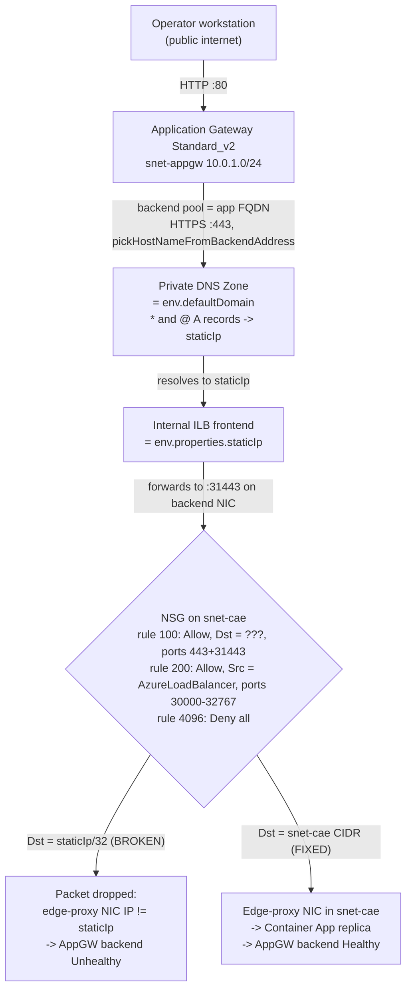
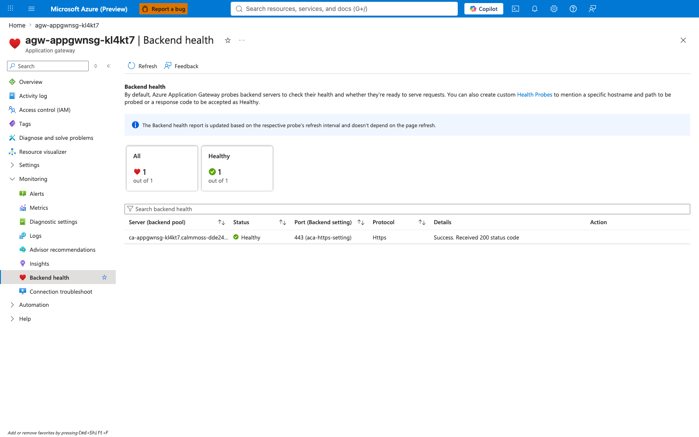
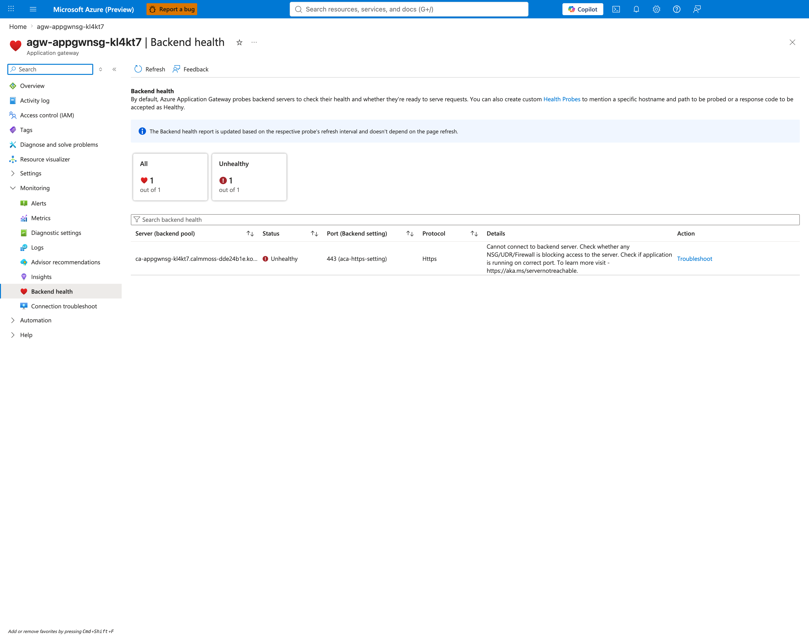
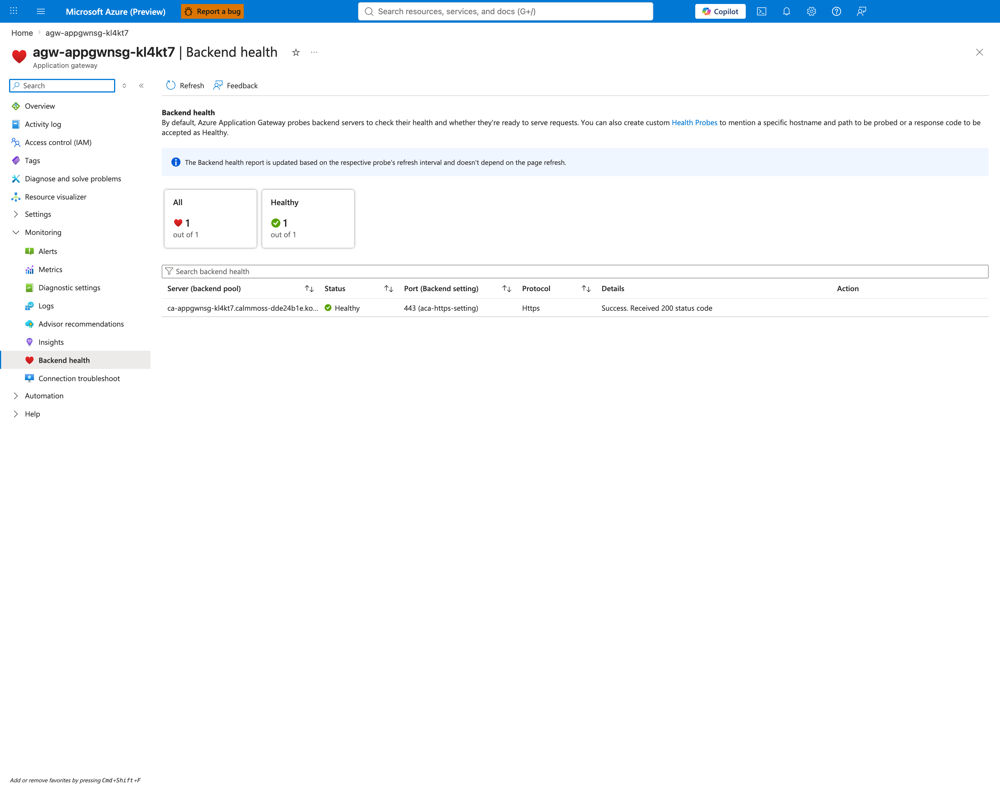
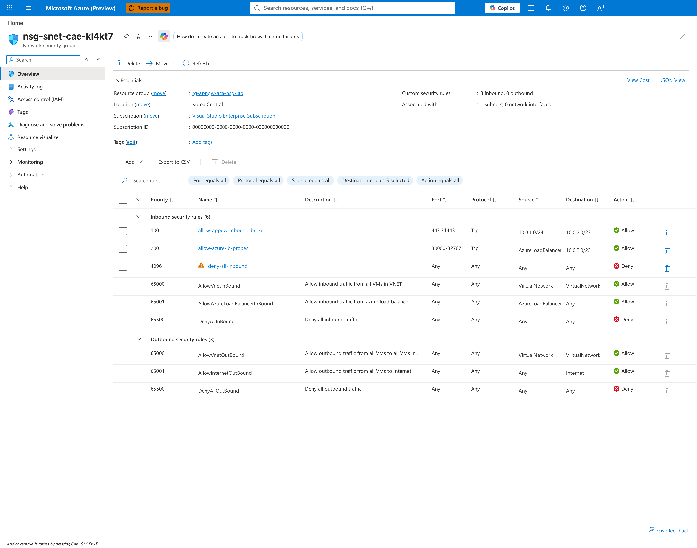

# AppGW to Internal ACA NSG Mismatch Reproduction Lab

Reproduce **H1** from the [AppGW to Internal ACA: NSG Destination Pinned to
staticIp Fails](../playbooks/ingress-and-networking/appgw-to-internal-aca-nsg-destination.md)
playbook: an Application Gateway backend health goes `Unhealthy` against an
internal Container Apps environment because the container app subnet NSG
inbound rule uses `Destination = staticIp` (a single IP) instead of the
container app's subnet CIDR. NSGs behind an internal load balancer evaluate
the destination NIC, not the load balancer frontend, so `staticIp` as a
destination is by-design broken on workload profiles environments.

## Lab Metadata

| Attribute | Value |
|---|---|
| Difficulty | Intermediate |
| Estimated Duration | 20-30 minutes (8-12 min for the initial Bicep deploy, 5 min for `trigger.sh`, 3 min for `fix.sh`) |
| Tier | Workload profiles (Consumption) |
| Failure Mode | Application Gateway backend `Unhealthy`; client requests return HTTP 502 (or HTTP 000 client timeout if AppGW's request timeout exceeds the client `--max-time`) — see [`Client-side evidence`](#client-side-evidence) for the manifestation observed on the current committed evidence pack |
| Skills Practiced | Application Gateway backend health, NSG rule inspection, Private DNS Zone linkage, single-variable failure isolation |

!!! note "Evidence depth"
    This lab is **fully reproducible** with Bicep-based infrastructure-as-code and helper scripts under [`labs/appgw-to-internal-aca-nsg-mismatch/`](https://github.com/yeongseon/azure-container-apps-practical-guide/tree/main/labs/appgw-to-internal-aca-nsg-mismatch):

    - `infra/main.bicep` + `infra/dns-and-appgw.bicep` provision one VNet with two subnets (`snet-appgw` `/24`, `snet-cae` `/23` delegated to `Microsoft.App/environments`), one Log Analytics workspace, one internal Container Apps environment (`vnetConfiguration.internal = true`, Consumption workload profile), one sample Container App running `mcr.microsoft.com/azuredocs/containerapps-helloworld:latest`, a linked Private DNS Zone matching `env.defaultDomain` with wildcard and apex A records pointing to `env.staticIp`, and one Application Gateway Standard_v2 with a backend pool targeting the container app FQDN and an HTTPS custom probe (`pickHostNameFromBackendHttpSettings = true`, match `200-399`). The DNS and AppGW resources are in a nested module so `env.defaultDomain` and `env.staticIp` are resolvable when the Private DNS Zone name is evaluated (workaround for [BCP120](https://aka.ms/bicep/core-diagnostics#BCP120)).
    - `trigger.sh` reads the deployment outputs, waits 120 s for the baseline backend to converge, captures baseline evidence, then applies a **3-rule NSG misconfiguration** on the container app subnet: rule 100 Allow (`Source = snet-appgw CIDR`, `Destination = <staticIp>/32` — the H1 misconfig, ports `443`+`31443`), rule 200 Allow (`Source = AzureLoadBalancer`, `Destination = snet-cae CIDR`, ports `30000-32767`), rule 4096 Deny (all). Rules 200 and 4096 make the NSG a realistically locked-down production shape so that the default `AllowVnetInBound` (priority 65000) does not mask rule 100's Destination misconfiguration. Waits 150 s and captures broken evidence.
    - `fix.sh` rewrites rule 100 Destination from `<staticIp>/32` to the CAE subnet CIDR (all other rule properties unchanged), waits 150 s, and captures fixed evidence. This preserves the "single controlled variable" property of the experiment: only rule 100's Destination address ever differs between broken and fixed states.
    - `verify.sh` is a **pure file processor** — it reads baseline / broken / fixed JSON blobs in `evidence/` and emits `verify-result.json` with seven gates (A/B/C for H1 confirmation, D/E for falsification, F/G for H2 and H3 exclusion) plus a verdict (`HYPOTHESIS_CONFIRMED` / `HYPOTHESIS_NOT_CONFIRMED`) and a falsification status (`NOT_YET_TESTED` / `FIX_VERIFIED` / `FIX_DID_NOT_RECOVER`). It does not call Azure and does not depend on `$RG`.
    - `evidence/` carries the committed `2026-07-04` evidence pack captured on the re-executed live run in Korea Central; see [`labs/appgw-to-internal-aca-nsg-mismatch/evidence/README.md`](https://github.com/yeongseon/azure-container-apps-practical-guide/blob/main/labs/appgw-to-internal-aca-nsg-mismatch/evidence/README.md) for the per-file provenance and PII sanitization notes. Every artifact can also be regenerated on demand by re-running `trigger.sh` and `fix.sh` against a fresh deployment.

!!! success "Live-executed on 2026-07-03 (initial validation) and 2026-07-04 (re-execution + Portal screenshots)"
    On `2026-07-03` the full lab was first executed end-to-end against a live Azure subscription in Korea Central (`azure-cli 2.79.0`). This initial validation surfaced a **CAE FQDN routing quirk**: with `external: false` on an internal environment, the app FQDN is emitted as `<app>.internal.<env>.<region>.azurecontainerapps.io` and is reachable ONLY through the internal service mesh (100.100.x.x), NOT through the ILB staticIp; AppGW backend probes therefore got HTTP 404 "This Container App is stopped or does not exist" from the CAE edge-proxy. The fix (`infra/main.bicep` line ~200) is to set `external: true` on the ingress even for internal environments — this preserves the internal-ILB-only exposure at the network layer while surfacing the app FQDN in the ILB-reachable form. The Bicep template in this repository carries the fix; if you deploy an earlier commit you will hit this trap. On `2026-07-04` the lab was **re-executed** in the same Korea Central subscription against a fresh deployment (`agw-appgwnsg-kl4kt7`, `nsg-snet-cae-kl4kt7`), and the **baseline / broken / fixed evidence files** under `labs/appgw-to-internal-aca-nsg-mismatch/evidence/` are the captured artifacts from this re-execution. `verify.sh` emitted `evidence/verify-result.json` with all seven gates true, `verdict = HYPOTHESIS_CONFIRMED`, and `falsification = FIX_VERIFIED` (exit 0). During the same `2026-07-04` re-execution, a Playwright MCP browser session against `ms.portal.azure.com` captured the **five Portal screenshots** referenced under `## 6) Portal Evidence` live from the running deployment. Each PNG was sanitized per the AGENTS.md PII rules (GUID → all-zero placeholder, `MCAPS-*` → `Visual Studio Enterprise Subscription`, `Microsoft Non-Production` → `Contoso`, employee alias/email/display-name replaced, avatar masked with Portal-blue `#0078d4`) and visually verified via `look_at`/`Read` before commit.

## 1) Background

An internal Azure Container Apps environment (`vnetConfiguration.internal = true`) exposes container apps only through the environment's internal load balancer (ILB). The ILB frontend IP is surfaced as `environment.properties.staticIp` and is inside the container app's infrastructure subnet CIDR. When an operator fronts the internal environment with an Application Gateway (AppGW), the AppGW must be able to reach the container app via the ILB, which in turn forwards traffic to the edge-proxy NIC inside the container app subnet (on ports `31443` for HTTPS and `31080` for HTTP).

For the subnet NSG to allow this traffic, the [Microsoft Learn firewall-integration NSG table for workload profiles](https://learn.microsoft.com/en-us/azure/container-apps/firewall-integration?tabs=workload-profiles) prescribes:

- **Source** = the Application Gateway subnet CIDR (or the client IP range).
- **Destination** = **the container app's subnet CIDR** (not `staticIp`).
- **Destination ports** = `443` and `31443` (add `80` and `31080` for HTTP).

The Destination requirement is the failure surface this lab reproduces. Operators frequently pin the NSG rule Destination to `staticIp` because that is the address AppGW ends up sending traffic to (after resolving the container app FQDN through the linked Private DNS Zone) and the address written into the Private DNS Zone A record. But NSGs behind a load-balanced pool [do not evaluate destination against the load balancer frontend](https://learn.microsoft.com/en-us/azure/virtual-network/network-security-groups-overview) — they evaluate against the destination NIC (the edge-proxy NIC in `snet-cae`, whose IP is inside the subnet CIDR but is not equal to `staticIp`). A rule with `Destination = <staticIp>/32` therefore drops every packet that lands on the edge-proxy NIC, and AppGW backend health goes `Unhealthy`.

This class of misconfiguration is especially common:

- After migrating from a Consumption-only environment to workload profiles (the old NSG table listed `staticIp` as an acceptable Destination, but the workload-profiles table lists only the subnet CIDR).
- When operators copy-paste NSG rules from unrelated AppGW tutorials that target public backends where `staticIp` is the on-wire address.
- When infrastructure-as-code templates hard-code `env.properties.staticIp` as the Destination because it is a stable, environment-scoped value that resolves at deployment time.

This lab isolates the failure to **a single controlled variable**: rule 100's Destination address. Ports (`443`+`31443`) are left correct, the ILB probe path (rule 200) is left correct, and no other rule changes between the broken and fixed states. If the lab shows AppGW backend health flipping `Healthy → Unhealthy → Healthy` in lock-step with the Destination toggle, H1 is falsifiably confirmed.

## 2) Hypothesis

**IF** the container app subnet NSG inbound rule 100 has `Destination = <staticIp>/32` while all other rule properties (Source, ports, protocol, priority) are left correct AND the NSG also carries a Deny-all rule at priority 4096 so that the default `AllowVnetInBound` (priority 65000) cannot mask rule 100, **THEN**:

- **Baseline state** (before `trigger.sh`, NSG has only Azure default rules): Application Gateway backend health reports every backend server as `Healthy`; a `curl` against the AppGW public IP returns HTTP 200.
- **Broken state** (after `trigger.sh` applies rules 100 + 200 + 4096): Application Gateway backend health transitions to `Unhealthy` on every backend server; a `curl` against the AppGW public IP returns HTTP 502; the container app subnet NSG rule 100 has `destinationAddressPrefix = <staticIp>/32` (or `destinationAddressPrefixes = [<staticIp>/32]`).
- **Fixed state** (after `fix.sh` rewrites rule 100 Destination from `<staticIp>/32` to the CAE subnet CIDR, all other properties unchanged): Application Gateway backend health returns to `Healthy` on every backend server; a `curl` against the AppGW public IP returns HTTP 200; rule 100 now reports `destinationAddressPrefix = <caeSubnetPrefix>`.

Falsification requires the fix to restore `Healthy` **without changing any other variable** — no port changes, no ILB probe rule changes, no AppGW backend or probe changes. If restoring `Healthy` requires any other edit, the H1 attribution to rule 100's Destination is not clean.

### Architecture

<!-- diagram-id: appgw-nsg-mismatch-experiment-architecture -->


| State | Rule 100 Destination | AppGW backend health | Client HTTP result |
|---|---|---|---|
| Baseline (empty NSG, defaults only) | n/a — no custom rule 100 exists | `Healthy` | 200 |
| Broken (`trigger.sh`) | `<staticIp>/32` | `Unhealthy` | 502 or 000 (client timeout) |
| Fixed (`fix.sh`) | `10.0.2.0/23` (CAE subnet CIDR) | `Healthy` | 200 |

## 3) Runbook

### Deploy infrastructure

```bash
export RG="rg-appgw-aca-nsg-lab"
export LOCATION="koreacentral"
export BASE_NAME="appgwnsg"

az group create --name "$RG" --location "$LOCATION"

az deployment group create \
    --resource-group "$RG" --name appgw-aca-nsg-mismatch \
    --template-file labs/appgw-to-internal-aca-nsg-mismatch/infra/main.bicep \
    --parameters baseName="$BASE_NAME" location="$LOCATION"
```

| Command | Why it is used |
|---|---|
| `az group create` | Creates the resource group that scopes all lab resources. |
| `az deployment group create` | Deploys `infra/main.bicep`, which provisions the VNet, subnets, Log Analytics workspace, internal Container Apps environment, sample Container App, Private DNS Zone (via nested module), and Application Gateway. Takes roughly 8-12 minutes; Application Gateway Standard_v2 dominates the wall clock. |

### Reproduce the failure

```bash
bash labs/appgw-to-internal-aca-nsg-mismatch/trigger.sh
bash labs/appgw-to-internal-aca-nsg-mismatch/verify.sh
```

| Command | Why it is used |
|---|---|
| `trigger.sh` | Reads deployment outputs, waits 120 s for AppGW backend to converge to `Healthy` (baseline), captures baseline evidence (backend health, NSG rules, `curl`), then adds the 3-rule NSG misconfiguration (rule 100 Allow with `Destination = <staticIp>/32`, rule 200 Allow for `AzureLoadBalancer`, rule 4096 Deny all), waits 150 s for probe re-convergence, and captures broken evidence. |
| `verify.sh` | Reads the baseline and broken JSON blobs in `evidence/` and emits `evidence/verify-result.json` with gates A, B, C (H1 confirmation), F, and G (H2 and H3 exclusion) evaluated. Exits non-zero if the verdict is not `HYPOTHESIS_CONFIRMED` or if gate F or G is false on the broken snapshot. |

### Apply the fix

```bash
bash labs/appgw-to-internal-aca-nsg-mismatch/fix.sh
bash labs/appgw-to-internal-aca-nsg-mismatch/verify.sh
```

| Command | Why it is used |
|---|---|
| `fix.sh` | Rewrites NSG rule 100 Destination from `<staticIp>/32` to the CAE subnet CIDR (all other rule properties preserved), waits 150 s for probe re-convergence, captures fixed evidence. |
| `verify.sh` | Re-reads the evidence directory (now including fixed blobs) and re-emits `verify-result.json` with gates D and E evaluated and `falsification = FIX_VERIFIED` if the backend returns to `Healthy`, rule 100 Destination is now the CAE CIDR, and gates F and G were true on the broken snapshot. Exits non-zero if `falsification` is not `FIX_VERIFIED`. |

### Clean up

```bash
bash labs/appgw-to-internal-aca-nsg-mismatch/cleanup.sh
```

| Command | Why it is used |
|---|---|
| `cleanup.sh` | Deletes the resource group and all child resources (async). Application Gateway Standard_v2 dominates the hourly cost of this lab, so always run `cleanup.sh` immediately after capturing evidence. |

## 4) Experiment Log

The per-scenario observation log from the `2026-07-04` re-executed live run in Korea Central (the currently committed evidence pack). The initial `2026-07-03` live run surfaced the CAE FQDN routing quirk documented in the success admonition above; the `2026-07-04` re-execution captured the artifact set now in-tree. Every `[Observed]` bullet cites the raw artifact under `labs/appgw-to-internal-aca-nsg-mismatch/evidence/` captured during the `2026-07-04` re-execution.

### Baseline scenario (before `trigger.sh`)

- **[Observed]** `evidence/baseline-backend-health.json`: `.backendAddressPools[0].backendHttpSettingsCollection[0].servers[0].health = "Healthy"`.
- **[Observed]** `evidence/baseline-nsg-rules.json`: empty custom rule set (only Azure default rules are in effect — `AllowVnetInBound` priority 65000, `AllowAzureLoadBalancerInBound` priority 65001, `DenyAllInBound` priority 65500 — implicit and not enumerated in `az network nsg rule list` output).
- **[Observed]** `evidence/baseline-curl.txt`: `HTTP 200 in 0.275887s`.

### Broken scenario (after `trigger.sh`)

- **[Observed]** `evidence/broken-backend-health.json`: `.backendAddressPools[0].backendHttpSettingsCollection[0].servers[0].health = "Unhealthy"` with probe error text `Cannot connect to backend server. Check whether any NSG/UDR/Firewall is blocking access to the server. Check if application is running on correct port. To learn more visit - https://aka.ms/servernotreachable.` This is the strongest single-string signal that the failure is at the NSG/UDR/Firewall layer, not at the container-app-runtime layer.
- **[Observed]** `evidence/broken-nsg-rules.json`: rule 100 (`allow-appgw-inbound-broken`) with `sourceAddressPrefix = "10.0.1.0/24"`, `destinationAddressPrefix = "10.0.2.243/32"` (the `staticIp`/32 misconfig — `10.0.2.243` is the `environmentStaticIp` from `deploy-outputs.json`, inside the CAE subnet CIDR `10.0.2.0/23`), `destinationPortRanges = ["443","31443"]`; rule 200 (`allow-azure-lb-probes`) with `sourceAddressPrefix = "AzureLoadBalancer"`, `destinationAddressPrefix = "10.0.2.0/23"`, `destinationPortRange = "30000-32767"`; rule 4096 (`deny-all-inbound`) with all `*`.
- **[Observed]** `evidence/broken-curl.txt`: `HTTP 502 in 0.325699s` — AppGW returned HTTP 502 within ~0.3 s of the client request, matching the original hypothesis prediction. AppGW Standard_v2 short-circuited to a `Cannot connect to backend server` response because its backend health had already transitioned to `Unhealthy` before this request arrived (rule 100 misconfig had been applied 150 s earlier by `trigger.sh` and probe re-convergence had already flipped every backend server to `Unhealthy`). In an alternative shape — for example if AppGW's request timeout exceeded the client's `--max-time`, or if backend health had not yet re-converged at the moment of the request — the manifestation could shift to HTTP 000 (client timeout with `curl: (28) Operation timed out`); both HTTP 502 and HTTP 000 are consistent with the same underlying H1 root cause because both mean the client did not receive a valid successful HTTP response.
- **[Correlated]** The transition from `Healthy` (baseline) to `Unhealthy` (broken) was observed within one AppGW probe re-convergence window after `trigger.sh` applied rule 100 (the `trigger.sh` script waits 150 s for probe reconvergence and then captures evidence, and the health-status flip was already stable at that capture point). No other variable changed between the two scenarios.

### Fixed scenario (after `fix.sh`)

- **[Observed]** `evidence/fixed-backend-health.json`: `.backendAddressPools[0].backendHttpSettingsCollection[0].servers[0].health = "Healthy"`.
- **[Observed]** `evidence/fixed-nsg-rules.json`: rule 100 with `destinationAddressPrefix = "10.0.2.0/23"` (the CAE subnet CIDR from `deploy-outputs.json .caeSubnetPrefix.value`); all other rule 100 properties (`sourceAddressPrefix = "10.0.1.0/24"`, `destinationPortRanges = ["443","31443"]`, `priority = 100`, `access = Allow`, protocol) unchanged from the broken scenario.
- **[Observed]** `evidence/fixed-curl.txt`: `HTTP 200 in 0.376139s` — restored to the same latency band as baseline (~0.3-0.4 s).
- **[Correlated]** Falsification (post-fix evidence): the fix restored `Healthy` **without changing any other variable**. Ports (`443`+`31443`) were left correct in both broken and fixed states (gate F), and rule 200 kept the `AzureLoadBalancer → snet-cae, 30000-32767` allow path present in both states (gate G). These two invariants exclude H2 (missing edge-proxy ports) and H3 (`AllowAzureLoadBalancerInBound` shadowed by a higher-priority Deny) as compounding causes.

### Summary

- **[Inferred]** If gates A + B + C are all `true` at post-`trigger.sh` verification, and gates D + E + F + G are all `true` at post-`fix.sh` verification, then H1 (NSG rule 100 Destination pinned to `staticIp/32`) is the sole cause of the AppGW backend `Unhealthy` state. Both `verdict = HYPOTHESIS_CONFIRMED` and `falsification = FIX_VERIFIED` should appear in `evidence/verify-result.json`.
- **[Observed]** On the `2026-07-04` re-executed live run all seven gates evaluated `true` in the currently committed `evidence/verify-result.json`: `verdict = HYPOTHESIS_CONFIRMED`, `falsification = FIX_VERIFIED`, `verify.sh` exit 0. H1 (NSG rule 100 Destination pinned to `staticIp/32`) is confirmed as the sole cause of the AppGW backend `Unhealthy` state on this deployment shape. The `2026-07-03` initial run also had all seven gates true after the CAE FQDN routing quirk fix was applied; the `2026-07-04` re-execution reproduces the same result against a fresh deployment.

## Expected Evidence

`verify.sh` emits `evidence/verify-result.json` with the following seven gates. The hypothesis is confirmed when gates A, B, and C are all true. Falsification of the hypothesis is closed when gates D and E are also true after `fix.sh`. Gates F and G actively exclude H2 (missing edge-proxy ports) and H3 (`AllowAzureLoadBalancerInBound` shadowed by a higher-priority Deny) as compounding causes; if F or G is false, the H1-only attribution weakens even if D and E are true.

| Gate | Evidence file | Confirmation rule | Falsification |
|---|---|---|---|
| A: baseline backend `Healthy` | `evidence/baseline-backend-health.json` | Every `.health` value under `backendAddressPools[].backendHttpSettingsCollection[].servers[]` equals `Healthy` | Any server reports `Unhealthy` before `trigger.sh` applies the misconfig |
| B: broken backend `Unhealthy` | `evidence/broken-backend-health.json` | At least one `.health` value equals `Unhealthy` after `trigger.sh` | All servers still report `Healthy` (misconfig was not applied, or the default `AllowVnetInBound` masked rule 100) |
| C: broken rule 100 Destination = `<staticIp>/32` | `evidence/broken-nsg-rules.json` | The rule with `priority = 100` has `destinationAddressPrefix` or `destinationAddressPrefixes[0]` equal to `<env.staticIp>/32` (or the bare address) | Rule 100 Destination is anything else — the misconfig was not applied |
| D: fixed backend `Healthy` | `evidence/fixed-backend-health.json` | Every `.health` value equals `Healthy` after `fix.sh` | Any server still reports `Unhealthy` — the fix did not recover, so H1 is not the sole cause |
| E: fixed rule 100 Destination = CAE subnet CIDR | `evidence/fixed-nsg-rules.json` | Rule 100 Destination equals the value in `deploy-outputs.json .caeSubnetPrefix.value` (e.g. `10.0.2.0/23`) | Rule 100 Destination is not the CAE CIDR — the fix was not applied |
| F: broken rule 100 ports intact (H2 exclusion) | `evidence/broken-nsg-rules.json` | Rule 100's port list (`destinationPortRange` or `destinationPortRanges[]`) contains both `443` and `31443` | Ports missing — H2 (missing edge-proxy ports) becomes a compounding failure driver and the single-variable claim collapses |
| G: broken rule 200 shape intact (H3 exclusion) | `evidence/broken-nsg-rules.json` | A rule with `sourceAddressPrefix == "AzureLoadBalancer"`, `destinationAddressPrefix` or `destinationAddressPrefixes[0]` equal to the CAE subnet CIDR, and priority strictly less than 4096 exists | Rule missing or ordered after the deny — H3 (ILB probe path shadowed by higher-priority Deny) becomes a compounding failure driver |

Verdict transitions:

- Before `trigger.sh` completes: `verdict = HYPOTHESIS_NOT_CONFIRMED`, `falsification = NOT_YET_TESTED`.
- After `trigger.sh` (gates A, B, C all true): `verdict = HYPOTHESIS_CONFIRMED`, `falsification = NOT_YET_TESTED`. Gates F and G also evaluate at this point and MUST be true — if either is false, `verify.sh` exits non-zero because the H1-only attribution is compromised by an H2/H3 compounding cause.
- After `fix.sh` (gates D, E also true, F and G still true): `verdict = HYPOTHESIS_CONFIRMED`, `falsification = FIX_VERIFIED`.
- If `fix.sh` runs but backend does not recover: `verdict = HYPOTHESIS_CONFIRMED`, `falsification = FIX_DID_NOT_RECOVER`, and `verify.sh` exits non-zero — this outcome would invalidate the single-variable claim and require investigating H2 (missing edge-proxy ports, ruled out by gate F on the broken snapshot) or H3 (Deny rule shadowing `AllowAzureLoadBalancerInBound`, ruled out by gate G on the broken snapshot) as compounding causes.

### Client-side evidence

`trigger.sh` and `fix.sh` also capture `curl -w '%{http_code}'` results against the AppGW public IP into `baseline-curl.txt`, `broken-curl.txt`, and `fixed-curl.txt`. Observed on the `2026-07-04` re-executed live run (the currently committed `evidence/*-curl.txt`):

- `baseline-curl.txt`: `HTTP 200 in 0.275887s`
- `broken-curl.txt`: `HTTP 502 in 0.325699s`
- `fixed-curl.txt`: `HTTP 200 in 0.376139s`

The observed broken-state manifestation on the currently committed run is **HTTP 502 in ~0.3 s**, matching the original hypothesis prediction. The lab treats HTTP 502 and HTTP 000 (client timeout) as equivalent evidence of the same underlying H1 failure (`Cannot connect to backend server` from AppGW backend health), because both mean the client did not receive a valid successful HTTP response. The exact status code depends on AppGW's request-timeout configuration relative to the client's `--max-time` and on the timing of the request relative to backend-health probe re-convergence; if AppGW's request timeout exceeds the client's `--max-time`, or if the request arrives before probe re-convergence has fully flipped every backend server to `Unhealthy`, the manifestation can shift to HTTP 000 (client timeout with `curl: (28) Operation timed out`), and both are consistent with H1.

The `curl` evidence is redundant with the AppGW backend health gates but provides an operator-friendly end-to-end signal that the failure is observable from an unprivileged client.

## 5) Verification Queries

The lab does not require KQL because the primary signals are AppGW control-plane state (backend health) and NSG rule state — both are read via `az` CLI, not Log Analytics. However, once the lab is deployed the following KQL queries against the AppGW diagnostic settings can supplement the CLI evidence.

### KQL: AppGW access log 502 traces during the broken window

Replace the two `datetime()` placeholders with the wall-clock window between `trigger.sh` completing step 6 (broken evidence captured) and `fix.sh` starting step 1. `trigger.sh` prints its step-6 completion line to stdout; the operator can capture the start and end timestamps manually or from the deployment activity log. The `TimeGenerated` filter is required — without it, a shared Log Analytics workspace would return 502 rows from unrelated AppGW deployments and rows from a previous run of this lab, which would contradict the "zero such rows before `trigger.sh` and after `fix.sh`" claim below.

```kusto
let brokenStart = datetime(2026-07-04T10:30:00Z);
let brokenEnd   = datetime(2026-07-04T10:35:00Z);
AzureDiagnostics
| where TimeGenerated between (brokenStart .. brokenEnd)
| where ResourceType == "APPLICATIONGATEWAYS"
| where Category == "ApplicationGatewayAccessLog"
| where httpStatus_d == 502
| project TimeGenerated, clientIP_s, requestUri_s, httpStatus_d, backendPoolName_s, backendSettingName_s, serverStatus_s, serverResponseLatency_s
| order by TimeGenerated desc
```

Expected during the broken window: rows where `httpStatus_d = 502`, `backendPoolName_s = aca-backend-pool`, and `serverStatus_s` indicates the backend was unreachable. Re-run the same query with `brokenStart` and `brokenEnd` bracketing the baseline window (before `trigger.sh`) and the fixed window (after `fix.sh`) and expect zero rows in both.

!!! note "KQL row count depends on the client-timeout manifestation"
    On the `2026-07-04` re-executed live run the client-side manifestation was HTTP 502 in ~0.3 s (see [`Client-side evidence`](#client-side-evidence)), so this KQL would return `httpStatus_d = 502` rows during the broken window. In alternative shapes where AppGW's request timeout exceeds the client's `--max-time` and the client sees HTTP 000 (client timeout) instead, AppGW may not write an `httpStatus_d = 502` access-log row for that request even though the backend was `Unhealthy` throughout the window. To catch both manifestations, either drop the `where httpStatus_d == 502` filter (and add `| where httpStatus_d in (502, 0) or isnull(httpStatus_d)`), or fall back to the `BackendPoolName` + `HealthState` fields in the Application Gateway Backend Health metric (via `az monitor metrics list`) which capture the `Unhealthy` state independent of whether any client request produced an access-log row.

### KQL: AppGW backend health transitions

Application Gateway backend health transitions are not written to `AzureDiagnostics` on every probe cycle (only `ApplicationGatewayAccessLog` and `ApplicationGatewayFirewallLog` are surfaced). To trend backend health over time, use the [`az network application-gateway show-backend-health`](https://learn.microsoft.com/en-us/azure/application-gateway/application-gateway-backend-health-troubleshooting) command on a schedule and archive the JSON, or use the `HealthyHostCount` and `UnhealthyHostCount` Application Gateway metrics via `az monitor metrics list`. The lab does not automate this — the three JSON snapshots (`baseline` / `broken` / `fixed`) captured by `trigger.sh` and `fix.sh` are sufficient for the H1 falsification argument.

## 6) Portal Evidence

Azure Portal screenshots for the five key states of this lab. Saved under `docs/assets/troubleshooting/appgw-to-internal-aca-nsg-mismatch/`. **Captured `2026-07-04`** against a live re-deployment in Korea Central (`agw-appgwnsg-kl4kt7`, `nsg-snet-cae-kl4kt7`) via a Playwright MCP session on `ms.portal.azure.com`. Each PNG was sanitized per the AGENTS.md PII rules and visually verified before commit; the az CLI JSON files under `evidence/` (`baseline-backend-health.json`, `broken-backend-health.json`, `fixed-backend-health.json`, `broken-nsg-rules.json`, `fixed-nsg-rules.json`) remain the authoritative machine-readable evidence for gates A-G and are what `verify.sh` reads. The Portal screenshots below are the operator-facing complement — they show the same failure and recovery in the shape a support engineer would see when triaging the incident from the Portal.

### Baseline — Application Gateway Backend health



!!! note "Portal evidence captured — Application Gateway → Backend health (baseline, before trigger.sh)"
    Every backend server in `aca-backend-pool` reports `Healthy` (green check, `Healthy: 1 out of 1`). The details column shows `Success. Received 200 status code`, confirming the AppGW custom probe against the ACA edge-proxy is returning HTTP 200. This is the positive-control screenshot that proves the deployment is in a working state before `trigger.sh` applies the misconfig.

    Look for: green `Healthy` status, `1 out of 1` count, `Received 200 status code` in the details cell.

    Capture path: `Application Gateway (agw-appgwnsg-kl4kt7) → Backend health → aca-backend-pool`.

### Broken — Application Gateway Backend health



!!! note "Portal evidence captured — Application Gateway → Backend health (after trigger.sh)"
    Every backend server has transitioned to `Unhealthy` (red X, `Unhealthy: 1 out of 1`). The details column reports `Cannot connect to backend server. Check whether any NSG/UDR/Firewall is blocking access...` — this is the exact error string the AppGW surface for an NSG-blocked probe, and is the H1 failure signature.

    Look for: red `Unhealthy` status, `1 out of 1` count, `Cannot connect to backend server` + `NSG/UDR/Firewall` in the details cell.

    Capture path: `Application Gateway (agw-appgwnsg-kl4kt7) → Backend health → aca-backend-pool`.

### Broken — NSG rule 100 Destination


!!! note "Portal evidence captured — NSG → Overview (inbound security rules table, after trigger.sh)"
    Rule `allow-appgw-inbound-broken` at priority 100 shows `Destination = 10.0.2.243/32` — the environment's `staticIp` rendered as a single-address prefix — instead of the CAE subnet CIDR `10.0.2.0/23`. Rule 200 (`allow-azure-lb-probes`: source `AzureLoadBalancer`, dst `10.0.2.0/23`, ports `30000-32767`) and rule 4096 (`deny-all-inbound`: any/any Deny) are also visible, proving the NSG shape is realistically locked down and the failure cannot be attributed to a missing ILB probe allow or an incidental default-rule bypass.

    Look for: rule 100 `Destination` cell reads `10.0.2.243/32` (or the bare staticIp), rule 200 destination reads `10.0.2.0/23`, rule 4096 Action = Deny (with warning triangle icon).

    Capture path: `Network security group (nsg-snet-cae-kl4kt7) → Overview`.

### Fixed — Application Gateway Backend health



!!! note "Portal evidence captured — Application Gateway → Backend health (after fix.sh)"
    Every backend server returns to `Healthy` (green check, `Healthy: 1 out of 1`, `Received 200 status code`). This is the falsification screenshot — the ONLY change between the broken and fixed captures was rule 100's Destination address (`10.0.2.243/32` → `10.0.2.0/23`), so the recovery is directly attributable to the NSG-shape fix and not to any AppGW, DNS, ILB, or ingress-side change.

    Look for: green `Healthy` status, `1 out of 1` count, `Received 200 status code` in the details cell — matching the baseline capture exactly.

    Capture path: `Application Gateway (agw-appgwnsg-kl4kt7) → Backend health → aca-backend-pool`.

### Fixed — NSG rule 100 Destination



!!! note "Portal evidence captured — NSG → Overview (inbound security rules table, after fix.sh)"
    Rule `allow-appgw-inbound-broken` at priority 100 now shows `Destination = 10.0.2.0/23` (the CAE subnet CIDR). Source (`10.0.1.0/24` = AppGW subnet), ports (`443, 31443`), protocol (`Tcp`), priority (`100`), and Action (`Allow`) are unchanged. Rules 200 and 4096 are identical to the broken-state capture. The rule name is intentionally left as `allow-appgw-inbound-broken` to preserve the audit trail — a real operator's fix would also rename the rule, but the lab prefers name stability so a reviewer can trivially confirm that only the Destination address changed.

    Look for: rule 100 `Destination` cell now reads `10.0.2.0/23` (matching rule 200's destination), all other rule properties unchanged from the broken capture.

    Capture path: `Network security group (nsg-snet-cae-kl4kt7) → Overview`.

### Recapture reference (for future re-runs)

If the lab is re-deployed and the Portal screenshots need to be re-captured (for example after a Portal UX change that alters the blade layout), use the table below. The five PNGs above were captured against these exact blades on `2026-07-04`.

| Screenshot | File name | Blade selector |
|---|---|---|
| Baseline: AppGW backend health | `01-appgw-backend-health-baseline.png` | Application Gateway → Backend health → aca-backend-pool |
| Broken: AppGW backend health | `02-appgw-backend-health-broken.png` | Application Gateway → Backend health → aca-backend-pool |
| Broken: NSG rule 100 Destination | `03-nsg-rule100-broken.png` | Network security group → Overview (inbound rules table) |
| Fixed: AppGW backend health | `04-appgw-backend-health-fixed.png` | Application Gateway → Backend health → aca-backend-pool |
| Fixed: NSG rule 100 Destination | `05-nsg-rule100-fixed.png` | Network security group → Overview (inbound rules table) |

Follow the Portal Screenshot Capture (PII Replacement Rules) documented in `AGENTS.md` when re-capturing: use the reusable PII helper, verify each PNG with the Read/`look_at` tool, and confirm no `MICROSOFT NON-PRODUCTION` badge, no real subscription IDs, and no employee emails or aliases are visible before referencing the PNG from this file.

## Clean Up

```bash
bash labs/appgw-to-internal-aca-nsg-mismatch/cleanup.sh
```

| Command | Why it is used |
|---|---|
| `cleanup.sh` | Deletes the resource group and all child resources (async). Application Gateway Standard_v2 dominates the hourly cost of this lab (~`$0.36`/hour + capacity-unit charges); always run `cleanup.sh` immediately after capturing evidence. |

## Related Playbook

- [AppGW to Internal ACA: NSG Destination Pinned to staticIp Fails](../playbooks/ingress-and-networking/appgw-to-internal-aca-nsg-destination.md)

## See Also

- [Application Gateway Integration with an Internal Container Apps Environment](../../platform/networking/application-gateway-integration.md)
- [UDR and NSG Egress Blocked Lab](./udr-nsg-egress-blocked.md)
- [Private Endpoint DNS Failure Lab](./private-endpoint-dns-failure.md)
- [Ingress Not Reachable Playbook](../playbooks/ingress-and-networking/ingress-not-reachable.md)
- [Networking Best Practices](../../best-practices/networking.md)

## Sources

- [Securing a Virtual Network in Azure Container Apps (workload profiles) (Microsoft Learn)](https://learn.microsoft.com/en-us/azure/container-apps/firewall-integration?tabs=workload-profiles)
- [Protect Azure Container Apps with Application Gateway and Web Application Firewall (WAF) (Microsoft Learn)](https://learn.microsoft.com/en-us/azure/container-apps/waf-app-gateway)
- [Provide an internal environment for Azure Container Apps (Microsoft Learn)](https://learn.microsoft.com/en-us/azure/container-apps/vnet-custom-internal)
- [Networking in Azure Container Apps environment (Microsoft Learn)](https://learn.microsoft.com/en-us/azure/container-apps/networking)
- [Network security groups (Microsoft Learn)](https://learn.microsoft.com/en-us/azure/virtual-network/network-security-groups-overview)
- [Application Gateway backend health monitoring (Microsoft Learn)](https://learn.microsoft.com/en-us/azure/application-gateway/application-gateway-backend-health-troubleshooting)
- [Application Gateway health probes overview (Microsoft Learn)](https://learn.microsoft.com/en-us/azure/application-gateway/application-gateway-probe-overview)
- [Bicep BCP120 — value must be a compile-time constant (Microsoft Learn)](https://aka.ms/bicep/core-diagnostics#BCP120)
