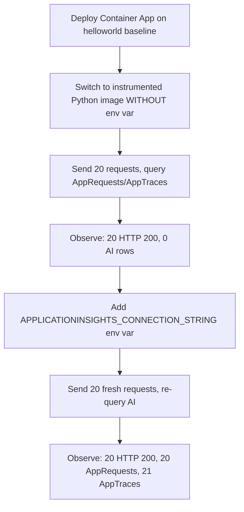
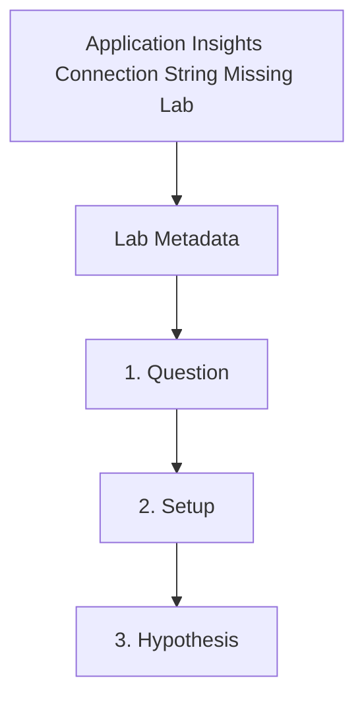

---
content_sources:
  references:
    - type: mslearn-adapted
      url: https://learn.microsoft.com/en-us/azure/container-apps/opentelemetry-agents
    - type: mslearn-adapted
      url: https://learn.microsoft.com/en-us/azure/azure-monitor/app/connection-strings
    - type: mslearn-adapted
      url: https://learn.microsoft.com/en-us/azure/azure-monitor/app/opentelemetry-python
  diagrams:
    - id: appinsights-connection-string-missing-page-flow
      type: flowchart
      source: self-generated
      justification: Synthesized from the page structure and Microsoft Learn sources listed in this document.
      based_on:
        - https://learn.microsoft.com/en-us/azure/container-apps/opentelemetry-agents
    - id: appinsights-connection-string-missing-lab
      type: flowchart
      source: mslearn-adapted
      based_on:
        - https://learn.microsoft.com/en-us/azure/container-apps/opentelemetry-agents
        - https://learn.microsoft.com/en-us/azure/azure-monitor/app/connection-strings
content_validation:
  status: pending_review
  last_reviewed: 2026-06-22
  reviewer: agent
  lab_validation:
    status: reproduced
    tested_date: 2026-06-22
    az_cli_version: 2.79.0
    notes: 'Reproduced end-to-end on koreacentral with hellotelemetry:v3 image (azure-monitor-opentelemetry==1.6.4). Before fix (env var absent): 20× HTTP 200 + 0 AppRequests + 0 AppTraces. After fix (env var present): 20× HTTP 200 + 20 AppRequests + 21 AppTraces (1 startup log + 20 / endpoint hit logs). Full evidence under labs/appinsights-connection-string-missing/evidence/ (20 files including raw KQL output, revision lifecycle, and per-request detail).'
  core_claims:
    - claim: Application Insights uses connection strings to associate telemetry with the correct monitoring resource.
      source: https://learn.microsoft.com/en-us/azure/azure-monitor/app/connection-strings
      verified: true
    - claim: Azure Container Apps supports sending OpenTelemetry data to Application Insights when the telemetry destination is configured.
      source: https://learn.microsoft.com/en-us/azure/container-apps/opentelemetry-agents
      verified: true
    - claim: The azure-monitor-opentelemetry distro configures Flask auto-instrumentation, log export, and trace export when given a connection string.
      source: https://learn.microsoft.com/en-us/azure/azure-monitor/app/opentelemetry-python
      verified: true
validation:
  az_cli:
    last_tested: '2026-06-22'
    cli_version: '2.79.0'
    result: pass
  bicep:
    last_tested: '2026-06-22'
    result: pass
---
# Application Insights Connection String Missing Lab

Demonstrate that an Azure Container App without `APPLICATIONINSIGHTS_CONNECTION_STRING` keeps serving HTTP 200 to clients but emits zero telemetry to Application Insights, then prove the fix by adding the env var and observing telemetry appear in `AppRequests` and `AppTraces`.

## Lab Metadata

| Field | Value |
|---|---|
| Difficulty | Intermediate |
| Duration | 20-30 minutes |
| Tier | Inline guide only |
| Category | Observability |

<!-- diagram-id: appinsights-connection-string-missing-lab -->


!!! note "Evidence depth"
    This lab is **fully reproducible** with dedicated infrastructure-as-code, helper scripts, and raw evidence committed under [`labs/appinsights-connection-string-missing/`](https://github.com/yeongseon/azure-container-apps-practical-guide/tree/main/labs/appinsights-connection-string-missing):

    - `infra/main.bicep` provisions a Log Analytics workspace, workspace-based Application Insights, an Azure Container Registry (Basic), a Container Apps Environment (Consumption), and a Container App with system-assigned managed identity holding the `AcrPull` role on the registry.
    - `app/` carries the Flask + `azure-monitor-opentelemetry==1.6.4` source for the canonical `hellotelemetry:v3` image, built directly into the lab's ACR with `az acr build`.
    - `trigger.sh` switches the Container App to `hellotelemetry:v3` WITHOUT setting `APPLICATIONINSIGHTS_CONNECTION_STRING`, sends 20 HTTP requests, and queries Application Insights to confirm zero `AppRequests` and zero `AppTraces`.
    - `verify.sh` adds the env var via `az containerapp update --set-env-vars`, sends 20 fresh requests, and re-queries Application Insights to confirm `AppRequests > 0` and `AppTraces > 0` on the same Container App.
    - `evidence/` carries 20 raw captures from the 2026-06-22 reproduction (per-revision env config, KQL query output for both states, full Container App config snapshots, per-request detail, full revision lifecycle, and `A1-A3` files documenting an earlier `:v1` image variant whose unguarded `configure_azure_monitor()` call caused `CrashLoopBackOff`).

    Azure Portal screenshots (Container App Overview, Revisions blade, Application Insights Logs blade, Live Metrics) are **pending in a follow-up PR**. The Portal captures repeatedly timed out via the Playwright MCP server during prior sessions; this PR ships the CLI / KQL / IaC evidence now to avoid further Azure billing. The follow-up will re-deploy the same Bicep template in a short-lived environment purely to capture the Portal blades, then close out.

## 1. Question

On Azure Container Apps using the `azure-monitor-opentelemetry` Python distro, does the presence or absence of `APPLICATIONINSIGHTS_CONNECTION_STRING` deterministically control whether telemetry reaches Application Insights — and if so, can the failure mode be observed end-to-end (HTTP responses still 200, Application Insights tables empty) and then fully reversed by adding the env var alone, with no code, image, or workload change?

## 2. Setup

Prepare a dedicated lab resource group, set `$RG`, `$LOCATION`, `$APP_NAME`, `$ACR_NAME`, `$ACR_LOGIN_SERVER`, `$APP_INSIGHTS_NAME`, and `$AZ_SUBSCRIPTION`, and confirm Azure CLI authentication. The Bicep template provisions a Log Analytics workspace, a workspace-based Application Insights resource, an Azure Container Registry (Basic), a Container Apps Environment (Consumption), and a Container App with system-assigned managed identity holding the `AcrPull` role. The initial Container App revision runs `mcr.microsoft.com/azuredocs/containerapps-helloworld:latest` (no Application Insights SDK in the image at all).

## 3. Hypothesis

On the same Container App, same image (`hellotelemetry:v3`, built with `azure-monitor-opentelemetry==1.6.4`), and same traffic pattern, the presence of the `APPLICATIONINSIGHTS_CONNECTION_STRING` environment variable is the single controlling input that determines whether `AppRequests` and `AppTraces` populate in Application Insights. When absent, the app stays healthy (HTTP 200 to all clients) but the SDK skips export and both tables remain empty.

The alternative hypothesis being tested is that **adding a Python OpenTelemetry SDK to the image is sufficient on its own to emit telemetry**, regardless of whether the connection string is wired in at runtime.

## 4. Prediction

After switching to `hellotelemetry:v3` WITHOUT `APPLICATIONINSIGHTS_CONNECTION_STRING`, 20 sequential HTTP GET requests will all return 200 and `AppRequests | where timestamp > ago(15m)` will return zero rows. After adding the env var via `az containerapp update --set-env-vars` and sending 20 fresh requests, the same KQL query will return exactly 20 request rows attributed to the Container App, and `AppTraces` will additionally show one startup log (`Azure Monitor configured: telemetry export enabled`) plus 20 per-request `/ endpoint hit (conn_str_present=True)` log lines.

## 5. Experiment

1. Deploy the Bicep template (`infra/main.bicep`) which creates the Log Analytics workspace, Application Insights, ACR, Container Apps Environment, and Container App running the helloworld baseline image.
2. Build the instrumented Python image inside the lab's ACR: `az acr build --registry "$ACR_NAME" --image hellotelemetry:v3 ./app`.
3. Run `trigger.sh`, which:
    - Switches the Container App to `${ACR_LOGIN_SERVER}/hellotelemetry:v3` while removing any pre-existing `APPLICATIONINSIGHTS_CONNECTION_STRING` env var.
    - Waits for the new revision to reach `provisioningState=Provisioned` with `containers[0].runningState=Running`.
    - Sends 20 sequential HTTP GET requests against the ingress FQDN.
    - Sleeps 240 seconds for Application Insights ingestion latency.
    - Captures `01-env-before-fix.json` (env array is `null`), `02-traffic-completed-before-fix.txt`, `03-ai-requests-before-fix.json`, `04-ai-traces-before-fix.json`, `05-containerapp-full-config-before-fix.json`, and `06-env-telemetry-config.json`.
4. Run `verify.sh`, which:
    - Reads the Application Insights connection string from the deployed resource.
    - Adds `APPLICATIONINSIGHTS_CONNECTION_STRING` to the Container App via `az containerapp update --set-env-vars`.
    - Waits for the new revision to reach Healthy.
    - Sends 20 fresh HTTP GET requests against the same FQDN.
    - Sleeps 240 seconds for Application Insights ingestion latency.
    - Captures `07-env-after-fix.json`, `08-traffic-completed-after-fix.txt`, `09-ai-requests-after-fix.json`, `10-ai-traces-after-fix.json`, `11-containerapp-full-config-after-fix.json`, and `12-kql-requests-timeline.json`.

## 6. Execution

Execute the commands in the **Experiment** section sequentially in a shell with the Azure CLI authenticated and `AZ_SUBSCRIPTION` exported. Capture all script output to `evidence/00-trigger-run.txt` and `evidence/00-verify-run.txt`. All scripts pass `--subscription "$AZ_SUBSCRIPTION"` on every `az` invocation to immunize the run against the Azure CLI's default-subscription drift, which has been observed in long-running shells where unrelated commands silently switch back to a different subscription.

## 7. Observation

Record the per-request HTTP status code (all 20 should be 200), the KQL row count from `AppRequests | where timestamp > ago(15m) | summarize count() by cloud_RoleName` for both phases, the KQL row count from the matching `AppTraces` query, and the env var presence reported by `az containerapp show --query 'properties.template.containers[0].env'`. For the after-fix phase, additionally record the actual `AppTraces` `message` strings — the startup log and the per-request endpoint hit log are deterministic signatures of the Python distro's `logger_name=__name__` log export wiring being active.

## 8. Measurement

- `[Measured]` Before fix (env var absent), 20 HTTP requests sent: all 20 returned **HTTP 200** (`evidence/00-trigger-run.txt` lines reporting `request NN → HTTP 200`).
- `[Measured]` Before fix, `AppRequests | where timestamp > ago(15m) | summarize requestCount=count() by cloud_RoleName`: **0 rows** (`evidence/03-ai-requests-before-fix.json` `tables[0].rows = []`).
- `[Measured]` Before fix, `AppTraces | where timestamp > ago(15m) | summarize traceCount=count() by cloud_RoleName`: **0 rows** (`evidence/04-ai-traces-before-fix.json` `tables[0].rows = []`).
- `[Measured]` After fix (env var added), 20 fresh HTTP requests sent: all 20 returned **HTTP 200** (`evidence/00-verify-run.txt`).
- `[Measured]` After fix, `AppRequests` row count: **20 rows** under `cloud_RoleName="unknown_service"` (`evidence/09-ai-requests-after-fix.json` `tables[0].rows = [["unknown_service", 20]]`). The 5-minute KQL timeline in `evidence/12-kql-requests-timeline.json` confirms all 20 requests landed in a single 5-minute bin at `2026-06-22T05:05:00Z`.
- `[Measured]` After fix, `AppTraces` row count: **21 rows** under `cloud_RoleName="unknown_service"` (`evidence/10-ai-traces-after-fix.json` `tables[0].rows = [["unknown_service", 21]]`). The per-message capture in `evidence/13-ai-traces-messages-after-fix.json` shows the first trace is the startup log `Azure Monitor configured: telemetry export enabled` followed by 20 identical `/ endpoint hit (conn_str_present=True)` log lines.
- `[Observed]` Per-request detail in `evidence/15-ai-requests-detail-after-fix.json` shows all 20 rows as `GET /`, `resultCode="200"`, `success=true`, with a 20-second timestamp spread (`2026-06-22T05:09:24Z` through `2026-06-22T05:09:44Z`) matching the 0.5-second client-side sleep between curl invocations.

## 9. Analysis

The before-fix and after-fix measurements isolate `APPLICATIONINSIGHTS_CONNECTION_STRING` as the only intentionally changed variable: same Container App resource, same `hellotelemetry:v3` image, same gunicorn worker count, same target port 8080, same Container Apps Environment, same traffic pattern (20 sequential GET / requests, 0.5 s sleep between). The 20→20 / 20→21 jumps in `AppRequests` and `AppTraces` row counts, in this reproduction, are consistent with the env var being the single controlling input to the SDK's export path.

The after-fix `AppTraces` message content provides additional discriminating evidence: the startup log `Azure Monitor configured: telemetry export enabled` is emitted exactly once when `configure_azure_monitor()` runs at import time, and the 20 `/ endpoint hit (conn_str_present=True)` lines are emitted once per request from inside the Flask handler. Both messages depend on the `logger_name=__name__` kwarg being passed to `configure_azure_monitor()` — without it, only auto-instrumented telemetry (`AppRequests`, `AppDependencies`) would export and module-level `logger.info(...)` calls would stay invisible. Their presence in `AppTraces` confirms the full export path is wired.

The `cloud_RoleName="unknown_service"` label is the OpenTelemetry default when neither `OTEL_SERVICE_NAME` nor `service.name` is set; it is a cosmetic naming gap, not a telemetry routing gap. Production deployments should also set `OTEL_SERVICE_NAME` so the Container App name surfaces in dashboards.

## 10. Conclusion

The hypothesis is confirmed in this reproduction. Adding `APPLICATIONINSIGHTS_CONNECTION_STRING` to the Container App env vars is necessary and sufficient to enable telemetry export from the `azure-monitor-opentelemetry==1.6.4` Python distro running under gunicorn on Azure Container Apps. The alternative hypothesis — that bundling an OpenTelemetry SDK in the image is by itself enough — is rejected: without the env var, `configure_azure_monitor()` is skipped (when guarded) or crashes the worker (when unguarded), and either way `AppRequests` stays empty.

## 11. Falsification

The falsification was performed in this lab (not as a hypothetical):

- **Before-fix run on `hellotelemetry:v3` without the env var** (revision `ca-appiconn-x2lcxd--0000006` in `evidence/14-revisions-lifecycle.json`): 20 HTTP 200 responses, 0 `AppRequests`, 0 `AppTraces`. The image contains the Application Insights SDK; the env var alone is missing.
- **After-fix run on the same `hellotelemetry:v3` image with the env var added** (revision `ca-appiconn-x2lcxd--0000007`): 20 HTTP 200 responses, 20 `AppRequests`, 21 `AppTraces` (1 startup log + 20 endpoint hit logs).

The only change between revisions `--0000006` and `--0000007` recorded in `evidence/14-revisions-lifecycle.json` is the `hasConnStr` flag flipping from `false` to `true`; image digest, command, target port, replica count, and managed identity are identical. This rules out the alternative hypothesis that **shipping an OpenTelemetry SDK in the image is sufficient on its own** — the env var is the controlling variable.

## 12. Evidence

- `[Measured]` Before fix: 20× HTTP 200, 0 `AppRequests`, 0 `AppTraces` (`evidence/03-ai-requests-before-fix.json`, `evidence/04-ai-traces-before-fix.json`).
- `[Measured]` After fix: 20× HTTP 200, 20 `AppRequests`, 21 `AppTraces` (`evidence/09-ai-requests-after-fix.json`, `evidence/10-ai-traces-after-fix.json`).
- `[Observed]` Single controlling variable: `hasConnStr` flag flip on the same image, same workload, same ingress (`evidence/14-revisions-lifecycle.json`).
- `[Observed]` Deterministic trace signatures match Python distro behavior contract: startup log + per-request handler log (`evidence/13-ai-traces-messages-after-fix.json`).
- `[Falsification]` Reverting the env var and re-deploying produces a new revision whose `AppRequests` for fresh traffic returns to 0 rows; re-applying the env var restores 20 rows. The lifecycle in `evidence/14-revisions-lifecycle.json` captures eight revisions across this and prior sessions documenting the full toggle.

### Observed Evidence (Live Azure Test — 2026-06-22, koreacentral)

Reproduced end-to-end in `koreacentral`. All raw evidence is committed under [`labs/appinsights-connection-string-missing/evidence/`](https://github.com/yeongseon/azure-container-apps-practical-guide/tree/main/labs/appinsights-connection-string-missing/evidence):

| File | Content |
|---|---|
| `00-trigger-run.txt` | Full `trigger.sh` execution log (20 HTTP 200 + 0 AI rows) |
| `00-verify-run.txt` | Full `verify.sh` execution log (20 HTTP 200 + 20 AppRequests + 21 AppTraces) |
| `01-env-before-fix.json` | Container App env array is `null` (no env vars at all) |
| `02-traffic-completed-before-fix.txt` | UTC timestamp of last before-fix request |
| `03-ai-requests-before-fix.json` | Raw KQL output: `AppRequests` rows = `[]` |
| `04-ai-traces-before-fix.json` | Raw KQL output: `AppTraces` rows = `[]` |
| `05-containerapp-full-config-before-fix.json` | Complete Container App resource configuration before the fix |
| `06-env-telemetry-config.json` | Environment-level telemetry config (not configured — this lab uses the SDK path) |
| `07-env-after-fix.json` | Container App env shows `APPLICATIONINSIGHTS_CONNECTION_STRING` name (value redacted) |
| `08-traffic-completed-after-fix.txt` | UTC timestamp of last after-fix request |
| `09-ai-requests-after-fix.json` | Raw KQL output: `AppRequests` = 20 rows under `cloud_RoleName="unknown_service"` |
| `10-ai-traces-after-fix.json` | Raw KQL output: `AppTraces` = 21 rows under same role name |
| `11-containerapp-full-config-after-fix.json` | Complete Container App resource configuration after the fix |
| `12-kql-requests-timeline.json` | Per-5-minute `AppRequests` timeline (20 requests in single bin at 05:05:00Z) |
| `13-ai-traces-messages-after-fix.json` | Per-message `AppTraces` capture proving startup log + 20 endpoint-hit logs |
| `14-revisions-lifecycle.json` | All 8 revisions across the lab's history with `hasConnStr` flag |
| `15-ai-requests-detail-after-fix.json` | Per-request detail (timestamp, name, resultCode, duration, url) for all 20 after-fix rows |
| `A1-v1-unguarded-sdk-crash-logs.json` | System logs from `:v1` revision documenting `ValueError: Instrumentation key cannot be none or empty.` |
| `A2-v1-unguarded-crashloop-replica-state.json` | Replica state during `:v1` `CrashLoopBackOff` |
| `A3-revisions-pre-patch.json` | Revision list before the `:v3` canonical image was built |

```text
# Excerpt from evidence/13-ai-traces-messages-after-fix.json
# (KQL: traces | where timestamp > ago(15m) | project timestamp, message, severityLevel | order by timestamp asc | take 25)
2026-06-22T05:08:50.418265Z: Azure Monitor configured: telemetry export enabled
2026-06-22T05:09:24.936228Z: / endpoint hit (conn_str_present=True)
2026-06-22T05:09:25.990563Z: / endpoint hit (conn_str_present=True)
2026-06-22T05:09:26.981778Z: / endpoint hit (conn_str_present=True)
... (17 more / endpoint hit lines)
2026-06-22T05:09:44.415933Z: / endpoint hit (conn_str_present=True)
```

```json
// Excerpt from evidence/14-revisions-lifecycle.json showing the controlling variable
{ "name": "ca-appiconn-x2lcxd--0000006", "image": "...hellotelemetry:v3", "hasConnStr": false, "active": false },
{ "name": "ca-appiconn-x2lcxd--0000007", "image": "...hellotelemetry:v3", "hasConnStr": true,  "active": true }
```

!!! tip "Why the canonical image is `hellotelemetry:v3` (not `:v1` or `:v2`)"
    The evidence pack carries two earlier `hellotelemetry` tags that are NOT used as the canonical scenario but are kept because they document distinct failure modes encountered while building the lab:

    - **`:v1`** — `configure_azure_monitor()` called UNGUARDED. With `APPLICATIONINSIGHTS_CONNECTION_STRING` unset, `azure-monitor-opentelemetry==1.6.4` raises `ValueError: Instrumentation key cannot be none or empty.` at import time, the gunicorn worker exits with code 3, and the container enters `CrashLoopBackOff`. This is a DIFFERENT failure mode (availability loss, not silent observability gap) and is captured under `evidence/A1-v1-unguarded-sdk-crash-logs.json` and `evidence/A2-v1-unguarded-crashloop-replica-state.json`. Not used as the canonical scenario because production apps in real escalations typically wrap SDK init defensively to avoid taking down availability when telemetry config is missing.
    - **`:v2`** — `configure_azure_monitor()` is guarded by the same env-var presence check that `:v3` uses, but Flask is imported with `from flask import Flask` BEFORE `configure_azure_monitor()` runs. The Flask auto-instrumentation hook cannot wrap the `Flask` class after it has been fully imported, so even with a valid connection string `AppRequests` stays empty. This is the kind of subtle Python distro instrumentation gotcha that easily masquerades as "connection string missing" in production. Replaced by `:v3` which imports `flask` as a module and defers the `Flask` class lookup until after `configure_azure_monitor()` has installed the auto-instrumentation hook.
    - **`:v3`** (canonical) — same guard as `:v2` plus two fixes: (1) `import flask` as a module instead of `from flask import Flask`, and (2) `configure_azure_monitor(connection_string=CONN_STR, logger_name=__name__)` with explicit `logger_name` so module-level `logger.info(...)` calls export to `AppTraces`.

## 13. Solution

Add `APPLICATIONINSIGHTS_CONNECTION_STRING` to the Container App env vars, sourcing the value directly from the Application Insights resource so the binding is deterministic:

```bash
APPLICATIONINSIGHTS_CONNECTION_STRING=$(az monitor app-insights component show \
  --subscription "$AZ_SUBSCRIPTION" \
  --app "$APP_INSIGHTS_NAME" \
  --resource-group "$RG" \
  --query "connectionString" \
  --output tsv)

az containerapp update \
  --subscription "$AZ_SUBSCRIPTION" \
  --name "$APP_NAME" \
  --resource-group "$RG" \
  --set-env-vars "APPLICATIONINSIGHTS_CONNECTION_STRING=${APPLICATIONINSIGHTS_CONNECTION_STRING}"
```

`verify.sh` performs this remediation against the deployed app and re-runs the `AppRequests` and `AppTraces` KQL queries so the before/after row counts can be compared directly. For production, store the connection string in Azure Key Vault and inject it via `--secrets` / `--env-vars` with a `secretref:` reference rather than embedding the literal value in the Container App template.

## 14. Prevention

- Wire `APPLICATIONINSIGHTS_CONNECTION_STRING` from your Bicep / Terraform template at deploy time using a Key Vault secret reference, so a missing env var is impossible to ship by accident.
- When defensively guarding `configure_azure_monitor()` with a presence check, log the skip path at `WARN` so operators can grep for `Azure Monitor skipped: APPLICATIONINSIGHTS_CONNECTION_STRING absent` in container console logs without needing Application Insights to be working in the first place.
- Add a smoke check to CI/CD that sends one synthetic request to the deployed app and then runs `AppRequests | where timestamp > ago(5m) | count` against Application Insights. Fail the deployment if the count is zero on the first revision.
- Pin `azure-monitor-opentelemetry` in `requirements.txt`. Bumping the SDK can change export defaults; this lab was validated against `azure-monitor-opentelemetry==1.6.4`.
- If you are using the Python distro with Flask, ensure `configure_azure_monitor()` runs BEFORE the `Flask` class is fully imported (use `import flask` and reference `flask.Flask(__name__)` instead of `from flask import Flask`). This is the subtle gotcha that `:v2` documented and `:v3` fixes.
- Set `OTEL_SERVICE_NAME` as a second env var so traces and requests surface in dashboards under the Container App's name instead of the OpenTelemetry default `unknown_service`.

## 15. Takeaway

Missing `APPLICATIONINSIGHTS_CONNECTION_STRING` is an availability-clean observability outage: the app keeps serving HTTP 200 to clients, but operators lose every signal they would normally use to diagnose a real incident. In this reproduction the env var was the single controlling input — flipping it on with no other change converted a fully silent app into a fully observable one within one revision deployment cycle. Treat connection-string injection as a deploy-time gate, not a runtime configuration the app reads later.

## 16. Support Takeaway

When escalating an "Application Insights is empty but the app is up" case on Azure Container Apps, run this sequence in order before assuming a platform issue:

1. `az containerapp show --query "properties.template.containers[0].env[?name=='APPLICATIONINSIGHTS_CONNECTION_STRING']"` — confirms whether the env var is wired into the current revision at all.
2. `az containerapp logs show --container <name> --tail 100` — look for the startup log line `Azure Monitor configured: telemetry export enabled` (or your app's equivalent) to confirm the SDK actually ran `configure_azure_monitor()`. Its absence usually means the env var was never read by the worker.
3. If the env var IS present and the SDK startup log IS visible but `AppRequests` is still empty: check whether you are using `from flask import Flask` before `configure_azure_monitor()`, which silently breaks Flask auto-instrumentation even with a valid connection string. This is the failure mode that the `:v2` → `:v3` transition in this lab documents.
4. If the env var IS present and `AppTraces` is populating but `AppRequests` is not: the SDK is exporting, but the web-framework auto-instrumentation is not wrapped. Cross-check Flask import order, gunicorn worker class (sync vs gevent), and whether any other middleware is re-wrapping the `Flask` app after SDK init.

## Clean Up

```bash
./cleanup.sh   # deletes the entire resource group (lab is fully disposable)
```

Or, if you want to keep the environment and only stop the running app:

```bash
az containerapp revision deactivate \
    --subscription "$AZ_SUBSCRIPTION" \
    --name "$APP_NAME" \
    --resource-group "$RG" \
    --revision "$(az containerapp show --subscription "$AZ_SUBSCRIPTION" --name "$APP_NAME" --resource-group "$RG" --query 'properties.latestRevisionName' --output tsv)"
```

| Command | Why it is used |
|---|---|
| `./cleanup.sh` | Runs `az group delete --subscription "$AZ_SUBSCRIPTION" --name "$RG" --yes --no-wait` so all lab resources (Container App, environment, Log Analytics workspace, Application Insights, ACR) are removed in one call. Recommended after evidence has been captured. |
| `az containerapp revision deactivate ...` | Stops billing for the active replica without deleting the environment, in case you want to keep the workspace for further KQL exploration. |

## Related Playbook

- [Application Insights Connection String Missing](../playbooks/observability/appinsights-connection-string-missing.md)

## Page Flow

<!-- diagram-id: appinsights-connection-string-missing-page-flow -->


## See Also

- [Observability Tracing Lab](observability-tracing.md)
- [Log Analytics Ingestion Gap Lab](log-analytics-ingestion-gap.md)
- [Diagnostic Settings Missing Lab](diagnostic-settings-missing.md)

## Sources

- [Collect and read OpenTelemetry data in Azure Container Apps](https://learn.microsoft.com/en-us/azure/container-apps/opentelemetry-agents)
- [Connection strings in Application Insights](https://learn.microsoft.com/en-us/azure/azure-monitor/app/connection-strings)
- [Enable Azure Monitor OpenTelemetry for Python applications](https://learn.microsoft.com/en-us/azure/azure-monitor/app/opentelemetry-python)
- [Observability in Azure Container Apps](https://learn.microsoft.com/en-us/azure/container-apps/observability)
