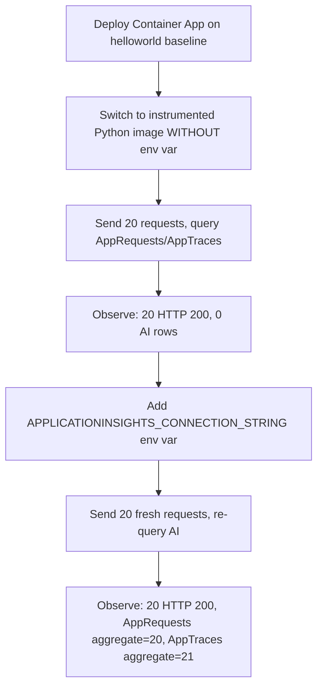

---
content_sources:
  references:
    - type: mslearn-adapted
      url: https://learn.microsoft.com/en-us/azure/container-apps/opentelemetry-agents
    - type: mslearn-adapted
      url: https://learn.microsoft.com/en-us/azure/azure-monitor/app/connection-strings
    - type: mslearn-adapted
      url: https://learn.microsoft.com/en-us/azure/azure-monitor/app/opentelemetry-python
  diagrams:
    - id: appinsights-connection-string-missing-lab
      type: flowchart
      source: mslearn-adapted
      based_on:
        - https://learn.microsoft.com/en-us/azure/container-apps/opentelemetry-agents
        - https://learn.microsoft.com/en-us/azure/azure-monitor/app/connection-strings
validation:
  az_cli:
    last_tested: '2026-06-22'
    cli_version: '2.79.0'
    result: pass
  bicep:
    last_tested: '2026-06-22'
    result: pass
---
# Application Insights Connection String Missing Lab

Demonstrate that an Azure Container App without `APPLICATIONINSIGHTS_CONNECTION_STRING` keeps serving HTTP 200 to clients but emits zero telemetry to Application Insights, then prove the fix by adding the env var and observing telemetry appear in `AppRequests` and `AppTraces`.

## Lab Metadata

| Field | Value |
|---|---|
| Difficulty | Intermediate |
| Duration | 20-30 minutes |
| Tier | Inline guide only |
| Category | Observability |

<!-- diagram-id: appinsights-connection-string-missing-lab -->


!!! note "Evidence depth"
    This lab is **fully reproducible** with dedicated infrastructure-as-code, helper scripts, and raw evidence committed under [`labs/appinsights-connection-string-missing/`](https://github.com/yeongseon/azure-container-apps-practical-guide/tree/main/labs/appinsights-connection-string-missing):

    - `infra/main.bicep` provisions a Log Analytics workspace, workspace-based Application Insights, an Azure Container Registry (Basic), a Container Apps Environment (Consumption), and a Container App with system-assigned managed identity holding the `AcrPull` role on the registry.
    - `app/` carries the Flask + `azure-monitor-opentelemetry==1.6.4` source for the canonical `hellotelemetry:v3` image, built directly into the lab's ACR with `az acr build`.
    - `trigger.sh` switches the Container App to `hellotelemetry:v3` WITHOUT setting `APPLICATIONINSIGHTS_CONNECTION_STRING`, sends 20 HTTP requests, and queries Application Insights to confirm zero `AppRequests` and zero `AppTraces`.
    - `verify.sh` adds the env var via `az containerapp update --set-env-vars`, sends 20 fresh requests, and re-queries Application Insights to confirm `AppRequests > 0` and `AppTraces > 0` on the same Container App.
    - `evidence/` carries 20 raw captures from the 2026-06-22 reproduction (per-revision env config, KQL query output for both states, full Container App config snapshots, per-request detail, full revision lifecycle, and `A1-A3` files documenting an earlier `:v1` image variant whose unguarded `configure_azure_monitor()` call caused `CrashLoopBackOff`).

    Azure Portal screenshots (Container App Overview, Revisions blade, Application Insights Logs blade, Live Metrics) are **pending in a follow-up PR**. The Portal captures repeatedly timed out via the Playwright MCP server during prior sessions; this PR ships the CLI / KQL / IaC evidence now to avoid further Azure billing. The follow-up will re-deploy the same Bicep template in a short-lived environment purely to capture the Portal blades, then close out.

## 1) Background

On Azure Container Apps using the `azure-monitor-opentelemetry` Python distro, does the presence or absence of `APPLICATIONINSIGHTS_CONNECTION_STRING` deterministically control whether telemetry reaches Application Insights — and if so, can the failure mode be observed end-to-end (HTTP responses still 200, Application Insights tables empty) and then fully reversed by adding the env var alone, with no code, image, or workload change?

The lab uses a dedicated resource group and Bicep template (`infra/main.bicep`) that provisions a Log Analytics workspace, a workspace-based Application Insights resource, an Azure Container Registry (Basic), a Container Apps Environment (Consumption), and a Container App with system-assigned managed identity holding the `AcrPull` role. The initial Container App revision runs `mcr.microsoft.com/azuredocs/containerapps-helloworld:latest` (no Application Insights SDK in the image at all) so the lab's `trigger.sh` and `verify.sh` scripts can deterministically switch the image to `hellotelemetry:v3` (built into the lab's ACR with `az acr build` from `app/`) and toggle the env var on and off.

Set the base inputs before running the runbook. The remaining variables (`APP_NAME`, `ACR_NAME`, `ACR_LOGIN_SERVER`, `APP_INSIGHTS_NAME`) are derived from Bicep outputs in the next section because `infra/main.bicep` appends a deterministic but resource-group-scoped suffix to every resource name (see [`infra/main.bicep:12-17`](https://github.com/yeongseon/azure-container-apps-practical-guide/blob/main/labs/appinsights-connection-string-missing/infra/main.bicep#L12)):

```bash
export AZ_SUBSCRIPTION="<subscription-id>"
export RG="rg-aca-lab-aiconn"
export LOCATION="koreacentral"
```

## 2) Hypothesis

On the same Container App, same image (`hellotelemetry:v3`, built with `azure-monitor-opentelemetry==1.6.4`), and same traffic pattern, the presence of the `APPLICATIONINSIGHTS_CONNECTION_STRING` environment variable is the single controlling input that determines whether `AppRequests` and `AppTraces` populate in Application Insights. When absent, the app stays healthy (HTTP 200 to all clients) but the SDK skips export and both tables remain empty.

The alternative hypothesis being tested is that **adding a Python OpenTelemetry SDK to the image is sufficient on its own to emit telemetry**, regardless of whether the connection string is wired in at runtime.

**Prediction (IF / THEN):** IF the env var is the single controlling input, THEN after switching to `hellotelemetry:v3` WITHOUT `APPLICATIONINSIGHTS_CONNECTION_STRING`, 20 sequential HTTP GET requests will all return 200 and the KQL summarize query `AppRequests | where timestamp > ago(15m) | summarize requestCount=count() by cloud_RoleName` will return zero rows. After adding the env var via `az containerapp update --set-env-vars` and sending 20 fresh requests, the same KQL query will return a single aggregate row with `requestCount=20` under `cloud_RoleName="unknown_service"`, and `AppTraces | where timestamp > ago(15m) | summarize traceCount=count() by cloud_RoleName` will return a single aggregate row with `traceCount=21` (1 startup log + 20 per-request endpoint hit logs).

## 3) Runbook

### Deploy infrastructure

All `az` and `./trigger.sh` / `./verify.sh` invocations below assume the working directory is the lab folder. Switch into it from the repository root before running anything:

```bash
cd labs/appinsights-connection-string-missing/
```

1. Create the resource group and deploy the Bicep template. The `--parameters baseName="appiconn"` value is required (the Bicep template declares `param baseName string` with no default, see [`infra/main.bicep:4`](https://github.com/yeongseon/azure-container-apps-practical-guide/blob/main/labs/appinsights-connection-string-missing/infra/main.bicep#L4)). `--name main` gives the deployment a stable, queryable name so the next step can read its outputs:

    ```bash
    az group create \
        --subscription "$AZ_SUBSCRIPTION" \
        --name "$RG" \
        --location "$LOCATION"

    az deployment group create \
        --subscription "$AZ_SUBSCRIPTION" \
        --resource-group "$RG" \
        --name main \
        --template-file infra/main.bicep \
        --parameters baseName="appiconn"
    ```

    | Command | Why it is used |
    |---|---|
    | `az group create` | Creates the lab resource group at `$LOCATION` (koreacentral) before any child resources are deployed. |
    | `az deployment group create` | Deploys `infra/main.bicep` with the required `baseName="appiconn"` parameter. `--name main` gives the deployment a stable, queryable name so step 2 can read its outputs. |

    This creates the Log Analytics workspace, Application Insights, ACR, Container Apps Environment, and a Container App running the helloworld baseline image.

2. Read the deployment outputs so the remaining commands and scripts know which resources to act on. `IMAGE_TAG` is required by `trigger.sh` ([`trigger.sh:8`](https://github.com/yeongseon/azure-container-apps-practical-guide/blob/main/labs/appinsights-connection-string-missing/trigger.sh#L8)); `verify.sh` does not read `IMAGE_TAG` because it changes env vars on the already-deployed image rather than swapping the image:

    ```bash
    export APP_NAME=$(az deployment group show \
        --subscription "$AZ_SUBSCRIPTION" \
        --resource-group "$RG" \
        --name main \
        --query "properties.outputs.containerAppName.value" \
        --output tsv)

    export ACR_NAME=$(az deployment group show \
        --subscription "$AZ_SUBSCRIPTION" \
        --resource-group "$RG" \
        --name main \
        --query "properties.outputs.acrName.value" \
        --output tsv)

    export ACR_LOGIN_SERVER=$(az deployment group show \
        --subscription "$AZ_SUBSCRIPTION" \
        --resource-group "$RG" \
        --name main \
        --query "properties.outputs.acrLoginServer.value" \
        --output tsv)

    export APP_INSIGHTS_NAME=$(az deployment group show \
        --subscription "$AZ_SUBSCRIPTION" \
        --resource-group "$RG" \
        --name main \
        --query "properties.outputs.appInsightsName.value" \
        --output tsv)

    export IMAGE_TAG="hellotelemetry:v3"
    ```

3. Build the instrumented Python image inside the lab's ACR:

    ```bash
    az acr build \
        --subscription "$AZ_SUBSCRIPTION" \
        --registry "$ACR_NAME" \
        --image "$IMAGE_TAG" \
        ./app
    ```

    | Command | Why it is used |
    |---|---|
    | `az acr build` | Builds the instrumented Python image (`hellotelemetry:v3`) inside the lab's ACR. No local Docker daemon required. |

### Trigger the failure (run trigger.sh)

Run `trigger.sh`, which:

- Switches the Container App to `${ACR_LOGIN_SERVER}/hellotelemetry:v3` while removing any pre-existing `APPLICATIONINSIGHTS_CONNECTION_STRING` env var.
- Waits for the new revision to reach `provisioningState=Provisioned` with `containers[0].runningState=Running`.
- Sends 20 sequential HTTP GET requests against the ingress FQDN.
- Sleeps 240 seconds for Application Insights ingestion latency.
- Captures `01-env-before-fix.json` (env array is `null`), `02-traffic-completed-before-fix.txt`, `03-ai-requests-before-fix.json`, `04-ai-traces-before-fix.json`, `05-containerapp-full-config-before-fix.json`, and `06-env-telemetry-config.json`.

All scripts pass `--subscription "$AZ_SUBSCRIPTION"` on every `az` invocation to immunize the run against the Azure CLI's default-subscription drift, which has been observed in long-running shells where unrelated commands silently switch back to a different subscription.

### Apply the fix (run verify.sh)

Run `verify.sh`, which:

- Reads the Application Insights connection string from the deployed resource.
- Adds `APPLICATIONINSIGHTS_CONNECTION_STRING` to the Container App via `az containerapp update --set-env-vars`.
- Waits for the new revision to reach Healthy.
- Sends 20 fresh HTTP GET requests against the same FQDN.
- Sleeps 240 seconds for Application Insights ingestion latency.
- Captures `07-env-after-fix.json`, `08-traffic-completed-after-fix.txt`, `09-ai-requests-after-fix.json`, `10-ai-traces-after-fix.json`, `11-containerapp-full-config-after-fix.json`, `12-kql-requests-timeline.json`, `13-ai-traces-messages-after-fix.json`, `14-revisions-lifecycle.json`, and `15-ai-requests-detail-after-fix.json`.

The commands that `verify.sh` runs to emit files 13/14/15 (so readers can regenerate the data without re-running the full script). Files 13 and 15 are KQL queries against Application Insights; file 14 is an `az containerapp revision list` call post-processed with `python3` to derive the `hasConnStr` flag from each revision's env array:

```bash
# evidence/13-ai-traces-messages-after-fix.json
az monitor app-insights query \
    --subscription "$AZ_SUBSCRIPTION" \
    --app "$APP_INSIGHTS_NAME" \
    --resource-group "$RG" \
    --analytics-query "traces | where timestamp > ago(15m) | project timestamp, message, severityLevel | order by timestamp asc | take 25" \
    --output json

# evidence/15-ai-requests-detail-after-fix.json
az monitor app-insights query \
    --subscription "$AZ_SUBSCRIPTION" \
    --app "$APP_INSIGHTS_NAME" \
    --resource-group "$RG" \
    --analytics-query 'requests | where timestamp > ago(15m) | project timestamp, name, resultCode, success, duration, url | order by timestamp asc' \
    --output json

# evidence/14-revisions-lifecycle.json (az + python3 post-processing pipeline)
az containerapp revision list \
    --subscription "$AZ_SUBSCRIPTION" \
    --name "$APP_NAME" \
    --resource-group "$RG" \
    --all \
    --output json | python3 -c "
import json, sys
revs = json.load(sys.stdin)
out = []
for r in revs:
    env = (r.get('properties', {}).get('template', {}).get('containers', [{}])[0].get('env') or [])
    has = any(e.get('name') == 'APPLICATIONINSIGHTS_CONNECTION_STRING' for e in env)
    out.append({
        'active': r.get('properties', {}).get('active'),
        'createdTime': r.get('properties', {}).get('createdTime'),
        'hasConnStr': has,
        'image': r.get('properties', {}).get('template', {}).get('containers', [{}])[0].get('image'),
        'name': r.get('name'),
    })
out.sort(key=lambda x: x['createdTime'] or '')
print(json.dumps(out, indent=2))
"
```

| Command | Why it is used |
|---|---|
| `az monitor app-insights query` (traces) | Emits `evidence/13-ai-traces-messages-after-fix.json`: projects `timestamp, message, severityLevel` from the last 15 minutes of `traces` and orders by time. |
| `az monitor app-insights query` (requests) | Emits `evidence/15-ai-requests-detail-after-fix.json`: per-row request detail with `name, resultCode, success, duration, url`. |
| `az containerapp revision list` + `python3` | Emits `evidence/14-revisions-lifecycle.json`: decorates each revision with a `hasConnStr` flag computed from the env array, sorted by `createdTime`. |

### Apply the fix manually (the canonical remediation command)

Add `APPLICATIONINSIGHTS_CONNECTION_STRING` to the Container App env vars, sourcing the value directly from the Application Insights resource so the binding is deterministic:

```bash
APPLICATIONINSIGHTS_CONNECTION_STRING=$(az monitor app-insights component show \
    --subscription "$AZ_SUBSCRIPTION" \
    --app "$APP_INSIGHTS_NAME" \
    --resource-group "$RG" \
    --query "connectionString" \
    --output tsv)

az containerapp update \
    --subscription "$AZ_SUBSCRIPTION" \
    --name "$APP_NAME" \
    --resource-group "$RG" \
    --set-env-vars "APPLICATIONINSIGHTS_CONNECTION_STRING=${APPLICATIONINSIGHTS_CONNECTION_STRING}"
```

| Command | Why it is used |
|---|---|
| `az monitor app-insights component show` | Reads the connection string directly from the deployed Application Insights resource so the binding is deterministic and never depends on a hardcoded literal. |
| `az containerapp update --set-env-vars` | Adds `APPLICATIONINSIGHTS_CONNECTION_STRING` to the Container App, triggering creation of a new Healthy revision that emits telemetry. |

For production, store the connection string in Azure Key Vault and inject it via `--secrets` / `--env-vars` with a `secretref:` reference rather than embedding the literal value in the Container App template.

### Prevention guidance

- Wire `APPLICATIONINSIGHTS_CONNECTION_STRING` from your Bicep / Terraform template at deploy time using a Key Vault secret reference, so a missing env var is impossible to ship by accident.
- When defensively guarding `configure_azure_monitor()` with a presence check, log the skip path at `WARN` so operators can grep for `Azure Monitor skipped: APPLICATIONINSIGHTS_CONNECTION_STRING absent` in container console logs without needing Application Insights to be working in the first place.
- Add a smoke check to CI/CD that sends one synthetic request to the deployed app and then runs `AppRequests | where timestamp > ago(5m) | count` against Application Insights. Fail the deployment if the count is zero on the first revision.
- Pin `azure-monitor-opentelemetry` in `requirements.txt`. Bumping the SDK can change export defaults; this lab was validated against `azure-monitor-opentelemetry==1.6.4`.
- If you are using the Python distro with Flask, ensure `configure_azure_monitor()` runs BEFORE the `Flask` class is fully imported (use `import flask` and reference `flask.Flask(__name__)` instead of `from flask import Flask`). This is the subtle gotcha that `:v3` defends against; the import-order failure mode is described from lab-development experience (no per-revision `AppRequests`/`AppTraces` evidence file is committed for the `:v2` source variant).
- Set `OTEL_SERVICE_NAME` as a second env var so traces and requests surface in dashboards under the Container App's name instead of the OpenTelemetry default `unknown_service`.

## 4) Experiment Log

### Before-fix evidence (env var absent)

- `[Measured]` 20 HTTP requests sent: all 20 returned **HTTP 200** (`evidence/00-trigger-run.txt` lines reporting `request NN → HTTP 200`).
- `[Measured]` `AppRequests | where timestamp > ago(15m) | summarize requestCount=count() by cloud_RoleName` returned **zero rows** (`evidence/03-ai-requests-before-fix.json` `tables[0].rows = []`).
- `[Measured]` `AppTraces | where timestamp > ago(15m) | summarize traceCount=count() by cloud_RoleName` returned **zero rows** (`evidence/04-ai-traces-before-fix.json` `tables[0].rows = []`).
- `[Observed]` Container App env array on revision `ca-appiconn-x2lcxd--0000006` is `null` — no env vars at all (`evidence/01-env-before-fix.json`).

### Post-fix evidence (env var present)

- `[Measured]` 20 fresh HTTP requests sent: all 20 returned **HTTP 200** (`evidence/00-verify-run.txt`).
- `[Measured]` `AppRequests | where timestamp > ago(15m) | summarize requestCount=count() by cloud_RoleName` returned **one aggregate row** with `requestCount=20` under `cloud_RoleName="unknown_service"` (`evidence/09-ai-requests-after-fix.json` `tables[0].rows = [["unknown_service", 20]]`). The 5-minute KQL timeline in `evidence/12-kql-requests-timeline.json` confirms all 20 requests landed in a single 5-minute bin at `2026-06-22T05:05:00Z`.
- `[Measured]` `AppTraces | where timestamp > ago(15m) | summarize traceCount=count() by cloud_RoleName` returned **one aggregate row** with `traceCount=21` under `cloud_RoleName="unknown_service"` (`evidence/10-ai-traces-after-fix.json` `tables[0].rows = [["unknown_service", 21]]`). The per-message capture in `evidence/13-ai-traces-messages-after-fix.json` shows the first trace is the startup log `Azure Monitor configured: telemetry export enabled` followed by 20 identical `/ endpoint hit (conn_str_present=True)` log lines.
- `[Observed]` Per-request detail in `evidence/15-ai-requests-detail-after-fix.json` shows all 20 rows as `GET /`, `resultCode="200"`, `success=true`, with a 20-second timestamp spread (`2026-06-22T05:09:24Z` through `2026-06-22T05:09:44Z`) matching the 0.5-second client-side sleep between curl invocations.

### Analysis

The before-fix and after-fix measurements isolate `APPLICATIONINSIGHTS_CONNECTION_STRING` as the only intentionally changed variable: same Container App resource, same `hellotelemetry:v3` image tag, same gunicorn worker count, same target port 8080, same Container Apps Environment, same traffic pattern (20 sequential GET / requests, 0.5 s sleep between). The `0→20` jump in `AppRequests` aggregate `requestCount` and the `0→21` jump in `AppTraces` aggregate `traceCount`, in this reproduction, are consistent with the env var being the single controlling input to the SDK's export path.

The after-fix `AppTraces` message content provides additional discriminating evidence: the startup log `Azure Monitor configured: telemetry export enabled` is emitted exactly once when `configure_azure_monitor()` runs at import time, and the 20 `/ endpoint hit (conn_str_present=True)` lines are emitted once per request from inside the Flask handler. Both messages depend on the `logger_name=__name__` kwarg being passed to `configure_azure_monitor()` — without it, only auto-instrumented telemetry (`AppRequests`, `AppDependencies`) would export and module-level `logger.info(...)` calls would stay invisible. Their presence in `AppTraces` confirms the full export path is wired.

The `cloud_RoleName="unknown_service"` label is the OpenTelemetry default when neither `OTEL_SERVICE_NAME` nor `service.name` is set; it is a cosmetic naming gap, not a telemetry routing gap. Production deployments should also set `OTEL_SERVICE_NAME` so the Container App name surfaces in dashboards.

### Conclusion

The hypothesis is confirmed in this reproduction. Adding `APPLICATIONINSIGHTS_CONNECTION_STRING` to the Container App env vars is necessary and sufficient to enable telemetry export from the `azure-monitor-opentelemetry==1.6.4` Python distro running under gunicorn on Azure Container Apps. The alternative hypothesis — that bundling an OpenTelemetry SDK in the image is by itself enough — is rejected: without the env var, `configure_azure_monitor()` is skipped (when guarded) or crashes the worker (when unguarded), and either way `AppRequests` stays empty.

### Falsification

The alternative hypothesis (SDK in image is sufficient on its own) is falsified by the directly evidenced `:v3` pair:

- `[Observed]` `evidence/14-revisions-lifecycle.json` records revision `ca-appiconn-x2lcxd--0000006` as the before-fix run with `image=acrappiconnx2lcxd.azurecr.io/hellotelemetry:v3` and `hasConnStr=false`; aggregate counts in `evidence/03-ai-requests-before-fix.json` and `evidence/04-ai-traces-before-fix.json` are both zero rows.
- `[Observed]` The same file records revision `ca-appiconn-x2lcxd--0000007` as the after-fix run with `image=acrappiconnx2lcxd.azurecr.io/hellotelemetry:v3` and `hasConnStr=true`; aggregate counts in `evidence/09-ai-requests-after-fix.json` and `evidence/10-ai-traces-after-fix.json` populate to `requestCount=20` and `traceCount=21` respectively.
- `[Observed]` The before/after full Container App configs in `evidence/05-containerapp-full-config-before-fix.json` and `evidence/11-containerapp-full-config-after-fix.json` differ in exactly one container-level field: the before snapshot's `properties.template.containers[0]` object contains only the keys `image`, `imageType`, `name`, `resources` (no `env` key), while the after snapshot's same object adds an `env` array whose only element is `{name: "APPLICATIONINSIGHTS_CONNECTION_STRING", value: "InstrumentationKey=..."}`. The fields that are present in both snapshots are byte-identical across them: `image` (`acrappiconnx2lcxd.azurecr.io/hellotelemetry:v3`), `imageType` (`ContainerImage`), container `name` (`app`), `resources` (`cpu=0.5, memory=1Gi, ephemeralStorage=2Gi`), `properties.template.scale` (`minReplicas=1, maxReplicas=1, cooldownPeriod=300, pollingInterval=30`), `properties.configuration.ingress.targetPort` (`8080`), and `identity.type` (`SystemAssigned`).

This rules out "the SDK shipping in the image is sufficient" as the controlling variable — the SDK is identically present in both runs and the only thing that differs is the env var.

### Operator takeaway

Missing `APPLICATIONINSIGHTS_CONNECTION_STRING` is an availability-clean observability outage: the app keeps serving HTTP 200 to clients, but operators lose every signal they would normally use to diagnose a real incident. In this reproduction the env var was the single controlling input — flipping it on with no other change converted a fully silent app into a fully observable one within one revision deployment cycle. Treat connection-string injection as a deploy-time gate, not a runtime configuration the app reads later.

### Support takeaway

When escalating an "Application Insights is empty but the app is up" case on Azure Container Apps, run this sequence in order before assuming a platform issue:

1. Confirm whether the env var is wired into the current revision at all:

    ```bash
    az containerapp show \
        --subscription "$AZ_SUBSCRIPTION" \
        --name "$APP_NAME" \
        --resource-group "$RG" \
        --query "properties.template.containers[0].env[?name=='APPLICATIONINSIGHTS_CONNECTION_STRING']"
    ```

2. Look for the startup log line `Azure Monitor configured: telemetry export enabled` (or your app's equivalent) to confirm the SDK actually ran `configure_azure_monitor()`. Its absence usually means the env var was never read by the worker:

    ```bash
    az containerapp logs show \
        --subscription "$AZ_SUBSCRIPTION" \
        --name "$APP_NAME" \
        --resource-group "$RG" \
        --container app \
        --tail 100
    ```

3. If the env var IS present and the SDK startup log IS visible but `AppRequests` is still empty: check whether you are using `from flask import Flask` before `configure_azure_monitor()`, which in this lab's development experience silently broke Flask auto-instrumentation even with a valid connection string. The `:v2` source variant is documented in this lab only as a lab-development observation — the `:v2` source file was not committed to the repo, and no per-revision `AppRequests`/`AppTraces` capture file is committed for it (the canonical falsification pair in this lab is the `:v3` before/after run, not a `:v2`/`:v3` comparison).
4. If the env var IS present and `AppTraces` is populating but `AppRequests` is not: the SDK is exporting, but the web-framework auto-instrumentation is not wrapped. Cross-check Flask import order, gunicorn worker class (sync vs gevent), and whether any other middleware is re-wrapping the `Flask` app after SDK init.

## 4b) Phase B Falsification Gates

The 2026-06-25 evidence-pack overlay adds a Phase B verifier under `labs/appinsights-connection-string-missing/`. Unlike the live-Azure Phase A workflow (`trigger.sh` + `fix-and-capture.sh`), the new `labs/appinsights-connection-string-missing/verify.sh` is a pure file processor: it reads only the committed canonical cohort under `labs/appinsights-connection-string-missing/evidence/` (20 canonical files — 2 script logs + 6 before-fix captures + 5 after-fix captures + 4 KQL captures + 3 image-lineage captures, anchored on the 2026-06-22T05:02:57Z `koreacentral` deployment) and emits four derived gate JSONs. The four gates encode cohort integrity (no foreign artifacts, all required files present, temporal coherence), before-fix failure attribution (missing env var anchor plus AppRequests/AppTraces both empty plus 20 HTTP 200 availability anchor), after-fix recovery materialization (env var present on byte-identical container plus aggregate AppRequests/AppTraces with the expected counts plus per-message corroboration plus recovery PASS marker), and single-variable falsification continuity (byte-identical container config after stripping env, before/after revision pair `--0000006`/`--0000007` on the same image, same registry, same container name). All 16 sub-gates pass on the 2026-06-22 cohort.

| Gate | Claim | Sub-gates | Predicate inputs | PASS / FAIL | Rationale |
|---|---|---:|---|---|---|
| `16-cohort-integrity-gate.json` | `evidence_cohort_is_internally_consistent_and_temporally_coherent` | 4 | All 20 canonical Phase A files + cohort directory listing + 4 emitted Phase B gate JSONs + `evidence/README.md` | PASS | Cohort integrity gate. Confirms (a) all 20 canonical Phase A files exist on disk — Strong path requires all 20; Fallback path requires `>= 18`; (b) temporal coherence — the before-fix traffic-completed timestamp (`02-traffic-completed-before-fix.txt:1`, `2026-06-22T05:02:57Z`) and the after-fix traffic-completed timestamp (`08-traffic-completed-after-fix.txt:1`, `2026-06-22T05:09:45Z`) both parse as strict ISO-8601 UTC, are monotonic, AND span 408.0 s, well within both the 30-minute Strong window and the 60-minute Fallback window. Both files are single-line runtime captures from `trigger.sh` and `fix-and-capture.sh` respectively — there are no backfilled timestamps in this lab; (c) no unexpected non-junk extras — Strong path requires exact match of the 20 canonical + 4 Phase B gate JSONs + `README.md`; Fallback path tolerates editor/OS junk (`.swp`, `.bak`, `.tmp`, `.swo`, `.orig`, `.DS_Store`, `Thumbs.db`) but still requires zero missing canonical files (the Lab 19 P0 `unexpected_non_junk_extras` predicate + Lab 20 PR #279 fallback-integrity directive); (d) `evidence/README.md` cross-references all 4 Phase B gate JSON filenames (Strong) or just exists (Fallback) so a reviewer can locate every emitted output. The A1/A2/A3 image-lineage captures are recognized as canonical cohort members; they are NOT extras. |
| `17-failure-attribution-gate.json` | `before_fix_signature_consistent_with_missing_applicationinsights_connection_string` | 4 | `01-env-before-fix.json` + `03-ai-requests-before-fix.json` + `04-ai-traces-before-fix.json` + `00-trigger-run.txt` | PASS | Failure attribution gate. Confirms (a) `01-env-before-fix.env is None` AND `.image` endswith `:v3` AND `.containerName == 'app'` (BOTH-not-OR, single-path, record-scoped parsed JSON field reads); (b) `03-ai-requests-before-fix.tables[0].rows == []` (exact equality, parsed JSON array equality NOT greppy substring per Lab 15 lesson 34); (c) `04-ai-traces-before-fix.tables[0].rows == []` (exact equality, parsed JSON array equality); (d) `00-trigger-run.txt` contains exactly 20 lines matching `stripped.startswith('request ') AND 'HTTP 200' in stripped` AND a total line count of exactly 93 (BOTH-not-OR, line-scoped split-on-newline check + total-line-count check, NOT whole-file regex). The gate JSON carries an explicit `cohort_binding_note` field stating that **sub-gates (b) and (c) are absence predicates that are interpretable as missing-env-var evidence ONLY in conjunction with sub-gate (a) (`env=null` on the `:v3` `app` container) AND sub-gate (d) (the app served 20 HTTP 200 during the before-fix capture window)** — without the bound cohort framing, "AI tables empty" could be misread as "SDK is broken / workspace is misrouted / query is wrong / no traffic was sent", none of which is attributable to the missing `APPLICATIONINSIGHTS_CONNECTION_STRING` env var. This bound-cohort framing enforces the Lab 21 Q1 "Bound every absence predicate to the failed-deployment cohort" directive in the env-var-presence context. Gate 17 alone proves the before-fix signature is CONSISTENT WITH the missing-env-var hypothesis; full attribution to the missing env var as the UNIQUE cause of the silent observability gap requires reading Gate 17 together with Gate 18 (recovery materialization proves adding the env var was sufficient) AND Gate 19 (single-variable falsification proves nothing else changed). |
| `18-recovery-materialization-gate.json` | `adding_applicationinsights_connection_string_materialized_end_to_end_telemetry` | 5 | `07-env-after-fix.json` + `09-ai-requests-after-fix.json` + `10-ai-traces-after-fix.json` + `13-ai-traces-messages-after-fix.json` + `00-verify-run.txt` | PASS | Recovery materialization gate. Confirms (a) `07-env-after-fix.envNames` contains `'APPLICATIONINSIGHTS_CONNECTION_STRING'` AND `.image` endswith `:v3` AND `.containerName == 'app'` (BOTH-not-OR-across-three, single-path); (b) `09-ai-requests-after-fix.tables[0].rows` has EXACTLY 1 element AND that element equals `['unknown_service', 20]` (BOTH-not-OR per Lab 19 P0, single-path, record-scoped parsed JSON array length + equality); (c) `10-ai-traces-after-fix.tables[0].rows` has EXACTLY 1 element AND that element equals `['unknown_service', 21]` (BOTH-not-OR, single-path); (d) `13-ai-traces-messages-after-fix.tables[0].rows` has EXACTLY 21 records AND EXACTLY 1 row's message column equals `'Azure Monitor configured: telemetry export enabled'` AND EXACTLY 20 rows' message column equals `'/ endpoint hit (conn_str_present=True)'` — record-scoped iteration, corroborates the aggregate count from sub-gate (c) by per-message breakdown; (e) `00-verify-run.txt` contains exactly 20 lines matching `stripped.startswith('request ') AND 'HTTP 200' in stripped` AND a total line count of exactly 111 AND contains the literal recovery marker `'PASS: After adding APPLICATIONINSIGHTS_CONNECTION_STRING'` (BOTH-not-OR-across-three, single-path, line-scoped count + total-line-count + substring membership). All five sub-gates are single-path because each checks the structured shape of a canonical capture file, not a tolerance-bounded observation. |
| `19-single-variable-falsification-gate.json` | `recovery_is_in_place_single_env_var_delta_same_image_container_registry` | 3 | `05-containerapp-full-config-before-fix.json` + `11-containerapp-full-config-after-fix.json` + `14-revisions-lifecycle.json` | PASS | Single-variable falsification gate. Confirms (a) `template.containers[0]` of the before-fix and after-fix config captures are byte-identical when serialized with `sort_keys=True` AFTER removing the `'env'` key from both (observed serialized form `{"image": "acrappiconnx2lcxd.azurecr.io/hellotelemetry:v3", "imageType": "ContainerImage", "name": "app", "resources": {"cpu": 0.5, "ephemeralStorage": "2Gi", "memory": "1Gi"}}`), AND the before-fix `env` is absent/null/empty, AND the after-fix `env` is a list of exactly 1 element whose `.name == 'APPLICATIONINSIGHTS_CONNECTION_STRING'` (BOTH-not-OR across all conditions, single-path) — **NOT a whole-file byte comparison**, which would falsely fail on unrelated `systemData.lastModifiedAt` timestamps and revision-suffixed FQDNs; (b) `14-revisions-lifecycle.json` contains a record with `.name` endswith `--0000006` AND `.image` endswith `:v3` AND `.hasConnStr is False` (pre-fix pair member, `createdTime=2026-06-22T05:01:48+00:00`), AND a record with `.name` endswith `--0000007` AND `.image` endswith `:v3` AND `.hasConnStr is True` AND `.active is True` (post-fix pair member, `createdTime=2026-06-22T05:08:34+00:00`) — single-path BOTH-not-OR per record, record-scoped on the cohort pair NOT on the revision-history limit (the lab carries 8 revisions in total, of which the first 6 are image-lineage and cohort-irrelevant); (c) same ACR registry login server prefix (`acrappiconnx2lcxd.azurecr.io`) in `template.containers[0].image` of before/after configs AND both `template.containers[0].name == 'app'` (BOTH-not-OR, single-path). **Tear-down / no-recreation claims are dropped per the Lab 21 Q1 directive** as not soundly evidenced by this cohort — the cohort cannot prove the underlying resource was NOT torn down and recreated with the same name in the same span, so the gate does not assert that. |

The four gates together block three classes of overclaim AND narrow a fourth: **evidence-pack-was-contaminated-with-stale-or-foreign-artifacts** is blocked by Gate 16's canonical-file presence check + temporal coherence window + non-junk-extras predicate; **the-empty-AppRequests-table-could-have-meant-the-SDK-was-broken-or-no-traffic-was-sent** is blocked by Gate 17's `cohort_binding_note` framing of sub-gates (b) and (c) as absence-style predicates that require sub-gate (a) (env=null anchor) AND sub-gate (d) (20 HTTP 200 availability anchor) for interpretation; **recovery-was-partial-or-the-aggregate-counts-were-incidental** is blocked by Gate 18's BOTH-not-OR sub-gate composition (all five sub-gates must independently pass; sub-gate (d) corroborates sub-gate (c) by per-message breakdown so the `traceCount=21` aggregate is decomposed into 1 startup + 20 endpoint-hit records, ruling out coincidental row counts); and Gate 19 narrows the claim to env-var-only delta + byte-identical container config + same registry + same container name — it does NOT prove the underlying resource was not torn down and recreated (timestamp / no-recreation claims are dropped per Lab 21 Q1 as not soundly evidenced by this cohort). The gates do NOT prove the platform always materializes telemetry within 240 seconds of fix application — App Insights ingestion latency can vary, and this cohort captured a single 240 s window; a longer ingestion-window lab would be needed to bound that claim. The full per-file provenance and honest-disclosure notes are in [`labs/appinsights-connection-string-missing/evidence/README.md`](https://github.com/yeongseon/azure-container-apps-practical-guide/blob/main/labs/appinsights-connection-string-missing/evidence/README.md).

## Expected Evidence

Reproduced end-to-end in `koreacentral` on 2026-06-22. All raw evidence is committed under [`labs/appinsights-connection-string-missing/evidence/`](https://github.com/yeongseon/azure-container-apps-practical-guide/tree/main/labs/appinsights-connection-string-missing/evidence):

| File | Content |
|---|---|
| `00-trigger-run.txt` | Full `trigger.sh` execution log (20 HTTP 200 + 0 AI rows) |
| `00-verify-run.txt` | Initial-pass `verify.sh` execution log (20 HTTP 200 + AppRequests aggregate `requestCount=20` + AppTraces aggregate `traceCount=21` + recovery-check `PASS`). Captured before `verify.sh` was extended to also emit files `13`, `14`, and `15`; those three artifacts were generated by re-running the same `az`/`python3` commands that the current `verify.sh` now runs (see the three reproduction snippets in the "Apply the fix (run verify.sh)" section above). The committed `verify.sh` in this branch will emit those three additional `==> Capturing ...` blocks on its next end-to-end run. |
| `01-env-before-fix.json` | Container App env array is `null` (no env vars at all) |
| `02-traffic-completed-before-fix.txt` | UTC timestamp of last before-fix request |
| `03-ai-requests-before-fix.json` | Raw KQL output: `AppRequests` aggregate rows = `[]` |
| `04-ai-traces-before-fix.json` | Raw KQL output: `AppTraces` aggregate rows = `[]` |
| `05-containerapp-full-config-before-fix.json` | Complete Container App resource configuration before the fix |
| `06-env-telemetry-config.json` | Environment-level telemetry config (not configured — this lab uses the SDK path) |
| `07-env-after-fix.json` | Container App env shows `APPLICATIONINSIGHTS_CONNECTION_STRING` name (value redacted) |
| `08-traffic-completed-after-fix.txt` | UTC timestamp of last after-fix request |
| `09-ai-requests-after-fix.json` | Raw KQL output: `AppRequests` aggregate = one row with `requestCount=20` under `cloud_RoleName="unknown_service"` |
| `10-ai-traces-after-fix.json` | Raw KQL output: `AppTraces` aggregate = one row with `traceCount=21` under same role name |
| `11-containerapp-full-config-after-fix.json` | Complete Container App resource configuration after the fix |
| `12-kql-requests-timeline.json` | Per-5-minute `AppRequests` timeline (20 requests in single bin at 05:05:00Z) |
| `13-ai-traces-messages-after-fix.json` | Per-message `AppTraces` capture proving startup log + 20 endpoint-hit logs |
| `14-revisions-lifecycle.json` | All 8 revisions across the lab's history with `hasConnStr` derived from each revision's env array |
| `15-ai-requests-detail-after-fix.json` | Per-request detail (timestamp, name, resultCode, duration, url) for all 20 after-fix rows |
| `A1-v1-unguarded-sdk-crash-logs.json` | System logs from `:v1` revision documenting `ValueError: Instrumentation key cannot be none or empty.` |
| `A2-v1-unguarded-crashloop-replica-state.json` | Replica state during `:v1` `CrashLoopBackOff` |
| `A3-revisions-pre-patch.json` | Revision list before the `:v3` canonical image was built |

```text
# Excerpt from evidence/13-ai-traces-messages-after-fix.json
# (KQL: traces | where timestamp > ago(15m) | project timestamp, message, severityLevel | order by timestamp asc | take 25)
2026-06-22T05:08:50.418265Z: Azure Monitor configured: telemetry export enabled
2026-06-22T05:09:24.936228Z: / endpoint hit (conn_str_present=True)
2026-06-22T05:09:25.990563Z: / endpoint hit (conn_str_present=True)
2026-06-22T05:09:26.981778Z: / endpoint hit (conn_str_present=True)
... (17 more / endpoint hit lines)
2026-06-22T05:09:44.415933Z: / endpoint hit (conn_str_present=True)
```

```json
// Excerpt from evidence/14-revisions-lifecycle.json showing the controlling variable
{ "name": "ca-appiconn-x2lcxd--0000006", "image": "...hellotelemetry:v3", "hasConnStr": false, "active": false },
{ "name": "ca-appiconn-x2lcxd--0000007", "image": "...hellotelemetry:v3", "hasConnStr": true,  "active": true }
```

!!! tip "Why the canonical image is `hellotelemetry:v3` (not `:v1` or `:v2`)"
    The evidence pack carries two earlier `hellotelemetry` tags that are NOT used as the canonical scenario but are kept because they document distinct failure modes encountered while building the lab:

    - **`:v1`** — `configure_azure_monitor()` called UNGUARDED. With `APPLICATIONINSIGHTS_CONNECTION_STRING` unset, `azure-monitor-opentelemetry==1.6.4` raises `ValueError: Instrumentation key cannot be none or empty.` at import time, the gunicorn worker exits with code 3, and the container enters `CrashLoopBackOff`. This is a DIFFERENT failure mode (availability loss, not silent observability gap) and is captured under `evidence/A1-v1-unguarded-sdk-crash-logs.json` and `evidence/A2-v1-unguarded-crashloop-replica-state.json`. Not used as the canonical scenario because production apps in real escalations typically wrap SDK init defensively to avoid taking down availability when telemetry config is missing.
    - **`:v2`** — `configure_azure_monitor()` is guarded by the same env-var presence check that `:v3` uses, but Flask is imported with `from flask import Flask` BEFORE `configure_azure_monitor()` runs. During lab development the Flask auto-instrumentation hook did not wrap the `Flask` class once it had been fully imported, so `AppRequests` stayed empty even with a valid connection string. This is the kind of subtle Python distro instrumentation gotcha that easily masquerades as "connection string missing" in production. The `:v2` source variant is described from development-time observation; no per-revision `AppRequests`/`AppTraces` capture file is committed for it (the canonical falsification pair in this lab is the `:v3` before/after run, not a `:v2`/`:v3` comparison). The source-level fix carried by `:v3` is to import `flask` as a module and defer the `Flask` class lookup until after `configure_azure_monitor()` has installed the auto-instrumentation hook.
    - **`:v3`** (canonical) — same guard as `:v2` plus two fixes: (1) `import flask` as a module instead of `from flask import Flask`, and (2) `configure_azure_monitor(connection_string=CONN_STR, logger_name=__name__)` with explicit `logger_name` so module-level `logger.info(...)` calls export to `AppTraces`.

## Clean Up

```bash
./cleanup.sh   # deletes the entire resource group (lab is fully disposable)
```

Or, if you want to keep the environment and only stop the running app:

```bash
az containerapp revision deactivate \
    --subscription "$AZ_SUBSCRIPTION" \
    --name "$APP_NAME" \
    --resource-group "$RG" \
    --revision "$(az containerapp show --subscription "$AZ_SUBSCRIPTION" --name "$APP_NAME" --resource-group "$RG" --query 'properties.latestRevisionName' --output tsv)"
```

| Command | Why it is used |
|---|---|
| `./cleanup.sh` | Runs `az group delete --subscription "$AZ_SUBSCRIPTION" --name "$RG" --yes --no-wait` so all lab resources (Container App, environment, Log Analytics workspace, Application Insights, ACR) are removed in one call. Recommended after evidence has been captured. |
| `az containerapp revision deactivate ...` | Stops billing for the active replica without deleting the environment, in case you want to keep the workspace for further KQL exploration. |

## Related Playbook

- [Application Insights Connection String Missing](../playbooks/observability/appinsights-connection-string-missing.md)

## See Also

- [Observability Tracing Lab](observability-tracing.md)
- [Log Analytics Ingestion Gap Lab](log-analytics-ingestion-gap.md)
- [Diagnostic Settings Missing Lab](diagnostic-settings-missing.md)

## Sources

- [Collect and read OpenTelemetry data in Azure Container Apps](https://learn.microsoft.com/en-us/azure/container-apps/opentelemetry-agents)
- [Connection strings in Application Insights](https://learn.microsoft.com/en-us/azure/azure-monitor/app/connection-strings)
- [Enable Azure Monitor OpenTelemetry for Python applications](https://learn.microsoft.com/en-us/azure/azure-monitor/app/opentelemetry-python)
- [Observability in Azure Container Apps](https://learn.microsoft.com/en-us/azure/container-apps/observability)
