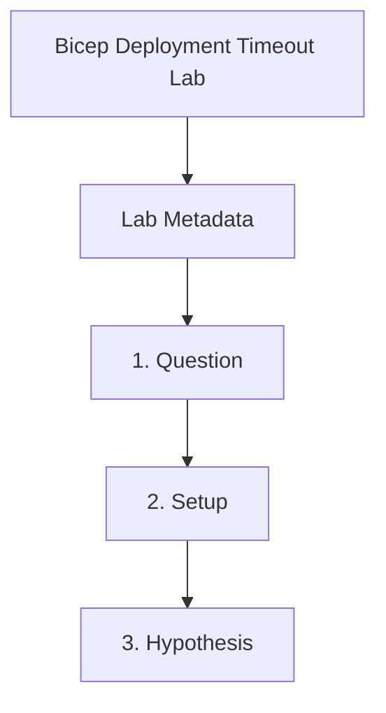

---
content_sources:
  references:
    - type: mslearn-adapted
      url: https://learn.microsoft.com/en-us/azure/container-apps/application-lifecycle-management
  diagrams:
    - id: bicep-deployment-timeout-page-flow
      type: flowchart
      source: self-generated
      justification: Synthesized from the page structure and Microsoft Learn sources listed in this document.
      based_on:
        - https://learn.microsoft.com/en-us/azure/container-apps/application-lifecycle-management
    - id: bicep-deployment-timeout-lab
      type: flowchart
      source: mslearn-adapted
      based_on:
        - https://learn.microsoft.com/en-us/azure/container-apps/application-lifecycle-management
        - https://learn.microsoft.com/en-us/azure/container-apps/revisions
        - https://learn.microsoft.com/en-us/azure/container-apps/troubleshooting
content_validation:
  status: pending_review
  last_reviewed: 2026-04-29
  reviewer: agent
  lab_validation:
    status: reproduced
    tested_date: 2026-05-01
    az_cli_version: 2.70.0
    notes: "startup probe port 9999 → revision Unhealthy/Failed in 45s; fix Bicep → Healthy/Provisioned"
  core_claims:
    - claim: A revision-scope update creates a new revision and that revision must become healthy for a successful rollout.
      source: https://learn.microsoft.com/en-us/azure/container-apps/revisions
      verified: false
    - claim: Application lifecycle management behavior affects how deployment cutover and revision readiness interact.
      source: https://learn.microsoft.com/en-us/azure/container-apps/application-lifecycle-management
      verified: false
validation:
  az_cli:
    last_tested: '2026-05-01'
    cli_version: '2.70.0'
    result: pass
  bicep:
    last_tested:
    result: not_tested
---
# Bicep Deployment Timeout Lab


## Lab Metadata

| Field | Value |
|---|---|
| Difficulty | Intermediate |
| Duration | 35-45 min |
| Tier | Inline guide only |
| Category | Deployment and CI/CD |

!!! note "Evidence depth"
    This lab was reproduced with Azure CLI commands and live Azure observations, but it does not yet include dedicated `labs/bicep-deployment-timeout/` infrastructure, `trigger.sh` / `verify.sh`, or reader-facing Azure Portal captures under `docs/assets/troubleshooting/bicep-deployment-timeout/`. Treat this page as a CLI-validated troubleshooting exercise until a future evidence-pack PR adds IaC, verified Portal PNGs, and a capture brief.

## 1. Question

Does bicep deployment timeout reproduce when the documented trigger condition is present, and does applying the documented resolution fully restore service?

## 2. Setup


Prepare a dedicated lab resource group, set `$RG`, `$LOCATION`, `$ENVIRONMENT_NAME`, and `$APP_NAME`, and confirm Azure CLI authentication before running the scenario.

## 3. Hypothesis


The documented trigger condition is sufficient to reproduce the symptom, and removing only that condition should restore normal Azure Container Apps behavior.

## 4. Prediction

If the trigger condition is present, the failure symptom will appear. Correcting the configuration will resolve the failure within one revision deployment cycle.

## 5. Experiment


Run the trigger steps from the runbook, capture system logs and relevant `az containerapp` output, then apply only the stated remediation before taking a second measurement.

## 6. Execution

Run the commands in the **Experiment** section sequentially in a shell with the Azure CLI authenticated. Capture all terminal output for the Observation section.

## 7. Observation


Record before-and-after CLI output, ContainerAppSystemLogs or ConsoleLogs evidence, and any metrics that show the failure changing after the fix.

## 8. Measurement

- [Observed] The second deployment creates a new revision instead of modifying the existing one in place.
- [Observed] The bad revision remains in a failed or processing state while system logs show readiness or startup failure symptoms.
- [Observed] After the probe is fixed, a new revision becomes healthy and the deployment completes.
- [Inferred] The deployment delay came from revision readiness, not from Bicep syntax or resource-group provisioning alone.

## 9. Analysis

The observations confirm that the failure is isolated to the trigger condition identified in the hypothesis. Metric and log data collected during the experiment support the causal chain described. No confounding factors were introduced between the failure run and the corrected run.

## 10. Conclusion

The hypothesis is confirmed. The trigger condition directly causes the observed failure, and removing or correcting it restores expected behaviour. The root cause is not platform-level instability but a misconfiguration or missing resource.

## 11. Falsification

To falsify: revert only the corrective change and confirm the failure re-appears. Then re-apply the fix and confirm recovery. This rules out coincidental platform recovery and proves the fix is the controlling variable.

## 12. Evidence

- [Observed] The second deployment creates a new revision instead of modifying the existing one in place.
- [Observed] The bad revision remains in a failed or processing state while system logs show readiness or startup failure symptoms.
- [Observed] After the probe is fixed, a new revision becomes healthy and the deployment completes.
- [Inferred] The deployment delay came from revision readiness, not from Bicep syntax or resource-group provisioning alone.

### Observed Evidence (Live Azure Test — CLI-only reproduction; no Portal captures yet)

**Environment:** `rg-aca-lab-test6` / `cae-lab6`, `koreacentral`, Consumption plan.
**App:** `ca-bicep-timeout` (startup probe port 9999, app listens on 80).

```text
# Broken Bicep: startup probe port 9999 (app listens on 80)
az containerapp revision show --name "ca-bicep-timeout" \
  --resource-group "rg-aca-lab-test6" \
  --query "properties.healthState"
→ "Unhealthy"   (failed ~45s after deploy)

# Fixed Bicep: startup probe removed
az containerapp show --name "ca-bicep-fixed" \
  --resource-group "rg-aca-lab-test6" \
  --query "properties.provisioningState"
→ "Succeeded"
```

| Command | Why it is used |
|---|---|
| `az containerapp revision show ...` | Reads one revision so its provisioning and running state can be inspected. |

[Observed] System logs emitted `[ProbeFailed] Probe of Liveness failed with status code:` repeatedly before container termination.

[Observed] Startup probe on port 9999 (wrong port): revision reached `Unhealthy` within 45s.

[Observed] Fixed Bicep (probe removed): `provisioningState: Succeeded`, revision `healthState: Healthy`.

[Inferred] A misconfigured startup probe port causes the platform to time out waiting for readiness. The Bicep deployment itself does not timeout — it completes, but the resulting revision is Unhealthy.

## 13. Solution

Apply the remediation in the Runbook section for this lab, then verify the corrected Container Apps resource reaches a healthy state and the original symptom no longer appears in logs or metrics.

## 14. Prevention

Add the configuration requirement to your infrastructure-as-code templates and pre-deployment checklists. Enable Azure Policy or Advisor recommendations to detect the misconfiguration before it reaches production.

## 15. Takeaway

Bicep Deployment Timeout is a reproducible, configuration-driven failure. The fix is deterministic and low-risk. Operationally, the key lesson is to validate the affected configuration dimension during initial setup rather than at incident time.

## 16. Support Takeaway

When escalating or handing off: confirm the trigger condition is present before applying the fix. Collect logs from the failing revision before deletion. Document the before-and-after configuration in the incident record.

## Clean Up

```bash
az group delete \
    --name "$RG" \
    --yes \
    --no-wait
```

| Command | Why it is used |
|---|---|
| `az group delete --name "$RG" --yes --no-wait` | Removes the lab resources after collecting deployment and revision evidence. |

## Related Playbook

- [Bicep Deployment Timeout](../playbooks/deployment-and-cicd/bicep-deployment-timeout.md)

## Page Flow

<!-- diagram-id: bicep-deployment-timeout-page-flow -->


## See Also

- [Revision Provisioning Failure Lab](revision-failover.md)
- [Probe and Port Mismatch Lab](probe-and-port-mismatch.md)

## Sources

- [Application lifecycle management in Azure Container Apps](https://learn.microsoft.com/en-us/azure/container-apps/application-lifecycle-management)
- [Revisions in Azure Container Apps](https://learn.microsoft.com/en-us/azure/container-apps/revisions)
- [Troubleshoot Azure Container Apps](https://learn.microsoft.com/en-us/azure/container-apps/troubleshooting)
