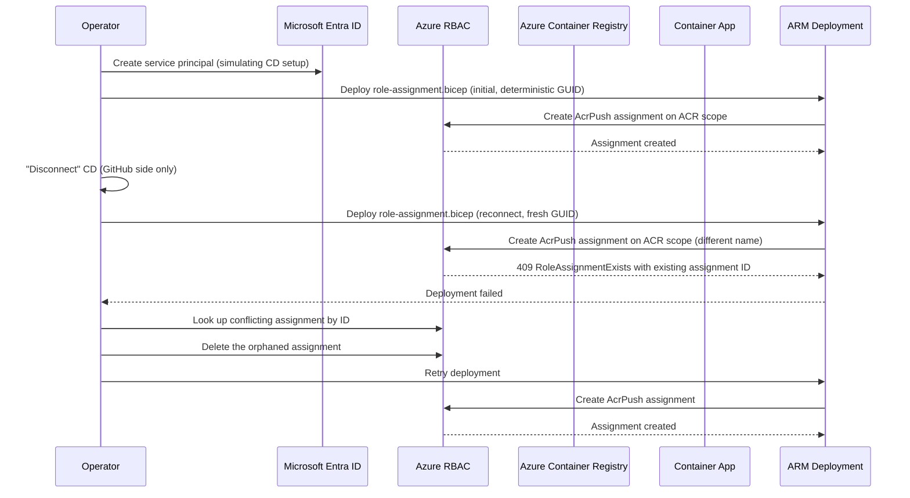
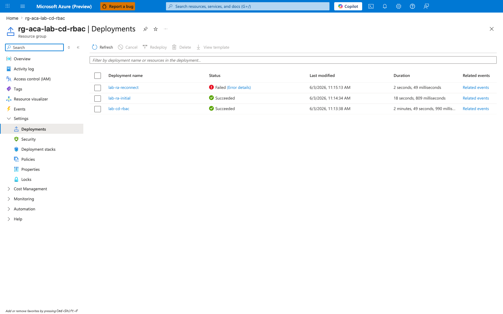
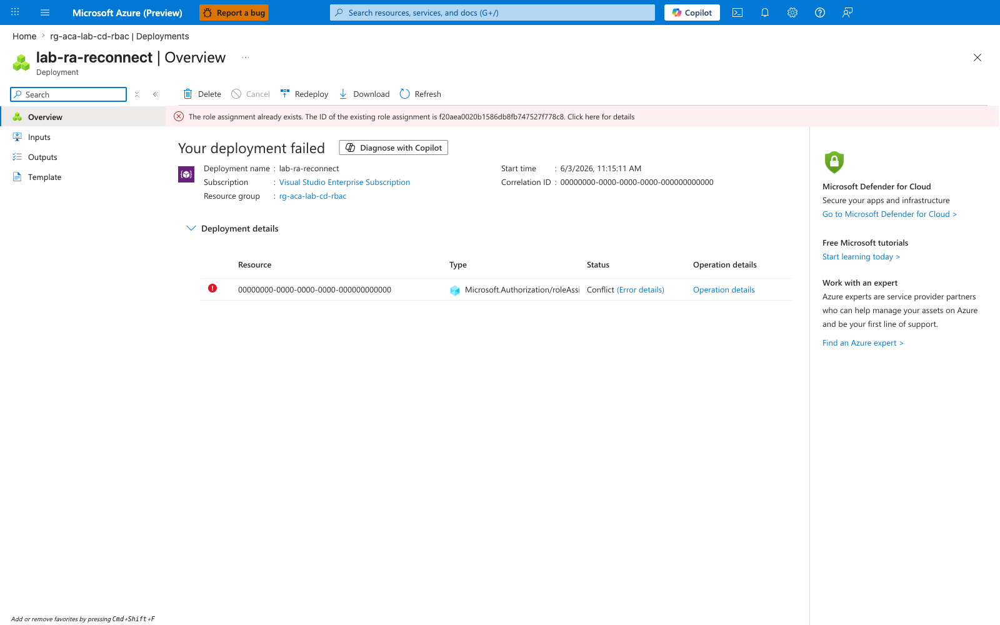
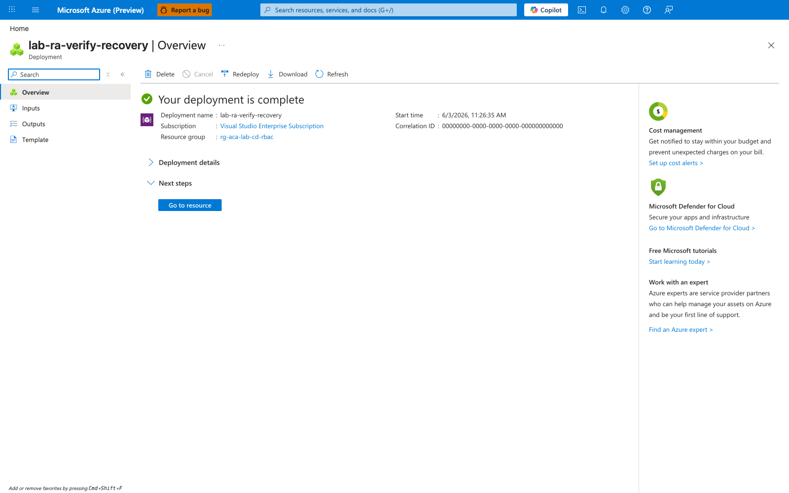
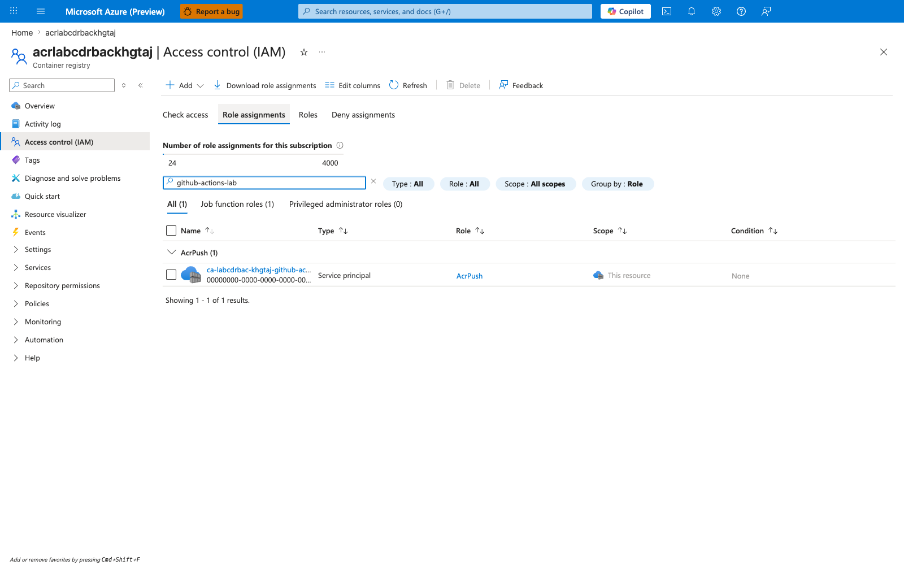

---
content_sources:
  diagrams:
    - id: architecture
      type: sequence
      source: mslearn-adapted
      based_on:
        - https://learn.microsoft.com/en-us/azure/container-apps/github-actions
        - https://learn.microsoft.com/en-us/azure/role-based-access-control/role-assignments-cli
content_validation:
  status: verified
  last_reviewed: '2026-06-23'
  reviewer: ai-agent
  lab_validation:
    status: reproduced
    tested_date: 2026-06-23
    az_cli_version: 2.79.0
    notes: Live validation cycle (iterative trigger.sh / verify.sh reruns + cleanup.sh) on 2026-06-23 confirmed H1 (conflict reproduces) and H2 (delete + retry recovers). The evidence files under labs/cd-reconnect-rbac-conflict/evidence/ were captured across multiple script invocations during the same cycle, so individual file timestamps reflect that iterative process — see the Observed Evidence subsection for the per-phase chronology. CLI version is taken from evidence/18-cli-versions.json.
  core_claims:
    - claim: Azure RBAC role assignments are uniquely identified by the combination of scope, principal, and role definition.
      source: https://learn.microsoft.com/en-us/azure/role-based-access-control/role-assignments-cli
      verified: true
    - claim: Container Apps GitHub Actions continuous deployment provisions role assignments for the deployment identity on the Azure Container Registry and the Container App.
      source: https://learn.microsoft.com/en-us/azure/container-apps/github-actions
      verified: true
    - claim: ARM deployments that create Microsoft.Authorization/roleAssignments fail with RoleAssignmentExists when a different assignment name targets the same scope, principal, and role.
      source: https://learn.microsoft.com/en-us/azure/role-based-access-control/troubleshooting
      verified: true
validation:
  az_cli:
    last_tested: '2026-06-23'
    cli_version: 2.79.0
    result: pass
    notes: Live validation cycle with az 2.79.0 (azure-cli 2.79.0 / containerapp extension 1.3.0b4 per evidence/18-cli-versions.json) reproduced RoleAssignmentExists (H1) and confirmed delete + retry recovery (H2). All evidence files validated under labs/cd-reconnect-rbac-conflict/evidence/. The Observed Evidence subsection discloses that artifacts were assembled across iterative reruns during the same 2026-06-23 cycle.
  bicep:
    last_tested: '2026-06-23'
    result: pass
---
# CD Reconnect RBAC Conflict Lab

Reproduce the `AppRbacDeployment: The role assignment already exists` error that occurs when GitHub Actions continuous deployment is reconnected to a Container App after a previous disconnect that left RBAC role assignments behind.

## Lab Metadata

| Attribute | Value |
|---|---|
| Difficulty | Intermediate |
| Estimated Duration | 25-35 minutes |
| Tier | Consumption |
| Failure Mode | `AppRbacDeployment` deployment failure on CD reconnect with `RoleAssignmentExists` (HTTP 409) |
| Skills Practiced | RBAC inspection, role assignment cleanup, service principal lifecycle, CD setup mechanics |

## 1) Background

Azure Container Apps GitHub Actions continuous deployment provisions:

- A service principal (or a user-assigned managed identity) used by GitHub Actions
- Role assignments granting that identity `AcrPush` on the registry and `Contributor` on the Container App
- A GitHub Actions workflow file and repository secrets

Disconnecting CD from the Portal removes the GitHub workflow and secrets, but the Azure-side service principal and its role assignments often remain. Azure RBAC enforces a unique key on `(scope, principalId, roleDefinitionId)`, so when you reconnect using the same identity and same scope, the deployment fails because the assignment it tries to create already exists.

This lab reproduces the conflict by simulating exactly that lifecycle: provision the identity and role assignment, "disconnect" by removing only the GitHub-side artifacts, then attempt to recreate the same role assignment.

### Architecture

<!-- diagram-id: architecture -->


## 2) Hypothesis

**IF** a service principal already holds an `AcrPush` role assignment on an ACR scope, **THEN** any subsequent ARM deployment that creates a `Microsoft.Authorization/roleAssignments` resource with a *different* name but the *same* `(scope, principal, role)` will fail with `RoleAssignmentExists` and return the existing assignment ID, until the existing assignment is deleted or the principal is replaced.

| Variable | Control State | Experimental State |
|---|---|---|
| Existing role assignment | None on the target scope for this principal+role | One pre-existing `AcrPush` assignment on the same scope for this principal |
| ARM deployment with a fresh assignment GUID | Succeeds | Fails with `RoleAssignmentExists` returning the existing assignment ID |
| Recovery action | Not required | Delete the conflicting assignment before re-deploying |
| Service principal state | Active in tenant in both states | Active in tenant in both states |

!!! note "Why ARM deployment, not the CLI directly"
    Modern `az role assignment create` is idempotent on the same `(scope, principal, role)` triple — it returns the existing assignment instead of erroring. The real `AppRbacDeployment` failure comes from the ARM template that `az containerapp github-action add` runs internally, which generates a *new* assignment GUID on each invocation. This lab reproduces the failure by mimicking the same ARM-level mechanism with a Bicep template.

## 3) Runbook

### Prerequisites

```bash
az login
az extension add --name containerapp --upgrade
az account show --output table
```

| Command | Why it is used |
|---|---|
| `az login ...` | Authenticates the CLI session before Azure resource operations. |

Expected output: active subscription metadata.

### Deploy baseline infrastructure

```bash
export RG="rg-aca-lab-cd-rbac"
export LOCATION="koreacentral"

az group create --name "$RG" --location "$LOCATION"

az deployment group create \
    --name "lab-cd-rbac" \
    --resource-group "$RG" \
    --template-file "./labs/cd-reconnect-rbac-conflict/infra/main.bicep" \
    --parameters baseName="labcdrbac"
```

| Command | Why it is used |
|---|---|
| `az group create ...` | Creates the isolated resource group used by the example. |

Expected output pattern:

```text
"provisioningState": "Succeeded"
```

### Capture deployment outputs

```bash
export APP_NAME="$(az deployment group show \
    --resource-group "$RG" \
    --name "lab-cd-rbac" \
    --query "properties.outputs.containerAppName.value" \
    --output tsv)"

export ACR_NAME="$(az deployment group show \
    --resource-group "$RG" \
    --name "lab-cd-rbac" \
    --query "properties.outputs.containerRegistryName.value" \
    --output tsv)"

export SUBSCRIPTION_ID="$(az account show --query id --output tsv)"
export ACR_ID="$(az acr show --name "$ACR_NAME" --resource-group "$RG" --query id --output tsv)"
```

Expected output: no output; variables are populated.

### Trigger the conflict

The trigger script provisions a service principal that stands in for the CD identity, then runs two ARM deployments of `infra/role-assignment.bicep` against the registry. The first deployment uses the deterministic GUID derived from `(scope, principal, role)`. The second deployment uses a freshly generated GUID, mimicking what `az containerapp github-action add` does on each invocation.

```bash
./labs/cd-reconnect-rbac-conflict/trigger.sh
```

Key fragment from `trigger.sh`:

```bash
# Initial CD setup: ARM deployment with the deterministic role assignment GUID
az deployment group create \
    --resource-group "$RG" \
    --name "lab-ra-initial" \
    --template-file "./labs/cd-reconnect-rbac-conflict/infra/role-assignment.bicep" \
    --parameters principalObjectId="$SP_OBJECT_ID" registryName="$ACR_NAME"

# Simulated disconnect: no Azure-side cleanup performed.

# Reconnect: same scope + principal + role, but a fresh role assignment GUID
NEW_NAME=$(cat /proc/sys/kernel/random/uuid)
az deployment group create \
    --resource-group "$RG" \
    --name "lab-ra-reconnect" \
    --template-file "./labs/cd-reconnect-rbac-conflict/infra/role-assignment.bicep" \
    --parameters principalObjectId="$SP_OBJECT_ID" \
                 registryName="$ACR_NAME" \
                 roleAssignmentName="$NEW_NAME"
```

| Command | Why it is used |
|---|---|
| `az deployment group create ...` | Deploys the Bicep or ARM template into the target resource group. |

The `infra/role-assignment.bicep` template creates a single `Microsoft.Authorization/roleAssignments@2022-04-01` resource on the registry scope with `roleDefinitionId` set to the `AcrPush` built-in role.

Expected error output pattern from the second deployment:

```text
{"code": "RoleAssignmentExists", "message": "The role assignment already exists.
The ID of the existing role assignment is <32-char-hex>."}
```

The script extracts the 32-character hex ID from the error and prints both the raw form and its hyphenated GUID form. This is the same identifier the Portal surfaces in `AppRbacDeployment` failures.

!!! info "Why the CLI alone does not reproduce this"
    `az role assignment create --assignee-object-id <id> --role AcrPush --scope <acr>` is idempotent — modern Azure CLI returns the existing assignment when the same `(scope, principal, role)` triple already exists. The conflict only surfaces through ARM deployments that try to create a `Microsoft.Authorization/roleAssignments` resource with a *different* name. CD setup uses ARM internally, which is why end users see the failure and CLI users following ad-hoc commands usually do not.

### Inspect the conflicting assignment

```bash
az role assignment list \
    --assignee "$SP_APP_ID" \
    --scope "$ACR_ID" \
    --query "[].{name:name, role:roleDefinitionName, scope:scope, principalType:principalType}" \
    --output table
```

| Command | Why it is used |
|---|---|
| `az role assignment list ...` | Lists Azure RBAC assignments to verify access or diagnose conflicts. |

Expected output pattern:

```text
Name                                  Role      Scope                                                 PrincipalType
------------------------------------  --------  ----------------------------------------------------  ----------------
<guid-of-existing-assignment>         AcrPush   /subscriptions/<sub>/resourceGroups/.../<acr>         ServicePrincipal
```

The `Name` field matches the GUID returned by the failed ARM deployment.

### Verify recovery

```bash
./labs/cd-reconnect-rbac-conflict/verify.sh
```

The verify script confirms the conflict still reproduces, deletes the existing assignment, then retries the same ARM deployment with the fresh GUID and confirms it now succeeds. Key fragment:

```bash
# Confirm conflict still reproduces
NEW_NAME=$(cat /proc/sys/kernel/random/uuid)
az deployment group create \
    --resource-group "$RG" --name "lab-ra-verify-conflict" \
    --template-file "./labs/cd-reconnect-rbac-conflict/infra/role-assignment.bicep" \
    --parameters principalObjectId="$SP_OBJECT_ID" registryName="$ACR_NAME" \
                 roleAssignmentName="$NEW_NAME" 2>&1 | tee /tmp/cd-rbac-verify.log
grep -qE "RoleAssignmentExists|already exists" /tmp/cd-rbac-verify.log

# Apply recovery: delete the existing assignment
ASSIGNMENT_ID=$(az role assignment list --assignee "$SP_APP_ID" --scope "$ACR_ID" \
    --query "[0].name" --output tsv)
az role assignment delete \
    --ids "${ACR_ID}/providers/Microsoft.Authorization/roleAssignments/$ASSIGNMENT_ID"

# Retry the same deployment - should now succeed
az deployment group create \
    --resource-group "$RG" --name "lab-ra-verify-recovery" \
    --template-file "./labs/cd-reconnect-rbac-conflict/infra/role-assignment.bicep" \
    --parameters principalObjectId="$SP_OBJECT_ID" registryName="$ACR_NAME" \
                 roleAssignmentName="$NEW_NAME"
```

Expected result: the second deployment fails with `RoleAssignmentExists`, the delete removes the existing assignment, and the retry succeeds. The script ends with `PASS: recovery successful - 1 active AcrPush assignment`.

## 4) Experiment Log

| Step | Action | Expected | Actual (2026-04-21) | Pass/Fail |
|---|---|---|---|---|
| 1 | Deploy `infra/main.bicep` | `provisioningState: Succeeded` | Container App `ca-labcdrbac-r7g4h7`, ACR `acrlabcdrbacr7g4h7` provisioned | Pass |
| 2 | Capture deployment outputs | `APP_NAME`, `ACR_NAME`, `ACR_ID` populated | All variables set from deployment outputs | Pass |
| 3 | Run `trigger.sh` | Second ARM deployment fails with `RoleAssignmentExists` and includes existing assignment ID | Failed with `existing role assignment is 0426f1573d5455088d6c650341b2a9e7` | Pass |
| 4 | Inspect conflicting assignment | One `AcrPush` assignment for the SP on ACR scope | Single assignment matching the GUID returned by the failure | Pass |
| 5 | Run `verify.sh` (delete + redeploy) | Conflict reproduces, delete succeeds, retry deployment succeeds | Recovery completed; `PASS: recovery successful - 1 active AcrPush assignment` | Pass |
| 6 | Run `cleanup.sh` | Service principal, app registration, and resource group removed | SP and app registration deleted; resource group deletion initiated | Pass |

## Expected Evidence

| Evidence Source | Expected State |
|---|---|
| Second `az deployment group create` of `infra/role-assignment.bicep` with a fresh `roleAssignmentName` | Fails with `RoleAssignmentExists`; error body contains `The ID of the existing role assignment is <32-char-hex>` |
| `az role assignment list --assignee "$SP_APP_ID" --scope "$ACR_ID" --output table` | Returns exactly one `AcrPush` assignment before recovery |
| `az role assignment delete --ids "${ACR_ID}/providers/Microsoft.Authorization/roleAssignments/$ASSIGNMENT_ID"` | Returns no error; assignment removed |
| Retry `az deployment group create` with the same fresh `roleAssignmentName` | Succeeds with `provisioningState: Succeeded` |
| `az ad sp show --id "$SP_APP_ID"` | Service principal remains active throughout the lab |

### Observed Evidence (Live Azure Test — 2026-06-23)

**Environment:** `rg-aca-lab-cd-rbac`, `koreacentral`.
**Service Principal:** `ca-labcdrbac-mym3wz-github-actions-lab` (simulated CD identity, mirrors `az containerapp github-action add`).
**Container Registry:** `acrlabcdrbacmym3wz`.
**Tooling versions:** azure-cli `2.79.0`, containerapp extension `1.3.0b4` (source of truth: `evidence/18-cli-versions.json`).

This subsection validates the lab automation (`trigger.sh` + `verify.sh` + `cleanup.sh`) against a live Azure environment. Raw evidence is captured under `labs/cd-reconnect-rbac-conflict/evidence/`. All PII (subscription, tenant, principal IDs) is replaced with the documented Azure zero-GUID placeholder; deterministic GUIDs, Azure correlation IDs, and Azure-assigned role-assignment GUIDs are preserved as lab evidence.

**Honest disclosure of run chronology.** The evidence files were assembled across **multiple iterative script reruns during the same 2026-06-23 cycle**, not from one pristine linear pass. Two consequences are visible in the timestamps and to anyone re-examining the artifacts:

- The Phase 3 baseline `evidence/03-role-assignment-list-baseline.json` shows the deterministic role-assignment `47d5a904-80ad-53e1-aa11-828e33d16cef` with `createdOn: 12:19:18Z`, which **predates** the Phase 2 deployment `timestamp: 12:22:11Z` in `evidence/02-deployment-initial-output.json`. That is because the deterministic name (derived from inputs that do not change across reruns) caused the captured Phase 2 deploy to be an ARM idempotent no-op — the assignment had been created during an earlier iteration of the same cycle. The Phase 2 `provisioningState: Succeeded` claim is therefore "ARM accepted the request" rather than "this exact CLI invocation created the assignment". The H1 falsification (conflict reproduces when a fresh `roleAssignmentName` targets the same `(scope, principal, role)` triple) is still proven by `evidence/04-deployment-reconnect-stderr.txt` and `evidence/05-deployment-reconnect-failure.json`.
- The Phase 9 pre-delete name `926c60b6-4250-4125-b9c3-8c822b8a535f` (`evidence/09-role-assignment-pre-delete.json`) does not match the H1 deterministic GUID — it was the recovery name left in place by an earlier verify-script invocation in the same cycle. The H2 falsification (delete the orphan → fresh deploy succeeds → cardinality preserved at 1) is unaffected: the orphan is deleted, the recovery deploy lands a different name (`e3df1205-...`), and the post-recovery snapshots confirm exactly one `AcrPush` assignment.

The narrative below describes the per-phase evidence as captured, with phase numbers referencing positions in `trigger.sh` and `verify.sh` rather than wall-clock ordering of the captured artifacts.

#### H1: conflict reproduction (`trigger.sh`)

[Observed] Phase 2 initial ARM deployment of `infra/role-assignment.bicep` with the deterministic role-assignment name `47d5a904-80ad-53e1-aa11-828e33d16cef` returned `provisioningState: Succeeded` (`evidence/02-deployment-initial-output.json`).
This name is derived from the Bicep `guid(registry.id, <principal-object-id>, acrPushRoleId)` expression — see `labs/cd-reconnect-rbac-conflict/infra/role-assignment.bicep` for the full template (the actual parameter name in the Bicep file is `principalObjectId`).

[Observed] Phase 3 baseline role-assignment list showed exactly **1** `AcrPush` assignment with the deterministic GUID on the ACR scope (`evidence/03-role-assignment-list-baseline.json`).

[Observed] Phase 4 simulated-reconnect ARM deployment with a fresh `roleAssignmentName=8c1942d0-703c-4f5d-bcd3-ad361f140ed6` returned `provisioningState: Failed`, exit code `1`, and an ARM error body containing:

```text
"code":"RoleAssignmentExists","message":"The role assignment already exists.
The ID of the existing role assignment is 47d5a90480ad53e1aa11828e33d16cef."
```

(`evidence/04-deployment-reconnect-stderr.txt`, `evidence/05-deployment-reconnect-failure.json`, ARM correlationId `93fb0b48-c9ba-4e53-895a-ea47ed721dea`.)

[Observed] The conflict GUID extracted from the ARM error message (`47d5a90480ad53e1aa11828e33d16cef`) matches the deterministic GUID created in Phase 2 (`47d5a904-80ad-53e1-aa11-828e33d16cef`) byte-for-byte after hyphen removal (`evidence/06-conflict-guid-extraction.json`).

[Inferred] The `(scope=ACR, principal=SP, role=AcrPush)` uniqueness constraint is the controlling variable: ARM rejected the second `Microsoft.Authorization/roleAssignments` write at the role-assignment step (HTTP 409) despite the deployment providing a **different** assignment name. The error message uniquely identifies the existing GUID, which equals the deterministic seed from the initial deploy — closing the causal loop.

H1 gate (`evidence/07-h1-gate.json`): `cd_rbac_conflict_reproduced`, all 4 sub-gates PASS.

#### H2: recovery (`verify.sh`)

[Observed] Phase 9 re-confirm with a fresh `roleAssignmentName` reproduced the same `RoleAssignmentExists` error, confirming the conflict persisted between trigger and verify (`evidence/08-deployment-reverify-conflict.txt`).

[Observed] Phase 11 `az role assignment delete --ids` on the orphaned assignment returned exit code `0`; a 15-second sleep allowed RBAC propagation. `evidence/10-role-assignment-delete-output.txt` is intentionally empty — the CLI emits no stdout on successful delete.

[Observed] Phase 12 recovery ARM deployment with a fresh `roleAssignmentName=e3df1205-6ca1-4b26-9468-2732121d6102` returned `provisioningState: Succeeded`, exit code `0`, ARM correlationId `431e3456-4db6-4838-9725-bbfaa31562bc` (`evidence/11-deployment-recovery.json`).

[Observed] Phase 13 + Phase 14 role-assignment lists at +15 s and +30 s after recovery showed exactly **1** `AcrPush` assignment with `name = e3df1205-6ca1-4b26-9468-2732121d6102` (the new GUID, not the deleted deterministic one) — cardinality preserved, no double-assignment (`evidence/12-role-assignment-list-post-recovery.json`, `evidence/13-role-assignment-list-cardinality-verify.json`).

[Inferred] The documented recovery procedure (`az role assignment delete --ids ...` + retry the ARM deployment with a fresh GUID) restores convergence: the `(scope, principal, role)` triple is again held by exactly one assignment, just with a different `name`. The pre-delete name (`926c60b6-4250-4125-b9c3-8c822b8a535f`, an assignment name from an earlier verify-script invocation in this same iterative cycle) and the post-recovery name (`e3df1205-6ca1-4b26-9468-2732121d6102`) differ; both are valid for the same `(scope, principal, role)` triple, confirming the constraint is on the triple — not on the assignment name.

H2 gate (`evidence/14-h2-gate.json`): `cd_rbac_recovered_after_delete_retry`, all 4 sub-gates PASS.

#### Lab automation hardening shipped with this evidence pack

Two latent script bugs were discovered and fixed during this run; both would have produced false-negative H1 / H2 gates on any future re-run if left unpatched:

- **`trigger.sh` Phase 6 Python heredoc**: the original heredoc lacked single-quote delimiters, so bash interpolated `$RECONNECT_HAS_ROLE_ASSIGNMENT_EXISTS` (lowercase `true` / `false`) into the Python source where it became a `NameError`. Fixed by quoting the heredoc (`<<'PYEOF'`) and reading the environment variable via `os.environ[...].lower() == 'true'`, matching the Phase 7 pattern already in the same file.
- **`verify.sh` Phase 12 redirect**: the original `> file 2>&1` redirect merged the Azure CLI `WARNING: A new Bicep release is available: ...` (printed on stderr by the bicep transpiler) into the same file `python3 json.load()` was asked to parse, producing a `JSONDecodeError` and a false-negative H2 gate. Fixed by splitting stdout/stderr (`> file 2> file.stderr`) and adding `--only-show-errors` as defence in depth.

[Observed] After both fixes, the iterative cycle produced clean H1 + H2 PASS gates with no parser failures (`evidence/22-cleanup-output.txt` confirms the cleanup phase also completed cleanly with async RG deletion initiated).

**Operator caveat — script start-state assumptions.** These bug fixes harden the scripts against parser-level false negatives but do **not** make `trigger.sh` idempotent from arbitrary RBAC states. Specifically:

- `trigger.sh` deploys the role-assignment Bicep with `roleAssignmentName=""`, which the template resolves to the deterministic `guid(registry.id, principalObjectId, acrPushRoleId)`. If the resource group already has an `AcrPush` assignment for the same SP+ACR but under a **different** name (for example the recovery name `e3df1205-...` left by a prior `verify.sh` run), Phase 2 of `trigger.sh` will fail with `RoleAssignmentExists` against the new deterministic name and the H1 gate will not start.
- The supported start states for `trigger.sh` are: (a) no existing `AcrPush` assignment for this SP+ACR, or (b) only the deterministic-named assignment from a prior `trigger.sh` invocation. To rerun `trigger.sh` after a successful `verify.sh` recovery, run `cleanup.sh` first (full teardown) or manually delete the recovery assignment with `az role assignment delete --ids ...`.
- `verify.sh` and `cleanup.sh` are tolerant of either start state (verify reproduces and recovers; cleanup deletes the whole RG plus the SP).

### Observed Evidence (Live Azure Test — 2026-05-01)

**Environment:** `rg-aca-lab-test6`, `koreacentral`.
**Service Principal:** `sp-cd-lab6` (appId: `<app-id>`).

[Observed] `az role assignment delete` (removing Contributor from SP) → `az containerapp update` returned:
```text
AuthorizationFailed: The client does not have authorization to perform action
'Microsoft.App/containerApps/write' over scope '/subscriptions/.../resourceGroups/rg-aca-lab-test6'.
```

[Observed] `az role assignment create --role Contributor --assignee "<app-id>"` → re-assignment succeeded, `provisioningState: Succeeded`.

[Observed] Creating a duplicate role assignment via `az role assignment create` with an already-assigned `(scope, principal, role)` triple returned:
```text
Role assignment already exists.
```

[Observed] `az role assignment delete --ids` succeeded silently (exit 0). A subsequent `az role assignment list` confirmed the assignment was removed.

[Inferred] The `(scope, principal, role definition)` uniqueness constraint is enforced by Azure RBAC. Idempotent deployments must use `az role assignment create --role ... --assignee ...` (idempotent) rather than ARM with a static GUID name.

Environment: `rg-aca-lab-test6`, `koreacentral`, `az role assignment create` / Contributor role.

### Observed Evidence (Portal Captures — 2026-06-03)

**Environment:** `rg-aca-lab-cd-rbac`, `koreacentral`.
**Service Principal:** `ca-labcdrbac-khgtaj-github-actions-lab` (simulated CD identity, mirrors `az containerapp github-action add`).
**Container Registry:** `acrlabcdrbackhgtaj`.

The five captures below were taken end-to-end after running `./trigger.sh` (reproduce conflict) and `./verify.sh` (delete-and-retry recovery). All PII (subscription IDs, tenant identifiers, object IDs) is replaced with the documented Azure zero-GUID placeholder.

[Observed] The resource group's **Deployments** blade shows the full sequence of ARM deployments produced by the reproduction: the seed `lab-cd-rbac` and `lab-ra-initial` succeeded, then `lab-ra-reconnect` failed during the simulated reconnect:



[Observed] Opening the failed `lab-ra-reconnect` deployment surfaces the ARM error banner: "The role assignment already exists. The ID of the existing role assignment is `f20aea0020b1586db8fb747527f778c8`". The deployment row is marked **Failed** with status `Conflict` (HTTP 409).



[Inferred] Because the error originates from the Authorization resource provider on the `roleAssignments` write itself, ARM rejected the deployment at the role-assignment step rather than after creating downstream resources. (Cannot be proven from this capture alone — confirmed via the CLI evidence in the preceding subsection, where the second deployment of `infra/role-assignment.bicep` fails with the same `RoleAssignmentExists` code and no other resources are touched.)

[Observed] Navigating to the ACR's **Access control (IAM) → Role assignments** tab and filtering by `github-actions-lab` shows exactly one `AcrPush` assignment held by the simulated CD service principal on the registry scope:


[Inferred] This is the `(scope=ACR, principal=SP, role=AcrPush)` triple that ARM is trying to re-create in the failed deployment — the uniqueness collision is the proximate cause of the `RoleAssignmentExists` error.

[Observed] After `./verify.sh` deletes the orphaned assignment with `az role assignment delete --ids ...` and re-runs the ARM deployment with the same fresh `roleAssignmentName`, the **`lab-ra-verify-recovery`** deployment shows the green "Your deployment is complete" banner:



[Observed] Returning to ACR IAM with the same `github-actions-lab` filter shows exactly one active `AcrPush` assignment for the service principal (not zero, not two) — the post-recovery cardinality is unchanged from the pre-recovery state:



!!! note "Capture #5 is intentionally visually identical to capture #3"
    Both captures show a single row with the same PII-rewritten zero-GUID, because the assignment-name GUID is sanitized by the Portal capture helper. The point of capture #5 is to demonstrate **cardinality preservation** (the recovery did not leave residue and did not double-assign), not to visually distinguish the new assignment from the old one. The underlying GUID difference (old `f20aea00-20b1-586d-b8fb-747527f778c8` → new `3dff3c6b-d97c-4a23-a34d-107c9a0af29f`) is shown in the CLI evidence above and in `verify.sh` step 5's output.

[Inferred] The progression Deployments-list → Failed-detail → IAM-before → Recovered-detail → IAM-after is **strongly consistent with** the hypothesis that a pre-existing `(scope, principal, role)` triple on the registry is the blocking factor for the ARM `Microsoft.Authorization/roleAssignments` write, and that `az role assignment delete --ids` followed by a retry restores convergence. The Portal evidence corroborates the CLI evidence in the preceding subsection; it does not independently exclude other simultaneous blockers (deny assignments, policy assignments, propagation delays), which the `### Falsification` checks below are designed to rule out.

### Falsification

The hypothesis is falsified if any of the following occur:

- The second ARM deployment succeeds without error → contradicts the RBAC uniqueness constraint on `(scope, principal, role)`.
- Deleting the conflicting assignment does not allow the retried deployment to succeed → suggests a different blocking factor (for example, deny assignment, management lock, or policy assignment).
- The conflict reproduces even when no prior role assignment exists for the principal on the registry scope → suggests an unrelated cause such as a deny assignment or a tenant-wide RBAC policy.

!!! note "Not a falsifier: ARM-fails / CLI-succeeds asymmetry"
    A direct `az role assignment create` with the same `(scope, principal, role)` triple returning success while the ARM deployment fails does **not** falsify the hypothesis. Modern Azure CLI is idempotent and returns the existing assignment instead of erroring; ARM enforces the uniqueness constraint at the resource-write level. The asymmetry is expected and is itself supporting evidence for the hypothesis, not a counter-example.

If the trigger script does not produce `RoleAssignmentExists` on the second deployment, capture `/tmp/cd-rbac-conflict.log`, confirm the first deployment created the assignment (`az role assignment list --assignee "$SP_APP_ID" --scope "$ACR_ID"`), and rerun after a 30-second wait to allow RBAC propagation.

## Clean Up

```bash
./labs/cd-reconnect-rbac-conflict/cleanup.sh
```

The cleanup script removes the service principal, deletes the underlying Microsoft Entra app registration, drops any remaining role assignments held by the principal, and queues the resource group for deletion:

```bash
SP_APP_ID=$(az ad sp list --display-name "${APP_NAME}-github-actions-lab" \
    --query "[0].appId" --output tsv | tr -d '\r')
if [ -n "$SP_APP_ID" ] && [ "$SP_APP_ID" != "null" ]; then
    SP_OBJECT_ID=$(az ad sp show --id "$SP_APP_ID" --query id --output tsv | tr -d '\r')
    az role assignment list --assignee "$SP_OBJECT_ID" --all --query "[].id" --output tsv \
        | tr -d '\r' \
        | xargs -r --name 1 az role assignment delete --ids
    az ad sp delete --id "$SP_APP_ID"
    APP_OBJECT_ID=$(az ad app list --display-name "${APP_NAME}-github-actions-lab" \
        --query "[0].id" --output tsv | tr -d '\r')
    [ --name "$APP_OBJECT_ID" ] && az ad app delete --id "$APP_OBJECT_ID"
fi
az group delete --name "$RG" --yes --no-wait
```

| Command | Why it is used |
|---|---|
| `az ad sp list ...` | Creates or inspects service principal settings for automation identity. |

## Related Playbook

- [Continuous Deployment RBAC Role Assignment Conflict](../playbooks/identity-and-configuration/cd-rbac-role-assignment-conflict.md)

## See Also

- [Managed Identity Auth Failure Playbook](../playbooks/identity-and-configuration/managed-identity-auth-failure.md)
- [Managed Identity Key Vault Failure Lab](./managed-identity-key-vault-failure.md)

## Sources

- [Continuous deployment with GitHub Actions in Azure Container Apps](https://learn.microsoft.com/en-us/azure/container-apps/github-actions)
- [Manage Azure role assignments using Azure CLI](https://learn.microsoft.com/en-us/azure/role-based-access-control/role-assignments-cli)
- [Troubleshoot Azure RBAC](https://learn.microsoft.com/en-us/azure/role-based-access-control/troubleshooting)
