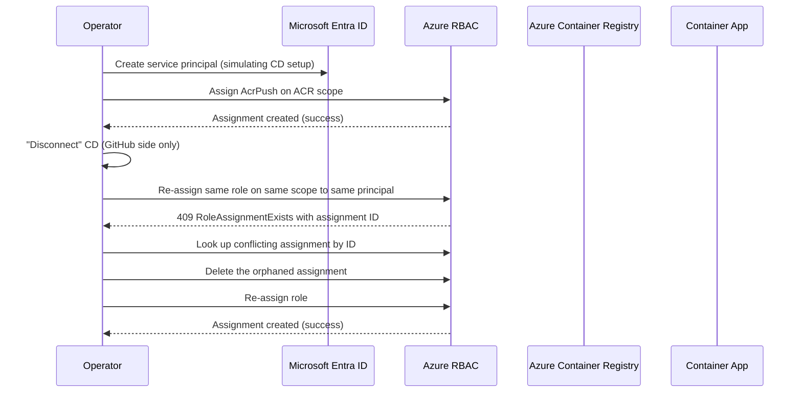

---
content_sources:
  diagrams:
    - id: architecture
      type: sequence
      source: mslearn-adapted
      based_on:
        - https://learn.microsoft.com/azure/container-apps/github-actions
        - https://learn.microsoft.com/azure/role-based-access-control/role-assignments-cli
content_validation:
  status: verified
  last_reviewed: "2026-04-21"
  reviewer: ai-agent
  core_claims:
    - claim: "Azure RBAC role assignments are uniquely identified by the combination of scope, principal, and role definition."
      source: "https://learn.microsoft.com/azure/role-based-access-control/role-assignments-cli"
      verified: true
    - claim: "Container Apps GitHub Actions continuous deployment provisions role assignments for the deployment identity on the Azure Container Registry and the Container App."
      source: "https://learn.microsoft.com/azure/container-apps/github-actions"
      verified: true
---

# CD Reconnect RBAC Conflict Lab

Reproduce the `AppRbacDeployment: The role assignment already exists` error that occurs when GitHub Actions continuous deployment is reconnected to a Container App after a previous disconnect that left RBAC role assignments behind.

## Lab Metadata

| Attribute | Value |
|---|---|
| Difficulty | Intermediate |
| Estimated Duration | 25-35 minutes |
| Tier | Consumption |
| Failure Mode | `AppRbacDeployment` deployment failure on CD reconnect with `RoleAssignmentExists` (HTTP 409) |
| Skills Practiced | RBAC inspection, role assignment cleanup, service principal lifecycle, CD setup mechanics |

## 1) Background

Azure Container Apps GitHub Actions continuous deployment provisions:

- A service principal (or a user-assigned managed identity) used by GitHub Actions
- Role assignments granting that identity `AcrPush` on the registry and `Contributor` on the Container App
- A GitHub Actions workflow file and repository secrets

Disconnecting CD from the Portal removes the GitHub workflow and secrets, but the Azure-side service principal and its role assignments often remain. Azure RBAC enforces a unique key on `(scope, principalId, roleDefinitionId)`, so when you reconnect using the same identity and same scope, the deployment fails because the assignment it tries to create already exists.

This lab reproduces the conflict by simulating exactly that lifecycle: provision the identity and role assignment, "disconnect" by removing only the GitHub-side artifacts, then attempt to recreate the same role assignment.

### Architecture

<!-- diagram-id: architecture -->


## 2) Hypothesis

**IF** a service principal already holds an `AcrPush` role assignment on an ACR scope, **THEN** any subsequent `az role assignment create` call with the same principal, role, and scope will fail with `RoleAssignmentExists` and return the existing assignment ID, until the existing assignment is deleted or the principal is replaced.

| Variable | Control State | Experimental State |
|---|---|---|
| Existing role assignment | None on the target scope for this principal+role | One pre-existing `AcrPush` assignment on the same scope for this principal |
| Result of `az role assignment create` | Success, returns new assignment object | Failure, `RoleAssignmentExists` with existing assignment ID |
| Recovery action | Not required | Delete the conflicting assignment before retrying |
| Service principal state | Active in tenant in both states | Active in tenant in both states |

## 3) Runbook

### Prerequisites

```bash
az login
az extension add --name containerapp --upgrade
az account show --output table
```

Expected output: active subscription metadata.

### Deploy baseline infrastructure

```bash
export RG="rg-aca-lab-cd-rbac"
export LOCATION="koreacentral"

az group create --name "$RG" --location "$LOCATION"

az deployment group create \
    --name "lab-cd-rbac" \
    --resource-group "$RG" \
    --template-file "./labs/cd-reconnect-rbac-conflict/infra/main.bicep" \
    --parameters baseName="labcdrbac"
```

Expected output pattern:

```text
"provisioningState": "Succeeded"
```

### Capture deployment outputs

```bash
export APP_NAME="$(az deployment group show \
    --resource-group "$RG" \
    --name "lab-cd-rbac" \
    --query "properties.outputs.containerAppName.value" \
    --output tsv)"

export ACR_NAME="$(az deployment group show \
    --resource-group "$RG" \
    --name "lab-cd-rbac" \
    --query "properties.outputs.containerRegistryName.value" \
    --output tsv)"

export SUBSCRIPTION_ID="$(az account show --query id --output tsv)"
export ACR_ID="$(az acr show --name "$ACR_NAME" --resource-group "$RG" --query id --output tsv)"
```

Expected output: no output; variables are populated.

### Trigger the conflict

The trigger script simulates the full disconnect/reconnect lifecycle:

```bash
./labs/cd-reconnect-rbac-conflict/trigger.sh
```

The trigger script runs:

```bash
# 1) Create a service principal that simulates the CD identity
SP_NAME="${APP_NAME}-github-actions-lab"
SP_APP_ID=$(az ad sp create-for-rbac --name "$SP_NAME" --skip-assignment --query appId --output tsv)
SP_OBJECT_ID=$(az ad sp show --id "$SP_APP_ID" --query id --output tsv)

# 2) Initial CD setup: grant AcrPush on the registry
az role assignment create \
    --assignee-object-id "$SP_OBJECT_ID" \
    --assignee-principal-type ServicePrincipal \
    --role AcrPush \
    --scope "$ACR_ID"

# 3) Simulate "Disconnect" - in real life, only GitHub workflow and secrets are removed
echo "Simulated disconnect: GitHub workflow and secrets removed (no Azure cleanup)."

# 4) Attempt reconnect - try to recreate the same assignment
set +e
az role assignment create \
    --assignee-object-id "$SP_OBJECT_ID" \
    --assignee-principal-type ServicePrincipal \
    --role AcrPush \
    --scope "$ACR_ID" 2>&1 | tee /tmp/cd-rbac-conflict.log
set -e

grep -E "RoleAssignmentExists|already exists" /tmp/cd-rbac-conflict.log
```

Expected error output pattern:

```text
(RoleAssignmentExists) The role assignment already exists.
Code: RoleAssignmentExists
Message: The role assignment already exists.
```

The CLI may also include the existing assignment ID in the error body, similar to the Portal message:

```text
The ID of the existing role assignment is <32-char-hex>
```

This pattern confirms the hypothesis: the second create call with the same `(scope, principal, role)` triple is rejected with a uniqueness violation.

### Inspect the conflicting assignment

```bash
az role assignment list \
    --assignee "$SP_APP_ID" \
    --scope "$ACR_ID" \
    --query "[].{name:name, role:roleDefinitionName, scope:scope, principalType:principalType}" \
    --output table
```

Expected output pattern:

```text
Name                                  Role      Scope                                                 PrincipalType
------------------------------------  --------  ----------------------------------------------------  ----------------
<guid-of-existing-assignment>         AcrPush   /subscriptions/<sub>/resourceGroups/.../<acr>         ServicePrincipal
```

Capture the `Name` field — that is the role assignment ID Azure returns in the deployment error.

### Apply the recovery path

Delete the conflicting assignment, then re-run the create:

```bash
ASSIGNMENT_ID=$(az role assignment list \
    --assignee "$SP_APP_ID" \
    --scope "$ACR_ID" \
    --query "[0].name" --output tsv)

az role assignment delete \
    --ids "/subscriptions/$SUBSCRIPTION_ID/providers/Microsoft.Authorization/roleAssignments/$ASSIGNMENT_ID"

az role assignment create \
    --assignee-object-id "$SP_OBJECT_ID" \
    --assignee-principal-type ServicePrincipal \
    --role AcrPush \
    --scope "$ACR_ID"
```

Expected output pattern:

```text
{
  "principalId": "<object-id>",
  "principalType": "ServicePrincipal",
  "roleDefinitionId": ".../providers/Microsoft.Authorization/roleDefinitions/<guid-AcrPush>",
  "scope": "/subscriptions/<sub>/resourceGroups/.../<acr>"
}
```

### Verify recovery

```bash
./labs/cd-reconnect-rbac-conflict/verify.sh
```

The verify script checks that the failure was reproduced first, then applies the cleanup-and-reassign recovery flow:

```bash
# Confirm pre-existing assignment exists
INITIAL_COUNT=$(az role assignment list --assignee "$SP_APP_ID" --scope "$ACR_ID" --query "length(@)" --output tsv)
[ "$INITIAL_COUNT" -ge 1 ] || { echo "FAIL: no pre-existing assignment to conflict against"; exit 1; }

# Delete and recreate
ASSIGNMENT_ID=$(az role assignment list --assignee "$SP_APP_ID" --scope "$ACR_ID" --query "[0].name" --output tsv)
az role assignment delete --ids "/subscriptions/$SUBSCRIPTION_ID/providers/Microsoft.Authorization/roleAssignments/$ASSIGNMENT_ID"
az role assignment create --assignee-object-id "$SP_OBJECT_ID" --assignee-principal-type ServicePrincipal --role AcrPush --scope "$ACR_ID"

# Verify exactly one active assignment now
FINAL_COUNT=$(az role assignment list --assignee "$SP_APP_ID" --scope "$ACR_ID" --query "length(@)" --output tsv)
[ "$FINAL_COUNT" = "1" ] && echo "PASS: recovery successful" || { echo "FAIL: unexpected assignment count $FINAL_COUNT"; exit 1; }
```

Expected result: the conflict is removed and a new assignment is created successfully.

## 4) Experiment Log

| Step | Action | Expected | Actual | Pass/Fail |
|---|---|---|---|---|
| 1 | Deploy lab infrastructure | Deployment succeeds | | |
| 2 | Capture deployment outputs | Variables populated | | |
| 3 | Run `trigger.sh` | Second `role assignment create` fails with `RoleAssignmentExists` | | |
| 4 | Inspect conflicting assignment | One pre-existing `AcrPush` assignment for the SP on ACR scope | | |
| 5 | Delete and recreate assignment | `az role assignment create` succeeds | | |
| 6 | Run `verify.sh` | Final state has exactly one active assignment | | |

## Expected Evidence

| Evidence Source | Expected State |
|---|---|
| `az role assignment create` (second call, same triple) | Fails with `RoleAssignmentExists` and references existing assignment ID |
| `az role assignment list --assignee "$SP_APP_ID" --scope "$ACR_ID" --output table` | Returns exactly one `AcrPush` assignment before recovery |
| `az role assignment delete --ids ...` | Returns no error; assignment removed |
| `az role assignment create` (after delete) | Returns the new assignment object successfully |
| `az ad sp show --id "$SP_APP_ID"` | Service principal remains active throughout the lab |

### Falsification

The hypothesis is falsified if any of the following occur:

- The second `az role assignment create` call succeeds without error → contradicts the RBAC uniqueness constraint.
- Deleting the conflicting assignment does not allow the recreate to succeed → suggests a different blocking factor (for example, deny assignment or management lock).
- The conflict occurs even when the principal does not exist before the second call → suggests an unrelated cause.

If the trigger script does not produce `RoleAssignmentExists` on the second create, capture the full CLI output and re-check whether the first create call actually persisted (RBAC propagation can take up to one minute; rerun after a short wait).

## Clean Up

```bash
./labs/cd-reconnect-rbac-conflict/cleanup.sh
```

The cleanup script removes the service principal, any remaining role assignments, and the resource group:

```bash
SP_APP_ID=$(az ad sp list --display-name "${APP_NAME}-github-actions-lab" --query "[0].appId" --output tsv)
if [ -n "$SP_APP_ID" ] && [ "$SP_APP_ID" != "null" ]; then
    az role assignment list --assignee "$SP_APP_ID" --all --query "[].id" --output tsv | xargs -r -n 1 az role assignment delete --ids
    az ad sp delete --id "$SP_APP_ID"
fi
az group delete --name "$RG" --yes --no-wait
```

## Related Playbook

- [Continuous Deployment RBAC Role Assignment Conflict](../playbooks/identity-and-configuration/cd-rbac-role-assignment-conflict.md)

## See Also

- [Managed Identity Auth Failure Playbook](../playbooks/identity-and-configuration/managed-identity-auth-failure.md)
- [Managed Identity Key Vault Failure Lab](./managed-identity-key-vault-failure.md)

## Sources

- [Continuous deployment with GitHub Actions in Azure Container Apps](https://learn.microsoft.com/azure/container-apps/github-actions)
- [Manage Azure role assignments using Azure CLI](https://learn.microsoft.com/azure/role-based-access-control/role-assignments-cli)
- [Troubleshoot Azure RBAC](https://learn.microsoft.com/azure/role-based-access-control/troubleshooting)
