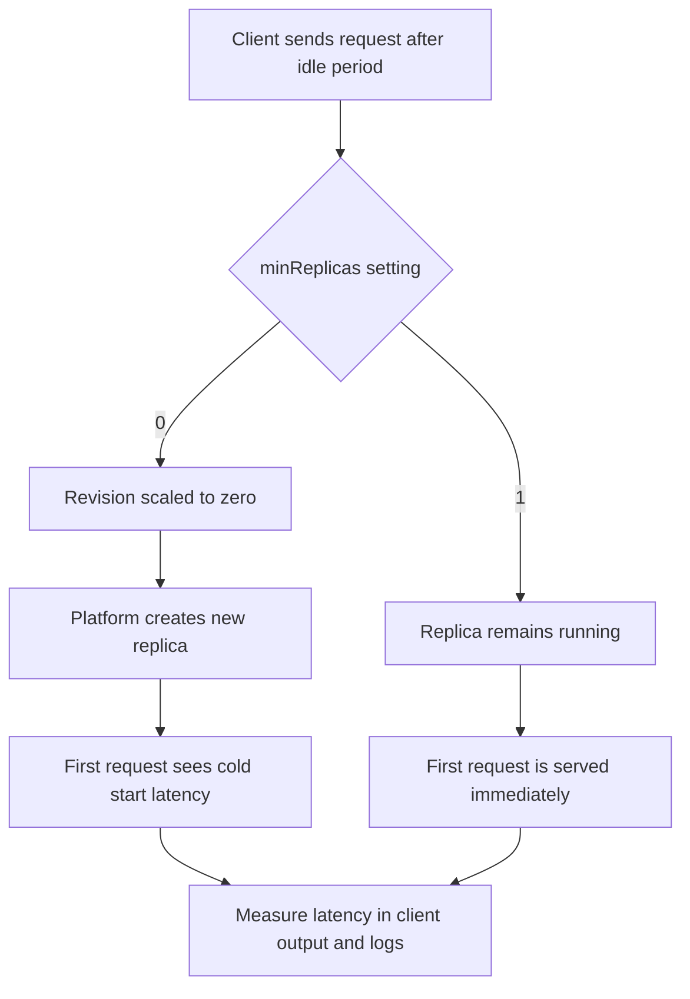

---
hide:
  - toc
content_sources:
  diagrams:
    - id: architecture
      type: flowchart
      source: mslearn-adapted
      based_on:
        - https://learn.microsoft.com/azure/container-apps/scale-app
        - https://learn.microsoft.com/azure/container-apps/plans
content_validation:
  status: verified
  last_reviewed: "2026-04-12"
  reviewer: ai-agent
  core_claims:
    - claim: "Azure Container Apps supports scale settings with a minimum replica count of 0, which allows a revision to scale to zero."
      source: "https://learn.microsoft.com/azure/container-apps/scale-app"
      verified: true
    - claim: "Setting the minimum number of replicas to 1 or higher ensures that an instance of the revision is always running."
      source: "https://learn.microsoft.com/azure/container-apps/scale-app"
      verified: true
    - claim: "Both the Consumption and Dedicated plan types support scale-to-zero in Azure Container Apps."
      source: "https://learn.microsoft.com/azure/container-apps/plans"
      verified: true
---

# Cold Start and Scale-to-Zero Lab

Measure the latency impact of scale-to-zero, then compare it with a configuration that keeps a replica always ready.

## Lab Metadata

| Attribute | Value |
|---|---|
| Difficulty | Intermediate |
| Estimated Duration | 30-40 minutes |
| Tier | Consumption or Dedicated |
| Failure Mode | First request after idle is slow because the app scaled to zero and must cold start a new replica |
| Skills Practiced | Scale configuration analysis, latency measurement, KQL correlation, revision comparison |

## Architecture

<!-- diagram-id: architecture -->


## 1) Question

Does Azure Container Apps introduce measurable first-request latency after an app scales to zero, and does keeping one always-ready replica remove that latency penalty?

## 2) Setup

This lab uses the existing baseline infrastructure pattern from `./labs/scale-rule-mismatch/infra/main.bicep`, then changes scale settings to reproduce cold start behavior.

Run the following commands from the repository root so the relative Bicep template path resolves correctly.

```bash
export RESOURCE_GROUP="rg-aca-lab-coldstart"
export LOCATION="koreacentral"
export DEPLOYMENT_NAME="lab-cold-start"

az extension add --name containerapp --upgrade
az login

az group create \
    --name "$RESOURCE_GROUP" \
    --location "$LOCATION"

az deployment group create \
    --name "$DEPLOYMENT_NAME" \
    --resource-group "$RESOURCE_GROUP" \
    --template-file "./labs/scale-rule-mismatch/infra/main.bicep" \
    --parameters baseName="coldstartlab"
```

Capture outputs for later steps:

```bash
export APP_NAME="$(az deployment group show \
    --name "$DEPLOYMENT_NAME" \
    --resource-group "$RESOURCE_GROUP" \
    --query "properties.outputs.containerAppName.value" \
    --output tsv)"

export ENVIRONMENT_NAME="$(az deployment group show \
    --name "$DEPLOYMENT_NAME" \
    --resource-group "$RESOURCE_GROUP" \
    --query "properties.outputs.environmentName.value" \
    --output tsv)"

export APP_URL="$(az deployment group show \
    --name "$DEPLOYMENT_NAME" \
    --resource-group "$RESOURCE_GROUP" \
    --query "properties.outputs.containerAppUrl.value" \
    --output tsv)"

export LOG_ANALYTICS_WORKSPACE_NAME="$(az deployment group show \
    --name "$DEPLOYMENT_NAME" \
    --resource-group "$RESOURCE_GROUP" \
    --query "properties.outputs.logAnalyticsWorkspaceName.value" \
    --output tsv)"
```

Expected starting state: one revision exists and the app responds successfully over HTTPS.

| Command | Why it is used |
|---|---|
| `az extension add --name containerapp --upgrade` | Ensures the Azure Container Apps CLI extension is installed and current. |
| `az login` | Authenticates the Azure CLI session before creating resources. |
| `az group create --name "$RESOURCE_GROUP" --location "$LOCATION"` | Creates an isolated resource group for the lab. |
| `az deployment group create --name "$DEPLOYMENT_NAME" --resource-group "$RESOURCE_GROUP" --template-file "./labs/scale-rule-mismatch/infra/main.bicep" --parameters baseName="coldstartlab"` | Deploys the baseline Azure Container Apps environment, registry, workspace, and app. |
| `az deployment group show ... --query "properties.outputs..."` | Extracts deployment outputs needed for later steps. |

## 3) Hypothesis

**IF** `minReplicas=0`, **THEN** the first request after the app has been idle long enough to scale to zero will show higher latency than steady-state requests; **IF** `minReplicas=1` is configured to keep one replica always ready, **THEN** the cold start latency spike is eliminated for the same test path.

| Variable | Control State | Experimental State |
|---|---|---|
| Minimum replicas | `1` | `0` |
| Idle behavior | One replica remains available | Revision can scale to zero |
| First request latency after idle | Near warm-request latency | Noticeably higher than warm-request latency |
| Plan support | Consumption or Dedicated | Consumption or Dedicated |

## 4) Prediction

- [Measured] The first request after scale-to-zero will have the highest observed latency in the test run.
- [Observed] `az containerapp replica list` will return zero running replicas before the cold-start request in the experimental state.
- [Measured] Warm requests immediately after the first request will be faster than the first request.
- [Observed] After changing to `minReplicas=1`, the app will keep one running replica and the latency spike will no longer appear in the same idle-window test.

## 5) Experiment

Configure two states against the same app revision pattern:

1. Experimental state: allow scale-to-zero with `minReplicas=0`.
2. Wait for idle scale-in and measure the first request.
3. Send several follow-up warm requests and compare latency.
4. Control state: update to `minReplicas=1`.
5. Repeat the same idle-and-request sequence.
6. Correlate request timing with replica state and log timestamps.

## 6) Execution

### Configure the scale-to-zero state

```bash
az containerapp update \
    --name "$APP_NAME" \
    --resource-group "$RESOURCE_GROUP" \
    --min-replicas 0 \
    --max-replicas 3 \
    --scale-rule-name "http-rule" \
    --scale-rule-type "http" \
    --scale-rule-http-concurrency 10
```

### Confirm the active scale settings

```bash
az containerapp show \
    --name "$APP_NAME" \
    --resource-group "$RESOURCE_GROUP" \
    --query "properties.template.scale" \
    --output json
```

### Wait for the revision to scale in

```bash
while true; do
    az containerapp replica list \
        --name "$APP_NAME" \
        --resource-group "$RESOURCE_GROUP" \
        --output table
    sleep 15
done
```

When no replicas remain, stop the loop with `Ctrl+C` and measure the first request:

```bash
curl \
    --silent \
    --show-error \
    --output /dev/null \
    --write-out "first_request_after_idle total=%{time_total}s connect=%{time_connect}s starttransfer=%{time_starttransfer}s\n" \
    "$APP_URL"
```

Collect warm-request samples immediately after the cold request:

```bash
for attempt in 1 2 3 4 5; do
    curl \
        --silent \
        --show-error \
        --output /dev/null \
        --write-out "warm_request_${attempt} total=%{time_total}s connect=%{time_connect}s starttransfer=%{time_starttransfer}s\n" \
        "$APP_URL"
done
```

### Apply the always-ready control state

```bash
az containerapp update \
    --name "$APP_NAME" \
    --resource-group "$RESOURCE_GROUP" \
    --min-replicas 1 \
    --max-replicas 3 \
    --scale-rule-name "http-rule" \
    --scale-rule-type "http" \
    --scale-rule-http-concurrency 10
```

Wait at least the same idle interval, then repeat the request measurements:

```bash
az containerapp replica list \
    --name "$APP_NAME" \
    --resource-group "$RESOURCE_GROUP" \
    --output table

curl \
    --silent \
    --show-error \
    --output /dev/null \
    --write-out "first_request_with_min1 total=%{time_total}s connect=%{time_connect}s starttransfer=%{time_starttransfer}s\n" \
    "$APP_URL"
```

| Command | Why it is used |
|---|---|
| `az containerapp update --name "$APP_NAME" --resource-group "$RESOURCE_GROUP" --min-replicas 0 ...` | Reproduces scale-to-zero behavior for the experimental state. |
| `az containerapp show --query "properties.template.scale"` | Verifies the revision uses the intended minimum replica setting. |
| `az containerapp replica list --output table` in a loop | Confirms whether the revision has fully scaled in before the cold request. |
| `curl --write-out ... "$APP_URL"` | Measures first-request and warm-request latency from the client perspective. |
| `az containerapp update --name "$APP_NAME" --resource-group "$RESOURCE_GROUP" --min-replicas 1 ...` | Switches the app into the always-ready control state. |

## 7) Observation

Record raw platform signals and request output.

### Replica state before the first test

```bash
az containerapp replica list \
    --name "$APP_NAME" \
    --resource-group "$RESOURCE_GROUP" \
    --output table
```

Expected experimental-state pattern:

```text
No replicas found.
```

### Revision and system log signals

```bash
az containerapp logs show \
    --name "$APP_NAME" \
    --resource-group "$RESOURCE_GROUP" \
    --type system
```

Expected log pattern:

```text
Reason_s              Type_s
--------------------  -------
RevisionProvisioned   Normal
ReplicaStarted        Normal
```

Interpretation: [Observed] the platform creates a replica only when traffic arrives after idle scale-to-zero.

| Command | Why it is used |
|---|---|
| `az containerapp replica list --name "$APP_NAME" --resource-group "$RESOURCE_GROUP" --output table` | Captures the raw replica state before each measurement. |
| `az containerapp logs show --name "$APP_NAME" --resource-group "$RESOURCE_GROUP" --type system` | Captures scale, revision, and replica lifecycle events around the cold request. |

## 8) Measurement

Capture the latency delta between cold and warm requests.

| Measurement | Experimental State (`minReplicas=0`) | Control State (`minReplicas=1`) |
|---|---|---|
| First request total latency | Higher | Lower |
| Warm request total latency | Lower than first request | Similar to first request |
| Running replicas before request | `0` | `1` |
| Cold start gap | Present | Absent or negligible |

Use these KQL queries to quantify the event.

### KQL: system events around scale-from-zero

```kusto
let AppName = "my-container-app";
ContainerAppSystemLogs_CL
| where ContainerAppName_s == AppName
| where TimeGenerated > ago(2h)
| where Reason_s has_any ("Replica", "Revision") or Log_s has_any ("scale", "starting", "Started")
| project TimeGenerated, RevisionName_s, ReplicaName_s, Reason_s, Log_s
| order by TimeGenerated asc
```

### KQL: estimate startup duration from console logs

```kusto
let AppName = "my-container-app";
let Startup =
    ContainerAppConsoleLogs_CL
    | where ContainerAppName_s == AppName
    | where TimeGenerated > ago(2h)
    | where Log_s has_any ("Starting", "Booting", "Initializing", "Launching")
    | summarize arg_min(TimeGenerated, *) by RevisionName_s, ContainerGroupName_s;
let Ready =
    ContainerAppConsoleLogs_CL
    | where ContainerAppName_s == AppName
    | where TimeGenerated > ago(2h)
    | where Log_s has_any ("Listening on", "Ready to accept connections", "Application started")
    | summarize arg_min(TimeGenerated, *) by RevisionName_s, ContainerGroupName_s;
Startup
| join kind=inner Ready on RevisionName_s, ContainerGroupName_s
| extend startupDurationSeconds = datetime_diff('second', TimeGenerated1, TimeGenerated)
| project RevisionName_s, ContainerGroupName_s, startupAt=TimeGenerated, readyAt=TimeGenerated1, startupDurationSeconds
| order by startupDurationSeconds desc
```

### KQL: compare first-hit versus steady-state request latency in Application Insights (optional)

Use this query only if Application Insights is already enabled for the app. The baseline lab deployment in this guide provisions Log Analytics, not Application Insights.

```kusto
requests
| where timestamp > ago(2h)
| where cloud_RoleName == "my-container-app"
| extend UrlPath = tostring(parse_url(url).Path)
| summarize RequestCount=count(), P50=percentile(duration, 50), P95=percentile(duration, 95), P99=percentile(duration, 99) by UrlPath, bin(timestamp, 5m)
| order by timestamp asc
```

## 9) Analysis

- [Correlated] Higher first-request latency is meaningful only when it lines up with zero replicas before the request and replica-start events immediately afterward.
- [Measured] If warm requests are consistently fast while only the first request is slow, the problem is cold start latency rather than sustained performance degradation.
- [Inferred] When `minReplicas=1` removes the spike without changing code or image, scale-to-zero behavior is the dominant variable.
- [Strongly Suggested] If latency remains high even with `minReplicas=1`, then startup code path, external dependency initialization, or image pull time likely contributes more than scale-to-zero alone.

## 10) Conclusion

The hypothesis is confirmed when the scale-to-zero state shows a slower first request after idle and the always-ready state does not. In that outcome, the latency penalty is tied to creating a new replica on demand rather than to ordinary request handling.

## 11) Falsification

The hypothesis is falsified if either of the following occurs:

- The first request after idle is not materially slower when `minReplicas=0`.
- The first request remains equally slow after changing to `minReplicas=1` and verifying one replica stays running.

That result would mean the latency issue is not primarily caused by scale-to-zero and should shift investigation toward application startup, dependency warm-up, or network path delays.

## 12) Evidence

| Evidence Source | Expected State |
|---|---|
| `az containerapp show --query "properties.template.scale"` | Shows `minReplicas` as `0` in the experimental phase and `1` in the control phase |
| `az containerapp replica list --output table` before cold request | No running replicas in the experimental phase |
| `curl --write-out ... "$APP_URL"` first request after idle | Highest total latency sample in the experimental phase |
| Follow-up `curl` requests | Lower warm-request latency than the first request |
| `ContainerAppSystemLogs_CL` KQL query | Replica creation or start events align with the first cold request |
| `ContainerAppConsoleLogs_CL` KQL query | Startup-to-ready interval is visible for cold-started replicas |

## 13) Solution

Use one of these mitigations based on the latency objective:

1. Set `minReplicas=1` when user-facing latency is more important than maximum scale-to-zero cost savings.
2. Keep startup paths lightweight so new replicas become ready faster.
3. Pre-initialize expensive dependencies during deployment validation instead of on the first live request.
4. Measure changes with the same idle-window test before and after each tuning step.

## 14) Prevention

- Document whether the app is allowed to scale to zero as a deliberate design choice.
- Add a latency SLO check for first request after idle, not only warm steady-state traffic.
- Validate replica minimums during release reviews for user-facing HTTP apps.
- Keep the image size, dependency graph, and startup initialization path small enough to reduce cold start time.
- For environments where user-facing latency must stay predictable, prefer an always-ready configuration over pure cost optimization.

## 15) Takeaway

Scale-to-zero is working as designed when the first request after idle is slower. The operational question is not whether cold start exists, but whether the measured latency is acceptable for the workload.

## 16) Support Takeaway

When a customer reports “the first request is slow but everything after that is fast,” immediately compare `minReplicas`, replica count before the request, and startup timing in logs. If the app is allowed to scale to zero, reproduce the idle-window test before investigating deeper application issues.

## Clean Up

```bash
az group delete \
    --name "$RESOURCE_GROUP" \
    --yes \
    --no-wait
```

| Command | Why it is used |
|---|---|
| `az group delete --name "$RESOURCE_GROUP" --yes --no-wait` | Removes all lab resources after evidence collection is complete. |

## Sources

- [Scaling in Azure Container Apps](https://learn.microsoft.com/azure/container-apps/scale-app)
- [Azure Container Apps Plan Types](https://learn.microsoft.com/azure/container-apps/plans)
