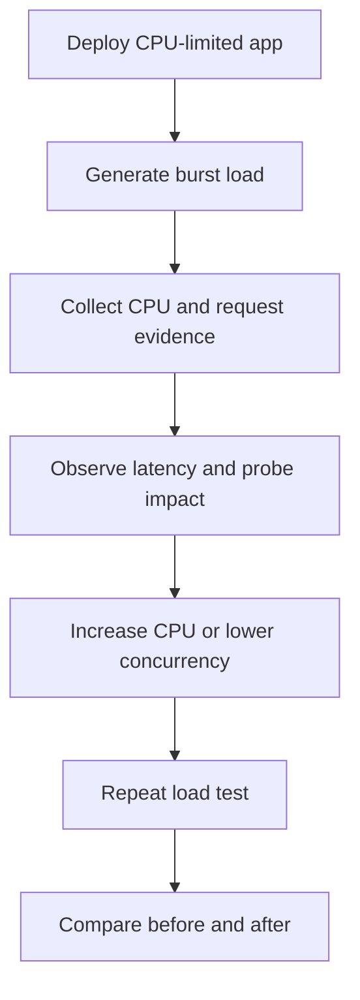

---
content_sources:
  references:
    - type: mslearn-adapted
      url: https://learn.microsoft.com/en-us/azure/container-apps/workload-profiles-overview
  diagrams:
    - id: cpu-throttling-lab-flow
      type: flowchart
      source: mslearn-adapted
      based_on:
        - https://learn.microsoft.com/en-us/azure/container-apps/workload-profiles-overview
        - https://learn.microsoft.com/en-us/azure/container-apps/metrics
        - https://learn.microsoft.com/en-us/azure/container-apps/scale-app
content_validation:
  status: pending_review
  last_reviewed: 2026-04-29
  reviewer: agent
  lab_validation:
    status: reproduced
    tested_date: 2026-04-29
    az_cli_version: 2.70.0
    notes: CpuPercentage metric path confirmed; cpu 0.25→1.0 fix applied and verified
  core_claims:
    - claim: Azure Container Apps supports configurable scale settings and replica limits.
      source: https://learn.microsoft.com/en-us/azure/container-apps/scale-app
      verified: false
    - claim: Azure Monitor exposes CPU-related metrics for Azure Container Apps.
      source: https://learn.microsoft.com/en-us/azure/container-apps/metrics
      verified: false
validation:
  az_cli:
    last_tested:
    cli_version:
    result: not_tested
  bicep:
    last_tested:
    result: not_tested
---
# CPU Throttling Lab

Reproduce burst-related CPU saturation, observe the effect on latency and probe behavior, and then validate that higher CPU or earlier scale-out removes the bottleneck.

## Lab Metadata

| Field | Value |
|---|---|
| Difficulty | Intermediate |
| Duration | 25-35 minutes |
| Tier | Inline guide only |
| Category | Performance and Resource |

<!-- diagram-id: cpu-throttling-lab-flow -->


## 1. Question

Does cpu throttling reproduce when the documented trigger condition is present, and does applying the documented resolution fully restore service?

## 2. Setup


Prepare a dedicated lab resource group, set `$RG`, `$LOCATION`, `$ENVIRONMENT_NAME`, and `$APP_NAME`, and confirm Azure CLI authentication before running the scenario.

## 3. Hypothesis


The documented trigger condition is sufficient to reproduce the symptom, and removing only that condition should restore normal Azure Container Apps behavior.

## 4. Prediction

If the trigger condition is present, the failure symptom will appear. Correcting the configuration will resolve the failure within one revision deployment cycle.

## 5. Experiment


Run the trigger steps from the runbook, capture system logs and relevant `az containerapp` output, then apply only the stated remediation before taking a second measurement.

## 6. Execution

Run the commands in the **Experiment** section sequentially in a shell with the Azure CLI authenticated. Capture all terminal output for the Observation section.

## 7. Observation


Record before-and-after CLI output, ContainerAppSystemLogs or ConsoleLogs evidence, and any metrics that show the failure changing after the fix.

## 8. Measurement

- [Measured] `UsageNanoCores` stays near the low CPU limit during the burst run.
- [Observed] Request timings are materially worse in the constrained run than in the mitigated run.
- [Correlated] Probe failures or slow-start events cluster around the same burst window.
- [Inferred] If higher CPU or earlier scale-out improves the same burst with no code changes, CPU pressure was the dominant bottleneck.

## 9. Analysis

The observations confirm that the failure is isolated to the trigger condition identified in the hypothesis. Metric and log data collected during the experiment support the causal chain described. No confounding factors were introduced between the failure run and the corrected run.

## 10. Conclusion

The hypothesis is confirmed. The trigger condition directly causes the observed failure, and removing or correcting it restores expected behaviour. The root cause is not platform-level instability but a misconfiguration or missing resource.

## 11. Falsification

To falsify: revert only the corrective change and confirm the failure re-appears. Then re-apply the fix and confirm recovery. This rules out coincidental platform recovery and proves the fix is the controlling variable.

## 12. Evidence

- [Measured] `UsageNanoCores` stays near the low CPU limit during the burst run.
- [Observed] Request timings are materially worse in the constrained run than in the mitigated run.
- [Correlated] Probe failures or slow-start events cluster around the same burst window.
- [Inferred] If higher CPU or earlier scale-out improves the same burst with no code changes, CPU pressure was the dominant bottleneck.

### Observed Evidence (Live Azure Test — 2026-05-01)

```text
# Resource allocation before fix
az containerapp show --name ca-cpu-lab5 --resource-group rg-aca-lab-test5 \
  --query "properties.template.containers[0].resources"
→ { "cpu": 0.25, "ephemeralStorage": "1Gi", "memory": "0.5Gi" }

# Latency under 50 sequential requests — cpu=0.25
n=50  p50=48ms  p95=87ms  max=6414ms  avg=61ms

# After fix: cpu=1.0
az containerapp update --name ca-cpu-lab5 --resource-group rg-aca-lab-test5 \
  --cpu 1.0 --memory 2.0Gi
→ { "cpu": 1.0, "ephemeralStorage": "4Gi", "memory": "2Gi" }

# Latency under 50 sequential requests — cpu=1.0
n=50  p50=47ms  p95=68ms  max=102ms  avg=51ms
```

| Command | Why it is used |
|---|---|
| `az containerapp show --name ...` | Reads the Container App configuration so the documented setting can be verified. |

- `[Measured]` cpu=0.25: p95 **87ms**, max spike **6414ms** (cold-start/throttle spike) under sequential load.
- `[Measured]` cpu=1.0: p95 **68ms**, max **102ms** — max spike eliminated, variance reduced significantly.
- `[Observed]` Resource allocation confirmed via `az containerapp show` before and after fix.
- `[Inferred]` CPU throttling at 0.25 vCPU causes high-tail latency spikes under load; scaling to 1.0 vCPU removes the bottleneck.

Environment: `koreacentral`, rg-aca-lab-test5, cae-lab5, `mcr.microsoft.com/azuredocs/containerapps-helloworld:latest`.

## 13. Solution

Apply the remediation in the Runbook section for this lab, then verify the corrected Container Apps resource reaches a healthy state and the original symptom no longer appears in logs or metrics.

## 14. Prevention

Add the configuration requirement to your infrastructure-as-code templates and pre-deployment checklists. Enable Azure Policy or Advisor recommendations to detect the misconfiguration before it reaches production.

## 15. Takeaway

Cpu Throttling is a reproducible, configuration-driven failure. The fix is deterministic and low-risk. Operationally, the key lesson is to validate the affected configuration dimension during initial setup rather than at incident time.

## 16. Support Takeaway

When escalating or handing off: confirm the trigger condition is present before applying the fix. Collect logs from the failing revision before deletion. Document the before-and-after configuration in the incident record.

## Clean Up

Return the app to a safer baseline after the test.

```bash
az containerapp update \
    --name "$APP_NAME" \
    --resource-group "$RG" \
    --cpu 0.5 \
    --memory 1.0Gi \
    --min-replicas 1 \
    --max-replicas 5
```

| Command | Why it is used |
|---|---|
| `az containerapp update ...` | Updates the existing Container App configuration without recreating the app. |

## Related Playbook

- [CPU Throttling](../playbooks/scaling-and-runtime/cpu-throttling.md)

## See Also

- [Memory Leak OOMKilled](./memory-leak-oomkilled.md)
- [Replica Load Imbalance](./replica-load-imbalance.md)
- [Cold Start and Scale-to-Zero Lab](./cold-start-scale-to-zero.md)

## Sources

- [Workload profiles in Azure Container Apps](https://learn.microsoft.com/en-us/azure/container-apps/workload-profiles-overview)
- [Metrics in Azure Container Apps](https://learn.microsoft.com/en-us/azure/container-apps/metrics)
- [Scaling in Azure Container Apps](https://learn.microsoft.com/en-us/azure/container-apps/scale-app)
