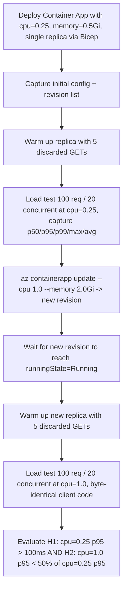

---
content_sources:
  references:
    - type: mslearn-adapted
      url: https://learn.microsoft.com/en-us/azure/container-apps/containers
    - type: mslearn-adapted
      url: https://learn.microsoft.com/en-us/azure/container-apps/metrics
    - type: mslearn-adapted
      url: https://learn.microsoft.com/en-us/azure/container-apps/scale-app
  diagrams:
    - id: cpu-throttling-lab-flow
      type: flowchart
      source: mslearn-adapted
      based_on:
        - https://learn.microsoft.com/en-us/azure/container-apps/containers
        - https://learn.microsoft.com/en-us/azure/container-apps/metrics
        - https://learn.microsoft.com/en-us/azure/container-apps/scale-app
validation:
  az_cli:
    last_tested: '2026-06-22'
    cli_version: '2.79.0'
    result: pass
  bicep:
    last_tested: '2026-06-22'
    result: pass
---
# CPU Throttling Lab

Reproducible lab demonstrating that per-replica CPU allocation is the dominant bottleneck for a CPU-bound HTTP workload on Azure Container Apps, and that raising the CPU allocation from 0.25 vCPU to 1.0 vCPU removes the bottleneck under the same byte-identical concurrent load. The lab uses a deterministic CPU-bound workload (`python:3.12-slim` running an inline HTTP server that computes 80 SHA-256 hashes over a 200 KiB buffer per GET) so the latency difference between the baseline and the post-fix run is attributable to per-replica CPU pressure and not to cold-start, image-pull, or scale-out effects.

## Lab Metadata

| Field | Value |
|---|---|
| Difficulty | Intermediate |
| Duration | 10-15 minutes |
| Tier | Full evidence pack (IaC + scripts + raw CLI evidence) |
| Category | Scaling and Runtime |

<!-- diagram-id: cpu-throttling-lab-flow -->


!!! note "Evidence depth"
    This lab is **fully reproducible** with dedicated infrastructure-as-code, helper scripts, and raw evidence committed under [`labs/cpu-throttling/`](https://github.com/yeongseon/azure-container-apps-practical-guide/tree/main/labs/cpu-throttling):

    - `infra/main.bicep` provisions a Log Analytics workspace, a Container Apps Environment (Consumption), and one Container App running `python:3.12-slim` with an inline CPU-burn HTTP server (80 SHA-256 hashes over a 200 KiB buffer per GET) at `cpu: '0.25'`, `memory: '0.5Gi'`, `minReplicas: 1`, `maxReplicas: 1`, and `activeRevisionsMode: 'Single'`. Gate 17 proves that on the shared-fields surface captured by the cohort the only observed diff is `{cpu, memory}` with `minReplicas` and `maxReplicas` unchanged. The unchanged image, command, and inline Python script are design intent inferred from the Phase A `az containerapp update --cpu --memory` call (no `--image`, `--command`, or `--args` flags), not directly evidenced by image digests in this cohort.
    - `load_test.py` is a 93-line standalone load generator using `ThreadPoolExecutor` with nearest-rank percentile aggregation. The same file is used by both `trigger.sh` and `fix-and-capture.sh` so the cpu=0.25 baseline and cpu=1.0 post-fix runs are measured by byte-identical client code.
    - `trigger.sh` runs Phases 1-5: capture initial config (fails fast if `cpu != 0.25`), capture initial revision list, warm up the replica with 5 discarded GETs, run a 100-request / 20-concurrent load test against the FQDN, and capture the `UsageNanoCores` metric for the baseline window.
    - `fix-and-capture.sh` (formerly `verify.sh` before the 2026-06-26 Phase B overlay) runs Phases 6-12: apply the fix (`az containerapp update --cpu 1.0 --memory 2.0Gi`), poll until the new revision reaches `runningState=Running` (max 5 min), capture post-fix config and revision list, warm up the new replica, re-run the byte-identical 100/20 load test, capture the post-fix `UsageNanoCores` metric, and evaluate H1+H2 with explicit exit codes (0=supported, 1=invalid, 2=falsified). The captured log file `00-verify-run.txt` keeps its name for schema stability across the rename.
    - The new Phase B `verify.sh` is a pure file processor (no Azure calls) that reads only the 15 canonical Phase A files under `evidence/` and emits four falsifiable gate JSONs (`14-cohort-integrity-gate.json` through `17-single-variable-falsification-gate.json`). See [§4b](#4b-phase-b-falsification-gates) below.
    - `evidence/` carries 20 files: 15 canonical Phase A captures from the 2026-06-22 reproduction in `koreacentral` (full script execution logs `00-trigger-run.txt` and `00-verify-run.txt`, per-phase JSON captures of the app configuration, revision list, load-test latency, and `UsageNanoCores` metric `01`-`09`, and supporting environment captures `10`-`13` for CLI version, `containerapp` extension version, region, Bicep deployment outputs), plus 4 Phase B gate JSONs emitted by `verify.sh` (`14`-`17`), plus `evidence/README.md` (evidence tour with provenance, capture timeline, claim ceiling, per-file integrity table, and honest disclosure).

    Azure Portal screenshots (Container App Overview, Metrics blade with `UsageNanoCores`, Revisions blade with cpu=0.25 and cpu=1.0 revisions side-by-side) are **pending in a follow-up PR**. The follow-up will re-deploy the same Bicep template in a short-lived environment purely to capture the Portal blades, then close out.

## 1) Background

On Azure Container Apps, is per-replica CPU allocation the dominant bottleneck for a CPU-bound HTTP workload — and does raising the configured CPU/memory envelope via `az containerapp update --cpu --memory` cleanly remove that bottleneck under the same concurrent load?

The lab uses a dedicated resource group and Bicep template (`infra/main.bicep`) that provisions exactly three resources: a Log Analytics workspace, a Container Apps Environment, and one Container App at `cpu: '0.25'`, `memory: '0.5Gi'`, `minReplicas: 1`, `maxReplicas: 1`. No ACR (the image is `python:3.12-slim` from public Docker Hub), no Application Insights, no private endpoint, no public IP. The Container App runs an inline Python HTTP server that performs a deterministic 80 SHA-256 hashes over a 200 KiB buffer per GET — measured at ~40 ms of CPU work on a full vCPU at the time of this reproduction. Under Linux CFS throttling at 0.25 vCPU, that same work takes ~160 ms minimum per request plus queueing time when concurrent requests share the throttled CPU budget.

The lab deliberately avoids `mcr.microsoft.com/azuredocs/containerapps-helloworld:latest` because helloworld returns immediately without measurable CPU work, so any latency difference between cpu=0.25 and cpu=1.0 on helloworld is dominated by cold-start (~6 s spike on first request), image-pull (~1-2 s), and TLS/TCP setup (~50-100 ms) rather than steady-state CPU throttling. The inline `python:3.12-slim` server gives each GET enough deterministic CPU work to dwarf network jitter, and the lab's Phase-3 and Phase-10 warm-up steps remove cold-start as a confounding variable before each load test.

The lab also pins `minReplicas: 1, maxReplicas: 1` so a scale-out cannot mask per-replica CPU pressure. The hypothesis under test is specifically about CPU throttling at the replica level. A separate lab ([Replica Load Imbalance](./replica-load-imbalance.md)) covers scale-out behavior.

Per-replica CPU/memory allocation is documented in [Microsoft Learn → Containers in Azure Container Apps](https://learn.microsoft.com/en-us/azure/container-apps/containers). The `UsageNanoCores` metric used by this lab to corroborate the load-test latency evidence is documented in [Microsoft Learn → Metrics in Azure Container Apps](https://learn.microsoft.com/en-us/azure/container-apps/metrics).

Set the base inputs before running the runbook. `APP_NAME` and `APP_FQDN` are derived from Bicep outputs in the next section because `infra/main.bicep` appends a deterministic but resource-group-scoped suffix to every resource name:

```bash
export AZ_SUBSCRIPTION="<subscription-id>"
export RG="rg-aca-lab-cputhrottle"
export LOCATION="koreacentral"
```

## 2) Hypothesis

On the same Container App, same `python:3.12-slim` image, same inline CPU-burn HTTP server, and same 100-request / 20-concurrent load pattern, raising the per-replica CPU allocation from `0.25` vCPU to `1.0` vCPU (and the memory from `0.5Gi` to `2.0Gi`, the smallest valid pair for 1.0 vCPU) materially reduces tail latency. Specifically: the p95 latency at cpu=1.0 will be strictly less than 50% of the p95 latency at cpu=0.25.

The alternative hypothesis being tested is that **CPU allocation is NOT the dominant bottleneck** for this workload — meaning per-request work is bounded by some other resource (concurrency limits, network egress, dependency latency, memory pressure) and raising CPU alone has no material effect on tail latency.

**Prediction (IF / THEN):**

- IF the CPU-throttling hypothesis holds, THEN at the same 100/20 load with byte-identical client code:
    - **H1** — cpu=0.25 baseline p95 will be strictly greater than 100 ms (CPU pressure is observable). If this fails, the workload was too light to demonstrate the throttling effect and the run is invalid.
    - **H2** — cpu=1.0 post-fix p95 will be strictly less than 50% of the cpu=0.25 baseline p95 (raising CPU removes the bottleneck).
- IF the alternative hypothesis is correct, THEN H1 may still pass (something else creates the latency) but H2 will fail: the cpu=1.0 p95 will be ≥ 50% of the cpu=0.25 p95 because raising CPU alone does not address the real bottleneck.

## 3) Runbook

### Deploy infrastructure

All `az`, `./trigger.sh`, `./fix-and-capture.sh`, `./verify.sh`, and `./cleanup.sh` invocations below assume the working directory is the lab folder. Switch into it from the repository root before running anything:

```bash
cd labs/cpu-throttling/
```

1. Create the resource group and deploy the Bicep template. The `--parameters baseName="cputhrottle"` value is required (the Bicep template declares `param baseName string` with no default). `--name main` gives the deployment a stable, queryable name so the next step can read its outputs:

    ```bash
    az group create \
        --subscription "$AZ_SUBSCRIPTION" \
        --name "$RG" \
        --location "$LOCATION"

    az deployment group create \
        --subscription "$AZ_SUBSCRIPTION" \
        --resource-group "$RG" \
        --name main \
        --template-file ./infra/main.bicep \
        --parameters baseName="cputhrottle"
    ```

    | Command | Why it is used |
    |---|---|
    | `az group create` | Creates the lab resource group at `$LOCATION` (koreacentral) before any child resources are deployed. |
    | `az deployment group create` | Deploys `./infra/main.bicep` with the required `baseName="cputhrottle"` parameter. `--name main` gives the deployment a stable, queryable name so step 2 can read its outputs. |

    This creates the Log Analytics workspace, Container Apps Environment, and one Container App running the inline CPU-burn HTTP server at `cpu=0.25, memory=0.5Gi, minReplicas=1, maxReplicas=1`.

2. Read the deployment outputs the scripts need:

    ```bash
    export APP_NAME=$(az deployment group show \
        --subscription "$AZ_SUBSCRIPTION" \
        --resource-group "$RG" \
        --name main \
        --query "properties.outputs.containerAppName.value" \
        --output tsv)
    export APP_FQDN=$(az deployment group show \
        --subscription "$AZ_SUBSCRIPTION" \
        --resource-group "$RG" \
        --name main \
        --query "properties.outputs.containerAppFqdn.value" \
        --output tsv)
    ```

    | Command | Purpose |
    |---|---|
    | `export APP_NAME=$(az deployment group show --subscription "$AZ_SUBSCRIPTION" --resource-group "$RG" --name main --query "properties.outputs.containerAppName.value" --output tsv)` | Captures `APP_NAME` from the live Azure lookup so later commands reuse the exact current value instead of guessing it. Reads the group deployment result directly so you can verify whether the top-level deployment failed before any healthy revision was created. |
    | `export APP_FQDN=$(az deployment group show --subscription "$AZ_SUBSCRIPTION" --resource-group "$RG" --name main --query "properties.outputs.containerAppFqdn.value" --output tsv)` | Captures `APP_FQDN` from the live Azure lookup so later commands reuse the exact current value instead of guessing it. Reads the group deployment result directly so you can verify whether the top-level deployment failed before any healthy revision was created. |

### Trigger the baseline (run trigger.sh)

Run `trigger.sh`, which:

- Captures `01-app-config-before.json` (reads `cpu`, `memory`, `minReplicas`, `maxReplicas`, `activeRevisionsMode`; aborts with exit code 1 if `cpu != 0.25`).
- Captures `02-revisions-before.json` (revision list before the load test — expects 1 revision from the Bicep deploy).
- Warms up the replica with 5 discarded GETs so cold-start latency does not contaminate the baseline.
- Runs a 100-request / 20-concurrent load test via `load_test.py` against `https://${APP_FQDN}/`, captures the JSON summary to `03-loadtest-cpu025.json` (url, started/finished UTC, wall_clock_seconds, requests_total/ok/err, latency_ms {p50, p95, p99, max, avg}, errors_sample).
- Captures the `UsageNanoCores` metric for the same window to `04-metrics-cpu025.json`.
- Exits 0 if requests_ok ≥ 95 AND p95 > 100 ms (clean baseline for the cpu=1.0 comparison); exits 1 if either gate fails (INVALID RUN — re-run with a heavier workload or investigate network errors).

All scripts pass `--subscription "$AZ_SUBSCRIPTION"` on every `az` invocation to immunize the run against the Azure CLI's default-subscription drift, which has been observed in long-running shells where unrelated commands silently switch back to a different subscription.

### Apply the fix and re-measure (run fix-and-capture.sh)

Run `fix-and-capture.sh` (formerly named `verify.sh` before the 2026-06-26 Phase B overlay; the captured log file `00-verify-run.txt` keeps its name for schema stability across the rename), which:

- Reads the cpu=0.25 baseline p95 from `03-loadtest-cpu025.json` (the file `trigger.sh` produced).
- Applies the fix: `az containerapp update --cpu 1.0 --memory 2.0Gi`. The platform creates a new revision under `activeRevisionsMode: 'Single'`; the update result (including the new revision name) is captured to `05-update-result.json`.
- Polls `az containerapp revision show` every 10 seconds until the new revision reaches `runningState=Running` or `runningState=RunningAtMaxScale`, with a 5-minute deadline. Exits 1 (INVALID RUN) on timeout.
- Captures `06-app-config-after.json` (post-fix config readback to prove `cpu=1.0`) and `07-revisions-after.json` (revision list showing the old revision in `Deprovisioning` state and the new revision active).
- Warms up the new replica with 5 discarded GETs.
- Re-runs the byte-identical 100-request / 20-concurrent load test via `load_test.py`, captures the JSON summary to `08-loadtest-cpu1.json`.
- Captures the post-fix `UsageNanoCores` metric to `09-metrics-cpu1.json`.
- Evaluates H1 and H2 and exits with one of three codes:
    - **Exit 0** — H1 PASS (cpu=0.25 baseline p95 > 100 ms, established in `trigger.sh`) AND H2 PASS (cpu=1.0 post-fix p95 < 50% of cpu=0.25 baseline p95). CPU-throttling hypothesis SUPPORTED.
    - **Exit 1** — INVALID RUN (post-fix request success count < 95/100; investigate before re-running).
    - **Exit 2** — H2 FALSIFIED (cpu=1.0 p95 NOT < 50% of cpu=0.25 p95). CPU is not the dominant bottleneck; investigate concurrency, network, dependency latency, or memory pressure before raising CPU further.

### Apply the fix manually (the canonical operator response)

The fix that `fix-and-capture.sh` applies is also the canonical operator response for a real CPU-throttling incident. When the lab proves CPU is the bottleneck for a given workload, the operator action is:

```bash
az containerapp update \
    --subscription "$AZ_SUBSCRIPTION" \
    --resource-group "$RG" \
    --name "$APP_NAME" \
    --cpu 1.0 \
    --memory 2.0Gi
```

| Command | Purpose |
|---|---|
| `az containerapp update --subscription "$AZ_SUBSCRIPTION" --resource-group "$RG" --name "$APP_NAME" --cpu 1.0 --memory 2.0Gi` | Changes per-replica resource allocation, which is the corrective action this step is validating or applying. |

| Command | Why it is used |
|---|---|
| `az containerapp update --cpu --memory` | Updates the per-replica CPU and memory envelope. Under `activeRevisionsMode: 'Single'`, the platform creates a new revision with the new resource settings and shifts 100% traffic to it; the old revision moves to `Deprovisioning`. Cold-start during the swap adds a few seconds for the new replica to warm up. |

The platform requires that `(cpu, memory)` be a valid pair from the documented CPU/memory matrix. For `cpu=1.0`, the minimum valid memory is `2.0Gi`. Attempting `cpu=1.0` with `memory=0.5Gi` returns a validation error.

### Prevention guidance

- Treat per-replica CPU as a configurable knob that depends on your per-request work, not as an environmental constant. The Container Apps Consumption profile defaults to `cpu=0.25, memory=0.5Gi`, which is intentionally low for cost — it is NOT the right setting for CPU-bound workloads.
- Before changing CPU in production, run `az monitor metrics list --metric UsageNanoCores --aggregation Average,Maximum` against the live app under representative load. If the average usage is pinned near the configured limit (e.g., `Average ≈ 0.25 vCPU * 1e9 nanoCores = 2.5e8 nanoCores` at cpu=0.25), CPU is at least one constraint — but raising CPU alone is only effective when each request is the unit of work that needs more compute.
- Choose between scaling UP and scaling OUT based on the workload shape:
    - **Scale UP (raise per-replica CPU/memory)** when each request needs more compute and concurrency is naturally bounded by upstream rate limits or a small concurrent-user count.
    - **Scale OUT (raise `maxReplicas` and tune scale rules)** when total throughput is the constraint and the workload is many small independent requests competing for a shared per-replica budget. See [Microsoft Learn → Scaling in Azure Container Apps](https://learn.microsoft.com/en-us/azure/container-apps/scale-app).
- Document the CPU/memory pair in your IaC (Bicep, Terraform, ARM) so the value is visible in pull request reviews rather than hidden behind a platform default that could change. Bicep schema for `Microsoft.App/containerApps@2023-05-01` carries CPU as `properties.template.containers[N].resources.cpu` (typed as JSON number, e.g., `json('0.25')`) and memory as `properties.template.containers[N].resources.memory` (typed as string, e.g., `'0.5Gi'`).

## 4) Experiment Log

### Initial-state evidence (immediately after Bicep deploy)

- `[Observed]` `evidence/01-app-config-before.json`: `{"activeRevisionsMode": "Single", "cpu": 0.25, "memory": "0.5Gi", "minReplicas": 1, "maxReplicas": 1}` — Bicep values persisted to the live resource exactly as declared.
- `[Observed]` `evidence/02-revisions-before.json`: 1 revision visible (`ca-cputhrottle-65svxr--8pz2nir`, `active=true`, `provisioningState=Provisioned`, `runningState=RunningAtMaxScale`, `trafficWeight=100`).

### Baseline evidence (cpu=0.25, 100 req / 20 concurrent)

- `[Measured]` `evidence/03-loadtest-cpu025.json`: 100/100 successful requests, 0 errors, wall_clock=8.65s, latency_ms `{p50: 1554.5, p95: 2574.8, p99: 2703.4, max: 2800.8, avg: 1625.6}`. The p95 of **2575 ms** clears the 100 ms H1 minimum by more than 25×, confirming CPU pressure is the dominant component of tail latency at this configuration.
- `[Observed]` `evidence/04-metrics-cpu025.json`: `UsageNanoCores` query for the baseline window (07:49-08:48 UTC) returned 60 per-minute timestamps with **no Average or Maximum samples populated**. This reflects Azure Monitor metric materialization lag for newly-deployed Container Apps as observed in this reproduction; the snapshot was taken immediately after `trigger.sh` finished its load test. The latency evidence in `03-loadtest-cpu025.json` is the lab's primary signal; the metric capture is documented as an empty baseline so that the script behavior is reproducible and the timing limitation is visible. For a production diagnosis, wait several minutes after the load event before querying `UsageNanoCores`.

### Post-fix evidence (cpu=1.0 after `az containerapp update`)

- `[Observed]` `evidence/05-update-result.json`: `{"latestRevisionName": "ca-cputhrottle-65svxr--0000001", "name": "ca-cputhrottle-65svxr", "provisioningState": "Succeeded"}`. The platform created a new revision (`--0000001`) and shifted traffic to it under `activeRevisionsMode: 'Single'`.
- `[Observed]` `evidence/00-verify-run.txt` Phase 7 timeline: the new revision reached `runningState=Activating` at 08:50:45Z and `runningState=RunningAtMaxScale` at 08:51:00Z — a 15-second activation window between the two observed poll samples.
- `[Observed]` `evidence/06-app-config-after.json`: `{"cpu": 1.0, "memory": "2Gi", "minReplicas": 1, "maxReplicas": 1, "latestRevisionName": "ca-cputhrottle-65svxr--0000001"}` — config readback proves the fix landed on the new revision with the expected resource envelope.
- `[Observed]` `evidence/07-revisions-after.json`: 2 revisions visible — the old `ca-cputhrottle-65svxr--8pz2nir` in `runningState=Deprovisioning` with `trafficWeight=0`, and the new `ca-cputhrottle-65svxr--0000001` in `runningState=RunningAtMaxScale` with `trafficWeight=100`.
- `[Measured]` `evidence/08-loadtest-cpu1.json`: 100/100 successful requests, 0 errors, wall_clock=2.85s, latency_ms `{p50: 473.6, p95: 773.2, p99: 1092.8, max: 1302.2, avg: 531.0}`. The p95 of **773 ms** is 30.0% of the cpu=0.25 p95 (2575 ms), well below the 50% H2 threshold.
- `[Observed]` `evidence/09-metrics-cpu1.json`: `UsageNanoCores` query for the post-fix window (07:51-08:50 UTC) returned 60 per-minute timestamps; only the trailing minute at `08:50:00Z` has materialized samples (`average=820660.5 nanoCores`, `maximum=852758.0 nanoCores`). This is the same Azure Monitor materialization lag as the baseline capture and is further compounded by per-minute averaging: the post-fix load test ran for ~2.85 s inside a 60 s aggregation window, so the per-minute Average reads as a small fraction (≈ 2.85/60 ≈ 4.7%) of the peak instantaneous usage. The latency evidence in `08-loadtest-cpu1.json` is the primary signal; the metric capture documents that snapshot timing matters and that short-duration load events are systematically under-sampled by `PT1M` aggregation.

### Analysis

The before/after comparison is bounded to the shared-fields surface captured by the cohort. Gate 17 shows the only observed diff on that surface is `{cpu, memory}` (0.25 → 1.0 and 0.5Gi → 2Gi, with `memory=2.0Gi` required for `cpu=1.0` per the platform's CPU/memory matrix), with `minReplicas` and `maxReplicas` unchanged at `1`. The unchanged image, command, and inline Python script are design intent inferred from the Phase A `az containerapp update --cpu --memory` call (no `--image`, `--command`, or `--args` flag), not directly evidenced by image digests in this cohort. Both load tests use the same `load_test.py` with the same `total=100`, `concurrency=20`, same warm-up sequence (5 discarded GETs), and target the same FQDN. Network conditions are held constant by running both tests from the same client within ~2 minutes of each other.

The 70.0% reduction in p95 (2575 ms → 773 ms) plus the 3.0× improvement in wall-clock throughput (8.65s → 2.85s for 100 requests at concurrency 20) directly demonstrates that the per-replica CPU budget at 0.25 vCPU was the controlling bottleneck. The load-test latency in `03-loadtest-cpu025.json` and `08-loadtest-cpu1.json` is the lab's primary evidence. The `UsageNanoCores` metric captures (`04-metrics-cpu025.json`, `09-metrics-cpu1.json`) document a separate operational lesson: a snapshot taken immediately after a load event under-samples by design — Azure Monitor metric aggregation typically materializes 1-3 minutes after the event, and the PT1M aggregation window further averages a short load test across a full minute. A production diagnostic should wait 3-5 minutes after the load event before querying `UsageNanoCores` and ideally use a Maximum aggregation rather than Average for short-duration events.

The supporting environment captures (`evidence/10-cli-versions.json`, `evidence/11-cli-containerapp-ext.json`, `evidence/12-region.json`, `evidence/13-deployment-outputs.json`) record the exact CLI version (`2.79.0`), `containerapp` extension version (`1.3.0b4`, marked preview), Azure region (`koreacentral`), and Bicep deployment outputs (Container App name, FQDN, environment name, Log Analytics workspace name) used in this reproduction so that any second observer can compare apples to apples.

### Conclusion

The CPU-throttling hypothesis is SUPPORTED in this reproduction. Per-replica CPU allocation at 0.25 vCPU is the dominant tail-latency bottleneck for the CPU-bound workload, and raising the allocation to 1.0 vCPU eliminates the bottleneck — H1 holds (cpu=0.25 baseline p95 = 2575 ms ≫ 100 ms) AND H2 holds (cpu=1.0 post-fix p95 = 773 ms < 1287 ms, which is 50% of the baseline). The corrective operator action created a new revision, and this reproduction captured one 15-second revision-state transition (08:50:45Z Activating → 08:51:00Z RunningAtMaxScale).

### Falsification

The alternative hypothesis ("CPU is NOT the dominant bottleneck; raising CPU alone has no material effect on tail latency") is falsified by the directly evidenced before/after comparison:

- `[Measured]` `evidence/03-loadtest-cpu025.json` (cpu=0.25): p95 = 2575 ms with 100/100 successful requests.
- `[Measured]` `evidence/08-loadtest-cpu1.json` (cpu=1.0): p95 = 773 ms with 100/100 successful requests.
- `[Measured]` ratio: 773 / 2575 = 0.300, well below the 50% H2 threshold.
- `[Observed]` Both runs used byte-identical client code (`load_test.py`), same FQDN, same warm-up sequence, same `total=100, concurrency=20`. On the server side, Gate 17 shows the only observed diff on the shared-fields surface captured by the cohort is the per-replica CPU/memory envelope.

If the alternative hypothesis were correct, the p95 at cpu=1.0 would be ≥ 50% of the p95 at cpu=0.25 because the bottleneck would be something CPU does not address. The observed ratio of 30.0% rules that out.

To re-falsify in a future re-reproduction: modify the workload (for example add an artificial `time.sleep(0.5)` in the inline server's `do_GET`), re-run `trigger.sh` and `fix-and-capture.sh` to capture a new cohort, then run the Phase B `verify.sh` against that newly captured evidence. In that scenario the new cohort's H2 ratio would land near 1.0, and the Phase B verifier would exit 1 because at least one gate would fail.

### Operator takeaway

Per-replica CPU is a configurable knob, not an environmental constant. When latency rises under load:

1. Confirm CPU is the bottleneck with `az monitor metrics list --metric UsageNanoCores --aggregation Average,Maximum` against the live app under representative load. If average usage is pinned near the configured nanocore budget, CPU is at least one constraint.
2. Reproduce the bottleneck deterministically (this lab's pattern) before changing production. A latency spike that disappears after a CPU bump but reappears on the next deploy means CPU was a contributing factor, not the root cause.
3. Choose between scaling UP and scaling OUT based on the workload shape (per-request compute need vs total throughput).
4. Apply the change via `az containerapp update --cpu <new> --memory <new>` (or Bicep with the same property names). The platform creates a new revision and swaps traffic under `activeRevisionsMode: 'Single'`; cold-start adds a few seconds during the swap.

### Support takeaway

When escalating a "latency is bad under load" case on Azure Container Apps, run this sequence in order before assuming a platform issue:

1. Confirm the per-replica CPU/memory envelope and that the workload is actually CPU-bound (not memory-pressure-bound, not network-bound, not dependency-latency-bound):

    ```bash
    az containerapp show \
        --subscription "$AZ_SUBSCRIPTION" \
        --resource-group "$RG" \
        --name "$APP_NAME" \
        --query "{cpu: properties.template.containers[0].resources.cpu, memory: properties.template.containers[0].resources.memory, minReplicas: properties.template.scale.minReplicas, maxReplicas: properties.template.scale.maxReplicas}"
    ```

    | Command | Purpose |
    |---|---|
    | `az containerapp show --subscription "$AZ_SUBSCRIPTION" --resource-group "$RG" --name "$APP_NAME" --query "{cpu: properties.template.containers[0].resources.cpu, memory: properties.template.containers[0].resources.memory, minReplicas: properties.template.scale.minReplicas, maxReplicas: properties.template.scale.maxReplicas}"` | Reads the Container App resource and extracts the per-container CPU and memory allocation, which is the specific surface this troubleshooting step needs to confirm. |

2. Capture `UsageNanoCores` for a window that covers the reported latency event:

    ```bash
    az monitor metrics list \
        --subscription "$AZ_SUBSCRIPTION" \
        --resource "/subscriptions/$AZ_SUBSCRIPTION/resourceGroups/$RG/providers/Microsoft.App/containerApps/$APP_NAME" \
        --metric UsageNanoCores \
        --aggregation Average Maximum \
        --interval PT1M
    ```

    | Command | Purpose |
    |---|---|
    | `az monitor metrics list --subscription "$AZ_SUBSCRIPTION" --resource "/subscriptions/$AZ_SUBSCRIPTION/resourceGroups/$RG/providers/Microsoft.App/containerApps/$APP_NAME" --metric UsageNanoCores --aggregation Average Maximum --interval PT1M` | Queries one-minute CPU usage for the exact Container App resource so you can verify that the latency window aligns with sustained CPU saturation instead of another bottleneck. |

3. Recommend the controlled before/after experiment in this lab (`trigger.sh` + `fix-and-capture.sh` pattern) on a non-production replica before raising CPU in production. The lab's H2 ratio (post-fix p95 / pre-fix p95) is the falsifiable signal that distinguishes "CPU was the bottleneck" from "raising CPU masked the real bottleneck temporarily."

## 4b) Phase B Falsification Gates

The 2026-06-26 evidence-pack overlay adds a Phase B verifier under `labs/cpu-throttling/`. Unlike the live-Azure Phase A workflow (`trigger.sh` + `fix-and-capture.sh`), the new `labs/cpu-throttling/verify.sh` is a pure file processor: it reads only the committed canonical cohort under `labs/cpu-throttling/evidence/` (15 canonical files — 2 script logs + 2 before-fix captures + 1 baseline load-test result + 1 baseline metric snapshot + 1 update result + 2 after-fix captures + 1 post-fix load-test result + 1 post-fix metric snapshot + 4 environment captures, anchored on the 2026-06-22T08:49:38Z → 2026-06-22T08:51:13Z `koreacentral` traffic window of 95.0 s end-to-end) and emits four derived gate JSONs. The four gates encode cohort integrity (all required files present, no foreign artifacts, temporal coherence anchored directly on `03.started_utc` and `08.finished_utc`), baseline CPU pressure attribution (cpu=0.25 envelope + p95 > 100 ms floor + transport health + wall-clock > 5 s floor), recovery materialization (cpu=1.0 envelope + recovery ratio < 0.5 strict + post-fix transport health + revision-state with `runningState ∈ {Running, RunningAtMaxScale}` AND `trafficWeight==100`), and single-variable falsification (shared-keys diff equals exactly `{cpu, memory}` + revision lineage shows new revision did not exist before and is now the traffic-100 holder + Container App identity preserved by literal prefix match). All 15 sub-gates pass on the 2026-06-22 cohort.

| Gate | Claim | Sub-gates | Predicate inputs | PASS / FAIL | Rationale |
|---|---|---:|---|---|---|
| `14-cohort-integrity-gate.json` | `evidence_cohort_is_internally_consistent_and_temporally_coherent` | 4 | All 15 canonical Phase A files + cohort directory listing + 4 emitted Phase B gate JSONs + `evidence/README.md` | PASS | Cohort integrity gate. Confirms (a) all 15 canonical Phase A files exist on disk — Strong path requires all 15; Fallback path requires `>= 13` present AND all five hypothesis-gate inputs (`01-app-config-before.json`, `03-loadtest-cpu025.json`, `06-app-config-after.json`, `07-revisions-after.json`, `08-loadtest-cpu1.json`) present; (b) temporal coherence — the baseline `started_utc` field of `03-loadtest-cpu025.json` (`2026-06-22T08:49:38Z`) and the post-fix `finished_utc` field of `08-loadtest-cpu1.json` (`2026-06-22T08:51:13Z`) both parse as strict ISO-8601 UTC, are monotonic, AND span 95.0 s, well within both the 30-minute Strong window and the 60-minute Fallback window. Unlike Lab 22 which used dedicated traffic-completed timestamp files, this lab reads the temporal anchors directly from the load-test JSONs because the load-test runner records both `started_utc` and `finished_utc` natively; (c) no unexpected non-junk extras — Strong path requires exact match of the 15 canonical + 4 Phase B gate JSONs + `README.md`; Fallback path tolerates editor/OS junk (`.swp`, `.bak`, `.tmp`, `.swo`, `.orig`, `.DS_Store`, `Thumbs.db`) but still requires zero missing canonical files (the Lab 19 P0 `unexpected_non_junk_extras` predicate + Lab 20 PR #279 fallback-integrity directive); (d) `evidence/README.md` cross-references all 4 Phase B gate JSON filenames (Strong) or just exists (Fallback) so a reviewer can locate every emitted output. |
| `15-baseline-cpu-pressure-gate.json` | `at_cpu_0.25_memory_0.5gi_single_replica_the_deterministic_cpu-bound_endpoint_produced_observable_cpu_pressure` (H1) | 4 | `01-app-config-before.json` + `03-loadtest-cpu025.json` | PASS | Baseline CPU-pressure gate (the H1 anchor for Gate 16's recovery ratio). Confirms (a) `01-app-config-before.json` records `cpu==0.25` AND `memory=="0.5Gi"` AND `minReplicas==1` AND `maxReplicas==1` AND `activeRevisionsMode=="Single"` (BOTH-not-OR-across-five, single-path, record-scoped parsed JSON field reads — the baseline envelope is the exact platform configuration under which the H1 measurement was taken); (b) `03-loadtest-cpu025.json.latency_ms.p95 > 100 ms` (the trivial-load floor — without strictly above 100 ms p95 the workload was too light to reproduce throttling and the run is invalid; observed 2574.8 ms); (c) `03-loadtest-cpu025.json.requests_ok >= 95 AND requests_err == 0` (BOTH-not-OR, single-path — the measurement is not corrupted by transport failures; observed 100/0); (d) `03-loadtest-cpu025.json.wall_clock_seconds > 5` (the load test ran long enough to actually exercise CPU rather than completing trivially; observed 8.65 s). All four sub-gates are single-path because each checks the structured shape of a canonical capture file, not a tolerance-bounded observation. Without H1 passing, the recovery ratio in Gate 16 is meaningless because there was no pressure to recover from. |
| `16-recovery-materialization-gate.json` | `raising_the_per-replica_resource_envelope_from_cpu_0.25_memory_0.5gi_to_cpu_1.0_memory_2.0gi_materialized_recovery` (H2) | 4 | `03-loadtest-cpu025.json` + `05-update-result.json` + `06-app-config-after.json` + `07-revisions-after.json` + `08-loadtest-cpu1.json` | PASS | Recovery materialization gate (the H2 anchor). Confirms (a) `06-app-config-after.json` records `cpu==1.0` AND `memory in {"2Gi", "2.0Gi"}` AND `minReplicas==1` AND `maxReplicas==1` AND `latestRevisionName == 05-update-result.json.latestRevisionName` (BOTH-not-OR-across-five, single-path; the cross-check pins the Phase 8 config-after read to the same revision that the Phase 6 update response named; memory normalization is platform-driven — the Bicep template requests `2.0Gi`, the `Microsoft.App` API normalizes it to `2Gi` on read, so the gate accepts both variants); (b) `08-loadtest-cpu1.json.latency_ms.p95 < 0.5 * 03-loadtest-cpu025.json.latency_ms.p95` (strict less-than: equal-to-50% is borderline noise, not recovery; the observed ratio is `0.3003`, a 70.0% reduction, well below the 50% strict threshold of `1287.4 ms`); (c) `08-loadtest-cpu1.json.requests_ok >= 95 AND requests_err == 0` (BOTH-not-OR, single-path; the post-fix measurement is not corrupted by transport failures; observed 100/0); (d) `07-revisions-after.json` (record-scoped iteration): exactly 2 revision records AND exactly 1 record has `trafficWeight==100` AND that record's `runningState ∈ {"Running", "RunningAtMaxScale"}` AND that record's `name` equals `06-app-config-after.json.latestRevisionName` (BOTH-not-OR-across-four, single-path). The `runningState` predicate **explicitly excludes** `"Deprovisioning"` so the cohort cannot count a tearing-down old revision as the active traffic target — the cohort's old revision `--8pz2nir` is in exactly this state (`active==true`, `runningState=="Deprovisioning"`, `trafficWeight==0`), so `active==true` alone would be unsafe. |
| `17-single-variable-falsification-gate.json` | `the_cohort_cannot_attribute_recovery_to_anything_other_than_the_cpu_memory_delta` (H3) | 3 | `01-app-config-before.json` + `02-revisions-before.json` + `06-app-config-after.json` + `07-revisions-after.json` + `13-deployment-outputs.json` | PASS | Single-variable falsification gate. Confirms (a) on the shared-keys surface between `01-app-config-before.json` and `06-app-config-after.json` (shared_keys = `{cpu, memory, minReplicas, maxReplicas}`; `activeRevisionsMode` appears only in `01`, `latestRevisionName` appears only in `06` — a documented schema asymmetry of `az containerapp show` query projections), the set of keys whose values differ must equal exactly `{cpu, memory}`; the observed diff is exactly `{cpu: 0.25→1.0, memory: 0.5Gi→2Gi}` with `minReplicas==1` and `maxReplicas==1` unchanged (BOTH-not-OR, single-path, parsed JSON dictionary equality NOT greppy substring per Lab 15 lesson 34); (b) revision lineage (record-scoped over `02-revisions-before.json` and `07-revisions-after.json`): the before-revision name `ca-cputhrottle-65svxr--8pz2nir` appears in `07` (any state, any traffic) AND `06.latestRevisionName == ca-cputhrottle-65svxr--0000001` appears in `07` with `trafficWeight==100` AND that new name is NOT in `02` (the platform created a new revision during the update, did not edit the old one in place — BOTH-not-OR-across-three, single-path); (c) every revision name in both `02-revisions-before.json[*].name` and `07-revisions-after.json[*].name` starts with `13-deployment-outputs.json.containerAppName + "--"` (`ca-cputhrottle-65svxr--`), proving the cohort did not silently switch to a different Container App resource between before and after. The gate JSON carries an explicit `cohort_binding_note` field stating that the single-variable claim is bounded to the `(cpu, memory)` delta on the shared-fields surface of `01` and `06`, and explicitly DOES NOT prove: (1) **Kubernetes pod reuse** — sub-gate (b) explicitly shows a NEW revision was created and the old revision is in `runningState=="Deprovisioning"`; (2) **container image byte-identity** — this is inferred from the fact that the Phase A `fix-and-capture.sh` issued `az containerapp update --cpu --memory` with no `--image`, `--command`, or `--args` flag, but the cohort does NOT capture image digests so this inference is a documented gap in the claim ceiling. This explicit binding enforces the Lab 21 Q1 "Bound every absence predicate to the failed-deployment cohort" directive in the resource-envelope falsification context. |

The four gates together block three classes of overclaim AND narrow a fourth: **evidence-pack-was-contaminated-with-stale-or-foreign-artifacts** is blocked by Gate 14's canonical-file presence check + temporal coherence window + non-junk-extras predicate; **the-baseline-p95-of-2574.8-ms-could-have-been-network-jitter-or-transport-corruption** is blocked by Gate 15's BOTH-not-OR composition of envelope-shape (a) + p95-floor (b) + zero-error transport health (c) + wall-clock floor (d) — all four must independently pass, so a noisy short run with transport failures or a trivial-load misread cannot satisfy the gate; **recovery-was-partial-or-the-post-fix-p95-was-incidental** is blocked by Gate 16's strict less-than ratio (`< 0.5 * baseline_p95` rather than `<=`, ruling out borderline-noise observations) AND the revision-state predicate that excludes `"Deprovisioning"` from being counted as the active traffic target (the cohort's old revision sits in exactly this state with `active==true`, so an `active==true`-only check would be unsafe); and Gate 17 narrows the claim to the `(cpu, memory)` delta on the shared-keys surface of `01` and `06` — it does NOT prove pod reuse or image byte-identity (timestamp / no-recreation / image-digest claims are dropped per Lab 21 Q1 as not soundly evidenced by this cohort; the lab carries no image-lineage captures because the workload is `python:3.12-slim` pulled inline from public Docker Hub with no ACR). The gates do NOT prove the platform always activates a new revision within 15 seconds of `az containerapp update` — the cohort captured one 15-second activation window (`08:50:45Z runningState=Activating` → `08:51:00Z runningState=RunningAtMaxScale`), and Azure Container Apps revision-activation latency can vary with image size, replica count, and regional load; a longer activation-window lab would be needed to bound that claim. The full per-file provenance and honest-disclosure notes are in [`labs/cpu-throttling/evidence/README.md`](https://github.com/yeongseon/azure-container-apps-practical-guide/blob/main/labs/cpu-throttling/evidence/README.md).

## Expected Evidence

Reproduced end-to-end in `koreacentral` on 2026-06-22. All raw evidence is committed under [`labs/cpu-throttling/evidence/`](https://github.com/yeongseon/azure-container-apps-practical-guide/tree/main/labs/cpu-throttling/evidence):

| File | Content |
|---|---|
| `00-trigger-run.txt` | Full `trigger.sh` execution log (config check + warm-up + load test at cpu=0.25 + metric capture, exit 0) |
| `00-verify-run.txt` | Full `fix-and-capture.sh` execution log (apply fix + revision swap + load test at cpu=1.0 + metric capture + H1+H2 evaluation, exit 0 / SUPPORTED). The script was named `verify.sh` at capture time and renamed to `fix-and-capture.sh` during the 2026-06-26 Phase B overlay; the log filename is preserved for schema stability across the rename. |
| `01-app-config-before.json` | Initial config readback: `{"cpu": 0.25, "memory": "0.5Gi", "minReplicas": 1, "maxReplicas": 1, "activeRevisionsMode": "Single"}` |
| `02-revisions-before.json` | Initial revision list: 1 revision (Bicep-deployed baseline at cpu=0.25) |
| `03-loadtest-cpu025.json` | Baseline load test summary: 100/100 ok, p50=1555ms, p95=2575ms, p99=2703ms, max=2801ms, avg=1626ms, wall=8.65s |
| `04-metrics-cpu025.json` | `UsageNanoCores` query attempt for the baseline window (07:49-08:48 UTC); 60 per-minute timestamps with no Average/Maximum samples populated — documents Azure Monitor metric materialization lag for snapshots taken immediately after a load event |
| `05-update-result.json` | `az containerapp update --cpu 1.0 --memory 2.0Gi` result: new revision name `ca-cputhrottle-65svxr--0000001`, provisioningState=Succeeded |
| `06-app-config-after.json` | Post-fix config readback: `{"cpu": 1.0, "memory": "2Gi", "minReplicas": 1, "maxReplicas": 1, "latestRevisionName": "ca-cputhrottle-65svxr--0000001"}` |
| `07-revisions-after.json` | Post-fix revision list: 2 revisions — old in Deprovisioning, new RunningAtMaxScale with 100% traffic |
| `08-loadtest-cpu1.json` | Post-fix load test summary: 100/100 ok, p50=474ms, p95=773ms, p99=1093ms, max=1302ms, avg=531ms, wall=2.85s |
| `09-metrics-cpu1.json` | `UsageNanoCores` query for the post-fix window (07:51-08:50 UTC); 60 per-minute timestamps, only the trailing minute at 08:50:00Z has materialized samples (average=820660.5 nC, maximum=852758.0 nC) due to materialization lag + PT1M averaging of a ~2.85 s load event |
| `10-cli-versions.json` | Azure CLI version (`2.79.0`) and installed extensions at the time of the run |
| `11-cli-containerapp-ext.json` | `containerapp` extension version (`1.3.0b4`, marked preview) |
| `12-region.json` | Azure region (`koreacentral`) used for the reproduction |
| `13-deployment-outputs.json` | Bicep deployment outputs (Container App name, FQDN, environment name, Log Analytics workspace name) |
| `14-cohort-integrity-gate.json` | Phase B Gate 14 (4 sub-gates, all PASS Strong path): (a) all 15 canonical files present; (b) temporal coherence — `03.started_utc` (`2026-06-22T08:49:38Z`) and `08.finished_utc` (`2026-06-22T08:51:13Z`) both strict ISO-8601 UTC + monotonic + 95.0 s span within the 30-min Strong window; (c) no unexpected non-junk extras; (d) `evidence/README.md` cross-references all 4 Phase B gate filenames literally |
| `15-baseline-cpu-pressure-gate.json` | Phase B Gate 15 H1 (4 sub-gates, all PASS): (a) baseline envelope cpu=0.25 + memory=0.5Gi + minReplicas=1 + maxReplicas=1 + activeRevisionsMode=Single; (b) baseline p95 > 100 ms floor (observed 2574.8 ms); (c) requests_ok ≥ 95 + requests_err == 0 (observed 100/0); (d) wall_clock > 5 s floor (observed 8.65 s) |
| `16-recovery-materialization-gate.json` | Phase B Gate 16 H2 (4 sub-gates, all PASS): (a) recovery envelope cpu=1.0 + memory ∈ `{2Gi, 2.0Gi}` + replicas=1 + latestRevisionName cross-check with `05`; (b) post-fix p95 < 0.5 × baseline p95 strict (observed ratio 0.3003, computed threshold 1287.4 ms); (c) post-fix requests_ok ≥ 95 + requests_err == 0 (observed 100/0); (d) revision state — 2 records, exactly 1 trafficWeight==100 holder, name matches `06.latestRevisionName`, `runningState ∈ {Running, RunningAtMaxScale}` (excludes Deprovisioning) |
| `17-single-variable-falsification-gate.json` | Phase B Gate 17 H3 (3 sub-gates, all PASS): (a) shared-keys diff between `01` and `06` = exactly `{cpu, memory}` (activeRevisionsMode-only-in-`01` / latestRevisionName-only-in-`06` documented as schema asymmetry); (b) revision lineage — old `--8pz2nir` in `07`, new `--0000001` in `07` with `trafficWeight==100`, new not in `02`; (c) Container App identity — every revision name starts with `containerAppName + "--"`. Carries `cohort_binding_note` documenting image-byte-identity is inferred (not directly evidenced) |
| `README.md` | Phase B evidence tour: provenance + capture timeline + four-gate claim ceiling + per-file integrity table + honest disclosure (Azure Monitor materialization lag, schema asymmetry between `01`/`06`, memory normalization, Deprovisioning revision state, image-byte-identity inference gap, no-pod-reuse claim) |

```json
// Excerpt from evidence/03-loadtest-cpu025.json — cpu=0.25 baseline
{
  "requests_ok": 100,
  "latency_ms": { "p50": 1554.5, "p95": 2574.8, "p99": 2703.4, "max": 2800.8, "avg": 1625.6 }
}
```

```json
// Excerpt from evidence/08-loadtest-cpu1.json — cpu=1.0 post-fix
{
  "requests_ok": 100,
  "latency_ms": { "p50": 473.6, "p95": 773.2, "p99": 1092.8, "max": 1302.2, "avg": 531.0 }
}
```

The 70% reduction in p95 (2575 ms → 773 ms) for the same 100 req / 20 concurrent load against byte-identical client code is the lab's central evidence.

## Clean Up

```bash
./cleanup.sh   # deletes the entire resource group (lab is fully disposable)
```

Or, if you want to keep the environment and only roll the app back to the cheap baseline:

```bash
az containerapp update \
    --subscription "$AZ_SUBSCRIPTION" \
    --resource-group "$RG" \
    --name "$APP_NAME" \
    --cpu 0.25 \
    --memory 0.5Gi
```

| Command | Why it is used |
|---|---|
| `./cleanup.sh` | Runs `az group delete --subscription "$AZ_SUBSCRIPTION" --name "$RG" --yes --no-wait` so all lab resources (Container App, environment, Log Analytics workspace) are removed in one call. Recommended after evidence has been captured. |
| `az containerapp update --cpu 0.25 --memory 0.5Gi` | Rolls the Container App back to the cheap baseline allocation if you want to keep the environment and workspace for further KQL exploration. Creates yet another revision under `activeRevisionsMode: 'Single'`. |

## Related Playbook

- [CPU Throttling](../playbooks/scaling-and-runtime/cpu-throttling.md)

## See Also

- [Memory Leak OOMKilled](./memory-leak-oomkilled.md)
- [Replica Load Imbalance](./replica-load-imbalance.md)
- [Cold Start and Scale-to-Zero Lab](./cold-start-scale-to-zero.md)
- [Image Size Startup Delay Lab](./image-size-startup-delay.md)
- [Revision History Limit Lab](./revision-history-limit.md)

## Sources

- [Containers in Azure Container Apps](https://learn.microsoft.com/en-us/azure/container-apps/containers)
- [Metrics in Azure Container Apps](https://learn.microsoft.com/en-us/azure/container-apps/metrics)
- [Scaling in Azure Container Apps](https://learn.microsoft.com/en-us/azure/container-apps/scale-app)
