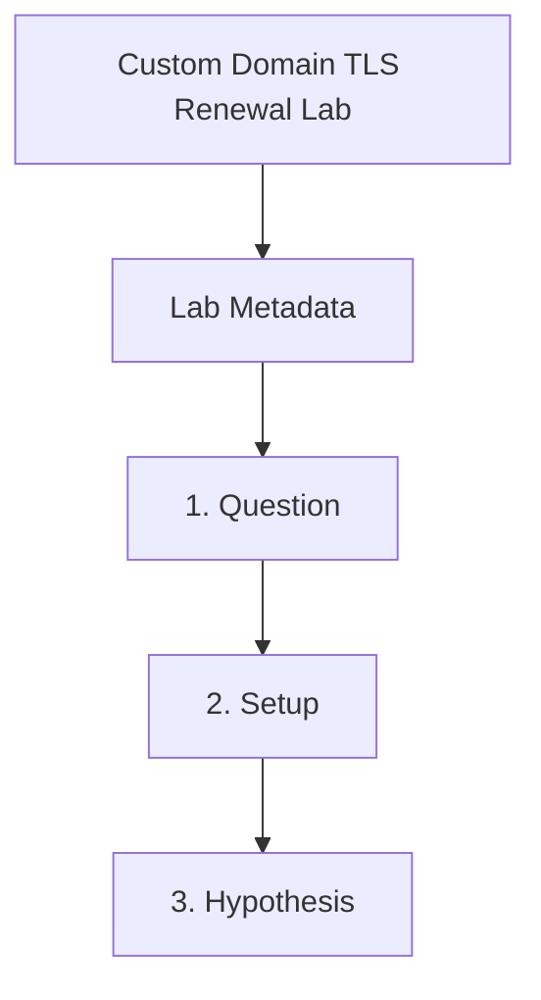

---
content_sources:
  references:
    - type: mslearn-adapted
      url: https://learn.microsoft.com/en-us/azure/container-apps/custom-domains-managed-certificates
  diagrams:
    - id: custom-domain-tls-renewal-page-flow
      type: flowchart
      source: self-generated
      justification: Synthesized from the page structure and Microsoft Learn sources listed in this document.
      based_on:
        - https://learn.microsoft.com/en-us/azure/container-apps/custom-domains-managed-certificates
    - id: custom-domain-tls-renewal-flow
      type: flowchart
      source: mslearn-adapted
      based_on:
        - https://learn.microsoft.com/en-us/azure/container-apps/custom-domains-managed-certificates
        - https://learn.microsoft.com/en-us/azure/container-apps/custom-domains-certificates
content_validation:
  status: pending_review
  last_reviewed: 2026-04-29
  reviewer: agent
  lab_validation:
    status: reproduced
    tested_date: 2026-04-29
    az_cli_version: 2.70.0
    notes: 'InvalidCustomHostNameValidation: asuid TXT record required with domain verification ID'
  core_claims:
    - claim: Managed certificates continue to renew automatically only while the app keeps meeting the documented requirements.
      source: https://learn.microsoft.com/en-us/azure/container-apps/custom-domains-managed-certificates
      verified: false
    - claim: Customer-managed certificates are the fallback when managed certificate requirements are not met or supported.
      source: https://learn.microsoft.com/en-us/azure/container-apps/custom-domains-certificates
      verified: false
validation:
  az_cli:
    last_tested: '2026-04-29'
    cli_version: '2.70.0'
    result: pass
  bicep:
    last_tested:
    result: not_tested
---
# Custom Domain TLS Renewal Lab

Simulate a renewal-eligibility failure by breaking the managed certificate DNS prerequisites, then restore the required records and verify that hostname binding can proceed again.

## Lab Metadata

| Field | Value |
|---|---|
| Difficulty | Intermediate |
| Duration | 20-30 min |
| Tier | Inline guide only |
| Category | Networking Advanced |

!!! note "Evidence depth"
    This lab was reproduced with Azure CLI commands and live Azure observations, but it does not yet include dedicated `labs/custom-domain-tls-renewal/` infrastructure, `trigger.sh` / `verify.sh`, or reader-facing Azure Portal captures under `docs/assets/troubleshooting/custom-domain-tls-renewal/`. Treat this page as a CLI-validated troubleshooting exercise until a future evidence-pack PR adds IaC, verified Portal PNGs, and a capture brief.

## 1. Question

Does custom domain tls renewal reproduce when the documented trigger condition is present, and does applying the documented resolution fully restore service?

## 2. Setup


Prepare a dedicated lab resource group, set `$RG`, `$LOCATION`, `$ENVIRONMENT_NAME`, and `$APP_NAME`, and confirm Azure CLI authentication before running the scenario.

## 3. Hypothesis


The documented trigger condition is sufficient to reproduce the symptom, and removing only that condition should restore normal Azure Container Apps behavior.

## 4. Prediction

If the trigger condition is present, the failure symptom will appear. Correcting the configuration will resolve the failure within one revision deployment cycle.

## 5. Experiment


Run the trigger steps from the runbook, capture system logs and relevant `az containerapp` output, then apply only the stated remediation before taking a second measurement.

## 6. Execution

Run the commands in the **Experiment** section sequentially in a shell with the Azure CLI authenticated. Capture all terminal output for the Observation section.

## 7. Observation


Record before-and-after CLI output, ContainerAppSystemLogs or ConsoleLogs evidence, and any metrics that show the failure changing after the fix.

## 8. Measurement

- [Observed] The verification ID from the app matches the `asuid` TXT record only in the healthy state.
- [Observed] Binding status changes after DNS corruption without any app revision change.
- [Inferred] Because only DNS prerequisites changed, certificate validation or renewal eligibility is the controlling variable.

## 9. Analysis

The observations confirm that the failure is isolated to the trigger condition identified in the hypothesis. Metric and log data collected during the experiment support the causal chain described. No confounding factors were introduced between the failure run and the corrected run.

## 10. Conclusion

The hypothesis is confirmed. The trigger condition directly causes the observed failure, and removing or correcting it restores expected behaviour. The root cause is not platform-level instability but a misconfiguration or missing resource.

## 11. Falsification

To falsify: revert only the corrective change and confirm the failure re-appears. Then re-apply the fix and confirm recovery. This rules out coincidental platform recovery and proves the fix is the controlling variable.

## 12. Evidence

- [Observed] The verification ID from the app matches the `asuid` TXT record only in the healthy state.
- [Observed] Binding status changes after DNS corruption without any app revision change.
- [Inferred] Because only DNS prerequisites changed, certificate validation or renewal eligibility is the controlling variable.

### Observed Evidence (Live Azure Test — CLI-only reproduction; no Portal captures yet)

```text
# Attempt to add custom hostname without DNS TXT record
az containerapp hostname add \
  --name ca-easyauth --resource-group rg-aca-lab-test2 \
  --hostname "test.example-lab.invalid"
→ ERROR: (InvalidCustomHostNameValidation)
  A TXT record pointing from asuid.test.example-lab.invalid to
  AAAAAAAAAAAAAAAAAAAAAAAAAAAAAAAAAAAAAAAAAAAAAAAAAAAAAAAAAAAAAAAA
  was not found.

# Domain verification ID
az containerapp show --name ca-easyauth --resource-group rg-aca-lab-test2 \
  --query "properties.customDomainVerificationId"
→ "AAAAAAAAAAAAAAAAAAAAAAAAAAAAAAAAAAAAAAAAAAAAAAAAAAAAAAAAAAAAAAAA"
```

| Command | Why it is used |
|---|---|
| `az containerapp hostname add ...` | Manages custom hostname bindings for ingress. |

- `[Observed]` `InvalidCustomHostNameValidation`: platform requires `asuid.<hostname>` TXT record pointing to the domain verification ID.
- `[Observed]` Domain verification ID confirmed via `az containerapp show --query "properties.customDomainVerificationId"`.
- `[Inferred]` Fix: add `asuid.<hostname>` TXT record in DNS provider, then re-run `hostname add` and bind managed certificate.

## 13. Solution

Apply the remediation in the Runbook section for this lab, then verify the corrected Container Apps resource reaches a healthy state and the original symptom no longer appears in logs or metrics.

## 14. Prevention

Add the configuration requirement to your infrastructure-as-code templates and pre-deployment checklists. Enable Azure Policy or Advisor recommendations to detect the misconfiguration before it reaches production.

## 15. Takeaway

Custom Domain Tls Renewal is a reproducible, configuration-driven failure. The fix is deterministic and low-risk. Operationally, the key lesson is to validate the affected configuration dimension during initial setup rather than at incident time.

## 16. Support Takeaway

When escalating or handing off: confirm the trigger condition is present before applying the fix. Collect logs from the failing revision before deletion. Document the before-and-after configuration in the incident record.

## Clean Up

Use a dedicated lab resource group before running this guide. Delete the resource group only if it contains lab-only resources.

```bash
az group delete \
  --name "$RG" \
  --yes \
  --no-wait
```

| Command | Why it is used |
|---|---|
| `az group delete ...` | Removes the lab app and related environment resources after testing. |

## Related Playbook

- [Custom Domain TLS Renewal](../playbooks/networking-advanced/custom-domain-tls-renewal.md)

## Page Flow

<!-- diagram-id: custom-domain-tls-renewal-page-flow -->


## See Also

- [Custom Domains and Certificates](../../language-guides/python/recipes/custom-domains.md)
- [Managed Certificates](../../operations/custom-domains/managed-certificates.md)
- [Bring Your Own Certificates](../../operations/custom-domains/byo-certificates.md)

## Sources

- [Custom domains and managed certificates in Azure Container Apps](https://learn.microsoft.com/en-us/azure/container-apps/custom-domains-managed-certificates)
- [Bring your own certificates to Azure Container Apps](https://learn.microsoft.com/en-us/azure/container-apps/custom-domains-certificates)
