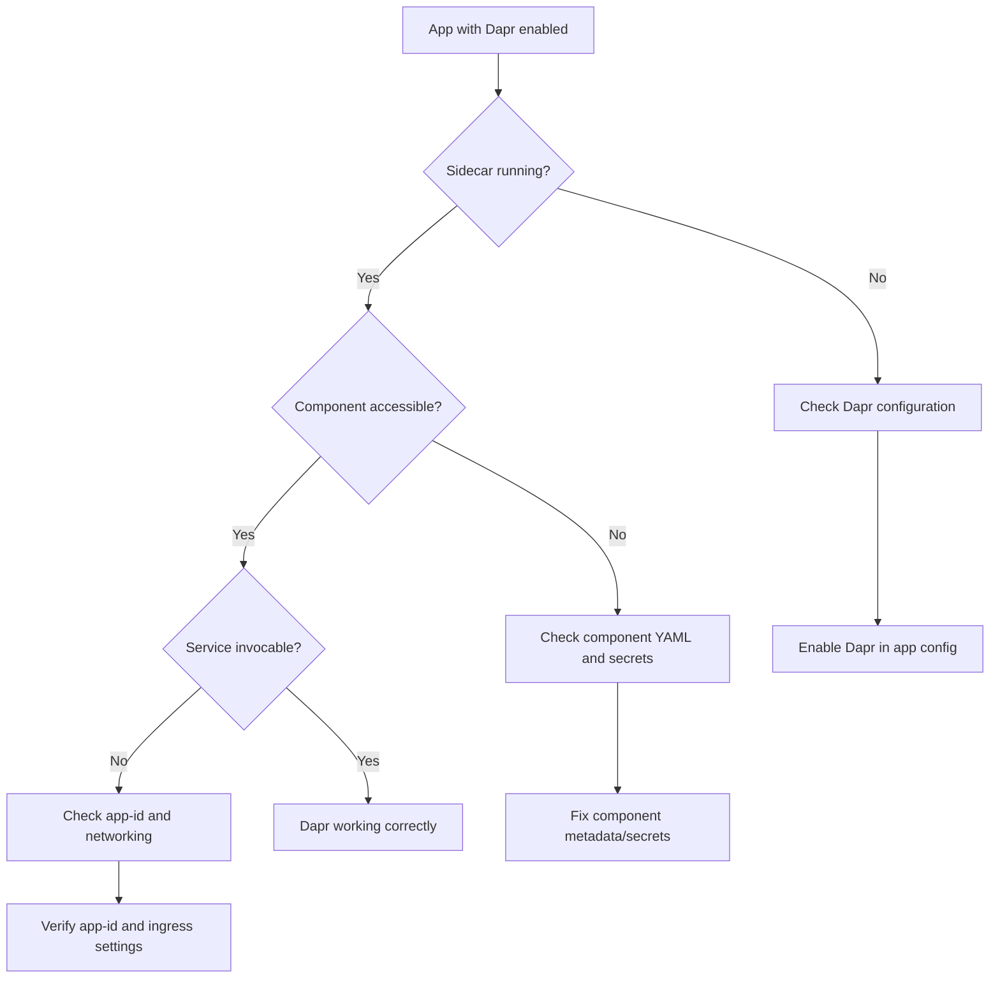

# Dapr Integration Troubleshooting Lab

Diagnose and fix Dapr sidecar and component configuration issues in Azure Container Apps.

## Scenario

- **Difficulty**: Intermediate
- **Estimated duration**: 35-45 minutes
- **Failure mode**: Dapr sidecar fails to start or components cannot connect to backing services

## Prerequisites

- Azure CLI with Container Apps extension
- Basic understanding of Dapr concepts (sidecars, components, pub/sub)

```bash
az extension add --name containerapp --upgrade
az login
```

## Quick Start

```bash
export RG="rg-aca-lab-dapr"
export LOCATION="koreacentral"

az group create --name "$RG" --location "$LOCATION"
az deployment group create --name "lab-dapr" --resource-group "$RG" --template-file ./labs/dapr-integration/infra/main.bicep --parameters baseName="labdapr"

export APP_NAME="$(az deployment group show --resource-group "$RG" --name "lab-dapr" --query "properties.outputs.containerAppName.value" --output tsv)"
export ENVIRONMENT_NAME="$(az deployment group show --resource-group "$RG" --name "lab-dapr" --query "properties.outputs.containerAppsEnvironmentName.value" --output tsv)"

cd labs/dapr-integration
./trigger.sh
./verify.sh
./cleanup.sh
```

## Scenario Setup

This lab demonstrates common Dapr issues in Container Apps:

1. Dapr sidecar not enabled
2. Component misconfiguration (wrong connection string, missing secret)
3. Pub/sub message delivery failures
4. Service invocation errors between Dapr-enabled apps



## Key Concepts

### Dapr in Container Apps

| Feature | Container Apps Implementation |
|---|---|
| Sidecar injection | Automatic when Dapr enabled |
| Component scoping | Environment-level or app-scoped |
| Service discovery | Via app-id (no DNS required) |
| Secret references | Container Apps secrets or Key Vault |

### Common Dapr Components

| Component Type | Backing Service | Use Case |
|---|---|---|
| State store | Azure Blob, Cosmos DB, Redis | Session state, caching |
| Pub/sub | Azure Service Bus, Event Hubs | Event-driven messaging |
| Binding | Azure Storage Queue, Event Grid | Input/output triggers |
| Secret store | Azure Key Vault | Centralized secrets |

## Step-by-Step Walkthrough

1. **Deploy baseline app without Dapr**

   ```bash
   export RG="rg-aca-lab-dapr"
   export LOCATION="koreacentral"
   az group create --name "$RG" --location "$LOCATION"

   az deployment group create \
     --name "lab-dapr" \
     --resource-group "$RG" \
     --template-file "./labs/dapr-integration/infra/main.bicep" \
     --parameters baseName="labdapr"
   ```

2. **Check Dapr status (trigger: Dapr not enabled)**

   ```bash
   az containerapp show \
     --name "$APP_NAME" \
     --resource-group "$RG" \
     --query "properties.configuration.dapr"
   ```

   Expected output when Dapr disabled:

   ```json
   null
   ```

3. **Enable Dapr sidecar**

   ```bash
   az containerapp dapr enable \
     --name "$APP_NAME" \
     --resource-group "$RG" \
     --dapr-app-id "myapp" \
     --dapr-app-port 8000 \
     --dapr-app-protocol "http"
   ```

   Expected output: Dapr configuration updated.

4. **Verify Dapr sidecar is running**

   ```bash
   az containerapp logs show \
     --name "$APP_NAME" \
     --resource-group "$RG" \
     --type system \
     --follow false | grep -i dapr
   ```

   Expected evidence: `daprd` sidecar started messages.

5. **Deploy Dapr component (trigger: misconfigured)**

   ```bash
   az containerapp env dapr-component set \
     --name "$ENVIRONMENT_NAME" \
     --resource-group "$RG" \
     --dapr-component-name "statestore" \
     --yaml "./labs/dapr-integration/components/statestore-broken.yaml"
   ```

6. **Test state store operation (should fail)**

   ```bash
   export APP_FQDN="$(az containerapp show --name "$APP_NAME" --resource-group "$RG" --query "properties.configuration.ingress.fqdn" --output tsv)"
   
   curl --silent --request POST "https://${APP_FQDN}/save-state" \
     --header "Content-Type: application/json" \
     --data '{"key": "test", "value": "data"}'
   ```

   Expected error: state store connection failure.

7. **Check Dapr sidecar logs for errors**

   ```bash
   az containerapp logs show \
     --name "$APP_NAME" \
     --resource-group "$RG" \
     --type system | grep -i "error\|failed\|component"
   ```

   Expected evidence: component initialization failure.

8. **Fix component configuration**

   ```bash
   az containerapp env dapr-component set \
     --name "$ENVIRONMENT_NAME" \
     --resource-group "$RG" \
     --dapr-component-name "statestore" \
     --yaml "./labs/dapr-integration/components/statestore-fixed.yaml"
   ```

9. **Restart app to reload components**

   ```bash
   az containerapp revision restart \
     --name "$APP_NAME" \
     --resource-group "$RG" \
     --revision "$(az containerapp revision list --name "$APP_NAME" --resource-group "$RG" --query "[0].name" --output tsv)"
   ```

10. **Verify state store works**

    ```bash
    curl --silent --request POST "https://${APP_FQDN}/save-state" \
      --header "Content-Type: application/json" \
      --data '{"key": "test", "value": "data"}'
    
    curl --silent "https://${APP_FQDN}/get-state/test"
    ```

    Expected output: state saved and retrieved successfully.

## Symptoms / Cause / Fix Matrix

| What you see | What is happening | How to fix |
|---|---|---|
| App works but Dapr calls fail | Dapr sidecar not enabled | `az containerapp dapr enable` |
| `ERR_INVOKE` on service calls | Target app-id not found | Verify target app has Dapr enabled with correct app-id |
| Component initialization failed | Bad connection string or missing secret | Fix component YAML metadata |
| State/pubsub operations timeout | Network policy blocking Dapr | Check VNet and firewall rules |
| `component not found` error | Component not deployed to environment | Deploy component with `dapr-component set` |

## Debugging Commands

```bash
# Check Dapr configuration
az containerapp show --name "$APP_NAME" --resource-group "$RG" --query "properties.configuration.dapr"

# List Dapr components in environment
az containerapp env dapr-component list --name "$ENVIRONMENT_NAME" --resource-group "$RG" --output table

# Show specific component details
az containerapp env dapr-component show --name "$ENVIRONMENT_NAME" --resource-group "$RG" --dapr-component-name "statestore"

# Check component scopes
az containerapp env dapr-component show --name "$ENVIRONMENT_NAME" --resource-group "$RG" --dapr-component-name "statestore" --query "properties.scopes"

# View Dapr sidecar logs
az containerapp logs show --name "$APP_NAME" --resource-group "$RG" --type system --tail 100
```

## Resolution Verification Checklist

1. Dapr sidecar running (`daprd` in system logs)
2. Components initialized without errors
3. State store operations succeed
4. Service-to-service invocation works
5. Pub/sub messages delivered

## Expected Evidence

### Before Fix

| Evidence Source | Expected State |
|---|---|
| `az containerapp show ... --query dapr` | `null` or misconfigured |
| System logs | Dapr component errors |
| API calls via Dapr | Timeout or connection errors |

### After Fix

| Evidence Source | Expected State |
|---|---|
| `az containerapp show ... --query dapr` | Correct app-id, port, protocol |
| System logs | `component loaded successfully` |
| State/pubsub operations | HTTP 200, data persisted |

## Clean Up

```bash
az group delete --name "$RG" --yes --no-wait
```

## Related Playbook

- [Dapr Sidecar or Component Failure](../playbooks/platform-features/dapr-sidecar-or-component-failure.md)

## See Also

- [Dapr Sidecar Logs KQL](../kql/dapr-and-jobs/dapr-sidecar-logs.md)
- [Managed Identity Key Vault Failure Lab](./managed-identity-key-vault-failure.md)

## Sources

- [Dapr integration with Azure Container Apps](https://learn.microsoft.com/azure/container-apps/dapr-overview)
- [Connect to Azure services via Dapr components](https://learn.microsoft.com/azure/container-apps/dapr-component-connect)
- [Dapr components in Azure Container Apps](https://learn.microsoft.com/azure/container-apps/dapr-components)
- [Dapr documentation](https://docs.dapr.io/)
