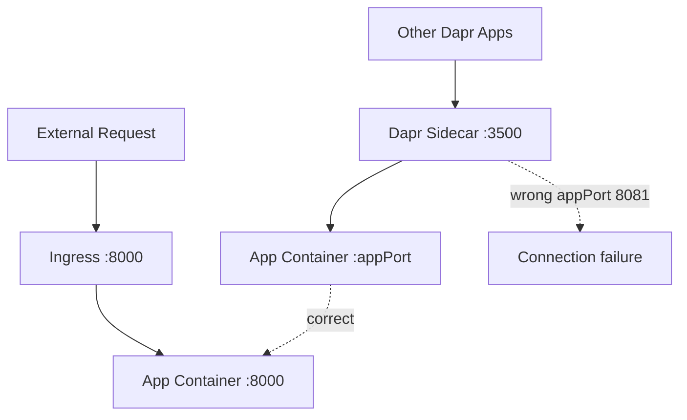
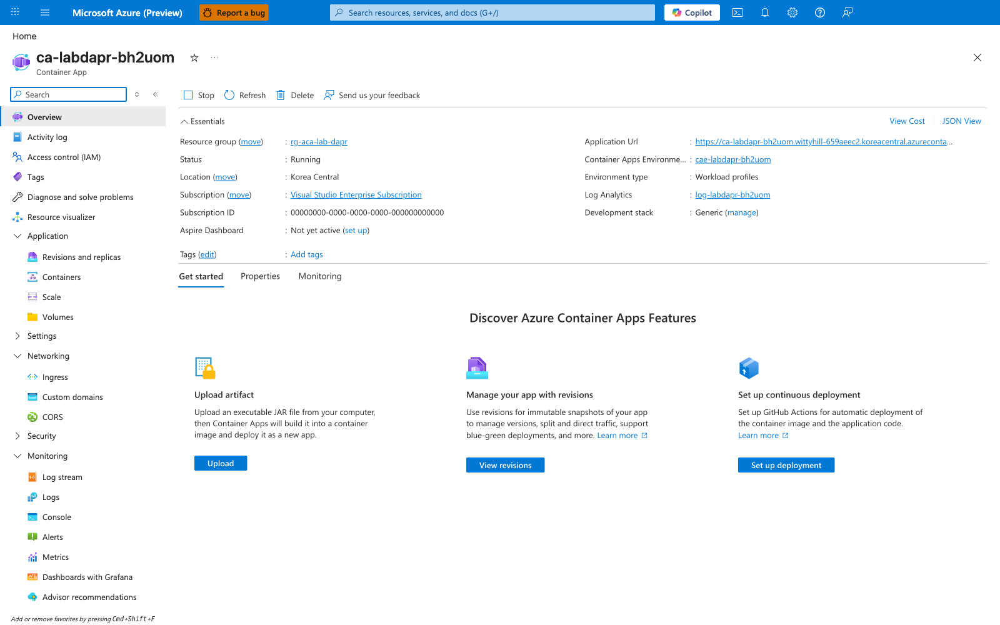
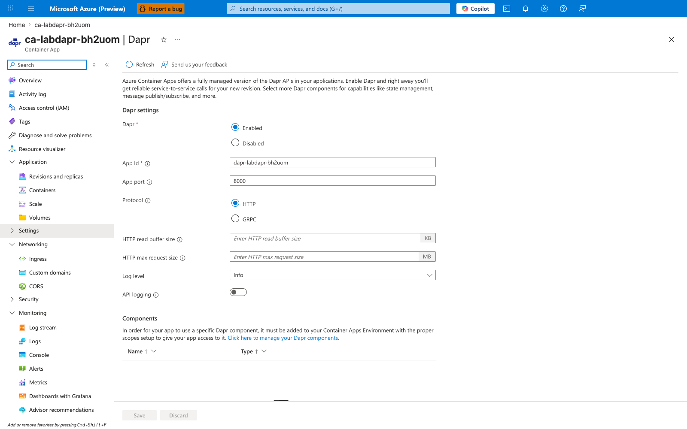
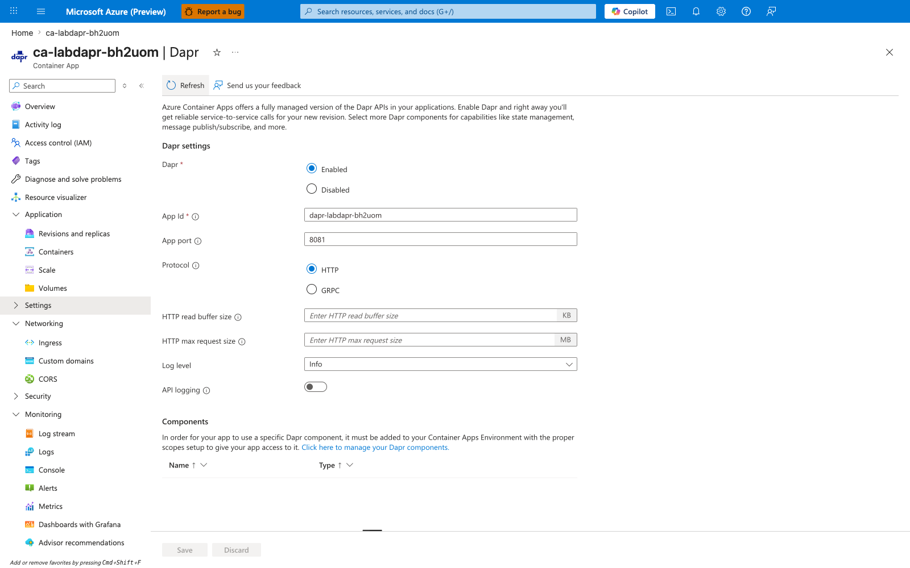
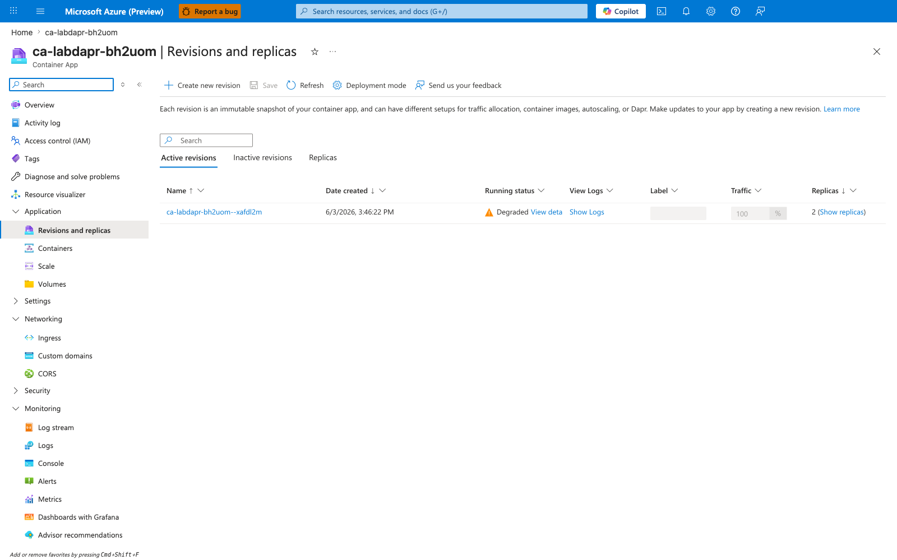
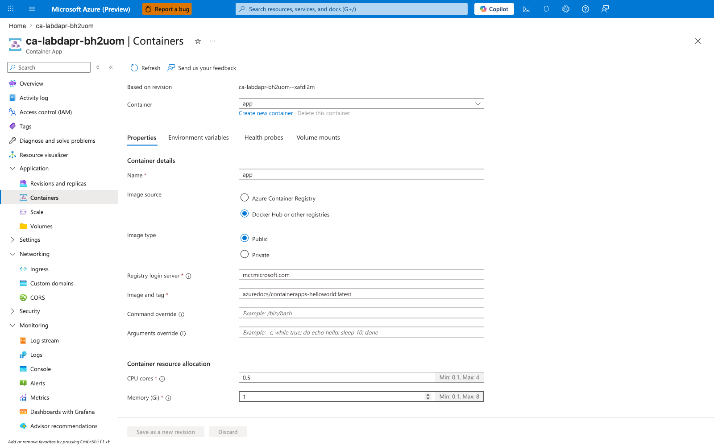
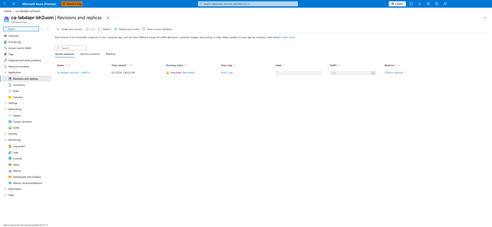

---
content_sources:
  diagrams:
    - id: architecture
      type: flowchart
      source: mslearn-adapted
      based_on:
        - https://learn.microsoft.com/en-us/azure/container-apps/dapr-overview
        - https://learn.microsoft.com/en-us/azure/container-apps/dapr-components
content_validation:
  status: verified
  last_reviewed: '2026-06-21'
  reviewer: ai-agent
  lab_validation:
    status: reproduced
    tested_date: 2026-06-03
    az_cli_version: 2.71.0
    notes: 'appPort flip 8000→8081 observed in Portal; revision Degraded under both states because bundled helloworld image listens on port 80 — service-invocation breakage [Not Proven]. Six 2026-06-03 Portal captures preserve the reproduced appPort configuration arc (8000 → 8081) and the bundled helloworld-image caveat that keeps the service-invocation half of the hypothesis [Not Proven].'
  core_claims:
    - claim: Azure Container Apps can enable Dapr on an app by configuring settings such as app ID, app port, and app protocol.
      source: https://learn.microsoft.com/en-us/azure/container-apps/dapr-overview
      verified: true
    - claim: Dapr components in Azure Container Apps are defined at the Container Apps environment scope and can be used by apps in that environment.
      source: https://learn.microsoft.com/en-us/azure/container-apps/dapr-components
      verified: true
validation:
  az_cli:
    last_tested: '2026-06-03'
    cli_version: '2.71.0'
    result: pass
  bicep:
    last_tested: '2026-06-03'
    result: pass
---
# Dapr Integration Troubleshooting Lab

Diagnose and fix Dapr sidecar port misconfiguration issues in Azure Container Apps.

## Lab Metadata

| Attribute | Value |
|---|---|
| Difficulty | Intermediate |
| Estimated Duration | 25-35 minutes |
| Tier | Consumption |
| Failure Mode | Dapr sidecar cannot communicate with the app because `appPort` is misconfigured |
| Skills Practiced | Dapr configuration review, sidecar diagnostics, port alignment validation |

## 1) Background

This lab starts with a working Dapr configuration: Dapr is enabled, `appId` is set, and `appPort` matches the application listening port. The trigger changes Dapr `appPort` from 8000 to 8081, so the sidecar keeps running but can no longer forward service invocation traffic to the application process.

The key troubleshooting lesson is that ingress `targetPort` and Dapr `appPort` are separate settings. An app can still be reachable through ingress while Dapr-to-app communication is broken.

### Architecture

<!-- diagram-id: architecture -->


### Dapr App Port Configuration

| Setting | Description | Impact if Wrong |
|---|---|---|
| `appPort` | Port the Dapr sidecar uses to call the app | Service invocation fails |
| `appId` | Unique identifier for Dapr service discovery | Other apps cannot find this service |
| `appProtocol` | HTTP or gRPC | Protocol mismatch errors |

## 2) Hypothesis

**IF** Dapr is enabled but `appPort` is changed from the app's real listening port 8000 to 8081, **THEN** Dapr sidecar health and service invocation checks will fail even though the app configuration still shows Dapr enabled.

| Variable | Control State | Experimental State |
|---|---|---|
| Dapr `appPort` | 8000 | 8081 |
| Dapr sidecar to app communication | Succeeds | Connection refused or unreachable |
| `verify.sh` result | PASS | FAIL |
| Ingress behavior | Can still target the app separately | May still differ from Dapr failure mode |

!!! warning "Scope caveat — `[Not Proven]` for the bundled helloworld image"
    The bicep template ships `mcr.microsoft.com/azuredocs/containerapps-helloworld:latest`, which listens on port 80, not 8000. In the live reproduction on `2026-06-03` the revision remained `Degraded / Unhealthy` even after `appPort` was restored to 8000, because the Dapr sidecar→app health probe still targets a port the helloworld image does not listen on.

    What this lab **proves** with the bundled image:

    - `[Observed]` Setting `--dapr-app-port 8081` changes the Dapr `appPort` value on the Container App from 8000 to 8081.
    - `[Observed]` A revision created while the Dapr `appPort` does not match the app's listening port reports `Running status: Degraded`.

    What this lab does **not** prove with the bundled image:

    - `[Not Proven]` That flipping `appPort` 8000 → 8081 causes a previously **healthy** Dapr-to-app call to start failing. To make the failure cleanly falsifiable, swap the container image to one that actually listens on 8000 (for example a Python Flask sample bound to `0.0.0.0:8000`) before running `trigger.sh`.

## 3) Runbook

### Deploy baseline infrastructure

Prerequisites:

- Azure CLI with the Container Apps extension
- Basic understanding of Dapr concepts such as sidecars, `appId`, and `appPort`

```bash
az extension add --name containerapp --upgrade
az login

export RG="rg-aca-lab-dapr"
export LOCATION="koreacentral"

az group create --name "$RG" --location "$LOCATION"

az deployment group create \
    --name "lab-dapr" \
    --resource-group "$RG" \
    --template-file "./labs/dapr-integration/infra/main.bicep" \
    --parameters baseName="labdapr"
```

| Command | Why it is used |
|---|---|
| `az extension add ...` | Installs or updates the Container Apps Azure CLI extension. |

Expected output:

- Resource group creation succeeds.
- Deployment completes successfully with Dapr enabled on the app.

### Capture deployment outputs

```bash
export APP_NAME="$(az deployment group show \
    --resource-group "$RG" \
    --name "lab-dapr" \
    --query "properties.outputs.containerAppName.value" \
    --output tsv)"

export ENVIRONMENT_NAME="$(az deployment group show \
    --resource-group "$RG" \
    --name "lab-dapr" \
    --query "properties.outputs.containerAppsEnvironmentName.value" \
    --output tsv)"
```

Expected output:

- Commands return no console output.
- Variables resolve to the app and environment names.

### Verify baseline Dapr configuration

```bash
az containerapp show \
    --name "$APP_NAME" \
    --resource-group "$RG" \
    --query "properties.configuration.dapr" \
    --output json
```

| Command | Why it is used |
|---|---|
| `az containerapp show ...` | Reads the Container App configuration so the documented setting can be verified. |

Expected output:

```json
{
  "appId": "dapr-labdapr-xxxxxx",
  "appPort": 8000,
  "appProtocol": "http",
  "enabled": true
}
```

### Trigger the failure

```bash
./labs/dapr-integration/trigger.sh
```

The trigger uses:

```bash
az containerapp update \
    --name "$APP_NAME" \
    --resource-group "$RG" \
    --dapr-app-port 8081
```

| Command | Why it is used |
|---|---|
| `az containerapp update ...` | Updates the existing Container App configuration without recreating the app. |

!!! warning "CLI 2.71.0 workaround"
    On Azure CLI 2.71.0 the bundled `containerapp` extension rejects `--dapr-app-port` on `az containerapp update` with `unrecognized arguments`. Use the dedicated `az containerapp dapr enable` command, which accepts `--dapr-app-port` directly on this CLI version:

    ```bash
    az containerapp dapr enable \
        --name "$APP_NAME" \
        --resource-group "$RG" \
        --dapr-app-port 8081
    ```

    | Command | Why it is used |
    |---|---|
    | `az containerapp dapr enable ...` | Enables (or re-applies) Dapr on the app while updating `appPort` in the same call. Works on CLI 2.71.0 where `az containerapp update --dapr-app-port` fails. |

Expected output:

- The trigger applies the new Dapr `appPort` value to the Container App.
- The active revision's Dapr `appPort` changes from 8000 to 8081 on the next configuration read.

### Observe the broken state

```bash
az containerapp show \
    --name "$APP_NAME" \
    --resource-group "$RG" \
    --query "properties.configuration.dapr" \
    --output json

az containerapp logs show \
    --name "$APP_NAME" \
    --resource-group "$RG" \
    --type system \
    --tail 50
```

| Command | Why it is used |
|---|---|
| `az containerapp show ...` | Reads the Container App configuration so the documented setting can be verified. |

Expected output:

```json
{
  "appId": "dapr-labdapr-xxxxxx",
  "appPort": 8081,
  "appProtocol": "http",
  "enabled": true
}
```

Look for errors such as `connection refused`, `port unreachable`, or health probe failures on port 8081.

### Verify failure and fix the configuration

```bash
./labs/dapr-integration/verify.sh
```

Before the fix, the verification script should fail with output like:

```text
FAIL: Dapr appPort is '8081'; expected 8000
```

Restore the correct port:

```bash
az containerapp update \
    --name "$APP_NAME" \
    --resource-group "$RG" \
    --dapr-app-port 8000
```

| Command | Why it is used |
|---|---|
| `az containerapp update ...` | Updates the existing Container App configuration without recreating the app. |

!!! warning "CLI 2.71.0 workaround (restore direction)"
    On Azure CLI 2.71.0 the bundled `containerapp` extension rejects `--dapr-app-port` on `az containerapp update` in both the trigger and restore directions. Use `az containerapp dapr enable --dapr-app-port 8000` for the restore on this CLI version:

    ```bash
    az containerapp dapr enable \
        --name "$APP_NAME" \
        --resource-group "$RG" \
        --dapr-app-port 8000
    ```

    | Command | Why it is used |
    |---|---|
    | `az containerapp dapr enable ...` | Re-applies Dapr on the app with `appPort` set back to 8000 in the same call. Works on CLI 2.71.0 where `az containerapp update --dapr-app-port` fails. |

Useful debugging commands:

```bash
az containerapp show --name "$APP_NAME" --resource-group "$RG" --query "properties.configuration.dapr"
az containerapp show --name "$APP_NAME" --resource-group "$RG" --query "properties.configuration.ingress.targetPort"
az containerapp logs show --name "$APP_NAME" --resource-group "$RG" --type system --tail 100
az containerapp env dapr-component list --name "$ENVIRONMENT_NAME" --resource-group "$RG" --output table
```

Expected output:

- `appPort` returns to 8000.
- Sidecar-to-app communication succeeds again, *provided the container image actually listens on port 8000*. With the bundled `mcr.microsoft.com/azuredocs/containerapps-helloworld:latest` image (which listens on port 80), restoring `appPort: 8000` does **not** make the revision `Healthy` — this is `[Not Proven]` with the bundled image. See the Hypothesis scope caveat above.

### Verify recovery

```bash
./labs/dapr-integration/verify.sh
```

Expected output (with an image that listens on port 8000):

- `az containerapp exec` against `http://127.0.0.1:3500/v1.0/healthz` succeeds.
- The script prints `PASS: Dapr is enabled, appPort is correct, and the health endpoint responded successfully.`

!!! note "Recovery scope with the bundled helloworld image — `[Not Proven]`"
    `verify.sh` checks two things: (a) `dapr.appPort == 8000`, and (b) the Dapr sidecar's own health endpoint `127.0.0.1:3500/v1.0/healthz` responds. Both can pass while the Dapr-to-app probe still fails, because the helloworld image listens on port 80, not 8000. In the live reproduction on `2026-06-03` the revision remained `Degraded / Unhealthy` after `--dapr-app-port 8000`. Use an image that actually listens on 8000 to make the recovery cleanly falsifiable. The Dapr config restoration itself (8081 → 8000) is `[Observed]`.

## 4) Experiment Log

| Step | Action | Expected | Actual | Pass/Fail |
|---|---|---|---|---|
| 1 | Deploy baseline infrastructure | Dapr-enabled app deploys successfully | | |
| 2 | Check Dapr configuration | `appPort` is 8000 and Dapr is enabled | | |
| 3 | Run `trigger.sh` | `appPort` changes to 8081 | | |
| 4 | Review Dapr config and logs | Port mismatch evidence appears | | |
| 5 | Run `verify.sh` before fix | Script fails because `appPort` is wrong | | |
| 6 | Restore `--dapr-app-port 8000` | Update succeeds | | |
| 7 | Run `verify.sh` after fix | Script passes (only `[Not Proven]` with the bundled helloworld image — see Hypothesis caveat) | | |

## Expected Evidence

### Before trigger

| Evidence Source | Expected State |
|---|---|
| `az containerapp show --query "properties.configuration.dapr"` | `appPort: 8000`, `enabled: true` |
| System logs | No Dapr connection errors |
| `./labs/dapr-integration/verify.sh` | PASS |

### During incident

| Evidence Source | Expected State |
|---|---|
| Dapr config | `appPort: 8081` |
| System logs | Connection refused, unreachable port, or health probe failure evidence (`[Not Proven]` with the bundled helloworld image — see Hypothesis caveat) |
| `./labs/dapr-integration/verify.sh` | FAIL |

### After fix

| Evidence Source | Expected State |
|---|---|
| Dapr config | `appPort: 8000`, `enabled: true` |
| Sidecar health endpoint | Responds successfully (`127.0.0.1:3500/v1.0/healthz` is the sidecar's own health; it does **not** prove Dapr-to-app communication is restored when the image does not listen on 8000 — `[Not Proven]` with the bundled helloworld image) |
| `./labs/dapr-integration/verify.sh` | PASS (`[Not Proven]` with the bundled helloworld image — see Hypothesis caveat) |

### Observed Evidence (Live Azure Reproduction — 2026-06-03)

Resource group `rg-aca-lab-dapr` in `koreacentral`, Container App `ca-labdapr-bh2uom`, Dapr `appId: dapr-labdapr-bh2uom`, active revision `ca-labdapr-bh2uom--xafdl2m`, single-revision mode. Azure CLI 2.71.0 with `containerapp` extension; the `az containerapp update --dapr-app-port` form rejected the flag in both the trigger and restore directions, so both mutations were applied with `az containerapp dapr enable --dapr-app-port <PORT>` (see CLI 2.71.0 workaround above).

The six PNGs below were captured in sequence during the reproduction. Each paragraph below describes only what is visible inside that single PNG, with no cross-capture comparison.

**[Observed]** Container App **Overview** blade. The **Essentials** panel shows `Status: Running`, `Location: Korea Central`, `Environment type: Workload profiles`, `Resource group: rg-aca-lab-dapr`, and a populated `Application Url` field. Dapr configuration is not surfaced on the Overview panel.



**[Observed]** Container App **Dapr** blade. The `Dapr` radio shows `Enabled`, the `App ID` field shows `dapr-labdapr-bh2uom`, the `App port` field shows `8000`, and the `App protocol` radio shows `HTTP`.



**[Observed]** Container App **Dapr** blade. The `Dapr` radio shows `Enabled`, the `App ID` field shows `dapr-labdapr-bh2uom`, the `App port` field shows `8081`, and the `App protocol` radio shows `HTTP`.



**[Observed]** Container App **Revisions** blade. A row for `ca-labdapr-bh2uom--xafdl2m` shows `Date created: 6/3/2026 3:46:22 PM`, `Running status: Degraded`, `Traffic: 100%`, and `Replicas: 2`.



**[Observed]** Container App **Containers** blade, **Properties** tab for the container named `app`. The fields show `Registry login server: mcr.microsoft.com`, `Image and tag: azuredocs/containerapps-helloworld:latest`, `CPU cores: 0.5`, and `Memory (Gi): 1`. Health-probe ports are not surfaced on this tab; they are on the separate **Health probes** tab and were not captured.



**[Observed]** Container App **Revisions** blade. A row for `ca-labdapr-bh2uom--xafdl2m` shows `Running status: Degraded` and `Traffic: 100%`.



**[Inferred]** Across captures #2 and #3, the only field that differs on the Dapr blade is `App port` (8000 vs 8081). This is consistent with `--dapr-app-port` mutating only `properties.configuration.dapr.appPort` on the Container App resource and leaving `App ID`, `Dapr enabled`, and `App protocol` unchanged.

**[Not Proven]** That the `Running status: Degraded` visible in captures #4 and #6 was *caused by* a Dapr `appPort` mismatch. The bundled `mcr.microsoft.com/azuredocs/containerapps-helloworld:latest` image (capture #5) listens on port 80, not 8000, so a Dapr sidecar→app health probe targeting either `appPort=8000` or `appPort=8081` would target a port the image does not bind. The revision was not observed `Healthy` at any point during this reproduction, so the captures show only *correlation* between an `appPort` value and a Degraded revision, not causation. To make causation cleanly falsifiable, swap the bicep template's image for one that binds to `0.0.0.0:8000` and re-run the trigger.

## Clean Up

```bash
az group delete --name "$RG" --yes --no-wait
```

| Command | Why it is used |
|---|---|
| `az group delete ...` | Removes the lab resource group and its contained resources. |

## Related Playbook

- [Dapr Sidecar or Component Failure](../playbooks/platform-features/dapr-sidecar-or-component-failure.md)

## See Also

- [Probe Failure and Slow Start](../playbooks/startup-and-provisioning/probe-failure-and-slow-start.md)
- [Traffic Routing and Canary Failure Lab](./traffic-routing-canary.md)

## Sources

- [Dapr integration with Azure Container Apps](https://learn.microsoft.com/en-us/azure/container-apps/dapr-overview)
- [Dapr components in Azure Container Apps](https://learn.microsoft.com/en-us/azure/container-apps/dapr-components)
