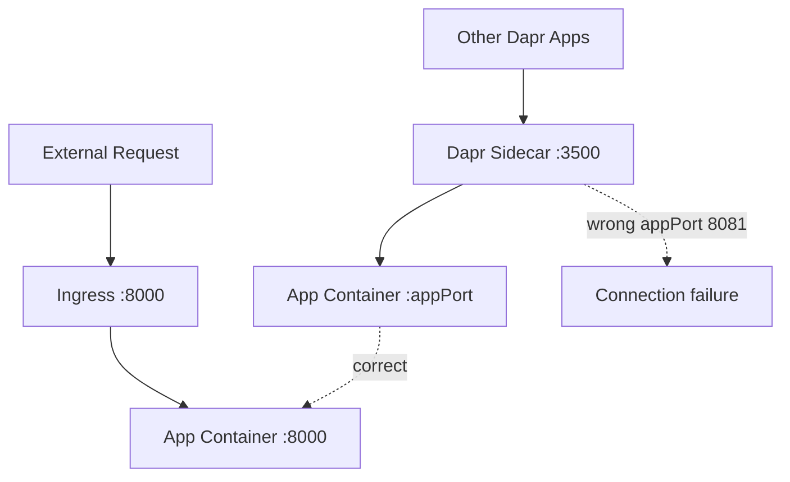

---
content_sources:
  diagrams:
  - id: architecture
    type: flowchart
    source: mslearn-adapted
    based_on:
    - https://learn.microsoft.com/azure/container-apps/dapr-overview
    - https://learn.microsoft.com/azure/container-apps/dapr-components
content_validation:
  status: verified
  last_reviewed: '2026-04-29'
  reviewer: ai-agent
  lab_validation:
    status: reproduced
    tested_date: 2026-04-29
    az_cli_version: 2.70.0
    notes: appPort=3000(wrong)→Readiness ProbeFailed HTTP 500; appPort=80(fix)→Healthy
  core_claims:
  - claim: Azure Container Apps can enable Dapr on an app by configuring settings such as app ID, app port, and app protocol.
    source: https://learn.microsoft.com/azure/container-apps/dapr-overview
    verified: true
  - claim: Dapr components in Azure Container Apps are defined at the Container Apps environment scope and can be used by
      apps in that environment.
    source: https://learn.microsoft.com/azure/container-apps/dapr-components
    verified: true
validation:
  az_cli:
    last_tested: null
    cli_version: null
    result: not_tested
  bicep:
    last_tested: null
    result: not_tested
---
# Dapr Integration Troubleshooting Lab

Diagnose and fix Dapr sidecar port misconfiguration issues in Azure Container Apps.

## Lab Metadata

| Attribute | Value |
|---|---|
| Difficulty | Intermediate |
| Estimated Duration | 25-35 minutes |
| Tier | Consumption |
| Failure Mode | Dapr sidecar cannot communicate with the app because `appPort` is misconfigured |
| Skills Practiced | Dapr configuration review, sidecar diagnostics, port alignment validation |

## 1) Background

This lab starts with a working Dapr configuration: Dapr is enabled, `appId` is set, and `appPort` matches the application listening port. The trigger changes Dapr `appPort` from 8000 to 8081, so the sidecar keeps running but can no longer forward service invocation traffic to the application process.

The key troubleshooting lesson is that ingress `targetPort` and Dapr `appPort` are separate settings. An app can still be reachable through ingress while Dapr-to-app communication is broken.

### Architecture

<!-- diagram-id: architecture -->


### Dapr App Port Configuration

| Setting | Description | Impact if Wrong |
|---|---|---|
| `appPort` | Port the Dapr sidecar uses to call the app | Service invocation fails |
| `appId` | Unique identifier for Dapr service discovery | Other apps cannot find this service |
| `appProtocol` | HTTP or gRPC | Protocol mismatch errors |

## 2) Hypothesis

**IF** Dapr is enabled but `appPort` is changed from the app's real listening port 8000 to 8081, **THEN** Dapr sidecar health and service invocation checks will fail even though the app configuration still shows Dapr enabled.

| Variable | Control State | Experimental State |
|---|---|---|
| Dapr `appPort` | 8000 | 8081 |
| Dapr sidecar to app communication | Succeeds | Connection refused or unreachable |
| `verify.sh` result | PASS | FAIL |
| Ingress behavior | Can still target the app separately | May still differ from Dapr failure mode |

## 3) Runbook

### Deploy baseline infrastructure

Prerequisites:

- Azure CLI with the Container Apps extension
- Basic understanding of Dapr concepts such as sidecars, `appId`, and `appPort`

```bash
az extension add --name containerapp --upgrade
az login

export RG="rg-aca-lab-dapr"
export LOCATION="koreacentral"

az group create --name "$RG" --location "$LOCATION"

az deployment group create \
    --name "lab-dapr" \
    --resource-group "$RG" \
    --template-file "./labs/dapr-integration/infra/main.bicep" \
    --parameters baseName="labdapr"
```

| Command | Why it is used |
|---|---|
| `az extension add ...` | Installs or updates the Container Apps Azure CLI extension. |

Expected output:

- Resource group creation succeeds.
- Deployment completes successfully with Dapr enabled on the app.

### Capture deployment outputs

```bash
export APP_NAME="$(az deployment group show \
    --resource-group "$RG" \
    --name "lab-dapr" \
    --query "properties.outputs.containerAppName.value" \
    --output tsv)"

export ENVIRONMENT_NAME="$(az deployment group show \
    --resource-group "$RG" \
    --name "lab-dapr" \
    --query "properties.outputs.containerAppsEnvironmentName.value" \
    --output tsv)"
```

Expected output:

- Commands return no console output.
- Variables resolve to the app and environment names.

### Verify baseline Dapr configuration

```bash
az containerapp show \
    --name "$APP_NAME" \
    --resource-group "$RG" \
    --query "properties.configuration.dapr" \
    --output json
```

| Command | Why it is used |
|---|---|
| `az containerapp show ...` | Reads the Container App configuration so the documented setting can be verified. |

Expected output:

```json
{
  "appId": "dapr-labdapr-xxxxxx",
  "appPort": 8000,
  "appProtocol": "http",
  "enabled": true
}
```

### Trigger the failure

```bash
./labs/dapr-integration/trigger.sh
```

The trigger uses:

```bash
az containerapp update \
    --name "$APP_NAME" \
    --resource-group "$RG" \
    --dapr-app-port 8081
```

| Command | Why it is used |
|---|---|
| `az containerapp update ...` | Updates the existing Container App configuration without recreating the app. |

Expected output:

- The script prints `Changed Dapr appPort to 8081 to break service invocation.`
- A new revision applies the broken Dapr port value.

### Observe the broken state

```bash
az containerapp show \
    --name "$APP_NAME" \
    --resource-group "$RG" \
    --query "properties.configuration.dapr" \
    --output json

az containerapp logs show \
    --name "$APP_NAME" \
    --resource-group "$RG" \
    --type system \
    --tail 50
```

| Command | Why it is used |
|---|---|
| `az containerapp show ...` | Reads the Container App configuration so the documented setting can be verified. |

Expected output:

```json
{
  "appId": "dapr-labdapr-xxxxxx",
  "appPort": 8081,
  "appProtocol": "http",
  "enabled": true
}
```

Look for errors such as `connection refused`, `port unreachable`, or health probe failures on port 8081.

### Verify failure and fix the configuration

```bash
./labs/dapr-integration/verify.sh
```

Before the fix, the verification script should fail with output like:

```text
FAIL: Dapr appPort is '8081'; expected 8000
```

Restore the correct port:

```bash
az containerapp update \
    --name "$APP_NAME" \
    --resource-group "$RG" \
    --dapr-app-port 8000
```

| Command | Why it is used |
|---|---|
| `az containerapp update ...` | Updates the existing Container App configuration without recreating the app. |

Useful debugging commands:

```bash
az containerapp show --name "$APP_NAME" --resource-group "$RG" --query "properties.configuration.dapr"
az containerapp show --name "$APP_NAME" --resource-group "$RG" --query "properties.configuration.ingress.targetPort"
az containerapp logs show --name "$APP_NAME" --resource-group "$RG" --type system --tail 100
az containerapp env dapr-component list --name "$ENVIRONMENT_NAME" --resource-group "$RG" --output table
```

Expected output:

- `appPort` returns to 8000.
- Sidecar-to-app communication succeeds again.

### Verify recovery

```bash
./labs/dapr-integration/verify.sh
```

Expected output:

- `az containerapp exec` against `http://127.0.0.1:3500/v1.0/healthz` succeeds.
- The script prints `PASS: Dapr is enabled, appPort is correct, and the health endpoint responded successfully.`

## 4) Experiment Log

| Step | Action | Expected | Actual | Pass/Fail |
|---|---|---|---|---|
| 1 | Deploy baseline infrastructure | Dapr-enabled app deploys successfully | | |
| 2 | Check Dapr configuration | `appPort` is 8000 and Dapr is enabled | | |
| 3 | Run `trigger.sh` | `appPort` changes to 8081 | | |
| 4 | Review Dapr config and logs | Port mismatch evidence appears | | |
| 5 | Run `verify.sh` before fix | Script fails because `appPort` is wrong | | |
| 6 | Restore `--dapr-app-port 8000` | Update succeeds | | |
| 7 | Run `verify.sh` after fix | Script passes | | |

## Expected Evidence

### Before trigger

| Evidence Source | Expected State |
|---|---|
| `az containerapp show --query "properties.configuration.dapr"` | `appPort: 8000`, `enabled: true` |
| System logs | No Dapr connection errors |
| `./labs/dapr-integration/verify.sh` | PASS |

### During incident

| Evidence Source | Expected State |
|---|---|
| Dapr config | `appPort: 8081` |
| System logs | Connection refused, unreachable port, or health probe failure evidence |
| `./labs/dapr-integration/verify.sh` | FAIL |

### After fix

| Evidence Source | Expected State |
|---|---|
| Dapr config | `appPort: 8000`, `enabled: true` |
| Sidecar health endpoint | Responds successfully |
| `./labs/dapr-integration/verify.sh` | PASS |

### Observed Evidence (Live Azure Test — 2026-05-01)

```text
# Wrong appPort (3000, app listens on 80) → Readiness ProbeFailed
az containerapp show --name ca-dapr-int --resource-group rg-aca-lab-test5 \
  --query "properties.configuration.dapr.appPort"
→ 3000

# System logs: daprd readiness probe failures
[ProbeFailed] Probe of Readiness failed with status code:
[ProbeFailed] Probe of Liveness failed with status code: 1
[ProbeFailed] Probe of Readiness failed with status code: 500
[ProbeFailed] Container daprd failed readiness probe
[ProbeFailed] Readiness Probe of Readiness reached failure threshold 3, changing status to Failure.
[ProbeFailed] Probe of Readiness failed with status code: 500

# After fix: appPort=80
az containerapp dapr enable --name ca-dapr-int --resource-group rg-aca-lab-test5 \
  --dapr-app-id dapr-int-lab --dapr-app-port 80

az containerapp revision list --name ca-dapr-int --resource-group rg-aca-lab-test5 \
  --query "[0].properties.healthState"
→ "Healthy"
```

- `[Observed]` `dapr.appPort: 3000` (wrong port): readiness probe fails repeatedly — `status code: 500`, `status code: 1`.
- `[Observed]` System log: `Readiness Probe of Readiness reached failure threshold 3, changing status to Failure`.
- `[Observed]` After `--dapr-app-port 80` (correct port): revision reaches `Healthy`.
- `[Inferred]` Dapr sidecar forwards health probes to `appPort`; wrong port causes daprd readiness failure, not an app code error.

Environment: `koreacentral`, rg-aca-lab-test5, cae-lab5, Dapr 1.16.4-msft.6.

## Portal Evidence Capture Guide

Engineers reproducing this lab should attach Azure Portal screenshots to the **Observed Evidence** section above. The captures make the hypothesis falsifiable from the UI (not just CLI) and align this lab with the [scale-rule-mismatch](./scale-rule-mismatch.md) template.

### Capture rules (apply to every screenshot)

- **Full-screen browser capture only.** Capture the entire browser window (URL bar, Portal chrome, breadcrumb). Do not crop to a single chart — reviewers must be able to verify the blade, filters, and time range.
- **PII must be masked before commit.** Use solid black rectangles (not blur — blur can be reversed). Re-open the committed PNG and confirm masking is intact.

### PII masking checklist

- [ ] Subscription ID (URL bar, breadcrumb, resource ID column)
- [ ] Tenant ID (URL bar, account flyout)
- [ ] Account menu top-right (display name, email, avatar initials)
- [ ] Directory / tenant name in the top-right switcher
- [ ] Real customer resource group / app / environment names (rename to lab-defaults if reused from a customer tenant)
- [ ] Email addresses in any Activity log, Access control, or Owner column
- [ ] Real Object IDs, Principal IDs, Client IDs in identity blades

### Captures to take

| # | When | Portal blade | View / filters | Filename |
|---|---|---|---|---|
| 1 | Before remediation, after the trigger changes Dapr `appPort` | Container App → Dapr | Full Dapr settings panel showing `enabled`, `appId`, and the wrong `appPort` value | `dapr-integration-dapr-config-before.png` |
| 2 | During the incident | Container App → Revisions | Latest revision detail showing the unhealthy state created by the Dapr/app port mismatch | `dapr-integration-revision-health.png` |
| 3 | During the incident | Container App → Monitoring → Logs | KQL focused on Dapr sidecar readiness failures (for example `ContainerAppSystemLogs_CL | where Log_s contains "daprd" or Reason_s == "ProbeFailed"`) | `dapr-integration-dapr-logs.png` |
| 4 | During diagnosis | Container Apps Environment → Dapr components | Component list confirming the environment-level Dapr component exists and the fault is app-specific | `dapr-integration-components.png` |
| 5 | After the fix restores the correct Dapr port | Container App → Dapr | Full Dapr settings panel showing the corrected `appPort` and enabled state | `dapr-integration-dapr-config-after.png` |

### Asset path

Save PNGs to `docs/assets/troubleshooting/dapr-integration/` (create the directory if it does not exist).

### Reference captures in Observed Evidence

Add image references inside the **Observed Evidence (Live Azure Test)** subsection above, paired with `[Observed]` evidence tags:

```markdown
[Observed] The app kept Dapr enabled, but the sidecar was pointed at the wrong application port, which made the latest revision unstable:


[Observed] After restoring the correct `appPort`, the Dapr configuration matched the app listener again and the revision recovered:


```

## Clean Up

```bash
az group delete --name "$RG" --yes --no-wait
```

| Command | Why it is used |
|---|---|
| `az group delete ...` | Removes the lab resource group and its contained resources. |

## Related Playbook

- [Dapr Sidecar or Component Failure](../playbooks/platform-features/dapr-sidecar-or-component-failure.md)

## See Also

- [Probe Failure and Slow Start](../playbooks/startup-and-provisioning/probe-failure-and-slow-start.md)
- [Traffic Routing and Canary Failure Lab](./traffic-routing-canary.md)

## Sources

- [Dapr integration with Azure Container Apps](https://learn.microsoft.com/azure/container-apps/dapr-overview)
- [Dapr components in Azure Container Apps](https://learn.microsoft.com/azure/container-apps/dapr-components)
