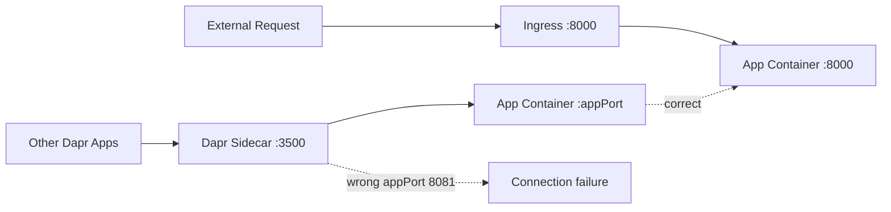

---
hide:
  - toc
content_sources:
  diagrams:
    - id: architecture
      type: flowchart
      source: mslearn-adapted
      based_on:
        - https://learn.microsoft.com/azure/container-apps/dapr-overview
        - https://learn.microsoft.com/azure/container-apps/dapr-components
---

# Dapr Integration Troubleshooting Lab

Diagnose and fix Dapr sidecar port misconfiguration issues in Azure Container Apps.

## Lab Metadata

| Attribute | Value |
|---|---|
| Difficulty | Intermediate |
| Estimated Duration | 25-35 minutes |
| Tier | Consumption |
| Failure Mode | Dapr sidecar cannot communicate with the app because `appPort` is misconfigured |
| Skills Practiced | Dapr configuration review, sidecar diagnostics, port alignment validation |

## 1) Background

This lab starts with a working Dapr configuration: Dapr is enabled, `appId` is set, and `appPort` matches the application listening port. The trigger changes Dapr `appPort` from 8000 to 8081, so the sidecar keeps running but can no longer forward service invocation traffic to the application process.

The key troubleshooting lesson is that ingress `targetPort` and Dapr `appPort` are separate settings. An app can still be reachable through ingress while Dapr-to-app communication is broken.

### Architecture

<!-- diagram-id: architecture -->


### Dapr App Port Configuration

| Setting | Description | Impact if Wrong |
|---|---|---|
| `appPort` | Port the Dapr sidecar uses to call the app | Service invocation fails |
| `appId` | Unique identifier for Dapr service discovery | Other apps cannot find this service |
| `appProtocol` | HTTP or gRPC | Protocol mismatch errors |

## 2) Hypothesis

**IF** Dapr is enabled but `appPort` is changed from the app's real listening port 8000 to 8081, **THEN** Dapr sidecar health and service invocation checks will fail even though the app configuration still shows Dapr enabled.

| Variable | Control State | Experimental State |
|---|---|---|
| Dapr `appPort` | 8000 | 8081 |
| Dapr sidecar to app communication | Succeeds | Connection refused or unreachable |
| `verify.sh` result | PASS | FAIL |
| Ingress behavior | Can still target the app separately | May still differ from Dapr failure mode |

## 3) Runbook

### Deploy baseline infrastructure

Prerequisites:

- Azure CLI with the Container Apps extension
- Basic understanding of Dapr concepts such as sidecars, `appId`, and `appPort`

```bash
az extension add --name containerapp --upgrade
az login

export RG="rg-aca-lab-dapr"
export LOCATION="koreacentral"

az group create --name "$RG" --location "$LOCATION"

az deployment group create \
    --name "lab-dapr" \
    --resource-group "$RG" \
    --template-file "./labs/dapr-integration/infra/main.bicep" \
    --parameters baseName="labdapr"
```

Expected output:

- Resource group creation succeeds.
- Deployment completes successfully with Dapr enabled on the app.

### Capture deployment outputs

```bash
export APP_NAME="$(az deployment group show \
    --resource-group "$RG" \
    --name "lab-dapr" \
    --query "properties.outputs.containerAppName.value" \
    --output tsv)"

export ENVIRONMENT_NAME="$(az deployment group show \
    --resource-group "$RG" \
    --name "lab-dapr" \
    --query "properties.outputs.containerAppsEnvironmentName.value" \
    --output tsv)"
```

Expected output:

- Commands return no console output.
- Variables resolve to the app and environment names.

### Verify baseline Dapr configuration

```bash
az containerapp show \
    --name "$APP_NAME" \
    --resource-group "$RG" \
    --query "properties.configuration.dapr" \
    --output json
```

Expected output:

```json
{
  "appId": "dapr-labdapr-xxxxxx",
  "appPort": 8000,
  "appProtocol": "http",
  "enabled": true
}
```

### Trigger the failure

```bash
./labs/dapr-integration/trigger.sh
```

The trigger uses:

```bash
az containerapp update \
    --name "$APP_NAME" \
    --resource-group "$RG" \
    --dapr-app-port 8081
```

Expected output:

- The script prints `Changed Dapr appPort to 8081 to break service invocation.`
- A new revision applies the broken Dapr port value.

### Observe the broken state

```bash
az containerapp show \
    --name "$APP_NAME" \
    --resource-group "$RG" \
    --query "properties.configuration.dapr" \
    --output json

az containerapp logs show \
    --name "$APP_NAME" \
    --resource-group "$RG" \
    --type system \
    --tail 50
```

Expected output:

```json
{
  "appId": "dapr-labdapr-xxxxxx",
  "appPort": 8081,
  "appProtocol": "http",
  "enabled": true
}
```

Look for errors such as `connection refused`, `port unreachable`, or health probe failures on port 8081.

### Verify failure and fix the configuration

```bash
./labs/dapr-integration/verify.sh
```

Before the fix, the verification script should fail with output like:

```text
FAIL: Dapr appPort is '8081'; expected 8000
```

Restore the correct port:

```bash
az containerapp update \
    --name "$APP_NAME" \
    --resource-group "$RG" \
    --dapr-app-port 8000
```

Useful debugging commands:

```bash
az containerapp show --name "$APP_NAME" --resource-group "$RG" --query "properties.configuration.dapr"
az containerapp show --name "$APP_NAME" --resource-group "$RG" --query "properties.configuration.ingress.targetPort"
az containerapp logs show --name "$APP_NAME" --resource-group "$RG" --type system --tail 100
az containerapp env dapr-component list --name "$ENVIRONMENT_NAME" --resource-group "$RG" --output table
```

Expected output:

- `appPort` returns to 8000.
- Sidecar-to-app communication succeeds again.

### Verify recovery

```bash
./labs/dapr-integration/verify.sh
```

Expected output:

- `az containerapp exec` against `http://127.0.0.1:3500/v1.0/healthz` succeeds.
- The script prints `PASS: Dapr is enabled, appPort is correct, and the health endpoint responded successfully.`

## 4) Experiment Log

| Step | Action | Expected | Actual | Pass/Fail |
|---|---|---|---|---|
| 1 | Deploy baseline infrastructure | Dapr-enabled app deploys successfully | | |
| 2 | Check Dapr configuration | `appPort` is 8000 and Dapr is enabled | | |
| 3 | Run `trigger.sh` | `appPort` changes to 8081 | | |
| 4 | Review Dapr config and logs | Port mismatch evidence appears | | |
| 5 | Run `verify.sh` before fix | Script fails because `appPort` is wrong | | |
| 6 | Restore `--dapr-app-port 8000` | Update succeeds | | |
| 7 | Run `verify.sh` after fix | Script passes | | |

## Expected Evidence

### Before trigger

| Evidence Source | Expected State |
|---|---|
| `az containerapp show --query "properties.configuration.dapr"` | `appPort: 8000`, `enabled: true` |
| System logs | No Dapr connection errors |
| `./labs/dapr-integration/verify.sh` | PASS |

### During incident

| Evidence Source | Expected State |
|---|---|
| Dapr config | `appPort: 8081` |
| System logs | Connection refused, unreachable port, or health probe failure evidence |
| `./labs/dapr-integration/verify.sh` | FAIL |

### After fix

| Evidence Source | Expected State |
|---|---|
| Dapr config | `appPort: 8000`, `enabled: true` |
| Sidecar health endpoint | Responds successfully |
| `./labs/dapr-integration/verify.sh` | PASS |

## Clean Up

```bash
az group delete --name "$RG" --yes --no-wait
```

## Related Playbook

- [Dapr Sidecar or Component Failure](../playbooks/platform-features/dapr-sidecar-or-component-failure.md)

## See Also

- [Probe Failure and Slow Start](../playbooks/startup-and-provisioning/probe-failure-and-slow-start.md)
- [Traffic Routing and Canary Failure Lab](./traffic-routing-canary.md)

## Sources

- [Dapr integration with Azure Container Apps](https://learn.microsoft.com/azure/container-apps/dapr-overview)
- [Dapr components in Azure Container Apps](https://learn.microsoft.com/azure/container-apps/dapr-components)
